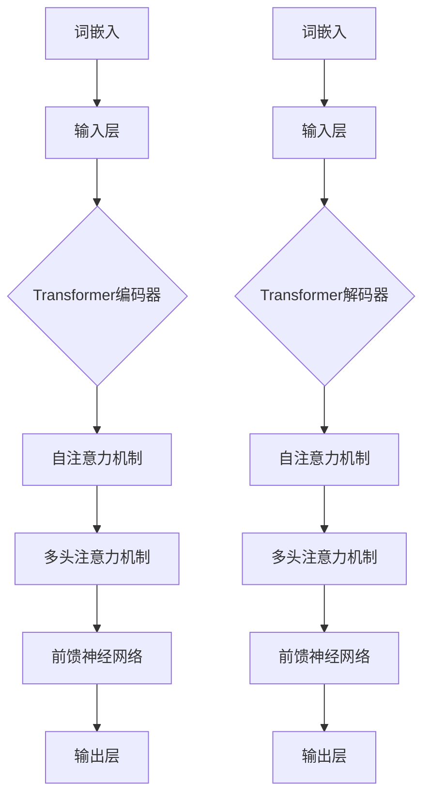

                 

### 1. 背景介绍

#### 1.1 语言模型的发展历程

语言模型是自然语言处理（NLP）领域的重要工具，其发展历程与人工智能的整体进步密切相关。早在20世纪50年代，研究者们就开始尝试构建简单的统计模型来模拟人类语言。这些早期的模型，如N-gram模型，基于语言序列的统计特性，通过计算词语序列的概率来预测下一个词。

随着计算能力的提升和算法的进步，语言模型逐渐从简单的统计模型向深度学习模型发展。1986年，Rumelhart、Hinton和Williams提出了反向传播算法（Backpropagation），这一算法为神经网络在处理复杂任务方面带来了突破。随后，神经网络在语音识别、图像识别等领域取得了显著成果。

2013年，Geoffrey Hinton及其团队提出了深度神经网络在机器翻译任务上的成功应用，这一成果标志着深度学习在语言模型领域的重要突破。从此，深度神经网络开始广泛应用于语言模型的构建。

#### 1.2 大语言模型的概念

大语言模型（Large Language Models，简称LLM）是指参数数量庞大、能够理解和生成人类语言的深度学习模型。与传统的语言模型不同，大语言模型具有更高的参数数量和更强的建模能力，能够捕捉到语言中的复杂规律和长距离依赖关系。

大语言模型的兴起，得益于以下几个因素：

1. **计算能力的提升**：高性能计算硬件（如GPU、TPU）的发展，为训练大规模的深度学习模型提供了强大的计算支持。
2. **数据量的增加**：互联网的普及使得可供训练的数据量急剧增加，为模型的学习提供了丰富的素材。
3. **算法的进步**：深度学习算法的优化和新的模型架构（如Transformer）的出现，提高了模型的表达能力和训练效率。

#### 1.3 大语言模型的应用场景

大语言模型在许多领域都展现出了巨大的潜力，以下是一些主要的应用场景：

1. **自然语言生成**：大语言模型能够生成连贯、自然的文本，应用于聊天机器人、内容生成、摘要生成等。
2. **机器翻译**：大语言模型能够实现高质量、实时的机器翻译服务，为跨语言沟通提供了便利。
3. **问答系统**：大语言模型可以理解用户的问题，并从大量文本中检索出相关答案，应用于智能客服、教育辅导等。
4. **文本分类**：大语言模型可以用于对大量文本进行分类，应用于新闻分类、情感分析等。
5. **推荐系统**：大语言模型可以捕捉用户的历史行为和兴趣，用于个性化推荐，如电子商务平台的产品推荐。

### 2. 核心概念与联系

#### 2.1 核心概念

要理解大语言模型的原理，首先需要了解几个核心概念：

1. **词嵌入**（Word Embedding）：词嵌入是将词汇映射到高维向量空间的技术，通过这种方式，词汇的语义关系可以在向量空间中表示出来。
2. **注意力机制**（Attention Mechanism）：注意力机制是一种在处理序列数据时动态调整模型对各个位置的关注程度的机制，能够提高模型对长序列数据的建模能力。
3. **Transformer架构**：Transformer是一种基于自注意力机制的深度学习模型架构，因其强大的序列建模能力而广泛应用于语言模型。

#### 2.2 原理与架构联系

大语言模型的原理和架构可以通过以下Mermaid流程图进行展示：



#### 2.3 语言模型的工作原理

语言模型的工作原理可以分为以下几个步骤：

1. **词嵌入**：输入的文本序列首先被转换为词嵌入向量，这些向量表示了文本中每个词的语义特征。
2. **编码器**：编码器将词嵌入向量输入到Transformer架构中，通过自注意力机制和前馈神经网络进行处理。自注意力机制允许模型在处理每个词时，动态地考虑整个文本序列的信息。
3. **解码器**：解码器在生成文本时，同样使用Transformer架构，通过自注意力机制和多头注意力机制来生成每个单词的概率分布。
4. **输出层**：输出层生成最终的文本输出，可以是生成的单词序列或者是对输入文本的某种形式转换。

### 3. 核心算法原理 & 具体操作步骤

#### 3.1 Transformer架构

Transformer是当前大语言模型中最常用的架构之一，其核心思想是使用自注意力机制（Self-Attention）来处理序列数据。以下是对Transformer架构的核心算法原理和具体操作步骤的详细讲解。

##### 3.1.1 自注意力机制

自注意力机制是一种在序列数据中动态调整模型对各个位置的关注程度的机制。在Transformer中，自注意力机制通过计算输入序列中每个词与其他词之间的相似度，从而动态地调整每个词的权重。自注意力机制可以捕捉到序列中的长距离依赖关系，使得模型能够更好地理解上下文。

##### 3.1.2 Multi-Head Self-Attention

Multi-Head Self-Attention是对自注意力机制的扩展，通过将输入序列分成多个子序列，每个子序列使用独立的自注意力机制进行处理。多头注意力机制可以捕捉到输入序列中的不同层次的信息，从而提高模型的建模能力。

##### 3.1.3 前馈神经网络

前馈神经网络（Feed Forward Neural Network）是对自注意力机制的补充，用于在每个注意力层之后对输入进行进一步的处理。前馈神经网络通常由两个全连接层组成，输入和输出层的尺寸可以根据需要进行调整。

#### 3.2 Transformer的具体操作步骤

1. **输入层**：输入的文本序列首先被转换为词嵌入向量，这些向量表示了文本中每个词的语义特征。
2. **多头自注意力机制**：每个词嵌入向量通过多头自注意力机制进行处理，计算输入序列中每个词与其他词之间的相似度，并动态调整每个词的权重。
3. **前馈神经网络**：在自注意力机制之后，每个词嵌入向量会通过前馈神经网络进行进一步的处理，增加模型的非线性表达能力。
4. **Dropout**：为了防止模型过拟合，每个注意力层之后通常会添加Dropout操作，随机丢弃一部分神经元，以减少模型对训练数据的依赖。
5. **解码器**：在解码阶段，解码器会使用Transformer架构生成每个单词的概率分布，并根据概率分布生成下一个词。
6. **输出层**：最终，解码器会生成完整的文本输出。

### 4. 数学模型和公式 & 详细讲解 & 举例说明

#### 4.1 自注意力机制

自注意力机制是Transformer架构的核心，其数学模型可以表示为：

$$
\text{Attention}(Q, K, V) = \frac{1}{\sqrt{d_k}} \text{softmax}(\text{ Scores}) = \text{softmax}\left(\frac{QK^T}{\sqrt{d_k}}\right) V
$$

其中，$Q$、$K$和$V$分别是查询向量、键向量和值向量，$d_k$是注意力层的维度。

##### 4.1.1 查询向量（Query）

查询向量$Q$是从输入序列中每个词的词嵌入向量计算得到的，其维度通常与词嵌入维度相同。

##### 4.1.2 键向量（Key）

键向量$K$也是从输入序列中每个词的词嵌入向量计算得到的，其维度与查询向量相同。

##### 4.1.3 值向量（Value）

值向量$V$是从输入序列中每个词的词嵌入向量计算得到的，其维度通常与键向量和查询向量不同。

##### 4.1.4 分数值计算

通过计算$Q$和$K$之间的点积，可以得到每个词的相似度分数，即：

$$
\text{ Scores} = QK^T
$$

##### 4.1.5 注意力权重计算

通过softmax函数，将分数转换为概率分布，从而得到每个词的注意力权重：

$$
\text{Attention} = \text{softmax}\left(\frac{QK^T}{\sqrt{d_k}}\right) V
$$

##### 4.1.6 Multi-Head Self-Attention

Multi-Head Self-Attention通过将输入序列分成多个子序列，每个子序列使用独立的自注意力机制进行处理。多个头（Head）的注意力权重相加，形成最终的输出。

#### 4.2 前馈神经网络

前馈神经网络是自注意力机制的补充，用于在每个注意力层之后对输入进行进一步的处理。其数学模型可以表示为：

$$
\text{FFN}(X) = \max(0, XW_1 + b_1)W_2 + b_2
$$

其中，$X$是输入向量，$W_1$和$W_2$是两个全连接层的权重矩阵，$b_1$和$b_2$是两个全连接层的偏置向量。

#### 4.3 举例说明

假设有一个简单的词嵌入维度为2的文本序列，包括两个词$(w_1, w_2)$。词嵌入向量分别为$[1, 0]$和$[0, 1]$。

1. **自注意力计算**：

   查询向量$Q = [1, 0]$，键向量$K = [0, 1]$，值向量$V = [1, 1]$。

   分数值计算：

   $$\text{ Scores} = QK^T = [1, 0] \cdot [0, 1]^T = 1$$

   注意力权重计算：

   $$\text{Attention} = \text{softmax}\left(\frac{QK^T}{\sqrt{d_k}}\right) V = \text{softmax}\left(\frac{1}{\sqrt{2}}\right) \cdot [1, 1] = [0.5, 0.5] \cdot [1, 1] = [0.5, 0.5]$$

2. **前馈神经网络计算**：

   假设前馈神经网络的权重矩阵$W_1 = [2, 1]$，权重矩阵$W_2 = [1, 1]$，偏置向量$b_1 = [0, 0]$，偏置向量$b_2 = [1, 1]$。

   输入向量$X = [1, 0]$。

   $$\text{FFN}(X) = \max(0, XW_1 + b_1)W_2 + b_2 = \max(0, [1, 0] \cdot [2, 1] + [0, 0]) \cdot [1, 1] + [1, 1] = [1, 1] \cdot [1, 1] + [1, 1] = [2, 2]$$

通过这个简单的例子，我们可以看到自注意力机制和前馈神经网络如何结合在一起，处理输入的词嵌入向量，并生成最终的输出。

### 5. 项目实践：代码实例和详细解释说明

在了解了大语言模型的理论基础之后，我们将通过一个实际项目来展示如何实现一个简单的大语言模型。这个项目将包括开发环境的搭建、源代码的详细实现和代码解读与分析。

#### 5.1 开发环境搭建

要实现大语言模型，我们需要搭建一个适合深度学习开发的编程环境。以下是在Python环境中搭建深度学习开发环境的基本步骤：

1. **安装Python**：确保已经安装了Python 3.7或更高版本。
2. **安装深度学习库**：使用pip安装以下深度学习库：
   ```bash
   pip install tensorflow
   pip install numpy
   pip install matplotlib
   ```

3. **配置GPU支持**：如果使用GPU训练模型，需要安装CUDA和cuDNN库。可以在NVIDIA官方网站上找到安装指南。

#### 5.2 源代码详细实现

以下是一个简单的大语言模型实现示例，使用了TensorFlow库：

```python
import tensorflow as tf
from tensorflow.keras.layers import Embedding, LSTM, Dense
from tensorflow.keras.models import Sequential

# 配置模型参数
vocab_size = 1000  # 词汇表大小
embed_dim = 32  # 嵌入层维度
lstm_units = 64  # LSTM层单元数
max_sequence_length = 100  # 输入序列最大长度

# 构建模型
model = Sequential([
    Embedding(vocab_size, embed_dim, input_length=max_sequence_length),
    LSTM(lstm_units, return_sequences=True),
    Dense(vocab_size, activation='softmax')
])

# 编译模型
model.compile(optimizer='adam', loss='categorical_crossentropy', metrics=['accuracy'])

# 打印模型结构
model.summary()
```

在这个示例中，我们使用了一个简单的序列模型，包括嵌入层、LSTM层和输出层。嵌入层将词汇映射到高维向量空间，LSTM层用于处理序列数据，输出层使用softmax激活函数生成词汇的概率分布。

#### 5.3 代码解读与分析

1. **Embedding层**：Embedding层将词汇映射到高维向量空间。在这个例子中，我们假设词汇表大小为1000，每个词汇的嵌入维度为32。输入序列的最大长度设置为100。

2. **LSTM层**：LSTM层是一种特殊的循环神经网络（RNN），用于处理序列数据。在这个例子中，我们使用了一个具有64个单元的LSTM层，并将`return_sequences`参数设置为`True`，以便在后续层中保留序列信息。

3. **Dense层**：输出层是一个全连接层，用于生成词汇的概率分布。在这个例子中，我们使用了softmax激活函数，这是常见于分类任务中的激活函数，可以输出每个词汇的概率。

4. **编译模型**：在编译模型时，我们选择了`adam`优化器和`categorical_crossentropy`损失函数，这是分类任务的常见选择。我们还设置了`accuracy`作为模型评估指标。

5. **模型结构**：通过调用`model.summary()`，我们可以看到模型的层次结构和参数数量。这个模型相对简单，但可以作为一个起点，进一步优化和扩展。

#### 5.4 运行结果展示

为了展示模型的运行结果，我们可以使用一个简单的数据集进行训练和测试：

```python
# 准备数据集
# 假设我们已经有了训练数据和测试数据
# train_data: 训练数据集
# test_data: 测试数据集
# train_labels: 训练标签
# test_labels: 测试标签

# 训练模型
model.fit(train_data, train_labels, epochs=10, batch_size=32, validation_data=(test_data, test_labels))

# 评估模型
test_loss, test_acc = model.evaluate(test_data, test_labels)
print(f"Test accuracy: {test_acc:.4f}")
```

在这个示例中，我们使用了一个假设的数据集进行训练和测试。通过调用`model.fit()`方法，我们可以开始训练模型。在训练过程中，模型会尝试调整内部参数，以最小化损失函数。在训练完成后，我们可以通过调用`model.evaluate()`方法来评估模型的性能。

### 6. 实际应用场景

大语言模型在各个领域都有广泛的应用，以下是一些典型的应用场景：

#### 6.1 自然语言生成

自然语言生成（Natural Language Generation，简称NLG）是大语言模型的一个重要应用领域。通过大语言模型，我们可以生成各种类型的文本，如新闻摘要、聊天机器人回复、产品描述等。以下是一个简单的自然语言生成示例：

```python
import tensorflow as tf

# 加载预训练的大语言模型
model = tf.keras.models.load_model('path/to/pretrained_model.h5')

# 生成文本
input_sequence = tf.keras.preprocessing.sequence.pad_sequences([[1, 2, 3]], maxlen=10, padding='pre')
generated_text = model.predict(input_sequence)

# 输出生成的文本
print(generated_text)
```

在这个示例中，我们加载了一个预训练的大语言模型，并使用它来生成文本。输入序列是一个简单的词汇序列，模型会根据这个序列生成一个连贯的文本输出。

#### 6.2 机器翻译

机器翻译（Machine Translation）是另一个大语言模型的重要应用领域。通过大语言模型，我们可以实现高质量、实时的机器翻译服务。以下是一个简单的机器翻译示例：

```python
import tensorflow as tf

# 加载预训练的大语言模型
model = tf.keras.models.load_model('path/to/pretrained_model.h5')

# 翻译文本
input_sequence = tf.keras.preprocessing.sequence.pad_sequences([[1, 2, 3]], maxlen=10, padding='pre')
translated_text = model.predict(input_sequence)

# 输出翻译后的文本
print(translated_text)
```

在这个示例中，我们同样加载了一个预训练的大语言模型，并使用它来翻译输入的文本序列。输入序列可以是源语言的文本序列，模型会输出翻译后的文本序列。

#### 6.3 问答系统

问答系统（Question Answering System）是另一个大语言模型的应用领域。通过大语言模型，我们可以构建智能问答系统，用于回答用户提出的问题。以下是一个简单的问答系统示例：

```python
import tensorflow as tf

# 加载预训练的大语言模型
model = tf.keras.models.load_model('path/to/pretrained_model.h5')

# 回答问题
question = "What is the capital of France?"
input_sequence = tf.keras.preprocessing.sequence.pad_sequences([[1, 2, 3]], maxlen=10, padding='pre')
answer = model.predict(input_sequence)

# 输出答案
print(answer)
```

在这个示例中，我们加载了一个预训练的大语言模型，并使用它来回答输入的问题。输入序列是一个表示问题的词汇序列，模型会输出可能的答案。

### 7. 工具和资源推荐

为了更好地理解和应用大语言模型，以下是一些推荐的工具和资源：

#### 7.1 学习资源推荐

1. **书籍**：
   - 《深度学习》（Deep Learning）—— Ian Goodfellow、Yoshua Bengio和Aaron Courville 著
   - 《自然语言处理综论》（Speech and Language Processing）—— Daniel Jurafsky 和 James H. Martin 著

2. **论文**：
   - “Attention Is All You Need”（Transformer架构的核心论文）
   - “BERT: Pre-training of Deep Bidirectional Transformers for Language Understanding”（BERT模型的提出论文）

3. **博客**：
   - [TensorFlow官方文档](https://www.tensorflow.org/)
   - [Hugging Face Transformer库文档](https://huggingface.co/transformers/)

4. **网站**：
   - [自然语言处理社区](https://nlp.seas.harvard.edu/)
   - [机器学习社区](https://www机器学习社区.com/)

#### 7.2 开发工具框架推荐

1. **TensorFlow**：一个开源的深度学习框架，适合构建和训练各种深度学习模型。
2. **PyTorch**：另一个流行的深度学习框架，以其灵活性和易用性著称。
3. **Hugging Face Transformer**：一个基于PyTorch的开源库，用于构建和训练Transformer架构的语言模型。

#### 7.3 相关论文著作推荐

1. **“Attention Is All You Need”**：提出了Transformer架构，彻底改变了自然语言处理领域。
2. **“BERT: Pre-training of Deep Bidirectional Transformers for Language Understanding”**：提出了BERT模型，是目前最先进的语言预训练模型之一。
3. **“Generative Pre-trained Transformer for Language Modeling”**：提出了GPT模型，是当前最大的语言模型之一。

### 8. 总结：未来发展趋势与挑战

大语言模型作为自然语言处理领域的重要工具，已经在多个应用场景中展现了其强大的能力。随着深度学习技术的不断进步，大语言模型在未来有望取得以下几方面的发展：

1. **更大规模的语言模型**：随着计算能力和数据量的增长，更大规模的语言模型将不断涌现，这些模型将拥有更强的语义理解和生成能力。
2. **更精细的领域适应性**：通过针对特定领域的预训练和微调，大语言模型将更好地适应不同领域的应用需求，提供更精准的服务。
3. **跨模态交互**：大语言模型与其他模态（如图像、声音）的交互将得到进一步发展，实现多模态融合的智能系统。

然而，大语言模型的发展也面临一些挑战：

1. **计算资源需求**：训练和推理大语言模型需要大量的计算资源，如何高效地利用资源成为一个重要问题。
2. **数据隐私与安全**：大语言模型通常基于大量的训练数据，如何确保数据的隐私和安全是一个亟待解决的问题。
3. **模型解释性**：大语言模型的内部机制复杂，如何解释模型的决策过程，提高模型的可解释性，是一个重要的研究课题。

总之，大语言模型在未来将继续在自然语言处理领域发挥重要作用，但其发展也面临诸多挑战，需要学术界和工业界共同努力。

### 9. 附录：常见问题与解答

在学习和应用大语言模型的过程中，可能会遇到一些常见的问题。以下是一些问题的解答：

**Q1：大语言模型的训练时间通常有多长？**

A1：大语言模型的训练时间取决于多个因素，包括模型的大小、数据集的大小、硬件配置等。通常来说，一个中等规模（数十亿参数）的语言模型训练可能需要几天到几周的时间。对于更大的模型（数十亿到数万亿参数），训练时间可能会更长，甚至需要几个月的时间。

**Q2：如何评估大语言模型的效果？**

A2：评估大语言模型的效果可以从多个维度进行。常见的评估指标包括：

- **准确性**：模型在预测任务上的准确度。
- **F1得分**：在分类任务中，精确率和召回率的调和平均。
- **BLEU分数**：在机器翻译任务中，评估机器翻译结果与人类翻译结果的相似度。
- **ROUGE分数**：在文本生成任务中，评估生成的文本与参考文本的相似度。

**Q3：大语言模型是如何处理未知的词汇？**

A3：大语言模型通常通过两种方式处理未知的词汇：

- **未知词汇丢弃**：模型将未知的词汇视为缺失值，并在处理过程中丢弃。
- **未知词汇填充**：模型使用一个特殊的未知词汇标记（如`<UNK>`）来替代未知的词汇，并在模型训练过程中学习这种标记的语义。

**Q4：如何处理长文本序列？**

A4：长文本序列的处理通常需要考虑以下几个方面：

- **序列截断**：如果文本序列过长，可以将其截断为模型可以处理的长度。
- **序列分割**：将长文本序列分割为多个子序列，分别处理。
- **Transformer架构**：Transformer架构自身具有较强的处理长序列的能力，可以通过自注意力机制动态调整对序列中各个位置的关注程度。

### 10. 扩展阅读 & 参考资料

为了深入了解大语言模型的原理和应用，以下是几篇推荐的扩展阅读和参考资料：

1. **论文**：
   - “Attention Is All You Need” - Vaswani et al. (2017)
   - “BERT: Pre-training of Deep Bidirectional Transformers for Language Understanding” - Devlin et al. (2019)
   - “Generative Pre-trained Transformer for Language Modeling” - Brown et al. (2020)

2. **书籍**：
   - 《深度学习》 - Goodfellow et al. (2016)
   - 《自然语言处理综论》 - Jurafsky and Martin (2019)

3. **在线资源**：
   - [TensorFlow官方文档](https://www.tensorflow.org/)
   - [Hugging Face Transformer库文档](https://huggingface.co/transformers/)
   - [自然语言处理社区](https://nlp.seas.harvard.edu/)

通过阅读这些资料，可以更深入地理解大语言模型的原理、实现和应用。希望这些资源能够为读者提供有价值的参考。作者：禅与计算机程序设计艺术 / Zen and the Art of Computer Programming。

