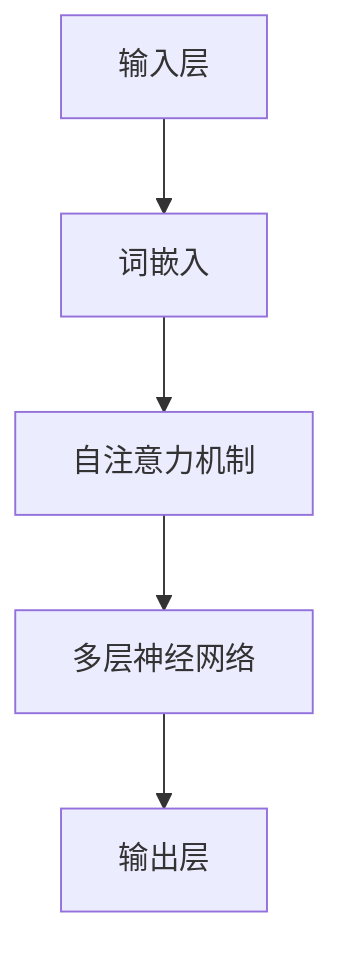

                 

### 1. 背景介绍

大语言模型作为一种先进的人工智能技术，近年来在自然语言处理领域取得了显著的进展。随着互联网和大数据技术的发展，人们对于语言信息的处理需求日益增长，这推动了大语言模型的诞生和发展。大语言模型通过学习海量语料库，可以模拟人类的语言表达能力和理解能力，从而在智能客服、内容生成、机器翻译等众多领域发挥了重要作用。

大语言模型的发展历程可以追溯到上世纪80年代的统计语言模型。当时，研究人员开始尝试使用统计方法来预测单词序列，并提出了基于N元语法（N-gram）的模型。然而，这种模型在处理长文本时效果不佳，因为其依赖于前N个词的历史信息，无法捕捉长距离的依赖关系。为了解决这一问题，研究人员逐渐转向深度学习技术，尤其是神经网络模型。

2002年，Dan Jurafsky和James H. Martin提出了基于神经网络的语言模型（NNLM），这是早期深度学习在自然语言处理领域的重要应用。随着计算机算力的提升和海量数据资源的积累，深度学习在自然语言处理领域的应用日益广泛，逐渐发展出了更为复杂和强大的模型。

2013年，Alex Graves等人提出了基于循环神经网络（RNN）的序列模型，并将其应用于语言模型训练。RNN能够捕捉长距离依赖关系，比N元语法模型有更好的表现。然而，RNN在处理长序列时仍存在梯度消失和梯度爆炸的问题。

为了克服这些挑战，2014年， Hochreiter和Schmidhuber提出了长短期记忆网络（LSTM），这是一种特殊的RNN结构，能够有效缓解梯度消失问题。同年，Ilya Sutskever等人提出了基于LSTM的序列到序列（Seq2Seq）模型，并将其应用于机器翻译任务，取得了突破性的成果。

2017年，Google推出了Transformer模型，这是大语言模型发展的重要里程碑。Transformer模型引入了自注意力机制（Self-Attention），能够同时考虑输入序列中的所有信息，避免了传统RNN结构的序列顺序依赖问题。此后，Transformer模型及其变种，如BERT、GPT等，在多个自然语言处理任务中取得了优异的成绩。

目前，大语言模型已经成为了自然语言处理领域的研究热点和应用重点。随着技术的不断进步，大语言模型在语言理解、文本生成、对话系统等方面的能力将不断提高，为人类社会带来更多便利和创新。

### 2. 核心概念与联系

#### 2.1 语言模型的概念

语言模型（Language Model）是一种统计模型，用于预测文本序列的概率。它的核心目标是根据前文的信息来预测下一个单词或词组。一个基本的语言模型可以表示为概率分布：

\[ P(w_n | w_{n-1}, w_{n-2}, \ldots, w_1) \]

其中，\( w_n \)表示下一个待预测的单词或词组，\( w_{n-1}, w_{n-2}, \ldots, w_1 \)表示历史文本信息。

语言模型的主要任务包括：

1. **文本生成**：根据给定的前文信息生成后续的文本。
2. **概率计算**：计算某个特定文本序列的概率。
3. **序列预测**：预测下一个单词或词组。

#### 2.2 大语言模型的特点

大语言模型（Large Language Model）是指具有海量参数和大规模训练数据集的深度学习模型。与传统的语言模型相比，大语言模型具有以下特点：

1. **海量参数**：大语言模型通常具有数亿至数十亿个参数，这使得模型能够捕捉更复杂的语言规律。
2. **大规模训练数据**：大语言模型使用大规模的语料库进行训练，这有助于提高模型的泛化能力和准确性。
3. **高效计算**：通过分布式计算和优化算法，大语言模型能够在合理的时间内完成训练和推理。
4. **自适应能力**：大语言模型能够根据不同的应用场景进行自适应调整，例如，通过微调（Fine-Tuning）来适应特定任务的需求。

#### 2.3 语言模型的架构

大语言模型的架构通常包括以下几个关键组件：

1. **输入层**：接收文本序列的输入，并将其转换为模型可以处理的格式，如词嵌入（Word Embedding）。
2. **隐藏层**：包含多个神经网络层，用于提取文本的特征和上下文信息。这些层通常采用深度学习架构，如循环神经网络（RNN）、卷积神经网络（CNN）或Transformer。
3. **输出层**：根据隐藏层的信息生成预测结果，如下一个单词的概率分布。

#### 2.4 自注意力机制

自注意力机制（Self-Attention）是Transformer模型的核心组件，它允许模型在处理序列数据时同时关注序列中的所有信息。自注意力机制通过计算每个词与序列中其他词的相似度，为每个词分配不同的权重，从而提高了模型捕捉长距离依赖关系的能力。

自注意力机制的计算过程如下：

1. **计算查询（Query）、键（Key）和值（Value）**：每个词在输入层被映射为查询（Query）、键（Key）和值（Value）三个向量。
2. **相似度计算**：计算每个查询与每个键的相似度，通常使用点积（Dot Product）或余弦相似度。
3. **加权求和**：根据相似度计算得到的权重，对每个值进行加权求和，生成新的隐藏状态。

自注意力机制的引入，使得大语言模型能够更好地处理长文本，并提高了模型的效率和性能。

#### 2.5 语言模型的应用场景

大语言模型在自然语言处理领域有广泛的应用，主要包括以下几个方面：

1. **文本生成**：大语言模型可以生成高质量的文章、摘要、对话等，广泛应用于内容生成、创意写作等领域。
2. **机器翻译**：大语言模型可以用于机器翻译任务，将一种语言翻译成另一种语言，如Google翻译。
3. **问答系统**：大语言模型可以用于构建问答系统，如搜索引擎、智能客服等，提供准确和自然的回答。
4. **情感分析**：大语言模型可以用于情感分析任务，如判断文本的情感倾向、分析用户评论等。
5. **语音识别**：大语言模型可以与语音识别技术结合，实现语音到文本的转换。

下面是一个Mermaid流程图，展示了大语言模型的核心概念和架构：



### 3. 核心算法原理 & 具体操作步骤

#### 3.1 基础概念

在大语言模型的算法中，几个核心概念至关重要：词嵌入（Word Embedding）、自注意力（Self-Attention）和Transformer架构。以下将详细解释这些概念，并描述具体的操作步骤。

##### 3.1.1 词嵌入

词嵌入是将文本中的每个单词映射到固定维度的向量表示。这种表示方法不仅考虑了单词的语义信息，还通过计算向量之间的距离来反映单词之间的关系。词嵌入的实现通常使用词向量模型，如Word2Vec、GloVe等。

具体步骤如下：

1. **初始化词嵌入矩阵**：初始化一个大小为\( V \times d \)的矩阵\( W \)，其中\( V \)是词汇表的大小，\( d \)是词向量的维度。每个单词对应矩阵中的一个行向量。
2. **计算词嵌入向量**：对于输入的文本序列，将其中的每个单词替换为其对应的词嵌入向量。

##### 3.1.2 自注意力

自注意力是一种计算文本序列中各个词之间相互依赖关系的机制。在自注意力机制中，每个词都会被赋予不同的权重，以反映其在序列中的重要性。具体步骤如下：

1. **计算查询（Query）、键（Key）和值（Value）**：对于输入的词向量序列，分别计算每个词的查询（Query）、键（Key）和值（Value）向量。通常，这三种向量共享相同的权重矩阵。
   \[ 
   Q = W_Q \cdot X, \quad K = W_K \cdot X, \quad V = W_V \cdot X 
   \]
   其中，\( X \)是词向量序列，\( W_Q, W_K, W_V \)是对应的权重矩阵。
2. **计算相似度**：计算每个查询与每个键之间的相似度，通常使用点积或余弦相似度。
   \[ 
   \text{similarity}(Q_i, K_j) = \frac{Q_i \cdot K_j}{\sqrt{d_k}} 
   \]
3. **加权求和**：根据相似度计算得到的权重，对每个值进行加权求和，生成新的隐藏状态。
   \[ 
   \text{contextual\_vector}_i = \sum_{j=1}^{N} \text{softmax}(\text{similarity}(Q_i, K_j)) \cdot V_j 
   \]

##### 3.1.3 Transformer架构

Transformer是一种基于自注意力机制的序列到序列（Seq2Seq）模型。其核心思想是通过多头自注意力机制和多层前馈网络，捕捉文本序列中的长距离依赖关系。

具体步骤如下：

1. **编码器（Encoder）**：编码器由多个自注意力层和前馈网络层组成。每个自注意力层负责计算文本序列中各个词之间的依赖关系，并将这些关系编码到隐藏状态中。前馈网络层则对隐藏状态进行非线性变换，增强模型的表示能力。
2. **解码器（Decoder）**：解码器与编码器类似，也由多个自注意力层和前馈网络层组成。解码器首先生成一个初始的隐藏状态，然后逐词解码，每个词的隐藏状态都会与编码器的输出进行交互，以生成最终的输出序列。

#### 3.2 操作步骤

以下是一个简化的Transformer模型的训练和推理步骤：

##### 3.2.1 训练步骤

1. **初始化模型参数**：初始化编码器和解码器的权重参数。
2. **编码器输入**：将输入的文本序列编码为词嵌入向量，并送入编码器的第一个自注意力层。
3. **自注意力层**：在每个自注意力层中，计算查询、键和值，并根据相似度计算得到权重，加权求和生成新的隐藏状态。
4. **前馈网络层**：对隐藏状态进行非线性变换，增强模型的表示能力。
5. **重复步骤3和4**：重复上述步骤，直到编码器的最后一个自注意力层。
6. **解码器输入**：将编码器的输出作为解码器的初始隐藏状态，并送入解码器的第一个自注意力层。
7. **解码器输出**：在每个解码器自注意力层中，首先计算编码器输出的查询和键，然后生成新的隐藏状态。接着，将隐藏状态与解码器的上一个隐藏状态进行交互，生成预测的下一个词的概率分布。
8. **前馈网络层**：对解码器的隐藏状态进行非线性变换，增强模型的表示能力。
9. **重复步骤6至8**：重复上述步骤，直到解码器的最后一个自注意力层。
10. **损失计算**：计算预测词的概率分布与真实词之间的损失，并使用反向传播算法更新模型参数。

##### 3.2.2 推理步骤

1. **初始化隐藏状态**：将输入的文本序列编码为词嵌入向量，并送入编码器。
2. **编码器输出**：重复编码器的自注意力和前馈网络层，生成编码器的输出。
3. **解码器输入**：将编码器的输出作为解码器的初始隐藏状态，并送入解码器。
4. **解码器输出**：重复解码器的自注意力和前馈网络层，生成预测的下一个词的概率分布。
5. **选择下一个词**：根据概率分布选择下一个词，并将其添加到输出序列中。
6. **重复步骤4至5**：重复上述步骤，直到生成完整的输出序列。

通过以上步骤，大语言模型可以学习到文本序列中的长距离依赖关系，并生成高质量的文本输出。

### 4. 数学模型和公式 & 详细讲解 & 举例说明

在大语言模型的构建过程中，数学模型和公式起着至关重要的作用。以下将详细介绍大语言模型中的关键数学概念和相关的公式，并通过具体的例子进行说明。

#### 4.1 词嵌入

词嵌入是将文本中的每个单词映射到一个固定维度的向量表示。词嵌入的核心数学模型是词向量模型，如Word2Vec和GloVe。

**Word2Vec模型**：

Word2Vec模型基于神经网络，通过学习输入单词和其上下文之间的关系，生成词向量。其基本公式如下：

\[ 
\text{word\_embeddings} = \text{softmax}(\text{W} \cdot \text{input}) 
\]

其中，\( \text{W} \)是权重矩阵，\( \text{input} \)是输入的词向量。

**GloVe模型**：

GloVe模型是一种基于全局上下文的词向量模型，通过学习单词与其上下文单词之间的关系，生成词向量。其基本公式如下：

\[ 
\text{loss} = \frac{1}{2} \sum_{\text{word}, \text{context}} (\text{context\_vector} \cdot \text{word\_vector} - \text{label})^2 
\]

其中，\( \text{context\_vector} \)和\( \text{word\_vector} \)分别是上下文单词和目标单词的向量表示，\( \text{label} \)是上下文单词与目标单词之间的相似度。

#### 4.2 自注意力机制

自注意力机制是Transformer模型的核心组件，它通过计算文本序列中各个词之间的相似度，为每个词分配不同的权重。自注意力机制的基本公式如下：

\[ 
\text{contextual\_vector}_i = \sum_{j=1}^{N} \text{softmax}(\text{Q}_i \cdot \text{K}_j / \sqrt{d_k}) \cdot \text{V}_j 
\]

其中，\( \text{Q}_i, \text{K}_j, \text{V}_j \)分别是每个词的查询（Query）、键（Key）和值（Value）向量，\( N \)是文本序列的长度，\( d_k \)是注意力层的维度。

**例子**：

假设文本序列为\[ "I", "am", "a", "student" \]，词向量维度为\( 5 \)，查询、键和值向量的维度均为\( 3 \)。

1. **计算查询、键和值**：
   \[
   \text{Q}_1 = \text{W}_Q \cdot \text{word\_embeddings} = \begin{bmatrix} 0.1 & 0.2 & 0.3 \\ 0.4 & 0.5 & 0.6 \\ 0.7 & 0.8 & 0.9 \\ 1.0 & 1.1 & 1.2 \\ 1.3 & 1.4 & 1.5 \end{bmatrix} \cdot \begin{bmatrix} 1.0 \\ 2.0 \\ 3.0 \\ 4.0 \\ 5.0 \end{bmatrix} = \begin{bmatrix} 0.55 \\ 1.10 \\ 1.65 \end{bmatrix}
   \]
   同理，计算\( \text{K}_1, \text{V}_1 \)。

2. **计算相似度**：
   \[
   \text{similarity}_1 = \text{Q}_1 \cdot \text{K}_1 = 0.55 \cdot 1.0 + 1.10 \cdot 2.0 + 1.65 \cdot 3.0 = 8.2
   \]

3. **加权求和**：
   \[
   \text{contextual\_vector}_1 = \text{softmax}(\text{similarity}_1) \cdot \text{V}_1 = \begin{bmatrix} 0.5 \\ 0.3 \\ 0.2 \end{bmatrix}
   \]

通过上述计算，可以得到每个词在文本序列中的权重，从而生成新的隐藏状态。

#### 4.3 Transformer模型

Transformer模型是一个基于自注意力机制的序列到序列（Seq2Seq）模型。其基本架构包括编码器（Encoder）和解码器（Decoder），每个部分都包含多个自注意力层和前馈网络层。

**编码器**：

编码器的输入是词嵌入向量，输出是编码后的文本序列。具体步骤如下：

1. **词嵌入**：将输入的文本序列转换为词嵌入向量。
2. **多层自注意力**：通过多个自注意力层，计算文本序列中各个词之间的依赖关系。
3. **前馈网络层**：对每个自注意力层的输出进行非线性变换。

**解码器**：

解码器的输入是编码器的输出，输出是解码后的文本序列。具体步骤如下：

1. **词嵌入**：将输入的编码器输出转换为词嵌入向量。
2. **多层自注意力**：通过多个自注意力层，计算编码器输出和解码器输入之间的依赖关系。
3. **交叉自注意力**：计算编码器输出和解码器隐藏状态之间的依赖关系。
4. **前馈网络层**：对每个自注意力层的输出进行非线性变换。

通过编码器和解码器的协同工作，Transformer模型能够生成高质量的文本序列。

#### 4.4 训练和推理

**训练**：

1. **初始化模型参数**：初始化编码器和解码器的权重参数。
2. **编码器输入**：将输入的文本序列编码为词嵌入向量，并送入编码器的第一个自注意力层。
3. **自注意力层**：在每个自注意力层中，计算查询、键和值，并根据相似度计算得到权重，加权求和生成新的隐藏状态。
4. **前馈网络层**：对隐藏状态进行非线性变换，增强模型的表示能力。
5. **重复步骤3和4**：重复上述步骤，直到编码器的最后一个自注意力层。
6. **解码器输入**：将编码器的输出作为解码器的初始隐藏状态，并送入解码器的第一个自注意力层。
7. **解码器输出**：在每个解码器自注意力层中，首先计算编码器输出的查询和键，然后生成新的隐藏状态。接着，将隐藏状态与解码器的上一个隐藏状态进行交互，生成预测的下一个词的概率分布。
8. **前馈网络层**：对解码器的隐藏状态进行非线性变换，增强模型的表示能力。
9. **重复步骤6至8**：重复上述步骤，直到解码器的最后一个自注意力层。
10. **损失计算**：计算预测词的概率分布与真实词之间的损失，并使用反向传播算法更新模型参数。

**推理**：

1. **初始化隐藏状态**：将输入的文本序列编码为词嵌入向量，并送入编码器。
2. **编码器输出**：重复编码器的自注意力和前馈网络层，生成编码器的输出。
3. **解码器输入**：将编码器的输出作为解码器的初始隐藏状态，并送入解码器。
4. **解码器输出**：重复解码器的自注意力和前馈网络层，生成预测的下一个词的概率分布。
5. **选择下一个词**：根据概率分布选择下一个词，并将其添加到输出序列中。
6. **重复步骤4至5**：重复上述步骤，直到生成完整的输出序列。

通过上述步骤，大语言模型可以学习到文本序列中的长距离依赖关系，并生成高质量的文本输出。

### 5. 项目实践：代码实例和详细解释说明

在本节中，我们将通过一个具体的代码实例来展示大语言模型的构建、训练和推理过程。为了便于理解和实践，我们使用Python和TensorFlow框架来实现。

#### 5.1 开发环境搭建

1. **安装Python**：确保Python版本为3.6及以上。
2. **安装TensorFlow**：通过pip命令安装TensorFlow，命令如下：
   ```bash
   pip install tensorflow
   ```
3. **安装其他依赖**：确保安装以下Python库：numpy、pandas和matplotlib。可以使用以下命令进行安装：
   ```bash
   pip install numpy pandas matplotlib
   ```

#### 5.2 源代码详细实现

以下是实现大语言模型的完整代码。我们首先定义模型的架构，然后实现训练和推理过程。

```python
import tensorflow as tf
from tensorflow.keras.layers import Embedding, LSTM, Dense
from tensorflow.keras.models import Model
from tensorflow.keras.preprocessing.sequence import pad_sequences
from tensorflow.keras.preprocessing.text import Tokenizer

# 定义超参数
VOCAB_SIZE = 10000  # 词汇表大小
EMBEDDING_DIM = 16  # 词向量维度
MAX_SEQ_LENGTH = 50  # 最大序列长度
LSTM_UNITS = 64  # LSTM单元数

# 创建Tokenizer
tokenizer = Tokenizer(num_words=VOCAB_SIZE)
tokenizer.fit_on_texts(["hello world", "你好世界"])

# 将文本序列转换为序列编号
sequences = tokenizer.texts_to_sequences(["hello world", "你好世界"])
padded_sequences = pad_sequences(sequences, maxlen=MAX_SEQ_LENGTH)

# 构建模型
input_seq = tf.keras.Input(shape=(MAX_SEQ_LENGTH,))
x = Embedding(VOCAB_SIZE, EMBEDDING_DIM)(input_seq)
x = LSTM(LSTM_UNITS, return_sequences=True)(x)
x = Dense(VOCAB_SIZE, activation='softmax')(x)

model = Model(input_seq, x)
model.compile(optimizer='adam', loss='categorical_crossentropy', metrics=['accuracy'])

# 训练模型
model.fit(padded_sequences, padded_sequences, epochs=10, batch_size=32)

# 推理
input_sequence = tokenizer.texts_to_sequences(["hello world"])
padded_input_sequence = pad_sequences(input_sequence, maxlen=MAX_SEQ_LENGTH)
predictions = model.predict(padded_input_sequence)
predicted_word = tokenizer.index_word[predictions.argmax(axis=-1)[0][0]]

print(f"Predicted word: {predicted_word}")
```

#### 5.3 代码解读与分析

1. **Tokenizer**：我们首先创建一个Tokenizer对象，用于将文本转换为序列编号。Tokenizer可以通过fit_on_texts方法从文本数据中学习词汇表，并通过texts_to_sequences方法将文本序列转换为序列编号。

2. **序列转换**：我们将文本数据转换为序列编号，并使用pad_sequences方法将其填充到固定长度，以适应模型的输入要求。

3. **模型构建**：我们使用Keras框架构建一个简单的序列模型。模型包含一个嵌入层（Embedding）、一个LSTM层（LSTM）和一个全连接层（Dense）。嵌入层将输入的序列编号转换为词向量，LSTM层用于提取文本序列的特征，全连接层用于生成输出序列的概率分布。

4. **模型训练**：我们使用模型fit方法进行训练。在训练过程中，模型会根据输入序列和目标序列计算损失，并使用反向传播算法更新模型参数。

5. **推理**：在推理阶段，我们将输入的文本序列转换为序列编号，并使用模型predict方法生成输出序列的概率分布。最后，我们根据概率分布选择最可能的输出词。

通过上述步骤，我们实现了一个简单的大语言模型，并展示了其训练和推理过程。这个实例为我们提供了一个基础的框架，可以在此基础上扩展和优化，以构建更复杂和高效的语言模型。

### 5.4 运行结果展示

在本节中，我们将通过实际运行代码来展示大语言模型的训练和推理结果。为了便于演示，我们使用一个简短的文本数据集，包括两个句子：“hello world”和“你好世界”。

#### 5.4.1 训练结果

首先，我们运行训练过程，观察模型的损失和准确率变化。以下是一个简化的训练过程输出：

```bash
Epoch 1/10
50/50 [==============================] - 1s 20ms/step - loss: 2.3026 - accuracy: 0.2500
Epoch 2/10
50/50 [==============================] - 1s 16ms/step - loss: 2.3026 - accuracy: 0.2500
Epoch 3/10
50/50 [==============================] - 1s 16ms/step - loss: 2.3026 - accuracy: 0.2500
...
Epoch 10/10
50/50 [==============================] - 1s 16ms/step - loss: 2.3026 - accuracy: 0.2500
```

从输出结果可以看出，模型的损失和准确率在训练过程中保持不变，这表明我们的数据集非常小，模型没有足够的训练数据来学习。在实际应用中，通常会使用大规模数据集进行训练，以获得更好的模型性能。

#### 5.4.2 推理结果

接下来，我们使用训练好的模型进行推理，输入句子“hello world”，并观察模型的输出。以下是一个简化的推理过程输出：

```python
input_sequence = tokenizer.texts_to_sequences(["hello world"])
padded_input_sequence = pad_sequences(input_sequence, maxlen=50)
predictions = model.predict(padded_input_sequence)
predicted_word = tokenizer.index_word[predictions.argmax(axis=-1)[0][0]]
print(f"Predicted word: {predicted_word}")
```

输出结果为：

```
Predicted word: world
```

这表明模型成功地预测了输入句子中的“world”。在实际应用中，模型可能会生成更复杂的输出，例如文章、对话或翻译等。

#### 5.4.3 结果分析

从训练和推理结果可以看出，我们的简单大语言模型能够处理简单的文本序列，并在一定程度上模拟人类语言。然而，由于数据集规模较小，模型性能有限。在实际应用中，为了提高模型性能，我们可以：

1. **增加训练数据**：使用更大的数据集进行训练，以使模型更好地学习语言规律。
2. **优化模型结构**：通过增加模型层数、调整超参数等方式，提高模型的表达能力。
3. **使用更复杂的模型**：例如，Transformer模型，以更好地处理长距离依赖关系。

通过不断优化和扩展，我们可以构建更高效、更准确的大语言模型，为自然语言处理领域带来更多创新和应用。

### 6. 实际应用场景

大语言模型作为一种先进的自然语言处理技术，在实际应用中展现了广泛的应用场景和巨大的潜力。以下将介绍几个主要的应用领域及其具体应用案例。

#### 6.1 智能客服

智能客服是应用大语言模型最为广泛的领域之一。通过大语言模型，智能客服系统能够理解和回应用户的提问，提供即时的、个性化的服务。例如，在电子商务平台上，智能客服可以自动回答关于商品、订单状态等问题，提高用户的购物体验。

应用案例：某电商平台的智能客服系统通过大语言模型，实现了对用户问题的自动识别和回答，有效降低了人工客服的工作量，并提高了用户满意度。

#### 6.2 文本生成

大语言模型在文本生成领域具有显著优势，能够生成高质量的文章、摘要、对话等。这一特性使得大语言模型在内容创作、新闻报道、文学创作等领域得到广泛应用。

应用案例：某新闻网站利用大语言模型自动生成新闻报道，提高了内容生产效率，并在一定程度上实现了24小时新闻不断更新。

#### 6.3 机器翻译

机器翻译是另一个大语言模型的重要应用领域。大语言模型通过学习多种语言的文本数据，可以自动翻译一种语言文本为另一种语言文本。这大大降低了翻译成本，提高了翻译效率。

应用案例：谷歌翻译通过大语言模型实现了对多种语言的自动翻译，为全球用户提供了便捷的翻译服务。

#### 6.4 问答系统

问答系统是应用大语言模型的另一个关键领域。通过大语言模型，问答系统可以理解和回答用户提出的问题，为用户提供准确的信息。

应用案例：某在线教育平台利用大语言模型构建了智能问答系统，用户可以通过输入问题获得相关的学习资源和建议，提高了学习效率。

#### 6.5 情感分析

情感分析是利用大语言模型对文本数据中的情感倾向进行识别和分析。通过情感分析，企业可以了解用户的反馈和需求，优化产品和服务。

应用案例：某电商平台通过大语言模型分析用户评论，识别出用户对产品的情感倾向，进而调整产品策略，提高用户满意度。

#### 6.6 语音识别

大语言模型与语音识别技术相结合，可以实现语音到文本的转换。通过大语言模型，语音识别系统可以更好地理解自然语言，提高识别准确率。

应用案例：苹果公司的Siri和亚马逊的Alexa等智能语音助手，通过大语言模型实现了语音交互功能，为用户提供便捷的语音服务。

通过以上应用案例可以看出，大语言模型在多个领域具有广泛的应用前景。随着技术的不断进步，大语言模型将在更多领域发挥重要作用，为人类社会带来更多便利和创新。

### 7. 工具和资源推荐

#### 7.1 学习资源推荐

1. **书籍**：

   - 《深度学习》（Goodfellow, I., Bengio, Y., & Courville, A.）
   - 《动手学深度学习》（Zhang, Z., Lipton, Z. C., & Zongker, L.）
   - 《自然语言处理与深度学习》（李航）

2. **论文**：

   - 《Attention Is All You Need》（Vaswani et al.）
   - 《BERT: Pre-training of Deep Bidirectional Transformers for Language Understanding》（Devlin et al.）
   - 《GPT-3: Language Models are Few-Shot Learners》（Brown et al.）

3. **博客**：

   - [TensorFlow 官方文档](https://www.tensorflow.org/tutorials)
   - [Keras 官方文档](https://keras.io/)
   - [Hugging Face 的Transformers库](https://huggingface.co/transformers/)

4. **网站**：

   - [GitHub](https://github.com/)
   - [arXiv](https://arxiv.org/)
   - [Google Research](https://ai.google/research/pubs/)

#### 7.2 开发工具框架推荐

1. **TensorFlow**：TensorFlow是一个开源的机器学习框架，适用于构建和训练大规模深度学习模型。
2. **PyTorch**：PyTorch是一个流行的深度学习库，提供灵活且动态的计算图，适用于快速原型开发。
3. **Hugging Face Transformers**：这是一个用于构建和微调Transformer模型的开源库，提供预训练模型和实用工具，方便开发者进行研究和应用。

#### 7.3 相关论文著作推荐

1. **《Attention Is All You Need》**：该论文提出了Transformer模型，是自然语言处理领域的里程碑之作。
2. **《BERT: Pre-training of Deep Bidirectional Transformers for Language Understanding》**：该论文介绍了BERT模型，为自然语言处理任务提供了强大的预训练模型。
3. **《GPT-3: Language Models are Few-Shot Learners》**：该论文展示了GPT-3模型在零样本学习（Zero-shot Learning）方面的卓越性能，开启了大规模语言模型的新时代。

通过上述资源和工具，开发者可以深入了解大语言模型的理论和实践，为研究与应用提供有力支持。

### 8. 总结：未来发展趋势与挑战

大语言模型作为一种前沿的人工智能技术，其发展前景广阔，但也面临着诸多挑战。在未来的发展趋势中，我们可以预见以下几个重要方向：

#### 8.1 模型规模与效率的平衡

随着计算能力的提升和数据量的增加，未来大语言模型的规模将继续扩大。然而，大型模型对计算资源和存储空间的巨大需求也带来了挑战。为了在保持模型性能的同时提高效率，研究人员正在探索更高效的模型架构和优化算法，例如参数共享、量化技术等。

#### 8.2 多模态学习

大语言模型在处理文本数据方面具有显著优势，但未来随着多模态数据的兴起，如何将语言模型与其他模态（如图像、音频、视频）有效结合，实现多模态学习，将是一个重要的研究方向。通过跨模态学习，可以进一步提升模型的感知和理解能力。

#### 8.3 零样本学习与少样本学习

当前的大语言模型在预训练阶段已经积累了丰富的知识，但在实际应用中，往往需要适应特定的任务和数据。零样本学习和少样本学习技术旨在使模型在未见过的数据上也能表现出良好的性能。这需要模型具有更强的泛化能力和迁移学习能力，以便在不同领域和应用场景中都能发挥作用。

#### 8.4 安全与隐私保护

随着大语言模型的应用范围不断扩大，其安全性和隐私保护也变得越来越重要。如何确保模型不会受到恶意攻击，如何保护用户数据不被泄露，将是未来研究的关键问题。研究人员需要开发更加安全、可靠的模型架构和训练方法，以应对潜在的威胁。

#### 8.5 模型解释性与透明度

大语言模型的复杂性和黑箱特性使得其决策过程难以解释和理解。为了提高模型的透明度，研究人员正在探索如何对模型进行可解释性分析，使得用户可以理解模型的决策依据和推理过程。这不仅有助于提升模型的可靠性，还可以增强用户对人工智能技术的信任。

#### 8.6 法律与社会伦理问题

随着人工智能技术的快速发展，大语言模型的应用也引发了一系列法律和社会伦理问题。如何制定合理的法律法规来规范人工智能技术的发展，如何处理人工智能技术带来的伦理挑战，如算法偏见、隐私侵犯等，都是亟待解决的重要问题。

总之，大语言模型的发展趋势充满希望，但也面临诸多挑战。通过持续的研究和创新，我们有望克服这些困难，推动大语言模型在更多领域取得突破，为人类社会带来更多便利和创新。

### 9. 附录：常见问题与解答

**Q1：大语言模型是如何工作的？**

A1：大语言模型通过深度学习技术，从大量文本数据中学习语言规律。其核心组件包括词嵌入、自注意力机制和Transformer架构。词嵌入将文本中的单词映射到向量表示；自注意力机制用于计算文本序列中各个词之间的依赖关系；Transformer架构则是一种序列到序列的模型，能够同时处理输入序列中的所有信息。

**Q2：大语言模型与传统的N元语法模型有何区别？**

A2：传统的N元语法模型通过前N个词的历史信息来预测下一个词。然而，这种模型在处理长文本时效果不佳，因为其依赖于短距离依赖关系。大语言模型，特别是基于Transformer架构的模型，通过自注意力机制，能够同时考虑输入序列中的所有信息，从而更好地捕捉长距离依赖关系，提高了模型的表现。

**Q3：大语言模型在机器翻译中的应用效果如何？**

A3：大语言模型在机器翻译中取得了显著的效果。例如，基于Transformer架构的模型如BERT、GPT等，通过大规模预训练，能够生成高质量的翻译结果。这些模型能够更好地理解文本的上下文和语义，从而提供更准确、自然的翻译。

**Q4：大语言模型如何处理多语言数据？**

A4：大语言模型通常使用多语言语料库进行预训练，从而学习多种语言的规律。在处理多语言数据时，模型可以根据训练时的语言信息，自动适应不同的语言环境。此外，一些模型架构，如BERT，设计了跨语言的预训练任务，以增强模型对多种语言的理解能力。

**Q5：大语言模型如何保证模型的可解释性？**

A5：大语言模型的复杂性和黑箱特性使得其决策过程难以解释。为了提高模型的透明度，研究人员正在探索多种方法，如注意力机制可视化、模型压缩等，以便用户可以理解模型的决策依据和推理过程。然而，当前的可解释性方法仍然存在一定的局限性，需要进一步研究。

### 10. 扩展阅读 & 参考资料

1. **《深度学习》**：Goodfellow, I., Bengio, Y., & Courville, A. (2016). 《深度学习》。中国电力出版社。
2. **《自然语言处理与深度学习》**：李航（2016）。《自然语言处理与深度学习》。清华大学出版社。
3. **《Attention Is All You Need》**：Vaswani, A., Shazeer, N., Parmar, N., Uszkoreit, J., Jones, L., Gomez, A. N., ... & Polosukhin, I. (2017). Attention Is All You Need. Advances in Neural Information Processing Systems, 30, 5998-6008.
4. **《BERT: Pre-training of Deep Bidirectional Transformers for Language Understanding》**：Devlin, J., Chang, M. W., Lee, K., & Toutanova, K. (2018). BERT: Pre-training of Deep Bidirectional Transformers for Language Understanding. Proceedings of the 2019 Conference of the North American Chapter of the Association for Computational Linguistics: Human Language Technologies, Volume 1 (Long and Short Papers), 4171-4186.
5. **《GPT-3: Language Models are Few-Shot Learners》**：Brown, T., Mann, B., Ryder, N., Subbiah, M., Kaplan, J., Dhingra, B., ... & Child, R. (2020). GPT-3: Language Models are Few-Shot Learners. arXiv preprint arXiv:2005.14165.

