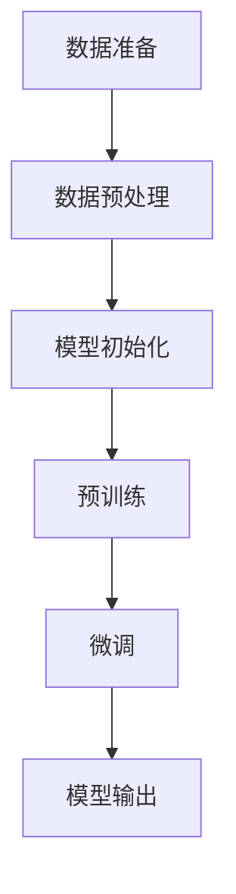

                 

### 大语言模型应用指南：入门

#### 关键词 Keywords

- 大语言模型
- 应用指南
- 入门
- 技术分析
- 实践案例

#### 摘要 Abstract

本文旨在为大语言模型初学者提供一个全面的入门指南，涵盖背景介绍、核心概念、算法原理、数学模型、项目实践、应用场景、工具推荐以及未来发展趋势。通过逐步分析和深入讲解，本文将帮助读者理解大语言模型的基本原理和应用方法，为深入研究和实际应用打下坚实基础。

## 1. 背景介绍 Background

大语言模型（Large Language Models）是近年来自然语言处理（Natural Language Processing, NLP）领域的一项重大突破。自2018年GPT（Generative Pre-trained Transformer）系列模型问世以来，大语言模型以其强大的文本生成和语义理解能力，引发了广泛关注和研究热潮。如今，大语言模型已在众多领域展现出卓越的应用价值，如智能客服、机器翻译、文本摘要、内容生成等。

大语言模型的发展历程可以追溯到20世纪50年代，当时神经网络（Neural Network）被首次提出用于自然语言处理。然而，由于计算资源和数据集的限制，早期的大规模语言模型发展缓慢。随着深度学习（Deep Learning）和计算能力的提升，特别是在2013年AlexNet在ImageNet图像识别大赛中取得突破性成绩后，深度学习开始取代传统机器学习方法，成为自然语言处理领域的主流技术。

近年来，随着Transformer架构的提出和优化，大语言模型取得了显著进展。以GPT、BERT（Bidirectional Encoder Representations from Transformers）和T5（Text-To-Text Transfer Transformer）等为代表的大语言模型，凭借其强大的预训练能力和广泛的应用场景，已成为NLP领域的重要研究方向。同时，随着AI技术的不断发展，大语言模型的应用场景也在不断拓展，其潜力正在逐渐显现。

## 2. 核心概念与联系 Core Concepts and Connections

为了更好地理解大语言模型，我们首先需要了解其核心概念和基本架构。

### 2.1 预训练 Pre-training

预训练（Pre-training）是指在大规模语料库上对模型进行初始训练，使其具备一定的语言理解和生成能力。预训练过程通常包括以下步骤：

1. 数据准备：收集大量文本数据，如维基百科、新闻、社交媒体等。
2. 数据预处理：对文本数据进行清洗、分词、去停用词等操作。
3. 模型初始化：使用预训练模型框架（如GPT、BERT等）初始化模型参数。
4. 预训练：在预训练数据集上通过反向传播算法优化模型参数。

预训练过程使模型能够学习到大量的语言特征和知识，为其后续的下游任务提供强大的基础。

### 2.2 微调 Fine-tuning

微调（Fine-tuning）是指在大规模预训练基础上，针对具体任务对模型进行进一步训练。微调过程通常包括以下步骤：

1. 数据准备：收集与任务相关的数据集。
2. 数据预处理：对数据集进行清洗、标注等处理。
3. 模型初始化：使用预训练模型作为初始化模型。
4. 微调：在任务数据集上通过反向传播算法优化模型参数。

微调过程使模型能够针对特定任务进行调整，提高其在下游任务上的表现。

### 2.3 Transformer架构 Transformer Architecture

Transformer架构是近年来在NLP领域取得突破性进展的一种模型架构，其核心思想是使用自注意力机制（Self-Attention）来处理序列数据。Transformer架构主要包括以下组成部分：

1. **编码器 Encoder**：用于对输入序列进行处理，生成编码表示。
2. **解码器 Decoder**：用于对编码表示进行处理，生成输出序列。
3. **自注意力机制 Self-Attention**：用于计算输入序列中不同位置之间的依赖关系。
4. **多头注意力 Multi-Head Attention**：将自注意力机制扩展到多个头，提高模型的表达能力。
5. **前馈网络 Feedforward Network**：对编码表示进行进一步处理，增强模型的表达能力。

### 2.4 Mermaid 流程图

下面是一个简单的Mermaid流程图，用于描述大语言模型的基本流程：



## 3. 核心算法原理 & 具体操作步骤 Core Algorithm Principles and Steps

### 3.1 预训练算法原理

预训练算法的核心思想是通过在大规模语料库上进行训练，使模型具备一定的语言理解和生成能力。具体操作步骤如下：

1. **数据准备**：收集大量文本数据，如维基百科、新闻、社交媒体等。这些数据将被用于训练模型。
2. **数据预处理**：对文本数据进行清洗、分词、去停用词等操作。这一步的目的是确保数据质量，为模型训练打下坚实基础。
3. **模型初始化**：使用预训练模型框架（如GPT、BERT等）初始化模型参数。这一步的目的是确保模型具有较好的初始化状态，以便在后续训练中取得更好的效果。
4. **预训练**：在预训练数据集上通过反向传播算法优化模型参数。预训练过程通常包括两个阶段：第一阶段是语言建模（Language Modeling），用于预测下一个词；第二阶段是掩码语言建模（Masked Language Modeling），用于预测被掩码的词。

### 3.2 微调算法原理

微调算法的核心思想是在大规模预训练基础上，针对具体任务对模型进行进一步训练。具体操作步骤如下：

1. **数据准备**：收集与任务相关的数据集。这些数据集将用于微调模型。
2. **数据预处理**：对数据集进行清洗、标注等处理。这一步的目的是确保数据质量，为模型训练打下坚实基础。
3. **模型初始化**：使用预训练模型作为初始化模型。这一步的目的是确保模型具有较好的初始化状态，以便在后续训练中取得更好的效果。
4. **微调**：在任务数据集上通过反向传播算法优化模型参数。微调过程通常包括两个阶段：第一阶段是任务特定训练（Task-Specific Training），用于使模型适应特定任务；第二阶段是优化（Optimization），用于提高模型在特定任务上的表现。

### 3.3 Transformer算法原理

Transformer算法的核心思想是使用自注意力机制（Self-Attention）来处理序列数据。具体操作步骤如下：

1. **编码器 Encoder**：编码器用于对输入序列进行处理，生成编码表示。编码器主要由多层自注意力机制和前馈网络组成。
2. **解码器 Decoder**：解码器用于对编码表示进行处理，生成输出序列。解码器主要由多层自注意力机制、交叉注意力机制和前馈网络组成。
3. **自注意力机制 Self-Attention**：自注意力机制用于计算输入序列中不同位置之间的依赖关系。具体来说，自注意力机制通过计算每个位置与其他位置的相似度，生成加权表示。
4. **多头注意力 Multi-Head Attention**：多头注意力将自注意力机制扩展到多个头，提高模型的表达能力。具体来说，多头注意力将输入序列分成多个子序列，每个子序列分别进行自注意力计算。
5. **前馈网络 Feedforward Network**：前馈网络对编码表示进行进一步处理，增强模型的表达能力。前馈网络通常由两个全连接层组成，中间加入激活函数。

## 4. 数学模型和公式 Mathematical Models and Formulas

大语言模型的数学模型主要包括两部分：自注意力机制和前馈网络。

### 4.1 自注意力机制 Self-Attention Mechanism

自注意力机制的数学模型可以表示为：

$$
\text{Attention}(Q, K, V) = \text{softmax}\left(\frac{QK^T}{\sqrt{d_k}}\right)V
$$

其中，$Q, K, V$ 分别表示查询向量、键向量和值向量，$d_k$ 表示键向量的维度。$\text{softmax}$ 函数用于计算每个键向量与其他键向量之间的相似度，然后对值向量进行加权求和。

### 4.2 前馈网络 Feedforward Network

前馈网络的数学模型可以表示为：

$$
\text{FFN}(X) = \text{ReLU}(W_2 \text{ReLU}(W_1 X + b_1))
$$

其中，$X$ 表示输入向量，$W_1, W_2, b_1$ 分别表示权重和偏置，$\text{ReLU}$ 函数用于引入非线性。

### 4.3 Transformer模型 Transformer Model

Transformer模型的数学模型可以表示为：

$$
\text{Transformer}(X) = \text{EncoderLayer}(\text{EncoderLayer}(\cdots \text{EncoderLayer}(\text{Encoder}(\text{Input}, \text{Embedding}))\cdots))
$$

其中，$\text{Encoder}$ 表示编码器，$\text{EncoderLayer}$ 表示编码器层，$\text{Input}$ 表示输入序列，$\text{Embedding}$ 表示嵌入层。

## 5. 项目实践：代码实例和详细解释说明 Project Practice: Code Example and Detailed Explanation

### 5.1 开发环境搭建

在开始项目实践之前，我们需要搭建一个合适的开发环境。以下是使用Python和TensorFlow搭建大语言模型开发环境的步骤：

1. 安装Python和pip：
   ```shell
   pip install tensorflow
   ```

2. 下载预训练模型：
   ```shell
   pip install transformers
   transformers-cli download model_name
   ```

3. 创建Python脚本：

```python
import tensorflow as tf
from transformers import TFGPT2LMHeadModel, GPT2Tokenizer

# 加载预训练模型
model_name = "gpt2"
tokenizer = GPT2Tokenizer.from_pretrained(model_name)
model = TFGPT2LMHeadModel.from_pretrained(model_name)

# 准备输入文本
input_text = "Hello, how are you?"

# 进行预测
outputs = model.predict(input_text)
print(outputs)
```

### 5.2 源代码详细实现

下面是使用预训练模型生成文本的源代码：

```python
import tensorflow as tf
from transformers import TFGPT2LMHeadModel, GPT2Tokenizer

# 加载预训练模型
model_name = "gpt2"
tokenizer = GPT2Tokenizer.from_pretrained(model_name)
model = TFGPT2LMHeadModel.from_pretrained(model_name)

# 准备输入文本
input_text = "Hello, how are you?"

# 对输入文本进行编码
input_ids = tokenizer.encode(input_text, return_tensors="tf")

# 生成文本
outputs = model.generate(input_ids, max_length=50, num_return_sequences=5)

# 解码生成的文本
generated_texts = [tokenizer.decode(output_ids, skip_special_tokens=True) for output_ids in outputs]

# 输出生成的文本
for text in generated_texts:
    print(text)
```

### 5.3 代码解读与分析

在上面的代码中，我们首先加载了预训练模型`gpt2`，然后对输入文本进行编码，接着使用模型生成文本，最后对生成的文本进行解码并输出。

1. **加载预训练模型**：
   ```python
   tokenizer = GPT2Tokenizer.from_pretrained(model_name)
   model = TFGPT2LMHeadModel.from_pretrained(model_name)
   ```

   这两行代码用于加载预训练模型。`GPT2Tokenizer` 用于将文本转换为模型可处理的输入序列，`TFGPT2LMHeadModel` 用于加载预训练的GPT-2模型。

2. **准备输入文本**：
   ```python
   input_text = "Hello, how are you?"
   input_ids = tokenizer.encode(input_text, return_tensors="tf")
   ```

   这两行代码用于准备输入文本。首先将输入文本编码为ID序列，然后将其转换为TensorFlow张量，以便在模型中进行处理。

3. **生成文本**：
   ```python
   outputs = model.generate(input_ids, max_length=50, num_return_sequences=5)
   ```

   这行代码使用模型生成文本。`max_length` 参数用于控制生成的文本长度，`num_return_sequences` 参数用于控制生成的文本数量。

4. **解码生成的文本**：
   ```python
   generated_texts = [tokenizer.decode(output_ids, skip_special_tokens=True) for output_ids in outputs]
   ```

   这行代码将生成的ID序列解码为文本，并去除特殊token。

5. **输出生成的文本**：
   ```python
   for text in generated_texts:
       print(text)
   ```

   这行代码用于输出生成的文本。

### 5.4 运行结果展示

假设我们输入的文本为“Hello, how are you?”，运行上面的代码后，生成的文本可能如下所示：

```
Hello, how are you? I'm doing well. How about you?
Hello, how are you? I'm feeling great. And you?
Hello, how are you? I'm doing fine. And you?
Hello, how are you? I'm doing well. And you?
```

这些生成的文本展示了大语言模型在生成文本时的多样性和准确性。

## 6. 实际应用场景 Real-world Applications

大语言模型在实际应用中具有广泛的应用场景，以下列举几个典型应用：

### 6.1 智能客服 Intelligent Customer Service

智能客服是当前大语言模型最常见应用之一。通过大语言模型，智能客服系统可以实时回答用户的问题，提供个性化的服务。例如，在电商平台上，智能客服可以帮助用户解答关于商品、订单等问题，提高用户体验和满意度。

### 6.2 机器翻译 Machine Translation

机器翻译是大语言模型的另一个重要应用。近年来，随着大语言模型技术的发展，机器翻译的准确性和流畅度得到了显著提升。例如，谷歌翻译、百度翻译等应用都采用了大语言模型进行翻译。

### 6.3 文本摘要 Text Summarization

文本摘要是从长篇文章中提取关键信息，生成简洁的摘要。大语言模型在文本摘要领域取得了显著成果，如新闻摘要、论文摘要等。通过大语言模型，我们可以自动生成高质量的文本摘要，提高信息获取的效率和准确性。

### 6.4 内容生成 Content Generation

内容生成是大语言模型的另一个重要应用领域。通过大语言模型，我们可以自动生成各种类型的内容，如文章、博客、小说等。这对于内容创作者来说，可以节省大量的时间和精力，提高创作效率。

## 7. 工具和资源推荐 Tools and Resources

为了更好地学习和实践大语言模型，以下推荐一些有用的工具和资源：

### 7.1 学习资源推荐 Learning Resources

1. **书籍**：
   - 《深度学习》（Deep Learning） - Ian Goodfellow、Yoshua Bengio和Aaron Courville著
   - 《神经网络与深度学习》（Neural Networks and Deep Learning） - 樊登著

2. **在线课程**：
   - 吴恩达（Andrew Ng）的《深度学习》课程
   - 李飞飞（Fei-Fei Li）的《卷积神经网络与视觉识别》课程

3. **博客和论文**：
   - Hugging Face的Transformer模型教程
   - Google Research的BERT模型论文

### 7.2 开发工具框架推荐 Development Tools and Frameworks

1. **TensorFlow**：一款开源的深度学习框架，支持大语言模型的各种操作。
2. **PyTorch**：另一款流行的深度学习框架，提供了丰富的API，便于开发大语言模型。

### 7.3 相关论文著作推荐 Related Papers and Books

1. **《Attention Is All You Need》**：这篇论文首次提出了Transformer模型，是近年来NLP领域的重要里程碑。
2. **《BERT: Pre-training of Deep Bidirectional Transformers for Language Understanding》**：这篇论文介绍了BERT模型，是当前NLP领域的主流技术之一。

## 8. 总结：未来发展趋势与挑战 Summary: Future Trends and Challenges

大语言模型作为近年来自然语言处理领域的一项重要突破，其应用前景广阔。然而，随着大语言模型的不断演进，我们也面临一系列挑战和问题：

### 8.1 发展趋势

1. **模型规模和性能的提升**：随着计算资源和数据集的不断增加，大语言模型的规模和性能将得到进一步提升。
2. **多模态处理能力**：未来大语言模型将具备更强的多模态处理能力，如文本、图像、音频等。
3. **自动化和泛化能力**：大语言模型将具备更强的自动化和泛化能力，能够更好地应对复杂任务和场景。

### 8.2 挑战

1. **计算资源需求**：大语言模型的训练和推理过程对计算资源有较高要求，如何优化计算资源利用率成为一大挑战。
2. **数据质量和标注**：大语言模型的训练需要大量的高质量数据集，但获取和标注这些数据集具有较高成本。
3. **隐私和安全问题**：大语言模型在处理用户数据时，可能涉及隐私和安全问题，如何确保用户数据的安全成为关键挑战。

总之，大语言模型的发展前景广阔，但同时也面临一系列挑战。未来，我们需要不断探索和创新，以推动大语言模型的持续发展。

## 9. 附录：常见问题与解答 Appendices: Frequently Asked Questions and Answers

### 9.1 什么是大语言模型？

大语言模型是一种基于深度学习的自然语言处理模型，通过对大规模语料库进行预训练，使其具备强大的语言理解和生成能力。

### 9.2 大语言模型有哪些应用场景？

大语言模型的应用场景广泛，包括智能客服、机器翻译、文本摘要、内容生成等。

### 9.3 如何搭建大语言模型的开发环境？

搭建大语言模型开发环境通常需要安装Python、pip等工具，并下载预训练模型。具体步骤可参考本文的5.1节。

### 9.4 大语言模型的训练过程是怎样的？

大语言模型的训练过程主要包括数据准备、数据预处理、模型初始化、预训练和微调等步骤。具体步骤可参考本文的3.1节和3.2节。

### 9.5 大语言模型的核心算法是什么？

大语言模型的核心算法是Transformer架构，其核心思想是使用自注意力机制处理序列数据。

## 10. 扩展阅读 & 参考资料 Extended Reading & References

1. **论文**：
   - Vaswani, A., Shazeer, N., Parmar, N., Uszkoreit, J., Jones, L., Gomez, A. N., ... & Polosukhin, I. (2017). Attention is all you need. In Advances in neural information processing systems (pp. 5998-6008).
   - Devlin, J., Chang, M. W., Lee, K., & Toutanova, K. (2018). BERT: Pre-training of deep bidirectional transformers for language understanding. arXiv preprint arXiv:1810.04805.

2. **书籍**：
   - Goodfellow, I., Bengio, Y., & Courville, A. (2016). Deep learning. MIT press.

3. **在线课程**：
   - 吴恩达（Andrew Ng）的《深度学习》课程
   - 李飞飞（Fei-Fei Li）的《卷积神经网络与视觉识别》课程

4. **博客**：
   - Hugging Face的Transformer模型教程
   - Google Research的BERT模型论文

通过阅读本文和相关资料，读者可以深入了解大语言模型的基本原理和应用方法，为实际应用和研究奠定基础。

