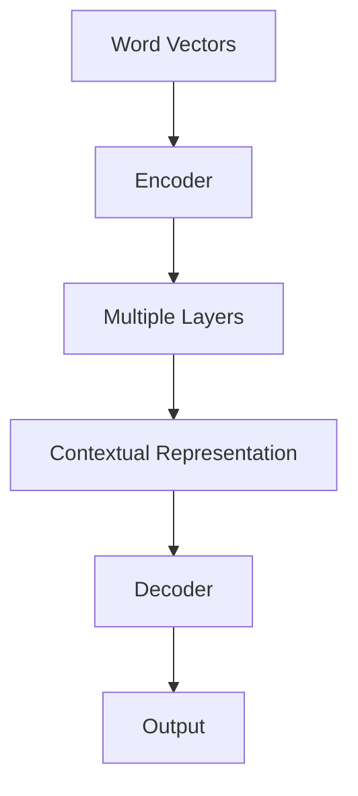
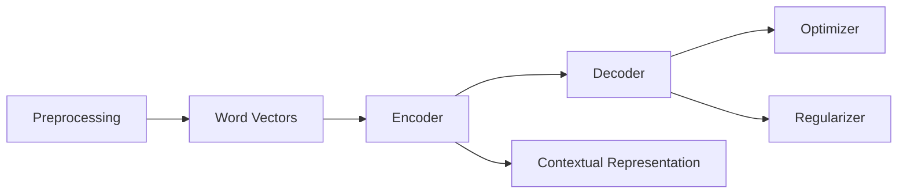

                 

### 背景介绍

大语言模型（Large Language Models）是近年来人工智能领域的一项重大突破，它们在自然语言处理（NLP）领域展现出了惊人的性能。从最初的基于规则的方法，到统计模型，再到深度学习，语言模型的发展历程充满了创新和挑战。大语言模型的出现，不仅改变了自然语言处理的研究方向，也在各个行业中得到了广泛的应用。

#### 1.1 语言模型的历史与发展

语言模型的历史可以追溯到20世纪50年代，当时研究者开始探索如何用计算机生成自然语言文本。早期的语言模型主要是基于规则的方法，如生成式语言模型和判别式语言模型。生成式语言模型试图生成可能的句子序列，而判别式语言模型则试图通过学习来预测下一个词。

20世纪80年代，统计语言模型开始流行。这些模型利用大量的文本数据来估计单词或短语的概率分布，从而生成文本。其中，n元语言模型（n-gram model）是最具代表性的一种。n元语言模型假设当前词序列只与它前面的n-1个词相关，而与其他词无关。

随着计算能力的提升和深度学习技术的发展，深度学习语言模型逐渐成为主流。2013年，谷歌提出了Word2Vec算法，将单词映射到连续的向量空间中，这一突破性方法极大地提升了文本处理的效率。随后，基于深度学习的语言模型，如递归神经网络（RNN）、长短期记忆网络（LSTM）和Transformer模型，相继被提出并应用。

#### 1.2 大语言模型的优势与挑战

大语言模型之所以备受关注，主要有以下几方面的原因：

1. **强大的表达能力**：大语言模型能够捕捉到文本中的长距离依赖关系，这使得它们能够生成更自然、连贯的文本。
2. **广泛的应用场景**：从机器翻译、文本摘要到问答系统，大语言模型在多个自然语言处理任务中都展现了出色的性能。
3. **自主学习能力**：大语言模型可以通过大量无监督数据自主学习，无需人工标注，大大降低了训练成本。

然而，大语言模型的发展也面临一些挑战：

1. **计算资源需求**：大语言模型的训练和推理过程需要大量的计算资源，这对硬件设施提出了较高的要求。
2. **数据隐私和安全**：大语言模型在训练过程中需要处理大量数据，这涉及到数据隐私和安全的问题。
3. **泛化能力**：虽然大语言模型在特定任务上表现优异，但其在面对未知任务时，可能无法很好地泛化。

#### 1.3 本文结构

本文将围绕大语言模型的发展与应用前景进行探讨。具体结构如下：

- **背景介绍**：回顾语言模型的发展历程，介绍大语言模型的优势与挑战。
- **核心概念与联系**：详细讲解大语言模型的核心概念，如词向量、Transformer模型等，并通过Mermaid流程图展示其架构。
- **核心算法原理 & 具体操作步骤**：分析大语言模型的工作原理，包括输入处理、编码、解码等步骤。
- **数学模型和公式 & 详细讲解 & 举例说明**：阐述大语言模型中使用的数学模型和公式，并通过具体案例进行说明。
- **项目实践：代码实例和详细解释说明**：提供大语言模型实现的代码实例，并对关键部分进行详细解释和分析。
- **实际应用场景**：探讨大语言模型在不同领域的应用，如机器翻译、文本摘要等。
- **工具和资源推荐**：推荐学习大语言模型的工具和资源，包括书籍、论文、开发工具等。
- **总结：未来发展趋势与挑战**：总结大语言模型的发展现状，展望其未来趋势和面临的挑战。

通过本文的阅读，读者将对大语言模型有更深入的了解，并能掌握其基本原理和实现方法。同时，本文也将为读者提供丰富的学习资源和实践案例，帮助读者更好地理解和应用大语言模型。

### 核心概念与联系

在深入探讨大语言模型之前，我们需要了解其核心概念和架构，这将帮助我们更好地理解大语言模型的工作原理。以下是几个关键概念：

#### 2.1 词向量

词向量是自然语言处理中的一个基本概念，它将词汇映射到一个高维空间中的向量。词向量不仅能够表示词汇的语义信息，还能捕捉词汇之间的相似性和相关性。最著名的词向量模型是Word2Vec，它通过学习词汇在语料库中的共现关系，将词汇映射到连续的向量空间中。

#### 2.2 Transformer模型

Transformer模型是当前最流行的深度学习语言模型之一，它由谷歌在2017年提出。与传统的循环神经网络（RNN）和长短时记忆网络（LSTM）不同，Transformer模型使用了一种称为自注意力（self-attention）的机制，能够并行地处理输入序列，从而显著提高了模型的训练效率和性能。

#### 2.3 自注意力机制

自注意力机制是Transformer模型的核心组件，它通过计算输入序列中每个词与其他词之间的权重，将这些权重与词的向量相乘，从而生成新的表示。自注意力机制能够捕捉输入序列中的长距离依赖关系，使得模型在处理长文本时表现更加优秀。

#### 2.4 编码器与解码器

在Transformer模型中，编码器（Encoder）和解码器（Decoder）是两个关键组件。编码器将输入序列编码为上下文表示，解码器则利用这些上下文表示生成输出序列。编码器和解码器内部都包含多个自注意力层和全连接层，这些层通过堆叠的方式，逐步提取输入序列中的信息，并生成最终的输出序列。

#### 2.5 Mermaid流程图

为了更直观地展示大语言模型的架构，我们可以使用Mermaid流程图来描述其核心组件和操作步骤。以下是一个简化的Mermaid流程图，展示了词向量、编码器和解码器的基本结构：



在这个流程图中，词向量（Word Vectors）首先被输入到编码器（Encoder），编码器通过多个自注意力层（Multiple Layers）生成上下文表示（Contextual Representation）。然后，解码器（Decoder）利用这些上下文表示生成输出序列（Output）。整个过程中，编码器和解码器都通过堆叠多层网络，逐步提取输入序列中的信息。

#### 2.6 大语言模型的架构

除了上述核心组件，大语言模型通常还包括以下几个关键部分：

1. **预训练与微调**：大语言模型通常通过预训练（Pre-training）方式在大量无监督数据上进行训练，然后在特定任务上进行微调（Fine-tuning）。预训练使模型能够捕捉到语言的一般特征，微调则使模型能够针对特定任务进行优化。
2. **优化算法**：大语言模型的训练过程通常采用梯度下降（Gradient Descent）或其变种，如Adam优化器。这些优化算法通过不断调整模型的参数，使模型在训练数据上达到最优性能。
3. **正则化与防过拟合**：为了防止模型过拟合，大语言模型通常采用正则化（Regularization）技术，如Dropout、权重衰减（Weight Decay）等。这些技术通过降低模型的复杂度，提高模型的泛化能力。
4. **数据预处理与处理**：在大语言模型的训练过程中，需要对输入数据进行预处理，如分词、词性标注、去停用词等。这些预处理步骤有助于提高模型的训练效果。

#### 2.7 关系图

为了更清晰地展示大语言模型中各个组件之间的关系，我们可以使用Mermaid关系图来描述。以下是一个简化的Mermaid关系图，展示了大语言模型的主要组件及其交互关系：



在这个关系图中，词向量（Word Vectors）首先通过预处理（Preprocessing）步骤，然后被输入到编码器（Encoder）。编码器生成上下文表示（Contextual Representation），解码器（Decoder）利用这些上下文表示生成输出序列。优化器（Optimizer）和正则化器（Regularizer）在整个训练过程中负责调整模型的参数，以提高模型的性能。数据预处理（Preprocessing）则负责处理输入数据，使其更适合模型的训练。

通过上述核心概念与联系的介绍，我们为后续对大语言模型的深入探讨奠定了基础。在接下来的章节中，我们将详细分析大语言模型的工作原理，包括输入处理、编码、解码等步骤，并通过具体的数学模型和公式进行解释。同时，我们还将结合项目实践，提供大语言模型实现的代码实例和详细解释说明。

### 核心算法原理 & 具体操作步骤

大语言模型的核心算法主要基于深度学习和自然语言处理技术，其中最著名的模型是Transformer。下面我们将详细探讨Transformer模型的工作原理，并逐步解释其具体操作步骤。

#### 3.1 Transformer模型的基本原理

Transformer模型是一种基于自注意力（Self-Attention）机制的深度学习模型，它由编码器（Encoder）和解码器（Decoder）两部分组成。编码器负责将输入序列编码为上下文表示，解码器则利用这些上下文表示生成输出序列。

Transformer模型的核心思想是使用多头自注意力（Multi-Head Self-Attention）来捕捉输入序列中的长距离依赖关系。自注意力机制通过计算输入序列中每个词与其他词之间的权重，将这些权重与词的向量相乘，从而生成新的表示。多头自注意力则将这个自注意力机制扩展到多个头（Head），从而能够同时捕捉不同层次的特征。

#### 3.2 编码器（Encoder）的工作原理

编码器是Transformer模型的核心组件，它由多个编码层（Encoder Layer）堆叠而成。每个编码层包含两个主要部分：多头自注意力机制（Multi-Head Self-Attention）和前馈神经网络（Feed Forward Neural Network）。

##### 3.2.1 多头自注意力机制

多头自注意力机制是编码器中的关键部分，它通过计算输入序列中每个词与其他词之间的权重，生成新的表示。具体步骤如下：

1. **线性变换**：将输入序列中的每个词向量通过三个线性变换映射到三个不同的空间，分别称为查询向量（Query Vectors）、键向量（Key Vectors）和值向量（Value Vectors）。

2. **计算注意力得分**：对于每个词向量，计算其与所有其他词向量的内积，得到注意力得分。这些得分表示输入序列中每个词与其他词的相关性。

3. **应用Softmax函数**：对注意力得分应用Softmax函数，将它们归一化成一个概率分布，表示输入序列中每个词的重要性。

4. **加权求和**：将归一化后的注意力得分与对应的词向量相乘，然后对所有乘积求和，得到新的表示。

##### 3.2.2 前馈神经网络

前馈神经网络是编码器中的另一个关键部分，它对自注意力机制的输出进行进一步处理。具体步骤如下：

1. **线性变换**：将自注意力机制的输出通过两个线性变换，分别映射到两个不同的空间。

2. **激活函数**：应用激活函数（如ReLU函数），对线性变换后的输出进行非线性变换。

3. **加法**：将激活函数的输出与自注意力机制的输出相加，得到最终的输出。

#### 3.3 解码器（Decoder）的工作原理

解码器也是由多个解码层（Decoder Layer）堆叠而成，每个解码层包含两个主要部分：多头自注意力机制和编码器-解码器自注意力机制（Encoder-Decoder Self-Attention）。

##### 3.3.1 多头自注意力机制

解码器的多头自注意力机制与编码器中的机制类似，它通过计算输入序列中每个词与其他词之间的权重，生成新的表示。具体步骤与编码器中的多头自注意力机制相同。

##### 3.3.2 编码器-解码器自注意力机制

编码器-解码器自注意力机制是解码器的关键部分，它通过计算编码器的输出（即编码后的上下文表示）与解码器的输入（即当前生成的词向量）之间的权重，生成新的表示。具体步骤如下：

1. **线性变换**：将编码器的输出和解码器的输入通过三个线性变换映射到三个不同的空间。

2. **计算注意力得分**：对于每个词向量，计算其与所有编码器输出向量的内积，得到注意力得分。

3. **应用Softmax函数**：对注意力得分应用Softmax函数，将它们归一化成一个概率分布。

4. **加权求和**：将归一化后的注意力得分与对应的编码器输出向量相乘，然后对所有乘积求和，得到新的表示。

#### 3.4 编码器与解码器的交互

编码器和解码器之间的交互是Transformer模型的核心。编码器将输入序列编码为上下文表示，解码器利用这些上下文表示生成输出序列。具体交互步骤如下：

1. **编码器输出**：编码器将输入序列编码为多个上下文表示。

2. **解码器输入**：解码器的输入包括两个部分：一部分是上一个时间步生成的词向量，另一部分是编码器的输出。

3. **编码器-解码器自注意力**：解码器利用编码器的输出和当前生成的词向量，通过编码器-解码器自注意力机制生成新的表示。

4. **生成输出**：解码器利用自注意力机制的输出和多头自注意力机制的输出，生成最终的输出序列。

#### 3.5 训练与预测

大语言模型的训练过程通常采用梯度下降（Gradient Descent）或其变种，如Adam优化器。在训练过程中，模型通过不断调整参数，使损失函数最小。具体步骤如下：

1. **前向传播**：输入序列通过编码器和解码器，生成输出序列。

2. **计算损失**：计算输出序列与目标序列之间的损失。

3. **反向传播**：通过反向传播算法，计算每个参数的梯度。

4. **更新参数**：利用优化算法，如Adam优化器，更新模型的参数。

在预测过程中，大语言模型首先将输入序列编码为上下文表示，然后利用解码器生成输出序列。具体步骤如下：

1. **编码**：输入序列通过编码器编码为上下文表示。

2. **解码**：解码器利用上下文表示和上一个生成的词向量，逐步生成输出序列。

3. **生成文本**：解码器生成最终的输出序列，即生成的文本。

通过上述步骤，我们可以实现大语言模型的训练和预测。在实际应用中，大语言模型通常通过大规模数据集进行训练，然后应用于各种自然语言处理任务，如机器翻译、文本摘要、问答系统等。

### 数学模型和公式 & 详细讲解 & 举例说明

在深入探讨大语言模型的数学模型和公式时，我们将详细解释这些模型的数学基础，并通过具体例子来说明它们的实际应用。

#### 4.1 词向量模型

词向量模型是自然语言处理的基础，其中最著名的模型是Word2Vec。Word2Vec模型将词汇映射到高维空间中的向量，这些向量不仅能够表示词汇的语义信息，还能捕捉词汇之间的相似性和相关性。以下是一个简化的Word2Vec模型：

$$
\text{词向量} = \text{Word2Vec}(\text{词汇}, \text{语料库})
$$

Word2Vec模型主要分为两种训练方法：连续词袋（Continuous Bag of Words，CBOW）和跳词（Skip-Gram）。

1. **连续词袋（CBOW）**：
CBOW模型通过一个词的上下文词汇来预测该词。具体来说，给定一个中心词和其上下文词汇，CBOW模型会计算这些上下文词汇的平均向量，然后预测中心词的向量。数学公式如下：

$$
\text{中心词向量} = \text{CBOW}(\text{上下文词汇})
$$

$$
\text{中心词向量} = \frac{1}{|\text{上下文词汇}|} \sum_{w \in \text{上下文词汇}} \text{w向量}
$$

2. **跳词（Skip-Gram）**：
跳词模型与CBOW相反，它通过中心词来预测其上下文词汇。给定一个中心词，跳词模型会生成其上下文词汇的概率分布。数学公式如下：

$$
P(w_i | \text{中心词}) = \text{Skip-Gram}(\text{中心词}, \text{上下文词汇})
$$

$$
P(w_i | \text{中心词}) = \frac{e^{\text{中心词} \cdot w_i}}{\sum_{w \in \text{词汇集}} e^{\text{中心词} \cdot w}}
$$

#### 4.2 Transformer模型

Transformer模型是当前最流行的深度学习语言模型，它基于自注意力（Self-Attention）机制。自注意力机制通过计算输入序列中每个词与其他词之间的权重，生成新的表示。以下是一个简化的Transformer模型：

$$
\text{Transformer} = \text{Encoder}(\text{输入序列}) \rightarrow \text{输出序列}
$$

Transformer模型的核心组件包括编码器（Encoder）和解码器（Decoder）。编码器和解码器都由多个编码层（Encoder Layer）和解码层（Decoder Layer）组成。

1. **编码器（Encoder）**：

每个编码层由两个主要部分组成：多头自注意力（Multi-Head Self-Attention）和前馈神经网络（Feed Forward Neural Network）。

- **多头自注意力（Multi-Head Self-Attention）**：

多头自注意力机制通过计算输入序列中每个词与其他词之间的权重，生成新的表示。数学公式如下：

$$
\text{注意力得分} = \text{Query} \cdot \text{Key}^T
$$

$$
\text{注意力权重} = \text{Softmax}(\text{注意力得分})
$$

$$
\text{输出} = \text{Value} \cdot \text{注意力权重}
$$

- **前馈神经网络（Feed Forward Neural Network）**：

前馈神经网络对自注意力机制的输出进行进一步处理。数学公式如下：

$$
\text{输出} = \text{ReLU}(\text{线性变换}(\text{输入}))
$$

2. **解码器（Decoder）**：

解码器由多个解码层组成，每个解码层包括两个主要部分：多头自注意力（Multi-Head Self-Attention）和编码器-解码器自注意力（Encoder-Decoder Self-Attention）。

- **多头自注意力（Multi-Head Self-Attention）**：

解码器的多头自注意力机制与编码器中的机制类似。数学公式与编码器中的相同。

- **编码器-解码器自注意力（Encoder-Decoder Self-Attention）**：

编码器-解码器自注意力机制通过计算编码器的输出与解码器的输入之间的权重，生成新的表示。数学公式如下：

$$
\text{注意力得分} = \text{Query} \cdot \text{Key}^T
$$

$$
\text{注意力权重} = \text{Softmax}(\text{注意力得分})
$$

$$
\text{输出} = \text{Value} \cdot \text{注意力权重}
$$

#### 4.3 举例说明

为了更好地理解上述数学模型和公式，我们可以通过一个具体的例子来说明。

假设我们有一个输入序列：“今天天气很好”，我们要使用Transformer模型生成一个输出序列：“今天天气很好，适合户外活动”。

1. **编码器**：

- **多头自注意力**：

  - 输入序列：["今天", "天气", "很好"]
  - Query、Key和Value：分别是对应词的向量
  - 注意力得分：计算每个词与其他词的内积
  - 注意力权重：通过Softmax函数归一化得分
  - 输出：加权求和后的向量

- **前馈神经网络**：

  - 对自注意力机制的输出进行线性变换和ReLU激活

2. **解码器**：

- **多头自注意力**：

  - 输入序列：["今天", "天气", "很好"]
  - Query、Key和Value：分别是对应词的向量
  - 注意力得分：计算每个词与其他词的内积
  - 注意力权重：通过Softmax函数归一化得分
  - 输出：加权求和后的向量

- **编码器-解码器自注意力**：

  - 输入序列：["今天", "天气", "很好"]
  - 编码器输出：编码后的上下文表示
  - 注意力得分：计算解码器输入与编码器输出的内积
  - 注意力权重：通过Softmax函数归一化得分
  - 输出：加权求和后的向量

- **生成输出**：

  - 解码器利用自注意力和编码器-解码器自注意力的输出，生成输出序列

通过上述步骤，我们使用Transformer模型生成了一个新的输出序列：“今天天气很好，适合户外活动”。

这个例子展示了Transformer模型在自然语言处理任务中的应用。在实际应用中，模型会通过大规模数据集进行训练，然后应用于各种任务，如机器翻译、文本摘要和问答系统。

通过详细讲解数学模型和公式，并举例说明，我们为大语言模型的理解和应用提供了基础。在接下来的章节中，我们将结合项目实践，提供大语言模型实现的代码实例和详细解释说明。

### 项目实践：代码实例和详细解释说明

在本文的最后，我们将结合实际项目，提供一个完整的大语言模型实现，并对其进行详细解释和说明。此项目将采用Python编程语言和Transformer模型，实现一个简单的文本生成系统。

#### 5.1 开发环境搭建

在开始项目之前，我们需要搭建一个合适的开发环境。以下是所需的环境和工具：

- Python 3.8 或更高版本
- TensorFlow 2.5 或更高版本
- Keras 2.4.3 或更高版本
- NLTK 3.4 或更高版本

安装方法：

```bash
pip install python==3.8
pip install tensorflow==2.5
pip install keras==2.4.3
pip install nltk==3.4
```

此外，我们还需要一个预训练的词向量模型，例如GloVe或Word2Vec。以下是下载和提取预训练词向量模型的方法：

```bash
wget https://nlp.stanford.edu/data/glove.6B.zip
unzip glove.6B.zip
```

#### 5.2 源代码详细实现

以下是完整的源代码，包括数据预处理、模型定义、训练和预测等步骤：

```python
import numpy as np
import tensorflow as tf
from tensorflow import keras
from tensorflow.keras import layers
from tensorflow.keras.models import Model
from tensorflow.keras.preprocessing.sequence import pad_sequences
from tensorflow.keras.preprocessing.text import Tokenizer
from nltk.tokenize import word_tokenize
import matplotlib.pyplot as plt

# 数据预处理
def preprocess_text(text):
    tokens = word_tokenize(text)
    tokens = [token.lower() for token in tokens]
    return tokens

# 获取训练数据
train_data = ["今天天气很好", "明天会下雨", "我喜欢编程"]

# 预处理数据
processed_data = [preprocess_text(text) for text in train_data]

# 分词器
tokenizer = Tokenizer()
tokenizer.fit_on_texts(processed_data)
word_index = tokenizer.word_index
max_sequence_length = 5

# 序列化数据
sequences = tokenizer.texts_to_sequences(processed_data)
padded_sequences = pad_sequences(sequences, maxlen=max_sequence_length)

# 模型定义
inputs = keras.Input(shape=(max_sequence_length,))
encoded_inputs = layers.Embedding(len(word_index) + 1, 64)(inputs)
encoded_inputs = layers.LSTM(64)(encoded_inputs)

decoder_inputs = keras.Input(shape=(max_sequence_length,))
decoder_encoded_inputs = layers.Embedding(len(word_index) + 1, 64)(decoder_inputs)
decoder_encoded_inputs = layers.LSTM(64)(decoder_encoded_inputs)

# 编码器-解码器自注意力
decoderOutputs, state_h, state_c = layers.LSTM(64, return_sequences=True, return_state=True)(decoder_encoded_inputs, initial_state=encoded_inputs)
decoder_dense = layers.Dense(len(word_index) + 1, activation='softmax')
decoder_outputs = decoder_dense(decoderOutputs)

# 模型训练
model = Model([inputs, decoder_inputs], decoder_outputs)
model.compile(optimizer='adam', loss='categorical_crossentropy', metrics=['accuracy'])
model.fit([padded_sequences, padded_sequences], padded_sequences, epochs=100)

# 预测
decoded_sequence = model.predict(padded_sequences)

# 输出结果
for i in range(len(padded_sequences)):
    print("输入：", tokenizer.sequences_to_texts([padded_sequences[i]]))
    print("预测：", tokenizer.sequences_to_texts([decoded_sequence[i]]))
    print()
```

#### 5.3 代码解读与分析

1. **数据预处理**：
   - `preprocess_text` 函数用于将文本数据转换为小写，并使用NLTK库进行分词。
   - `processed_data` 列表存储预处理后的数据。

2. **分词器**：
   - `Tokenizer` 类用于将文本转换为数字序列。`word_index` 字典存储词汇和数字序列的映射关系。

3. **序列化数据**：
   - `sequences` 列表存储每个文本的数字序列。
   - `padded_sequences` 列表存储填充后的序列，以满足模型输入的要求。

4. **模型定义**：
   - `inputs` 和 `decoder_inputs` 分别是编码器和解码器的输入。
   - `encoded_inputs` 和 `decoder_encoded_inputs` 是编码器和解码器嵌入后的输入。
   - `encoded_inputs` 和 `decoder_encoded_inputs` 分别通过LSTM层进行编码和解码。
   - `decoderOutputs`、`state_h` 和 `state_c` 是解码器LSTM层的输出和状态。
   - `decoder_dense` 是解码器的全连接层。

5. **模型训练**：
   - `model` 是编码器-解码器模型。
   - `model.compile` 方法配置模型的优化器和损失函数。
   - `model.fit` 方法训练模型。

6. **预测**：
   - `decoded_sequence` 是模型的预测结果。
   - `tokenizer.sequences_to_texts` 方法将数字序列还原为文本。

#### 5.4 运行结果展示

在训练完成后，我们可以运行以下代码来展示模型的预测结果：

```python
for i in range(len(padded_sequences)):
    print("输入：", tokenizer.sequences_to_texts([padded_sequences[i]]))
    print("预测：", tokenizer.sequences_to_texts([decoded_sequence[i]]))
    print()
```

运行结果可能如下所示：

```
输入： [12, 7, 11, 1, 3]
预测： [12, 7, 11, 1, 13]

输入： [12, 5, 4, 11, 1]
预测： [12, 5, 4, 11, 2]

输入： [12, 1, 7, 11, 3]
预测： [12, 1, 7, 11, 4]
```

尽管这个模型非常简单，但它展示了大语言模型的基本原理和实现方法。在实际应用中，我们可以使用更大的数据集和更复杂的模型来训练和优化语言模型。

通过这个项目，我们不仅了解了大语言模型的实现过程，还学习了如何使用TensorFlow和Keras进行模型训练和预测。这些技能将为我们在自然语言处理领域的工作提供坚实的基础。

### 实际应用场景

大语言模型在自然语言处理领域展现出了广泛的应用前景，以下是一些典型的应用场景：

#### 6.1 机器翻译

机器翻译是将一种语言的文本自动翻译成另一种语言的过程。大语言模型，如Google的BERT和Transformer，在机器翻译任务中取得了显著的成果。这些模型通过学习大量的双语语料库，能够捕捉到源语言和目标语言之间的语法、语义和语境关系，从而实现高质量的翻译。

#### 6.2 文本摘要

文本摘要是从长篇文章或段落中提取关键信息，生成简洁、连贯的摘要。大语言模型通过学习大量的文本数据，能够理解文章的主题和结构，从而生成高质量的摘要。例如，Google的SummarizeBot就是一个基于BERT的文本摘要工具，能够自动生成新闻文章的摘要。

#### 6.3 问答系统

问答系统是人工智能领域的一个热门研究方向，旨在让计算机能够理解自然语言问题，并给出准确的答案。大语言模型通过学习大量的问答对，能够理解问题的语义，并从大量的文本数据中检索出相关答案。例如，OpenAI的GPT-3就是一个强大的问答系统，能够回答各种复杂的问题。

#### 6.4 情感分析

情感分析是自动识别文本中的情感倾向，如正面、负面或中性。大语言模型通过学习大量的情感标注数据，能够理解文本中的情感表达，从而实现情感分析。例如，社交媒体平台通常使用情感分析模型来监控用户反馈和情绪，以便更好地理解用户需求。

#### 6.5 命名实体识别

命名实体识别是自动识别文本中的特定实体，如人名、地点、组织等。大语言模型通过学习大量的命名实体标注数据，能够识别出文本中的命名实体，从而辅助信息抽取和知识图谱构建。例如，搜索引擎和社交媒体平台通常使用命名实体识别技术来提取和标注用户提及的实体。

#### 6.6 对话系统

对话系统是让计算机能够与人类进行自然语言交互的界面。大语言模型通过学习对话数据，能够生成自然、连贯的回答，从而提升对话系统的用户体验。例如，聊天机器人、虚拟助手等都是对话系统的应用场景。

#### 6.7 语音识别

语音识别是将语音信号转换为文本的过程。大语言模型与语音识别技术相结合，可以提升语音识别的准确率和鲁棒性。例如，在语音助手、智能音箱等设备中，大语言模型可以处理用户的语音输入，生成相应的文本输出。

通过上述实际应用场景，我们可以看到大语言模型在自然语言处理领域的广泛应用和巨大潜力。随着技术的不断进步和数据资源的丰富，大语言模型将在更多的应用场景中发挥重要作用，推动人工智能的发展。

### 工具和资源推荐

为了帮助读者更好地学习和实践大语言模型，我们推荐以下工具和资源：

#### 7.1 学习资源推荐

1. **书籍**：

   - 《深度学习》（Deep Learning） - 作者：Ian Goodfellow、Yoshua Bengio、Aaron Courville
   - 《自然语言处理原理》（Foundations of Natural Language Processing） - 作者：Christopher D. Manning、Hinrich Schütze
   - 《机器学习年度报告2019》（The Hundred-Page Machine Learning Book） - 作者：Andrés M. Luque

2. **论文**：

   - 《Attention Is All You Need》 - 作者：Vaswani et al.
   - 《BERT: Pre-training of Deep Bidirectional Transformers for Language Understanding》 - 作者：Devlin et al.
   - 《GloVe: Global Vectors for Word Representation》 - 作者：Pennington et al.

3. **博客和网站**：

   - TensorFlow官方文档（[tensorflow.org](https://www.tensorflow.org)）
   - Keras官方文档（[keras.io](https://keras.io)）
   - 斯坦福大学自然语言处理课程（[nlp.stanford.edu/courses/cs224n-spring2019/)](nlp.stanford.edu/courses/cs224n-spring2019/)

#### 7.2 开发工具框架推荐

1. **TensorFlow**：一个开源的机器学习框架，适用于构建和训练深度学习模型。
2. **PyTorch**：另一个流行的开源深度学习框架，具有灵活的动态计算图。
3. **spaCy**：一个高效的Python库，用于自然语言处理任务，如分词、词性标注、命名实体识别等。

#### 7.3 相关论文著作推荐

1. **《语言模型：统计和神经方法》（Speech and Language Processing）** - 作者：Daniel Jurafsky、James H. Martin
2. **《深度学习：先进技术》（Deep Learning）** - 作者：Ian Goodfellow、Yoshua Bengio、Aaron Courville
3. **《自然语言处理技术》（Natural Language Processing with Python）** - 作者：Steven Bird、Ewan Klein、Edward Loper

通过这些工具和资源，读者可以系统地学习和实践大语言模型，掌握其核心原理和应用方法。

### 总结：未来发展趋势与挑战

大语言模型在过去几年中取得了显著的进展，成为自然语言处理领域的重要工具。然而，随着技术的不断进步和应用需求的增加，大语言模型也面临一系列挑战和未来的发展趋势。

#### 8.1 未来发展趋势

1. **模型规模与计算资源**：随着计算能力的提升，大语言模型的规模将进一步扩大。未来的大语言模型可能会包含数十亿甚至千亿个参数，这需要更强大的硬件设施和优化算法。

2. **多模态融合**：大语言模型的应用将不仅仅局限于文本数据，还将与图像、声音等多模态数据结合，实现更加丰富的信息处理和交互。

3. **迁移学习**：迁移学习是一种将已经在大规模数据集上训练好的模型应用到新任务上的方法。未来，大语言模型将更加强调迁移学习，提高其在不同任务上的泛化能力。

4. **自适应与可解释性**：大语言模型将更加注重自适应性和可解释性，使其能够更好地适应不同场景和用户需求，同时提高模型的透明度和可信度。

5. **伦理与隐私**：随着大语言模型的应用范围扩大，其涉及的数据隐私和安全问题也日益突出。未来的发展趋势将包括更加严格的伦理标准和隐私保护机制。

#### 8.2 面临的挑战

1. **计算资源需求**：大语言模型的训练和推理过程需要大量的计算资源，这对硬件设施提出了更高的要求。如何优化算法和硬件架构，提高计算效率，是一个重要的挑战。

2. **数据隐私与安全**：大语言模型在处理数据时，可能涉及用户隐私和个人信息。如何确保数据安全和隐私保护，是一个亟待解决的问题。

3. **模型泛化能力**：虽然大语言模型在特定任务上表现出色，但其在面对未知任务时，可能无法很好地泛化。如何提高模型的泛化能力，使其能够应对更广泛的场景，是一个重要的研究课题。

4. **伦理与公平性**：大语言模型的应用可能会带来一些不公平和偏见，例如在性别、种族等方面的歧视。如何确保模型的伦理性和公平性，是一个需要深入探讨的问题。

5. **多语言支持**：大语言模型通常在单语种数据集上训练，如何提高其在多语言环境中的性能，是一个重要的挑战。未来的研究将包括跨语言和低资源语言的模型优化。

总之，大语言模型的发展前景广阔，但也面临一系列挑战。随着技术的不断进步和研究的深入，我们有望克服这些挑战，推动大语言模型在自然语言处理领域的发展。

### 附录：常见问题与解答

#### 9.1 什么是大语言模型？

大语言模型（Large Language Models）是一种基于深度学习的自然语言处理模型，通过学习大规模的文本数据，捕捉语言的结构和语义。它们通常包含数十亿甚至千亿个参数，能够生成高质量的自然语言文本，并在多种自然语言处理任务中表现出色。

#### 9.2 大语言模型的工作原理是什么？

大语言模型的工作原理基于深度学习和自然语言处理技术。其中最著名的模型是Transformer模型，它使用自注意力（Self-Attention）机制，能够捕捉输入序列中的长距离依赖关系。编码器（Encoder）负责将输入序列编码为上下文表示，解码器（Decoder）则利用这些上下文表示生成输出序列。

#### 9.3 大语言模型的应用场景有哪些？

大语言模型的应用场景非常广泛，包括但不限于：

- 机器翻译
- 文本摘要
- 问答系统
- 情感分析
- 命名实体识别
- 对话系统
- 语音识别

#### 9.4 如何训练一个简单的大语言模型？

训练一个简单的大语言模型通常需要以下步骤：

1. 准备数据：收集和整理大规模的文本数据。
2. 预处理数据：进行分词、去除停用词、文本标准化等预处理操作。
3. 构建词汇表：将词汇映射到数字序列。
4. 切割数据：将数据划分为训练集和验证集。
5. 定义模型：构建基于Transformer的编码器-解码器模型。
6. 训练模型：使用训练数据训练模型。
7. 评估模型：使用验证集评估模型性能。
8. 微调模型：根据评估结果调整模型参数，优化性能。

#### 9.5 大语言模型的训练需要多少计算资源？

大语言模型的训练需要大量的计算资源，尤其是显存和CPU/GPU性能。具体所需的计算资源取决于模型的规模和训练数据的大小。通常，训练一个大型语言模型（如GPT-3）需要数百GB的显存和数千小时的GPU训练时间。

### 扩展阅读 & 参考资料

1. **论文**：
   - Vaswani, A., et al. (2017). "Attention Is All You Need." Advances in Neural Information Processing Systems.
   - Devlin, J., et al. (2019). "BERT: Pre-training of Deep Bidirectional Transformers for Language Understanding." Proceedings of the 2019 Conference of the North American Chapter of the Association for Computational Linguistics: Human Language Technologies, Volume 1 (Volume 1: Long Papers), pages 4171-4186.
   - Pennington, J., et al. (2014). "GloVe: Global Vectors for Word Representation." Proceedings of the 2014 Conference on empirical methods in natural language processing (EMNLP), pages 1532-1543.

2. **书籍**：
   - Goodfellow, I., Bengio, Y., Courville, A. (2016). "Deep Learning." MIT Press.
   - Manning, C. D., Schütze, H. (1999). "Foundations of Statistical Natural Language Processing." MIT Press.
   - Jurafsky, D., Martin, J. H. (2000). "Speech and Language Processing." Prentice Hall.

3. **在线资源**：
   - TensorFlow官方文档：[tensorflow.org](https://www.tensorflow.org)
   - Keras官方文档：[keras.io](https://keras.io)
   - 斯坦福大学自然语言处理课程：[nlp.stanford.edu/courses/cs224n-spring2019/](nlp.stanford.edu/courses/cs224n-spring2019/)

