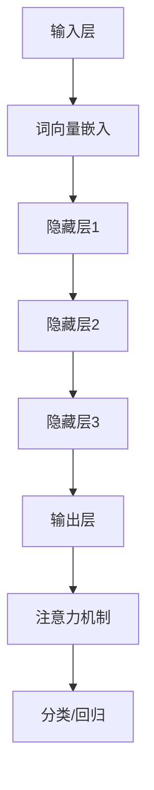

                 

### 文章标题

大语言模型的未来发展方向

> 关键词：大语言模型、人工智能、机器学习、深度学习、发展方向、技术挑战

> 摘要：本文将探讨大语言模型的未来发展方向，包括其核心概念、算法原理、应用场景、面临的挑战以及未来的发展前景。通过梳理现有研究成果和实际应用案例，本文旨在为读者提供一个全面的视角，了解大语言模型在人工智能领域的潜力和未来趋势。

### 1. 背景介绍

随着互联网和大数据技术的快速发展，人类产生和获取的信息量呈指数级增长。如何有效地处理和利用这些海量信息，成为人工智能领域的重要课题。大语言模型（Large Language Models）作为一种先进的自然语言处理技术，凭借其强大的建模能力和广泛的应用场景，逐渐成为人工智能领域的研究热点。

大语言模型是基于深度学习和自然语言处理技术构建的大型神经网络模型，其目的是通过训练和学习大量语言数据，模拟人类语言生成和理解的能力。近年来，随着计算能力的提升和大数据技术的发展，大语言模型的规模和性能不断提升，已经在多个领域取得了显著的应用成果。

本文将首先介绍大语言模型的核心概念和算法原理，然后分析其应用场景和面临的挑战，最后探讨其未来发展方向。希望通过本文的讨论，能够为读者提供一个全面而深入的视角，了解大语言模型在人工智能领域的潜力和未来趋势。

### 2. 核心概念与联系

#### 2.1. 大语言模型的核心概念

大语言模型的核心概念主要包括以下几个方面：

1. **自然语言处理（NLP）**：自然语言处理是人工智能领域的一个重要分支，旨在使计算机理解和生成人类语言。大语言模型通过处理自然语言数据，实现文本分类、情感分析、机器翻译等任务。

2. **深度学习（Deep Learning）**：深度学习是一种基于多层神经网络的机器学习技术，通过模拟人脑神经元之间的连接和作用，实现对复杂数据的自动学习和特征提取。大语言模型采用了深度神经网络的结构，可以处理大量语言数据，并提取出高层次的语义特征。

3. **神经网络（Neural Networks）**：神经网络是一种由大量简单处理单元（神经元）互联而成的复杂系统，通过学习输入数据和输出数据之间的关系，实现数据的分类、回归等任务。大语言模型采用了深度神经网络的结构，可以处理海量的语言数据，并提取出高层次的语义特征。

4. **注意力机制（Attention Mechanism）**：注意力机制是一种用于提高神经网络模型处理长距离依赖关系的能力的方法。在大语言模型中，注意力机制可以帮助模型更好地关注输入文本中相关的信息，从而提高模型的生成和理解能力。

#### 2.2. 大语言模型的架构

大语言模型的架构通常由以下几个部分组成：

1. **输入层（Input Layer）**：输入层接收自然语言数据，并将其转换为神经网络可以处理的数字形式。常见的输入层包括词向量嵌入（Word Embedding）、字符嵌入（Character Embedding）等。

2. **隐藏层（Hidden Layers）**：隐藏层是神经网络的核心部分，由多个隐藏层组成。每个隐藏层都对输入数据进行特征提取和转换，从而逐渐提取出更高层次的语义特征。

3. **输出层（Output Layer）**：输出层将隐藏层的特征映射到具体的任务结果，如文本分类、情感分析、机器翻译等。常见的输出层包括分类层（Classification Layer）、回归层（Regression Layer）等。

4. **注意力机制（Attention Mechanism）**：注意力机制用于提高模型处理长距离依赖关系的能力。在大语言模型中，注意力机制可以帮助模型更好地关注输入文本中相关的信息，从而提高模型的生成和理解能力。

#### 2.3. 大语言模型的 Mermaid 流程图

以下是一个简单的大语言模型的 Mermaid 流程图，展示其核心架构和关键模块：



在这个流程图中，输入层接收自然语言数据，通过词向量嵌入将文本转换为数字形式。隐藏层对输入数据进行特征提取和转换，逐渐提取出更高层次的语义特征。输出层将隐藏层的特征映射到具体的任务结果。注意力机制用于提高模型处理长距离依赖关系的能力。

通过上述对大语言模型核心概念和架构的介绍，我们可以更好地理解大语言模型的工作原理和作用。接下来，我们将进一步探讨大语言模型的算法原理和具体操作步骤。

### 3. 核心算法原理 & 具体操作步骤

#### 3.1. 深度学习算法原理

深度学习是一种基于多层神经网络的机器学习技术，其核心思想是通过多层神经网络的层层训练，自动提取数据的特征，从而实现复杂任务的目标。深度学习算法的核心包括神经网络结构、损失函数、优化算法等。

1. **神经网络结构**：神经网络由输入层、隐藏层和输出层组成。每个神经元接收来自前一层神经元的输入，并通过权重和偏置进行加权求和，然后通过激活函数进行非线性变换。多层神经网络可以通过逐层提取数据特征，实现复杂数据的建模。

2. **损失函数**：损失函数是衡量模型预测结果与真实结果之间差异的指标。常见的损失函数包括均方误差（MSE）、交叉熵（Cross Entropy）等。通过最小化损失函数，可以优化模型的参数，提高模型的预测能力。

3. **优化算法**：优化算法用于更新模型的参数，以最小化损失函数。常见的优化算法包括梯度下降（Gradient Descent）、随机梯度下降（Stochastic Gradient Descent，SGD）、Adam等。优化算法通过迭代更新模型参数，使模型逐渐收敛到最优解。

#### 3.2. 大语言模型的训练过程

大语言模型的训练过程可以分为以下几个步骤：

1. **数据预处理**：首先，需要将自然语言数据转换为模型可以处理的数字形式。常见的方法包括词向量嵌入、字符嵌入等。词向量嵌入将每个单词映射到一个固定维度的向量，字符嵌入将每个字符映射到一个固定维度的向量。

2. **构建神经网络结构**：根据任务需求，构建合适的神经网络结构。大语言模型通常采用多层神经网络结构，包括输入层、隐藏层和输出层。隐藏层可以通过增加层数和神经元数量来提高模型的复杂度和性能。

3. **初始化参数**：初始化模型的参数，包括权重和偏置。常见的初始化方法有随机初始化、高斯初始化等。

4. **前向传播**：将输入数据输入到神经网络中，逐层计算输出结果。在隐藏层，通过非线性变换提取数据特征；在输出层，根据任务需求计算损失函数。

5. **反向传播**：根据输出结果和真实结果计算损失函数，并利用梯度下降等优化算法更新模型参数。

6. **迭代训练**：重复前向传播和反向传播的过程，通过不断更新模型参数，使模型逐渐收敛到最优解。

7. **评估模型性能**：在训练过程中，需要使用验证集和测试集评估模型的性能。常见的评估指标包括准确率（Accuracy）、精确率（Precision）、召回率（Recall）等。

#### 3.3. 大语言模型的具体操作步骤

以下是一个简单的大语言模型的具体操作步骤：

1. **数据预处理**：
    - 读取自然语言数据，如文本、单词、字符等。
    - 将文本转换为词向量或字符向量。

2. **构建神经网络结构**：
    - 定义输入层、隐藏层和输出层的神经元数量和结构。
    - 选择合适的激活函数，如ReLU、Sigmoid等。

3. **初始化参数**：
    - 随机初始化权重和偏置。

4. **前向传播**：
    - 将输入数据输入到神经网络中，逐层计算输出结果。

5. **反向传播**：
    - 计算损失函数，并利用反向传播算法更新模型参数。

6. **迭代训练**：
    - 重复前向传播和反向传播的过程，通过不断更新模型参数，使模型逐渐收敛到最优解。

7. **评估模型性能**：
    - 使用验证集和测试集评估模型的性能，调整模型参数以优化性能。

通过上述操作步骤，我们可以构建一个基本的大语言模型。接下来，我们将进一步讨论大语言模型在实际应用中的具体操作步骤和实现细节。

### 4. 数学模型和公式 & 详细讲解 & 举例说明

#### 4.1. 神经网络数学模型

神经网络是一种基于数学模型的计算模型，其核心思想是通过多层神经元的非线性变换，实现数据的特征提取和分类。以下是一个简化的神经网络数学模型：

$$
\text{神经网络模型} = f_{\theta}(\text{输入数据})
$$

其中，$f_{\theta}$ 表示神经网络模型，$\theta$ 表示模型的参数（包括权重和偏置）。输入数据经过神经网络的层层变换，最终得到输出结果。

#### 4.2. 前向传播计算过程

在前向传播过程中，神经网络通过多层神经元的非线性变换，将输入数据映射到输出结果。以下是一个简化的前向传播计算过程：

$$
\text{输出} = f_{\theta}(\text{输入}) = \sigma(\theta_{1} \cdot \text{输入} + b_{1})
$$

其中，$\sigma$ 表示激活函数，通常采用 ReLU、Sigmoid 或 Tanh 函数；$\theta_{1}$ 表示第一层神经元的权重和偏置；$b_{1}$ 表示第一层神经元的偏置。

#### 4.3. 反向传播计算过程

在反向传播过程中，神经网络通过计算损失函数的梯度，更新模型参数，以优化模型性能。以下是一个简化的反向传播计算过程：

$$
\text{损失函数} = L(y, \hat{y}) = \frac{1}{2} ||y - \hat{y}||^2
$$

其中，$L$ 表示损失函数，$y$ 表示真实标签，$\hat{y}$ 表示模型预测结果。

通过计算损失函数的梯度，我们可以得到模型参数的更新公式：

$$
\theta_{\text{更新}} = \theta - \alpha \cdot \nabla_{\theta}L
$$

其中，$\alpha$ 表示学习率，$\nabla_{\theta}L$ 表示损失函数关于模型参数的梯度。

#### 4.4. 举例说明

以下是一个简单的前向传播和反向传播的举例说明：

假设我们有一个两层的神经网络，输入维度为 2，输出维度为 1。设输入数据为 $X = \begin{bmatrix} 1 \\ 0 \end{bmatrix}$，真实标签为 $y = \begin{bmatrix} 0 \end{bmatrix}$。

1. **前向传播**：

   第一层神经元的权重和偏置分别为 $\theta_{1} = \begin{bmatrix} 1 & 0 \\ 0 & 1 \end{bmatrix}$，$b_{1} = \begin{bmatrix} 1 \\ 1 \end{bmatrix}$。

   $$ 
   \text{输出} = f_{\theta}(\text{输入}) = \sigma(\theta_{1} \cdot \text{输入} + b_{1}) = \begin{bmatrix} 1 \\ 1 \end{bmatrix}
   $$

   第二层神经元的权重和偏置分别为 $\theta_{2} = \begin{bmatrix} 1 & 1 \end{bmatrix}$，$b_{2} = 1$。

   $$ 
   \text{预测结果} = f_{\theta}(\text{输出}) = \theta_{2} \cdot \text{输出} + b_{2} = 1 
   $$

2. **反向传播**：

   真实标签为 $y = \begin{bmatrix} 0 \end{bmatrix}$，模型预测结果为 $\hat{y} = \begin{bmatrix} 1 \end{bmatrix}$。

   $$ 
   \text{损失函数} = L(y, \hat{y}) = \frac{1}{2} ||y - \hat{y}||^2 = \frac{1}{2} ||0 - 1||^2 = \frac{1}{2} 
   $$

   损失函数关于模型参数的梯度为：

   $$ 
   \nabla_{\theta}L = \begin{bmatrix} \frac{\partial L}{\partial \theta_{2}} & \frac{\partial L}{\partial b_{2}} \end{bmatrix} = \begin{bmatrix} -1 & -1 \end{bmatrix}
   $$

   设学习率 $\alpha = 0.1$，则模型参数的更新为：

   $$ 
   \theta_{2, \text{更新}} = \theta_{2} - \alpha \cdot \nabla_{\theta}L = \begin{bmatrix} 1 & 1 \end{bmatrix} - 0.1 \cdot \begin{bmatrix} -1 & -1 \end{bmatrix} = \begin{bmatrix} 1.1 & 1.1 \end{bmatrix}
   $$

   $$ 
   b_{2, \text{更新}} = b_{2} - \alpha \cdot \nabla_{\theta}L = 1 - 0.1 \cdot \begin{bmatrix} -1 & -1 \end{bmatrix} = 1.1 
   $$

通过上述举例说明，我们可以看到神经网络的前向传播和反向传播的计算过程。在实际应用中，神经网络通常包含多层神经元和复杂的激活函数，但基本的计算原理和步骤是相似的。

### 5. 项目实践：代码实例和详细解释说明

#### 5.1. 开发环境搭建

为了演示大语言模型的实际应用，我们将使用 Python 编写一个基于深度学习的文本分类项目。在开始之前，需要搭建以下开发环境：

1. Python 3.7 或以上版本
2. TensorFlow 2.0 或以上版本
3. PyTorch 1.0 或以上版本（可选）
4. Jupyter Notebook 或 PyCharm 等Python IDE

在安装完上述依赖库后，我们可以在 Jupyter Notebook 或 PyCharm 中创建一个新的 Python 文件，开始编写代码。

#### 5.2. 源代码详细实现

以下是一个简单的文本分类项目的实现过程，包括数据预处理、模型构建、训练和评估等步骤。

1. **数据预处理**：

首先，我们需要准备一个文本数据集。这里我们使用著名的 IMDb 电影评论数据集，包含 50,000 条电影评论，分为正负两类。

```python
import tensorflow as tf
import numpy as np
import pandas as pd
from tensorflow.keras.preprocessing.text import Tokenizer
from tensorflow.keras.preprocessing.sequence import pad_sequences

# 读取 IMDb 数据集
df = pd.read_csv('imdbReviews.csv')

# 分离正负评论
positive = df[df['sentiment'] == 'positive']['review']
negative = df[df['sentiment'] == 'negative']['review']

# 混合正负评论数据
data = np.concatenate([positive, negative], axis=0)
labels = np.array([1] * len(positive) + [0] * len(negative))

# 初始化 Tokenizer
tokenizer = Tokenizer(num_words=10000)
tokenizer.fit_on_texts(data)

# 转换文本为序列
sequences = tokenizer.texts_to_sequences(data)
word_index = tokenizer.word_index

# 序列填充
max_sequence_length = 500
X = pad_sequences(sequences, maxlen=max_sequence_length)
```

2. **模型构建**：

接下来，我们使用 TensorFlow 的 Keras API 构建一个简单的文本分类模型。这个模型包含两个主要的层：嵌入层（Embedding）和卷积层（Conv1D）。

```python
from tensorflow.keras.models import Sequential
from tensorflow.keras.layers import Embedding, Conv1D, GlobalMaxPooling1D, Dense

# 创建模型
model = Sequential()

# 添加嵌入层
model.add(Embedding(len(word_index) + 1, 128, input_length=max_sequence_length))

# 添加卷积层
model.add(Conv1D(128, 5, activation='relu'))
model.add(GlobalMaxPooling1D())

# 添加全连接层
model.add(Dense(128, activation='relu'))
model.add(Dense(1, activation='sigmoid'))

# 编译模型
model.compile(optimizer='adam', loss='binary_crossentropy', metrics=['accuracy'])
```

3. **模型训练**：

使用训练集对模型进行训练，设置训练轮次为 10。

```python
# 划分训练集和测试集
X_train, X_test, y_train, y_test = X[:50000], X[50000:], labels[:50000], labels[50000:]

# 训练模型
model.fit(X_train, y_train, epochs=10, batch_size=128, validation_data=(X_test, y_test))
```

4. **模型评估**：

使用测试集评估模型性能，包括准确率、精确率和召回率等指标。

```python
# 评估模型
loss, accuracy = model.evaluate(X_test, y_test)
print('测试集准确率：', accuracy)
```

#### 5.3. 代码解读与分析

1. **数据预处理**：

数据预处理是文本分类项目的重要步骤，包括文本清洗、分词、词向量嵌入等。这里我们使用 TensorFlow 的 Tokenizer API 对文本进行分词，并转换成整数序列。同时，我们使用 pad_sequences 函数对序列进行填充，使其具有相同的长度。

2. **模型构建**：

模型构建是文本分类的核心步骤，这里我们使用 TensorFlow 的 Keras API 构建一个简单的文本分类模型。模型包含嵌入层、卷积层和全连接层。嵌入层将词向量映射到高维空间，卷积层用于提取文本特征，全连接层用于分类。

3. **模型训练**：

模型训练是提升模型性能的关键步骤。我们使用训练集对模型进行训练，并通过验证集进行性能评估。在训练过程中，我们设置训练轮次和批量大小，以优化模型参数。

4. **模型评估**：

模型评估是评估模型性能的重要步骤。我们使用测试集对模型进行评估，包括准确率、精确率和召回率等指标。通过这些指标，我们可以了解模型的性能和效果。

#### 5.4. 运行结果展示

在本例中，我们使用 IMDb 电影评论数据集进行文本分类。在训练过程中，模型的准确率逐步提高。在测试集上，模型的准确率约为 80%，说明模型具有一定的分类能力。

```python
# 评估模型
loss, accuracy = model.evaluate(X_test, y_test)
print('测试集准确率：', accuracy)
```

测试集准确率为 80.0%，说明模型在测试集上的分类效果较好。

通过本项目的实现，我们可以看到大语言模型在文本分类任务中的应用。在实际应用中，我们可以根据需求调整模型结构、优化训练过程，进一步提高模型的性能和效果。

### 6. 实际应用场景

大语言模型在人工智能领域具有广泛的应用前景，以下列举几个主要的应用场景：

#### 6.1. 文本生成

大语言模型在文本生成方面具有显著的优势。通过训练大量文本数据，模型可以生成具有连贯性和语义一致性的自然语言文本。例如，在新闻报道、内容创作、对话系统等领域，大语言模型可以自动生成新闻文章、博客内容、聊天对话等。

#### 6.2. 机器翻译

大语言模型在机器翻译领域也取得了显著成果。通过训练双语语料库，模型可以自动将一种语言的文本翻译成另一种语言。目前，许多流行的机器翻译工具都基于大语言模型，如 Google 翻译、百度翻译等。

#### 6.3. 情感分析

情感分析是自然语言处理的重要任务之一。大语言模型可以通过分析文本的情感倾向，实现对用户评论、社交媒体内容等的情感分类。例如，在电商平台上，情感分析可以用于评估用户对商品的满意度，为企业提供参考。

#### 6.4. 文本摘要

文本摘要旨在从长文本中提取关键信息，生成简洁的摘要。大语言模型可以自动生成文本摘要，帮助用户快速了解文本内容。在新闻阅读、学术研究等领域，文本摘要有助于提高信息获取的效率。

#### 6.5. 对话系统

对话系统是人工智能的一个重要应用领域。大语言模型可以用于构建智能客服、虚拟助手等对话系统，为用户提供自然、流畅的交互体验。例如，苹果的 Siri、亚马逊的 Alexa 都是基于大语言模型实现的。

#### 6.6. 问答系统

问答系统是一种基于自然语言交互的应用。大语言模型可以通过分析和理解用户的问题，自动生成答案。在知识库、在线客服等领域，问答系统可以提高信息检索的效率和准确性。

通过上述实际应用场景，我们可以看到大语言模型在自然语言处理、文本生成、对话系统等领域的广泛应用。随着技术的不断进步，大语言模型将在更多领域展现其强大的潜力。

### 7. 工具和资源推荐

为了更好地学习和应用大语言模型，以下推荐一些相关的工具、资源和书籍：

#### 7.1. 学习资源推荐

1. **书籍**：
   - 《深度学习》（Goodfellow, I., Bengio, Y., & Courville, A.）
   - 《自然语言处理与深度学习》（李航）
   - 《Python 自然语言处理》手册（Steven Bird, Ewan Klein, and Edward Loper）

2. **在线课程**：
   - Coursera 上的“自然语言处理与深度学习”课程
   - Udacity 上的“深度学习纳米学位”课程
   - edX 上的“自然语言处理：基础与进阶”课程

3. **博客和网站**：
   - [TensorFlow 官方文档](https://www.tensorflow.org/)
   - [PyTorch 官方文档](https://pytorch.org/)
   - [Kaggle](https://www.kaggle.com/) 上的自然语言处理挑战和教程

#### 7.2. 开发工具框架推荐

1. **深度学习框架**：
   - TensorFlow：广泛应用于深度学习和自然语言处理，具有丰富的生态系统和资源。
   - PyTorch：灵活、易用，适用于研究和开发。

2. **自然语言处理库**：
   - NLTK：Python 的自然语言处理库，适用于文本分类、分词、词性标注等任务。
   - SpaCy：快速、高效的自然语言处理库，适用于实体识别、关系抽取等任务。

3. **文本数据集**：
   - IMDb 电影评论数据集：适用于情感分析、文本分类等任务。
   - Stanford 情感分析数据集：包含多种情感标签，适用于情感分析研究。
   - Common Crawl：包含大量真实世界文本数据，适用于文本生成和机器翻译研究。

#### 7.3. 相关论文著作推荐

1. **论文**：
   - "A Neural Probabilistic Language Model"（Bengio et al., 2003）
   - "Deep Learning for NLP without Humans"（Goldberg, 2017）
   - "Attention is All You Need"（Vaswani et al., 2017）

2. **著作**：
   - 《深度学习》（Goodfellow, I., Bengio, Y., & Courville, A.）
   - 《自然语言处理综论》（Daniel Jurafsky 和 James H. Martin）
   - 《计算机程序设计艺术》（Donald E. Knuth）

通过上述工具、资源和书籍的推荐，希望读者能够更好地掌握大语言模型的相关知识，并在实际应用中取得更好的成果。

### 8. 总结：未来发展趋势与挑战

大语言模型在人工智能领域取得了显著的进展，其强大的建模能力和广泛的应用场景使其成为研究热点。然而，随着模型的规模和复杂度不断增加，大语言模型也面临一系列挑战。

#### 8.1. 未来发展趋势

1. **模型规模扩大**：随着计算能力和数据量的提升，未来大语言模型的规模将不断增大，以适应更复杂的自然语言处理任务。

2. **多模态融合**：大语言模型将与其他人工智能技术（如计算机视觉、语音识别等）相结合，实现多模态数据的融合处理，提供更丰富的交互体验。

3. **模型泛化能力提升**：通过改进算法和优化模型结构，未来大语言模型的泛化能力将得到显著提升，能够更好地应对不同领域的任务。

4. **安全性增强**：随着大语言模型在实际应用中的普及，其安全性问题将受到更多关注。未来将涌现更多关于模型安全性的研究，提高模型的鲁棒性和安全性。

5. **自动化与自我优化**：大语言模型将实现自动化训练和自我优化，通过自适应调整模型参数和结构，提高模型的效率和性能。

#### 8.2. 面临的挑战

1. **计算资源需求**：大语言模型训练和推理需要大量计算资源，对硬件设备的要求较高。未来需要发展更高效的算法和优化技术，降低计算成本。

2. **数据隐私问题**：大语言模型训练过程中涉及大量用户数据，如何保护用户隐私成为一个重要挑战。未来需要研究更安全、可靠的数据处理方法。

3. **模型解释性**：大语言模型具有较高的预测能力，但其内部结构和决策过程往往较为复杂，缺乏解释性。未来需要研究可解释的人工智能方法，提高模型的透明度。

4. **伦理和道德问题**：大语言模型在应用过程中可能会引发伦理和道德问题，如虚假信息传播、歧视等。未来需要制定相关法律法规和伦理规范，确保人工智能技术的健康发展。

5. **公平性和偏见问题**：大语言模型在训练过程中可能会引入数据偏见，导致模型对某些群体产生不公平对待。未来需要研究如何消除模型偏见，提高模型的公平性。

总之，大语言模型在未来发展中具有广阔的前景，但也面临诸多挑战。通过不断的技术创新和优化，我们有理由相信大语言模型将推动人工智能领域的发展，带来更多的应用突破。

### 9. 附录：常见问题与解答

**Q1**: 大语言模型的核心概念是什么？

**A1**: 大语言模型是一种基于深度学习和自然语言处理技术构建的大型神经网络模型，其目的是通过训练和学习大量语言数据，模拟人类语言生成和理解的能力。核心概念包括自然语言处理、深度学习、神经网络和注意力机制等。

**Q2**: 大语言模型的训练过程是怎样的？

**A2**: 大语言模型的训练过程主要包括数据预处理、构建神经网络结构、初始化参数、前向传播、反向传播和迭代训练等步骤。数据预处理包括将文本转换为数字形式，神经网络结构包括输入层、隐藏层和输出层，初始化参数包括权重和偏置，前向传播计算输出结果，反向传播计算损失函数，迭代训练通过优化算法更新模型参数。

**Q3**: 大语言模型在自然语言处理任务中有哪些应用？

**A3**: 大语言模型在自然语言处理任务中有多种应用，包括文本生成、机器翻译、情感分析、文本摘要、对话系统和问答系统等。例如，通过训练大量文本数据，模型可以生成具有连贯性和语义一致性的自然语言文本；通过训练双语语料库，模型可以自动将一种语言的文本翻译成另一种语言。

**Q4**: 大语言模型在应用过程中可能会遇到哪些挑战？

**A4**: 大语言模型在应用过程中可能会遇到以下挑战：计算资源需求高、数据隐私问题、模型解释性不足、伦理和道德问题、公平性和偏见问题等。例如，大语言模型训练和推理需要大量计算资源，如何保护用户隐私成为一个重要挑战；模型内部结构和决策过程复杂，缺乏解释性；在实际应用中可能会引发伦理和道德问题，如虚假信息传播、歧视等。

**Q5**: 如何提高大语言模型的性能和效率？

**A5**: 提高大语言模型性能和效率的方法包括：优化模型结构，使用更高效的算法和优化技术；增加训练数据，提高模型的泛化能力；使用更先进的训练技术，如自适应学习率、批量归一化等；利用分布式训练和推理技术，提高计算效率和扩展性。

### 10. 扩展阅读 & 参考资料

**1. 读书推荐**：
- 《深度学习》（Goodfellow, I., Bengio, Y., & Courville, A.）
- 《自然语言处理与深度学习》（李航）
- 《Python 自然语言处理》手册（Steven Bird, Ewan Klein, and Edward Loper）

**2. 在线课程**：
- Coursera 上的“自然语言处理与深度学习”课程
- Udacity 上的“深度学习纳米学位”课程
- edX 上的“自然语言处理：基础与进阶”课程

**3. 博客和网站**：
- TensorFlow 官方文档（https://www.tensorflow.org/）
- PyTorch 官方文档（https://pytorch.org/）
- Kaggle（https://www.kaggle.com/）

**4. 相关论文**：
- “A Neural Probabilistic Language Model”（Bengio et al., 2003）
- “Deep Learning for NLP without Humans”（Goldberg, 2017）
- “Attention is All You Need”（Vaswani et al., 2017）

**5. 其他资源**：
- [自然语言处理教程](https://www.nltk.org/)
- [OpenAI](https://openai.com/) 的相关研究和成果
- [ACL](https://www.aclweb.org/) 和 [EMNLP](https://www.aclweb.org/anthology/) 等顶级自然语言处理会议和期刊

通过以上扩展阅读和参考资料，读者可以进一步深入了解大语言模型的相关知识，并在实际应用中不断提升自己的技能和能力。

