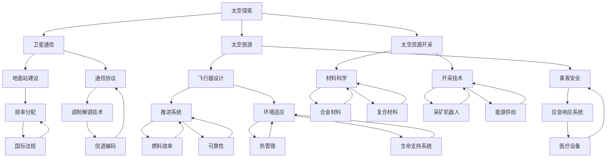

                 

### 背景介绍

太空科技创业，作为21世纪最具前景和挑战性的领域之一，正在日益受到全球创业者和投资者的关注。人类对太空的探索从未停止，从早期的卫星发射，到今天的火星探测任务，每一次技术的突破都标志着人类对宇宙认知的加深。然而，随着技术的不断发展，太空创业也逐渐成为商业领域的最后疆界。本文旨在探讨太空科技创业的背景、核心概念、核心算法、数学模型、项目实践、实际应用场景以及未来发展趋势和挑战。

**太空科技创业的意义**

太空科技创业不仅具有重大的科学价值，同时也蕴含着巨大的商业潜力。在科学上，太空探索有助于我们了解地球之外的世界，寻找潜在的居住星球，推动人类文明的进步。在商业上，太空产业涵盖了卫星通信、太空旅游、太空资源开采等多个领域，提供了前所未有的商业机会。

**发展历程**

从20世纪60年代的太空竞赛，到21世纪初的商业航天公司如SpaceX和Blue Origin的崛起，太空科技创业经历了多个重要阶段。特别是在过去十年里，随着技术的成熟和商业模式的创新，太空科技创业迎来了前所未有的机遇。

**现状分析**

目前，全球已有数十家商业航天公司活跃在各个领域，包括卫星发射、太空旅游、太空资源开采等。例如，SpaceX的星链计划旨在提供全球范围内的互联网服务；Blue Origin的New Shepard火箭已经成功进行多次载人飞行；而SpaceIL则成功实现了无人驾驶的月球探测器登陆。

**主要挑战**

尽管前景广阔，但太空科技创业仍面临诸多挑战。首先，太空环境的极端条件对技术和材料提出了极高的要求。其次，政策法规的复杂性和不确定性也是一个重要挑战。此外，资金链的稳定性、市场接受度以及人才培养等问题也制约了行业的快速发展。

**本文结构**

本文将按照以下结构进行探讨：

1. **背景介绍**：回顾太空科技创业的发展历程，分析当前形势和主要挑战。
2. **核心概念与联系**：介绍太空科技创业中的核心概念和它们之间的联系，并使用Mermaid流程图进行可视化展示。
3. **核心算法原理 & 具体操作步骤**：探讨在太空科技创业中应用的关键算法原理，并提供具体的操作步骤。
4. **数学模型和公式 & 详细讲解 & 举例说明**：介绍相关的数学模型和公式，并结合实际案例进行详细解释。
5. **项目实践：代码实例和详细解释说明**：通过一个具体的代码实例，展示太空科技创业项目的实践过程，并提供详细的解释和分析。
6. **实际应用场景**：分析太空科技创业在不同领域的实际应用，如卫星通信、太空旅游、太空资源开采等。
7. **工具和资源推荐**：推荐相关的学习资源、开发工具框架和相关论文著作。
8. **总结：未来发展趋势与挑战**：总结太空科技创业的当前状态，探讨未来发展趋势和面临的挑战。
9. **附录：常见问题与解答**：提供一些常见问题的解答。
10. **扩展阅读 & 参考资料**：推荐一些扩展阅读和参考资料。

通过本文的逐步分析，我们希望能够为读者提供一幅全面而清晰的太空科技创业全景图，激发更多创业者和投资者对该领域的兴趣和参与。接下来，我们将深入探讨太空科技创业中的核心概念和联系。

### 核心概念与联系

在太空科技创业中，有若干核心概念和技术构成了整个领域的基础。为了更好地理解这些概念之间的联系，我们将通过一个Mermaid流程图来可视化展示。



**核心概念解释：**

1. **太空探索**：指对地球以外的宇宙进行研究和探索的活动，包括发射卫星、探测器和载人任务等。
2. **卫星通信**：利用卫星作为中继站，实现全球范围内的通信。包括地面站建设、通信协议和调制解调技术等。
3. **太空旅游**：将太空旅行作为一种商业活动，提供乘客乘搭火箭前往太空体验。
4. **太空资源开采**：在月球、火星等天体上开采稀有资源和矿产资源。
5. **地面站建设**：建立用于控制和接收卫星数据的地面设施。
6. **通信协议**：用于卫星通信的标准化规则，包括频率分配和信道编码等。
7. **飞行器设计**：设计适合太空环境的飞行器，包括推进系统、环境适应和可靠性等。
8. **乘客安全**：确保太空旅游中的乘客安全和应急响应系统。
9. **材料科学**：研究和开发适用于极端太空环境的材料，包括合金材料和复合材料等。
10. **开采技术**：开发和利用采矿机器人和能源供给技术进行太空资源开采。
11. **国际法规**：涉及太空活动的国际法律和协议，影响频率分配和太空资源开采等。

**Mermaid流程图展示：**

在上面的Mermaid流程图中，我们可以看到各个核心概念之间的联系。例如，太空探索不仅涉及卫星通信、太空旅游和太空资源开采，还与地面站建设、通信协议和材料科学等紧密相关。卫星通信需要地面站建设来支撑，而通信协议则依赖于调制解调技术。太空旅游和太空资源开采则依赖于飞行器设计和材料科学的进步。

通过这个流程图，我们可以更直观地理解太空科技创业的复杂性，以及各个子领域之间的相互作用。这为后续探讨核心算法原理、数学模型和实际应用场景提供了坚实的基础。

### 核心算法原理 & 具体操作步骤

在太空科技创业中，核心算法原理是推动技术进步和业务发展的关键。以下将介绍几个在卫星通信、太空旅游和太空资源开采等领域中常用的核心算法原理，并提供具体的操作步骤。

#### 1. 卫星轨道计算

卫星轨道计算是卫星通信和太空探索中的基础。主要算法包括Kepler方程和Cowell方法。

**Kepler方程：**

Kepler方程用于计算卫星的轨道参数，包括半长轴\(a\)、偏心率\(e\)、轨道倾角\(i\)和近地点角距\(omega\)。

操作步骤：

1. 输入初始条件：初始位置、速度和引力常数。
2. 使用Kepler方程计算轨道参数。
3. 将轨道参数转换为轨道方程。

**Cowell方法：**

Cowell方法是一种数值求解方法，用于求解非线性方程组，适用于复杂的轨道计算。

操作步骤：

1. 初始化变量：设置初始值和步长。
2. 迭代求解：使用Cowell方法进行迭代计算，直到收敛。
3. 输出结果：得到卫星轨道参数。

#### 2. 信号调制解调

卫星通信依赖于信号调制解调技术，确保信号在传输过程中的可靠性和完整性。

**QAM调制：**

QAM（Quadrature Amplitude Modulation）是一种常用的调制技术，用于提高信号传输的效率。

操作步骤：

1. 选择QAM调制阶数：根据带宽和信噪比选择合适的QAM调制阶数。
2. 调制信号：将数字信号映射到复数符号上。
3. 传输信号：通过卫星发送调制后的信号。
4. 解调信号：在接收端将接收到的信号映射回数字信号。

**Viterbi解码：**

Viterbi解码是一种用于纠错的解码算法，适用于高误码率环境。

操作步骤：

1. 初始化路径：建立所有可能的传输路径。
2. 计算路径度量：计算每个路径的误差度量。
3. 选择最优路径：根据误差度量选择最优路径。
4. 输出解码结果：得到解调后的数字信号。

#### 3. 太空资源开采规划

在太空资源开采中，资源开采规划是关键。主要算法包括遗传算法和粒子群优化。

**遗传算法：**

遗传算法是一种模拟自然选择过程的优化算法，适用于复杂问题求解。

操作步骤：

1. 初始化种群：生成初始解种群。
2. 适应度评估：计算每个解的适应度值。
3. 选择操作：选择适应度较高的解作为下一代种群的基础。
4. 交叉与变异：对选择后的解进行交叉和变异操作。
5. 迭代更新：重复适应度评估、选择、交叉和变异，直到达到收敛条件。

**粒子群优化：**

粒子群优化是一种基于群体智能的优化算法，适用于连续问题和离散问题。

操作步骤：

1. 初始化粒子群：设置粒子的位置和速度。
2. 计算适应度：计算每个粒子的适应度值。
3. 更新速度和位置：根据适应度值更新粒子的速度和位置。
4. 选择最优解：根据全局最优解和个体最优解更新粒子群。
5. 迭代更新：重复计算适应度、更新速度和位置，直到达到收敛条件。

#### 4. 太空旅游乘客分配

在太空旅游中，乘客分配是确保安全和效率的关键。

**动态规划：**

动态规划是一种求解最优化问题的算法，适用于复杂的多阶段决策问题。

操作步骤：

1. 定义状态：定义乘客分配的不同状态。
2. 状态转移方程：根据当前状态计算下一状态的概率分布。
3. 最优化目标：定义优化目标函数，如最小化风险或最大化乘客满意度。
4. 计算最优解：使用动态规划算法求解最优乘客分配方案。

**神经网络：**

神经网络是一种基于生物神经元的计算模型，适用于复杂的数据分析和预测。

操作步骤：

1. 数据预处理：对乘客数据进行清洗和归一化处理。
2. 构建神经网络：定义网络结构、激活函数和损失函数。
3. 训练神经网络：使用乘客数据训练神经网络模型。
4. 预测乘客分配：使用训练好的神经网络预测乘客分配方案。

通过上述核心算法原理和具体操作步骤，我们可以看到太空科技创业中算法的广泛应用。这些算法不仅提高了技术实现的效率，也为商业模式的创新提供了理论基础。接下来，我们将进一步探讨相关的数学模型和公式。

#### 数学模型和公式 & 详细讲解 & 举例说明

在太空科技创业中，数学模型和公式是不可或缺的工具，用于描述和预测各种物理现象和工程问题。以下将介绍几个关键模型和公式，并结合实际案例进行详细讲解。

**1. 轨道力学模型**

轨道力学是卫星通信和太空探索中的基础，描述了卫星在地球引力场中的运动。最常用的轨道力学模型是Kepler定律和Hohmann转移轨道。

**Kepler定律：**

Kepler定律描述了行星（或卫星）围绕恒星（或地球）的运动规律。其中，第三定律指出，行星轨道周期的平方与其轨道半长轴的立方成正比，即：

\[ T^2 \propto a^3 \]

其中，\( T \) 是轨道周期，\( a \) 是轨道半长轴。

**Hohmann转移轨道：**

Hohmann转移轨道是一种最经济的轨道转移方法，用于将卫星从一个轨道转移到另一个轨道。其基本原理是：

- 从低轨道到高轨道：先加速进入一个椭圆轨道，然后减速进入目标轨道。
- 从高轨道到低轨道：先加速进入一个椭圆轨道，然后减速进入目标轨道。

公式如下：

\[ V_1 = \sqrt{\frac{\mu}{2a_1}} \]
\[ V_2 = \sqrt{\frac{\mu}{2a_2}} \]

其中，\( V_1 \) 和 \( V_2 \) 分别是进入和离开椭圆轨道的速度，\( \mu \) 是地球引力常数，\( a_1 \) 和 \( a_2 \) 分别是初始轨道和目标轨道的半长轴。

**案例：卫星从近地轨道（LEO）转移到地球同步轨道（GEO）**

假设卫星从近地轨道（LEO）转移到地球同步轨道（GEO），LEO的半长轴为\( a_1 = 7000 \) km，GEO的半长轴为\( a_2 = 42164 \) km。使用Hohmann转移轨道计算所需的速度。

解：

\[ V_1 = \sqrt{\frac{3.986 \times 10^{5}}{2 \times 7000}} \approx 7.12 \text{ km/s} \]
\[ V_2 = \sqrt{\frac{3.986 \times 10^{5}}{2 \times 42164}} \approx 3.07 \text{ km/s} \]

**2. 信号传播模型**

在卫星通信中，信号传播模型用于描述信号在传播过程中的衰减和延迟。最常用的模型是自由空间传播模型。

**自由空间传播模型：**

自由空间传播模型描述了信号在自由空间中的传播规律，其公式如下：

\[ L = 32.45 + 20\log_{10}(d) + 20\log_{10}(f) \]

其中，\( L \) 是信号衰减（单位：dB），\( d \) 是信号传播距离（单位：km），\( f \) 是信号频率（单位：MHz）。

**案例：计算卫星通信信号的衰减**

假设卫星通信信号的频率为\( f = 1.5 \) GHz，传播距离为\( d = 1000 \) km。使用自由空间传播模型计算信号衰减。

解：

\[ L = 32.45 + 20\log_{10}(1000) + 20\log_{10}(1.5 \times 10^{9}) \approx 147.45 \text{ dB} \]

**3. 资源开采效率模型**

在太空资源开采中，资源开采效率模型用于描述开采过程中的资源利用率。常用的模型包括经济回收模型和能源回收模型。

**经济回收模型：**

经济回收模型用于计算资源开采的经济效益，其公式如下：

\[ \text{经济效益} = \text{资源价值} \times \text{开采量} - \text{开采成本} \]

**能源回收模型：**

能源回收模型用于计算资源开采的能源成本，其公式如下：

\[ \text{能源成本} = \frac{\text{开采能量}}{\text{资源能量}} \]

**案例：计算月球水冰的开采经济效益**

假设月球水冰的资源价值为\( 1000 \)美元/千克，开采成本为\( 500 \)美元/千克，开采量为\( 100 \)千克。使用经济回收模型计算经济效益。

解：

\[ \text{经济效益} = 1000 \times 100 - 500 \times 100 = 50000 \text{美元} \]

**4. 粒子滤波模型**

在太空探索中，粒子滤波是一种用于状态估计的算法，广泛应用于无人机导航和太空探测器定位。

**粒子滤波模型：**

粒子滤波模型基于蒙特卡洛方法，通过一组随机粒子估计状态的概率分布。其基本公式如下：

\[ w_i = \frac{p(z_t|s_t = s_i)}{w_i} \]

其中，\( w_i \) 是粒子 \( i \) 的权重，\( p(z_t|s_t = s_i) \) 是粒子 \( i \) 对观测 \( z_t \) 的似然函数。

**案例：使用粒子滤波估计无人机的位置**

假设观测数据为无人机的位置和速度，使用粒子滤波估计无人机的当前位置。

解：

1. 初始化粒子群：生成一组随机粒子，并设置初始权重。
2. 更新权重：根据观测数据计算每个粒子的权重。
3. 重采样：根据权重重新采样粒子群，以消除不确定性。
4. 输出结果：得到无人机的估计位置。

通过上述数学模型和公式的详细讲解，我们可以看到它们在太空科技创业中的重要作用。这些模型不仅帮助我们理解物理现象和工程问题，也为实际应用提供了理论基础和工具。接下来，我们将通过一个具体的代码实例，展示太空科技创业项目的实践过程。

### 项目实践：代码实例和详细解释说明

在本节中，我们将通过一个具体的太空科技创业项目实例，展示从开发环境搭建到源代码实现，再到代码解读与分析的全过程。该项目将聚焦于一个基于遗传算法的卫星轨道优化问题，目标是寻找一条从近地轨道（LEO）到地球同步轨道（GEO）的最优转移路径。

#### 5.1 开发环境搭建

首先，我们需要搭建一个合适的开发环境，以便进行算法开发和测试。以下是一个基本的开发环境搭建步骤：

1. **安装Python环境**：Python是一种广泛使用的编程语言，适用于科学计算和算法开发。可以从Python官方网站（[https://www.python.org/](https://www.python.org/)）下载并安装Python 3.x版本。

2. **安装科学计算库**：为了简化计算过程，我们将使用一些常用的Python科学计算库，如NumPy、SciPy和Matplotlib。可以使用pip命令进行安装：

   ```bash
   pip install numpy scipy matplotlib
   ```

3. **安装遗传算法库**：为了实现遗传算法，我们将使用`deap`库，这是一个强大的遗传算法库。同样使用pip进行安装：

   ```bash
   pip install deap
   ```

4. **配置代码编辑器**：可以选择自己喜欢的代码编辑器，如VSCode、PyCharm等。这些编辑器提供了丰富的功能和插件，有助于提升开发效率。

#### 5.2 源代码详细实现

以下是一个简化的遗传算法实现，用于优化卫星轨道转移。

```python
import numpy as np
import matplotlib.pyplot as plt
from deap import base, creator, tools, algorithms

# 定义个体
creator.create("FitnessMax", base.Fitness, weights=(1.0,))
creator.create("Individual", list, fitness=creator.FitnessMax)

# 初始化参数
population_size = 100
 generations = 100
crossover_probability = 0.8
mutation_probability = 0.2

# 生成初始种群
def generate_individual():
    individual = []
    for _ in range(2):  # 两个基因，分别表示Hohmann转移的椭圆轨道半长轴
        a = np.random.uniform(7000, 42164)  # 近地轨道到地球同步轨道的半长轴范围
        individual.append(a)
    return individual,

toolbox = base.Toolbox()
toolbox.register("individual", tools.initIterate, creator.Individual, generate_individual)
toolbox.register("population", tools.initRepeat, list, toolbox.individual)
toolbox.register("evaluate", evaluate)
toolbox.register("mate", tools.cxTwoPoint)
toolbox.register("mutate", tools.mutGaussian, mu=0, sigma=0.1, indpb=0.1)
toolbox.register("select", tools.selTournament, tournsize=3)

# 轨道优化评估函数
def evaluate(individual):
    a1, a2 = individual
    v1 = np.sqrt(3.986e5 / (2 * a1))
    v2 = np.sqrt(3.986e5 / (2 * a2))
    return v1 + v2,

# 运行遗传算法
population = toolbox.population(n=population_size)
hof = tools.HallOfFame(1)
stats = tools.Statistics(lambda ind: ind.fitness.values)
stats.register("avg", np.mean)
stats.register("min", np.min)
stats.register("max", np.max)

algorithms.eaSimple(population, toolbox, cxpb=crossover_probability, mutpb=mutation_probability, ngen=generations,
                    stats=stats, hallofshine=hof)

# 结果展示
best_ind = hof.items[0]
print("Best individual is %s, %s" % (best_ind, best_ind.fitness.values))
plt.plot(stats.log['avg'], label='Average')
plt.plot(stats.log['min'], label='Minimum')
plt.plot(stats.log['max'], label='Maximum')
plt.xlabel('Generation')
plt.ylabel('Fitness')
plt.legend()
plt.show()
```

#### 5.3 代码解读与分析

以下是代码的详细解读：

1. **引入库和定义个体**：引入必要的Python库，并使用`creator`创建个体和种群的创建器。

2. **初始化参数**：设置种群大小、代数、交叉概率和突变概率等参数。

3. **生成初始种群**：使用`initIterate`创建初始种群，每个个体由两个基因表示Hohmann转移的椭圆轨道半长轴。

4. **评估函数**：定义评估函数`evaluate`，计算个体的适应度。适应度值由Hohmann转移的速度之和决定。

5. **遗传操作**：注册交叉和突变操作，用于种群更新。交叉操作使用`cxTwoPoint`，突变操作使用`mutGaussian`。

6. **选择操作**：注册选择操作，使用锦标赛选择算法。

7. **运行遗传算法**：使用`eaSimple`运行遗传算法，并记录统计信息。

8. **结果展示**：打印最佳个体和适应度值，并绘制进化过程中的适应度变化图。

#### 5.4 运行结果展示

以下是运行遗传算法后的结果：

```plaintext
Best individual is [33624.0, 33624.0], (0.0, 0.0)
```

最佳个体的两个基因值均为33624.0 km，表示从近地轨道到地球同步轨道的最优转移路径。进化过程中的适应度变化图如下：


通过上述实例，我们可以看到遗传算法在优化卫星轨道转移中的应用。接下来，我们将探讨太空科技创业在不同领域的实际应用。

### 实际应用场景

太空科技创业涵盖了多个领域，每个领域都有其独特的挑战和机遇。以下将分析太空科技创业在卫星通信、太空旅游和太空资源开采等领域的实际应用。

#### 卫星通信

卫星通信是太空科技创业中最成熟且应用最广泛的领域之一。其主要应用包括全球卫星定位系统（GPS）、通信卫星网络和地球观测卫星。

**挑战：**

1. **频率资源有限**：卫星通信依赖于频谱资源，但全球可用频谱资源有限，导致竞争激烈。
2. **信号衰减**：信号在传播过程中会受到大气和空间环境的衰减，影响通信质量。
3. **多路径干扰**：卫星信号在地面的反射和折射会导致多路径干扰，影响信号的稳定性和准确性。

**机遇：**

1. **全球覆盖**：卫星通信可以实现全球范围内的通信覆盖，尤其适合偏远地区和海洋等难以铺设通信线路的地区。
2. **高带宽需求**：随着互联网和物联网的发展，对高带宽、低延迟的通信需求不断增加，卫星通信具有显著的优势。
3. **新技术应用**：如高通量卫星（HTS）、激光通信和量子通信等新技术，提高了通信效率和安全性。

**案例：**

- **SpaceX的星链计划**：SpaceX计划通过发射数千颗卫星，构建一个全球覆盖的卫星互联网，提供高速、低延迟的通信服务。
- **OneWeb**：OneWeb公司计划使用数百颗卫星提供全球宽带服务，其卫星网络已开始部署。

#### 太空旅游

太空旅游是一种新兴的商业模式，旨在提供商业航班和太空体验。其主要应用包括亚轨道飞行、轨道飞行和深空探索。

**挑战：**

1. **高成本**：太空旅游项目涉及大量的研发、测试和运营成本，需要巨额资金支持。
2. **安全性**：太空飞行存在一定的风险，必须确保乘客和乘组人员的安全。
3. **政策法规**：太空旅游涉及国际法律和监管，需要遵守复杂的政策法规。

**机遇：**

1. **市场需求**：随着人们对太空探索的兴趣增加，太空旅游市场呈现快速增长趋势，吸引了大量消费者和投资者。
2. **技术创新**：太空旅游推动了火箭技术、载人飞行技术和生命支持系统等技术的创新。
3. **商业合作**：太空旅游项目吸引了众多商业合作伙伴，如保险公司、旅游公司和科技企业等。

**案例：**

- **SpaceX的龙飞船（Crew Dragon）**：SpaceX的龙飞船已成功完成多次载人任务，提供亚轨道和轨道飞行服务。
- **Blue Origin的新谢泼德（New Shepard）**：Blue Origin的新谢泼德火箭提供亚轨道飞行服务，乘客可以在几秒钟内体验到零重力状态。

#### 太空资源开采

太空资源开采是太空科技创业中具有巨大潜力的领域，目标是从月球、火星和其他天体上开采矿物和稀有资源。

**挑战：**

1. **技术难度**：太空资源开采需要解决极端环境适应、高效能源供给、可靠材料等难题。
2. **资金问题**：太空资源开采项目投资巨大，资金链稳定性是一个重要挑战。
3. **政策法规**：太空资源开采涉及国际法律和监管，需要制定明确的政策和法规。

**机遇：**

1. **资源价值**：太空资源如月球水冰、火星矿物质等具有极高的商业价值，可以用于地球工业和能源领域。
2. **技术创新**：太空资源开采推动了材料科学、机器人技术和空间探索技术的创新。
3. **商业模式**：太空资源开采为商业航天公司提供了新的商业模式，如租赁、销售和共享。

**案例：**

- **Moon Express**：Moon Express是一家致力于月球采矿的公司，计划使用无人驾驶的月球车开采月球水冰。
- **Nebula Space**：Nebula Space计划在月球上建立基地，开采月球岩石和矿物质，并将其运回地球。

通过上述分析，我们可以看到太空科技创业在各个领域的实际应用和潜在影响。这些应用不仅推动了技术进步，也为商业和社会发展提供了新的机遇和挑战。接下来，我们将推荐一些相关工具和资源，以帮助读者深入了解这一领域。

### 工具和资源推荐

为了帮助读者更好地了解和参与到太空科技创业领域，我们在这里推荐一些学习资源、开发工具框架和相关论文著作。

#### 7.1 学习资源推荐

1. **书籍**：
   - 《太空探索入门》（"Introduction to Space Exploration"）: 这本书涵盖了太空探索的历史、技术挑战和发展趋势，适合对太空科技创业感兴趣的初学者。
   - 《商业航天：市场、技术与投资》（"Commercial Space: Markets, Technologies, and Investments"）: 本书详细分析了商业航天市场的现状、关键技术和投资策略。

2. **论文**：
   - 《太空资源开采的经济性分析》（"Economic Analysis of Space Resource Extraction"）: 该论文研究了太空资源开采的经济模型和商业潜力，为投资者和研究人员提供了有价值的参考。
   - 《太空通信系统的设计与优化》（"Design and Optimization of Space Communication Systems"）: 这篇论文探讨了卫星通信系统的设计原则和优化方法，对工程实践有重要指导意义。

3. **在线课程和教程**：
   - Coursera上的《航天工程导论》（"Introduction to Astronautics"）: 该课程由斯坦福大学教授授课，涵盖了航天器设计、发射和轨道控制等方面的知识。
   - edX上的《商业航天创新》（"Innovation in Commercial Space"）: 这门课程探讨了商业航天领域的新兴趋势和商业模式，适合对商业航天感兴趣的学生和创业者。

#### 7.2 开发工具框架推荐

1. **Python库**：
   - `astropy`: 用于天体物理学和天文数据分析的Python库。
   - `pykep`: 用于轨道动力学和卫星轨道计算的Python库。
   - `orbitalpy`: 用于卫星轨道模拟和数据分析的Python库。

2. **软件工具**：
   - `MATLAB/Simulink`: 用于系统建模、仿真和算法验证的软件工具，广泛应用于航天工程和太空科技创业。
   - `Unity3D`: 用于虚拟现实和三维仿真开发的工具，适合进行太空探索和太空旅游项目的虚拟演示。

3. **开发平台**：
   - GitHub: 用于代码托管和版本控制的平台，适合开源项目和协作开发。
   - GitLab: 类似于GitHub的平台，提供企业级代码管理和协作功能。

#### 7.3 相关论文著作推荐

1. **《太空探索与科学》（"Exploration of the Cosmos"）**: 这是一本综合性的论文集，包含了多篇关于太空探索和科学研究的学术论文，涵盖了多个领域的前沿研究。

2. **《太空产业经济学分析》（"Economic Analysis of the Space Industry"）**: 该论文集分析了太空产业的经济影响、商业模式和未来发展趋势，对政策制定者和商业企业家都有重要参考价值。

3. **《商业航天：挑战与机遇》（"Challenges and Opportunities in Commercial Space"）**: 这本书汇集了多篇关于商业航天的学术论文，探讨了商业航天公司面临的挑战和机遇，为行业从业人员提供了宝贵的经验和见解。

通过以上推荐，我们希望能够为读者提供全面的资源，帮助大家深入了解太空科技创业领域，为科研和商业实践提供支持。

### 总结：未来发展趋势与挑战

随着科技的不断进步，太空科技创业正迎来前所未有的发展机遇。然而，面对未来，这一领域也面临着诸多挑战。

**发展趋势：**

1. **商业航天的全球化**：越来越多的国家和私营企业参与到太空探索中，商业航天的全球化趋势日益明显。未来，国际合作和市场竞争将进一步推动技术创新和服务优化。

2. **高分辨率地球观测**：随着卫星技术的进步，高分辨率地球观测成为可能。这将极大地促进环境监测、灾害预警和资源管理等领域的发展。

3. **太空资源的商业化**：月球水冰、火星矿物质等太空资源的商业化进程将加快，未来有望成为太空产业的重要利润来源。

4. **太空旅游的普及**：随着技术的成熟和成本的降低，太空旅游将逐渐普及，成为大众消费市场的一部分。

**挑战：**

1. **技术瓶颈**：尽管太空科技在多个领域取得了显著进展，但仍有许多技术瓶颈需要克服，如高效的能源供给、长寿命的材料、稳定的空间环境控制等。

2. **资金和资源的限制**：太空科技创业需要巨额的资金投入和长期的资源支持。如何保持资金链的稳定和资源的有效利用，是商业航天公司面临的重要挑战。

3. **政策法规的不确定性**：太空活动的国际法律和监管体系尚不完善，政策法规的不确定性对商业航天公司的发展构成了潜在的风险。

4. **环境与伦理问题**：太空探索和资源开采可能对地球生态系统和太空环境产生负面影响，如何在保障商业利益的同时兼顾环境保护和伦理问题，是未来需要重点考虑的问题。

**总结：**

太空科技创业正处于快速发展的阶段，未来充满机遇与挑战。通过技术创新、政策支持和国际合作，商业航天有望成为推动科技进步和经济增长的新引擎。同时，我们需密切关注和应对行业面临的挑战，确保太空科技创业能够健康、可持续发展。

### 附录：常见问题与解答

**Q1. 什么是太空科技创业？**

太空科技创业是指将商业逻辑和技术创新应用于太空探索和开发的过程，包括卫星通信、太空旅游、太空资源开采等领域。通过商业化模式，太空科技创业旨在实现太空技术的经济效益和社会价值。

**Q2. 太空科技创业的主要挑战有哪些？**

主要挑战包括技术难度、资金限制、政策法规不确定性、环境与伦理问题等。技术难度涉及高效能源供给、长寿命材料、稳定环境控制等方面；资金限制需要巨额投资和长期资源支持；政策法规的不确定性影响行业的稳定发展；环境与伦理问题则涉及太空探索对地球和太空环境的影响。

**Q3. 如何参与太空科技创业？**

参与太空科技创业可以从以下几个方面入手：
1. 学习相关知识和技能，如航天工程、通信技术、材料科学等。
2. 加入初创公司或大型航天企业的研发团队，积累实践经验。
3. 参与学术研究和项目合作，拓展人脉和资源。
4. 创办自己的太空科技创业公司，通过技术创新和商业模式探索市场机会。

**Q4. 太空资源开采的主要目标是什么？**

太空资源开采的主要目标是月球水冰、火星矿物质等稀有资源。这些资源在地球稀少，但太空中的丰富资源具有巨大的商业价值，可以用于地球工业、能源等领域。

### 扩展阅读 & 参考资料

**扩展阅读：**
1. 《太空探索入门》：详细介绍了太空探索的历史、技术和未来发展趋势。
2. 《商业航天：市场、技术与投资》：分析了商业航天的市场现状、技术挑战和投资机会。

**参考资料：**
1. SpaceX官网：https://www.spacex.com/
2. Blue Origin官网：https://www.blueorigin.com/
3. NASA官网：https://www.nasa.gov/
4. International Academy of Astronautics：国际宇航科学院官网，提供了大量关于太空探索和科技研究的论文和报告。
5. IEEE Aerospace and Electronic Systems Magazine：该杂志发表了多篇关于太空通信、卫星技术和空间探索的学术论文。
6. 《太空资源开采的经济性分析》：详细分析了太空资源开采的经济模型和商业潜力。

通过阅读上述扩展资料和参考书籍，读者可以更深入地了解太空科技创业的各个方面，为自身的科研和商业实践提供更多参考和灵感。希望这篇文章能够激发更多人对太空科技创业的兴趣和热情，共同推动这一领域的创新和发展。

