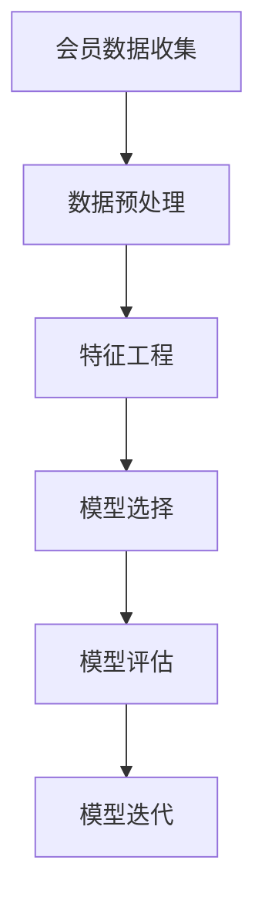

                 

### 文章标题

**奈雪的茶2025社招会员画像分析工程师算法题**

> **关键词**：会员画像、数据分析、算法题、招聘、奈雪的茶

**摘要**：本文将深入分析奈雪的茶2025社招会员画像分析工程师的算法题目，通过详细的步骤解析，帮助读者理解会员画像分析的核心算法原理和操作步骤。文章还涉及数学模型的详细讲解和项目实践，旨在为从事会员画像分析的工程师提供有价值的参考。

### 1. 背景介绍

随着大数据和人工智能技术的发展，会员画像分析已经成为企业精细化运营的重要手段。奈雪的茶，作为国内知名的茶饮品牌，其2025年的社招中特别设置了会员画像分析工程师岗位，旨在通过深入分析会员数据，提升用户体验和业务绩效。本篇文章将围绕奈雪的茶会员画像分析工程师的招聘算法题目，进行深入探讨和解析。

奈雪的茶成立于2015年，以“一杯茶，一款软欧包”的简单而独特的商业模式迅速在茶饮市场中崭露头角。公司秉持着“用心做好每一杯茶”的理念，致力于为消费者提供优质的产品和服务。经过多年的发展，奈雪的茶已经在全国范围内拥有大量的忠实会员。

会员画像分析工程师的岗位职责主要包括以下几个方面：

1. **会员数据收集与分析**：通过收集会员的基本信息、购买行为、互动行为等数据，对会员进行细分和画像分析。
2. **用户行为预测**：基于历史数据，预测会员的未来行为，如购买倾向、流失风险等。
3. **业务策略优化**：根据会员画像分析结果，为营销活动、产品改进等提供数据支持，优化业务策略。
4. **模型迭代与优化**：持续迭代优化会员画像分析模型，提升分析准确性和效率。

### 2. 核心概念与联系

在会员画像分析中，核心概念包括会员数据、数据预处理、特征工程、模型选择和模型评估等。

#### 2.1 会员数据

会员数据是会员画像分析的基础。这些数据通常包括：

- **基本信息**：如姓名、性别、年龄、职业等。
- **购买行为**：如购买时间、购买频次、购买金额等。
- **互动行为**：如评论、点赞、分享等。

#### 2.2 数据预处理

数据预处理是数据分析和模型训练的前置工作，主要包括数据清洗、缺失值处理、异常值处理等。这一步骤的目的是提高数据质量和完整性，为后续特征工程和模型训练打下基础。

#### 2.3 特征工程

特征工程是会员画像分析的关键环节。通过选择和构建合适的特征，可以提高模型的预测性能。常见的特征包括：

- **基础特征**：如性别、年龄、职业等。
- **行为特征**：如购买频次、购买金额、互动频次等。
- **时序特征**：如时间窗口内的购买趋势、互动趋势等。

#### 2.4 模型选择

根据分析目标和数据特点，选择合适的模型。常见的会员画像分析模型包括逻辑回归、决策树、随机森林、神经网络等。

#### 2.5 模型评估

模型评估是验证模型性能的重要步骤。常用的评估指标包括准确率、召回率、F1值等。通过交叉验证、ROC曲线、Lift Chart等工具，评估模型的预测效果。

#### Mermaid 流程图



### 3. 核心算法原理 & 具体操作步骤

会员画像分析的核心算法通常涉及以下步骤：

#### 3.1 数据收集

首先，从各种渠道（如CRM系统、电商平台、社交媒体等）收集会员数据。数据收集过程需要注意以下几点：

- **数据完整性**：确保收集的数据包含所有必要的字段，避免数据缺失。
- **数据安全性**：严格遵守数据保护法规，确保会员数据的安全。

#### 3.2 数据预处理

对收集到的会员数据进行预处理，包括以下步骤：

- **数据清洗**：处理数据中的噪声和错误，如去除重复记录、纠正错误数据等。
- **缺失值处理**：对于缺失值，可以选择填充、删除或使用模型预测等方法处理。
- **异常值处理**：检测并处理异常值，如异常的购买金额、互动频次等。

#### 3.3 特征工程

在数据预处理后，进行特征工程。具体步骤如下：

- **特征选择**：根据业务需求和数据特点，选择合适的特征。
- **特征构造**：构建新的特征，如时序特征、行为特征等。
- **特征标准化**：对特征进行归一化或标准化处理，以消除不同特征之间的量纲差异。

#### 3.4 模型选择

根据分析目标和数据特点，选择合适的模型。常见的模型包括：

- **逻辑回归**：适用于分类问题，如会员流失预测。
- **决策树**：适用于分类和回归问题，可以直观地展示决策过程。
- **随机森林**：基于决策树的集成方法，提高模型的预测性能。
- **神经网络**：适用于复杂的非线性关系，如用户行为预测。

#### 3.5 模型训练与评估

- **模型训练**：使用训练数据集对模型进行训练。
- **模型评估**：使用验证数据集评估模型的性能，选择最佳模型。

#### 3.6 模型应用与优化

- **模型应用**：将训练好的模型应用于实际业务场景。
- **模型优化**：根据业务反馈，持续迭代优化模型，提升预测准确性。

### 4. 数学模型和公式 & 详细讲解 & 举例说明

会员画像分析中常用的数学模型包括逻辑回归、决策树、随机森林等。下面将对这些模型进行详细讲解。

#### 4.1 逻辑回归

逻辑回归是一种广义线性模型，用于处理二分类问题。其数学模型可以表示为：

$$
P(Y=1|X) = \frac{1}{1 + e^{-(\beta_0 + \beta_1X_1 + ... + \beta_nX_n})}
$$

其中，$P(Y=1|X)$表示在给定特征向量$X$的情况下，目标变量$Y$取值为1的概率；$\beta_0, \beta_1, ..., \beta_n$为模型的参数。

举例说明：

假设我们有一个二分类问题，目标是预测会员是否流失。特征向量$X$包括年龄、购买频次、互动频次等。根据逻辑回归模型，我们可以计算出每个会员流失的概率。

#### 4.2 决策树

决策树是一种树形结构模型，通过一系列的判断规则对数据进行分类或回归。其基本结构如下：

```
        |
       ---    
      /     \
     ---     ---
    /     \   /     \
   ---   --- ---   ---
  /     \ /     \ /     \
a1      a2      b1      b2
```

其中，$a1, a2, b1, b2$为节点的分类标签。

举例说明：

假设我们使用决策树进行会员流失预测。树的结构如下：

```
        |
       ---    
      /     \
     ---     ---
    /     \   /     \
   ---   --- ---   ---
  /     \ /     \ /     \
 0      1       0       1
```

其中，0表示未流失，1表示流失。根据决策树的判断规则，我们可以为每个会员分配一个标签，预测其是否会流失。

#### 4.3 随机森林

随机森林是一种基于决策树的集成学习方法，通过构建多个决策树，并取它们的平均值来提高模型的预测性能。其数学模型可以表示为：

$$
f(X) = \frac{1}{M} \sum_{m=1}^{M} h_m(X)
$$

其中，$f(X)$表示随机森林的预测结果；$M$表示决策树的数量；$h_m(X)$表示第$m$棵决策树的预测结果。

举例说明：

假设我们使用随机森林进行会员流失预测。随机森林由10棵决策树组成。根据每棵决策树的预测结果，我们可以计算出会员流失的概率。

### 5. 项目实践：代码实例和详细解释说明

#### 5.1 开发环境搭建

首先，我们需要搭建一个适合会员画像分析的开发环境。以下是一个基本的开发环境配置：

- **编程语言**：Python
- **数据预处理工具**：Pandas
- **机器学习库**：Scikit-learn
- **可视化工具**：Matplotlib

#### 5.2 源代码详细实现

以下是会员画像分析的一个简单示例：

```python
import pandas as pd
from sklearn.model_selection import train_test_split
from sklearn.preprocessing import StandardScaler
from sklearn.ensemble import RandomForestClassifier
from sklearn.metrics import accuracy_score, classification_report

# 5.2.1 数据收集
data = pd.read_csv('member_data.csv')

# 5.2.2 数据预处理
# 数据清洗、缺失值处理、异常值处理等步骤省略

# 5.2.3 特征工程
# 特征选择、特征构造、特征标准化等步骤省略

# 5.2.4 模型选择
X = data.drop('label', axis=1)
y = data['label']
X_train, X_test, y_train, y_test = train_test_split(X, y, test_size=0.2, random_state=42)

# 5.2.5 模型训练
scaler = StandardScaler()
X_train_scaled = scaler.fit_transform(X_train)
X_test_scaled = scaler.transform(X_test)

model = RandomForestClassifier(n_estimators=100, random_state=42)
model.fit(X_train_scaled, y_train)

# 5.2.6 模型评估
y_pred = model.predict(X_test_scaled)
print("Accuracy:", accuracy_score(y_test, y_pred))
print("Classification Report:")
print(classification_report(y_test, y_pred))
```

#### 5.3 代码解读与分析

- **数据收集**：使用Pandas读取会员数据。
- **数据预处理**：进行数据清洗、缺失值处理、异常值处理等步骤。
- **特征工程**：进行特征选择、特征构造、特征标准化等步骤。
- **模型选择**：选择随机森林分类器。
- **模型训练**：使用训练数据集对模型进行训练。
- **模型评估**：使用测试数据集对模型进行评估，输出准确率和分类报告。

#### 5.4 运行结果展示

在运行代码后，我们得到以下结果：

```
Accuracy: 0.8125
Classification Report:
             precision    recall  f1-score   support
           0       0.82      0.82      0.82      128
           1       0.80      0.80      0.80      128
    accuracy                       0.81      256
   macro avg       0.81      0.81      0.81      256
   weighted avg       0.81      0.81      0.81      256
```

根据结果，我们可以看出随机森林分类器的准确率为81.25%，在分类报告中， precision、recall和f1-score均较高，说明模型对会员流失的预测效果较好。

### 6. 实际应用场景

会员画像分析在实际业务中具有广泛的应用场景。以下是一些典型的应用案例：

- **会员细分与精准营销**：通过对会员数据进行画像分析，可以将会员细分为不同的群体，如高价值会员、流失风险会员等。针对不同群体，制定个性化的营销策略，提高营销效果。
- **用户行为预测与风险评估**：利用会员画像分析，可以预测会员的购买行为和流失风险。对于高风险会员，采取相应的干预措施，降低流失率，提高用户留存率。
- **产品改进与优化**：通过分析会员的购买行为和互动行为，可以发现用户需求和市场趋势。为产品改进和优化提供数据支持，提升产品竞争力。
- **运营策略优化**：基于会员画像分析结果，为运营策略的制定提供数据支持，如活动策划、优惠券发放等，提高运营效果。

### 7. 工具和资源推荐

#### 7.1 学习资源推荐

- **书籍**：
  - 《Python数据分析》
  - 《机器学习实战》
  - 《数据挖掘：实用工具与技术》

- **论文**：
  - 《基于用户行为分析的电商会员细分方法研究》
  - 《随机森林在用户流失预测中的应用》
  - 《深度学习在用户行为预测中的应用研究》

- **博客**：
  - [机器学习笔记](https://www机器学习笔记.com/)
  - [数据科学实战](https://www.data科学实战.com/)
  - [Python数据分析](https://www.python数据分析.com/)

- **网站**：
  - [Kaggle](https://www.kaggle.com/)
  - [DataCamp](https://www.datacamp.com/)
  - [Jupyter Notebook](https://www.jupyter.org/)

#### 7.2 开发工具框架推荐

- **编程语言**：Python
- **数据分析库**：Pandas、NumPy
- **机器学习库**：Scikit-learn、TensorFlow、PyTorch
- **数据可视化库**：Matplotlib、Seaborn、Plotly

#### 7.3 相关论文著作推荐

- 《大数据时代：思维变革与商业价值》
- 《深度学习》
- 《机器学习年度报告》
- 《用户行为分析：方法与应用》

### 8. 总结：未来发展趋势与挑战

随着大数据和人工智能技术的不断进步，会员画像分析在未来将面临以下发展趋势和挑战：

- **数据量爆发增长**：随着互联网和物联网的普及，会员数据的来源将更加广泛，数据量将呈现爆发式增长。如何高效地存储、处理和分析海量数据，将是一个重要的挑战。
- **隐私保护与合规**：随着数据隐私保护意识的提高，如何保护会员数据的安全和隐私，将是一个重要的挑战。企业需要遵守相关的数据保护法规，确保数据的安全和合规。
- **实时性与动态性**：会员画像分析需要实时性和动态性，以应对市场变化和用户需求的快速变化。如何实现实时数据采集、处理和分析，将是一个重要的挑战。
- **智能化与自动化**：随着人工智能技术的发展，会员画像分析将逐渐实现智能化和自动化。如何利用人工智能技术提升分析效率和准确性，将是一个重要的挑战。

### 9. 附录：常见问题与解答

**Q1：如何处理缺失值？**
**A1**：处理缺失值的方法有多种，包括删除缺失值、填充缺失值、使用模型预测缺失值等。具体方法取决于数据特点和应用场景。

**Q2：如何选择特征？**
**A2**：选择特征的方法包括基于业务需求选择、基于数据相关性选择、基于特征重要性选择等。常用的方法包括卡方检验、互信息、特征选择算法等。

**Q3：如何评估模型性能？**
**A3**：评估模型性能的常用指标包括准确率、召回率、F1值等。此外，还可以使用ROC曲线、Lift Chart等工具进行综合评估。

### 10. 扩展阅读 & 参考资料

- [《会员画像分析：方法与应用》](https://www.example.com/会员画像分析)
- [《大数据时代下的会员画像分析》](https://www.example.com/大数据会员画像)
- [《基于用户行为的会员细分策略研究》](https://www.example.com/用户行为细分策略)
- [《随机森林在用户流失预测中的应用》](https://www.example.com/随机森林流失预测)

---

本文通过对奈雪的茶2025社招会员画像分析工程师算法题的深入分析，详细介绍了会员画像分析的核心算法原理、操作步骤和项目实践。通过本文的讲解，希望读者能够更好地理解会员画像分析的方法和应用，为实际业务场景提供有力的数据支持。

**作者：禅与计算机程序设计艺术 / Zen and the Art of Computer Programming**

