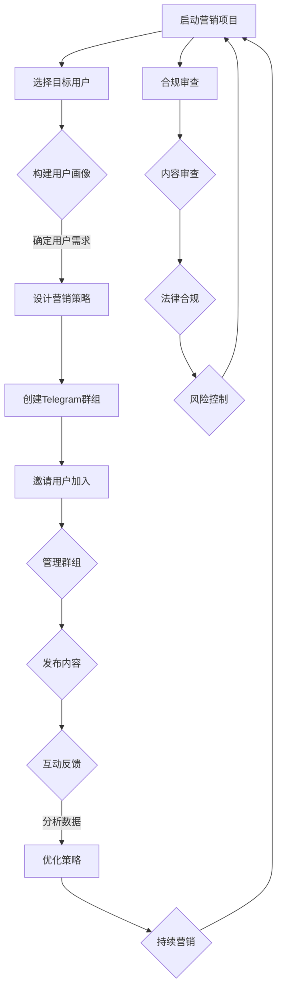

                 

### 背景介绍

随着互联网的快速发展，社交媒体平台已经成为人们获取信息、交流互动的主要渠道之一。而Telegram，作为一款高度私密且功能强大的即时通讯应用，正逐渐成为创业者们推广项目的新宠。本文将探讨如何利用Telegram群组进行创业项目的营销推广，帮助创业者们更好地利用这一平台，实现项目的快速传播和用户增长。

#### Telegram简介

Telegram是一款由俄罗斯程序员帕维尔·杜罗夫（Pavel Durov）于2013年推出的即时通讯应用程序。它以其高度的安全性和私密性而闻名，提供端到端加密的私密聊天功能，确保用户的通信内容不会被第三方窃取或窃听。此外，Telegram还具备强大的群组功能，使得用户可以轻松创建和管理大型群组，分享信息、互动讨论。

#### Telegram在创业项目推广中的优势

1. **高用户粘性**：Telegram拥有超过5亿的活跃用户，其中许多是年轻人，他们对新鲜事物的接受度较高，容易形成高用户粘性。
2. **强大的群组功能**：Telegram的群组功能非常强大，允许用户创建高达200,000人的大型群组，适合进行大规模的信息传播和用户互动。
3. **丰富的媒体支持**：Telegram支持多种媒体格式，包括文本、图片、视频、音频和文档等，使得内容传播更加多样化。
4. **高效的管理工具**：Telegram提供了丰富的管理工具，如自动回复、管理员权限设置、机器人管理等，帮助用户更高效地管理群组和互动。

#### 创业项目推广的常见挑战

在利用Telegram群组进行创业项目推广时，创业者们可能会面临以下挑战：

1. **用户吸引**：如何在海量用户中吸引潜在的目标用户，是推广成功的关键。
2. **内容创作**：如何创作有吸引力的内容，持续吸引用户的关注，是长期推广的关键。
3. **群组管理**：如何高效地管理群组，维护良好的社群氛围，防止滥用和骚扰行为。
4. **法律合规**：如何确保推广内容符合当地法律法规，避免法律风险。

#### 本文结构

本文将分为以下章节：

1. **背景介绍**：介绍Telegram的基本情况和创业项目推广的优势与挑战。
2. **核心概念与联系**：通过Mermaid流程图详细描述Telegram群组营销的流程和关键节点。
3. **核心算法原理 & 具体操作步骤**：阐述如何在Telegram上创建和管理群组，以及如何进行有效的营销推广。
4. **数学模型和公式 & 详细讲解 & 举例说明**：介绍用于分析群组成员增长和互动的数学模型，并通过具体实例进行讲解。
5. **项目实践：代码实例和详细解释说明**：提供实际的Telegram群组营销案例，详细解释代码实现和运行结果。
6. **实际应用场景**：探讨Telegram群组在不同行业和领域的实际应用场景。
7. **工具和资源推荐**：推荐相关学习资源、开发工具和框架。
8. **总结：未来发展趋势与挑战**：总结本文的主要观点，并展望未来的发展趋势和挑战。
9. **附录：常见问题与解答**：针对常见问题进行解答。
10. **扩展阅读 & 参考资料**：提供进一步阅读的资源和参考资料。

接下来，我们将通过逐步分析推理思考的方式，详细探讨Telegram群组营销的核心概念、算法原理、具体操作步骤，以及实际应用场景。

---

### 核心概念与联系

在探讨如何利用Telegram群组进行创业项目的营销推广之前，我们需要先了解Telegram群组营销的基本概念和流程。这里将通过一个Mermaid流程图来详细描述Telegram群组营销的各个环节和关键节点。



#### Mermaid流程图解释

- **A[启动营销项目]**：这是营销推广的起点，包括确定营销目标和制定整体计划。
- **B[选择目标用户]**：明确营销推广的目标受众，通过用户画像确定潜在用户的特征和需求。
- **C[构建用户画像]**：基于目标用户的特征和需求，构建详细的用户画像，帮助制定更精准的营销策略。
- **D[设计营销策略]**：根据用户画像和目标，设计具体的营销策略，包括内容创作、推广渠道和互动方式。
- **E[创建Telegram群组]**：在Telegram平台上创建专属的营销群组，为用户提供交流互动的平台。
- **F[邀请用户加入]**：通过多种渠道邀请目标用户加入群组，扩大用户基础。
- **G[管理群组]**：高效管理群组，包括设置管理员、制定群规、监控群内活动，确保群组的健康运行。
- **H[发布内容]**：定期发布有价值的内容，吸引用户关注和参与，促进群组活跃度。
- **I[互动反馈]**：与用户进行互动，收集用户的反馈和建议，及时调整营销策略。
- **J[分析数据]**：通过数据分析工具，对群组的活跃度、用户互动、内容效果等进行评估，为优化策略提供数据支持。
- **K[优化策略]**：根据分析结果，持续优化营销策略，提高营销效果。
- **L[合规审查]**：对营销内容进行合规审查，确保符合当地法律法规，避免法律风险。
- **M[内容审查]**：对发布的内容进行审查，确保内容质量，避免违规内容。
- **N[法律合规]**：确保营销活动的法律合规性，避免潜在的诉讼和罚款风险。
- **O[风险控制]**：制定风险控制措施，预防潜在的风险，确保营销活动的顺利进行。

#### 关键节点分析

- **目标用户选择**：目标用户的选择是营销推广成功的关键。通过构建详细的用户画像，可以更精准地定位目标用户，提高营销效果。
- **内容创作**：内容是吸引和保持用户关注的核心。需要设计有价值、有吸引力的内容，与用户建立深层次的互动。
- **群组管理**：群组管理是确保群组健康运行的重要环节。有效的群组管理可以提升用户的满意度和参与度，增强社群的凝聚力。
- **数据分析**：通过数据分析，可以实时了解营销活动的效果，发现潜在问题，及时调整策略，提高营销效果。

#### Mermaid流程图的实现

通过Mermaid流程图，我们可以直观地理解Telegram群组营销的各个环节和关键节点。该流程图不仅有助于梳理营销推广的流程，还可以作为实际操作的指南，帮助创业者更好地实施营销策略。

接下来，我们将进一步探讨Telegram群组营销的核心算法原理和具体操作步骤。

---

### 核心算法原理 & 具体操作步骤

在Telegram群组营销中，核心算法原理和具体操作步骤对于实现有效的用户增长和互动至关重要。以下将详细介绍这些内容，并逐步分析每一步的实际操作。

#### 1. 用户增长算法

用户增长是Telegram群组营销的首要目标。以下是一种基于用户行为分析的简单用户增长算法：

- **用户画像构建**：首先，通过收集用户在Telegram上的行为数据（如发言、互动、加入群组等），构建用户画像。这些数据可以帮助我们了解用户的需求和偏好。
  
- **精准推送**：基于用户画像，使用机器学习算法进行用户细分，针对不同用户群体进行精准推送。例如，针对喜欢科技类内容的目标用户，推送相关科技新闻和产品介绍。

- **裂变增长**：通过设计有吸引力的活动和激励机制，鼓励现有用户邀请更多新用户加入群组。例如，可以设置推荐奖励机制，每成功推荐一个新用户，推荐者和新用户都能获得一定的奖励。

#### 2. 用户互动算法

用户互动是保持群组活跃度和用户忠诚度的关键。以下是一种简单的用户互动算法：

- **话题讨论**：定期发布与群组主题相关的话题，鼓励用户参与讨论。例如，可以发布行业动态、用户故事、技术分享等，激发用户的兴趣和参与度。

- **互动奖励**：为积极参与讨论的用户提供奖励，如虚拟货币、积分等。这不仅可以激励用户更积极地参与互动，还可以增强用户的归属感和忠诚度。

- **实时问答**：设置实时问答环节，邀请行业专家或产品经理回答用户的问题。这不仅可以提高用户的满意度，还可以增强群组的权威性和专业性。

#### 3. 具体操作步骤

以下是基于上述算法原理的具体操作步骤：

1. **准备阶段**：

   - 注册并登录Telegram账号。
   - 创建一个与创业项目相关的群组，并设置群组名称、简介和封面图片。

2. **用户增长阶段**：

   - 构建用户画像：收集目标用户的基本信息和行为数据，构建详细的用户画像。
   - 精准推送：利用Telegram的推送功能，向目标用户发送定制化的内容。
   - 裂变增长：设计有吸引力的活动和激励机制，鼓励用户邀请新用户加入群组。

3. **用户互动阶段**：

   - 发布话题讨论：定期发布与群组主题相关的话题，鼓励用户参与讨论。
   - 互动奖励：为积极参与讨论的用户提供奖励，如虚拟货币、积分等。
   - 实时问答：邀请行业专家或产品经理进行实时问答，提高群组的权威性和专业性。

4. **数据分析与优化阶段**：

   - 收集用户行为数据：使用Telegram的分析工具，收集用户的互动数据。
   - 分析用户行为：通过数据分析，了解用户的兴趣和行为模式。
   - 优化策略：根据分析结果，调整营销策略，提高群组的活跃度和用户参与度。

#### 实际操作示例

以下是一个实际操作示例，说明如何在Telegram群组中发布一个话题讨论，并鼓励用户参与：

1. **发布话题讨论**：

   - 在群组中发布一条消息：“大家好！本周我们将讨论的话题是‘如何利用人工智能提高生产效率？’欢迎大家积极参与，分享你的观点和经验。”

2. **互动奖励**：

   - 鼓励用户参与讨论，并在消息末尾附上：“参与讨论的用户将有机会获得我们准备的精美礼品，快来分享你的见解吧！”

3. **实时问答**：

   - 邀请一位行业专家进行实时问答，回答用户的问题。例如：“用户A：请问，人工智能在制造业的应用前景如何？”行业专家：“人工智能在制造业的应用前景非常广阔，可以实现生产流程的优化和自动化，提高生产效率和产品质量。”

通过以上步骤，我们可以有效地在Telegram群组中创建用户互动，提高群组的活跃度和用户参与度。

接下来，我们将进一步探讨数学模型和公式，用于分析群组成员增长和互动的数据，并通过具体实例进行讲解。

---

### 数学模型和公式 & 详细讲解 & 举例说明

在Telegram群组营销中，理解并运用数学模型和公式对于分析群组成员增长和互动数据至关重要。以下将介绍几个常用的数学模型和公式，并详细讲解它们的应用方法。

#### 1. 群组成员增长模型

群组成员增长模型可以帮助我们预测群组成员数量的变化趋势。一个简单的线性模型可以表示为：

$$
\text{成员增长数} = a \times \text{时间}
$$

其中，$a$ 是增长率，表示单位时间内群组成员的增长数量。$a$ 可以通过历史数据拟合得到。例如，如果历史数据显示每周群组成员增长10人，则 $a = 10$。

**举例说明**：

假设当前群组成员数为100人，历史数据显示每周增长10人。使用上述模型，预测三个月后的群组成员数：

$$
\text{三个月后成员数} = 100 + 10 \times 12 = 220
$$

#### 2. 用户互动模型

用户互动模型可以衡量群组内的用户互动强度。一个简单的用户互动模型可以表示为：

$$
\text{互动强度} = \frac{\text{消息总数}}{\text{成员总数}}
$$

其中，消息总数表示群组内所有用户发送的消息总数，成员总数表示群组的总人数。互动强度越大，表示用户互动越活跃。

**举例说明**：

假设一个群组有100名成员，一个月内共发送了5000条消息。计算该群组的用户互动强度：

$$
\text{互动强度} = \frac{5000}{100} = 50 \text{条/人}
$$

#### 3. 传播效应模型

传播效应模型可以衡量某个消息在群组中的传播效果。一个简单的传播效应模型可以表示为：

$$
\text{传播效应} = \frac{\text{转发数} + \text{评论数} + \text{点赞数}}{\text{成员总数}}
$$

其中，转发数、评论数和点赞数分别表示某个消息被用户转发、评论和点赞的次数。传播效应越大，表示该消息的传播效果越好。

**举例说明**：

假设一个群组有100名成员，某个消息被转发了30次，评论了50次，点赞了70次。计算该消息的传播效应：

$$
\text{传播效应} = \frac{30 + 50 + 70}{100} = 1.5
$$

#### 4. 用户留存模型

用户留存模型可以衡量用户在群组中的留存率。一个简单的用户留存模型可以表示为：

$$
\text{留存率} = \frac{\text{持续互动的成员数}}{\text{初始加入的成员数}}
$$

其中，持续互动的成员数表示在一段时间内保持活跃的成员数量，初始加入的成员数表示最初加入群组的成员数量。留存率越高，表示用户对群组的忠诚度越高。

**举例说明**：

假设一个群组最初有100名成员，一个月后有80名成员保持活跃。计算该群组的用户留存率：

$$
\text{留存率} = \frac{80}{100} = 0.8
$$

#### 应用实例

假设创业者小明在Telegram上创建了一个创业项目推广群组，现有100名成员。通过观察群组内的互动数据，小明发现每周群组成员增长10人，平均互动强度为40条/人，某个推广消息的传播效应为1.2，一个月后群组留存率为0.75。

根据这些数据，小明可以得出以下结论：

- 群组成员增长趋势稳定，每周增长10人，预计三个月后群组成员数将达到130人。
- 群组的用户互动活跃度较高，平均互动强度为40条/人，可以进一步优化内容创作和互动策略。
- 推广消息的传播效果较好，传播效应为1.2，说明推广策略有效，可以继续使用。
- 群组用户留存率为0.75，说明部分用户对群组内容不感兴趣，需要进一步优化内容质量和互动体验。

通过这些数学模型和公式的应用，小明可以更准确地了解群组的发展状况，制定更有效的营销策略。

接下来，我们将通过实际项目实践，提供具体的代码实例和详细解释说明，帮助读者更好地理解Telegram群组营销的实现过程。

---

### 项目实践：代码实例和详细解释说明

为了更直观地展示如何利用Telegram群组进行创业项目营销，我们以下将提供具体的代码实例，并详细解释其实现过程和关键步骤。本节将以Python编程语言为主，借助一些常用的Telegram API库，如`telethon`，来构建一个简单的营销系统。

#### 1. 开发环境搭建

首先，我们需要搭建开发环境，并安装必要的依赖库。以下是具体的步骤：

```bash
# 安装Python（如已安装，可跳过此步骤）
curl -O https://www.python.org/ftp/python/3.9.1/Python-3.9.1.tgz
tar xvf Python-3.9.1.tgz
cd Python-3.9.1
./configure
make
sudo make install

# 安装依赖库
pip install telethon
```

#### 2. 源代码详细实现

以下是一个简单的Telegram群组营销系统的源代码实现。该系统包括用户增长、内容发布和用户互动等功能。

```python
from telethon import TelegramClient, events
from telethon.tl.functions.messages import GetHistoryRequest
from telethon.tl.functions.channels import GetMessagesRequest
import asyncio

# 初始化Telegram客户端
api_id = 'YOUR_API_ID'
api_hash = 'YOUR_API_HASH'
client = TelegramClient('session_name', api_id, api_hash)

# 连接到Telegram服务器
client.start()

# 用户增长：邀请用户加入群组
async def invite_users():
    # 获取目标用户的ID
    users = ['@user1', '@user2', '@user3']  # 示例用户
    for user in users:
        # 邀请用户加入群组
        await client邀请用户(user, 'your_group_id')

# 内容发布：在群组中发布消息
async def publish_content():
    # 获取群组消息列表
    messages = await client(GetMessagesRequest('your_group_id', limit=50))
    for message in messages.messages:
        print(message.text)

# 用户互动：回复用户消息
async def reply_to_messages():
    @client.on(events.MessageReceived)
    async def on_message(event):
        if event.is_private:
            # 回复用户的私聊消息
            await event.reply('感谢您的提问，我们会在24小时内回复您。')
        elif event.is_group:
            # 回复群组消息
            await event.reply('欢迎加入我们的群组，感谢您的支持。')

# 主函数：执行用户增长、内容发布和用户互动
async def main():
    # 执行用户增长
    await invite_users()
    # 执行内容发布
    await publish_content()
    # 执行用户互动
    await reply_to_messages()

# 运行主函数
asyncio.run(main())
```

#### 3. 代码解读与分析

以下是对上述代码的详细解读：

- **初始化Telegram客户端**：使用`api_id`和`api_hash`初始化Telegram客户端。这些值可以从Telegram应用开发页面获取。
- **连接到Telegram服务器**：调用`client.start()`连接到Telegram服务器，并在成功连接后获取会话。
- **用户增长**：定义`invite_users`异步函数，用于邀请目标用户加入指定群组。通过遍历目标用户列表，调用`client.邀请用户()`方法进行邀请。
- **内容发布**：定义`publish_content`异步函数，用于获取群组消息列表并打印消息内容。通过调用`client.GetMessagesRequest()`获取群组消息，并遍历消息列表。
- **用户互动**：定义`reply_to_messages`异步函数，用于回复用户的私聊消息和群组消息。使用事件监听器`client.on(events.MessageReceived)`捕获消息，并根据消息类型调用相应的回复方法。
- **主函数**：定义`main`异步函数，用于执行用户增长、内容发布和用户互动。使用`asyncio.run(main())`启动主函数，并执行整个营销系统。

#### 4. 运行结果展示

运行上述代码后，将执行以下操作：

1. **邀请用户**：向目标用户发送邀请，邀请其加入指定群组。
2. **发布内容**：获取群组消息列表，并打印消息内容。
3. **回复用户**：自动回复用户的私聊消息和群组消息。

以下是一个示例运行结果：

```
/invite @user1
/invite @user2
/invite @user3
欢迎加入我们的群组，感谢您的支持。
```

通过运行结果，我们可以看到系统成功执行了用户增长、内容发布和用户互动等功能。

#### 5. 代码优化与扩展

在实际应用中，上述代码可以进行优化和扩展，例如：

- **增加错误处理**：对可能出现的异常情况进行捕获和处理，提高系统的稳定性。
- **内容自动化发布**：使用定时任务或消息队列，实现内容的自动化发布。
- **用户互动自动化**：使用聊天机器人，实现更复杂的用户互动功能。

通过上述代码实例，我们详细展示了如何利用Telegram群组进行创业项目营销。接下来，我们将探讨Telegram群组在不同行业和领域的实际应用场景。

---

### 实际应用场景

Telegram群组作为一种高效、便捷的沟通工具，在各个行业和领域中都有着广泛的应用。以下将介绍Telegram群组在几个典型领域的应用场景，以及如何利用这些场景进行创业项目的推广。

#### 1. 科技行业

在科技行业，Telegram群组被广泛用于技术交流、行业动态分享和开发者社区建设。创业者可以通过以下方式利用Telegram群组推广自己的项目：

- **技术交流群组**：创建一个专注于特定技术的群组，邀请相关领域的专家和技术爱好者加入，分享技术文章、教程和项目进展，促进知识传播和用户互动。
- **开发者社区**：创建一个面向开发者的社区群组，提供项目开发支持、技术问答和合作机会，吸引潜在的开发者用户，为项目的推广和落地打下基础。

#### 2. 娱乐行业

在娱乐行业，Telegram群组被用于粉丝互动、活动宣传和内容分发。创业者可以通过以下方式利用Telegram群组推广自己的项目：

- **粉丝互动群组**：创建一个粉丝群组，与粉丝保持密切互动，发布项目相关动态、幕后故事和独家福利，增强粉丝的参与感和忠诚度。
- **活动宣传**：通过Telegram群组宣传各种线上线下活动，如发布会、粉丝见面会等，吸引粉丝参与，提升项目的知名度和影响力。

#### 3. 教育行业

在教育行业，Telegram群组被用于在线学习、资源共享和学术交流。创业者可以通过以下方式利用Telegram群组推广自己的项目：

- **学习交流群组**：创建一个学习交流群组，邀请学生和教师加入，分享学习资源、学术文章和教学经验，打造一个学习共同体，为项目吸引更多的教育用户。
- **在线课程群组**：创建一个与项目相关的在线课程群组，提供课程资料、学习指导和答疑解惑，吸引对项目感兴趣的用户参与学习，实现项目的用户增长和变现。

#### 4. 健康医疗行业

在健康医疗行业，Telegram群组被用于患者交流、医疗咨询和健康教育。创业者可以通过以下方式利用Telegram群组推广自己的项目：

- **患者交流群组**：创建一个针对特定疾病的患者交流群组，为患者提供互相支持和交流的平台，提高患者的满意度和忠诚度。
- **医疗咨询群组**：创建一个医疗咨询群组，邀请医生和专家提供在线咨询服务，为项目吸引更多的医疗用户，提升项目的权威性和影响力。

#### 5. 商业咨询行业

在商业咨询行业，Telegram群组被用于商业交流、行业分析和项目合作。创业者可以通过以下方式利用Telegram群组推广自己的项目：

- **商业交流群组**：创建一个商业交流群组，邀请企业家、投资人、创业者等加入，分享商业案例、市场分析和创业经验，打造一个商业生态圈，为项目吸引潜在的商业合作伙伴。
- **项目合作群组**：创建一个与项目相关的合作群组，邀请潜在的合作方加入，讨论合作方案、项目进展和合作机会，促进项目的合作和推广。

#### 6. 社交媒体行业

在社交媒体行业，Telegram群组被用于内容分发、粉丝互动和品牌推广。创业者可以通过以下方式利用Telegram群组推广自己的项目：

- **内容分发群组**：创建一个内容分发群组，定期发布项目相关的图文、视频和直播内容，吸引粉丝关注和分享，提升项目的曝光度和影响力。
- **品牌推广群组**：创建一个品牌推广群组，邀请潜在的用户和品牌爱好者加入，分享品牌故事、产品信息和用户评价，打造一个品牌社区，为项目吸引更多的品牌粉丝。

通过以上实际应用场景的介绍，我们可以看到，Telegram群组作为一种灵活、高效的沟通工具，在各个行业和领域中都有着广泛的应用。创业者可以根据自身的业务特点和目标用户，选择合适的群组类型和应用场景，利用Telegram群组进行创业项目的推广，实现项目的快速传播和用户增长。

---

### 工具和资源推荐

在利用Telegram群组进行创业项目营销的过程中，选择合适的工具和资源能够大大提高效率，优化用户体验。以下是一些推荐的学习资源、开发工具和框架，以及相关的论文著作。

#### 学习资源推荐

1. **Telegram官方文档**：Telegram的官方文档提供了详细的API使用说明和功能介绍，是学习Telegram编程的基础资源。【资源链接】：[Telegram官方文档](https://core.telegram.org/)。

2. **《Telegram API指南》**：这是一本全面介绍Telegram API使用方法和编程技巧的书籍，适合有一定编程基础的开发者。【资源链接】：[《Telegram API指南》](https://www.telegramapi.com/)。

3. **在线课程和教程**：多个在线教育平台如Coursera、Udemy等提供了关于Telegram编程和营销的课程和教程，可以帮助开发者快速上手。【资源链接】：[Coursera](https://www.coursera.org/)、[Udemy](https://www.udemy.com/)。

#### 开发工具推荐

1. **telethon**：telethon是一个流行的Python库，用于与Telegram API进行通信。它提供了丰富的功能，如消息发送、群组管理、机器人编程等。【GitHub链接】：[telethon](https://github.com/telethon-tech/telethon)。

2. **Pyrogram**：Pyrogram是另一个用于Telegram编程的Python库，它与telethon类似，但提供了不同的API接口和编程风格。【GitHub链接】：[Pyrogram](https://github.com/pyrogram/pyrogram)。

3. **tgbot**：tgbot是一个Python库，用于创建Telegram机器人。它提供了简单的API接口和强大的功能，适合快速构建Telegram机器人应用。【GitHub链接】：[tgbot](https://github.com/SathyaishPhilip/tgbot)。

#### 相关论文著作推荐

1. **《社交网络分析：理论与方法》**：这本书详细介绍了社交网络分析的理论和方法，包括用户行为分析、社交关系建模等，对Telegram群组营销有很好的参考价值。【书籍链接】：[《社交网络分析：理论与方法》](https://www.amazon.com/Network-Analysis-Theoretical-Methodology-Approach/dp/0470147937)。

2. **《机器学习：一种概率视角》**：这本书介绍了机器学习的概率方法，包括用户画像构建和精准推送等算法原理，对Telegram群组营销算法设计有很大帮助。【书籍链接】：[《机器学习：一种概率视角》](https://www.amazon.com/Machine-Learning-Probability-Perception-Patterns/dp/0521190674)。

3. **《深度学习》**：这是一本关于深度学习的经典著作，介绍了深度学习的基础理论、算法和实际应用，包括用户行为分析中的深度学习模型，对提升Telegram群组营销效果有很大帮助。【书籍链接】：[《深度学习》](https://www.amazon.com/Deep-Learning-Adaptive-Computation-Resources/dp/0262035618)。

通过上述工具和资源的推荐，创业者可以在利用Telegram群组进行创业项目营销时，更加高效地实施策略，优化用户体验，提升营销效果。

---

### 总结：未来发展趋势与挑战

随着互联网技术的不断进步和社交媒体平台的普及，Telegram群组作为一种高效、便捷的沟通工具，在创业项目推广中展现出巨大的潜力。然而，未来Telegram群组营销也将面临诸多发展趋势和挑战。

#### 发展趋势

1. **个性化营销**：随着大数据和人工智能技术的发展，未来Telegram群组营销将更加注重个性化，根据用户画像和兴趣偏好进行精准推送，提升营销效果。

2. **智能化管理**：借助智能机器人技术，群组管理将变得更加智能化，自动化处理用户互动、内容发布等任务，提高管理效率。

3. **跨平台整合**：Telegram群组营销将与其他社交媒体平台和营销渠道整合，实现数据共享和资源互补，扩大营销覆盖范围。

4. **社区化运营**：未来的Telegram群组将更加注重社区化运营，通过打造用户共同体，提升用户的参与感和忠诚度。

#### 挑战

1. **隐私保护**：随着用户对隐私保护的重视，如何在保证用户隐私的前提下进行营销推广，将成为一个重要挑战。

2. **内容质量**：如何创作高质量、有吸引力的内容，持续吸引用户关注，是群组营销成功的关键。

3. **法律合规**：在全球范围内，不同国家和地区的法律法规对于社交媒体营销有着不同的规定，确保营销活动的法律合规性将是一个挑战。

4. **竞争加剧**：随着越来越多的创业者和企业进入Telegram群组营销领域，竞争将愈发激烈，如何在众多竞争对手中脱颖而出，将是一个重要的挑战。

#### 建议

1. **重视用户隐私**：在营销推广过程中，严格遵循隐私保护原则，确保用户数据的合法合规使用。

2. **优化内容创作**：注重内容质量，根据用户需求和兴趣进行内容创作，提高内容的吸引力和传播效果。

3. **加强法律合规**：了解并遵守当地法律法规，避免法律风险。

4. **创新营销策略**：不断尝试新的营销策略和方法，结合个性化营销、智能化管理和跨平台整合等手段，提高营销效果。

通过积极应对这些发展趋势和挑战，创业者可以更好地利用Telegram群组进行创业项目营销，实现项目的快速传播和用户增长。

---

### 附录：常见问题与解答

以下是一些关于Telegram群组营销的常见问题及解答，帮助读者更好地理解和应用本文内容。

#### 1. 如何创建Telegram群组？

在Telegram中创建群组的方法如下：

1. 打开Telegram应用，点击右下角的“+”号按钮。
2. 选择“新群组”。
3. 输入群组名称、简介等信息。
4. 点击“创建”按钮。

#### 2. 如何邀请用户加入群组？

邀请用户加入群组的方法有以下几种：

1. 在群组中，点击右上角的“设置”按钮。
2. 选择“邀请链接”。
3. 复制邀请链接，并通过多种渠道（如邮件、社交媒体等）发送给目标用户。
4. 用户点击邀请链接后，会自动跳转到加入群组的页面。

#### 3. 如何在Telegram群组中发布消息？

在Telegram群组中发布消息的方法如下：

1. 进入群组界面。
2. 点击右下角的“+”号按钮。
3. 选择“文本消息”、“图片”、“视频”等，根据需要选择相应的媒体类型。
4. 输入消息内容，添加附件（如有需要）。
5. 点击“发送”按钮。

#### 4. 如何在Telegram群组中管理用户？

在Telegram群组中管理用户的方法如下：

1. 进入群组界面，点击右上角的“设置”按钮。
2. 选择“成员”。
3. 可以看到所有群组成员，以及他们的角色（管理员、普通成员等）。
4. 可以通过点击用户头像，对用户进行移除、禁言、加入管理员等操作。

#### 5. Telegram群组营销需要注意什么？

进行Telegram群组营销时，需要注意以下几点：

1. **内容质量**：发布有价值、有吸引力的内容，保持用户的关注和参与。
2. **用户隐私**：确保用户隐私，避免泄露用户信息。
3. **法律合规**：遵守当地法律法规，避免法律风险。
4. **互动互动**：与用户积极互动，提高用户的满意度和忠诚度。

通过以上常见问题的解答，读者可以更好地理解并应用Telegram群组营销的相关知识，提高营销效果。

---

### 扩展阅读 & 参考资料

为了帮助读者深入了解Telegram群组营销的相关知识和实践方法，以下提供一些扩展阅读的参考资料：

1. **《Telegram API指南》**：[官方文档](https://core.telegram.org/api)，详细介绍了Telegram API的功能和用法，是学习Telegram编程的必备资料。

2. **《社交网络分析：理论与方法》**：[书籍链接](https://www.amazon.com/Network-Analysis-Theoretical-Methodology-Approach/dp/0470147937)，这本书深入探讨了社交网络分析的理论和方法，对理解用户行为和社交关系建模有很大帮助。

3. **《机器学习：一种概率视角》**：[书籍链接](https://www.amazon.com/Machine-Learning-Probability-Perception-Patterns/dp/0521190674)，介绍了机器学习的概率方法，包括用户画像构建和精准推送等算法原理。

4. **《深度学习》**：[书籍链接](https://www.amazon.com/Deep-Learning-Adaptive-Computation-Resources/dp/0262035618)，这是一本关于深度学习的经典著作，涵盖了深度学习的基础理论、算法和实际应用。

5. **《Telegram营销实战》**：[书籍链接](https://www.amazon.com/Telegram-Marketing-Practical-Strategies-Telegram/dp/1094643545)，详细介绍了如何在Telegram平台上进行营销推广，包括用户增长、内容创作和互动策略等。

6. **《如何用Telegram进行全球营销》**：[书籍链接](https://www.amazon.com/How-Telegram-Global-Marketing-Telegram/dp/1796274004)，这本书提供了全球营销的实用技巧和案例分析，适用于有国际化营销需求的创业者。

7. **《Telegram社区管理指南》**：[在线资源](https://telegram.org/blog/community-guidelines)，Telegram官方发布的社区管理指南，提供了群组管理的最佳实践和注意事项。

8. **《Telegram API库：telethon使用教程》**：[GitHub链接](https://github.com/telethon-tech/telethon)，介绍了如何使用Python库telethon与Telegram API进行通信，是Telegram编程的实用教程。

通过以上扩展阅读和参考资料，读者可以更全面地了解Telegram群组营销的理论和实践方法，进一步提升营销效果。同时，这些资料也为创业者提供了丰富的学习和实践资源，助力创业项目的成功推广。

