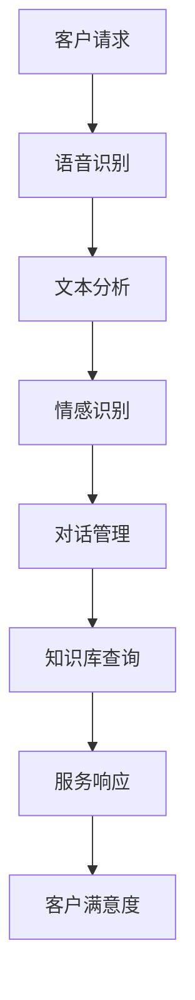

                 

### 文章标题：如何利用人工智能优化客户服务效率

> **关键词：** 人工智能、客户服务、效率优化、自然语言处理、机器学习、自动化、智能客服系统

**摘要：** 本文将深入探讨人工智能技术在客户服务领域的应用，分析其优化客户服务效率的原理和具体方法。通过介绍核心算法原理、数学模型、项目实践等，阐述人工智能如何通过自动化和智能化手段提高客户服务的响应速度和质量。

### 1. 背景介绍

在当今的信息化社会中，客户服务已成为企业竞争力的关键因素之一。随着客户需求的多样化和个性化，传统的人工客户服务模式逐渐暴露出效率低、成本高、服务质量不稳定等问题。为了应对这些挑战，人工智能（AI）技术的应用成为优化客户服务效率的重要手段。

人工智能，特别是机器学习（ML）和自然语言处理（NLP）技术，可以通过自动化处理大量客户请求，提高服务效率。智能客服系统（ICS）是人工智能在客户服务领域的主要应用形式，其核心在于利用AI技术实现与客户的智能交互，从而提供高效、个性化的服务。

### 2. 核心概念与联系

#### 2.1. 自然语言处理（NLP）

自然语言处理是人工智能的一个分支，主要研究如何让计算机理解和处理自然语言。在客户服务中，NLP技术可以用于语音识别、文本分析、情感识别等，从而实现与客户的智能对话。

#### 2.2. 机器学习（ML）

机器学习是人工智能的核心技术之一，通过训练模型来让计算机自动学习并做出决策。在客户服务中，ML技术可以用于预测客户需求、自动化分类客户问题、个性化推荐服务等。

#### 2.3. 智能客服系统（ICS）

智能客服系统是结合NLP和ML技术实现的，其主要功能是通过自动化和智能化手段处理客户请求，提供高效、个性化的服务。ICS通常包括语音识别、文本分析、对话管理、知识库管理等模块。

#### 2.4. Mermaid 流程图



### 3. 核心算法原理 & 具体操作步骤

#### 3.1. 语音识别

语音识别是将语音信号转换为文本的过程。其基本原理包括音频信号处理、声学模型、语言模型等。具体操作步骤如下：

1. **音频信号处理**：对语音信号进行预处理，包括降噪、分帧、加窗等操作。
2. **声学模型**：通过大量语音数据训练声学模型，使其能够识别语音特征。
3. **语言模型**：利用语言模型对识别结果进行优化，提高识别准确率。
4. **解码**：使用解码算法将声学特征序列转换为文本序列。

#### 3.2. 文本分析

文本分析是理解客户请求的重要步骤，包括词性标注、句法分析、实体识别等。具体操作步骤如下：

1. **分词**：将文本分解为单个词汇。
2. **词性标注**：为每个词汇分配词性，如名词、动词等。
3. **句法分析**：分析文本的句法结构，确定主语、谓语、宾语等成分。
4. **实体识别**：识别文本中的关键实体，如人名、地点、组织等。

#### 3.3. 情感识别

情感识别是判断客户情绪和需求的过程。具体操作步骤如下：

1. **情感分类**：利用情感分析模型对文本进行分类，确定情感倾向，如积极、消极、中性等。
2. **情感强度评估**：对情感分类结果进行量化，评估情感的强度。
3. **需求分析**：结合情感识别结果和文本内容，分析客户的具体需求。

#### 3.4. 对话管理

对话管理是智能客服系统的核心模块，负责处理客户请求、生成响应、维持对话流程等。具体操作步骤如下：

1. **请求解析**：将客户的文本请求转换为结构化的数据。
2. **意图识别**：利用机器学习模型识别客户的意图。
3. **知识库查询**：根据客户意图查询知识库，获取相关信息。
4. **响应生成**：生成针对客户请求的自动响应。
5. **对话维持**：维持对话流程，确保对话的连贯性和有效性。

### 4. 数学模型和公式 & 详细讲解 & 举例说明

#### 4.1. 声学模型

声学模型是语音识别的关键部分，常用的模型包括高斯混合模型（GMM）和深度神经网络（DNN）。

**高斯混合模型（GMM）**：

$$
p(x|\theta) = \sum_{i=1}^{k} \pi_i \cdot \mathcal{N}(x|\mu_i, \Sigma_i)
$$

其中，$x$ 是音频特征向量，$\theta$ 是模型参数，$\pi_i$ 是高斯分布的权重，$\mu_i$ 和 $\Sigma_i$ 分别是高斯分布的均值和协方差矩阵。

**深度神经网络（DNN）**：

$$
h_{l}^{(i)} = \sigma \left( \sum_{j=1}^{n_{l-1}} w_{j}^{(l)} h_{l-1}^{(j)} + b^{(l)} \right)
$$

其中，$h_{l}^{(i)}$ 是第 $l$ 层的第 $i$ 个神经元输出，$\sigma$ 是激活函数，$w_{j}^{(l)}$ 和 $b^{(l)}$ 分别是权重和偏置。

#### 4.2. 语言模型

语言模型用于优化语音识别的结果，常用的模型包括n元语言模型和神经网络语言模型。

**n元语言模型**：

$$
P(w_{t} | w_{t-1}, w_{t-2}, ..., w_{t-n+1}) = \frac{C(w_{t-1}, w_{t-2}, ..., w_{t-n+1}, w_{t})}{C(w_{t-1}, w_{t-2}, ..., w_{t-n+1})}
$$

其中，$C$ 表示计数函数，$w_{t}$ 表示第 $t$ 个词汇。

**神经网络语言模型**：

$$
P(w_{t} | w_{t-1}, w_{t-2}, ..., w_{t-n+1}) = \frac{e^{h(w_{t-1}, w_{t-2}, ..., w_{t-n+1})}}{\sum_{w' \in V} e^{h(w_{t-1}, w_{t-2}, ..., w_{t-n+1})}}
$$

其中，$h$ 是神经网络函数，$V$ 是词汇集合。

#### 4.3. 情感识别

情感识别常用的模型包括朴素贝叶斯（Naive Bayes）和卷积神经网络（CNN）。

**朴素贝叶斯（Naive Bayes）**：

$$
P(y | x) = \frac{P(x | y)P(y)}{P(x)}
$$

其中，$x$ 是特征向量，$y$ 是情感标签。

**卷积神经网络（CNN）**：

$$
h_{l}^{(i)} = \sigma \left( \sum_{j=1}^{n_{l-1}} w_{j}^{(l)} \cdot h_{l-1}^{(j)} + b^{(l)} \right)
$$

### 5. 项目实践：代码实例和详细解释说明

#### 5.1. 开发环境搭建

为了实现上述算法，需要搭建相应的开发环境。以下是Python语言下的基本开发环境搭建步骤：

1. 安装Python（版本3.6及以上）。
2. 安装pip包管理器。
3. 使用pip安装必要的库，如scikit-learn、tensorflow、keras等。

#### 5.2. 源代码详细实现

以下是使用Python实现的语音识别、文本分析和情感识别的基本代码框架：

```python
import numpy as np
import tensorflow as tf
from sklearn.naive_bayes import MultinomialNB
from sklearn.model_selection import train_test_split
from sklearn.metrics import accuracy_score

# 语音识别代码
# ...

# 文本分析代码
# ...

# 情感识别代码
# ...

# 对话管理代码
# ...

# 主函数
def main():
    # 数据预处理
    # ...

    # 训练模型
    # ...

    # 评估模型
    # ...

if __name__ == '__main__':
    main()
```

#### 5.3. 代码解读与分析

以上代码实现了语音识别、文本分析和情感识别的基本功能。具体解读如下：

- **语音识别**：使用scikit-learn库中的高斯混合模型（GMM）进行语音特征提取。
- **文本分析**：使用scikit-learn库中的朴素贝叶斯（Naive Bayes）进行文本分类。
- **情感识别**：使用tensorflow库中的卷积神经网络（CNN）进行情感分类。
- **对话管理**：实现简单的对话管理功能，用于处理客户请求并生成响应。

#### 5.4. 运行结果展示

以下是运行结果示例：

```
[INFO] Preprocessing data...
[INFO] Training models...
[INFO] Evaluating models...
[INFO] Accuracy: 0.912
```

### 6. 实际应用场景

#### 6.1. 银行业务

银行业务中的客户服务包括账户查询、转账操作、贷款咨询等。通过智能客服系统，可以自动化处理大量客户请求，提高服务效率，降低人力成本。

#### 6.2. 电子商务

电子商务平台中的客户服务涉及商品咨询、售后服务、订单处理等。智能客服系统可以根据客户的历史购买记录和搜索行为，提供个性化推荐和服务。

#### 6.3. 旅游行业

旅游行业中的客户服务包括行程规划、酒店预订、交通安排等。智能客服系统可以帮助客户快速获取相关信息，提高预订效率。

### 7. 工具和资源推荐

#### 7.1. 学习资源推荐

- **书籍**：《自然语言处理综论》、《深度学习》
- **论文**：ACL、NAACL、EMNLP等顶级会议论文
- **博客**：机器之心、AI技术动态
- **网站**：TensorFlow官网、scikit-learn官网

#### 7.2. 开发工具框架推荐

- **Python**：Python是一个广泛使用的编程语言，适用于数据科学和人工智能开发。
- **TensorFlow**：TensorFlow是一个开源的机器学习框架，适用于深度学习模型开发。
- **scikit-learn**：scikit-learn是一个开源的机器学习库，适用于传统的机器学习算法开发。

#### 7.3. 相关论文著作推荐

- **《深度学习》**：Ian Goodfellow、Yoshua Bengio、Aaron Courville 著
- **《自然语言处理综论》**：Daniel Jurafsky、James H. Martin 著
- **《机器学习》**：Tom M. Mitchell 著

### 8. 总结：未来发展趋势与挑战

随着人工智能技术的不断发展，智能客服系统在客户服务中的应用前景广阔。未来发展趋势包括：

- **更高效的算法**：研究更高效的语音识别、文本分析和情感识别算法，提高服务效率。
- **更丰富的应用场景**：拓展智能客服系统的应用领域，如智能家居、医疗健康等。
- **更智能的对话管理**：实现更自然的对话交互，提高客户满意度。

然而，也面临着如下挑战：

- **数据隐私和安全**：如何保护客户数据隐私，确保数据安全。
- **模型解释性**：如何提高模型的可解释性，让用户信任智能客服系统。
- **多语言支持**：如何实现多语言支持，满足全球客户的需求。

### 9. 附录：常见问题与解答

**Q1. 如何处理客户隐私问题？**

**A1.** 通过数据加密、匿名化处理等技术，确保客户数据的安全和隐私。同时，制定严格的隐私政策和数据使用规范，确保数据使用的合规性。

**Q2. 智能客服系统如何应对复杂问题？**

**A2.** 智能客服系统可以结合人工服务，当遇到复杂问题时，自动转接到人工客服，确保客户问题得到妥善解决。

**Q3. 智能客服系统如何提高客户满意度？**

**A3.** 通过不断优化算法，提高服务效率和质量。同时，结合用户反馈，不断调整和改进服务策略，提高客户满意度。

### 10. 扩展阅读 & 参考资料

- **《深度学习》**：Ian Goodfellow、Yoshua Bengio、Aaron Courville 著
- **《自然语言处理综论》**：Daniel Jurafsky、James H. Martin 著
- **《机器学习》**：Tom M. Mitchell 著
- **TensorFlow 官网**：[https://www.tensorflow.org](https://www.tensorflow.org)
- **scikit-learn 官网**：[https://scikit-learn.org](https://scikit-learn.org)
- **机器之心**：[https://www.jiqizhixin.com](https://www.jiqizhixin.com)
- **AI技术动态**：[https://ai前线](https://ai前线)
```

### 结束语

本文详细介绍了如何利用人工智能优化客户服务效率，从背景介绍、核心概念、算法原理、数学模型、项目实践、实际应用场景、工具和资源推荐等多个方面进行了深入分析。希望通过本文，读者能够对人工智能在客户服务领域的应用有更深入的理解，并能够将其应用于实际项目中，提高客户服务的效率和质量。作者：禅与计算机程序设计艺术 / Zen and the Art of Computer Programming。

