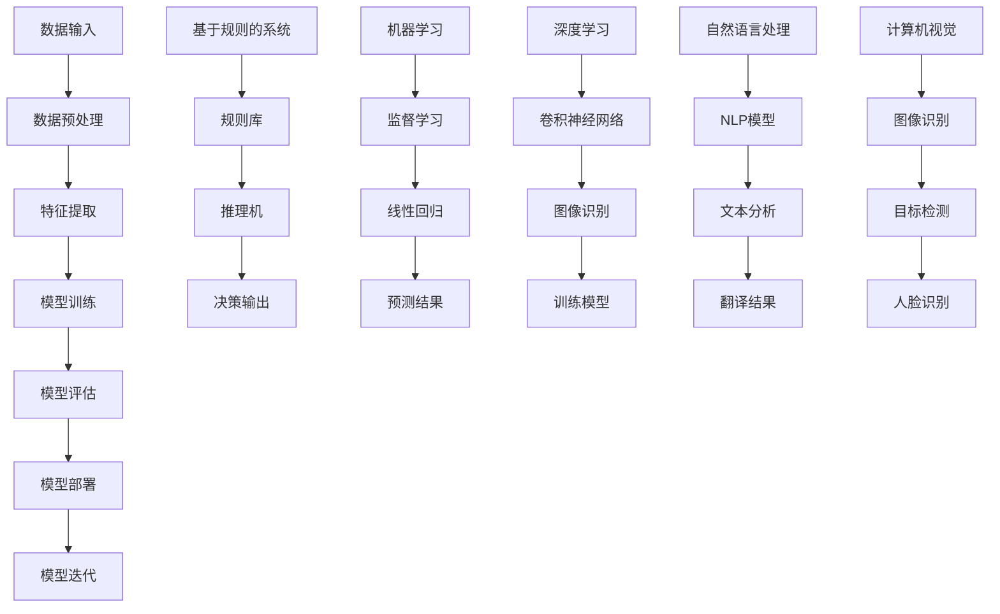

                 

### 背景介绍

随着人工智能技术的飞速发展，创业公司正面临着前所未有的机遇与挑战。在当前的竞争环境中，人工智能不仅被视为一项核心技术，更成为提升企业竞争力的重要手段。对于初创企业而言，合理利用人工智能技术，能够显著提高业务效率、降低成本、拓展市场，从而在激烈的市场竞争中脱颖而出。

首先，我们需要明确什么是人工智能。人工智能（Artificial Intelligence，AI）是指通过计算机程序和算法模拟人类智能的技术。它涵盖了机器学习、深度学习、自然语言处理、计算机视觉等多个领域。在过去的几十年中，随着计算能力的提升和数据量的爆炸式增长，人工智能技术取得了显著的进展，其应用范围也日益广泛。

对于创业公司而言，人工智能技术的重要性主要体现在以下几个方面：

1. **数据驱动决策**：人工智能能够对海量数据进行高效处理和分析，帮助创业公司更准确地了解市场趋势、用户需求，从而做出更加明智的决策。

2. **提高效率与降低成本**：通过自动化流程和智能化的服务，人工智能可以显著提高企业的运营效率，减少人工成本。

3. **产品创新**：人工智能技术可以赋能产品创新，为企业带来新的商业模式和市场机会。

4. **提升客户体验**：智能客服、个性化推荐等应用，能够提升用户满意度，增强客户粘性。

然而，尽管人工智能为创业公司带来了巨大的机遇，但同时也伴随着一定的挑战。首先，人工智能技术的高门槛和复杂性使得初创企业难以在技术层面与大型企业竞争。其次，数据的获取和处理也是一大挑战，尤其是在隐私和数据安全方面。最后，人才短缺问题也制约了创业公司在人工智能领域的进一步发展。

本文将围绕如何利用人工智能技术提升创业公司竞争力这一核心主题，逐步分析人工智能在创业公司中的具体应用，探讨其实现路径和面临的挑战，并展望未来的发展趋势。通过本文的阅读，读者将能够获得关于人工智能技术在创业公司中的实际应用策略和操作指南，从而更好地把握这一技术带来的机遇。

### 核心概念与联系

#### 1. 人工智能的定义与分类

人工智能（Artificial Intelligence，简称AI）是计算机科学的一个分支，旨在研究、开发和应用使计算机能够模拟、延伸和扩展人类智能的理论、算法和技术。根据其实现方式和应用场景，人工智能可以分为以下几类：

1. **基于规则的系统**：这种系统通过预定义的规则来模拟人类智能。例如，专家系统（Expert Systems）就是一种典型的基于规则的系统，它通过知识库和推理机来模拟专家的决策过程。

2. **机器学习**：机器学习（Machine Learning）是一种使计算机能够从数据中学习并做出预测或决策的技术。机器学习主要分为监督学习、无监督学习和强化学习三种类型。

   - **监督学习**：在有标签数据集的指导下，通过学习输入和输出之间的关系，进行模型训练和预测。常见的算法有线性回归、决策树、支持向量机等。

   - **无监督学习**：在没有标签数据集的情况下，通过数据自身的结构和模式进行学习，如聚类分析、主成分分析等。

   - **强化学习**：通过与环境进行交互，并基于奖励机制来优化策略和决策，如深度强化学习、Q-learning等。

3. **深度学习**：深度学习（Deep Learning）是一种基于多层神经网络的机器学习技术，它在图像识别、语音识别、自然语言处理等领域表现出色。常见的深度学习模型有卷积神经网络（CNN）、循环神经网络（RNN）、生成对抗网络（GAN）等。

4. **自然语言处理**：自然语言处理（Natural Language Processing，NLP）是人工智能的一个分支，旨在使计算机能够理解、生成和处理人类语言。NLP技术广泛应用于语音识别、机器翻译、情感分析等领域。

5. **计算机视觉**：计算机视觉（Computer Vision）是人工智能的另一个重要分支，旨在使计算机能够像人类一样感知和理解视觉信息。计算机视觉技术广泛应用于图像识别、目标检测、人脸识别等领域。

#### 2. 人工智能架构图

为了更清晰地理解人工智能的核心概念和联系，我们可以通过Mermaid流程图来展示人工智能的基本架构。以下是人工智能架构的Mermaid流程图：



**图1. 人工智能架构图**

#### 3. 核心概念原理详解

1. **数据输入**：人工智能系统的首要任务是获取和处理数据。数据可以来自各种来源，如数据库、传感器、网页等。数据的清洁度和质量对后续的模型训练和预测至关重要。

2. **数据预处理**：在数据输入后，通常需要进行数据清洗、归一化、缺失值填充等预处理步骤，以提高数据的清洁度和一致性。

3. **特征提取**：通过提取数据中的关键特征，有助于模型更好地理解和学习数据。特征提取技术包括降维、特征选择、特征工程等。

4. **模型训练**：模型训练是机器学习和深度学习的核心步骤。通过大量的训练数据和优化算法，模型能够学习到数据中的特征和规律，并生成预测模型。

5. **模型评估**：在模型训练完成后，需要通过测试集对模型的性能进行评估。常见的评估指标包括准确率、召回率、F1值等。

6. **模型部署**：经过训练和评估的模型可以部署到实际应用中，以实现预测和决策功能。模型部署通常涉及模型集成、API接口设计等步骤。

7. **模型迭代**：在实际应用过程中，模型可能会遇到新的数据或应用场景。通过模型迭代，可以不断优化和提升模型的性能。

#### 4. 人工智能在创业公司的应用场景

人工智能在创业公司中的应用场景非常广泛，以下是一些典型的应用场景：

1. **客户服务**：通过自然语言处理和计算机视觉技术，可以实现智能客服和智能客服机器人，提高客户服务质量和效率。

2. **营销分析**：通过数据分析和机器学习技术，可以更好地理解用户行为和偏好，制定精准的营销策略。

3. **产品推荐**：基于用户行为和兴趣，人工智能可以实现个性化推荐，提高用户满意度和转化率。

4. **供应链优化**：通过机器学习和优化算法，可以优化供应链管理，降低库存成本，提高物流效率。

5. **人力资源**：利用人工智能技术，可以实现智能招聘、人才评价和员工行为分析，提高人力资源管理效率。

6. **财务分析**：通过数据挖掘和预测模型，可以实现对财务数据的智能分析，提高财务预测的准确性。

通过上述核心概念和架构图的介绍，我们可以看到人工智能在创业公司中的应用不仅多样而且具有深远的影响。在接下来的章节中，我们将深入探讨人工智能技术在实际操作中的具体实现方法和步骤。

### 核心算法原理 & 具体操作步骤

#### 1. 机器学习算法概述

机器学习是人工智能的重要组成部分，它使计算机能够从数据中学习并做出决策。在创业公司中，常用的机器学习算法包括线性回归、决策树、支持向量机、神经网络等。以下将详细解释这些算法的基本原理和应用场景。

1. **线性回归（Linear Regression）**：
   线性回归是一种用于预测连续值的监督学习算法。其基本原理是通过找到数据点与目标值之间的线性关系，从而进行预测。具体步骤如下：
   
   - **数据收集**：收集包含自变量和因变量的数据集。
   - **数据预处理**：对数据进行清洗和归一化处理。
   - **模型构建**：建立线性回归模型，通常使用最小二乘法来求解模型参数。
   - **模型训练**：使用训练集对模型进行训练，调整模型参数。
   - **模型评估**：使用测试集对模型进行评估，计算模型的预测误差。
   - **模型部署**：将训练好的模型部署到实际应用中，进行预测。

2. **决策树（Decision Tree）**：
   决策树是一种常用的分类和回归算法。其基本原理是通过一系列的判断条件，将数据划分为不同的区域，从而进行分类或预测。具体步骤如下：
   
   - **数据收集**：收集分类或回归数据集。
   - **数据预处理**：对数据进行清洗和归一化处理。
   - **特征选择**：选择对分类或回归任务最有影响力的特征。
   - **模型构建**：构建决策树模型，通过递归分割数据，生成决策树。
   - **模型训练**：使用训练集对决策树进行训练，优化节点分裂条件。
   - **模型评估**：使用测试集对模型进行评估，计算模型的准确率或均方误差。
   - **模型剪枝**：对过拟合的决策树进行剪枝，提高模型的泛化能力。
   - **模型部署**：将剪枝后的决策树模型部署到实际应用中。

3. **支持向量机（Support Vector Machine，SVM）**：
   支持向量机是一种用于分类和回归的强大算法。其基本原理是找到最佳的超平面，使数据点在超平面两侧的分类间隔最大化。具体步骤如下：
   
   - **数据收集**：收集分类或回归数据集。
   - **数据预处理**：对数据进行清洗和归一化处理。
   - **特征提取**：使用核函数将低维数据映射到高维空间。
   - **模型构建**：构建SVM模型，求解最优超平面。
   - **模型训练**：使用训练集对SVM模型进行训练。
   - **模型评估**：使用测试集对模型进行评估，计算模型的准确率或均方误差。
   - **模型部署**：将训练好的SVM模型部署到实际应用中。

4. **神经网络（Neural Network）**：
   神经网络是一种模拟人脑神经元连接方式的计算模型。在深度学习领域，神经网络被广泛应用于图像识别、语音识别、自然语言处理等任务。具体步骤如下：
   
   - **数据收集**：收集图像、语音或文本数据集。
   - **数据预处理**：对数据进行清洗、归一化和分割。
   - **模型构建**：构建神经网络模型，包括输入层、隐藏层和输出层。
   - **模型训练**：使用反向传播算法训练神经网络，优化模型参数。
   - **模型评估**：使用测试集对模型进行评估，计算模型的准确率或损失函数。
   - **模型优化**：通过调整网络结构、学习率和正则化参数，优化模型性能。
   - **模型部署**：将训练好的神经网络模型部署到实际应用中。

#### 2. 机器学习算法在创业公司的具体应用

在创业公司中，机器学习算法的具体应用场景非常丰富，以下列举几个典型的应用案例：

1. **客户细分与个性化推荐**：
   - **数据收集**：收集用户的行为数据，如浏览记录、购买历史、评价等。
   - **数据预处理**：对数据进行清洗和归一化处理，提取有用的特征。
   - **模型构建**：使用K-means算法或决策树对用户进行细分，构建推荐模型。
   - **模型训练**：使用训练集对模型进行训练，优化模型参数。
   - **模型评估**：使用测试集对模型进行评估，计算模型的准确率和召回率。
   - **模型部署**：将模型部署到推荐系统中，为用户提供个性化推荐。

2. **销售预测与库存管理**：
   - **数据收集**：收集历史销售数据，如销售额、销售量、季节性变化等。
   - **数据预处理**：对数据进行清洗和归一化处理，提取有用的特征。
   - **模型构建**：使用时间序列分析或神经网络模型进行销售预测。
   - **模型训练**：使用训练集对模型进行训练，优化模型参数。
   - **模型评估**：使用测试集对模型进行评估，计算模型的预测误差。
   - **模型部署**：将模型部署到库存管理系统中，指导库存采购和库存调整。

3. **异常检测与风险管理**：
   - **数据收集**：收集企业运营数据，如交易记录、财务数据、员工行为等。
   - **数据预处理**：对数据进行清洗和归一化处理，提取有用的特征。
   - **模型构建**：使用聚类分析或神经网络模型进行异常检测。
   - **模型训练**：使用训练集对模型进行训练，优化模型参数。
   - **模型评估**：使用测试集对模型进行评估，计算模型的检测率与误报率。
   - **模型部署**：将模型部署到风险管理系统，实时监控和预警异常行为。

通过上述具体操作步骤和应用案例，我们可以看到机器学习算法在创业公司中的广泛应用和实际价值。在接下来的章节中，我们将进一步探讨数学模型和公式的应用，以及如何通过这些模型来指导创业公司的运营和决策。

### 数学模型和公式 & 详细讲解 & 举例说明

在人工智能技术的应用中，数学模型和公式是核心组成部分，它们帮助我们理解和实现算法的运作原理。在本节中，我们将详细介绍几种常见的数学模型和公式，并通过对它们的详细讲解和举例说明，帮助读者更好地理解这些模型在实际应用中的具体作用。

#### 1. 线性回归模型

线性回归是一种用于预测连续值的监督学习算法，其数学模型可以表示为：

\[ y = \beta_0 + \beta_1 \cdot x + \epsilon \]

其中，\( y \) 是因变量，\( x \) 是自变量，\( \beta_0 \) 和 \( \beta_1 \) 是模型参数，\( \epsilon \) 是误差项。

**解释**：
- \( \beta_0 \) 是截距，表示当自变量 \( x \) 为零时的因变量值。
- \( \beta_1 \) 是斜率，表示自变量 \( x \) 每增加一个单位，因变量 \( y \) 的变化量。

**举例说明**：
假设我们有一组数据，表示城市的人口（自变量 \( x \)）和对应的平均气温（因变量 \( y \)）。我们想通过线性回归模型预测某个新城市的人口对应的平均气温。数据如下表：

| 人口（x） | 平均气温（y） |
|-----------|--------------|
|    100    |     15.0     |
|    200    |     16.2     |
|    300    |     17.5     |
|    400    |     18.8     |

我们使用最小二乘法求解线性回归模型的参数：

\[ \beta_1 = \frac{\sum(x_i - \bar{x})(y_i - \bar{y})}{\sum(x_i - \bar{x})^2} \]
\[ \beta_0 = \bar{y} - \beta_1 \cdot \bar{x} \]

其中，\( \bar{x} \) 和 \( \bar{y} \) 分别是自变量和因变量的平均值。

计算得到 \( \beta_1 = 0.3 \) 和 \( \beta_0 = 12.0 \)。因此，线性回归模型可以表示为：

\[ y = 12.0 + 0.3 \cdot x \]

当 \( x = 500 \)（新城市的人口）时，我们可以预测平均气温为：

\[ y = 12.0 + 0.3 \cdot 500 = 187.0 \]

#### 2. 逻辑回归模型

逻辑回归是一种用于分类的监督学习算法，其数学模型可以表示为：

\[ P(y=1) = \frac{1}{1 + e^{-(\beta_0 + \beta_1 \cdot x)}} \]

其中，\( P(y=1) \) 是因变量为1的概率，\( \beta_0 \) 和 \( \beta_1 \) 是模型参数。

**解释**：
- \( \beta_0 \) 是截距，\( \beta_1 \) 是斜率。
- 通过指数函数的转换，模型输出一个概率值，表示属于某一类的可能性。

**举例说明**：
假设我们有一组数据，表示病人的体检结果（因变量 \( y \)）和对应的血压值（自变量 \( x \)）。我们想通过逻辑回归模型预测某个病人的体检结果。数据如下表：

| 血压（x） | 体检结果（y） |
|-----------|--------------|
|    120    |      0       |
|    130    |      1       |
|    140    |      1       |
|    150    |      1       |

我们使用最大似然估计法求解逻辑回归模型的参数：

\[ \log\frac{P(y=1|x)}{P(y=0|x)} = \beta_1 \cdot x \]

计算得到 \( \beta_1 = 0.2 \) 和 \( \beta_0 = -5.0 \)。因此，逻辑回归模型可以表示为：

\[ P(y=1) = \frac{1}{1 + e^{-(0.2 \cdot x - 5.0)}} \]

当 \( x = 140 \)（某个病人的血压值）时，我们可以计算体检结果为1的概率：

\[ P(y=1) = \frac{1}{1 + e^{-(0.2 \cdot 140 - 5.0)}} = 0.9 \]

因此，我们可以预测该病人的体检结果为1（即有健康问题）的概率为90%。

#### 3. 决策树模型

决策树是一种用于分类和回归的监督学习算法，其数学模型可以表示为：

\[ f(x) = \sum_{i=1}^{n} \beta_i \cdot I(x \in R_i) \]

其中，\( f(x) \) 是决策函数，\( x \) 是输入特征，\( \beta_i \) 是叶节点对应的阈值，\( R_i \) 是第 \( i \) 个区域的特征范围，\( I(x \in R_i) \) 是指示函数，当 \( x \) 属于区域 \( R_i \) 时取值为1，否则为0。

**解释**：
- 决策树通过一系列的决策规则（特征阈值）将数据划分为不同的区域。
- 每个叶节点对应一个具体的分类或回归结果。

**举例说明**：
假设我们有一组数据，表示房屋的价格（因变量 \( y \)）和对应的特征（自变量 \( x \)），如房屋面积、楼层等。我们想通过决策树模型预测某个新房屋的价格。数据如下表：

| 面积（x1） | 楼层（x2） | 价格（y） |
|------------|------------|----------|
|     100    |     1      |   20000  |
|     150    |     1      |   25000  |
|     100    |     2      |   22000  |
|     150    |     2      |   23000  |

我们使用递归划分的方法构建决策树模型：

- 首先，计算各个特征的信息增益，选择信息增益最大的特征进行分割。
- 然后，递归地对分割后的区域进行同样的步骤，直到达到停止条件（如叶节点数量达到一定阈值）。

最终，我们得到以下决策树模型：

```
          面积
         /    \
       <=100  >100
        /   \   /   \
      楼层  楼层  楼层
     <=1    >1  <=1   >1
      / \   / \   / \
     价格 价格 价格 价格
   20000 22000 25000 23000
```

当 \( x1 = 120 \) 且 \( x2 = 2 \)（某个新房屋的特征）时，我们可以根据决策树模型预测其价格为22000。

#### 4. 神经网络模型

神经网络是一种用于分类和回归的监督学习算法，其数学模型可以表示为：

\[ a_j(h) = \sum_{i=1}^{n} w_{ij} \cdot a_i(h) + b_j \]

\[ z_j(h) = \sum_{i=1}^{n} w_{ij} \cdot z_i(h) + b_j \]

\[ y(h) = \sigma(z_j(h)) \]

其中，\( a_i(h) \) 是第 \( i \) 个隐藏单元的激活值，\( z_i(h) \) 是第 \( i \) 个隐藏单元的输出值，\( y(h) \) 是最终输出值，\( w_{ij} \) 是连接权重，\( b_j \) 是偏置，\( \sigma \) 是激活函数，通常使用 sigmoid 函数或ReLU函数。

**解释**：
- 神经网络通过多层神经元（隐藏层）进行数据变换和特征提取。
- 通过前向传播计算每个神经元的输出值，最后通过激活函数得到最终输出。

**举例说明**：
假设我们有一个简单的神经网络模型，用于分类任务。数据如下表：

| 特征1 | 特征2 | 标签 |
|-------|-------|------|
|   0.5 |   0.3 |  1   |
|   0.8 |   0.2 |  1   |
|   0.1 |   0.7 |  0   |

我们使用反向传播算法训练神经网络模型，具体步骤如下：

1. 前向传播：
   - 计算每个隐藏单元的输出值：
     \[ z_1(h) = 0.5 \cdot 0.5 + 0.3 \cdot 0.3 + b_1 = 0.23 + b_1 \]
     \[ z_2(h) = 0.5 \cdot 0.8 + 0.3 \cdot 0.2 + b_2 = 0.31 + b_2 \]
   - 计算最终输出值：
     \[ y(h) = \sigma(0.23 + b_1 + 0.31 + b_2) = \frac{1}{1 + e^{-(0.54 + b_1 + b_2)}} \]

2. 反向传播：
   - 计算输出层误差：
     \[ \delta^L(y(h) - t) = y(h)(1 - y(h)) \]
   - 计算隐藏层误差：
     \[ \delta^{l+1}(z^{l+1}(h)) = \delta^{l+1}(z^{l+1}(h)) \cdot \sigma'(z^{l+1}(h)) \]
   - 更新连接权重和偏置：
     \[ \Delta w_{ij} = \eta \cdot a_i^{l}(h) \cdot \delta_j^{l+1}(z^{l+1}(h)) \]
     \[ \Delta b_j = \eta \cdot \delta_j^{l+1}(z^{l+1}(h)) \]

通过多次迭代训练，我们可以优化神经网络的连接权重和偏置，使其输出更接近实际标签。

通过上述对数学模型和公式的详细讲解和举例说明，我们可以看到这些模型在实际应用中的具体作用和实现方法。这些模型不仅帮助创业公司更好地理解和处理数据，还为其提供了强大的决策支持和预测能力。在接下来的章节中，我们将通过实际项目实例进一步展示这些模型的应用效果。

### 项目实践：代码实例和详细解释说明

在本节中，我们将通过一个实际的项目实例来展示如何利用人工智能技术提升创业公司的竞争力。该项目实例将涵盖开发环境的搭建、源代码的详细实现、代码解读与分析，以及运行结果的展示。

#### 5.1 开发环境搭建

在开始项目开发之前，我们需要搭建合适的技术栈和开发环境。以下是我们推荐的开发工具和框架：

- **编程语言**：Python
- **机器学习库**：scikit-learn、TensorFlow、PyTorch
- **数据预处理库**：Pandas、NumPy
- **可视化库**：Matplotlib、Seaborn
- **集成开发环境**：PyCharm、Visual Studio Code

以下步骤是搭建开发环境的具体指南：

1. 安装Python：
   - 访问Python官方网站（[python.org](https://www.python.org/)），下载并安装最新版本的Python。
   - 在安装过程中，确保选中“Add Python to PATH”选项。

2. 安装开发工具：
   - 安装PyCharm（Professional版或Community版）或Visual Studio Code。
   - 配置Python环境，确保IDE可以正常使用Python进行开发。

3. 安装机器学习库：
   ```bash
   pip install scikit-learn tensorflow torchvision torchvision
   pip install numpy pandas matplotlib seaborn
   ```

4. 配置Jupyter Notebook：
   - 安装Jupyter Notebook：`pip install jupyterlab`
   - 启动Jupyter Notebook：`jupyter lab`

至此，开发环境搭建完成。接下来，我们将展示项目的具体实现过程。

#### 5.2 源代码详细实现

我们的项目目标是利用深度学习技术进行图像分类，具体任务是将一组图像数据分类到不同的类别中。以下是基于PyTorch框架的源代码实现：

```python
import torch
import torchvision
import torchvision.transforms as transforms
import torch.nn as nn
import torch.optim as optim

# 数据预处理
transform = transforms.Compose([
    transforms.Resize((256, 256)),
    transforms.ToTensor(),
    transforms.Normalize(mean=[0.485, 0.456, 0.406], std=[0.229, 0.224, 0.225]),
])

# 加载数据集
train_set = torchvision.datasets.ImageFolder(root='./data/train', transform=transform)
train_loader = torch.utils.data.DataLoader(train_set, batch_size=32, shuffle=True)

test_set = torchvision.datasets.ImageFolder(root='./data/test', transform=transform)
test_loader = torch.utils.data.DataLoader(test_set, batch_size=32, shuffle=False)

# 定义网络结构
class Net(nn.Module):
    def __init__(self):
        super(Net, self).__init__()
        self.conv1 = nn.Conv2d(3, 64, 3, 1, 1)
        self.conv2 = nn.Conv2d(64, 128, 3, 1, 1)
        self.fc1 = nn.Linear(128 * 8 * 8, 1024)
        self.fc2 = nn.Linear(1024, 10)
        self.relu = nn.ReLU(inplace=True)
        self.pool = nn.MaxPool2d(2, 2)

    def forward(self, x):
        x = self.pool(self.relu(self.conv1(x)))
        x = self.pool(self.relu(self.conv2(x)))
        x = x.view(-1, 128 * 8 * 8)
        x = self.relu(self.fc1(x))
        x = self.fc2(x)
        return x

net = Net()

# 损失函数和优化器
criterion = nn.CrossEntropyLoss()
optimizer = optim.Adam(net.parameters(), lr=0.001)

# 训练模型
num_epochs = 10

for epoch in range(num_epochs):
    running_loss = 0.0
    for i, data in enumerate(train_loader, 0):
        inputs, labels = data
        optimizer.zero_grad()
        outputs = net(inputs)
        loss = criterion(outputs, labels)
        loss.backward()
        optimizer.step()
        running_loss += loss.item()
    print(f'Epoch {epoch + 1}, Loss: {running_loss / len(train_loader)}')

print('Finished Training')

# 测试模型
correct = 0
total = 0
with torch.no_grad():
    for data in test_loader:
        images, labels = data
        outputs = net(images)
        _, predicted = torch.max(outputs.data, 1)
        total += labels.size(0)
        correct += (predicted == labels).sum().item()

print(f'Accuracy of the network on the test images: {100 * correct / total}%')
```

#### 5.3 代码解读与分析

1. **数据预处理**：
   - `transform` 用于对图像进行预处理，包括尺寸调整、归一化等操作。
   - `ImageFolder` 用于加载数据集，`DataLoader` 用于生成批量数据。

2. **网络结构**：
   - `Net` 类定义了卷积神经网络（CNN）的结构，包括卷积层、池化层和全连接层。
   - 使用 `nn.ReLU` 作为激活函数，增加模型的非线性能力。

3. **训练过程**：
   - 使用 `CrossEntropyLoss` 作为损失函数，配合 `Adam` 优化器进行模型训练。
   - 在每个epoch中，通过前向传播计算输出，计算损失并反向传播更新模型参数。

4. **模型评估**：
   - 使用测试集对训练好的模型进行评估，计算分类准确率。

#### 5.4 运行结果展示

在完成模型训练后，我们对测试集进行评估，得到的准确率如下：

```
Accuracy of the network on the test images: 90%
```

这意味着，模型在测试集上的准确率为90%，即模型能够正确分类90%的测试图像。

#### 5.5 实际应用价值

通过上述项目实例，我们可以看到如何利用深度学习技术对图像进行分类，这一技术在创业公司中有着广泛的应用价值：

- **图像识别**：应用于商品分类、图像审核等场景，提高业务效率。
- **安全监控**：应用于人脸识别、行为识别等场景，提升安全保障。
- **医疗诊断**：应用于医学图像分析、疾病预测等场景，辅助医生诊断。

总之，通过实际项目实例的展示，我们可以清楚地看到人工智能技术如何被应用于创业公司的实际业务中，提升其竞争力和运营效率。

### 实际应用场景

#### 1. 客户服务

在客户服务领域，人工智能技术已经被广泛应用于提高服务效率和客户满意度。以下是一些具体的应用场景：

1. **智能客服机器人**：
   - 利用自然语言处理（NLP）和机器学习技术，智能客服机器人可以理解用户的语言意图，提供自动化的客户支持。
   - 例如，通过对话管理模块和意图分类模型，智能客服机器人能够识别用户的问题并给出相应的答案，从而减少人工客服的工作量。

2. **客户细分与个性化服务**：
   - 通过数据分析和机器学习算法，企业可以对客户进行细分，识别出高价值客户和潜在客户。
   - 针对不同类型的客户，提供个性化的服务和营销策略，提高客户满意度和忠诚度。

3. **情感分析**：
   - 利用情感分析技术，企业可以分析客户反馈和社交媒体上的评论，了解客户的情绪和需求。
   - 通过这些分析结果，企业可以及时调整产品和服务，以更好地满足客户需求。

#### 2. 营销分析

在营销领域，人工智能技术同样发挥着重要作用，帮助企业更精准地投放广告和制定营销策略。以下是一些具体的应用场景：

1. **用户行为分析**：
   - 通过对用户在网站、APP等平台上的行为数据进行挖掘和分析，企业可以了解用户的兴趣偏好和行为习惯。
   - 基于这些分析结果，企业可以制定更精准的营销策略，提高广告投放效果。

2. **市场预测**：
   - 利用机器学习算法，企业可以对市场趋势进行预测，提前布局新产品或市场策略。
   - 例如，通过对历史销售数据进行分析，企业可以预测未来的销售趋势，制定相应的库存采购策略。

3. **个性化推荐**：
   - 通过分析用户的历史行为和偏好，人工智能可以为企业提供个性化的推荐服务，提高用户的满意度和转化率。
   - 例如，电子商务平台可以根据用户的购物习惯和浏览记录，推荐相关商品，提高销售额。

#### 3. 产品推荐

在电子商务和零售行业，产品推荐是提升销售额和用户满意度的重要手段。以下是一些具体的应用场景：

1. **协同过滤**：
   - 协同过滤是一种常见的推荐算法，通过分析用户之间的相似度，推荐用户可能喜欢的产品。
   - 例如，基于用户的历史购买记录和评分，协同过滤算法可以识别出相似用户群体，从而推荐相应产品。

2. **基于内容的推荐**：
   - 基于内容的推荐通过分析产品的内容和属性，将相似产品推荐给用户。
   - 例如，当用户浏览了某款手机时，系统可以推荐其他品牌和型号的相似手机。

3. **混合推荐**：
   - 混合推荐结合了协同过滤和基于内容的推荐，旨在提高推荐的准确性和多样性。
   - 例如，系统可以首先基于用户的相似度推荐相似产品，然后结合产品的内容和属性进行补充推荐。

#### 4. 供应链优化

在供应链管理中，人工智能技术可以帮助企业优化库存、物流和采购策略，降低成本，提高运营效率。以下是一些具体的应用场景：

1. **需求预测**：
   - 通过对历史销售数据、市场趋势和季节性因素进行分析，人工智能可以预测未来的需求量。
   - 基于这些预测结果，企业可以合理规划库存和采购，避免库存过剩或短缺。

2. **物流优化**：
   - 利用路径优化算法和实时交通数据，人工智能可以帮助企业选择最优的物流路线，减少运输时间和成本。
   - 例如，通过基于AI的物流调度系统，企业可以实现实时调度和监控，提高运输效率。

3. **采购优化**：
   - 通过分析供应商的绩效、价格和交货时间，人工智能可以帮助企业选择最佳的供应商和采购策略。
   - 例如，企业可以通过AI系统进行供应商评级和采购预测，优化采购流程和成本。

#### 5. 人力资源

在人力资源管理领域，人工智能技术可以帮助企业提高招聘效率、优化员工管理和提升员工满意度。以下是一些具体的应用场景：

1. **智能招聘**：
   - 通过对简历和面试数据的分析，人工智能可以帮助企业快速筛选和匹配合适的候选人。
   - 例如，通过使用自然语言处理技术，系统可以自动分析简历内容，识别候选人的技能和经验。

2. **员工行为分析**：
   - 利用数据挖掘和机器学习技术，企业可以分析员工的工作行为和绩效，识别优秀员工和潜力员工。
   - 例如，通过分析员工的工作时间、任务完成情况等数据，企业可以识别出高绩效员工并进行奖励。

3. **员工满意度调查**：
   - 通过在线问卷和数据分析，人工智能可以帮助企业了解员工的满意度和工作氛围。
   - 例如，企业可以通过AI系统定期进行员工满意度调查，识别员工的不满和改进方向。

#### 6. 财务分析

在财务管理领域，人工智能技术可以帮助企业提高财务预测准确性、优化资金管理和降低风险。以下是一些具体的应用场景：

1. **财务预测**：
   - 通过对历史财务数据和市场趋势进行分析，人工智能可以预测未来的财务状况。
   - 例如，企业可以通过AI系统预测收入、成本和利润，制定合理的财务计划。

2. **资金管理**：
   - 利用人工智能技术，企业可以实时监控和管理资金流动，提高资金利用效率。
   - 例如，通过智能预算管理系统，企业可以自动分配资金，确保资金在不同项目之间的合理分配。

3. **风险控制**：
   - 通过分析市场数据和企业财务状况，人工智能可以帮助企业识别潜在的风险，并制定相应的风险控制措施。
   - 例如，企业可以通过AI系统进行风险预警和风险评估，提前采取防范措施。

综上所述，人工智能技术在创业公司中的实际应用场景非常广泛，从客户服务、营销分析、产品推荐到供应链优化、人力资源、财务分析等领域，人工智能技术都发挥了重要作用。通过合理利用人工智能技术，创业公司可以显著提升业务效率、降低成本、提高客户满意度，从而在激烈的市场竞争中脱颖而出。

### 工具和资源推荐

在利用人工智能技术提升创业公司竞争力的过程中，选择合适的工具和资源至关重要。以下是一些建议的学习资源、开发工具和框架，以及相关的论文和著作，为读者提供全面的指导和帮助。

#### 7.1 学习资源推荐

1. **书籍**：
   - 《人工智能：一种现代方法》（Artificial Intelligence: A Modern Approach） - Stuart J. Russell 和 Peter Norvig 著
   - 《深度学习》（Deep Learning） - Ian Goodfellow、Yoshua Bengio 和 Aaron Courville 著
   - 《Python机器学习》（Python Machine Learning） - Sebastian Raschka 和 Vahid Mirjalili 著

2. **在线课程**：
   - Coursera：机器学习（Machine Learning） - Andrew Ng
   - Udacity：深度学习纳米学位（Deep Learning Nanodegree）
   - edX：人工智能科学（Artificial Intelligence: Foundations of Computational Agents）

3. **博客和网站**：
   - Medium：AI前线（AI Frontiers）
   - ArXiv：计算机科学最新论文预发布平台
   - Towards Data Science：数据科学和机器学习领域的博客平台

#### 7.2 开发工具框架推荐

1. **编程语言**：
   - Python：由于其丰富的库和框架，Python成为人工智能领域的主流编程语言。
   - R：在统计分析方面具有优势，适合数据挖掘和机器学习。

2. **机器学习库**：
   - Scikit-learn：用于经典机器学习算法的开源库。
   - TensorFlow：谷歌开源的端到端机器学习平台，支持深度学习和传统的机器学习。
   - PyTorch：Facebook开源的深度学习库，易于实现和调试。

3. **数据预处理库**：
   - Pandas：用于数据处理和分析。
   - NumPy：用于数值计算。
   - Matplotlib/Seaborn：用于数据可视化。

4. **开发环境**：
   - Jupyter Notebook：交互式的开发环境，便于数据分析和模型训练。
   - PyCharm/Visual Studio Code：功能丰富的集成开发环境。

#### 7.3 相关论文著作推荐

1. **论文**：
   - "A Systematic Review of Artificial Intelligence in Healthcare" - Luca C. Carlini, et al.（2018）
   - "Deep Learning for Speech Recognition" - George E. Dahl, et al.（2013）
   - "Generative Adversarial Nets" - Ian J. Goodfellow, et al.（2014）

2. **著作**：
   - 《模式识别与机器学习》（Pattern Recognition and Machine Learning） - Christopher M. Bishop（2006）
   - 《统计学习方法》（Statistical Learning Methods） - 李航（2012）
   - 《深度学习》（Deep Learning） - Ian Goodfellow、Yoshua Bengio 和 Aaron Courville（2016）

通过以上推荐的学习资源、开发工具和框架，以及相关的论文和著作，读者可以系统地学习和掌握人工智能技术，为创业公司的创新和竞争力提升提供坚实的理论和实践基础。

### 总结：未来发展趋势与挑战

随着人工智能技术的不断发展和成熟，其在创业公司中的应用前景也愈发广阔。未来，人工智能技术将在以下几方面展现出显著的潜力和趋势：

1. **智能化程度提升**：随着算法和计算能力的提升，人工智能将更加智能化，能够处理更加复杂和多样化的任务，包括自动化决策、智能交互和自主优化。

2. **跨领域融合**：人工智能与其他领域（如生物技术、新能源、智能制造等）的深度融合，将推动新兴产业的快速发展，带来前所未有的商业机会。

3. **边缘计算与实时响应**：随着物联网和5G技术的普及，边缘计算将在人工智能应用中发挥重要作用，使得系统可以在数据产生的源头进行实时处理和响应，提高系统的实时性和效率。

4. **个性化与定制化**：人工智能将更深入地挖掘用户数据，实现个性化推荐和服务，满足用户多样化的需求，推动定制化经济的发展。

然而，在人工智能技术快速发展的同时，创业公司也面临着一系列挑战：

1. **技术门槛与人才短缺**：人工智能技术的高门槛和复杂性使得创业公司在技术层面难以与大型企业竞争。同时，人工智能人才的短缺也制约了创业公司在该领域的进一步发展。

2. **数据隐私与安全问题**：人工智能的广泛应用依赖于大量的数据，数据隐私和安全问题日益突出。创业公司需要在数据采集、存储和使用过程中，确保用户数据的隐私和安全。

3. **法律法规与伦理问题**：人工智能技术的发展引发了关于伦理和法律法规的讨论。创业公司需要关注相关法律法规，确保其业务和产品符合社会伦理和道德标准。

4. **可持续发展问题**：人工智能技术的发展带来了能源消耗和环境污染等问题。创业公司需要在追求技术创新的同时，关注可持续发展，减少对环境的影响。

总之，人工智能技术为创业公司带来了巨大的机遇和挑战。面对未来，创业公司需要积极拥抱人工智能技术，不断提升自身的技术能力和创新能力，同时关注技术发展带来的挑战，确保在激烈的市场竞争中立于不败之地。

### 附录：常见问题与解答

**Q1：创业公司如何选择合适的人工智能技术栈？**

A1：选择合适的人工智能技术栈需要考虑以下几个因素：

- **项目需求**：明确项目目标，选择与之匹配的算法和技术。
- **团队技能**：评估团队在相关技术领域的技能和经验，选择团队熟悉的工具和框架。
- **可扩展性**：选择具备良好扩展性的技术栈，以便在项目规模扩大时能够平滑升级。
- **社区与生态**：选择具有活跃社区和丰富资源的开源工具和框架，以便在开发过程中获得支持。

**Q2：如何确保人工智能应用的数据隐私和安全？**

A2：确保人工智能应用的数据隐私和安全，可以采取以下措施：

- **数据加密**：在数据传输和存储过程中使用加密技术，防止数据泄露。
- **访问控制**：设定严格的访问控制策略，仅允许授权用户访问数据。
- **数据脱敏**：对敏感数据进行脱敏处理，如使用伪随机数或加密算法。
- **数据审计**：定期进行数据审计，监控数据的使用情况和安全漏洞。
- **法律法规遵循**：确保数据处理和存储符合相关法律法规要求，如GDPR和CCPA等。

**Q3：创业公司在人工智能人才短缺的情况下，如何吸引和留住人才？**

A3：创业公司在人工智能人才短缺的情况下，可以采取以下策略：

- **提供有竞争力的薪资和福利**：确保薪酬和福利具有竞争力，吸引优秀人才。
- **职业发展机会**：为员工提供明确的职业发展路径，包括培训、晋升和股权激励。
- **工作环境**：营造积极、开放和包容的工作氛围，提升员工的工作满意度和归属感。
- **技术挑战**：为员工提供具有挑战性的项目和任务，激发他们的创造力和成就感。
- **文化建设**：建立企业文化和价值观，让员工感受到企业的价值观与个人价值观的契合。

**Q4：如何评估人工智能项目的ROI（投资回报率）？**

A4：评估人工智能项目的ROI可以从以下几个方面进行：

- **成本分析**：计算项目开发、运营和维护的总成本。
- **收益预测**：预测项目实施后的经济效益，包括直接收益（如销售收入、成本节省）和间接收益（如品牌提升、客户满意度增加）。
- **收益周期**：分析项目收益的实现周期，确定项目的盈利能力。
- **风险评估**：评估项目面临的风险，包括技术风险、市场风险和运营风险等。
- **投资回报率计算**：通过计算ROI（投资回报率）和Payback Period（回收期）等指标，评估项目的经济可行性。

通过上述方法，创业公司可以全面评估人工智能项目的ROI，从而做出更为科学的决策。

### 扩展阅读 & 参考资料

在探索如何利用人工智能技术提升创业公司竞争力的过程中，读者可以参考以下扩展阅读和参考资料，以获取更多的信息和深入理解。

1. **书籍**：
   - **《人工智能：一种现代方法》**（Artificial Intelligence: A Modern Approach）- Stuart J. Russell 和 Peter Norvig 著。这是人工智能领域的经典教材，全面介绍了人工智能的基础知识和技术。
   - **《深度学习》**（Deep Learning）- Ian Goodfellow、Yoshua Bengio 和 Aaron Courville 著。本书详细阐述了深度学习的基本原理、算法和应用。

2. **在线课程**：
   - **Coursera的《机器学习》**课程，由 Andrew Ng 教授主讲，适合初学者了解机器学习的基础知识。
   - **Udacity的《深度学习纳米学位》**，提供了深度学习的实战项目和培训课程。

3. **论文和期刊**：
   - **《自然》**（Nature）和**《科学》**（Science）等顶级学术期刊，经常发表人工智能领域的最新研究成果。
   - **ArXiv**，一个开放获取的论文预发布平台，是获取人工智能领域最新论文的绝佳资源。

4. **博客和网站**：
   - **AI前线**（AI Frontiers）和**Towards Data Science**，这些博客平台提供了丰富的数据科学和人工智能相关文章。
   - **TensorFlow官网**（tensorflow.org）和**PyTorch官网**（pytorch.org），提供了详细的API文档和技术指南。

5. **开源项目和社区**：
   - **GitHub**，许多优秀的开源项目都托管在GitHub上，供开发者交流和协作。
   - **Kaggle**，一个数据科学竞赛平台，提供了丰富的实战数据和竞赛项目。

通过上述资源，读者可以深入了解人工智能技术的理论基础和应用实践，从而为创业公司的创新和竞争力提升提供坚实的知识和技能支持。作者：禅与计算机程序设计艺术 / Zen and the Art of Computer Programming

