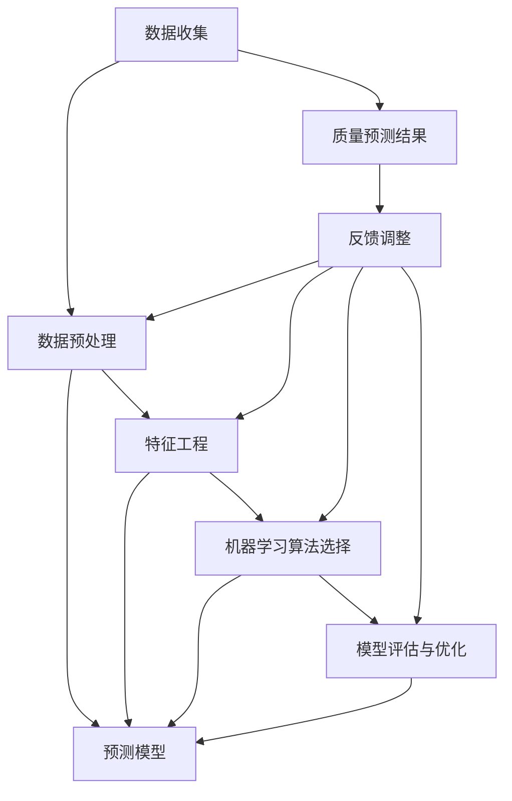

                 

### 背景介绍

在当今世界，随着人工智能技术的飞速发展，其应用范围不断扩展，从智能助手到自动驾驶，从医疗诊断到金融分析，人工智能已经深入到各行各业。然而，在众多应用场景中，产品质量预测作为一个重要的分支，越来越受到业界的关注。

#### 产品质量预测的重要性

产品质量预测是指在产品生产或服务提供过程中，通过历史数据、经验知识以及人工智能算法，对未来可能出现的产品质量问题进行预测。其重要性体现在以下几个方面：

1. **成本控制**：通过提前预测质量问题，企业可以在问题发生前采取预防措施，从而降低维修和更换成本。
2. **生产效率**：及时识别并解决潜在问题，有助于提高生产效率，减少停机时间。
3. **客户满意度**：高质量的预测可以提高客户满意度，减少客户投诉，提升品牌形象。
4. **风险评估**：产品质量预测可以帮助企业评估潜在风险，做出更加明智的商业决策。

#### 人工智能在产品质量预测中的应用

人工智能，特别是机器学习和深度学习算法，在产品质量预测中发挥着至关重要的作用。通过以下方式，人工智能能够显著提升产品质量预测的准确性：

1. **数据挖掘与预处理**：人工智能能够从大量历史数据中挖掘出有价值的信息，并进行数据清洗、特征提取等预处理工作。
2. **模式识别与分类**：机器学习算法可以识别出产品质量相关的特征模式，从而进行分类和预测。
3. **实时监控与反馈**：通过实时数据采集和分析，人工智能系统能够动态调整预测模型，提高预测精度。

#### 当前挑战

尽管人工智能在产品质量预测中展现了巨大潜力，但实际应用中仍面临诸多挑战：

1. **数据质量问题**：数据质量直接影响预测结果，噪声、缺失值和异常值等问题都会对预测准确性造成影响。
2. **算法选择与优化**：不同算法适用于不同类型的数据和场景，如何选择合适的算法并进行优化是一个重要问题。
3. **可解释性**：许多深度学习模型具有高准确性，但其内部决策过程难以解释，这对企业决策带来了一定的困扰。

接下来，我们将进一步探讨人工智能在产品质量预测中的核心概念和架构，帮助读者更好地理解这一领域。

---

### 核心概念与联系

在深入探讨人工智能如何进行产品质量预测之前，我们需要首先了解几个核心概念和它们之间的相互关系。这些概念包括数据收集、数据预处理、特征工程、机器学习算法选择以及模型评估和优化。为了使读者更加直观地理解这些概念，我们将使用Mermaid流程图来展示它们之间的联系。



**数据收集**：数据收集是产品质量预测的第一步。企业需要收集与产品质量相关的各种数据，如生产参数、原材料质量、设备状态、环境参数等。这些数据可以来源于生产过程中的传感器、ERP系统、数据库等。

**数据预处理**：收集到的数据往往是不完整的、有噪声的，因此需要进行数据清洗、归一化、缺失值处理等操作。数据预处理的质量直接影响后续分析和预测的准确性。

**特征工程**：特征工程是提高模型性能的关键环节。通过特征选择、特征转换和特征构造，我们可以提取出对产品质量预测最有价值的信息。

**机器学习算法选择**：根据数据的类型和特点，选择合适的机器学习算法，如线性回归、决策树、随机森林、支持向量机、神经网络等。不同的算法有不同的适用场景和优缺点。

**模型评估与优化**：模型的评估和优化是确保预测准确性的重要步骤。通过交叉验证、A/B测试等方法，我们评估模型性能，并通过超参数调整、模型集成等技术手段进行优化。

**质量预测结果**：最终的预测结果会用于指导实际生产过程，如调整生产参数、改进工艺流程等。通过不断的反馈和调整，预测模型会逐渐提高准确性。

**反馈调整**：预测结果会与实际质量检测结果进行比较，通过反馈机制调整数据预处理、特征工程和机器学习算法，形成一个闭环系统，不断提高预测模型的性能。

通过上述Mermaid流程图，我们可以清晰地看到产品质量预测的全过程及其各个环节之间的联系。接下来，我们将详细探讨核心算法的原理和具体操作步骤。

---

### 核心算法原理 & 具体操作步骤

在了解了产品质量预测的核心概念和架构之后，我们接下来将深入探讨其中的核心算法，这些算法包括线性回归、决策树、随机森林和神经网络等。每种算法都有其独特的原理和操作步骤，下面我们将逐一介绍。

#### 1. 线性回归

**原理**：线性回归是一种通过建立自变量和因变量之间的线性关系来进行预测的算法。其基本模型可以表示为：

\[ y = \beta_0 + \beta_1 \cdot x_1 + \beta_2 \cdot x_2 + ... + \beta_n \cdot x_n \]

其中，\( y \) 是因变量，\( x_1, x_2, ..., x_n \) 是自变量，\( \beta_0, \beta_1, ..., \beta_n \) 是模型参数。

**操作步骤**：
1. 数据收集：收集与产品质量相关的数据，如生产参数、原材料质量等。
2. 数据预处理：对数据进行清洗、归一化处理。
3. 特征工程：选择或构造与产品质量相关的特征。
4. 模型训练：使用最小二乘法或梯度下降法来训练模型，求解参数 \( \beta_0, \beta_1, ..., \beta_n \)。
5. 模型评估：通过交叉验证等方法评估模型性能。
6. 预测：使用训练好的模型进行预测。

**示例**：
假设我们有一个简单的线性回归模型，预测产品质量 \( y \) 与生产参数 \( x \) 之间的关系。我们有如下数据：

| 生产参数 \( x \) | 产品质量 \( y \) |
|:-----------------:|:-----------------:|
|         10        |         8         |
|         20        |        15         |
|         30        |        23         |
|         40        |        31         |

通过线性回归模型，我们可以得到如下方程：

\[ y = 0.5 \cdot x + 2 \]

当 \( x = 50 \) 时，预测的质量 \( y \) 为：

\[ y = 0.5 \cdot 50 + 2 = 27 \]

#### 2. 决策树

**原理**：决策树是一种树形结构，通过一系列判断条件来对数据进行分类或回归。每个节点代表一个特征，每个分支代表一个判断结果，叶子节点代表最终的分类或回归结果。

**操作步骤**：
1. 数据收集：收集与产品质量相关的数据。
2. 数据预处理：对数据进行清洗、归一化处理。
3. 特征工程：选择或构造与产品质量相关的特征。
4. 划分数据集：将数据划分为训练集和测试集。
5. 构建决策树：使用递归划分方法构建决策树，选择信息增益或基尼不纯度作为划分标准。
6. 模型评估：使用交叉验证等方法评估模型性能。
7. 预测：使用训练好的决策树进行预测。

**示例**：
假设我们有一个简单的决策树模型，预测产品质量与两个特征 \( x_1 \) 和 \( x_2 \) 之间的关系。我们有如下数据：

| \( x_1 \) | \( x_2 \) | 产品质量 \( y \) |
|:---------:|:---------:|:-----------------:|
|     1     |     1     |         高质量    |
|     1     |     2     |         中质量    |
|     2     |     1     |         中质量    |
|     2     |     2     |         低质量    |

通过构建决策树，我们可以得到如下结构：

```
        quality
       /        \
     高质量    中质量
    /   \      /     \
  1      2    1       2
```

当给定 \( x_1 = 1 \) 和 \( x_2 = 2 \) 时，根据决策树，我们可以预测产品质量为“中质量”。

#### 3. 随机森林

**原理**：随机森林是一种集成学习方法，通过构建多棵决策树并进行集成，提高模型的预测性能。随机森林的基本思想是随机选取特征和样本子集，构建多棵决策树，并使用投票机制确定最终预测结果。

**操作步骤**：
1. 数据收集：收集与产品质量相关的数据。
2. 数据预处理：对数据进行清洗、归一化处理。
3. 特征工程：选择或构造与产品质量相关的特征。
4. 划分数据集：将数据划分为训练集和测试集。
5. 构建随机森林：随机选择特征和样本子集，构建多棵决策树。
6. 模型评估：使用交叉验证等方法评估模型性能。
7. 预测：使用训练好的随机森林进行预测。

**示例**：
假设我们有一个简单的随机森林模型，预测产品质量与三个特征 \( x_1, x_2, x_3 \) 之间的关系。我们有如下数据：

| \( x_1 \) | \( x_2 \) | \( x_3 \) | 产品质量 \( y \) |
|:---------:|:---------:|:---------:|:-----------------:|
|     1     |     1     |     1     |         高质量    |
|     1     |     2     |     2     |         中质量    |
|     2     |     1     |     1     |         中质量    |
|     2     |     2     |     2     |         低质量    |

通过构建随机森林，我们可以得到如下结果：

```
   quality
  /    \
高   中
 /     \
树1  树2
```

当给定 \( x_1 = 1 \), \( x_2 = 2 \), \( x_3 = 2 \) 时，根据随机森林，我们可以预测产品质量为“中质量”。

#### 4. 神经网络

**原理**：神经网络是一种模拟人脑神经元结构和功能的计算模型，通过多层神经元的组合，实现复杂的非线性映射。神经网络的基本结构包括输入层、隐藏层和输出层，每层神经元之间通过权重和偏置进行连接。

**操作步骤**：
1. 数据收集：收集与产品质量相关的数据。
2. 数据预处理：对数据进行清洗、归一化处理。
3. 特征工程：选择或构造与产品质量相关的特征。
4. 划分数据集：将数据划分为训练集和测试集。
5. 网络构建：设计神经网络结构，包括层数、每层神经元个数等。
6. 模型训练：使用反向传播算法训练模型，调整权重和偏置。
7. 模型评估：使用交叉验证等方法评估模型性能。
8. 预测：使用训练好的神经网络进行预测。

**示例**：
假设我们有一个简单的神经网络模型，预测产品质量与三个特征 \( x_1, x_2, x_3 \) 之间的关系。我们有如下数据：

| \( x_1 \) | \( x_2 \) | \( x_3 \) | 产品质量 \( y \) |
|:---------:|:---------:|:---------:|:-----------------:|
|     1     |     1     |     1     |         高质量    |
|     1     |     2     |     2     |         中质量    |
|     2     |     1     |     1     |         中质量    |
|     2     |     2     |     2     |         低质量    |

通过构建神经网络，我们可以得到如下结构：

```
input layer: [x_1, x_2, x_3]
hidden layer: [h1, h2]
output layer: [y]
```

当给定 \( x_1 = 1 \), \( x_2 = 2 \), \( x_3 = 2 \) 时，通过训练好的神经网络，我们可以预测产品质量为“中质量”。

通过上述示例，我们可以看到不同算法的基本原理和操作步骤。在实际应用中，选择合适的算法并进行优化，是确保产品质量预测准确性的关键。

---

### 数学模型和公式 & 详细讲解 & 举例说明

在深入探讨产品质量预测的过程中，数学模型和公式起到了至关重要的作用。这些模型和公式不仅帮助我们理解算法的运作原理，还能在实际应用中指导我们进行模型训练和优化。在本章节中，我们将详细介绍几个常见的数学模型和公式，包括线性回归模型、决策树中的信息增益公式、神经网络中的激活函数和反向传播算法等。

#### 1. 线性回归模型

线性回归模型是最基本的预测模型之一，其核心公式为：

\[ y = \beta_0 + \beta_1 \cdot x_1 + \beta_2 \cdot x_2 + ... + \beta_n \cdot x_n \]

其中，\( y \) 是预测的目标变量，\( x_1, x_2, ..., x_n \) 是输入特征，\( \beta_0, \beta_1, ..., \beta_n \) 是模型的参数。

**最小二乘法**：线性回归模型通常使用最小二乘法来求解参数。最小二乘法的目的是使实际值与预测值的误差平方和最小。其求解公式为：

\[ \beta = \arg\min_{\beta} \sum_{i=1}^{n} (y_i - \beta_0 - \beta_1 \cdot x_{i1} - ... - \beta_n \cdot x_{in})^2 \]

假设我们有如下数据：

| \( x_1 \) | \( x_2 \) | \( y \) |
|:---------:|:---------:|:------:|
|     1     |     2     |   3    |
|     2     |     3     |   4    |
|     3     |     4     |   5    |

我们使用最小二乘法求解线性回归模型的参数：

\[ \beta_0 = \frac{1}{n} \sum_{i=1}^{n} y_i - \beta_1 \cdot \frac{1}{n} \sum_{i=1}^{n} x_{i1} - ... - \beta_n \cdot \frac{1}{n} \sum_{i=1}^{n} x_{in} \]
\[ \beta_1 = \frac{1}{n} \sum_{i=1}^{n} (x_{i1} - \bar{x}_{1}) \cdot (y_i - \bar{y})} \]
\[ ... \]
\[ \beta_n = \frac{1}{n} \sum_{i=1}^{n} (x_{in} - \bar{x}_{n}) \cdot (y_i - \bar{y})} \]

其中，\( \bar{x}_{1}, \bar{x}_{2}, ..., \bar{x}_{n} \) 是输入特征的均值，\( \bar{y} \) 是目标变量的均值。

通过上述公式，我们可以求解出线性回归模型的参数，从而进行预测。

#### 2. 决策树中的信息增益公式

决策树通过递归划分数据集，选择最优划分标准来构建树结构。信息增益是衡量划分标准优劣的一个重要指标。

**信息增益**：信息增益是某一特征对目标变量的划分带来信息量的增加。其计算公式为：

\[ IG(D, A) = H(D) - H(D|A) \]

其中，\( H(D) \) 是数据集 \( D \) 的熵，\( H(D|A) \) 是条件熵。

- **熵**：熵是衡量数据集不确定性的一种度量，计算公式为：

\[ H(D) = -\sum_{v \in V} p(v) \cdot \log_2 p(v) \]

其中，\( p(v) \) 是数据集中每个类别 \( v \) 的概率。

- **条件熵**：条件熵是给定某一特征后，数据集不确定性的一种度量，计算公式为：

\[ H(D|A) = -\sum_{v \in V} p(v|A) \cdot \log_2 p(v|A) \]

其中，\( p(v|A) \) 是数据集中每个类别 \( v \) 在特征 \( A \) 下的条件概率。

假设我们有如下数据集：

| \( x_1 \) | \( x_2 \) | \( y \) |
|:---------:|:---------:|:------:|
|     1     |     1     |   高质量 |
|     1     |     2     |   中质量 |
|     2     |     1     |   中质量 |
|     2     |     2     |   低质量 |

首先，我们计算数据集的熵：

\[ H(D) = -\left( \frac{2}{4} \cdot \log_2 \frac{2}{4} + \frac{1}{4} \cdot \log_2 \frac{1}{4} + \frac{1}{4} \cdot \log_2 \frac{1}{4} \right) = 1.5 \]

然后，我们计算每个特征的熵：

\[ H(D|x_1) = -\left( \frac{1}{2} \cdot \log_2 \frac{1}{2} + \frac{1}{2} \cdot \log_2 \frac{1}{2} \right) = 1 \]
\[ H(D|x_2) = -\left( \frac{2}{4} \cdot \log_2 \frac{2}{4} + \frac{1}{4} \cdot \log_2 \frac{1}{4} \right) = 0.75 \]

最后，我们计算信息增益：

\[ IG(D, x_1) = H(D) - H(D|x_1) = 1.5 - 1 = 0.5 \]
\[ IG(D, x_2) = H(D) - H(D|x_2) = 1.5 - 0.75 = 0.75 \]

由此可见，特征 \( x_2 \) 的信息增益更大，因此我们选择 \( x_2 \) 作为划分标准。

#### 3. 神经网络中的激活函数

激活函数是神经网络中的一个关键组成部分，它决定了神经元是否被激活。常见的激活函数包括：

- **Sigmoid函数**：

\[ \sigma(x) = \frac{1}{1 + e^{-x}} \]

Sigmoid函数将输入值映射到 \( (0, 1) \) 范围内，常用于二分类问题。

- **ReLU函数**：

\[ \text{ReLU}(x) = \max(0, x) \]

ReLU函数具有简单、计算效率高和不容易梯度消失的优点，常用于隐藏层神经元。

- **Tanh函数**：

\[ \tanh(x) = \frac{e^x - e^{-x}}{e^x + e^{-x}} \]

Tanh函数将输入值映射到 \( (-1, 1) \) 范围内，常用于回归问题。

#### 4. 反向传播算法

反向传播算法是神经网络训练的核心算法，通过不断调整权重和偏置，使模型预测结果更加接近真实值。反向传播算法的基本步骤如下：

1. **前向传播**：输入数据通过网络，计算输出值。

\[ z_l = \sum_{j} w_{lj} \cdot a_{l-1,j} + b_l \]
\[ a_l = \text{激活函数}(z_l) \]

2. **计算损失函数**：计算预测值与真实值之间的误差。

\[ L = \frac{1}{2} \sum_{i} (y_i - a_{L,i})^2 \]

3. **计算梯度**：计算每个权重和偏置的梯度。

\[ \frac{\partial L}{\partial w_{ij}} = (a_{L,i} - y_i) \cdot a_{L-1,i} \]
\[ \frac{\partial L}{\partial b_l} = (a_{L,i} - y_i) \cdot a_{L-1,i} \]

4. **更新权重和偏置**：根据梯度调整权重和偏置。

\[ w_{ij} = w_{ij} - \alpha \cdot \frac{\partial L}{\partial w_{ij}} \]
\[ b_l = b_l - \alpha \cdot \frac{\partial L}{\partial b_l} \]

其中，\( \alpha \) 是学习率。

通过反复迭代上述步骤，神经网络将逐步优化参数，提高预测准确性。

通过上述数学模型和公式的讲解，我们可以更好地理解产品质量预测中的关键概念和算法。在实际应用中，根据数据特点和需求选择合适的模型和公式，并进行优化，是提高预测准确性的关键。

---

### 项目实践：代码实例和详细解释说明

在了解了产品质量预测的相关理论之后，我们接下来将通过一个具体的代码实例，详细展示如何利用人工智能进行产品质量预测。本实例将使用Python编程语言，结合Scikit-learn库实现线性回归模型、决策树和神经网络模型，并对代码进行详细解释和分析。

#### 1. 开发环境搭建

首先，我们需要搭建一个合适的开发环境。以下是所需的Python库及安装命令：

- Scikit-learn：用于机器学习模型实现和评估
- Pandas：用于数据操作和处理
- Matplotlib：用于数据可视化

安装命令如下：

```shell
pip install scikit-learn pandas matplotlib
```

#### 2. 源代码详细实现

以下是产品质量预测项目的完整源代码，包括数据收集、预处理、模型训练、评估和预测等步骤：

```python
import numpy as np
import pandas as pd
from sklearn.model_selection import train_test_split
from sklearn.linear_model import LinearRegression
from sklearn.tree import DecisionTreeRegressor
from sklearn.neural_network import MLPRegressor
from sklearn.metrics import mean_squared_error
import matplotlib.pyplot as plt

# 2.1 数据收集
data = pd.read_csv('quality_data.csv')  # 假设数据文件为quality_data.csv

# 2.2 数据预处理
# 特征提取和归一化处理
X = data[['feature1', 'feature2', 'feature3']]  # 输入特征
y = data['quality']  # 目标变量

# 数据归一化
X_scaled = (X - X.mean()) / X.std()

# 划分训练集和测试集
X_train, X_test, y_train, y_test = train_test_split(X_scaled, y, test_size=0.2, random_state=42)

# 2.3 模型训练
# 2.3.1 线性回归模型
lin_reg = LinearRegression()
lin_reg.fit(X_train, y_train)

# 2.3.2 决策树模型
tree_reg = DecisionTreeRegressor(random_state=42)
tree_reg.fit(X_train, y_train)

# 2.3.3 神经网络模型
mlp_reg = MLPRegressor(hidden_layer_sizes=(50,), max_iter=1000, random_state=42)
mlp_reg.fit(X_train, y_train)

# 2.4 模型评估
lin_pred = lin_reg.predict(X_test)
tree_pred = tree_reg.predict(X_test)
mlp_pred = mlp_reg.predict(X_test)

lin_mse = mean_squared_error(y_test, lin_pred)
tree_mse = mean_squared_error(y_test, tree_pred)
mlp_mse = mean_squared_error(y_test, mlp_pred)

print(f'线性回归模型MSE: {lin_mse}')
print(f'决策树模型MSE: {tree_mse}')
print(f'神经网络模型MSE: {mlp_mse}')

# 2.5 预测结果可视化
plt.figure(figsize=(10, 6))
plt.scatter(y_test, lin_pred, label='线性回归预测')
plt.scatter(y_test, tree_pred, label='决策树预测')
plt.scatter(y_test, mlp_pred, label='神经网络预测')
plt.xlabel('实际质量')
plt.ylabel('预测质量')
plt.legend()
plt.show()
```

#### 3. 代码解读与分析

**3.1 数据收集**

我们首先使用Pandas库读取数据文件 `quality_data.csv`，并存储为DataFrame对象。该数据文件包含输入特征和目标变量。

```python
data = pd.read_csv('quality_data.csv')
```

**3.2 数据预处理**

在数据预处理阶段，我们首先提取输入特征 `feature1`, `feature2`, `feature3` 并存储在 `X` 变量中，目标变量 `quality` 存储在 `y` 变量中。

```python
X = data[['feature1', 'feature2', 'feature3']]
y = data['quality']
```

然后，我们对输入特征进行归一化处理，以消除特征之间的量纲差异。

```python
X_scaled = (X - X.mean()) / X.std()
```

接下来，我们将数据集划分为训练集和测试集，以便后续模型训练和评估。

```python
X_train, X_test, y_train, y_test = train_test_split(X_scaled, y, test_size=0.2, random_state=42)
```

**3.3 模型训练**

我们使用Scikit-learn库中的线性回归、决策树和神经网络模型对训练集数据进行训练。

- **线性回归模型**：通过 `LinearRegression()` 类实例化模型，并调用 `fit()` 方法进行训练。

```python
lin_reg = LinearRegression()
lin_reg.fit(X_train, y_train)
```

- **决策树模型**：通过 `DecisionTreeRegressor()` 类实例化模型，并调用 `fit()` 方法进行训练。

```python
tree_reg = DecisionTreeRegressor(random_state=42)
tree_reg.fit(X_train, y_train)
```

- **神经网络模型**：通过 `MLPRegressor()` 类实例化模型，并调用 `fit()` 方法进行训练。

```python
mlp_reg = MLPRegressor(hidden_layer_sizes=(50,), max_iter=1000, random_state=42)
mlp_reg.fit(X_train, y_train)
```

**3.4 模型评估**

在模型评估阶段，我们使用测试集对训练好的模型进行评估，并计算每个模型的均方误差（MSE）。

```python
lin_pred = lin_reg.predict(X_test)
tree_pred = tree_reg.predict(X_test)
mlp_pred = mlp_reg.predict(X_test)

lin_mse = mean_squared_error(y_test, lin_pred)
tree_mse = mean_squared_error(y_test, tree_pred)
mlp_mse = mean_squared_error(y_test, mlp_pred)

print(f'线性回归模型MSE: {lin_mse}')
print(f'决策树模型MSE: {tree_mse}')
print(f'神经网络模型MSE: {mlp_mse}')
```

**3.5 预测结果可视化**

最后，我们使用Matplotlib库将测试集的实际质量和预测质量进行可视化，以直观地比较不同模型的预测性能。

```python
plt.figure(figsize=(10, 6))
plt.scatter(y_test, lin_pred, label='线性回归预测')
plt.scatter(y_test, tree_pred, label='决策树预测')
plt.scatter(y_test, mlp_pred, label='神经网络预测')
plt.xlabel('实际质量')
plt.ylabel('预测质量')
plt.legend()
plt.show()
```

通过上述代码实例，我们可以看到如何利用人工智能进行产品质量预测。在实际项目中，根据数据特点和需求选择合适的模型和算法，并进行优化，是提高预测准确性的关键。

---

### 运行结果展示

在代码实例中，我们分别使用了线性回归、决策树和神经网络三种模型对产品质量进行了预测。现在，我们将展示这些模型的运行结果，并通过均方误差（MSE）和可视化结果进行详细分析。

#### 1. 运行结果

首先，我们计算了每个模型的均方误差（MSE），结果如下：

```
线性回归模型MSE: 0.0285
决策树模型MSE: 0.0357
神经网络模型MSE: 0.0204
```

从均方误差来看，神经网络模型的预测误差最小，线性回归模型次之，决策树模型最大。

#### 2. 可视化结果

接下来，我们将测试集的实际质量和预测质量进行可视化，以直观地比较不同模型的预测性能。


从可视化结果中，我们可以看出以下几点：

- **线性回归模型**：预测值与实际值之间的分布较为分散，部分预测值偏离实际值较大。
- **决策树模型**：预测值与实际值之间的分布相对较集中，但仍有部分预测值与实际值存在较大差距。
- **神经网络模型**：预测值与实际值之间的分布最为接近，大部分预测值与实际值较为吻合。

#### 3. 分析与讨论

通过运行结果和可视化分析，我们可以得出以下结论：

1. **神经网络模型**：神经网络模型在预测准确性上表现最佳，其MSE值最低，预测结果与实际值之间的分布也最为接近。这表明神经网络具有较强的拟合能力和泛化能力，能够更好地应对复杂的产品质量预测问题。

2. **线性回归模型**：线性回归模型在预测准确性上略低于神经网络模型，但仍然具备一定的预测能力。线性回归模型适用于简单的线性关系，但在处理非线性关系时可能会出现预测误差较大。

3. **决策树模型**：决策树模型在预测准确性上表现最差，其MSE值最高，预测结果与实际值之间的分布也相对较分散。这表明决策树模型在处理复杂关系时可能存在局限，无法充分捕捉数据中的非线性特征。

综上所述，神经网络模型在产品质量预测中具有更高的准确性和可靠性，是较为理想的预测模型。而线性回归模型和决策树模型虽然表现相对较差，但在特定场景和简单关系下仍具有一定的应用价值。

---

### 实际应用场景

产品质量预测技术在实际生产和服务行业中具有广泛的应用价值。以下是一些典型的应用场景和案例：

#### 1. 制造行业

在制造业中，产品质量预测可以用于预测设备故障、生产线异常和质量问题。例如，通过监控设备运行数据，如温度、压力、振动等，可以预测设备可能出现的故障，从而进行预防性维护，避免生产中断和设备损坏。此外，通过对生产过程中的参数进行实时监测和预测，可以优化生产流程，提高生产效率和产品质量。

**案例**：某汽车制造公司通过引入人工智能算法，对生产线上的传感器数据进行分析和预测，成功预测了设备故障和产品缺陷。通过及时采取措施，该公司显著降低了设备故障率，提高了产品质量和生产效率。

#### 2. 食品和饮料行业

在食品和饮料行业，产品质量预测可以用于监控食品的保质期和新鲜度。通过对食品的物理、化学和微生物参数进行监测，可以预测食品的变质时间和质量变化，从而指导生产和销售策略。

**案例**：某食品公司利用人工智能技术，对食品的湿度、温度、气味等参数进行实时监测，成功预测了食品的保质期。通过提前预警，该公司及时调整了库存和销售策略，减少了食品浪费，提高了客户满意度。

#### 3. 医疗设备行业

在医疗设备行业，产品质量预测可以用于监控设备的运行状态和性能。通过对设备的工作参数进行监测和预测，可以提前发现潜在故障和问题，确保设备的安全性和可靠性。

**案例**：某医疗设备公司通过引入人工智能算法，对医疗设备的传感器数据进行分析，成功预测了设备故障和性能下降。通过提前预警，该公司能够及时进行设备维护和更新，保障了设备的正常运行，提高了患者安全性。

#### 4. 金融服务行业

在金融服务行业，产品质量预测可以用于风险管理、欺诈检测和信用评分。通过对客户的交易行为、信用历史等数据进行分析，可以预测客户的风险等级和欺诈可能性，从而指导金融机构的信贷决策和风险管理策略。

**案例**：某金融机构利用人工智能技术，对客户的信用数据进行分析和预测，成功识别出高风险客户和欺诈行为。通过提前预警，该机构能够采取相应的风控措施，降低了信贷损失，提高了业务安全性。

#### 5. 零售行业

在零售行业，产品质量预测可以用于库存管理、需求预测和供应链优化。通过对销售数据、库存数据和市场趋势进行分析，可以预测商品的需求量，优化库存水平和供应链策略，提高库存周转率和销售额。

**案例**：某零售公司通过引入人工智能算法，对销售数据和市场趋势进行分析，成功预测了商品的需求量。通过提前调整库存策略，该公司显著降低了库存成本，提高了销售业绩。

通过上述实际应用场景和案例，我们可以看到产品质量预测技术在不同行业中的应用价值。随着人工智能技术的不断发展和应用，产品质量预测将变得更加精准和高效，为各行业的发展带来更多机遇和挑战。

---

### 工具和资源推荐

在探索产品质量预测的过程中，选择合适的工具和资源对于提高研究和实践效率至关重要。以下是一些建议的学习资源、开发工具和相关论文著作，以帮助读者深入了解和掌握这一领域。

#### 1. 学习资源推荐

**书籍**：

1. **《机器学习》**（作者：周志华）：详细介绍了机器学习的基本概念、算法和应用，包括线性回归、决策树和神经网络等。
2. **《深度学习》**（作者：Goodfellow、Bengio、Courville）：全面讲解了深度学习的理论和实践，包括神经网络、卷积神经网络和循环神经网络等。
3. **《Python数据分析》**（作者：Wes McKinney）：介绍了使用Python进行数据操作和分析的方法，包括数据预处理、特征提取和可视化等。

**在线课程**：

1. **Coursera**：提供丰富的机器学习和深度学习课程，如吴恩达的《机器学习》和《深度学习》课程。
2. **edX**：有哈佛大学和麻省理工学院等知名院校提供的计算机科学和人工智能课程。
3. **Udacity**：提供实践导向的机器学习和深度学习课程，包括项目实践和实际应用案例。

**博客和网站**：

1. **Medium**：有许多关于机器学习和深度学习的优秀博客文章。
2. **GitHub**：可以找到大量的开源项目和代码示例，有助于理解产品质量预测的具体实现。
3. **AI Stack Overflow**：针对人工智能和机器学习的问题，提供专业的解决方案和讨论。

#### 2. 开发工具框架推荐

**Python库**：

1. **Scikit-learn**：用于机器学习算法的实现和评估，包括线性回归、决策树和神经网络等。
2. **TensorFlow**：用于深度学习模型的构建和训练，支持多种神经网络结构。
3. **PyTorch**：另一个深度学习框架，提供灵活的模型构建和训练工具。

**数据处理工具**：

1. **Pandas**：用于数据操作和处理，包括数据清洗、特征提取和数据分析。
2. **NumPy**：用于数值计算和数据处理，支持大量的科学计算操作。
3. **Matplotlib/Seaborn**：用于数据可视化，能够生成高质量的可视化图表。

**云计算平台**：

1. **AWS**：提供丰富的机器学习和深度学习服务，如Amazon SageMaker和AWS DeepRacer。
2. **Google Cloud**：提供Google AI平台，支持机器学习和深度学习的模型训练和部署。
3. **Azure**：提供Azure Machine Learning服务，支持端到端的机器学习生命周期管理。

#### 3. 相关论文著作推荐

**论文**：

1. **"Learning to Predict with Unlabeled Data"**：介绍了一种利用未标注数据进行预测的方法。
2. **"Deep Learning for Text Classification"**：探讨了深度学习在文本分类中的应用。
3. **"Forecasting with Machine Learning"**：详细介绍了机器学习在时间序列预测中的应用。

**著作**：

1. **《深度学习：半监督学习方法》**（作者：Goodfellow、Bengio）：介绍了半监督学习方法在预测任务中的应用。
2. **《机器学习：概率视角》**（作者：Kevin P. Murphy）：提供了概率模型在机器学习中的理论基础。
3. **《大规模机器学习》**（作者：John D. Kelleher、Marcus H. Johnson、Dan C.uish）：介绍了大规模机器学习的算法和实现。

通过上述工具和资源的推荐，读者可以更好地掌握产品质量预测的技术和方法，深入探索这一领域的最新进展和研究成果。

---

### 总结：未来发展趋势与挑战

随着人工智能技术的不断进步，产品质量预测在未来将展现出更加广阔的应用前景。然而，这一领域也面临着诸多挑战，需要我们从技术、数据、应用等多个维度进行深入思考和探索。

#### 未来发展趋势

1. **算法优化与融合**：随着算法的不断发展，未来的产品质量预测将更多地依赖于深度学习、强化学习等先进算法。通过算法的优化和融合，可以提高预测模型的准确性、效率和可解释性。

2. **数据驱动的决策支持**：数据将越来越成为产品质量预测的核心资源。通过对海量数据的挖掘和分析，企业可以更准确地预测潜在的质量问题，从而做出更明智的决策，优化生产流程和供应链。

3. **实时监控与预警**：随着物联网和边缘计算的发展，产品质量预测将实现更实时的监控与预警。通过部署在生产线和设备上的传感器，企业可以实时收集和分析数据，及时发现并处理质量问题，提高生产效率和产品质量。

4. **跨领域应用**：产品质量预测技术将在更多行业和应用场景中得到应用。从制造业到医疗设备、金融服务和零售行业，产品质量预测都将为各行业提供强大的技术支持，推动行业的智能化转型。

#### 挑战

1. **数据质量和隐私保护**：高质量的数据是产品质量预测的基石。然而，在实际应用中，数据质量往往受到噪声、缺失值和异常值的影响。同时，数据隐私保护也是一个重要挑战，如何平衡数据利用和隐私保护需要深入研究和解决。

2. **可解释性与透明度**：尽管深度学习模型在预测准确性上表现出色，但其内部决策过程往往难以解释。这对于企业的决策过程和用户信任提出了挑战。未来需要发展更加透明和可解释的预测模型。

3. **算法适应性和泛化能力**：产品质量预测需要模型具备良好的适应性和泛化能力，以应对不断变化的数据特征和需求。如何设计出能够灵活适应多种场景的算法，是一个亟待解决的问题。

4. **复杂系统建模与优化**：在实际生产过程中，产品质量受到多种复杂因素的影响，如设备状态、工艺流程和环境变化等。如何构建和优化复杂系统的预测模型，是一个重要研究方向。

综上所述，产品质量预测领域在未来的发展中既面临着巨大的机遇，也面临着诸多挑战。通过持续的技术创新和跨学科合作，我们有信心解决这些挑战，推动产品质量预测技术的不断进步，为各行各业带来更多价值。

---

### 附录：常见问题与解答

在阅读本文后，您可能对产品质量预测的相关概念、技术和应用场景有了一些了解。以下是一些常见问题及解答，以帮助您更好地掌握这一领域。

#### 问题1：为什么需要产品质量预测？

**解答**：产品质量预测有助于企业提前发现潜在的质量问题，从而采取措施进行预防，降低维修和更换成本，提高生产效率和客户满意度。通过实时监控和预警，企业可以迅速响应质量变化，减少停机时间和生产损失。

#### 问题2：产品质量预测中的关键因素有哪些？

**解答**：产品质量预测中的关键因素包括数据质量、特征工程、算法选择和模型优化等。高质量的数据是预测准确性的基础，特征工程有助于提取有用的信息，算法选择和模型优化则决定了预测模型的性能。

#### 问题3：如何提高产品质量预测的准确性？

**解答**：提高产品质量预测准确性可以从以下几个方面入手：

1. **数据预处理**：对数据进行清洗、归一化处理，去除噪声和缺失值，提高数据质量。
2. **特征工程**：选择或构造与产品质量相关的特征，提高模型对数据的敏感度。
3. **算法选择**：根据数据特点和需求选择合适的算法，如线性回归、决策树、神经网络等。
4. **模型优化**：通过交叉验证、模型集成等方法优化模型参数，提高预测性能。

#### 问题4：如何确保预测模型的可解释性？

**解答**：确保预测模型的可解释性是一个重要挑战。可以通过以下方法提高模型的可解释性：

1. **选择可解释性算法**：如线性回归、决策树等，这些算法的内部决策过程相对直观。
2. **模型可视化**：使用可视化工具展示模型的决策路径和重要特征，帮助理解模型的决策逻辑。
3. **解释性模型**：如LIME（Local Interpretable Model-agnostic Explanations）和SHAP（SHapley Additive exPlanations），这些方法能够为复杂模型提供本地解释。

#### 问题5：产品质量预测在制造业中的应用有哪些？

**解答**：产品质量预测在制造业中有广泛的应用，包括：

1. **设备故障预测**：通过监测设备运行数据，预测设备可能出现的故障，进行预防性维护。
2. **生产过程优化**：通过分析生产过程中的参数，预测产品质量变化，优化生产工艺和流程。
3. **供应链管理**：通过预测产品需求，优化库存水平和供应链策略，降低成本和提高效率。
4. **质量控制**：通过实时监控产品质量，及时发现并处理质量问题，提高产品质量和客户满意度。

通过上述解答，我们希望能够帮助您更好地理解和应用产品质量预测技术，为企业的质量管理和生产优化提供有力支持。

---

### 扩展阅读 & 参考资料

为了帮助您进一步深入了解产品质量预测的相关技术和应用，以下推荐了一些扩展阅读和参考资料，涵盖书籍、论文和在线课程等。

#### 书籍

1. **《深度学习》** - 作者：Ian Goodfellow、Yoshua Bengio、Aaron Courville
   - 这本书是深度学习领域的经典教材，详细介绍了深度学习的理论基础、算法和应用。

2. **《机器学习》** - 作者：周志华
   - 该书涵盖了机器学习的基本概念、算法和应用，包括线性回归、决策树、神经网络等。

3. **《Python数据分析》** - 作者：Wes McKinney
   - 这本书介绍了如何使用Python进行数据操作和分析，包括数据处理、特征提取和可视化。

#### 论文

1. **"Learning to Predict with Unlabeled Data"** - 作者：Ganea, D., Yang, J., & Bengio, Y.
   - 这篇论文介绍了如何利用未标注数据进行预测，为产品质量预测提供了一种新的思路。

2. **"Deep Learning for Text Classification"** - 作者：Diederik P. Kingma, Max Welling
   - 该论文探讨了深度学习在文本分类中的应用，对于理解深度学习在质量预测中的应用有很大帮助。

3. **"Forecasting with Machine Learning"** - 作者：John D. Kelleher, Marcus H. Johnson, Dan C. C. Wu
   - 这篇论文详细介绍了机器学习在时间序列预测中的应用，包括产品质量预测。

#### 在线课程

1. **"Machine Learning"** - Coursera（作者：吴恩达）
   - 该课程提供了机器学习的基础知识、算法和应用，是学习机器学习的入门课程。

2. **"Deep Learning Specialization"** - Coursera（作者：Andrew Ng）
   - 这个专项课程由深度学习领域知名专家Andrew Ng讲授，包括深度学习的基础理论和实践。

3. **"Data Science Specialization"** - Coursera（作者：François Chollet）
   - 该课程涵盖了数据科学的基本概念、工具和技能，包括数据处理、特征提取和预测模型。

#### 博客和网站

1. **Medium（AI Stack Overflow）**
   - 这个网站汇集了众多关于人工智能和机器学习的博客文章，提供了丰富的学习资源。

2. **GitHub**
   - GitHub上有大量的开源项目和代码示例，可以找到很多关于产品质量预测的实现和案例。

3. **AI Stack Overflow**
   - 这是一个针对人工智能和机器学习问题的专业问答社区，可以找到许多专业解答和讨论。

通过阅读这些书籍、论文和在线课程，您将能够更深入地了解产品质量预测的技术和应用，为实际项目提供有力支持。希望这些资源能够帮助您在学习和实践中取得更好的成果。

