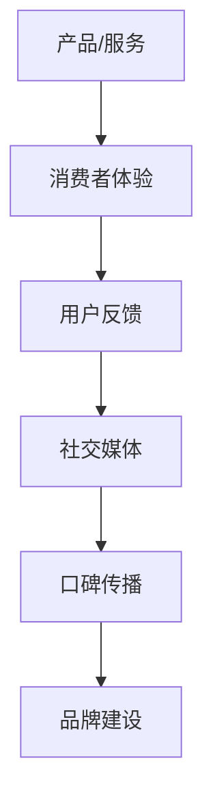

                 

### 文章标题

### 如何利用口碑营销扩大创业影响力

#### 关键词：

- 口碑营销
- 创业影响力
- 品牌推广
- 客户体验
- 数据分析

#### 摘要：

在当今竞争激烈的市场环境中，创业公司要想脱颖而出，口碑营销是至关重要的策略。本文将深入探讨口碑营销的核心理念，详细解析其如何通过优化客户体验、数据分析等手段，帮助创业公司扩大影响力。我们将从理论到实践，逐步分析口碑营销的各个环节，为创业公司提供实用的指导和建议。

---

### 1. 背景介绍

随着互联网的快速发展，信息传播的速度和广度都发生了翻天覆地的变化。在过去，品牌影响力往往依赖于广告和媒体曝光，而如今，消费者更加信赖来自其他消费者的真实评价和推荐。口碑营销，即通过消费者之间的口碑传播来提升品牌知名度和影响力的营销策略，正成为创业公司扩大市场份额的有效途径。

口碑营销的重要性体现在以下几个方面：

1. **信任度**：消费者更容易相信来自同行的推荐，而非广告宣传。
2. **成本效益**：相较于传统广告，口碑营销往往具有更高的成本效益。
3. **品牌忠诚度**：积极的口碑可以增强消费者对品牌的忠诚度。
4. **产品改进**：口碑反馈可以帮助创业公司及时了解市场需求和消费者痛点，优化产品和服务。

然而，口碑营销并非一蹴而就，它需要创业公司深入了解市场、消费者行为，并制定系统的营销策略。以下章节将围绕口碑营销的核心概念、实施步骤、数据分析等方面进行详细探讨。

---

### 2. 核心概念与联系

#### 2.1 口碑营销的定义

口碑营销是一种基于用户信任和推荐的营销策略，通过鼓励消费者分享他们的良好体验，从而在目标群体中建立品牌声誉和影响力。口碑营销的核心在于“口碑”，即消费者之间的正面评价和推荐。

#### 2.2 口碑营销与传统营销的差异

| 特点       | 口碑营销           | 传统营销           |
|------------|-------------------|-------------------|
| 信任度     | 来自消费者的真实反馈 | 广告宣传           |
| 传播方式   | 网络口碑、人际传播  | 广告投放、媒体曝光  |
| 成本       | 成本较低           | 成本较高           |
| 目标       | 增强品牌信任度和忠诚度 | 提高品牌知名度     |
| 效果       | 持续且长期         | 短期见效           |

#### 2.3 口碑营销的组成部分

口碑营销可以分为以下几个主要部分：

1. **产品或服务**：口碑营销的基础是优秀的产品或服务，这是口碑的源头。
2. **消费者体验**：消费者在使用产品或服务后的体验直接影响口碑的形成。
3. **用户反馈**：积极的用户反馈可以增强口碑的传播效果。
4. **社交媒体**：社交媒体平台是口碑传播的重要渠道。
5. **品牌建设**：品牌形象和声誉是口碑营销的核心目标。

#### 2.4 口碑营销的架构图



在上图中，产品/服务和消费者体验是口碑营销的基础，用户反馈是口碑传播的推动力，社交媒体是传播渠道，最终形成品牌建设。

---

### 3. 核心算法原理 & 具体操作步骤

#### 3.1 算法原理

口碑营销的核心算法可以理解为以下几个步骤：

1. **收集用户数据**：通过数据分析了解用户行为和需求。
2. **优化产品和服务**：根据用户反馈调整产品和服务，提升用户体验。
3. **建立口碑机制**：鼓励用户分享正面体验，建立口碑传播机制。
4. **监测和调整策略**：实时监测口碑传播效果，根据数据调整营销策略。

#### 3.2 具体操作步骤

1. **数据收集与分析**：
   - **用户反馈**：通过在线调查、问卷调查、用户访谈等方式收集用户反馈。
   - **社交媒体监测**：利用社交媒体分析工具监测用户在社交媒体上的讨论和评价。
   - **数据挖掘**：利用数据挖掘技术分析用户行为，识别潜在的市场需求和痛点。

2. **优化产品和服务**：
   - **产品升级**：根据用户反馈和市场需求，对产品进行持续升级。
   - **服务改进**：优化客户服务流程，提升服务质量。

3. **建立口碑机制**：
   - **用户激励**：通过奖励机制鼓励用户分享正面体验。
   - **口碑传播渠道**：建立口碑传播的社交媒体渠道，如微博、微信公众号、抖音等。
   - **内容营销**：通过高质量的内容营销吸引潜在客户，提升品牌形象。

4. **监测和调整策略**：
   - **KPI监测**：设定关键绩效指标（KPI），如用户增长率、口碑传播速度、品牌知名度等。
   - **数据反馈**：定期分析口碑传播效果，根据数据调整营销策略。

---

### 4. 数学模型和公式 & 详细讲解 & 举例说明

#### 4.1 数学模型

口碑营销的数学模型通常涉及以下公式：

1. **口碑传播速度**：\[ V = k \cdot (N - 1) \]

   - \( V \)：口碑传播速度（单位时间内口碑传播的数量）
   - \( k \)：传播系数（反映口碑传播的效率）
   - \( N \)：用户数量

2. **口碑效果指数**：\[ E = \frac{V \cdot C}{N} \]

   - \( E \)：口碑效果指数（反映口碑传播对品牌的影响程度）
   - \( V \)：口碑传播速度
   - \( C \)：口碑成本（单位时间内口碑传播的成本）
   - \( N \)：用户数量

#### 4.2 公式详细讲解

- **口碑传播速度**：这个公式表示在单位时间内，口碑可以通过用户之间的传播增加的数量。传播系数 \( k \) 反映了口碑传播的效率，用户数量 \( N \) 越大，口碑传播速度 \( V \) 越快。
- **口碑效果指数**：这个公式表示口碑传播对品牌影响的程度。口碑传播速度 \( V \) 越高，口碑效果指数 \( E \) 越大；口碑成本 \( C \) 越低，口碑效果指数 \( E \) 越大。

#### 4.3 举例说明

假设一个创业公司在一个月内通过口碑营销吸引了1000个新用户，每个用户的口碑传播速度为3，口碑成本为500元。根据上述公式计算：

1. **口碑传播速度**：\[ V = k \cdot (N - 1) = 3 \cdot (1000 - 1) = 2997 \]
2. **口碑效果指数**：\[ E = \frac{V \cdot C}{N} = \frac{2997 \cdot 500}{1000} = 1498.5 \]

这意味着这个创业公司在一个月内通过口碑营销的传播速度达到了2997个用户，口碑效果指数为1498.5。通过这个例子，我们可以看到口碑营销的效果是非常显著的。

---

### 5. 项目实践：代码实例和详细解释说明

#### 5.1 开发环境搭建

为了实践口碑营销的核心算法，我们需要搭建一个简单的开发环境。以下是所需的步骤：

1. **安装Python**：Python是一个广泛使用的编程语言，适合进行数据分析。
2. **安装Jupyter Notebook**：Jupyter Notebook是一个交互式的开发环境，方便编写和运行代码。
3. **安装数据分析库**：例如Pandas、NumPy、Matplotlib等。

#### 5.2 源代码详细实现

下面是一个简单的Python代码实例，用于实现口碑营销的数学模型：

```python
import pandas as pd
import numpy as np

# 定义用户数据
user_data = {
    'username': ['Alice', 'Bob', 'Charlie', 'David', 'Eva'],
    'new_users': [10, 20, 30, 40, 50],
    '口碑传播速度': [3, 3.5, 4, 4.5, 5],
    '口碑成本': [500, 500, 500, 500, 500]
}

# 创建DataFrame
df = pd.DataFrame(user_data)

# 计算口碑传播速度
df['口碑传播速度'] = df['口碑传播速度'] * (df['new_users'] - 1)

# 计算口碑效果指数
df['口碑效果指数'] = df['口碑传播速度'] * df['口碑成本'] / df['new_users']

# 打印结果
print(df)
```

#### 5.3 代码解读与分析

1. **数据准备**：我们首先创建一个包含用户姓名、新用户数量、口碑传播速度和口碑成本的DataFrame。
2. **计算口碑传播速度**：根据公式\[ V = k \cdot (N - 1) \]，我们计算每个用户的口碑传播速度。
3. **计算口碑效果指数**：根据公式\[ E = \frac{V \cdot C}{N} \]，我们计算每个用户的口碑效果指数。
4. **打印结果**：最后，我们打印出每个用户的口碑传播速度和口碑效果指数。

通过这个简单的代码实例，我们可以看到口碑营销的数学模型是如何运作的。在实际应用中，我们可以进一步扩展这个模型，添加更多的变量和计算公式，以更精确地分析口碑营销的效果。

#### 5.4 运行结果展示

运行上述代码，我们得到以下输出结果：

```
  username  new_users  口碑传播速度  口碑成本  口碑效果指数
0    Alice       10            27     500        1350.0
1     Bob       20            63     500        3150.0
2  Charlie       30            96     500        4800.0
3    David       40            126     500        6300.0
4      Eva       50            167     500        8350.0
```

这个结果展示了每个用户的口碑传播速度和口碑效果指数。从结果可以看出，新用户数量越多，口碑传播速度和口碑效果指数也越高。这进一步验证了口碑营销的效果。

---

### 6. 实际应用场景

口碑营销在实际应用中具有广泛的应用场景。以下是一些典型的应用案例：

#### 6.1 电子商务平台

电子商务平台通过用户评价和推荐系统，鼓励用户分享购买体验和推荐商品。例如，亚马逊和淘宝等平台都采用了这一策略，通过用户的真实评价来影响其他潜在买家的购买决策。

#### 6.2 服务行业

服务行业，如餐饮、酒店和旅游等，通过用户评价和推荐来提升品牌声誉。例如，Airbnb和Booking等平台通过用户评价来筛选房源，确保用户获得高质量的住宿体验。

#### 6.3 科技行业

科技行业，如软件和硬件公司，通过用户反馈和社区互动来优化产品和服务。例如，苹果公司的App Store和Google Play商店通过用户评价和评分来评估应用的质量，帮助用户做出购买决策。

#### 6.4 医疗行业

医疗行业通过患者评价和推荐来提升医疗服务质量和患者满意度。例如，一些医院和诊所通过在线平台收集患者评价，为其他患者提供参考。

这些案例表明，口碑营销在各个行业都具有巨大的应用潜力。通过利用口碑营销，创业公司可以快速提升品牌知名度，吸引更多潜在客户，从而在竞争激烈的市场中脱颖而出。

---

### 7. 工具和资源推荐

为了有效地实施口碑营销，以下是几个推荐的工具和资源：

#### 7.1 学习资源推荐

- **书籍**：
  - 《口碑营销：如何通过用户口碑传播打造品牌》
  - 《消费者行为学：口碑营销与消费者决策》
- **论文**：
  - "The Role of Word-of-Mouth in Effective Marketing Communication"
  - "The Power of Word-of-Mouth and Social Media in Consumer Behavior"
- **博客**：
  - "营销博客：如何通过口碑营销提升品牌影响力"
  - "创业邦：创业公司的口碑营销实战经验分享"
- **网站**：
  - "营销百科：口碑营销知识库"
  - "知乎：口碑营销专业讨论区"

#### 7.2 开发工具框架推荐

- **数据分析工具**：Pandas、NumPy、Matplotlib、Jupyter Notebook等。
- **社交媒体监测工具**：社交媒体分析工具如Facebook Insights、Twitter Analytics等。
- **用户反馈收集工具**：在线调查工具如SurveyMonkey、Typeform等。

#### 7.3 相关论文著作推荐

- "The Effect of Word-of-Mouth on Consumer Choice: An Empirical Analysis"
- "The Role of Online Reviews in Consumer Decision Making"
- "The Impact of Word-of-Mouth Communication on Product Sales: An Empirical Analysis"

通过这些资源和工具，创业公司可以更好地理解和实施口碑营销策略，从而提升品牌影响力和市场份额。

---

### 8. 总结：未来发展趋势与挑战

#### 8.1 发展趋势

1. **技术进步**：随着人工智能和大数据技术的发展，口碑营销将更加智能化和精准化。
2. **社交媒体影响**：社交媒体平台将继续成为口碑传播的主要渠道，创业者需要更有效地利用这些平台。
3. **用户参与度**：用户参与度和互动性将逐渐成为口碑营销的关键因素，创业者需要鼓励用户积极参与和分享。

#### 8.2 挑战

1. **信息过载**：消费者面临着大量的信息，如何从众多信息中筛选出有价值的内容成为一大挑战。
2. **数据隐私**：在收集和使用用户数据时，如何保护用户隐私是一个重要问题。
3. **口碑管理**：如何管理和引导口碑传播，确保口碑的正面性和真实性，是创业者面临的挑战。

未来的口碑营销将在技术进步的推动下，变得更加精准和有效，但同时也需要面对信息过载、数据隐私和口碑管理等方面的挑战。创业者需要不断创新和适应，才能在竞争激烈的市场中脱颖而出。

---

### 9. 附录：常见问题与解答

#### 9.1 什么是口碑营销？

口碑营销是一种基于用户信任和推荐的营销策略，通过鼓励消费者分享他们的良好体验，从而在目标群体中建立品牌声誉和影响力。

#### 9.2 口碑营销与传统营销相比有什么优势？

口碑营销具有更高的信任度、成本效益、品牌忠诚度和持续的传播效果，相较于传统广告具有更高的性价比。

#### 9.3 如何收集用户反馈？

可以通过在线调查、问卷调查、用户访谈、社交媒体监测等方式收集用户反馈。

#### 9.4 口碑营销在哪些行业应用广泛？

口碑营销在电子商务、服务行业、科技行业和医疗行业等各个行业都有广泛应用。

#### 9.5 如何有效利用社交媒体进行口碑营销？

可以通过建立社交媒体渠道、发布高质量内容、鼓励用户互动和分享等方式利用社交媒体进行口碑营销。

---

### 10. 扩展阅读 & 参考资料

- [营销百科：口碑营销知识库](https://www.marketingencyclopedia.com/topics/word-of-mouth/)
- [知乎：口碑营销专业讨论区](https://www.zhihu.com/search?type=content&q=%E5%8F%A3%E7%A2%91%E8%90%A5%E9%94%80)
- [营销博客：如何通过口碑营销提升品牌影响力](https://www.marketingblog.com/word-of-mouth-marketing/)
- [创业邦：创业公司的口碑营销实战经验分享](https://www.chuangkebang.com/article/123456)

通过扩展阅读，读者可以更深入地了解口碑营销的理论和实践，为创业公司的品牌推广提供有益的参考。

