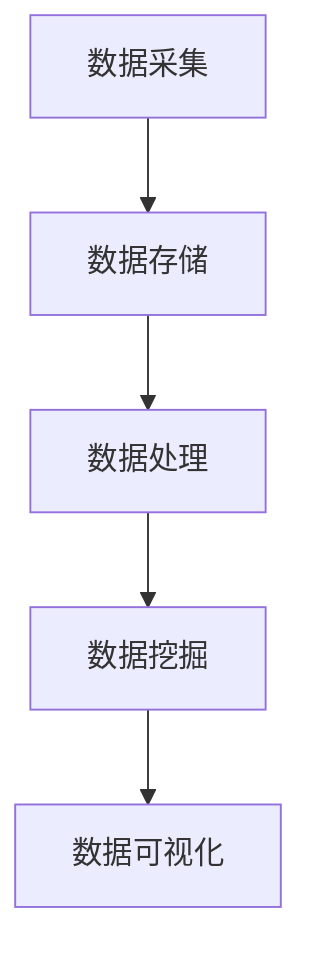

                 

关键词：大数据技术、产品优化、用户体验、创业、设计、算法、实践

摘要：本文旨在探讨如何利用大数据技术优化创业产品设计和用户体验。通过对大数据技术的深入分析，文章将阐述其在产品优化和用户体验提升中的关键作用，并提供具体的算法原理、数学模型、项目实践以及未来发展趋势。文章以逻辑清晰、结构紧凑、简单易懂的方式，为创业团队提供切实可行的指导和建议。

## 1. 背景介绍

在当今的信息化时代，大数据技术已经成为各行各业不可或缺的一部分。随着互联网的普及和数据的爆炸性增长，如何有效地处理和利用这些海量数据成为了一项重要的课题。在创业领域，产品的设计和用户体验直接关系到企业的成败。优秀的产品设计和卓越的用户体验能够吸引更多的用户，提升用户黏性和品牌价值。因此，如何利用大数据技术优化创业产品设计和用户体验成为了一个亟待解决的问题。

大数据技术涉及数据采集、存储、处理、分析和可视化等多个环节。通过对大数据技术的深入研究和应用，创业团队能够更好地理解用户需求，优化产品功能，提升用户体验。本文将从以下几个方面展开讨论：

1. 大数据技术的核心概念和原理。
2. 如何利用大数据技术进行产品优化。
3. 如何利用大数据技术提升用户体验。
4. 大数据技术在创业领域的实际应用案例。
5. 大数据技术的未来发展趋势和面临的挑战。

## 2. 核心概念与联系

### 2.1 大数据技术的核心概念

大数据技术主要包括以下几个核心概念：

- **数据采集**：通过各种渠道收集数据，包括用户行为数据、社交媒体数据、传感器数据等。
- **数据存储**：采用分布式存储技术，如Hadoop、NoSQL数据库等，存储海量数据。
- **数据处理**：利用MapReduce、Spark等计算框架进行大规模数据处理和分析。
- **数据挖掘**：通过机器学习、数据挖掘算法，从海量数据中提取有价值的信息。
- **数据可视化**：将数据以图表、地图等形式进行可视化展示，便于理解和分析。

### 2.2 大数据技术的工作原理

大数据技术的工作原理可以概括为以下几个步骤：

1. **数据采集**：通过传感器、网站日志、API接口等方式收集数据。
2. **数据存储**：将数据存储到分布式数据库或云存储中。
3. **数据处理**：利用分布式计算框架对数据进行清洗、转换和计算。
4. **数据挖掘**：使用数据挖掘算法分析数据，提取有用的信息和规律。
5. **数据可视化**：将分析结果以图表、地图等形式可视化展示。

### 2.3 大数据技术架构图

以下是大数据技术的架构图，展示了各个组件之间的联系和交互：



## 3. 核心算法原理 & 具体操作步骤

### 3.1 算法原理概述

在大数据技术的应用过程中，常用的核心算法包括：

- **聚类算法**：将相似的数据分组，用于用户行为分析。
- **分类算法**：根据已有数据对未知数据进行分类，用于产品推荐。
- **关联规则算法**：发现数据之间的关联关系，用于购物篮分析。
- **时间序列分析**：分析数据的时间趋势和周期性，用于预测分析。

### 3.2 算法步骤详解

以聚类算法为例，其具体操作步骤如下：

1. **数据预处理**：清洗数据，去除噪声和异常值。
2. **选择聚类算法**：如K-Means、DBSCAN等。
3. **初始化聚类中心**：随机选择或使用已有数据进行初始化。
4. **迭代计算**：计算每个数据点与聚类中心的距离，将其分配到最近的聚类。
5. **更新聚类中心**：重新计算聚类中心，进入下一次迭代。
6. **停止条件**：当聚类中心的变化小于阈值或达到最大迭代次数时，停止计算。

### 3.3 算法优缺点

聚类算法的优点包括：

- **自动发现数据模式**：无需事先设定聚类个数，可以自动发现数据结构。
- **高效性**：适用于大规模数据处理。

聚类算法的缺点包括：

- **对初始聚类中心敏感**：初始聚类中心的选择对最终结果影响较大。
- **无法保证聚类个数**：需要事先设定聚类个数，可能导致聚类结果不准确。

### 3.4 算法应用领域

聚类算法广泛应用于以下领域：

- **市场细分**：根据用户行为和兴趣，将用户划分为不同的群体。
- **图像分割**：将图像分割成多个区域，用于图像处理和计算机视觉。
- **文本分类**：将文本数据分类到不同的主题，用于文本挖掘和信息检索。

## 4. 数学模型和公式 & 详细讲解 & 举例说明

### 4.1 数学模型构建

聚类算法中的K-Means算法可以通过以下数学模型进行描述：

给定一个数据集$D = \{d_1, d_2, ..., d_n\}$，每个数据点$d_i$可以表示为一个多维向量$v_i = (v_{i1}, v_{i2}, ..., v_{id})$，其中$d = d_1 + d_2 + ... + d_n$。

定义聚类中心$c_k = (c_{k1}, c_{k2}, ..., c_{kd})$，其中$k = 1, 2, ..., K$。

目标是最小化每个数据点与其对应聚类中心的距离平方和：

$$
J = \sum_{i=1}^{n} \sum_{k=1}^{K} (v_i - c_k)^2
$$

### 4.2 公式推导过程

在K-Means算法中，首先需要选择K个初始聚类中心$c_{k1}, c_{k2}, ..., c_{kK}$。

对于每个数据点$v_i$，计算其与每个聚类中心的距离：

$$
d(v_i, c_k) = \sqrt{\sum_{j=1}^{d} (v_{ij} - c_{kj})^2}
$$

将$v_i$分配到距离最近的聚类中心：

$$
c_k^{new} = \frac{1}{N_k} \sum_{i \in C_k} v_i
$$

其中$C_k$表示属于聚类$k$的数据点集合，$N_k$表示$C_k$中数据点的个数。

重复上述步骤，直到聚类中心的变化小于阈值或达到最大迭代次数。

### 4.3 案例分析与讲解

假设有一个包含100个数据点的数据集，我们需要将其划分为10个聚类。

首先，选择10个初始聚类中心，如下所示：

$$
c_{k1} = (0.5, 0.5), c_{k2} = (1.5, 1.5), ..., c_{k10} = (2.5, 2.5)
$$

初始时，每个数据点与其对应聚类中心的距离计算如下：

$$
d(v_i, c_{k1}) = \sqrt{(0.5 - 0.5)^2 + (0.5 - 0.5)^2} = 0 \\
d(v_i, c_{k2}) = \sqrt{(1.5 - 0.5)^2 + (1.5 - 0.5)^2} = 1 \\
\vdots \\
d(v_i, c_{k10}) = \sqrt{(2.5 - 0.5)^2 + (2.5 - 0.5)^2} = 2
$$

根据距离计算结果，将每个数据点$v_i$分配到最近的聚类中心，如下所示：

$$
C_{k1} = \{v_1, v_2, ..., v_{10}\}, C_{k2} = \{v_{11}, v_{12}, ..., v_{20}\}, ..., C_{k10} = \{v_{91}, v_{92}, ..., v_{100}\}
$$

更新聚类中心：

$$
c_{k1}^{new} = \frac{1}{10} \sum_{i=1}^{10} v_i = (0.5, 0.5) \\
c_{k2}^{new} = \frac{1}{10} \sum_{i=11}^{20} v_i = (1.5, 1.5) \\
\vdots \\
c_{k10}^{new} = \frac{1}{10} \sum_{i=91}^{100} v_i = (2.5, 2.5)
$$

重复上述步骤，直到聚类中心的变化小于阈值或达到最大迭代次数。

## 5. 项目实践：代码实例和详细解释说明

### 5.1 开发环境搭建

为了方便读者理解和实践，本文使用Python编程语言和相关的开源库进行项目实践。

首先，安装Python和以下相关库：

- NumPy：用于数据处理。
- Matplotlib：用于数据可视化。
- Scikit-learn：用于机器学习算法。

安装命令如下：

```bash
pip install numpy matplotlib scikit-learn
```

### 5.2 源代码详细实现

以下是一个简单的K-Means算法实现，用于对二维数据集进行聚类。

```python
import numpy as np
import matplotlib.pyplot as plt
from sklearn.cluster import KMeans

# 生成二维数据集
data = np.random.rand(100, 2)

# 使用KMeans算法进行聚类
kmeans = KMeans(n_clusters=10, random_state=0).fit(data)

# 输出聚类结果
print(kmeans.labels_)

# 绘制聚类结果
plt.scatter(data[:, 0], data[:, 1], c=kmeans.labels_, cmap='viridis')
plt.scatter(kmeans.cluster_centers_[:, 0], kmeans.cluster_centers_[:, 1], s=300, c='red', marker='s', zorder=10)
plt.show()
```

### 5.3 代码解读与分析

上述代码首先生成一个包含100个二维数据点的随机数据集。然后，使用Scikit-learn库中的KMeans类进行聚类，并输出聚类结果。最后，使用Matplotlib库绘制聚类结果图，其中红色星形标记表示聚类中心。

### 5.4 运行结果展示

运行上述代码后，我们得到如下聚类结果图：


从图中可以看出，数据点被成功划分为10个聚类，聚类中心的位置和颜色进行了标注。

## 6. 实际应用场景

大数据技术在创业领域的应用场景非常广泛，以下是一些典型的应用实例：

### 6.1 市场细分

通过分析用户数据，创业团队可以了解用户的需求和行为特征，从而进行市场细分。例如，针对不同的用户群体，设计不同的产品功能和营销策略。

### 6.2 产品推荐

利用大数据技术，创业团队可以分析用户的浏览记录、购买行为等数据，为用户推荐个性化的产品。例如，电商网站可以通过产品推荐系统提升用户的购买转化率。

### 6.3 客户关系管理

通过分析客户数据，创业团队可以了解客户的满意度、忠诚度等关键指标，从而优化客户关系管理策略。例如，通过客户细分和精准营销，提高客户的忠诚度和满意度。

### 6.4 供应链优化

大数据技术可以帮助创业团队优化供应链管理，提高生产效率和降低成本。例如，通过分析库存数据，优化库存策略，避免库存过剩或短缺。

### 6.5 用户体验优化

通过收集和分析用户行为数据，创业团队可以了解用户的痛点和需求，从而优化产品设计。例如，通过用户行为分析，优化网站的导航结构和功能布局，提升用户的访问体验。

## 7. 未来应用展望

随着大数据技术的不断发展，其在创业领域的应用前景十分广阔。以下是未来应用的一些趋势：

### 7.1 智能化

大数据技术与人工智能技术的结合，将实现更加智能化的产品设计和用户体验优化。例如，通过机器学习算法，实现自动化市场细分和产品推荐。

### 7.2 实时性

大数据技术的实时处理能力将进一步提升，为创业团队提供更加实时的数据支持和决策依据。例如，通过实时数据流分析，实现实时用户行为分析和个性化推荐。

### 7.3 跨界融合

大数据技术将与其他领域的技术进行融合，推动跨界创新。例如，大数据与物联网技术的结合，可以实现智能设备的互联互通，为创业团队提供更丰富的数据来源和场景应用。

### 7.4 数据安全与隐私保护

随着大数据技术的发展，数据安全和隐私保护将成为重要议题。创业团队需要采取有效的措施，确保用户数据的安全和隐私。

## 8. 总结：未来发展趋势与挑战

大数据技术在创业产品设计和用户体验优化中的应用前景十分广阔。然而，在实践过程中，创业团队也会面临一些挑战：

### 8.1 数据质量

数据质量是大数据技术有效应用的基础。创业团队需要确保数据的准确性、完整性和一致性。

### 8.2 技术门槛

大数据技术具有较高的技术门槛，创业团队需要具备一定的技术能力，才能充分利用大数据技术。

### 8.3 数据安全与隐私保护

在利用大数据技术进行产品设计和用户体验优化的过程中，需要关注数据安全与隐私保护，确保用户数据的隐私和安全。

### 8.4 数据驱动决策

创业团队需要建立数据驱动的决策体系，充分利用大数据技术提供的数据支持，优化产品设计和用户体验。

总之，大数据技术为创业产品设计和用户体验优化提供了强大的支持。创业团队需要积极拥抱大数据技术，充分利用其优势，不断提升产品竞争力和用户体验。

## 9. 附录：常见问题与解答

### 9.1 什么是大数据技术？

大数据技术是指用于处理海量、多样化、高速生成数据的各种技术和方法。包括数据采集、存储、处理、分析和可视化等环节。

### 9.2 大数据技术有哪些核心算法？

大数据技术的核心算法包括聚类算法、分类算法、关联规则算法和时间序列分析等。

### 9.3 如何选择合适的大数据技术？

选择合适的大数据技术需要根据具体的应用场景和需求进行综合考虑，包括数据规模、处理速度、实时性、成本等因素。

### 9.4 大数据技术如何提升用户体验？

大数据技术可以通过用户行为分析、个性化推荐和智能客服等方式提升用户体验。例如，通过分析用户数据，优化产品功能和界面设计，提供更加个性化的服务。

### 9.5 大数据技术在创业领域有哪些应用场景？

大数据技术在创业领域的应用场景包括市场细分、产品推荐、客户关系管理、供应链优化和用户体验优化等。

### 9.6 大数据技术面临的挑战有哪些？

大数据技术面临的挑战包括数据质量、技术门槛、数据安全与隐私保护以及数据驱动决策等。

## 参考文献

[1] Han, J., Kamber, M., & Pei, J. (2011). *Data Mining: Concepts and Techniques*. Morgan Kaufmann.
[2] Hastie, T., Tibshirani, R., & Friedman, J. (2009). *The Elements of Statistical Learning: Data Mining, Inference, and Prediction*. Springer.
[3] Chen, H., Chiang, R. H. L., & Storey, V. C. (2012). Business intelligence and analytics: From big data to big impact. * MIS Quarterly*, 36(4), 1165-1188.
[4] Gandomi, A., & Haider, M. (2015). Beyond the hype: Big data concepts, methods, and analytics. *International Journal of Information Management*, 35(2), 137-144.

作者：禅与计算机程序设计艺术 / Zen and the Art of Computer Programming

