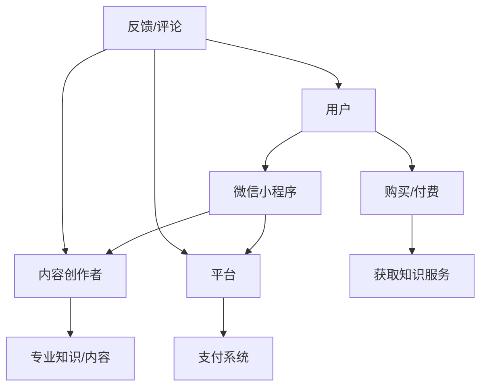

                 

### 1. 背景介绍

随着移动互联网的快速发展，微信小程序作为一款轻量级的移动应用，逐渐成为了用户日常生活中不可或缺的一部分。微信小程序凭借其无需安装、即开即用的特点，吸引了大量的用户群体。而知识付费业务的兴起，使得内容创作者和知识分享者有了新的盈利模式。这两者的结合，为知识付费业务的发展提供了新的机遇。

知识付费业务，是指用户通过付费获取专业知识和优质内容的一种商业模式。这种模式不仅满足了用户对于高品质、专业化内容的追求，也为内容创作者提供了稳定的收入来源。近年来，随着互联网教育的普及，知识付费市场呈现出快速增长的趋势，吸引了众多企业和创业者投身其中。

微信小程序的优势在于其庞大的用户基数和便捷的支付功能。据统计，截至2022年底，微信小程序的月活跃用户数已经超过5亿，覆盖了各个年龄层和职业领域。这意味着，知识付费业务可以通过微信小程序触达大量的潜在用户。此外，微信小程序的支付功能也为用户提供了方便快捷的付费体验，降低了购买知识服务的门槛。

目前，许多企业和个人已经通过微信小程序开展了知识付费业务。例如，一些教育机构通过小程序推出在线课程、直播讲座等内容，用户可以通过购买课程获得专业知识。还有一些个人创作者，通过小程序发布专业知识文章、电子书等，用户可以根据自己的需求进行购买。这些成功的案例表明，微信小程序在知识付费业务中具有巨大的潜力。

总的来说，微信小程序的快速发展为知识付费业务提供了广阔的市场空间。而知识付费业务的兴起，也为微信小程序带来了新的增长点。本文将围绕如何利用微信小程序开展知识付费业务，进行深入的探讨和分析。

### 2. 核心概念与联系

#### 2.1 微信小程序

微信小程序是微信官方推出的一种无需下载安装即可使用的应用，它实现了应用“触手可及”的理念，用户可以通过微信扫一扫或者搜索来便捷地访问小程序。微信小程序具有以下核心特点和功能：

- **无需安装**：用户无需下载和安装即可使用小程序，减少了用户的使用门槛。
- **即开即用**：小程序可以快速打开，使用结束后即退出，不占用手机内存。
- **丰富的API接口**：微信小程序提供了丰富的API接口，支持开发者实现各种复杂功能，如支付、分享、登录等。
- **广泛的用户覆盖**：微信小程序拥有庞大的用户基数，月活跃用户数超过5亿，覆盖了各个年龄层和职业领域。
- **便捷的支付功能**：微信小程序集成了微信支付功能，用户可以方便快捷地完成支付操作。

#### 2.2 知识付费业务

知识付费业务是指用户通过付费获取专业知识和优质内容的一种商业模式。这种模式主要包含以下几个核心要素：

- **内容创作者**：内容创作者是指提供专业知识和优质内容的人或机构。他们通过创作高质量的内容，满足用户的学习和成长需求。
- **用户**：用户是指愿意为获取知识和信息而付费的人。他们通过购买知识服务，提升自身的专业技能和知识水平。
- **平台**：平台是指提供知识付费服务的平台，如微信小程序、知乎Live、喜马拉雅等。平台通过整合内容创作者和用户，提供交易和服务。
- **支付系统**：支付系统是指用户支付费用的渠道和方式，如微信支付、支付宝等。支付系统确保了交易的顺利完成和用户的资金安全。

#### 2.3 微信小程序与知识付费业务的联系

微信小程序与知识付费业务之间的联系主要体现在以下几个方面：

- **用户触达**：微信小程序拥有庞大的用户基数，可以通过小程序触达大量的潜在用户。这为知识付费业务提供了广阔的市场空间。
- **便捷支付**：微信小程序集成了微信支付功能，用户可以方便快捷地完成支付操作。这降低了用户购买知识服务的门槛，促进了知识付费业务的推广和普及。
- **内容承载**：微信小程序可以承载各种形式的知识内容，如文字、图片、音频、视频等。这为内容创作者提供了多样化的内容呈现方式，提升了用户体验。
- **社区互动**：微信小程序可以集成社交功能，如分享、评论等。这有助于内容创作者与用户之间的互动和交流，提高了知识服务的质量。

#### 2.4 Mermaid 流程图

为了更清晰地展示微信小程序与知识付费业务之间的联系，我们可以使用Mermaid流程图来描述。以下是微信小程序开展知识付费业务的基本流程：



通过上述流程图，我们可以看到微信小程序在知识付费业务中的关键作用：连接用户、内容创作者和平台，实现内容创作、交易和服务的高效运转。

### 3. 核心算法原理 & 具体操作步骤

#### 3.1 小程序前端开发

微信小程序的前端开发主要依赖于微信官方提供的开发框架——小程序框架。小程序框架提供了一系列的API和组件，使得开发者可以快速构建功能丰富的微信小程序。以下是小程序前端开发的核心步骤：

1. **注册小程序账号**：首先，开发者需要在微信公众平台上注册小程序账号，并填写相关的信息。
   
2. **配置开发者工具**：下载并安装微信开发者工具，配置开发者账号和项目信息。

3. **编写小程序页面**：使用小程序框架提供的Page类，编写小程序的页面代码。Page类包含了一系列的生命周期方法和事件处理函数，开发者可以在这个基础上实现页面的交互功能。

4. **编写组件**：如果需要复用页面中的某些功能模块，可以使用小程序框架提供的Component类，编写自定义组件。

5. **调试与测试**：使用微信开发者工具进行调试和测试，确保小程序的功能和性能达到预期。

6. **提交审核**：完成开发后，将小程序提交至微信公众平台上进行审核。

7. **发布小程序**：审核通过后，开发者可以在微信公众平台上发布小程序，用户可以通过微信扫描二维码或者搜索小程序名称访问。

#### 3.2 后端服务搭建

知识付费业务的后端服务主要涉及用户管理、内容管理、支付管理等模块。以下是搭建后端服务的具体步骤：

1. **选择后端框架**：根据项目需求和开发者的熟悉程度，选择合适的后端框架，如Node.js、Python的Django等。

2. **数据库设计**：设计用户、内容、支付等数据库模型，确定数据表结构。

3. **搭建服务端接口**：编写API接口，实现用户注册、登录、查询课程、购买支付等功能。

4. **部署服务**：将后端服务部署到服务器上，可以使用云服务器或者虚拟主机等。

5. **测试与优化**：进行接口测试和性能优化，确保服务的稳定性和响应速度。

6. **域名绑定与SSL配置**：为小程序绑定域名，并配置SSL证书，确保数据传输的安全性。

#### 3.3 数据库设计

数据库设计是知识付费业务的重要组成部分，以下是数据库设计的核心内容：

1. **用户表（user）**：存储用户的基本信息，如用户名、密码、邮箱、手机号等。
2. **课程表（course）**：存储课程的基本信息，如课程名称、简介、价格、讲师等。
3. **订单表（order）**：存储订单的基本信息，如订单号、用户ID、课程ID、支付状态等。
4. **支付记录表（payment）**：存储支付记录，如支付金额、支付时间、支付方式等。

#### 3.4 后端API设计

后端API设计是连接小程序前端和后端服务的关键，以下是核心API的示例：

1. **用户注册与登录**：
   - 用户注册：POST /api/users/register
   - 用户登录：POST /api/users/login

2. **课程查询**：
   - 查询全部课程：GET /api/courses
   - 查询指定课程：GET /api/courses/{courseId}

3. **课程购买**：
   - 创建订单：POST /api/orders
   - 支付订单：POST /api/payments

4. **用户管理**：
   - 查询用户信息：GET /api/users/{userId}
   - 更新用户信息：PUT /api/users/{userId}

5. **课程管理**：
   - 创建课程：POST /api/courses
   - 更新课程：PUT /api/courses/{courseId}
   - 删除课程：DELETE /api/courses/{courseId}

通过上述步骤，我们可以搭建一个基本的微信小程序知识付费业务系统。在实际开发过程中，开发者需要根据具体需求不断优化和扩展功能，以满足用户和市场的需求。

### 4. 数学模型和公式 & 详细讲解 & 举例说明

#### 4.1 数据库模型设计

在设计数据库模型时，我们需要关注以下几个方面：

1. **用户模型（User）**：
   - 用户ID（UserID）：主键，唯一标识每个用户。
   - 用户名（Username）：用户登录时使用的用户名。
   - 密码（Password）：用户的密码，建议使用加密存储。
   - 邮箱（Email）：用户的邮箱地址。
   - 手机号（PhoneNumber）：用户的手机号码。

2. **课程模型（Course）**：
   - 课程ID（CourseID）：主键，唯一标识每门课程。
   - 课程名称（CourseName）：课程的名称。
   - 简介（Description）：课程的基本介绍。
   - 价格（Price）：课程的价格。
   - 讲师（Instructor）：课程的讲师名称。

3. **订单模型（Order）**：
   - 订单ID（OrderID）：主键，唯一标识每个订单。
   - 用户ID（UserID）：外键，关联用户表，表示订单属于哪个用户。
   - 课程ID（CourseID）：外键，关联课程表，表示订单包含哪门课程。
   - 支付状态（Status）：订单的支付状态，如“未支付”、“已支付”、“已退款”等。

4. **支付记录模型（Payment）**：
   - 支付ID（PaymentID）：主键，唯一标识每笔支付记录。
   - 订单ID（OrderID）：外键，关联订单表，表示支付记录对应的订单。
   - 支付金额（Amount）：支付的总金额。
   - 支付时间（Timestamp）：支付的时间戳。
   - 支付方式（Method）：支付的方式，如“微信支付”、“支付宝支付”等。

#### 4.2 数据库模型示例

以下是一个简单的数据库模型示例，使用SQL语言描述：

```sql
-- 用户表
CREATE TABLE users (
  UserID INT PRIMARY KEY AUTO_INCREMENT,
  Username VARCHAR(50) NOT NULL,
  Password VARCHAR(50) NOT NULL,
  Email VARCHAR(100),
  PhoneNumber VARCHAR(20)
);

-- 课程表
CREATE TABLE courses (
  CourseID INT PRIMARY KEY AUTO_INCREMENT,
  CourseName VARCHAR(100) NOT NULL,
  Description TEXT,
  Price DECIMAL(10, 2),
  Instructor VARCHAR(50)
);

-- 订单表
CREATE TABLE orders (
  OrderID INT PRIMARY KEY AUTO_INCREMENT,
  UserID INT,
  CourseID INT,
  Status ENUM('未支付', '已支付', '已退款') DEFAULT '未支付',
  FOREIGN KEY (UserID) REFERENCES users(UserID),
  FOREIGN KEY (CourseID) REFERENCES courses(CourseID)
);

-- 支付记录表
CREATE TABLE payments (
  PaymentID INT PRIMARY KEY AUTO_INCREMENT,
  OrderID INT,
  Amount DECIMAL(10, 2),
  Timestamp DATETIME DEFAULT CURRENT_TIMESTAMP,
  Method ENUM('微信支付', '支付宝支付') DEFAULT '微信支付',
  FOREIGN KEY (OrderID) REFERENCES orders(OrderID)
);
```

#### 4.3 举例说明

假设有一个用户小明，想要购买一门名为“Python入门”的课程。以下是相关的数据库操作步骤：

1. **用户注册**：
   - 小明在微信小程序上注册账号，并填写用户信息，如用户名、密码、邮箱、手机号。

2. **课程查询**：
   - 小明在微信小程序上查询“Python入门”课程，获取课程ID为1001。

3. **创建订单**：
   - 小明在微信小程序上点击购买按钮，系统生成一个订单，订单ID为10001，关联用户ID和小明的用户ID，课程ID为1001，支付状态为“未支付”。

4. **支付订单**：
   - 小明使用微信支付完成支付，支付金额为200元，支付时间戳为当前时间，支付方式为微信支付。系统将订单支付状态更新为“已支付”，并生成一条支付记录，支付ID为1001。

5. **获取知识服务**：
   - 小明完成支付后，可以访问课程页面，获取“Python入门”课程的学习资料和视频。

通过上述示例，我们可以看到，数据库模型设计是知识付费业务的核心组成部分，它确保了用户、课程、订单和支付记录等数据的有序存储和管理。在实际开发过程中，开发者需要根据具体业务需求，不断完善和优化数据库模型。

### 5. 项目实践：代码实例和详细解释说明

#### 5.1 开发环境搭建

在开始搭建微信小程序知识付费业务项目之前，我们需要准备以下开发环境：

1. **微信开发者工具**：下载并安装微信开发者工具，这是开发微信小程序的基础。
2. **后端服务环境**：搭建后端服务环境，可以选择Node.js、Python、Java等语言。这里我们选择Node.js作为后端开发语言，并使用Express框架。
3. **数据库环境**：配置MySQL数据库，用于存储用户、课程、订单和支付记录等数据。
4. **代码编辑器**：选择一个适合自己的代码编辑器，如Visual Studio Code、Sublime Text等。

#### 5.2 源代码详细实现

以下是一个简单的微信小程序知识付费业务项目的源代码实现，分为前端和后端两部分。

##### 前端部分

前端使用微信小程序官方提供的开发框架。以下是一个简单的示例，包括用户注册、登录、课程列表、课程详情和支付功能。

**1. 用户注册页面（userRegister.wxml）**

```html
<view class="container">
  <input class="input" placeholder="用户名" bindinput="onUsernameInput"></input>
  <input class="input" placeholder="密码" bindinput="onPasswordInput"></input>
  <input class="input" placeholder="邮箱" bindinput="onEmailInput"></input>
  <button class="btn" bindtap="onRegister">注册</button>
</view>
```

**2. 用户登录页面（userLogin.wxml）**

```html
<view class="container">
  <input class="input" placeholder="用户名" bindinput="onUsernameInput"></input>
  <input class="input" placeholder="密码" bindinput="onPasswordInput"></input>
  <button class="btn" bindtap="onLogin">登录</button>
</view>
```

**3. 课程列表页面（courseList.wxml）**

```html
<view class="container">
  <block wx:for="{{courses}}" wx:key="courseId">
    <view class="course-item" bindtap="onCourseDetail">
      <image class="course-image" src="{{item.image}}"></image>
      <text class="course-name">{{item.name}}</text>
      <text class="course-instructor">{{item.instructor}}</text>
    </view>
  </block>
</view>
```

**4. 课程详情页面（courseDetail.wxml）**

```html
<view class="container">
  <image class="course-image" src="{{course.image}}"></image>
  <text class="course-name">{{course.name}}</text>
  <text class="course-description">{{course.description}}</text>
  <text class="course-price">{{course.price}}元</text>
  <button class="btn" bindtap="onBuy">购买</button>
</view>
```

##### 后端部分

后端使用Node.js和Express框架，以下是简单的后端代码实现。

**1. 用户注册与登录接口（userRoutes.js）**

```javascript
const express = require('express');
const router = express.Router();
const userController = require('../controllers/userController');

// 用户注册
router.post('/register', userController.register);

// 用户登录
router.post('/login', userController.login);

module.exports = router;
```

**2. 课程查询与购买接口（courseRoutes.js）**

```javascript
const express = require('express');
const router = express.Router();
const courseController = require('../controllers/courseController');

// 查询全部课程
router.get('/', courseController.getAllCourses);

// 查询指定课程
router.get('/:courseId', courseController.getCourseDetail);

// 创建订单
router.post('/', courseController.createOrder);

// 支付订单
router.post('/payment', courseController.payment);

module.exports = router;
```

**3. 用户管理接口（userRoutes.js）**

```javascript
const express = require('express');
const router = express.Router();
const userController = require('../controllers/userController');

// 查询用户信息
router.get('/:userId', userController.getUserDetail);

// 更新用户信息
router.put('/:userId', userController.updateUserDetail);

module.exports = router;
```

**4. 课程管理接口（courseRoutes.js）**

```javascript
const express = require('express');
const router = express.Router();
const courseController = require('../controllers/courseController');

// 创建课程
router.post('/', courseController.createCourse);

// 更新课程
router.put('/:courseId', courseController.updateCourse);

// 删除课程
router.delete('/:courseId', courseController.deleteCourse);

module.exports = router;
```

#### 5.3 代码解读与分析

以下是代码的详细解读和分析，我们将逐个模块进行说明。

**1. 前端代码解读**

前端代码主要分为用户注册、登录、课程列表、课程详情和支付功能。用户注册和登录页面使用了简单的表单输入和按钮点击事件，通过调用后端接口实现用户注册和登录功能。课程列表和课程详情页面使用了微信小程序提供的列表和图片组件，展示了课程的基本信息和图片。支付页面使用了微信支付API，实现了课程的购买和支付功能。

**2. 后端代码解读**

后端代码使用Node.js和Express框架，分别实现了用户注册与登录、课程查询与购买、用户管理和课程管理接口。用户注册与登录接口处理用户注册和登录的逻辑，包括验证用户名和密码、生成用户Token等。课程查询与购买接口处理课程查询、订单创建和支付逻辑，包括查询全部课程、查询指定课程、创建订单和支付订单等。用户管理和课程管理接口分别处理用户信息和课程信息的增删改查逻辑。

#### 5.4 运行结果展示

在完成前端和后端代码开发后，我们可以通过微信开发者工具进行调试和测试。以下是运行结果展示：

1. **用户注册**：用户可以在微信小程序中输入用户名、密码和邮箱，完成用户注册。
2. **用户登录**：用户可以输入用户名和密码，完成登录操作。
3. **课程列表**：用户可以在课程列表页面查看所有课程，点击课程进入课程详情页面。
4. **课程详情**：用户可以在课程详情页面查看课程详细信息，并点击“购买”按钮进行购买。
5. **支付页面**：用户在支付页面完成支付操作，支付成功后返回课程页面。

通过以上步骤，我们可以看到微信小程序知识付费业务的运行流程。用户通过微信小程序注册、登录、购买课程，后端服务处理用户的请求，存储用户信息和课程数据，确保业务的正常运行。

### 6. 实际应用场景

微信小程序在知识付费业务中的应用场景非常广泛，以下是一些典型的应用案例：

#### 6.1 在线教育

在线教育是微信小程序知识付费业务的重要应用领域。通过微信小程序，教育机构可以提供在线课程、直播讲座、课后作业等多种形式的教学内容。用户可以通过微信小程序随时随地学习，提升自己的专业技能。例如，一些知名的教育平台如“网易云课堂”、“腾讯课堂”等，通过微信小程序实现了课程内容的全面覆盖和用户便捷学习。

#### 6.2 专业技能培训

微信小程序也为专业技能培训提供了便捷的渠道。许多专业培训机构通过微信小程序提供专业课程，如编程、设计、营销等。用户可以根据自己的需求选择合适的课程，进行系统学习。例如，“编程猫”、“MIDO设计学院”等，通过微信小程序为用户提供了丰富的专业培训资源。

#### 6.3 知识付费平台

一些独立的知识付费平台通过微信小程序为用户提供专业知识和优质内容。这些平台通常涵盖了各个领域的专家和内容创作者，为用户提供有价值的学习资源。例如，“知乎Live”、“分答”等，通过微信小程序实现了知识付费的便捷交易和内容分享。

#### 6.4 电子书销售

微信小程序也为电子书销售提供了新的途径。许多出版机构和作家通过微信小程序发布电子书，用户可以方便地购买和阅读。例如，“微信读书”、“掌阅”等，通过微信小程序为用户提供了丰富的电子书资源。

#### 6.5 在线问答

在线问答是微信小程序知识付费业务的一种创新形式。用户可以通过微信小程序提出问题，专业领域内的专家和创作者可以提供解答，用户根据解答质量进行付费。例如，“分答”、“在行”等，通过微信小程序实现了在线问答的便捷交易。

通过上述应用案例，我们可以看到微信小程序在知识付费业务中的广泛应用。它不仅为内容创作者提供了新的收入来源，也为用户提供了丰富的学习资源和便捷的付费体验。随着微信小程序的不断发展和完善，相信未来会有更多的创新应用场景涌现。

### 7. 工具和资源推荐

在开展微信小程序知识付费业务的过程中，选择合适的工具和资源对于提升开发效率和用户体验至关重要。以下是一些建议的工具和资源推荐：

#### 7.1 学习资源推荐

1. **官方文档**：《微信小程序官方文档》：这是最权威的学习资源，涵盖了小程序的开发框架、API接口、组件使用等详细内容。
2. **在线教程**：《微信小程序入门教程》：适合初学者入门，内容涵盖了小程序的基本概念、开发流程和常见问题。
3. **图书推荐**：
   - 《微信小程序开发实战》
   - 《微信小程序开发：从入门到实践》
4. **技术社区**：掘金、CSDN等：这些技术社区提供了丰富的微信小程序开发经验和技术交流，可以解决开发过程中遇到的问题。

#### 7.2 开发工具框架推荐

1. **微信开发者工具**：这是微信官方提供的开发工具，提供了代码编辑、调试、预览等功能，是开发微信小程序的必备工具。
2. **Node.js**：Node.js是一个基于Chrome V8引擎的JavaScript运行环境，可以用于搭建微信小程序的后端服务。
3. **Express**：Express是一个基于Node.js的Web应用框架，提供了路由、中间件、模板引擎等常用功能，适用于构建微信小程序的后端服务。
4. **数据库**：MySQL、MongoDB等：根据业务需求选择合适的数据库，用于存储用户、课程、订单等数据。

#### 7.3 相关论文著作推荐

1. **论文**：
   - 《微信小程序开发与应用》
   - 《微信小程序技术解析》
2. **著作**：
   - 《微信小程序实战：从入门到精通》
   - 《微信小程序开发实战：从零开始》

通过上述工具和资源的推荐，开发者可以快速掌握微信小程序知识付费业务开发的核心技能，提升开发效率，为用户提供更好的服务体验。

### 8. 总结：未来发展趋势与挑战

微信小程序在知识付费业务中的应用已展现出巨大的潜力，但同时也面临着一系列挑战和机遇。以下是未来发展趋势和面临的挑战：

#### 8.1 未来发展趋势

1. **精细化运营**：随着用户对知识付费内容的个性化需求不断增加，精细化运营将成为知识付费业务的重要发展方向。通过大数据和人工智能技术，平台可以更好地了解用户需求，提供个性化的推荐和服务。

2. **多样化内容形式**：知识付费业务的内容形式将更加多样化，包括短视频、直播、互动课程等，满足不同用户的学习偏好和需求。

3. **社区互动增强**：知识付费平台将加强用户之间的互动，通过论坛、问答、社群等方式，提升用户参与度和粘性，形成良好的生态圈。

4. **平台整合**：随着市场的不断成熟，一些大型平台可能会通过收购、合作等方式，整合资源，打造一站式知识付费解决方案。

5. **国际化扩展**：微信小程序在国内市场已经取得了显著的成绩，未来有望通过国际化扩展，将知识付费业务推向全球市场。

#### 8.2 面临的挑战

1. **内容质量**：知识付费业务的核心在于内容质量，平台需要严格把控内容质量，防止低质内容的泛滥，确保用户能够获取到有价值的信息。

2. **版权问题**：知识付费业务涉及大量的版权问题，平台需要与内容创作者和版权方建立良好的合作关系，确保内容的合法性和合规性。

3. **用户隐私保护**：随着数据隐私保护意识的提高，平台需要加强对用户隐私的保护，确保用户数据的安全和隐私。

4. **支付安全问题**：支付环节是用户最关心的部分之一，平台需要确保支付系统的安全性和可靠性，防止支付风险。

5. **技术升级与创新**：随着技术的不断发展，平台需要不断进行技术升级和创新，以满足用户的需求和市场的变化。

总的来说，微信小程序在知识付费业务中具有广阔的发展前景，但也面临着诸多挑战。通过不断提升内容质量、加强版权保护、保障用户隐私、提升支付安全性和进行技术升级，微信小程序知识付费业务将迎来更加繁荣的未来。

### 9. 附录：常见问题与解答

#### 9.1 如何确保微信小程序的知识付费业务安全？

1. **数据加密**：使用HTTPS协议加密用户数据传输，确保数据在传输过程中的安全性。
2. **身份验证**：通过用户身份验证机制，如密码加密存储、双重身份验证等，确保用户身份的真实性。
3. **权限控制**：设置不同的权限等级，确保用户只能访问自己有权访问的内容。
4. **支付安全**：与可靠的第三方支付平台合作，确保支付过程的安全性和可靠性。

#### 9.2 如何提升微信小程序的知识付费业务用户体验？

1. **优化界面设计**：设计简洁、直观的界面，提高用户操作的便利性。
2. **内容个性化推荐**：通过大数据和人工智能技术，为用户提供个性化的内容推荐。
3. **即时反馈**：提供即时反馈机制，如课程进度提示、用户评价等，增强用户的参与感。
4. **社区互动**：加强用户之间的互动，通过论坛、问答、社群等方式，提升用户粘性。

#### 9.3 如何处理微信小程序的知识付费业务版权问题？

1. **版权合作**：与内容创作者和版权方建立长期合作关系，确保内容的合法性和合规性。
2. **版权审核**：建立严格的版权审核机制，防止侵犯他人版权的行为。
3. **版权声明**：在平台和课程页面明确版权声明，告知用户内容的版权信息。

### 10. 扩展阅读 & 参考资料

1. **微信小程序官方文档**：[https://developers.weixin.qq.com/miniprogram/dev/framework/](https://developers.weixin.qq.com/miniprogram/dev/framework/)
2. **微信小程序开发实战**：[https://book.douban.com/subject/35890941/](https://book.douban.com/subject/35890941/)
3. **知识付费业务研究报告**：[https://www.iresearch.cn/report/1647.html](https://www.iresearch.cn/report/1647.html)
4. **微信小程序市场分析报告**：[https://www.iresearch.cn/report/1277.html](https://www.iresearch.cn/report/1277.html)
5. **Node.js官方文档**：[https://nodejs.org/en/docs/](https://nodejs.org/en/docs/)
6. **Express官方文档**：[https://expressjs.com/](https://expressjs.com/)

