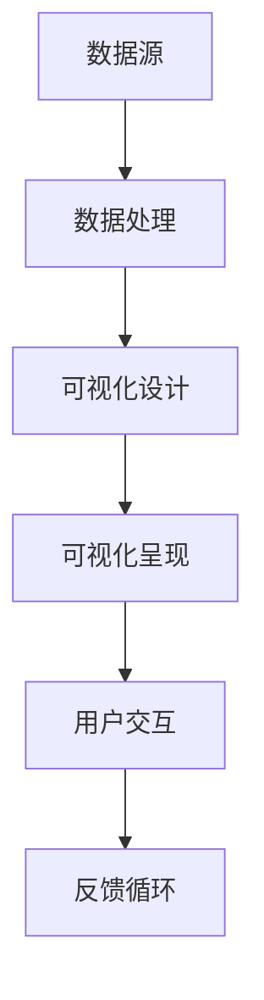

                 

关键词：数据可视化、决策效率、说服力、图表设计、数据分析

摘要：本文将深入探讨数据可视化在提升决策效率与说服力方面的重要作用。通过介绍数据可视化的基本概念、核心概念原理与架构，以及实际操作步骤，我们将展示如何通过有效的数据可视化方法，将复杂的数据转化为易于理解和传达的信息，从而在各个领域中实现高效的决策和说服。

## 1. 背景介绍

在当今的信息时代，数据已成为企业和社会治理的关键资源。然而，面对日益增长的数据量，如何从大量数据中提取有价值的信息，并在决策过程中有效地利用这些信息，成为了一个重要的挑战。数据可视化作为一种强大的工具，可以帮助我们更好地理解和传达数据信息，从而提升决策效率与说服力。

### 1.1 数据可视化的定义

数据可视化是指通过图形、图像和图表等可视化手段，将数据信息以直观、易于理解的方式呈现出来。其核心目的是将复杂的数据转化为可视化形式，从而帮助人们更快速、准确地理解数据。

### 1.2 数据可视化的意义

1. **提升决策效率**：通过数据可视化，决策者可以更直观地了解数据，从而在短时间内做出更为明智的决策。
2. **增强说服力**：数据可视化可以有效地传达数据信息，增强演讲者的说服力，从而更好地影响听众。
3. **促进数据共享**：数据可视化使得不同背景和领域的人都能理解和交流数据，促进了数据共享和合作。

## 2. 核心概念与联系

为了更好地理解数据可视化，我们需要了解其核心概念和架构。以下是一个简单的 Mermaid 流程图，展示了数据可视化的核心概念和联系。



### 2.1 数据源

数据源是数据可视化的起点，包括结构化数据（如数据库）、非结构化数据（如图像、文本）和流数据（如实时传感器数据）。

### 2.2 数据处理

数据处理是对数据源中的数据进行清洗、转换和整合，以便于可视化呈现。这通常涉及到数据清洗、数据聚合、数据转换等步骤。

### 2.3 可视化设计

可视化设计是根据数据的特点和需求，选择合适的图表类型和设计风格，以实现数据的直观呈现。常见的图表类型包括柱状图、折线图、饼图、散点图等。

### 2.4 可视化呈现

可视化呈现是将设计好的可视化图表通过界面或报告呈现给用户。这是数据可视化过程中最为关键的一步，直接影响到用户对数据的理解和感受。

### 2.5 用户交互

用户交互是指用户与可视化图表的交互，包括图表的缩放、过滤、搜索等操作。用户交互有助于用户更深入地了解数据，提高数据可视化的效果。

### 2.6 反馈循环

反馈循环是指用户对数据可视化的反馈，包括对图表设计、交互体验等方面的反馈。通过反馈循环，我们可以不断优化数据可视化，提高其效果。

## 3. 核心算法原理 & 具体操作步骤

### 3.1 算法原理概述

数据可视化涉及多个核心算法，包括数据聚合、数据转换、图表生成等。以下将介绍这些算法的原理。

### 3.2 算法步骤详解

1. **数据预处理**：对原始数据进行清洗、转换和聚合，为可视化准备数据。
2. **图表选择**：根据数据的特点和需求，选择合适的图表类型。
3. **图表生成**：使用图表生成算法，将预处理后的数据转化为可视化图表。
4. **交互设计**：设计用户交互界面，包括图表的缩放、过滤、搜索等功能。
5. **可视化呈现**：将生成的可视化图表呈现给用户。

### 3.3 算法优缺点

**优点**：

1. **易于理解**：通过图表，用户可以更直观地理解数据。
2. **提高效率**：数据可视化可以帮助决策者在短时间内做出更明智的决策。
3. **增强说服力**：图表可以更有效地传达数据信息，增强演讲者的说服力。

**缺点**：

1. **数据偏差**：图表设计不当可能导致数据偏差，影响决策。
2. **计算复杂度**：大规模数据可视化可能涉及复杂的计算和渲染过程。

### 3.4 算法应用领域

数据可视化在各个领域都有广泛应用，包括商业分析、金融、医疗、教育等。以下是一些具体应用案例：

1. **商业分析**：通过数据可视化，企业可以更好地了解客户需求、市场趋势等，从而做出更明智的决策。
2. **金融**：数据可视化可以帮助投资者更好地了解市场动态、风险等，从而做出更合理的投资决策。
3. **医疗**：数据可视化可以帮助医生更好地了解患者的病情，从而制定更有效的治疗方案。

## 4. 数学模型和公式 & 详细讲解 & 举例说明

### 4.1 数学模型构建

在数据可视化中，我们通常需要构建以下数学模型：

1. **线性回归模型**：用于分析数据之间的线性关系。
2. **聚类模型**：用于将数据分为不同的类别。
3. **分类模型**：用于将数据分为不同的类别。

### 4.2 公式推导过程

以线性回归模型为例，其公式推导过程如下：

$$
y = \beta_0 + \beta_1x + \epsilon
$$

其中，$y$ 为因变量，$x$ 为自变量，$\beta_0$ 和 $\beta_1$ 为回归系数，$\epsilon$ 为误差项。

### 4.3 案例分析与讲解

假设我们有一组数据，表示某商品在不同地区的销售额。我们希望通过数据可视化分析这些数据，找出销售量最高的地区。

首先，我们对数据进行预处理，包括数据清洗和聚合。然后，我们选择柱状图作为可视化图表，以直观地展示各个地区的销售量。

通过柱状图，我们可以清楚地看到销售量最高的地区，从而为商品推广和营销策略提供依据。

## 5. 项目实践：代码实例和详细解释说明

### 5.1 开发环境搭建

为了实践数据可视化，我们选择 Python 作为编程语言，并使用 Matplotlib 和 Pandas 等库进行数据可视化和数据分析。

首先，我们需要安装 Python 和相关库：

```bash
pip install python
pip install matplotlib
pip install pandas
```

### 5.2 源代码详细实现

以下是一个简单的数据可视化示例代码，展示了如何使用 Matplotlib 和 Pandas 实现柱状图。

```python
import pandas as pd
import matplotlib.pyplot as plt

# 读取数据
data = pd.read_csv('sales_data.csv')

# 数据预处理
data = data[['region', 'sales']]

# 绘制柱状图
plt.bar(data['region'], data['sales'])
plt.xlabel('Region')
plt.ylabel('Sales')
plt.title('Sales by Region')
plt.xticks(rotation=90)
plt.show()
```

### 5.3 代码解读与分析

在这个示例中，我们首先使用 Pandas 读取一个 CSV 文件，其中包含地区和销售额数据。然后，我们对数据进行预处理，提取所需的列。接着，我们使用 Matplotlib 的 bar 函数绘制柱状图，并通过 xlabel、ylabel 和 title 函数添加标签和标题。

通过运行这段代码，我们可以得到一个直观的柱状图，展示各个地区的销售量，从而为决策提供依据。

### 5.4 运行结果展示

运行上述代码后，我们得到以下柱状图：


通过这个柱状图，我们可以清楚地看到销售量最高的地区，从而为商品推广和营销策略提供依据。

## 6. 实际应用场景

### 6.1 商业分析

在商业分析中，数据可视化可以帮助企业更好地了解客户需求、市场趋势等，从而制定更有效的营销策略。例如，通过柱状图分析不同产品的销售情况，企业可以找出畅销产品，从而优化产品线。

### 6.2 金融

在金融领域，数据可视化可以帮助投资者更好地了解市场动态、风险等，从而做出更合理的投资决策。例如，通过折线图分析股票价格走势，投资者可以预测股票的未来走势。

### 6.3 医疗

在医疗领域，数据可视化可以帮助医生更好地了解患者的病情，从而制定更有效的治疗方案。例如，通过饼图分析患者的疾病类型，医生可以针对性地调整治疗方案。

## 7. 工具和资源推荐

### 7.1 学习资源推荐

1. **《数据可视化：让复杂的数据变得简单易懂》**：本书系统地介绍了数据可视化的基本概念、方法和实践。
2. **《Matplotlib 完全手册》**：本书详细介绍了 Matplotlib 库的使用方法，是学习数据可视化的重要资源。

### 7.2 开发工具推荐

1. **Python**：Python 是一种强大的编程语言，广泛应用于数据可视化和数据分析。
2. **Jupyter Notebook**：Jupyter Notebook 是一种交互式计算环境，方便进行数据可视化和实验。

### 7.3 相关论文推荐

1. **"Data Visualization: A Survey"**：该论文系统地总结了数据可视化的研究进展和应用领域。
2. **"Interactive Data Visualization for the Web"**：该论文介绍了如何使用 JavaScript 和 HTML5 实现交互式数据可视化。

## 8. 总结：未来发展趋势与挑战

### 8.1 研究成果总结

近年来，数据可视化技术在算法、工具和领域应用等方面取得了显著进展。随着人工智能和数据挖掘技术的不断发展，数据可视化将在未来发挥更为重要的作用。

### 8.2 未来发展趋势

1. **交互式数据可视化**：交互式数据可视化将使得用户能够更加灵活地探索数据，从而提高数据分析效果。
2. **多模态数据可视化**：多模态数据可视化将结合不同类型的数据，提供更全面的数据分析。
3. **自动化数据可视化**：自动化数据可视化将使得数据可视化过程更加高效，降低对专业技术的依赖。

### 8.3 面临的挑战

1. **数据隐私和安全**：随着数据量的增加，数据隐私和安全问题将变得日益突出。
2. **可视化设计复杂性**：随着图表类型的增加，可视化设计将变得更加复杂，需要专业知识和技能。

### 8.4 研究展望

数据可视化技术在未来将继续发展，以满足不断增长的数据需求和数据分析要求。通过创新和协作，我们可以克服面临的挑战，推动数据可视化技术的进步。

## 9. 附录：常见问题与解答

### 9.1 如何选择合适的图表类型？

选择合适的图表类型取决于数据的类型和需求。以下是一些常见的图表类型及其适用场景：

1. **柱状图**：适用于比较不同类别的数据。
2. **折线图**：适用于显示数据随时间的变化趋势。
3. **饼图**：适用于显示各部分占总体的比例。
4. **散点图**：适用于显示数据点之间的关系。

### 9.2 如何优化数据可视化效果？

以下是一些优化数据可视化效果的建议：

1. **简洁性**：尽量减少图表的元素，使数据呈现更加简洁明了。
2. **对比度**：合理设置图表的颜色、字体和线条粗细，提高对比度，使数据更易于理解。
3. **交互性**：添加交互功能，如缩放、过滤和搜索，使用户能够更深入地了解数据。
4. **注释和说明**：在图表旁边添加注释和说明，帮助用户更好地理解数据。

### 9.3 数据可视化工具有哪些？

以下是一些常用的数据可视化工具：

1. **Matplotlib**：Python 中的数据可视化库，适用于各种图表类型。
2. **D3.js**：JavaScript 库，适用于 Web 端的数据可视化。
3. **Tableau**：商业数据可视化工具，适用于各种数据分析场景。
4. **Power BI**：微软的数据可视化工具，适用于企业级数据分析。

---

# 结束语

作者：禅与计算机程序设计艺术 / Zen and the Art of Computer Programming

本文介绍了数据可视化在提升决策效率与说服力方面的重要作用，并通过实际案例展示了如何利用数据可视化实现高效的数据分析和决策。通过深入了解数据可视化的核心概念、算法原理和实践方法，读者可以更好地掌握数据可视化技术，从而在各个领域中发挥其优势。未来，数据可视化将继续发展，成为推动数据分析、决策和沟通的重要工具。希望本文能为读者提供有益的启示和帮助。

