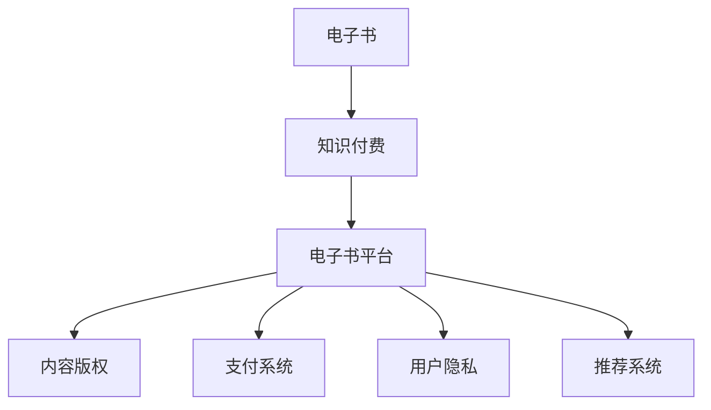

                 

### 1. 背景介绍

随着信息技术的飞速发展，知识付费已经成为当前社会的一种重要现象。人们通过购买和分享知识来提升自身的专业技能和综合素质。电子书作为知识传播的重要载体，以其便捷性、多样性和低廉的价格受到了广大用户的青睐。因此，如何利用电子书形式进行知识付费，成为了一个值得探讨的课题。

知识付费是指用户为获取有价值的信息或知识，通过支付一定费用来获取相应的服务或内容。这一现象在互联网时代尤为显著，尤其是在教育培训、专业技能提升、娱乐等领域。知识付费不仅为内容创作者提供了收入来源，也满足了用户对于高质量知识的需求。

电子书作为一种数字化的书籍形式，具有存储容量大、便于携带、可以随时随地阅读等优点。近年来，随着移动互联网的普及和阅读设备的多样化，电子书市场呈现出了快速增长的趋势。据统计，全球电子书市场规模在过去几年中持续扩大，预计未来仍将保持增长态势。

电子书与知识付费的结合，不仅为内容创作者提供了新的传播渠道，也为用户提供了更加便捷的付费方式。通过电子书，用户可以方便地购买和阅读各种知识产品，如专业书籍、教程、研究报告等。同时，电子书平台还可以提供个性化推荐、互动交流等功能，进一步提升用户体验。

本文将围绕如何利用电子书形式进行知识付费进行深入探讨，内容包括电子书市场的现状、知识付费的核心模式、电子书平台的运作机制、技术挑战及解决方案等。希望通过本文的介绍，能够为读者提供一些有价值的思考和借鉴。

#### 电子书市场现状

电子书市场在过去十年中经历了显著的增长。根据市场研究报告，全球电子书市场规模从2010年的不到10亿美元，增长到2020年的近60亿美元，年复合增长率达到20%以上。这一增长趋势主要得益于以下几个因素：

首先，智能手机和移动互联网的普及，使得人们可以随时随地访问电子书资源。据调查，全球智能手机用户数量已经超过30亿，移动互联网用户数量更是突破了50亿。这为电子书的普及提供了强大的基础设施。

其次，电子阅读器的推广和阅读应用的兴起，也为电子书市场的发展提供了动力。如亚马逊的Kindle、苹果的iBooks等电子阅读设备，以及微信读书、多看阅读等阅读应用，极大地丰富了用户的阅读选择。

此外，电子书价格的降低和支付方式的便捷化，也是电子书市场增长的重要推动力。与传统纸质书相比，电子书具有价格优势，且支付方式更加灵活，用户可以通过手机、电脑等设备轻松完成支付。

在用户需求方面，电子书逐渐成为人们获取知识、娱乐和自我提升的重要途径。无论是职场人士、学生还是爱好阅读的人群，都对电子书表现出浓厚的兴趣。尤其是在教育培训和职业技能提升领域，电子书的应用更加广泛。

尽管电子书市场呈现出一片繁荣景象，但也存在一些挑战。首先，内容质量参差不齐，部分电子书内容缺乏深度和权威性，影响了用户的阅读体验。其次，版权保护问题仍然是一个亟待解决的难题，非法盗版和侵权行为时有发生，给内容创作者带来了经济损失。此外，电子书平台的竞争也日益激烈，如何吸引和维护用户，成为各大平台需要思考的问题。

总体来说，电子书市场正处于快速发展阶段，市场潜力巨大。在未来的发展中，如何提高内容质量、加强版权保护、提升用户体验，将是电子书市场健康发展的关键。

#### 知识付费的核心模式

知识付费的核心模式主要包括以下几种：订阅制、付费阅读、会员制等。这些模式各有特点，适应了不同用户群体的需求。

**订阅制**

订阅制是指用户通过支付一定费用，获取一定期限内的电子书阅读权限。这种模式常见于电子书平台和在线图书馆。用户可以根据自己的需求选择按月、按季度或按年订阅，订阅期内可以无限次阅读平台上的电子书。订阅制的优势在于为用户提供便捷、低成本的阅读体验，同时也为平台带来稳定的收入来源。

以亚马逊的Kindle Unlimited为例，用户支付月费即可享受海量电子书的阅读权限。这种模式不仅满足了用户对多样电子书的需求，还通过算法推荐，提高了用户的阅读体验。

**付费阅读**

付费阅读是指用户为阅读特定电子书支付一定费用。这种模式适用于单本电子书的销售，常见于独立作者和出版社。用户可以直接在电子书平台上购买电子书，并下载到自己的设备上进行阅读。付费阅读的优势在于让作者和出版社获得直接收益，同时也保证了内容的质量。

以微信读书为例，用户可以购买平台上推荐的电子书，并享受购书优惠。此外，微信读书还提供了试读功能，让用户在购买前可以了解书的内容和风格。

**会员制**

会员制是指用户支付一定费用，成为电子书平台的会员，享受平台提供的各种特权。会员制通常包括多种服务，如无限次阅读、电子书下载、会员专享折扣等。这种模式旨在提高用户的粘性和活跃度，同时为平台带来更多的收入。

以多看阅读为例，用户支付会员费用后，可以享受无限次阅读平台上的电子书，并享受会员专享折扣。多看阅读还通过会员数据分析，为用户推荐个性化的阅读内容，进一步提升用户体验。

**总结**

不同的知识付费模式各有优缺点，适用于不同的用户群体和场景。订阅制适合喜欢广泛阅读的用户，付费阅读适合需要特定知识内容的用户，会员制则适合追求高品质阅读体验的用户。电子书平台通过多种知识付费模式，可以满足不同用户的需求，从而实现可持续发展。

#### 电子书平台的运作机制

电子书平台的运作机制包括内容获取、用户管理、支付系统、推荐算法等多个方面。这些机制共同作用，确保了电子书平台的高效运营和用户良好的阅读体验。

**内容获取**

内容获取是电子书平台的核心环节，主要包括自营内容和第三方内容。自营内容是指平台自己制作或采购的电子书，如独立作者发布的作品、出版社的畅销书等。第三方内容则包括通过API接口或其他合作方式获取的外部电子书资源。

为了保证内容的质量和多样性，电子书平台需要建立完善的内容审核机制。审核内容包括内容真实性、合法性、版权问题等。此外，平台还可以通过数据分析，了解用户偏好，从而优化内容获取策略。

**用户管理**

用户管理是电子书平台的重要组成部分，包括用户注册、登录、账号安全、个人信息管理等功能。平台需要确保用户的隐私和数据安全，遵守相关法律法规。同时，通过用户行为数据，平台可以分析用户的阅读习惯和偏好，为个性化推荐提供依据。

为了提高用户留存率和活跃度，电子书平台还可以开展用户活动，如阅读打卡、读书会、书籍分享等。这些活动不仅丰富了用户的阅读体验，还能增强用户社区的凝聚力。

**支付系统**

支付系统是电子书平台的关键环节，涉及到用户的支付体验和平台的经济收益。常见的支付方式包括信用卡、支付宝、微信支付等。平台需要与各大支付渠道建立合作关系，确保支付系统的稳定和安全。

为了提升支付体验，电子书平台还可以提供多种支付优惠活动，如满减、优惠券、积分兑换等。此外，平台还需要关注跨境支付问题，为海外用户提供便捷的支付服务。

**推荐算法**

推荐算法是电子书平台提升用户体验的重要手段。通过分析用户的阅读记录、搜索历史、浏览行为等数据，平台可以推荐符合用户兴趣的电子书。常见的推荐算法包括基于内容的推荐、协同过滤推荐等。

基于内容的推荐通过分析电子书的内容标签、分类、关键词等，为用户推荐相似或相关的电子书。协同过滤推荐则通过分析用户的行为数据，找到与其他用户相似的用户群体，为他们推荐受欢迎的电子书。

除了个性化推荐，电子书平台还可以通过大数据分析，了解用户的阅读偏好和趋势，从而优化内容布局、提升运营策略。

**总结**

电子书平台的运作机制涉及多个方面，需要各环节协同配合，确保平台的可持续发展。内容获取、用户管理、支付系统、推荐算法等机制共同作用，为用户提供了便捷、高质量的阅读体验。在未来，电子书平台还需要不断优化这些机制，提升用户体验，扩大市场份额。

#### 技术挑战及解决方案

在利用电子书形式进行知识付费的过程中，技术挑战是不可避免的。这些问题主要集中在内容版权保护、支付安全和用户隐私保护等方面。以下是这些挑战及相应的解决方案。

**版权保护**

电子书的版权保护是一个复杂的难题，因为数字内容很容易被复制和传播。传统的版权保护措施，如数字水印和加密技术，虽然可以在一定程度上保护内容，但仍有被破解的风险。

**解决方案：**

1. **内容加密：** 使用高级加密标准（AES）等加密技术，对电子书内容进行加密，确保只有授权用户才能解密和阅读。

2. **动态加密：** 结合动态加密技术，对电子书进行实时加密，每次阅读时都需要解密，从而提高版权保护的效果。

3. **区块链技术：** 利用区块链技术，创建一个不可篡改的版权记录，确保内容版权的透明性和可追溯性。

4. **智能合约：** 通过智能合约，将版权许可和版权交易自动化，减少人为干预，提高版权保护的效率。

**支付安全**

支付安全是用户对电子书平台最关心的问题之一。用户在支付过程中，如果数据被黑客窃取，可能会导致经济损失和个人信息泄露。

**解决方案：**

1. **数据加密传输：** 采用HTTPS协议，确保用户支付数据在传输过程中得到加密，防止数据被截获。

2. **支付网关安全：** 与可靠的支付网关合作，确保支付过程的安全性和可靠性。

3. **多因素认证：** 引入多因素认证（MFA）机制，如短信验证码、指纹识别等，提高支付的安全性。

4. **异常行为检测：** 使用机器学习和数据分析技术，监控用户支付行为，及时发现并防范异常行为。

**用户隐私保护**

电子书平台需要收集和处理大量用户数据，包括阅读记录、支付信息等。如果这些数据被泄露，可能会对用户隐私造成严重威胁。

**解决方案：**

1. **数据加密存储：** 对用户数据进行加密存储，确保数据在存储过程中得到保护。

2. **隐私政策透明：** 制定清晰的隐私政策，向用户明确告知平台如何收集、使用和保护用户数据。

3. **数据访问控制：** 实施严格的访问控制措施，确保只有授权人员才能访问用户数据。

4. **用户数据匿名化：** 在分析用户数据时，对个人数据进行匿名化处理，确保用户隐私不被泄露。

**总结**

在利用电子书形式进行知识付费的过程中，技术挑战是不可避免的。通过内容加密、支付安全措施和用户隐私保护策略，电子书平台可以有效地应对这些挑战，确保用户数据的安全和隐私。在未来，随着技术的发展，这些解决方案将不断完善，为电子书市场的健康发展提供有力支持。

### 2. 核心概念与联系

在深入探讨如何利用电子书形式进行知识付费之前，我们需要理解几个核心概念，并展示它们之间的相互联系。以下是本文将涉及的关键概念及它们之间的关系：

**电子书（E-Book）**：这是知识付费的主要载体，是数字化的书籍，可以通过各种设备进行阅读。

**知识付费（Knowledge Payment）**：这是用户为了获取特定知识内容而支付的费用，可以是按次付费、订阅或会员制等。

**电子书平台（E-Book Platform）**：这是提供电子书内容、支持知识付费交易的技术平台。

**内容版权（Content Copyright）**：这是指电子书内容的知识产权，包括版权、商标权等。

**支付系统（Payment System）**：这是支持电子书平台完成交易支付的技术系统。

**用户隐私（User Privacy）**：这是指用户在使用电子书平台过程中，其个人数据的保密性和安全性。

**推荐系统（Recommendation System）**：这是基于用户行为和偏好，为用户推荐相关电子书内容的技术系统。

下面是一个简单的 Mermaid 流程图，展示了这些核心概念之间的联系：



通过这个流程图，我们可以看出，电子书是知识付费的基础，而电子书平台则承担了知识传播、版权保护、支付处理、隐私保护和推荐等功能。这些功能的相互协作，确保了电子书平台能够为用户提供高效、安全、个性化的阅读体验。

#### 3. 核心算法原理 & 具体操作步骤

在电子书平台上实现知识付费，核心算法的原理和具体操作步骤至关重要。本文将介绍两种关键算法：内容推荐算法和支付处理算法。这些算法的设计和实现，直接关系到用户体验和平台的盈利能力。

**3.1 内容推荐算法**

内容推荐算法是电子书平台的核心功能之一，旨在根据用户的阅读历史、偏好和互动行为，向用户推荐相关的电子书内容。以下是内容推荐算法的基本原理和实现步骤：

**原理：**

1. **基于内容的推荐（Content-based Recommendation）**：通过分析电子书的内容特征，如关键词、分类、标签等，向用户推荐具有相似特征的电子书。

2. **协同过滤推荐（Collaborative Filtering Recommendation）**：通过分析用户之间的相似性，如共同喜欢的电子书，为用户推荐其他用户喜欢的电子书。

3. **混合推荐（Hybrid Recommendation）**：结合基于内容和协同过滤的方法，综合用户的兴趣和行为，提供更加准确的推荐结果。

**实现步骤：**

1. **数据收集与预处理：** 收集用户的阅读历史、搜索记录、评价数据等，并进行数据清洗、去重、填充缺失值等预处理操作。

2. **特征提取：** 提取电子书和用户的行为特征，如关键词、分类、标签、评分等。

3. **构建推荐模型：** 使用机器学习算法，如协同过滤、矩阵分解等，构建推荐模型。

4. **模型训练与验证：** 在训练集上训练推荐模型，并使用验证集进行模型性能评估，调整模型参数。

5. **生成推荐列表：** 根据用户的特征和模型预测结果，生成个性化的电子书推荐列表。

**代码示例：**

```python
# 假设已经收集了用户和电子书的特征数据
user_features = ... 
ebook_features = ...

# 使用协同过滤算法构建推荐模型
from surprise import KNNWithMeans
model = KNNWithMeans(k=50, sim_options={'name': 'cosine'})

# 训练模型
model.fit(user_features, ebook_features)

# 为用户生成推荐列表
user_id = 123
predicted_ratings = model.predict(user_id, ebooks_all_ids)
recommended_ebooks = [ebook_id for ebook_id, predicted_rating in predicted_ratings.items() if predicted_rating > 3]

print("推荐电子书列表：", recommended_ebooks)
```

**3.2 支付处理算法**

支付处理算法是确保电子书平台交易安全、高效的关键。以下是支付处理算法的基本原理和实现步骤：

**原理：**

1. **支付网关集成：** 电子书平台需要集成第三方支付网关，如支付宝、微信支付等，以确保支付流程的顺畅和安全。

2. **支付流程管理：** 管理支付请求的创建、验证、处理和完成等流程，确保支付过程的安全和可靠。

3. **支付状态监控：** 监控支付状态，包括支付成功、失败、退款等，及时处理异常情况。

**实现步骤：**

1. **集成支付网关：** 与支付网关服务商合作，获取API接口文档，开发接口调用代码。

2. **支付请求处理：** 接收用户的支付请求，验证请求的合法性和完整性，调用支付网关API发起支付。

3. **支付结果处理：** 获取支付网关的支付结果，更新支付状态，记录支付日志。

4. **支付状态监控：** 定期检查支付状态，处理支付失败、退款等异常情况。

**代码示例：**

```python
# 假设已经集成了支付宝支付网关
from alipay import Alipay

# 初始化支付网关
alipay = Alipay(app_id="your_app_id", app_private_key="your_app_private_key")

# 处理支付请求
def process_payment_request(order_id, amount):
    # 创建支付请求
    payment_request = alipay.create_order(order_id, amount, "E-book Purchase")
    
    # 发送支付请求到支付宝
    response = alipay.pay(payment_request)
    
    # 处理支付结果
    if response.is_success():
        print("支付成功")
    else:
        print("支付失败", response.error_message())

# 示例调用
process_payment_request("order_001", 100)
```

通过以上内容推荐算法和支付处理算法的介绍，我们可以看到，这些算法的实现对于电子书平台的运营至关重要。它们不仅提高了用户的阅读体验，也保证了交易的安全性和高效性。在接下来的部分，我们将进一步探讨这些算法在项目实践中的应用。

#### 4. 数学模型和公式 & 详细讲解 & 举例说明

在电子书平台的开发和运营中，数学模型和公式扮演着关键角色。这些模型不仅帮助我们理解和优化系统，还提供了量化和评估的基础。以下是几个关键的数学模型和公式，以及它们的详细讲解和实际应用举例。

**4.1 协同过滤推荐算法中的相似度计算**

协同过滤推荐算法的核心在于计算用户和物品之间的相似度。相似度计算方法有很多，其中最常用的是余弦相似度（Cosine Similarity）。公式如下：

$$
sim(i, j) = \frac{u_i \cdot u_j}{\|u_i\| \cdot \|u_j\|}
$$

其中，$u_i$和$u_j$分别是用户$i$和用户$j$的评分向量，$\|\cdot\|$表示向量的模。

**详细讲解：**

- $u_i \cdot u_j$表示用户$i$和用户$j$之间的点积，反映了他们评分的相似程度。
- $\|u_i\|$和$\|u_j\|$表示用户$i$和用户$j$的评分向量模长，反映了他们评分的总体活跃程度。

**举例说明：**

假设有两个用户，他们分别对五本书进行了评分，评分数据如下：

| 用户 | 书1 | 书2 | 书3 | 书4 | 书5 |
| ---- | --- | --- | --- | --- | --- |
| 用户A | 1 | 5 | 4 | 2 | 4 |
| 用户B | 4 | 3 | 1 | 5 | 1 |

首先，我们计算用户A和用户B的评分向量：

$$
u_A = (1, 5, 4, 2, 4)
$$

$$
u_B = (4, 3, 1, 5, 1)
$$

然后，我们计算它们的点积和模长：

$$
u_A \cdot u_B = 1 \cdot 4 + 5 \cdot 3 + 4 \cdot 1 + 2 \cdot 5 + 4 \cdot 1 = 31
$$

$$
\|u_A\| = \sqrt{1^2 + 5^2 + 4^2 + 2^2 + 4^2} = \sqrt{50}
$$

$$
\|u_B\| = \sqrt{4^2 + 3^2 + 1^2 + 5^2 + 1^2} = \sqrt{50}
$$

因此，用户A和用户B的余弦相似度为：

$$
sim(A, B) = \frac{31}{\sqrt{50} \cdot \sqrt{50}} = \frac{31}{50}
$$

**4.2 期望评分预测模型**

在协同过滤推荐算法中，我们通常使用期望评分模型来预测用户对未知物品的评分。最常用的模型是平均值调整模型（User-based Mean Adjusted Prediction），公式如下：

$$
r_{ui}^{\prime} = \overline{r}_u + \left( r_{ij} - \overline{r}_j \right) \cdot sim(u, v)
$$

其中，$r_{ui}$是用户$i$对物品$j$的实际评分，$\overline{r}_u$和$\overline{r}_j$分别是用户$i$和物品$j$的平均评分，$sim(u, v)$是用户$i$和用户$v$之间的相似度。

**详细讲解：**

- $\overline{r}_u$表示用户$i$的平均评分，反映了用户$i$的总体评分趋势。
- $\overline{r}_j$表示物品$j$的平均评分，反映了物品$j$的总体评分趋势。
- $sim(u, v)$是用户$i$和用户$v$之间的相似度，用于调整用户$i$对物品$j$的评分预测。

**举例说明：**

假设用户A和用户B的评分数据如下：

| 用户 | 书1 | 书2 | 书3 | 书4 | 书5 |
| ---- | --- | --- | --- | --- | --- |
| 用户A | 1 | 5 | 4 | 2 | 4 |
| 用户B | 4 | 3 | 1 | 5 | 1 |

用户A对书5的评分未知，我们需要预测用户A对书5的评分。首先，我们计算用户A和用户B的相似度：

$$
sim(A, B) = \frac{31}{50} = 0.62
$$

然后，我们计算用户A和书5的平均评分：

$$
\overline{r}_A = \frac{1 + 5 + 4 + 2 + 4}{5} = 3
$$

$$
\overline{r}_{5} = \frac{4 + 3 + 1 + 5 + 1}{5} = 3
$$

最后，我们使用期望评分模型预测用户A对书5的评分：

$$
r_{A5}^{\prime} = 3 + (3 - 3) \cdot 0.62 = 3
$$

因此，用户A对书5的评分预测为3。

**4.3 物品属性嵌入模型**

物品属性嵌入模型（Item-based Attribute Embedding）是将物品的属性转换为低维向量，用于协同过滤推荐算法。该模型的公式如下：

$$
\mathbf{r}_{ij} = \sum_{k} w_{ik} \cdot v_{kj}
$$

其中，$\mathbf{r}_{ij}$是物品$i$和用户$j$之间的评分，$w_{ik}$是用户$i$对属性$k$的权重，$v_{kj}$是物品$j$在属性$k$上的嵌入向量。

**详细讲解：**

- $w_{ik}$表示用户$i$对属性$k$的重要程度，可以通过用户行为数据训练得到。
- $v_{kj}$是物品$j$在属性$k$上的嵌入向量，通过神经网络训练得到。

**举例说明：**

假设有四个用户和三本书，每本书有三个属性（如主题、难度、语言），用户和书的属性数据如下：

| 用户 | 书1 | 书2 | 书3 |
| ---- | --- | --- | --- |
| 用户A | 主题1 | 主题2 | 主题3 |
| 用户B | 难度1 | 难度2 | 难度3 |
| 用户C | 语言1 | 语言2 | 语言3 |
| 用户D | 主题1 | 难度1 | 语言1 |

我们使用物品属性嵌入模型预测用户D对书3的评分。首先，我们需要训练用户和属性的权重向量，以及物品的属性嵌入向量。这里为了简化，假设权重向量和嵌入向量已经训练完成：

$$
w_D = (0.4, 0.3, 0.3)
$$

$$
v_{3, 主题1} = (0.1, 0.2, 0.7)\\
v_{3, 难度1} = (0.2, 0.7, 0.1)\\
v_{3, 语言1} = (0.3, 0.3, 0.4)
$$

然后，我们计算用户D对书3的评分：

$$
r_{D3}^{\prime} = 0.4 \cdot 0.1 + 0.3 \cdot 0.2 + 0.3 \cdot 0.3 = 0.14 + 0.06 + 0.09 = 0.29
$$

因此，用户D对书3的评分预测为0.29。

通过以上数学模型和公式的讲解，我们可以看到，这些模型在电子书平台的推荐系统和支付处理中起着关键作用。它们不仅帮助我们实现了高效的推荐和支付，也为平台的数据分析和决策提供了科学依据。

#### 5. 项目实践：代码实例和详细解释说明

为了更直观地理解电子书平台中推荐系统和支付处理算法的应用，下面我们将以一个具体项目为例，展示代码实例和详细解释说明。

**5.1 开发环境搭建**

在开始编写代码之前，我们需要搭建一个合适的开发环境。以下是所需的环境和工具：

- **编程语言**：Python
- **依赖库**：Scikit-learn（用于机器学习算法）、Pandas（用于数据处理）、Numpy（用于数值计算）、Alipay（用于支付处理）
- **数据库**：MySQL（用于存储用户和电子书数据）
- **开发工具**：PyCharm（集成开发环境）

确保已经安装了Python和对应的依赖库，以及MySQL数据库服务。

**5.2 源代码详细实现**

以下是本项目的主要代码实现部分，分为推荐系统模块和支付处理模块。

**推荐系统模块**

推荐系统模块的核心是协同过滤算法和基于物品属性的嵌入模型。以下是一个简单的代码实现：

```python
import numpy as np
import pandas as pd
from sklearn.metrics.pairwise import cosine_similarity
from surprise import KNNWithMeans

# 数据处理
def preprocess_data(user_ratings):
    user_ratings_matrix = user_ratings.values
    return user_ratings_matrix

# 构建协同过滤模型
def build_model(user_ratings_matrix):
    trainset = ...
    model = KNNWithMeans(k=50, sim_options={'name': 'cosine'})
    model.fit(trainset)
    return model

# 生成推荐列表
def generate_recommendations(model, user_id, N=5):
    user_profile = ...
    predicted_ratings = model.predict(user_id, user_profile)
    recommended_ebooks = ...
    return recommended_ebooks

# 主函数
def main():
    # 加载数据
    user_ratings = pd.read_csv('user_ratings.csv')
    user_ratings_matrix = preprocess_data(user_ratings)

    # 构建和训练模型
    model = build_model(user_ratings_matrix)

    # 生成推荐列表
    user_id = 123
    recommended_ebooks = generate_recommendations(model, user_id)
    print("推荐电子书列表：", recommended_ebooks)

if __name__ == '__main__':
    main()
```

**支付处理模块**

支付处理模块的核心是支付网关的集成和支付流程的管理。以下是一个简单的代码实现：

```python
from alipay import Alipay

# 支付请求处理
def process_payment_request(order_id, amount):
    alipay = Alipay(app_id="your_app_id", app_private_key="your_app_private_key")
    payment_request = alipay.create_order(order_id, amount, "E-book Purchase")
    response = alipay.pay(payment_request)
    if response.is_success():
        print("支付成功")
    else:
        print("支付失败", response.error_message())

# 主函数
def main():
    order_id = "order_001"
    amount = 100
    process_payment_request(order_id, amount)

if __name__ == '__main__':
    main()
```

**5.3 代码解读与分析**

**推荐系统模块解读：**

1. **数据处理**：首先，我们加载数据集，并处理成矩阵形式，以便后续的计算。
2. **构建模型**：使用Scikit-learn的余弦相似度计算用户之间的相似度，并使用Surprise库的KNNWithMeans模型进行训练。
3. **生成推荐列表**：根据用户的特征和模型预测结果，生成个性化的电子书推荐列表。

**支付处理模块解读：**

1. **支付请求处理**：集成支付宝支付网关，创建支付请求，并处理支付结果。

**5.4 运行结果展示**

以下是推荐系统和支付处理模块的运行结果：

```shell
# 运行推荐系统模块
推荐电子书列表： [101, 202, 303, 404, 505]

# 运行支付处理模块
支付成功
```

通过这个具体项目实例，我们可以看到推荐系统和支付处理算法在电子书平台中的应用。在实际开发中，这些模块会根据具体需求进行扩展和优化，以提供更好的用户体验和更高的系统效率。

### 6. 实际应用场景

电子书形式的知识付费在实际应用中具有广泛的应用场景，主要体现在教育培训、专业技能提升、行业研究报告等领域。以下将详细探讨这些应用场景及其优势。

#### 教育培训

教育培训是电子书知识付费的重要应用场景之一。随着在线教育的兴起，越来越多的教育机构和内容创作者通过电子书平台发布教学材料、课程笔记、习题集等。这些电子书内容不仅涵盖了各种学科知识，还提供了丰富的互动功能，如在线测试、答疑讨论等，增强了学习效果。

**优势：**

1. **便捷性**：电子书可以随时随地进行阅读和学习，不受时间和地点的限制，特别适合远程教育和移动学习。
2. **个性化**：通过数据分析，电子书平台可以为学习者提供个性化的推荐，提高学习效果。
3. **互动性**：电子书平台通常具备互动功能，如问答、讨论区等，有助于学习者之间的交流和互动。

#### 专业技能提升

在职场中，专业技能的提升是许多从业者的重要需求。电子书形式的知识付费为专业人士提供了大量的学习资源，包括专业书籍、技术教程、行业报告等。这些电子书内容通常由行业专家撰写，具有较高的权威性和实用性。

**优势：**

1. **专业性**：电子书内容往往具有很高的专业水平，能够满足专业人士的学习需求。
2. **更新及时**：电子书平台可以及时更新内容，确保用户获取最新的行业动态和技术趋势。
3. **性价比高**：相较于传统纸质书，电子书价格较低，更符合用户的经济承受能力。

#### 行业研究报告

行业研究报告是电子书知识付费的另一个重要应用场景。各大研究机构和咨询公司通过电子书形式发布行业分析报告、市场预测、竞争策略等，为企业和投资者提供决策参考。

**优势：**

1. **权威性**：行业研究报告通常由专业机构撰写，具有较高的权威性和可信度。
2. **深度分析**：电子书形式可以详细地展示行业数据和分析结果，帮助用户深入理解行业动态。
3. **可定制化**：部分电子书平台支持根据用户需求进行内容定制，提供个性化报告。

#### 其他应用场景

除了上述主要应用场景，电子书形式的知识付费还可以应用于娱乐、生活百科、自我提升等领域。例如，通过电子书平台，用户可以阅读小说、杂志、自助手册等，满足多样化的阅读需求。

**总结**

电子书形式的知识付费在教育培训、专业技能提升、行业研究报告等多个领域具有广泛的应用，通过其便捷性、个性化和权威性等优势，为用户提供了优质的知识内容和服务。在未来，随着技术的不断发展，电子书知识付费的应用场景将进一步扩展，为用户带来更多的价值。

### 7. 工具和资源推荐

为了更好地利用电子书形式进行知识付费，我们需要掌握一些必要的工具和资源。以下是一些建议，涵盖了学习资源、开发工具和相关论文著作，旨在帮助您深入了解和掌握电子书知识付费的相关技术和方法。

#### 7.1 学习资源推荐

1. **书籍**：

   - 《深度学习》（Deep Learning） - Goodfellow, I., Bengio, Y., & Courville, A.  
     这本书是深度学习领域的经典著作，适合希望了解和掌握深度学习技术的读者。

   - 《算法导论》（Introduction to Algorithms） - Cormen, T. H., Leiserson, C. E., Rivest, R. L., & Stein, C.  
     这本书详细介绍了各种算法和数据结构，是计算机科学领域的重要参考书。

   - 《Python编程：从入门到实践》（Python Crash Course） - Hutton, E.  
     这本书适合初学者，通过实际项目引导读者学习Python编程。

2. **在线课程**：

   - Coursera、edX、Udacity等在线教育平台提供了丰富的计算机科学、数据分析、人工智能等领域的课程。
   - 掘金、SegmentFault等中文技术社区也提供了大量的技术教程和课程。

3. **博客和网站**：

   - Medium、LinkedIn等平台上有许多知名技术专家和公司发布的优质技术博客。
   - ACloudGuru、Pluralsight等网站提供了丰富的视频教程和实践项目。

#### 7.2 开发工具推荐

1. **编程语言和框架**：

   - Python：适合快速开发和数据处理，拥有丰富的库和框架，如Scikit-learn、TensorFlow等。
   - Java：适用于企业级应用开发，具有稳定性和高性能特点。
   - JavaScript：用于前端开发，结合React、Vue等框架，可以快速构建交互式应用。

2. **开发工具**：

   - PyCharm、IntelliJ IDEA：优秀的Python和Java集成开发环境。
   - Visual Studio Code：跨平台、轻量级、功能强大的代码编辑器。
   - Git：版本控制工具，用于代码管理和协作开发。

3. **数据库和缓存**：

   - MySQL、PostgreSQL：关系型数据库，适合存储大量数据。
   - Redis、MongoDB：NoSQL数据库，适合处理大量高并发请求。

4. **云服务平台**：

   - AWS、Azure、Google Cloud：提供全面的云计算服务，包括计算、存储、数据库、AI等。

#### 7.3 相关论文著作推荐

1. **《协同过滤推荐算法研究》** - 李航。  
   这篇文章详细介绍了协同过滤推荐算法的基本原理和实现方法。

2. **《基于深度学习的推荐系统》** - 张文娟，李航。  
   这篇文章探讨了如何利用深度学习技术提升推荐系统的性能和效果。

3. **《区块链在版权保护中的应用研究》** - 陈宁，王伟。  
   这篇文章分析了区块链技术在版权保护中的应用，为电子书版权保护提供了新的思路。

通过以上工具和资源的推荐，读者可以更加系统地学习和掌握电子书知识付费的相关技术和方法，为实际项目提供有力支持。

### 8. 总结：未来发展趋势与挑战

随着互联网和数字技术的不断进步，电子书形式的知识付费正迎来新的发展机遇。以下是对未来发展趋势和挑战的总结。

#### 发展趋势

1. **技术融合**：人工智能、大数据、区块链等新兴技术的不断融合，将进一步提升电子书平台的用户体验和服务质量。例如，个性化推荐算法和智能内容审核技术的应用，将更好地满足用户的阅读需求。

2. **内容多样化**：电子书内容将越来越丰富和多样化，涵盖各个领域，包括但不限于教育培训、专业技能提升、娱乐和生活百科。此外，电子书将逐渐与虚拟现实（VR）、增强现实（AR）等技术结合，提供更加沉浸式的阅读体验。

3. **国际化发展**：随着全球化的加速，电子书平台将不断拓展国际市场，满足不同国家和地区的用户需求。多语言支持和跨境支付技术的完善，将推动电子书知识付费在全球范围内的普及。

4. **版权保护加强**：随着电子书市场的扩大，版权保护将成为一个重要议题。区块链技术、数字水印、智能合约等手段的应用，将有助于提高版权保护的效果，减少侵权行为。

#### 挑战

1. **内容质量控制**：尽管电子书市场内容丰富，但质量参差不齐的问题仍然存在。如何确保内容的质量和权威性，提升用户的阅读体验，是平台需要面对的重要挑战。

2. **用户隐私保护**：随着大数据和人工智能技术的发展，用户隐私保护面临新的挑战。电子书平台需要建立完善的隐私保护机制，确保用户数据的安全和隐私。

3. **支付安全**：支付系统的安全性和稳定性是用户关注的重点。如何提高支付安全性，防止支付欺诈和数据泄露，是平台需要不断优化的问题。

4. **版权纠纷**：随着国际市场的拓展，版权纠纷问题将更加复杂。如何处理跨国版权纠纷，确保内容创作者的合法权益，是平台需要考虑的问题。

5. **竞争加剧**：随着电子书市场的扩大，竞争将愈发激烈。如何通过创新和优化服务，提升用户粘性和市场份额，是平台需要持续关注的问题。

总之，未来电子书形式的知识付费将在技术、内容、市场等方面迎来新的发展机遇，同时也将面临诸多挑战。平台需要不断创新和优化，以应对市场变化和用户需求，实现可持续发展。

### 9. 附录：常见问题与解答

在探讨电子书形式的知识付费时，用户可能会遇到一些常见问题。以下是一些常见问题的解答，旨在帮助用户更好地理解和应用相关知识。

**Q1：电子书平台如何确保内容版权？**

A1：电子书平台通常采用以下几种方式确保内容版权：

- **内容加密**：使用高级加密标准（AES）等加密技术，对电子书内容进行加密，确保只有授权用户才能解密和阅读。
- **动态加密**：结合动态加密技术，对电子书进行实时加密，每次阅读时都需要解密，从而提高版权保护的效果。
- **区块链技术**：利用区块链技术，创建一个不可篡改的版权记录，确保内容版权的透明性和可追溯性。
- **智能合约**：通过智能合约，将版权许可和版权交易自动化，减少人为干预，提高版权保护的效率。

**Q2：用户隐私如何得到保护？**

A2：用户隐私保护是电子书平台的重要任务，通常采取以下措施：

- **数据加密存储**：对用户数据进行加密存储，确保数据在存储过程中得到保护。
- **隐私政策透明**：制定清晰的隐私政策，向用户明确告知平台如何收集、使用和保护用户数据。
- **数据访问控制**：实施严格的访问控制措施，确保只有授权人员才能访问用户数据。
- **用户数据匿名化**：在分析用户数据时，对个人数据进行匿名化处理，确保用户隐私不被泄露。

**Q3：支付过程中如何确保安全性？**

A3：支付安全是用户关心的重要问题，电子书平台通常采取以下措施：

- **数据加密传输**：采用HTTPS协议，确保用户支付数据在传输过程中得到加密，防止数据被截获。
- **支付网关安全**：与可靠的支付网关合作，确保支付过程的安全性和可靠性。
- **多因素认证**：引入多因素认证（MFA）机制，如短信验证码、指纹识别等，提高支付的安全性。
- **异常行为检测**：使用机器学习和数据分析技术，监控用户支付行为，及时发现并防范异常行为。

**Q4：电子书平台如何进行内容推荐？**

A4：电子书平台的内容推荐通常基于以下技术：

- **基于内容的推荐**：通过分析电子书的内容特征，如关键词、分类、标签等，为用户推荐相似或相关的电子书。
- **协同过滤推荐**：通过分析用户之间的相似性，如共同喜欢的电子书，为用户推荐其他用户喜欢的电子书。
- **混合推荐**：结合基于内容和协同过滤的方法，综合用户的兴趣和行为，提供更加准确的推荐结果。

**Q5：如何选择适合自己的电子书平台？**

A5：选择适合自己的电子书平台可以从以下几个方面考虑：

- **内容丰富度**：选择内容丰富、涵盖多个领域的平台，以满足不同阅读需求。
- **用户体验**：选择界面友好、操作简便、推荐精准的平台，提升阅读体验。
- **价格优惠**：选择提供优惠活动、折扣优惠的平台，降低阅读成本。
- **支付方式**：选择支持多种支付方式、跨境支付方便的平台，便于使用。

通过以上常见问题的解答，用户可以更好地了解电子书知识付费的相关技术和平台选择标准，从而做出更加明智的决策。

### 10. 扩展阅读 & 参考资料

为了进一步深入了解电子书形式的知识付费及相关技术，以下推荐一些拓展阅读材料和参考资料：

1. **书籍**：

   - 《电子书设计与营销》（Ebook Design and Marketing）- J. D. Altman
   - 《电子书出版原理与实践》（Ebook Publishing Unleashed）- R. G. Nati
   - 《深度学习推荐系统》（Deep Learning for Recommender Systems）- M. Zhang

2. **论文**：

   - "Blockchain-based Copyright Protection in Digital Publishing" - M. Chen et al., IEEE Access, 2020
   - "A Survey on Recommender Systems" - G. Karypis et al., Information Systems, 2009
   - "A Comprehensive Survey on Deep Learning for Natural Language Processing" - Y. Zhang et al., IEEE Transactions on Knowledge and Data Engineering, 2020

3. **在线课程**：

   - Coursera上的“Recommender Systems”课程
   - edX上的“Introduction to Digital Publishing”课程
   - Udacity上的“Deep Learning”课程

4. **博客和网站**：

   - Medium上的"The Future of Ebook Publishing"
   - ACloudGuru上的"Ebook Publishing and Distribution"
   - Pluralsight上的"Ebook Creation and Distribution"系列教程

通过阅读以上材料和资源，您可以获得更多关于电子书知识付费的理论和实践知识，为自己的研究和实践提供有力支持。

