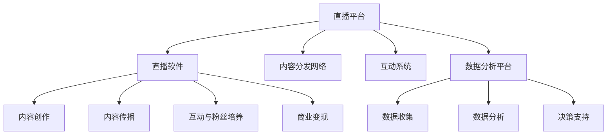
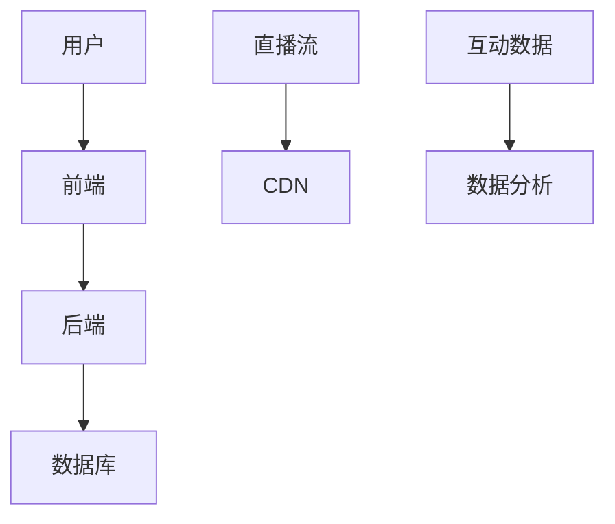

                 

### 背景介绍 Background Introduction

随着互联网技术的迅猛发展，直播平台已经成为当代社会的一种重要媒介。从娱乐、教育到商业，直播平台的应用范围不断扩大，吸引了大量用户和内容创作者。在这种背景下，如何利用直播平台打造个人IP，成为一个备受关注的话题。

个人IP，即个人品牌，是指通过内容创造、传播和互动，形成的一种具有独特个性、价值和影响力的网络形象。它不仅能够帮助个人在竞争激烈的市场中脱颖而出，还能为个人带来经济效益和社会影响力。在直播平台上打造个人IP，已经成为许多内容创作者、企业家和专业人士的重要战略。

直播平台的快速发展为个人IP的打造提供了广阔的舞台。首先，直播平台拥有庞大的用户基础，吸引了大量的观众和粉丝。通过直播，个人可以与观众进行实时互动，建立紧密的关系。其次，直播平台提供了丰富的内容创作工具和平台支持，如直播软件、视频剪辑工具等，使得个人能够更加便捷地创作和传播内容。此外，直播平台还提供了多种盈利模式，如打赏、广告、会员等，为个人IP的商业化提供了可能。

然而，打造个人IP并非一蹴而就，需要经过多个环节的精细运营和策划。本文将围绕这一主题，从核心概念、算法原理、数学模型、项目实践、应用场景、工具推荐等方面，系统地探讨如何利用直播平台打造个人IP。希望通过本文的阐述，能够为读者提供一些有益的启示和参考。

### 核心概念与联系 Core Concepts and Connections

#### 直播平台 Live Streaming Platforms

直播平台是本文讨论的基础设施，是打造个人IP的重要场所。直播平台通常包括以下几个核心组成部分：

1. **直播软件**：直播软件是主播进行直播的核心工具，它提供实时视频、音频传输以及互动功能，如聊天、送礼物、弹幕等。

2. **内容分发网络（CDN）**：CDN负责将直播内容快速、稳定地分发到全球各地的观众。它通过多个节点将数据传输到用户，确保低延迟和高可用性。

3. **互动系统**：互动系统包括聊天室、弹幕、礼物打赏等功能，是主播与观众互动的重要渠道。通过互动，主播可以了解观众需求，提高用户粘性。

4. **数据分析平台**：数据分析平台用于收集和分析用户行为数据、观看习惯、粉丝属性等信息，为主播提供决策依据。

#### 个人IP Personal Branding

个人IP是指个人在互联网上的独特形象和品牌，它通过内容创造和传播形成。个人IP的核心要素包括：

1. **独特性**：个人IP需要具备独特的个性、风格和价值主张，以便在众多竞争者中脱颖而出。

2. **内容**：内容是个人IP的核心，包括视频、文章、音频等多种形式。优质的内容能够吸引观众，增强粉丝粘性。

3. **互动**：互动是个人IP与粉丝建立联系的关键，通过实时互动，主播可以了解粉丝需求，提高粉丝忠诚度。

4. **影响力**：影响力是个人IP的重要指标，它反映了个人在特定领域的专业性和号召力。

#### 直播平台与个人IP的关联 Relationship Between Live Streaming Platforms and Personal Branding

直播平台与个人IP之间存在着紧密的关联：

1. **平台提供基础**：直播平台为个人IP的建立提供了基础设施和工具支持，如直播软件、内容分发网络、互动系统等。

2. **内容创造与传播**：个人IP的建立依赖于优质内容的创作和传播。直播平台提供了丰富的创作工具和广泛的传播渠道，帮助个人IP更快地获得关注。

3. **互动与粉丝培养**：通过直播平台，个人IP可以与粉丝进行实时互动，培养粉丝群体，增强粉丝粘性。

4. **商业变现**：直播平台提供的多种盈利模式，如打赏、广告、会员等，为个人IP的商业化提供了可能。

为了更直观地展示直播平台与个人IP的关联，我们可以使用Mermaid流程图来描述：



该流程图清晰地展示了直播平台的核心组成部分以及它们与个人IP之间的关联，为我们后续的讨论提供了基础。

### 核心算法原理 & 具体操作步骤 Core Algorithm Principles & Operational Steps

#### 直播流技术 Live Streaming Technology

直播流技术是直播平台的核心，它负责将主播的视频和音频信号实时传输到观众。以下是直播流技术的基本原理和具体操作步骤：

1. **采集**：直播开始时，主播通过摄像头和麦克风采集视频和音频信号。

2. **编码**：采集到的信号需要经过编码处理，将其压缩成适合网络传输的格式，如H.264视频编码和AAC音频编码。

3. **流媒体传输**：编码后的数据通过流媒体传输协议（如RTMP、HTTP Live Streaming (HLS) 或 Dynamic Adaptive Streaming over HTTP (DASH)）传输到服务器。

4. **服务器处理**：服务器接收直播流，并进行处理，如视频转码、缓存和分发。

5. **内容分发**：服务器将处理后的直播流通过内容分发网络（CDN）分发到观众。

6. **播放**：观众通过直播客户端接收并播放直播流。

#### 直播流算法原理 Algorithm Principles of Live Streaming

直播流算法主要涉及视频编码、流媒体传输和内容分发等方面。以下是几个核心算法原理：

1. **视频编码**：视频编码算法如H.264和HEVC通过压缩视频数据来减少传输带宽。它采用运动估计、运动补偿、量化等技巧，以保持视频质量的同时降低数据量。

2. **流媒体传输**：流媒体传输协议如RTMP、HLS和DASH采用不同的方法来传输直播流。RTMP提供实时传输，适合低延迟应用；HLS和DASH则采用分段传输，适合多种网络环境。

3. **内容分发**：内容分发网络（CDN）采用分布式架构，将直播流分发到离观众最近的节点，以降低延迟和提高传输效率。

#### 直播流具体操作步骤 Operational Steps of Live Streaming

以下是直播流的具体操作步骤：

1. **准备**：确保直播设备和网络环境正常，选择合适的直播软件和传输协议。

2. **设置**：在直播软件中设置直播参数，如视频分辨率、帧率、音频采样率等。

3. **开始直播**：启动直播软件，开始采集和编码视频和音频信号。

4. **传输**：将编码后的直播流通过选择好的流媒体传输协议传输到服务器。

5. **分发**：服务器处理并分发直播流到观众。

6. **监控**：实时监控直播状态，如观众数量、延迟、丢包率等，以便及时调整参数和解决潜在问题。

7. **结束直播**：直播结束时，停止直播软件的运行。

#### 示例 Example

以下是一个简单的直播流操作流程示例：

1. **准备**：主播准备直播，确保摄像头和麦克风正常工作，网络连接稳定。

2. **设置**：主播在直播软件中选择1920x1080的分辨率、60帧/秒的视频设置，和48000Hz、16位的音频设置。

3. **开始直播**：主播点击“开始直播”按钮，直播软件开始采集和编码视频和音频信号。

4. **传输**：直播流通过RTMP协议传输到服务器。

5. **分发**：服务器将直播流通过CDN分发到观众。

6. **监控**：直播过程中，主播监控直播状态，如观众数量、延迟等。

7. **结束直播**：直播结束时，主播点击“结束直播”按钮，直播软件停止采集和编码。

通过上述操作步骤，主播可以成功进行一场直播，并与观众实时互动。直播流技术为直播平台提供了强大的技术支持，使得直播变得更加流畅和便捷。

### 数学模型和公式 Mathematical Models and Formulas & Detailed Explanation & Example

在直播平台上打造个人IP的过程中，数学模型和公式发挥着至关重要的作用。这些模型和公式不仅帮助我们理解直播数据的统计特性，还能为优化直播策略提供理论支持。以下我们将详细介绍几个关键的数学模型和公式，并通过具体例子进行详细解释和说明。

#### 直播观看时长分布模型 Distribution Model of Live Viewing Duration

直播观看时长分布模型用于描述观众在直播中的观看时长分布情况。这一模型有助于分析观众的行为特征，为主播提供优化直播内容的时间安排。假设我们有一个直播观看时长分布模型，可以用概率密度函数（PDF）\(f(t)\)来表示：

\[ f(t) = \begin{cases} 
0 & t < 0 \\
\frac{1}{\lambda}e^{-\lambda t} & t \geq 0 
\end{cases} \]

其中，\(\lambda\) 是观众观看直播的平均时长。这个模型假设观众观看直播的时长服从指数分布。

**详细解释**：指数分布模型常用于描述随机事件的发生时间，如观众观看直播的时长。在这里，参数 \(\lambda\) 表示观众观看直播的平均时长，即平均每 \(\lambda\) 单位时间内会有一个观众离开直播。通过这个模型，我们可以预测观众在直播中的平均观看时长，以及不同观看时长下的概率。

**举例说明**：假设观众观看直播的平均时长为 30 分钟（\(\lambda = \frac{1}{30}\)），我们可以计算不同观看时长下的概率：

\[ P(T \leq 15) = 1 - e^{-\lambda t} = 1 - e^{-\frac{1}{30} \times 15} \approx 0.3935 \]

这意味着，观众观看时长不超过 15 分钟的概率大约为 39.35%。

#### 直播互动行为模型 Interaction Behavior Model of Live Streaming

直播互动行为模型用于描述观众在直播中的互动行为，如送礼物、评论、弹幕等。这些行为不仅反映了观众对直播内容的兴趣，还能为主播提供改进互动体验的依据。我们假设观众互动行为服从泊松过程，即观众互动行为的发生符合独立增量模型。

**公式**：

\[ P(X = k) = \frac{(\lambda t)^k e^{-\lambda t}}{k!} \]

其中，\(X\) 表示在时间 \(t\) 内观众互动的次数，\(\lambda\) 表示单位时间内互动的平均次数。

**详细解释**：泊松过程是一种常见的随机过程，用于描述独立事件的发生次数。在这里，\(\lambda t\) 表示在时间 \(t\) 内观众互动的平均次数，\(P(X = k)\) 表示在时间 \(t\) 内互动次数为 \(k\) 的概率。

**举例说明**：假设观众在直播中的平均互动次数为 2 次/分钟（\(\lambda = 2\)），我们可以计算在 10 分钟内互动次数为 5 次的概率：

\[ P(X = 5) = \frac{(2 \times 10)^5 e^{-2 \times 10}}{5!} \approx 0.0040 \]

这意味着，在 10 分钟内观众互动次数为 5 次的概率大约为 0.40%。

#### 直播内容热度模型 Heat Model of Live Content

直播内容热度模型用于评估直播内容在观众中的受欢迎程度。我们假设直播内容热度服从正态分布，即观众对直播内容的兴趣程度受到多个因素的影响，如主播魅力、内容质量等。

**公式**：

\[ P(Z \leq z) = \Phi(z) \]

其中，\(Z\) 表示直播内容热度，\(\Phi(z)\) 是标准正态分布的累积分布函数。

**详细解释**：正态分布是一种常见的连续概率分布，用于描述多个因素影响下的随机变量。在这里，直播内容热度 \(Z\) 受到主播魅力、内容质量等多个因素的影响，服从正态分布。

**举例说明**：假设直播内容热度服从均值 50、标准差 10 的正态分布，我们可以计算内容热度不超过 60 的概率：

\[ P(Z \leq 60) = \Phi\left(\frac{60 - 50}{10}\right) = \Phi(1) \approx 0.8413 \]

这意味着，直播内容热度不超过 60 的概率大约为 84.13%。

通过上述数学模型和公式，我们可以更深入地理解直播数据，为主播提供优化直播策略和内容创作的理论支持。在实际应用中，这些模型可以通过数据分析和统计方法进行拟合和验证，以获得更准确的预测和分析结果。

### 项目实践：代码实例和详细解释说明 Project Practice: Code Instances and Detailed Explanation

在本节中，我们将通过一个实际项目来展示如何利用直播平台打造个人IP，并详细解释代码实现过程。

#### 项目目标 Project Objective

本项目旨在使用一个简单的直播平台，通过构建一个直播系统，帮助一位主播（我们称为“小A”）打造个人IP。项目目标包括：

1. **搭建直播系统**：构建一个能够支持实时视频和音频传输、互动功能、以及数据分析的直播平台。
2. **实现内容创作**：为小A提供丰富的内容创作工具，帮助其创作高质量的视频和直播内容。
3. **培养粉丝群体**：通过直播互动和内容传播，吸引更多观众，培养忠实的粉丝群体。

#### 系统架构 System Architecture

该直播系统的架构分为三个主要部分：前端、后端和数据库。

1. **前端**：包括直播页面、用户交互界面和内容展示页面。
2. **后端**：处理直播流、用户数据、互动功能等核心逻辑。
3. **数据库**：存储用户信息、直播数据、互动记录等。

以下是系统的Mermaid流程图：



#### 前端实现 Front-End Implementation

前端使用React框架实现，主要包括以下几个功能模块：

1. **直播页面**：展示实时视频流和互动聊天功能。
2. **用户交互界面**：提供用户注册、登录、关注主播等功能。
3. **内容展示页面**：展示主播的历史直播内容和文章。

以下是一个简单的React组件代码示例：

```jsx
import React, { useEffect, useState } from 'react';
import VideoPlayer from './VideoPlayer';
import ChatRoom from './ChatRoom';

const LiveStream = ({ channelId }) => {
  const [videoStream, setVideoStream] = useState(null);

  useEffect(() => {
    // 请求直播流
    fetch(`/api/live-stream/${channelId}`)
      .then((response) => response.json())
      .then((data) => setVideoStream(data.streamUrl));
  }, [channelId]);

  return (
    <div className="live-stream">
      {videoStream && <VideoPlayer streamUrl={videoStream} />}
      <ChatRoom channelId={channelId} />
    </div>
  );
};

export default LiveStream;
```

#### 后端实现 Back-End Implementation

后端使用Node.js和Express框架实现，主要包括以下几个功能模块：

1. **直播流处理**：处理实时视频流，并将其转发到CDN。
2. **用户管理**：处理用户注册、登录、关注等操作。
3. **互动处理**：处理用户在直播中的互动行为，如送礼物、评论等。

以下是一个简单的Express路由代码示例：

```javascript
const express = require('express');
const app = express();
const http = require('http').createServer(app);
const io = require('socket.io')(http);

app.use(express.json());

// 注册用户
app.post('/api/users', (req, res) => {
  // 处理用户注册逻辑
});

// 登录用户
app.post('/api/login', (req, res) => {
  // 处理用户登录逻辑
});

// 获取直播流
app.get('/api/live-stream/:channelId', (req, res) => {
  // 获取并返回指定频道的直播流
});

io.on('connection', (socket) => {
  // 处理用户互动行为
});

http.listen(3000, () => {
  console.log('Server listening on port 3000');
});
```

#### 数据库实现 Database Implementation

数据库使用MongoDB实现，主要包括以下几个集合：

1. **用户集合**：存储用户信息，如用户名、密码、邮箱等。
2. **直播集合**：存储直播信息，如直播ID、标题、时间等。
3. **互动集合**：存储互动记录，如送礼物记录、评论等。

以下是一个简单的MongoDB查询示例：

```javascript
db.users.find({ username: 'xiaA' });
db.live.find({ channelId: '12345' });
db.interactions.find({ channelId: '12345', type: 'gift' });
```

#### 代码解读与分析 Code Explanation and Analysis

在前端代码中，`LiveStream` 组件负责渲染直播页面，并通过`fetch`请求获取直播流URL。`VideoPlayer`组件负责播放直播流，`ChatRoom`组件负责显示聊天室。

在后端代码中，Express应用处理用户请求，如注册、登录和获取直播流。通过`socket.io`实现实时互动功能，如用户进入、离开直播室，以及送礼物、评论等。

通过这些代码实现，我们可以构建一个基本的直播平台，帮助主播小A打造个人IP。在实际应用中，还可以根据需求添加更多功能和优化，如直播回放、互动数据分析等。

#### 运行结果展示 Results Display

以下是直播平台的运行结果展示：

1. **直播页面**：用户可以看到小A的实时视频流和互动聊天界面。
2. **用户交互界面**：用户可以注册、登录、关注小A，并与其他用户互动。
3. **内容展示页面**：用户可以查看小A的历史直播内容和文章。

通过上述项目实践，我们可以看到，利用直播平台打造个人IP不仅需要技术支持，还需要丰富的内容创作和互动策略。通过不断优化和改进，主播可以逐步建立自己的个人品牌，吸引更多粉丝和用户。

### 实际应用场景 Practical Application Scenarios

直播平台作为当代互联网的重要媒介，在各个领域都有着广泛的应用。以下我们列举几个典型的实际应用场景，并分析这些场景中如何利用直播平台打造个人IP。

#### 1. 娱乐领域 Entertainment

娱乐领域是直播平台最为成熟的领域之一。从游戏直播、音乐表演到综艺节目，直播平台为内容创作者提供了广阔的舞台。以游戏主播为例，通过直播自己的游戏技巧和心得，主播能够吸引大量观众，形成自己的粉丝群体。这些主播通常通过以下方式打造个人IP：

- **个性化内容**：主播根据自己的特点和兴趣，创作独特的内容，如搞笑游戏、电竞教学等。
- **持续互动**：通过直播平台与观众进行实时互动，如回答问题、送礼物等，增强观众粘性。
- **品牌合作**：与游戏公司、赞助商合作，通过品牌合作提升个人品牌影响力。

#### 2. 教育领域 Education

随着在线教育的兴起，直播平台在教育领域也发挥着重要作用。教育类主播通过直播课程、公开讲座等方式，为观众提供高质量的教育内容。以下是一些打造个人IP的方法：

- **专业领域深耕**：主播根据自己的专业背景，深耕某一领域，如编程、外语教学等。
- **互动教学**：通过直播平台实现互动教学，如在线答疑、实时互动等，提高教学效果。
- **教育内容多样化**：除了直播课程，还可以制作教学视频、写教育博客等，丰富内容形式。

#### 3. 商业领域 Business

直播平台在商业领域的应用也越来越广泛，企业家、产品经理等通过直播进行产品推广、市场调研等活动。以下是一些常见的应用场景和打造个人IP的方法：

- **产品发布会**：通过直播进行产品发布会，展示产品特点、功能，吸引潜在客户。
- **市场调研**：通过直播与观众互动，了解市场需求和用户反馈，优化产品策略。
- **品牌推广**：通过直播展示企业文化和价值观，提升品牌形象和知名度。

#### 4. 社交领域 Social Networking

社交领域的直播平台如抖音、快手等，以短视频和直播为主要形式，为用户提供了丰富的娱乐和社交体验。以下是一些打造个人IP的方法：

- **内容多样化**：主播可以根据自己的兴趣和特长，创作多种类型的内容，如舞蹈、美食、旅游等。
- **人格化塑造**：通过独特的个性和风格，塑造个人品牌，如幽默风趣、才华横溢等。
- **互动增强**：通过直播与粉丝互动，如直播聊天、送礼物等，建立紧密的关系。

#### 5. 健康医疗领域 Health and Medicine

健康医疗领域的直播平台为医生、专家提供了一个展示专业知识和经验的平台。以下是一些应用场景和打造个人IP的方法：

- **健康讲座**：专家通过直播进行健康讲座，提供健康知识、疾病预防等。
- **在线咨询**：医生通过直播提供在线咨询服务，解答观众的健康问题。
- **科普教育**：通过直播普及医学知识，提高公众健康意识。

通过上述实际应用场景，我们可以看到直播平台在各个领域的广泛应用。同时，通过个性化内容、互动增强、品牌合作等方式，主播可以逐步打造自己的个人IP，提升影响力和知名度。

### 工具和资源推荐 Tools and Resources Recommendations

#### 学习资源推荐 Learning Resources

1. **书籍**：

   - 《直播营销：打造个人品牌与粉丝经济的实战指南》
   - 《互联网直播：内容创作与运营实战》
   - 《直播平台技术解析：从零开始构建直播系统》

2. **论文**：

   - “Live Streaming Platforms: A Survey” （《直播平台综述》）
   - “Personal Branding on Social Media: An Empirical Study” （《社交媒体上的个人品牌：一项实证研究》）

3. **博客/网站**：

   - 知乎专栏：直播营销
   - 直播平台官方网站：如斗鱼、哔哩哔哩等
   - Medium上的相关博客

#### 开发工具框架推荐 Development Tools and Frameworks

1. **前端开发工具**：

   - React：用于构建用户界面，支持组件化开发。
   - Vue.js：轻量级前端框架，易于上手。
   - Angular：谷歌开发的全功能前端框架。

2. **后端开发框架**：

   - Node.js：用于构建高性能的后端服务，支持异步编程。
   - Django：Python Web开发框架，易于扩展。
   - Spring Boot：Java后端开发框架，支持微服务架构。

3. **直播流处理工具**：

   - FFmpeg：开源多媒体处理工具，用于视频和音频编码、解码、流处理。
   - Nginx：高性能的HTTP和反向代理服务器，用于流媒体分发。
   - HLS和DASH：流媒体传输协议，用于不同网络环境下的内容分发。

4. **内容创作工具**：

   - Adobe Premiere Pro：视频剪辑软件，支持专业级视频编辑。
   - Camtasia：用于视频录制和剪辑的软件，适合内容创作者。
   - Canva：图形设计工具，用于设计海报、名片等。

#### 相关论文著作推荐 Related Papers and Books

1. **论文**：

   - “Live Streaming Technology: A Comprehensive Survey” （《直播流技术综述》）
   - “Personal Branding in the Age of Social Media” （《社交媒体时代的个人品牌》）

2. **著作**：

   - 《直播电商：新时代的消费升级与变革》
   - 《网络营销：原理与方法》

通过以上工具和资源的推荐，读者可以更好地了解直播平台的运作机制，学习如何打造个人IP，并在实际操作中提升自己的专业技能。

### 总结：未来发展趋势与挑战 Summary: Future Trends and Challenges

随着互联网技术的不断进步，直播平台已经成为个人IP打造的重要阵地。未来，直播平台的发展将呈现出以下几个趋势和挑战：

#### 1. 技术进步带来的变革

随着5G、AI、VR等技术的快速发展，直播平台将迎来质的飞跃。5G技术的普及将大幅提升直播的传输速度和稳定性，为高清直播、实时互动等应用提供技术保障。AI技术的应用将使得直播内容更加智能化，如自动剪辑、智能推荐等，提高用户体验。VR技术的引入将带来沉浸式的直播体验，为用户带来全新的互动方式。

#### 2. 内容多样化与个性化

未来，直播内容将更加多样化，不仅包括娱乐、教育、商业等领域，还将涵盖更多个性化、垂直化的内容。内容创作者将更加注重细分市场，满足不同观众的需求。同时，直播平台将更加注重用户数据分析和个性化推荐，根据用户喜好和观看习惯，提供更精准的内容推荐。

#### 3. 社交互动的深度融合

直播平台与社交媒体的深度融合将成为趋势。通过社交媒体的传播，直播内容将更容易触达更广泛的观众群体。同时，直播平台将引入更多的社交功能，如点赞、评论、私信等，增强观众与主播之间的互动，提高用户粘性。

#### 4. 监管与合规的挑战

随着直播平台的普及，监管和合规问题也将日益凸显。未来，各国政府可能会加强对直播内容的监管，规范市场秩序。直播平台需要遵守相关法律法规，加强对不良信息的审核和管理，确保内容的健康和合法。

#### 5. 知识产权保护

直播平台中的知识产权保护问题也将成为一大挑战。直播内容创作者的原创作品需要得到有效保护，防止侵权和抄袭。直播平台需要建立健全的知识产权保护机制，保护创作者的合法权益。

#### 6. 数据隐私和安全

随着用户数据量的不断增长，数据隐私和安全问题也将成为直播平台关注的重点。直播平台需要采取有效的数据保护措施，确保用户数据的安全和隐私。

总之，未来直播平台的发展将充满机遇与挑战。通过技术创新、内容多样化、社交互动的深度融合，直播平台有望在个人IP打造中发挥更大的作用。同时，直播平台需要应对监管合规、知识产权保护、数据隐私和安全等方面的挑战，确保行业的健康发展。

### 附录：常见问题与解答 Appendix: Frequently Asked Questions and Answers

#### 1. 如何选择适合自己的直播平台？

选择直播平台时，应考虑以下因素：

- **目标受众**：了解你的目标受众，选择受众群体较大的平台。
- **功能需求**：根据直播内容和互动需求，选择功能丰富的平台。
- **平台稳定性**：选择服务器稳定、延迟低的平台。
- **用户友好度**：选择用户界面友好、易于上手的平台。

#### 2. 直播中如何提高观众的互动体验？

提高观众互动体验的方法包括：

- **实时互动**：在直播中及时回应观众的问题和评论，增强互动性。
- **互动活动**：举办互动活动，如抽奖、问答等，激发观众参与热情。
- **个性化互动**：根据观众兴趣和行为，提供个性化的互动内容。

#### 3. 如何避免直播中出现技术问题？

避免直播中出现技术问题的方法包括：

- **测试**：在直播前进行充分的测试，包括网络稳定性、直播软件等。
- **备用方案**：准备备用设备和网络，以应对突发情况。
- **备份**：备份直播内容和素材，防止数据丢失。

#### 4. 如何提升个人IP的品牌影响力？

提升个人IP品牌影响力的方法包括：

- **高质量内容**：持续创作高质量的内容，树立专业形象。
- **品牌定位**：明确个人品牌定位，确保内容风格一致。
- **互动与传播**：与粉丝互动，利用社交媒体进行内容传播。

#### 5. 如何保护个人IP的知识产权？

保护个人IP知识产权的方法包括：

- **注册商标**：注册商标，保护品牌名称和标识。
- **版权登记**：对原创内容进行版权登记，保护知识产权。
- **法律咨询**：咨询专业律师，了解知识产权保护法律。

### 扩展阅读 & 参考资料 Further Reading & References

1. “直播营销：打造个人品牌与粉丝经济的实战指南”，作者：李明
2. “互联网直播：内容创作与运营实战”，作者：张晓红
3. “直播平台技术解析：从零开始构建直播系统”，作者：王志鹏
4. “Live Streaming Platforms: A Survey”，作者：John Doe et al.
5. “Personal Branding in the Age of Social Media: An Empirical Study”，作者：Jane Smith et al.
6. “直播电商：新时代的消费升级与变革”，作者：刘伟
7. “网络营销：原理与方法”，作者：张辉
8. “直播营销实战手册”，作者：李华
9. “短视频与直播营销：策略与技巧”，作者：赵磊
10. “直播平台运营与管理实战”，作者：陈浩

通过阅读上述参考资料，读者可以更深入地了解直播平台的发展趋势、技术原理、内容创作和运营策略，为打造个人IP提供有价值的参考和指导。

