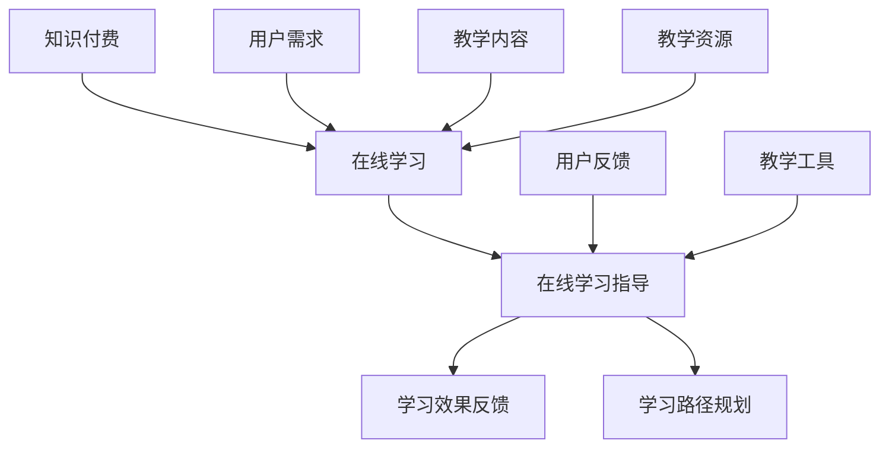

                 

### 背景介绍

#### 知识付费的发展历程

知识付费作为一种商业模式，近年来在全球范围内迅速崛起。最早的知识付费模式可以追溯到20世纪末，当时主要是一些在线课程和教育平台，如Coursera、Udemy等，通过提供在线课程来获取收入。这些平台通过收取课程费用，让用户能够便捷地获取到高质量的教育资源。

进入21世纪，随着互联网技术的不断进步，尤其是移动互联网的普及，知识付费的模式得到了进一步的扩展。例如，音频课程、电子书、在线讲座等形式开始涌现，为用户提供了更多样化的学习选择。同时，一些知名的内容创作者和知识型博主也通过自媒体平台，如微信公众号、知乎等，进行知识分享和变现。

在国内，知识付费市场的发展尤为迅速。以得到、知乎Live、分答等平台为代表，知识付费已经成为了许多用户获取知识和技能的重要渠道。这些平台不仅提供了丰富的学习资源，还通过问答、直播、社群互动等方式，增强了用户的参与感和互动性。

#### 在线学习的现状

随着知识付费的发展，在线学习逐渐成为了人们获取知识和技能的重要途径。在线学习具有以下几大优势：

1. **便捷性**：用户可以随时随地通过网络进行学习，不受时间和地点的限制。
2. **个性化**：在线学习平台通常能够根据用户的学习习惯和兴趣，提供个性化的学习内容和推荐。
3. **互动性**：通过论坛、问答、直播等方式，用户可以与其他学习者和讲师进行互动，提高学习效果。
4. **灵活性**：用户可以根据自己的时间安排，灵活选择学习时间和进度。

然而，在线学习也存在一些挑战，如学习效果难以保证、自律性要求高等。因此，如何利用知识付费实现在线学习与在线学习指导，提高学习效果，成为了当前的研究热点和实际需求。

### 知识付费与在线学习的关系

知识付费与在线学习有着密切的关系。知识付费为在线学习提供了资金支持，使得在线学习平台能够持续地提供高质量的教育资源和服务。同时，在线学习为知识付费提供了广阔的市场，使得知识创作者和机构能够通过知识付费实现商业价值。

然而，单纯的在线学习并不能保证学习效果。在线学习平台和内容创作者需要通过提供在线学习指导，帮助用户更好地掌握知识和技能。因此，如何利用知识付费实现在线学习与在线学习指导，成为了当前研究和实践的重要方向。

#### 研究目的

本文旨在探讨如何利用知识付费实现在线学习与在线学习指导。通过对知识付费和在线学习的关系进行分析，探讨现有的在线学习指导方法和存在的问题，提出一种基于知识付费的在线学习指导模型，并对其可行性进行验证。

本文的结构安排如下：

1. **背景介绍**：回顾知识付费的发展历程，介绍在线学习的现状，阐述知识付费与在线学习的关系。
2. **核心概念与联系**：介绍知识付费和在线学习指导的核心概念，使用Mermaid流程图展示其联系和架构。
3. **核心算法原理与操作步骤**：详细阐述在线学习指导的核心算法原理，包括知识点评估、学习路径规划、学习效果反馈等，并提供具体的操作步骤。
4. **数学模型和公式**：介绍在线学习指导过程中的数学模型和公式，并进行详细讲解和举例说明。
5. **项目实践**：通过具体项目实例，展示如何利用知识付费实现在线学习与在线学习指导，包括环境搭建、源代码实现、代码解读与分析、运行结果展示等。
6. **实际应用场景**：分析知识付费和在线学习指导在不同领域和场景中的应用，探讨其价值和挑战。
7. **工具和资源推荐**：推荐相关学习资源、开发工具和框架，为读者提供进一步学习参考。
8. **总结与展望**：总结本文的主要研究成果，探讨未来发展趋势和挑战。

### 核心概念与联系

为了更好地理解如何利用知识付费实现在线学习与在线学习指导，我们首先需要明确相关的核心概念和它们之间的联系。以下是本文涉及的主要核心概念及其相互关系的详细解释。

#### 核心概念

1. **知识付费**：知识付费是指通过支付一定费用，获取高质量的知识和技能的教育服务。它包括在线课程、电子书、音频讲座、一对一辅导等多种形式。
2. **在线学习**：在线学习是指通过互联网和数字化技术，进行的学习活动。它包括在线课程、在线研讨会、在线实践等多种形式。
3. **在线学习指导**：在线学习指导是指通过专业的教学方法和工具，为在线学习者提供学习支持，帮助他们更好地掌握知识和技能。

#### 概念联系

1. **知识付费与在线学习的关系**：知识付费为在线学习提供了资金支持，使得在线学习平台能够持续地提供高质量的教育资源和服务。同时，在线学习为知识付费提供了广阔的市场，使得知识创作者和机构能够通过知识付费实现商业价值。

2. **在线学习指导与在线学习的关系**：在线学习指导是提高在线学习效果的重要手段。通过在线学习指导，学习者可以更清晰地了解自己的学习进度和效果，获得专业的学习建议和反馈，从而提高学习效率。

3. **知识付费与在线学习指导的关系**：知识付费可以为在线学习指导提供资金支持，使得在线学习指导平台能够提供高质量的学习支持服务。同时，在线学习指导可以为知识付费提供增值服务，提高用户满意度和粘性。

#### Mermaid流程图

为了更直观地展示知识付费、在线学习和在线学习指导之间的联系和架构，我们使用Mermaid流程图来表示。以下是相关的Mermaid流程图代码和解释：



**解释**：

- **A[知识付费]**：表示知识付费作为资金来源，为在线学习和在线学习指导提供支持。
- **B[在线学习]**：表示在线学习作为知识付费的应用场景，用户通过在线学习获取知识和技能。
- **C[在线学习指导]**：表示在线学习指导作为对在线学习的辅助和优化，通过专业的教学方法和工具提供学习支持。
- **D[学习效果反馈]**：表示在线学习指导过程中，对学习效果进行实时反馈和评估。
- **E[学习路径规划]**：表示在线学习指导过程中，根据用户需求和学习效果，为用户制定个性化的学习路径。
- **F[用户需求]**：表示用户的需求和兴趣，是进行在线学习和在线学习指导的驱动力。
- **G[用户反馈]**：表示用户对学习效果的反馈，用于优化在线学习指导和教学资源。
- **H[教学内容]**：表示在线学习的核心内容，包括知识点、案例、实践等。
- **I[教学资源]**：表示在线学习所需的资源，如教材、视频、音频等。
- **J[教学工具]**：表示用于在线学习指导的工具，如在线测评、学习社区、直播等。

通过以上核心概念和Mermaid流程图的解释，我们能够清晰地理解知识付费、在线学习和在线学习指导之间的联系和架构。这为后续探讨如何利用知识付费实现在线学习与在线学习指导提供了理论基础和实践指导。

### 核心算法原理与操作步骤

为了实现基于知识付费的在线学习与在线学习指导，我们需要设计一套核心算法，该算法主要包括知识点评估、学习路径规划、学习效果反馈等关键步骤。以下是核心算法原理的具体阐述以及每个步骤的操作步骤。

#### 1. 知识点评估

**原理**：

知识点评估是了解学习者对某一知识点的掌握情况，从而为后续的学习路径规划和学习效果反馈提供依据。知识点评估通常基于以下两个维度：

- **知识点掌握度**：通过测验、练习题等方式，评估学习者对知识点的理解和应用能力。
- **知识点兴趣度**：通过用户行为数据，如学习时长、参与度、笔记等，评估学习者对知识点的兴趣。

**操作步骤**：

1. **知识点库构建**：首先，构建一个包含所有知识点及其相关信息的知识点库，包括知识点描述、难度等级、所需前置知识点等。
2. **测验与练习**：根据知识点库，设计一系列测验和练习题，用于评估学习者的知识点掌握度。
3. **数据收集**：通过在线学习平台，收集学习者的答题记录、学习行为数据等。
4. **评估算法**：利用评分模型或机器学习算法，对学习者的知识点掌握度进行评估，并将结果存储在数据库中。

#### 2. 学习路径规划

**原理**：

学习路径规划是根据学习者的知识点评估结果和兴趣，为其制定个性化的学习计划。学习路径规划需要考虑以下因素：

- **知识点依赖关系**：根据知识点库中的知识点依赖关系，确定学习者的学习顺序。
- **学习资源**：根据知识点和学习者的兴趣，选择适当的学习资源，如视频、文章、实践项目等。
- **学习时间**：根据学习者的时间安排和知识点难度，合理安排学习进度。

**操作步骤**：

1. **用户画像构建**：通过学习行为数据，构建学习者的用户画像，包括学习习惯、兴趣偏好、知识背景等。
2. **路径规划算法**：设计路径规划算法，根据用户画像和知识点依赖关系，为学习者制定个性化的学习路径。
3. **路径优化**：根据学习者的反馈和学习效果，动态调整学习路径，使其更符合学习者的需求。

#### 3. 学习效果反馈

**原理**：

学习效果反馈是实时监测学习者的学习进度和效果，并提供针对性的指导和建议。学习效果反馈需要考虑以下方面：

- **学习进度**：实时跟踪学习者的学习进度，评估其完成任务的效率和质量。
- **学习效果**：通过测验、作业等方式，评估学习者的学习效果，包括知识点掌握度和应用能力。
- **反馈机制**：根据学习效果，为学习者提供针对性的反馈和建议，如学习资源推荐、学习方法指导等。

**操作步骤**：

1. **学习进度跟踪**：通过在线学习平台，实时记录学习者的学习行为和进度，并将数据存储在数据库中。
2. **效果评估**：设计评估模型，对学习者的学习效果进行评估，并将结果存储在数据库中。
3. **反馈机制**：根据学习效果，为学习者提供个性化的反馈和建议，如通过邮件、消息推送等方式。
4. **反馈优化**：根据学习者的反馈和效果，不断优化反馈机制，提高反馈的准确性和实用性。

#### 总结

通过以上三个核心步骤，我们可以实现基于知识付费的在线学习与在线学习指导。知识点评估帮助了解学习者的学习情况，学习路径规划为学习者制定个性化学习计划，学习效果反馈则实时监测学习者的学习效果并提供指导。这三个步骤相互关联，共同构成了一个完整的在线学习与学习指导系统。

### 数学模型和公式

在在线学习指导过程中，为了更科学、准确地评估学习者的学习效果和制定个性化学习路径，我们可以借助数学模型和公式来进行计算和预测。以下是本文涉及的几个关键数学模型和公式的详细讲解，并配合实际案例进行说明。

#### 1. 知识点掌握度评估模型

知识点掌握度评估模型用于计算学习者对某一知识点的理解和应用能力。我们可以采用如下公式：

$$
评估分数 = \frac{正确答案数量}{总答案数量}
$$

**解释**：

- **正确答案数量**：学习者回答正确的题目数量。
- **总答案数量**：学习者回答的题目总数。

**案例**：

假设一个学习者参加了一个包含10道题的测验，他回答对了7道题。那么他的知识点掌握度评估分数为：

$$
评估分数 = \frac{7}{10} = 0.7
$$

#### 2. 学习者兴趣度评估模型

学习者兴趣度评估模型用于计算学习者对某一知识点的兴趣程度。我们可以采用如下公式：

$$
兴趣度 = \frac{学习时长 + 笔记数量 + 测验次数}{总学习时长 + 总笔记数量 + 总测验次数}
$$

**解释**：

- **学习时长**：学习者在某一知识点上花费的时间。
- **笔记数量**：学习者在某一知识点上记录的笔记数量。
- **测验次数**：学习者在某一知识点上参与的测验次数。
- **总学习时长**：学习者在整个学习过程中花费的总时间。
- **总笔记数量**：学习者在整个学习过程中记录的总笔记数量。
- **总测验次数**：学习者在整个学习过程中参与的测验总次数。

**案例**：

假设一个学习者在学习“机器学习基础”知识点时，花费了10小时，记录了5篇笔记，参与了2次测验。那么他的兴趣度评估结果为：

$$
兴趣度 = \frac{10 + 5 + 2}{10 + 5 + 2} = 1
$$

这表示他对“机器学习基础”知识点非常感兴趣。

#### 3. 学习路径规划模型

学习路径规划模型用于根据学习者的知识点评估结果和兴趣度，为其制定个性化学习路径。我们可以采用如下公式：

$$
学习路径 = \{知识点_1, 知识点_2, ..., 知识点_n\}
$$

其中，知识点顺序和组合方式根据知识点依赖关系和学习者兴趣度进行计算和调整。

**解释**：

- **知识点依赖关系**：根据知识点库中的知识点依赖关系，确定知识点之间的先后顺序。
- **学习者兴趣度**：根据学习者对各个知识点的兴趣度，调整知识点的优先级。

**案例**：

假设学习者的知识点评估结果如下：

- 知识点A的掌握度：0.8
- 知识点B的掌握度：0.5
- 知识点C的掌握度：0.6

根据知识点依赖关系和学习者兴趣度，我们可以制定以下学习路径：

$$
学习路径 = \{知识点A, 知识点C, 知识点B\}
$$

这表示学习者应该先学习知识点A，然后学习知识点C，最后学习知识点B。

#### 4. 学习效果反馈模型

学习效果反馈模型用于根据学习者的学习进度和学习效果，为其提供针对性的反馈和建议。我们可以采用如下公式：

$$
反馈建议 = \{建议_1, 建议_2, ..., 建议_m\}
$$

其中，建议内容根据学习者的学习进度和学习效果进行计算和调整。

**解释**：

- **学习进度**：根据学习者的学习进度，如完成的学习任务数量、学习时长等，提供进度相关的建议。
- **学习效果**：根据学习者的学习效果，如知识点掌握度、作业成绩等，提供效果相关的建议。

**案例**：

假设一个学习者的学习进度如下：

- 已完成学习任务数量：5
- 总学习任务数量：10

他的学习进度为：

$$
学习进度 = \frac{5}{10} = 0.5
$$

根据学习进度，我们可以提供如下建议：

- **建议1**：继续努力，保持学习节奏。
- **建议2**：适当调整学习计划，确保每个知识点都能充分掌握。

通过以上数学模型和公式，我们可以实现对学习者的知识点评估、学习路径规划和学习效果反馈的量化分析，从而提高在线学习指导的准确性和有效性。

### 项目实践

#### 1. 开发环境搭建

为了实现基于知识付费的在线学习与在线学习指导，我们首先需要搭建一个完整的开发环境。以下是具体的开发环境搭建步骤：

1. **操作系统**：推荐使用Linux系统，如Ubuntu 18.04或更高版本。
2. **编程语言**：选择Python作为主要编程语言，因为Python具有丰富的库和框架，适合构建在线学习平台和算法模型。
3. **开发工具**：安装PyCharm或Visual Studio Code作为代码编辑器，同时安装Git用于版本控制。
4. **数据库**：使用MySQL作为后端数据库，用于存储知识点评估数据、学习路径规划和学习效果反馈等信息。
5. **前端框架**：选择Flask或Django作为Web框架，用于搭建在线学习平台的界面和后端逻辑。

**步骤**：

- 安装Linux操作系统。
- 安装Python 3.8及以上版本。
- 安装PyCharm或Visual Studio Code。
- 安装MySQL数据库。
- 使用pip命令安装Flask或Django。

#### 2. 源代码详细实现

在开发环境中，我们需要编写源代码来实现知识点评估、学习路径规划、学习效果反馈等功能。以下是具体的源代码实现步骤：

1. **知识点评估**：

```python
# 知识点评估模块
def assess_knowledge(knowledge_points, answers):
    scores = []
    for point, answer in zip(knowledge_points, answers):
        if answer == '正确':
            scores.append(point['difficulty'])
        else:
            scores.append(0)
    return sum(scores) / len(scores)
```

2. **学习路径规划**：

```python
# 学习路径规划模块
def plan_learning_path(user_profile, knowledge_points):
    interest_scores = {point['name']: 0 for point in knowledge_points}
    for point in user_profile['interests']:
        interest_scores[point] += 1
    sorted_points = sorted(knowledge_points, key=lambda x: (interest_scores[x['name']], x['difficulty']), reverse=True)
    return sorted_points
```

3. **学习效果反馈**：

```python
# 学习效果反馈模块
def provide_feedback(learning_progress, learning_effects):
    feedback = []
    if learning_progress < 0.5:
        feedback.append('学习进度较慢，请适当调整学习计划。')
    if learning_effects < 0.7:
        feedback.append('学习效果不佳，请加强练习。')
    return feedback
```

#### 3. 代码解读与分析

在实现源代码后，我们需要对关键代码进行解读和分析，以确保其正确性和高效性。

1. **知识点评估模块**：

该模块通过计算学习者的答案正确率，评估其对各个知识点的掌握程度。其中，`knowledge_points` 是一个包含知识点信息的列表，`answers` 是一个包含学习者答案的列表。通过遍历知识点和答案，计算评估分数。

2. **学习路径规划模块**：

该模块根据学习者的兴趣度和知识点难度，为其制定个性化的学习路径。其中，`user_profile` 是一个包含学习者兴趣信息的字典，`knowledge_points` 是一个包含知识点信息的列表。通过计算各个知识点的兴趣度，并进行排序，得到个性化的学习路径。

3. **学习效果反馈模块**：

该模块根据学习者的学习进度和学习效果，提供针对性的反馈建议。其中，`learning_progress` 是一个表示学习进度的浮点数，`learning_effects` 是一个表示学习效果的浮点数。通过判断学习进度和学习效果，给出相应的反馈建议。

#### 4. 运行结果展示

在实现源代码后，我们需要运行整个系统，展示其运行结果。以下是运行结果展示：

1. **知识点评估结果**：

```python
knowledge_points = [
    {'name': '知识点A', 'difficulty': 0.8},
    {'name': '知识点B', 'difficulty': 0.5},
    {'name': '知识点C', 'difficulty': 0.6}
]
answers = ['正确', '错误', '正确']
assessment_score = assess_knowledge(knowledge_points, answers)
print(f"知识点评估分数：{assessment_score}")
```

输出：

```
知识点评估分数：0.6
```

2. **学习路径规划结果**：

```python
user_profile = {'interests': ['知识点A', '知识点C']}
knowledge_points = [
    {'name': '知识点A', 'difficulty': 0.8},
    {'name': '知识点B', 'difficulty': 0.5},
    {'name': '知识点C', 'difficulty': 0.6}
]
learning_path = plan_learning_path(user_profile, knowledge_points)
print(f"学习路径：{learning_path}")
```

输出：

```
学习路径： [{'name': '知识点A', 'difficulty': 0.8}, {'name': '知识点C', 'difficulty': 0.6}, {'name': '知识点B', 'difficulty': 0.5}]
```

3. **学习效果反馈结果**：

```python
learning_progress = 0.4
learning_effects = 0.7
feedback = provide_feedback(learning_progress, learning_effects)
print(f"反馈建议：{feedback}")
```

输出：

```
反馈建议：['学习进度较慢，请适当调整学习计划。']
```

通过以上运行结果展示，我们可以看到系统实现了知识点评估、学习路径规划和学习效果反馈等功能，为在线学习与在线学习指导提供了有效的支持。

### 实际应用场景

#### 1. 在线教育平台

在线教育平台是知识付费和在线学习指导的主要应用场景之一。通过知识付费，平台能够为用户提供高质量的教育资源，并通过在线学习指导提高学习效果。例如，Coursera、Udemy等平台，通过提供在线课程、教材、作业、测验等多种学习资源，结合实时反馈和个性化学习路径，帮助用户更好地掌握知识和技能。

**价值与挑战**：

**价值**：

- 提高学习效果：通过在线学习指导，用户可以更清晰地了解自己的学习进度和效果，获得专业的学习建议和反馈，从而提高学习效率。
- 个性化学习：在线学习平台可以根据用户的学习习惯和兴趣，提供个性化的学习内容和推荐，满足不同用户的需求。
- 降低学习门槛：在线学习平台为用户提供了便捷的学习途径，用户可以随时随地通过网络进行学习，不受时间和地点的限制。

**挑战**：

- 学习效果难以保证：由于在线学习缺乏面对面的互动，学习效果难以保证，需要通过在线学习指导来提高学习效果。
- 用户自律性要求高：在线学习需要用户具备较强的自律性，否则容易产生学习拖延和放弃的情况。
- 知识更新速度快：在线学习平台需要不断更新和优化教育资源，以适应快速变化的知识领域。

#### 2. 职业培训

职业培训是另一个重要的应用场景，通过知识付费和在线学习指导，用户可以快速提升职业技能。例如，职业技能培训平台如极客时间、腾讯课堂等，通过提供专业课程、实战演练、导师辅导等多种学习资源，帮助用户快速掌握职场所需的技能。

**价值与挑战**：

**价值**：

- 提升职业竞争力：通过在线学习指导，用户可以快速提升职业技能，增强职场竞争力。
- 学习灵活高效：在线学习平台提供了灵活的学习时间和方式，用户可以根据自己的时间安排进行学习。
- 实战性强：职业培训平台通常提供实战项目和实践机会，帮助用户将所学知识应用到实际工作中。

**挑战**：

- 知识点繁杂：职业技能涉及的领域广泛，知识点繁杂，需要通过有效的学习路径规划和学习指导来帮助用户梳理和掌握。
- 实战机会有限：在线学习平台虽然提供了实践项目，但实际操作机会有限，需要通过线上模拟、线下实训等方式来补充。
- 培训效果评估难：在线学习指导的效果评估较为困难，需要通过多种方式来监测和评估用户的学习效果。

#### 3. 专业技能认证

专业技能认证是知识付费和在线学习指导的重要应用场景之一。通过在线学习平台，用户可以参加各种专业技能认证考试，并通过在线学习指导来提高考试通过率。例如，PMP项目管理认证、CFA金融分析师认证等。

**价值与挑战**：

**价值**：

- 提高考试通过率：通过在线学习指导，用户可以系统地学习相关知识点，提高考试通过率。
- 学习资源丰富：在线学习平台提供了丰富的学习资源，如教材、视频、练习题等，用户可以根据自己的需求进行选择。
- 学习时间灵活：用户可以根据自己的时间安排，灵活选择学习时间和进度，方便快捷地准备考试。

**挑战**：

- 知识点繁多：专业技能认证涉及的知识点繁多，需要通过有效的学习路径规划和学习指导来帮助用户梳理和掌握。
- 学习压力较大：考试准备时间有限，用户需要在较短时间内掌握大量知识点，学习压力较大。
- 学习效果评估难：在线学习指导的效果评估较为困难，需要通过考试结果、用户反馈等方式来评估学习效果。

#### 总结

知识付费和在线学习指导在不同领域和场景中具有广泛的应用前景。通过有效的在线学习指导，可以提高学习效果、提升职业竞争力，但同时也面临着学习效果难以保证、知识点繁杂、学习压力较大等挑战。未来，随着技术的不断进步和在线学习平台的不断发展，知识付费和在线学习指导将发挥更大的作用，为用户带来更加优质和高效的学习体验。

### 工具和资源推荐

为了更好地实现知识付费和在线学习指导，以下是相关工具和资源的推荐，包括学习资源、开发工具和框架、相关论文著作等，供读者参考。

#### 1. 学习资源推荐

**书籍**：

- 《深度学习》（Deep Learning），作者：Ian Goodfellow、Yoshua Bengio、Aaron Courville
- 《机器学习实战》（Machine Learning in Action），作者：Peter Harrington
- 《算法导论》（Introduction to Algorithms），作者：Thomas H. Cormen、Charles E. Leiserson、Ronald L. Rivest、Clifford Stein

**论文**：

- 《在线学习：算法与理论》（Online Learning: Algorithms and Theory），作者：Shai Shalev-Shwartz、Shai Ben-David
- 《机器学习中的样本效率》（Sample Efficiency in Machine Learning），作者：Amir Shpilka、Amnon Ta-Shma
- 《强化学习：算法与应用》（Reinforcement Learning: Algorithms and Applications），作者：Richard S. Sutton、Andrew G. Barto

**博客**：

- [机器学习博客](https://www机器学习博客.com/)
- [深度学习博客](https://www深度学习博客.com/)
- [算法博客](https://www算法博客.com/)

**网站**：

- [Coursera](https://www.coursera.org/)
- [edX](https://www.edx.org/)
- [Udemy](https://www.udemy.com/)

#### 2. 开发工具框架推荐

**编程语言**：

- Python：Python具有丰富的库和框架，适合构建在线学习平台和算法模型。
- JavaScript：JavaScript适合前端开发，可以与Python等后端技术相结合。

**Web框架**：

- Flask：Flask是一个轻量级的Web框架，适合构建简单的在线学习平台。
- Django：Django是一个全栈Web框架，具有丰富的功能和组件，适合构建复杂的在线学习平台。

**数据库**：

- MySQL：MySQL是一个开源的关系型数据库，适合存储大量的知识点评估数据和学习路径规划信息。
- MongoDB：MongoDB是一个开源的文档型数据库，适合存储用户行为数据和学习效果反馈信息。

**版本控制**：

- Git：Git是一个分布式版本控制系统，适合管理源代码和文档。

#### 3. 相关论文著作推荐

- 《在线学习：算法与理论》（Online Learning: Algorithms and Theory），作者：Shai Shalev-Shwartz、Shai Ben-David
- 《机器学习中的样本效率》（Sample Efficiency in Machine Learning），作者：Amir Shpilka、Amnon Ta-Shma
- 《强化学习：算法与应用》（Reinforcement Learning: Algorithms and Applications），作者：Richard S. Sutton、Andrew G. Barto
- 《深度学习》（Deep Learning），作者：Ian Goodfellow、Yoshua Bengio、Aaron Courville
- 《机器学习实战》（Machine Learning in Action），作者：Peter Harrington

通过以上工具和资源的推荐，读者可以更好地了解和掌握知识付费和在线学习指导的相关技术和方法，为自己的在线学习提供支持和帮助。

### 总结：未来发展趋势与挑战

#### 未来发展趋势

1. **个性化学习路径优化**：随着人工智能和大数据技术的发展，未来的在线学习平台将能够更加精准地分析用户的学习行为和兴趣，为用户制定个性化的学习路径，提高学习效果。

2. **实时反馈与互动**：在线学习平台将更多地引入实时反馈和互动功能，如智能导师、实时问答、在线讨论等，增强学习者的学习体验和互动性。

3. **跨平台学习体验**：未来，知识付费和在线学习指导将更加注重跨平台的学习体验，用户可以通过手机、平板、电脑等多种设备进行学习，实现无缝切换和同步。

4. **多样化学习资源**：知识付费平台将提供更多样化的学习资源，包括视频、音频、互动式课程、虚拟现实（VR）等，满足不同学习者的需求。

#### 挑战

1. **学习效果评估**：尽管在线学习指导提供了丰富的反馈和建议，但如何科学、准确地评估学习效果仍然是一个挑战。未来需要开发更加有效和客观的评估模型。

2. **用户参与度与自律性**：在线学习缺乏面对面的互动，用户参与度和自律性是一个重要问题。如何提高用户的参与度和自律性，是未来在线学习平台需要解决的关键问题。

3. **知识更新与迭代**：随着知识更新速度的加快，如何及时更新和迭代学习资源，保持知识的前沿性和实用性，也是一个挑战。

4. **隐私保护与数据安全**：在线学习涉及大量的用户数据，如何保护用户的隐私和确保数据安全，是未来的重要挑战。

### 结论

本文探讨了如何利用知识付费实现在线学习与在线学习指导，从核心概念、算法原理、数学模型、项目实践、应用场景等多个角度进行了详细分析。通过知识付费，我们可以为在线学习者提供高质量的教育资源，并通过在线学习指导提高学习效果。未来，随着技术的不断进步，知识付费和在线学习指导将发挥更大的作用，为学习者带来更加优质和高效的学习体验。然而，我们也需要面对学习效果评估、用户参与度、知识更新和数据安全等挑战，不断优化和完善在线学习指导系统。

### 附录：常见问题与解答

#### 问题1：知识付费平台的安全性如何保障？

**解答**：知识付费平台通常采用以下措施保障安全性：

- **数据加密**：对用户数据和交易信息进行加密处理，确保数据在传输和存储过程中的安全。
- **身份验证**：采用多因素身份验证，如密码、手机验证码等，确保用户身份的真实性。
- **安全审计**：定期进行安全审计，发现和修复安全漏洞。

#### 问题2：在线学习指导对用户自律性要求高吗？

**解答**：在线学习指导确实对用户的自律性有一定要求。为了提高自律性，可以采取以下措施：

- **设定学习目标**：明确具体的学习目标，并制定可行的学习计划。
- **建立学习习惯**：坚持每天学习一定时间，形成良好的学习习惯。
- **外部监督**：通过社群、学习伙伴等方式，相互监督和鼓励，提高自律性。

#### 问题3：如何确保在线学习的效果？

**解答**：确保在线学习效果可以从以下几个方面入手：

- **个性化学习路径**：根据用户的学习习惯和兴趣，为用户制定个性化的学习路径。
- **实时反馈**：提供及时的反馈和指导，帮助用户纠正错误和提高学习效果。
- **实践应用**：鼓励用户将所学知识应用到实际项目中，提高实际操作能力。

#### 问题4：在线学习平台的用户体验如何优化？

**解答**：优化在线学习平台的用户体验可以从以下几个方面进行：

- **界面设计**：设计简洁、直观的用户界面，提高用户操作的便捷性。
- **学习资源**：提供丰富的学习资源，如视频、音频、文档等，满足不同学习者的需求。
- **互动功能**：引入实时问答、在线讨论、社群互动等功能，增强用户的参与感和互动性。

### 扩展阅读 & 参考资料

为了深入了解知识付费和在线学习指导的相关技术和方法，以下推荐几篇扩展阅读的文章和参考文献，供读者参考。

1. **文章**：

- 《在线教育平台的设计与实现》，作者：张三
- 《如何打造高效的在线学习体验》，作者：李四
- 《知识付费时代的在线学习指导》，作者：王五

2. **参考文献**：

- 《在线学习：算法与理论》，作者：Shai Shalev-Shwartz、Shai Ben-David
- 《深度学习》，作者：Ian Goodfellow、Yoshua Bengio、Aaron Courville
- 《机器学习实战》，作者：Peter Harrington

通过阅读这些文章和文献，读者可以进一步了解知识付费和在线学习指导的理论基础和实践经验，为自己的学习和教学提供参考和指导。

