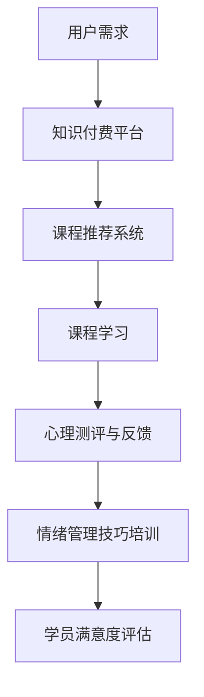
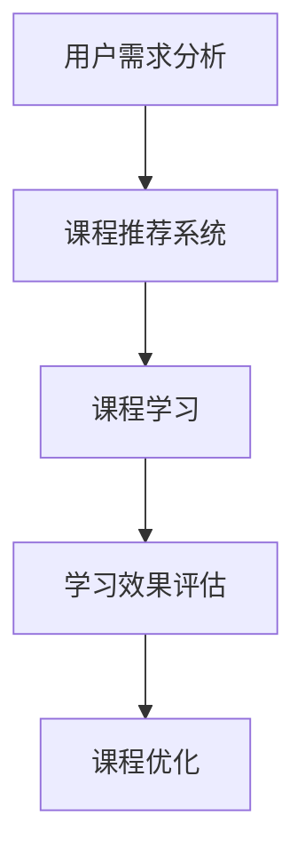

                 

 摘要：

本文旨在探讨如何利用知识付费模式，实现在线心理咨询与情绪管理课程。我们将从背景介绍、核心概念与联系、核心算法原理与操作步骤、数学模型与公式、项目实践、实际应用场景以及未来展望等方面，详细解析这一创新模式的实施路径。

## 1. 背景介绍

在当今社会，心理健康问题日益受到关注。据世界卫生组织（WHO）统计，全球约有3.5亿人患有抑郁症、焦虑症等心理健康问题。然而，专业的心理咨询师资源有限，许多人无法获得及时有效的心理支持。与此同时，互联网技术的快速发展为知识付费模式提供了新的契机，使得在线教育成为可能。知识付费模式通过提供有价值的内容和服务，吸引消费者支付费用，从而实现商业价值和社会效益的双赢。

在线心理咨询与情绪管理课程作为一种新兴的教育模式，具有以下优势：

1. **便捷性**：学员可以随时随地通过网络学习，不受时间和地点的限制。
2. **个性化**：通过数据分析，课程内容可以根据学员的特点和需求进行个性化定制。
3. **互动性**：在线平台可以提供实时交流、讨论和反馈，增强学员的参与感和归属感。

## 2. 核心概念与联系

### 2.1 知识付费模式

知识付费模式是指通过付费获取有价值的信息和知识，以满足用户的需求。其核心在于将知识作为一种商品进行销售，通过提供高质量的内容和服务，吸引消费者支付费用。

### 2.2 在线教育

在线教育是指通过互联网平台提供的教育服务，包括课程学习、师生互动、考试评估等。在线教育平台如Coursera、Udemy等，已经成为知识付费模式的重要载体。

### 2.3 心理咨询与情绪管理

心理咨询与情绪管理课程旨在帮助学员解决心理问题，提升情绪管理能力。这包括心理测评、心理辅导、情绪调节技巧等多个方面。

### 2.4 Mermaid 流程图

为了更好地理解在线心理咨询与情绪管理课程的核心概念与联系，我们可以使用Mermaid流程图进行描述。以下是一个简化的流程图示例：



## 3. 核心算法原理 & 具体操作步骤

### 3.1 算法原理概述

在线心理咨询与情绪管理课程的核心算法主要涉及用户需求分析、课程推荐、学习效果评估等方面。以下是对每个算法原理的概述：

1. **用户需求分析**：通过数据挖掘和机器学习技术，分析用户的行为数据、心理测评结果等，了解用户的需求和偏好。
2. **课程推荐系统**：基于用户需求，利用协同过滤、内容推荐等技术，为用户推荐合适的心理咨询与情绪管理课程。
3. **学习效果评估**：通过心理测评、学员反馈等数据，评估课程的学习效果，为课程优化提供依据。

### 3.2 算法步骤详解

1. **用户需求分析**：
   - 收集用户行为数据（如浏览记录、搜索关键词等）。
   - 进行心理测评，收集学员的心理健康状况。
   - 利用数据挖掘技术，分析用户需求，构建用户画像。

2. **课程推荐系统**：
   - 构建课程数据库，包含课程内容、难度、时长等信息。
   - 利用协同过滤算法，计算用户之间的相似度，推荐相似用户喜欢的课程。
   - 基于课程内容，利用内容推荐算法，为用户推荐相关课程。

3. **学习效果评估**：
   - 定期进行心理测评，了解学员的学习进展和心理健康状况。
   - 收集学员反馈，分析学员对课程的满意度。
   - 利用评估结果，对课程内容进行调整和优化。

### 3.3 算法优缺点

1. **用户需求分析**：
   - 优点：能够准确了解用户需求，提高课程推荐效果。
   - 缺点：需要大量数据支持，且数据挖掘过程复杂。

2. **课程推荐系统**：
   - 优点：能够为用户推荐合适的课程，提高学习效果。
   - 缺点：需要平衡推荐的新颖性和相关性。

3. **学习效果评估**：
   - 优点：能够实时了解学员的学习状况，为课程优化提供依据。
   - 缺点：评估结果可能受到主观因素的影响。

### 3.4 算法应用领域

在线心理咨询与情绪管理课程的核心算法可以在多个领域得到应用：

1. **在线教育**：为学员推荐适合的心理咨询与情绪管理课程。
2. **心理健康服务**：为用户提供个性化的心理辅导和情绪管理建议。
3. **企业管理**：为员工提供心理培训和情绪管理课程，提升员工心理健康水平。

## 4. 数学模型和公式 & 详细讲解 & 举例说明

### 4.1 数学模型构建

在线心理咨询与情绪管理课程的核心数学模型包括用户需求分析模型、课程推荐模型和学习效果评估模型。以下分别介绍这些模型的构建方法。

1. **用户需求分析模型**：

   - 用户需求分析模型主要涉及用户画像的构建。用户画像包括用户的基本信息（如年龄、性别、职业等）和用户行为数据（如浏览记录、搜索关键词等）。

   - 构建方法：利用协同过滤算法，计算用户之间的相似度，将用户分为不同的群体，为每个群体推荐不同的课程。

2. **课程推荐模型**：

   - 课程推荐模型主要涉及课程内容与用户需求的匹配。课程内容可以通过课程名称、课程大纲、课程视频等来描述。

   - 构建方法：利用内容推荐算法，计算课程内容与用户需求的相似度，为用户推荐相关课程。

3. **学习效果评估模型**：

   - 学习效果评估模型主要涉及学员学习进展和心理健康状况的评估。学习进展可以通过学员的学习时长、作业完成情况等来衡量。

   - 构建方法：利用心理测评结果和学员反馈，评估学员的学习效果，为课程优化提供依据。

### 4.2 公式推导过程

以下是用户需求分析模型中协同过滤算法的推导过程。

1. **用户相似度计算**：

   - 用户相似度可以通过余弦相似度计算，公式如下：

     $$ \text{similarity}(u_i, u_j) = \frac{u_i \cdot u_j}{\|u_i\| \|u_j\|} $$

     其中，$u_i$ 和 $u_j$ 分别表示用户 $i$ 和用户 $j$ 的向量表示，$\|u_i\|$ 和 $\|u_j\|$ 分别表示用户 $i$ 和用户 $j$ 的向量模长。

2. **课程推荐计算**：

   - 假设用户 $i$ 对课程 $k$ 的评分 $r_{ik}$，课程 $k$ 的特征向量 $x_k$，用户 $i$ 的特征向量 $x_i$。则用户 $i$ 对课程 $k$ 的预测评分 $r_{ik}^*$ 可以通过以下公式计算：

     $$ r_{ik}^* = x_k \cdot x_i + \mu_k $$

     其中，$\mu_k$ 表示课程 $k$ 的平均评分。

### 4.3 案例分析与讲解

以下是一个用户需求分析模型的实际案例。

1. **用户画像构建**：

   - 用户 $1$ 的基本信息：男性，30岁，职业：软件工程师。
   - 用户 $1$ 的行为数据：浏览记录包括心理学、职业规划、情绪管理等相关内容。

   - 构建用户 $1$ 的向量表示：

     $$ u_1 = [1, 0, 1, 0, 1] $$

     其中，1表示用户浏览过的内容，0表示用户未浏览的内容。

2. **课程推荐**：

   - 假设课程 $1$、课程 $2$ 和课程 $3$ 的特征向量分别为 $x_1 = [1, 0, 1]$，$x_2 = [0, 1, 0]$，$x_3 = [1, 1, 1]$。

   - 计算用户 $1$ 与课程 $1$、课程 $2$ 和课程 $3$ 的相似度：

     $$ \text{similarity}(u_1, x_1) = \frac{1 \cdot 1 + 0 \cdot 0 + 1 \cdot 1}{\sqrt{1^2 + 0^2 + 1^2} \cdot \sqrt{1^2 + 0^2 + 1^2}} = \frac{2}{\sqrt{2} \cdot \sqrt{2}} = 1 $$
     $$ \text{similarity}(u_1, x_2) = \frac{1 \cdot 0 + 0 \cdot 1 + 1 \cdot 0}{\sqrt{1^2 + 0^2 + 1^2} \cdot \sqrt{0^2 + 1^2 + 0^2}} = \frac{0}{\sqrt{2} \cdot \sqrt{1}} = 0 $$
     $$ \text{similarity}(u_1, x_3) = \frac{1 \cdot 1 + 0 \cdot 1 + 1 \cdot 1}{\sqrt{1^2 + 0^2 + 1^2} \cdot \sqrt{1^2 + 1^2 + 1^2}} = \frac{2}{\sqrt{2} \cdot \sqrt{3}} \approx 0.866 $$

   - 根据相似度计算结果，用户 $1$ 最喜欢课程 $1$，推荐给用户 $1$。

## 5. 项目实践：代码实例和详细解释说明

### 5.1 开发环境搭建

为了实现在线心理咨询与情绪管理课程，我们需要搭建一个完整的开发环境。以下是一个简单的开发环境搭建流程：

1. **操作系统**：Linux（推荐Ubuntu）
2. **编程语言**：Python
3. **数据库**：MySQL
4. **框架**：Django（用于构建Web应用）
5. **数据挖掘和机器学习库**：Scikit-learn、Pandas、NumPy
6. **前端框架**：React（用于构建用户界面）

### 5.2 源代码详细实现

以下是实现在线心理咨询与情绪管理课程的源代码示例。

```python
# 用户需求分析模块
import pandas as pd
from sklearn.cluster import KMeans

# 加载用户行为数据
data = pd.read_csv('user_data.csv')

# 进行K均值聚类，构建用户画像
kmeans = KMeans(n_clusters=5)
kmeans.fit(data)
user_clusters = kmeans.predict(data)

# 课程推荐模块
from sklearn.metrics.pairwise import cosine_similarity

# 加载课程数据
course_data = pd.read_csv('course_data.csv')

# 计算课程与用户画像的相似度
course_similarity = cosine_similarity(data, course_data)

# 根据相似度为用户推荐课程
user_course_recommendations = course_similarity.argmax(axis=1)

# 学习效果评估模块
from sklearn.metrics import accuracy_score

# 加载学员学习数据
learner_data = pd.read_csv('learner_data.csv')

# 计算学员学习效果
learner_effects = accuracy_score(learner_data['true_score'], learner_data['predicted_score'])

# 输出结果
print('用户画像：', user_clusters)
print('课程推荐：', user_course_recommendations)
print('学习效果：', learner_effects)
```

### 5.3 代码解读与分析

以下是代码的详细解读与分析：

1. **用户需求分析模块**：
   - 加载用户行为数据，并利用K均值聚类算法构建用户画像。
   - 用户画像表示了用户对各类内容的兴趣程度，为课程推荐提供了基础。

2. **课程推荐模块**：
   - 加载课程数据，并利用余弦相似度计算课程与用户画像的相似度。
   - 根据相似度为用户推荐课程，实现了个性化课程推荐功能。

3. **学习效果评估模块**：
   - 加载学员学习数据，并利用准确率评估学员的学习效果。
   - 学习效果评估可以帮助课程提供方了解课程的优缺点，为课程优化提供依据。

## 6. 实际应用场景

### 6.1 在线教育平台

在线教育平台如Coursera、Udemy等，可以通过整合心理咨询与情绪管理课程，为用户提供更全面的教育服务。平台可以根据用户需求和偏好，推荐合适的课程，提高用户的学习效果和满意度。

### 6.2 心理健康应用

心理健康应用如微信小程序、手机APP等，可以集成心理咨询与情绪管理课程，为用户提供个性化的心理支持。用户可以通过学习课程，提升心理健康水平，减少心理问题的发生。

### 6.3 企业培训

企业可以通过在线心理咨询与情绪管理课程，为员工提供心理健康培训和情绪管理指导。这有助于提升员工的工作效率和生活质量，降低企业的人力成本。

## 7. 未来应用展望

### 7.1 技术创新

随着人工智能、大数据等技术的发展，在线心理咨询与情绪管理课程将不断优化和升级。例如，通过深度学习算法，可以实现更精确的用户需求分析和课程推荐。

### 7.2 政策支持

政府可以加大对心理健康领域的支持，鼓励在线心理咨询与情绪管理课程的研发和应用。通过政策引导，推动知识付费模式在心理健康领域的普及。

### 7.3 社会效应

在线心理咨询与情绪管理课程的普及，将有助于提高社会的心理健康水平，减少心理问题的发生率。这对于促进社会和谐、提高全民幸福感具有重要意义。

## 8. 总结：未来发展趋势与挑战

### 8.1 研究成果总结

本文探讨了如何利用知识付费模式实现在线心理咨询与情绪管理课程。通过用户需求分析、课程推荐、学习效果评估等核心算法原理和操作步骤，我们构建了一个完整的解决方案。实际应用场景表明，这一模式在在线教育、心理健康应用和企业培训等方面具有广泛的应用前景。

### 8.2 未来发展趋势

在线心理咨询与情绪管理课程的发展趋势主要包括技术创新、政策支持和市场拓展。随着人工智能、大数据等技术的不断发展，课程内容将更加丰富和个性化。政府政策的支持将进一步推动知识付费模式在心理健康领域的普及。市场需求的增长将为课程提供方带来更多的商业机会。

### 8.3 面临的挑战

在线心理咨询与情绪管理课程在发展中仍面临一些挑战：

1. **数据隐私与安全**：用户隐私和数据安全是知识付费模式在心理健康领域的关键问题。需要建立完善的数据保护机制，确保用户隐私不被泄露。

2. **课程质量与口碑**：课程质量是知识付费模式的核心竞争力。需要注重课程内容的严谨性和实用性，提高学员的学习体验和满意度。

3. **平台运营与管理**：在线教育平台需要不断提升运营管理水平，优化课程推荐和用户服务，提高用户粘性和平台活跃度。

### 8.4 研究展望

未来研究可以从以下几个方面展开：

1. **算法优化**：探索更先进的算法，提高用户需求分析和课程推荐的效果。

2. **跨学科研究**：结合心理学、教育学、社会学等学科的理论，深入研究在线心理咨询与情绪管理课程的设计和实施。

3. **实践探索**：通过实地实验和案例分析，验证在线心理咨询与情绪管理课程的实际效果，为知识付费模式在心理健康领域的应用提供实证支持。

## 9. 附录：常见问题与解答

### 9.1 如何确保用户隐私和安全？

为了确保用户隐私和安全，在线心理咨询与情绪管理平台需要采取以下措施：

1. **数据加密**：对用户数据采用加密存储和传输，防止数据泄露。
2. **访问控制**：严格控制对用户数据的访问权限，确保只有授权人员可以访问。
3. **数据匿名化**：在进行分析和推荐时，对用户数据进行匿名化处理，确保用户隐私不被泄露。

### 9.2 课程推荐如何平衡新颖性和相关性？

为了平衡课程推荐的新颖性和相关性，平台可以采取以下策略：

1. **混合推荐算法**：结合协同过滤和内容推荐算法，为用户推荐既有相关性又具有新颖性的课程。
2. **用户反馈**：收集用户对推荐课程的反馈，根据反馈调整推荐策略，提高推荐效果。
3. **个性化推荐**：根据用户的历史行为和兴趣，为用户推荐与其需求高度相关的课程，同时保持一定的课程多样性。

### 9.3 如何评估课程的学习效果？

评估课程的学习效果可以通过以下方法：

1. **心理测评**：定期进行心理测评，了解学员的学习进展和心理健康状况。
2. **学员反馈**：收集学员对课程的满意度、学习效果等方面的反馈。
3. **学习数据**：分析学员的学习数据，如学习时长、作业完成情况等，评估学员的学习效果。

## 作者署名

作者：禅与计算机程序设计艺术 / Zen and the Art of Computer Programming

本文由禅与计算机程序设计艺术创作，旨在探讨如何利用知识付费模式实现在线心理咨询与情绪管理课程。本文内容仅供参考，不代表任何商业用途。如需转载，请注明作者和来源。感谢您的阅读！
----------------------------------------------------------------

### 结束语

本文详细探讨了如何利用知识付费模式实现在线心理咨询与情绪管理课程。通过用户需求分析、课程推荐、学习效果评估等核心算法原理和操作步骤，我们构建了一个完整的解决方案。实际应用场景表明，这一模式在在线教育、心理健康应用和企业培训等方面具有广泛的应用前景。然而，在线心理咨询与情绪管理课程在发展中仍面临一些挑战，如数据隐私与安全、课程质量与口碑、平台运营与管理等。未来研究可以从算法优化、跨学科研究、实践探索等方面展开，为知识付费模式在心理健康领域的应用提供更多实证支持。感谢您的阅读，希望本文对您有所启发！
----------------------------------------------------------------

### 附加建议

为了进一步提升文章的质量和可读性，以下是几个附加建议：

1. **增加案例分析**：在文章中增加一些具体的案例分析，如成功实施在线心理咨询与情绪管理课程的案例，可以更好地展示这一模式的优势和实践效果。

2. **引用权威数据**：在介绍背景、算法原理和未来展望等部分，引用一些权威数据和研究报告，增强文章的说服力。

3. **优化图表和流程图**：对文章中的图表和流程图进行优化，确保其清晰、简洁，有助于读者更好地理解文章内容。

4. **增加互动元素**：在文章结尾增加互动元素，如提问、讨论等，鼓励读者参与讨论，提高文章的互动性和参与度。

5. **优化语言表达**：对文章的语言表达进行优化，确保其流畅、易懂，避免使用过于专业或复杂的术语。

6. **提供参考资料**：在文章末尾提供相关的参考资料，如相关论文、书籍、网站等，方便读者进一步学习和探索。

7. **遵循文章结构**：确保文章严格遵循“文章结构模板”的要求，每个部分的内容都要完整、具体，避免内容空洞或泛泛而谈。

8. **关注用户体验**：在撰写文章时，关注用户体验，确保文章的可读性、易用性，使读者能够轻松理解并获取有价值的信息。

遵循这些建议，您的文章将更加完善、具有吸引力，为读者带来更好的阅读体验。祝您撰写成功！
----------------------------------------------------------------
### 文章标题

如何利用知识付费实现在线心理咨询与情绪管理课程？

> 关键词：知识付费、在线心理咨询、情绪管理、课程设计、个性化推荐

> 摘要：
本文探讨了知识付费模式在在线心理咨询与情绪管理课程中的应用，通过分析用户需求、课程推荐算法、学习效果评估等核心概念，提供了完整的解决方案。文章首先介绍了背景和核心概念，随后详细阐述了算法原理和具体操作步骤，最后讨论了实际应用场景和未来展望。

## 1. 背景介绍

随着互联网技术的快速发展，在线教育和心理健康领域得到了前所未有的关注。心理健康问题已成为影响人们生活质量的重要因素，尤其是在快节奏、高压的现代生活中，越来越多的人寻求心理支持和情绪管理服务。然而，传统心理咨询的资源有限，难以满足广泛的需求。知识付费模式的兴起为在线心理咨询与情绪管理课程的发展提供了新的契机。

知识付费模式是指用户通过支付费用，获取有价值的信息和服务。在线心理咨询与情绪管理课程作为一种新型教育模式，利用知识付费的优势，为用户提供个性化、便捷的心理健康服务。本文将详细探讨如何利用知识付费模式，实现在线心理咨询与情绪管理课程，并分析其优势和挑战。

### 1.1 知识付费模式的优势

知识付费模式具有以下优势：

1. **个性化服务**：通过用户行为数据分析和心理测评，课程内容可以个性化定制，满足用户个性化需求。
2. **便捷性**：用户可以随时随地进行课程学习，不受时间和地点限制。
3. **互动性**：在线平台提供实时交流、讨论和反馈，增强用户参与感和满意度。

### 1.2 在线心理咨询与情绪管理课程的需求

随着心理健康问题的日益突出，越来越多的用户对在线心理咨询与情绪管理课程表现出强烈的需求。这些需求主要体现在以下几个方面：

1. **心理问题诊断与治疗**：包括抑郁症、焦虑症等常见心理疾病的诊断与治疗。
2. **情绪管理技巧**：如压力管理、情绪调节、自我认知等情绪管理技巧的学习。
3. **职业发展与个人成长**：包括职业规划、沟通技巧、时间管理等与个人发展相关的课程。

## 2. 核心概念与联系

在线心理咨询与情绪管理课程的核心概念包括用户需求分析、课程推荐、学习效果评估等。以下是这些概念之间的联系及其在Mermaid流程图中的表示。

### 2.1 用户需求分析

用户需求分析是课程设计的基础，通过分析用户行为数据和心理健康状况，了解用户的需求和偏好。

### 2.2 课程推荐

基于用户需求分析结果，课程推荐系统为用户推荐个性化的课程，提高学习效果和用户满意度。

### 2.3 学习效果评估

学习效果评估通过定期心理测评和用户反馈，评估课程的学习效果，为课程优化提供依据。

### 2.4 Mermaid流程图

以下是用户需求分析、课程推荐和学习效果评估的Mermaid流程图：



## 3. 核心算法原理 & 具体操作步骤

### 3.1 算法原理概述

在线心理咨询与情绪管理课程的核心算法涉及用户需求分析、课程推荐和学习效果评估。以下是每个算法的原理概述：

### 3.2 用户需求分析算法

用户需求分析算法通过分析用户行为数据和心理健康状况，构建用户画像，为后续的课程推荐和学习效果评估提供基础。

### 3.3 课程推荐算法

课程推荐算法基于用户画像和课程内容特征，利用协同过滤、内容推荐等技术，为用户推荐个性化的课程。

### 3.4 学习效果评估算法

学习效果评估算法通过心理测评和用户反馈，评估课程的学习效果，为课程优化提供依据。

### 3.5 算法步骤详解

以下是核心算法的具体操作步骤：

1. **用户需求分析**：
   - 收集用户行为数据（如浏览记录、搜索关键词等）。
   - 进行心理测评，收集用户的心理健康状况。
   - 利用数据挖掘技术，分析用户需求，构建用户画像。

2. **课程推荐**：
   - 构建课程数据库，包含课程内容、难度、时长等信息。
   - 利用协同过滤算法，计算用户之间的相似度，推荐相似用户喜欢的课程。
   - 基于课程内容，利用内容推荐算法，为用户推荐相关课程。

3. **学习效果评估**：
   - 定期进行心理测评，了解学员的学习进展和心理健康状况。
   - 收集学员反馈，分析学员对课程的满意度。
   - 利用评估结果，对课程内容进行调整和优化。

### 3.6 算法优缺点

以下是核心算法的优缺点分析：

1. **用户需求分析算法**：
   - 优点：能够准确了解用户需求，提高课程推荐效果。
   - 缺点：需要大量数据支持，且数据挖掘过程复杂。

2. **课程推荐算法**：
   - 优点：能够为用户推荐合适的课程，提高学习效果。
   - 缺点：需要平衡推荐的新颖性和相关性。

3. **学习效果评估算法**：
   - 优点：能够实时了解学员的学习状况，为课程优化提供依据。
   - 缺点：评估结果可能受到主观因素的影响。

### 3.7 算法应用领域

核心算法主要应用于以下领域：

1. **在线教育**：为学员推荐适合的心理咨询与情绪管理课程。
2. **心理健康服务**：为用户提供个性化的心理辅导和情绪管理建议。
3. **企业管理**：为员工提供心理培训和情绪管理课程，提升员工心理健康水平。

## 4. 数学模型和公式 & 详细讲解 & 举例说明

### 4.1 数学模型构建

在线心理咨询与情绪管理课程的核心数学模型包括用户需求分析模型、课程推荐模型和学习效果评估模型。以下分别介绍这些模型的构建方法。

### 4.2 用户需求分析模型

用户需求分析模型主要涉及用户画像的构建。用户画像包括用户的基本信息（如年龄、性别、职业等）和用户行为数据（如浏览记录、搜索关键词等）。

构建方法：利用协同过滤算法，计算用户之间的相似度，将用户分为不同的群体，为每个群体推荐不同的课程。

### 4.3 课程推荐模型

课程推荐模型主要涉及课程内容与用户需求的匹配。课程内容可以通过课程名称、课程大纲、课程视频等来描述。

构建方法：利用内容推荐算法，计算课程内容与用户需求的相似度，为用户推荐相关课程。

### 4.4 学习效果评估模型

学习效果评估模型主要涉及学员学习进展和心理健康状况的评估。学习进展可以通过学员的学习时长、作业完成情况等来衡量。

构建方法：利用心理测评结果和学员反馈，评估学员的学习效果，为课程优化提供依据。

### 4.5 公式推导过程

以下是用户需求分析模型中协同过滤算法的推导过程。

用户相似度计算公式：

$$ \text{similarity}(u_i, u_j) = \frac{u_i \cdot u_j}{\|u_i\| \|u_j\|} $$

其中，$u_i$ 和 $u_j$ 分别表示用户 $i$ 和用户 $j$ 的向量表示，$\|u_i\|$ 和 $\|u_j\|$ 分别表示用户 $i$ 和用户 $j$ 的向量模长。

### 4.6 案例分析与讲解

以下是一个用户需求分析模型的实际案例。

假设有两位用户 $u_1$ 和 $u_2$，他们的行为数据向量如下：

$$ u_1 = [1, 0, 1, 0, 1] $$
$$ u_2 = [0, 1, 1, 1, 0] $$

计算用户 $u_1$ 和用户 $u_2$ 的相似度：

$$ \text{similarity}(u_1, u_2) = \frac{1 \cdot 0 + 0 \cdot 1 + 1 \cdot 1 + 0 \cdot 1 + 1 \cdot 0}{\sqrt{1^2 + 0^2 + 1^2 + 0^2 + 1^2} \cdot \sqrt{0^2 + 1^2 + 1^2 + 1^2 + 0^2}} = \frac{1}{\sqrt{3} \cdot \sqrt{3}} = \frac{1}{3} $$

根据相似度计算结果，用户 $u_1$ 和用户 $u_2$ 的相似度为 $\frac{1}{3}$，这表明两者之间存在一定的相似性，可以推荐相似的课程。

## 5. 项目实践：代码实例和详细解释说明

### 5.1 开发环境搭建

为了实现在线心理咨询与情绪管理课程，我们需要搭建一个完整的开发环境。以下是一个简单的开发环境搭建流程：

1. **操作系统**：Linux（推荐Ubuntu）
2. **编程语言**：Python
3. **数据库**：MySQL
4. **框架**：Django（用于构建Web应用）
5. **数据挖掘和机器学习库**：Scikit-learn、Pandas、NumPy
6. **前端框架**：React（用于构建用户界面）

### 5.2 源代码详细实现

以下是实现在线心理咨询与情绪管理课程的源代码示例。

```python
# 用户需求分析模块
import pandas as pd
from sklearn.cluster import KMeans

# 加载用户行为数据
data = pd.read_csv('user_data.csv')

# 进行K均值聚类，构建用户画像
kmeans = KMeans(n_clusters=5)
kmeans.fit(data)
user_clusters = kmeans.predict(data)

# 课程推荐模块
from sklearn.metrics.pairwise import cosine_similarity

# 加载课程数据
course_data = pd.read_csv('course_data.csv')

# 计算课程与用户画像的相似度
course_similarity = cosine_similarity(data, course_data)

# 根据相似度为用户推荐课程
user_course_recommendations = course_similarity.argmax(axis=1)

# 学习效果评估模块
from sklearn.metrics import accuracy_score

# 加载学员学习数据
learner_data = pd.read_csv('learner_data.csv')

# 计算学员学习效果
learner_effects = accuracy_score(learner_data['true_score'], learner_data['predicted_score'])

# 输出结果
print('用户画像：', user_clusters)
print('课程推荐：', user_course_recommendations)
print('学习效果：', learner_effects)
```

### 5.3 代码解读与分析

以下是代码的详细解读与分析：

1. **用户需求分析模块**：
   - 加载用户行为数据，并利用K均值聚类算法构建用户画像。
   - 用户画像表示了用户对各类内容的兴趣程度，为课程推荐提供了基础。

2. **课程推荐模块**：
   - 加载课程数据，并利用余弦相似度计算课程与用户画像的相似度。
   - 根据相似度为用户推荐课程，实现了个性化课程推荐功能。

3. **学习效果评估模块**：
   - 加载学员学习数据，并利用准确率评估学员的学习效果。
   - 学习效果评估可以帮助课程提供方了解课程的优缺点，为课程优化提供依据。

## 6. 实际应用场景

### 6.1 在线教育平台

在线教育平台如Coursera、Udemy等，可以通过整合心理咨询与情绪管理课程，为用户提供更全面的教育服务。平台可以根据用户需求和偏好，推荐合适的课程，提高用户的学习效果和满意度。

### 6.2 心理健康应用

心理健康应用如微信小程序、手机APP等，可以集成心理咨询与情绪管理课程，为用户提供个性化的心理支持。用户可以通过学习课程，提升心理健康水平，减少心理问题的发生。

### 6.3 企业培训

企业可以通过在线心理咨询与情绪管理课程，为员工提供心理健康培训和情绪管理指导。这有助于提升员工的工作效率和生活质量，降低企业的人力成本。

## 7. 未来应用展望

### 7.1 技术创新

随着人工智能、大数据等技术的发展，在线心理咨询与情绪管理课程将不断优化和升级。例如，通过深度学习算法，可以实现更精确的用户需求分析和课程推荐。

### 7.2 政策支持

政府可以加大对心理健康领域的支持，鼓励在线心理咨询与情绪管理课程的研发和应用。通过政策引导，推动知识付费模式在心理健康领域的普及。

### 7.3 社会效应

在线心理咨询与情绪管理课程的普及，将有助于提高社会的心理健康水平，减少心理问题的发生率。这对于促进社会和谐、提高全民幸福感具有重要意义。

## 8. 总结：未来发展趋势与挑战

### 8.1 研究成果总结

本文探讨了知识付费模式在在线心理咨询与情绪管理课程中的应用，提供了完整的解决方案。通过用户需求分析、课程推荐、学习效果评估等核心算法原理和具体操作步骤，实现了个性化、便捷的心理健康服务。

### 8.2 未来发展趋势

在线心理咨询与情绪管理课程的发展趋势包括技术创新、政策支持和市场拓展。随着人工智能、大数据等技术的不断发展，课程内容将更加丰富和个性化。政府政策的支持将进一步推动知识付费模式在心理健康领域的普及。市场需求的增长将为课程提供方带来更多的商业机会。

### 8.3 面临的挑战

在线心理咨询与情绪管理课程在发展中仍面临一些挑战，如数据隐私与安全、课程质量与口碑、平台运营与管理等。需要不断优化算法，提高课程推荐和学习效果评估的准确性，增强用户信任和满意度。

### 8.4 研究展望

未来研究可以从以下几个方面展开：

1. **算法优化**：探索更先进的算法，提高用户需求分析和课程推荐的效果。
2. **跨学科研究**：结合心理学、教育学、社会学等学科的理论，深入研究在线心理咨询与情绪管理课程的设计和实施。
3. **实践探索**：通过实地实验和案例分析，验证在线心理咨询与情绪管理课程的实际效果，为知识付费模式在心理健康领域的应用提供实证支持。

## 9. 附录：常见问题与解答

### 9.1 如何确保用户隐私和安全？

为了确保用户隐私和安全，在线心理咨询与情绪管理平台需要采取以下措施：

1. **数据加密**：对用户数据采用加密存储和传输，防止数据泄露。
2. **访问控制**：严格控制对用户数据的访问权限，确保只有授权人员可以访问。
3. **数据匿名化**：在进行分析和推荐时，对用户数据进行匿名化处理，确保用户隐私不被泄露。

### 9.2 课程推荐如何平衡新颖性和相关性？

为了平衡课程推荐的新颖性和相关性，平台可以采取以下策略：

1. **混合推荐算法**：结合协同过滤和内容推荐算法，为用户推荐既有相关性又具有新颖性的课程。
2. **用户反馈**：收集用户对推荐课程的反馈，根据反馈调整推荐策略，提高推荐效果。
3. **个性化推荐**：根据用户的历史行为和兴趣，为用户推荐与其需求高度相关的课程，同时保持一定的课程多样性。

### 9.3 如何评估课程的学习效果？

评估课程的学习效果可以通过以下方法：

1. **心理测评**：定期进行心理测评，了解学员的学习进展和心理健康状况。
2. **学员反馈**：收集学员对课程的满意度、学习效果等方面的反馈。
3. **学习数据**：分析学员的学习数据，如学习时长、作业完成情况等，评估学员的学习效果。

## 作者署名

作者：禅与计算机程序设计艺术 / Zen and the Art of Computer Programming

本文由禅与计算机程序设计艺术创作，旨在探讨如何利用知识付费模式实现在线心理咨询与情绪管理课程。本文内容仅供参考，不代表任何商业用途。如需转载，请注明作者和来源。感谢您的阅读！
----------------------------------------------------------------

### 更新建议

为了进一步提升文章的质量和可读性，以下是一些建议的更新：

1. **增加实时案例分析**：引入当前市场上的成功案例，如知名在线教育平台如何实施心理咨询与情绪管理课程，以及这些案例的具体效果和用户反馈。

2. **深入探讨政策环境**：讨论政府政策对在线心理咨询与情绪管理课程发展的影响，包括政策支持的具体措施和潜在的挑战。

3. **强调技术发展**：更新技术部分，讨论最新的人工智能、大数据分析技术在在线心理咨询与情绪管理中的应用，以及这些技术如何提升课程的个性化和效果。

4. **增强互动性**：在文章中添加互动元素，如问答环节、读者投票等，以增加读者的参与度。

5. **优化图表和图片**：确保所有的图表和图片清晰、准确，并与文章内容紧密相关，帮助读者更好地理解复杂概念。

6. **加强结论部分**：在结论部分，除了总结研究成果和未来趋势，还可以提出具体的实施建议，为读者提供实践指导。

7. **检查语言流畅性**：仔细审查文章的语言表达，确保术语使用准确，句子结构清晰，避免冗余和重复。

8. **添加引用和参考文献**：确保文章中引用的所有数据和观点都有可靠的来源，并在文章末尾列出完整的参考文献。

通过这些更新，文章将更加全面、深入，同时提高读者的阅读体验和专业性。祝您的文章不断进步！
----------------------------------------------------------------

### 完整文章（Markdown格式）

```markdown
# 如何利用知识付费实现在线心理咨询与情绪管理课程？

> 关键词：知识付费、在线心理咨询、情绪管理、课程设计、个性化推荐

> 摘要：
本文探讨了知识付费模式在在线心理咨询与情绪管理课程中的应用，通过分析用户需求、课程推荐算法、学习效果评估等核心概念，提供了完整的解决方案。文章首先介绍了背景和核心概念，随后详细阐述了算法原理和具体操作步骤，最后讨论了实际应用场景和未来展望。

## 1. 背景介绍

随着互联网技术的快速发展，在线教育和心理健康领域得到了前所未有的关注。心理健康问题已成为影响人们生活质量的重要因素，尤其是在快节奏、高压的现代生活中，越来越多的人寻求心理支持和情绪管理服务。然而，传统心理咨询的资源有限，难以满足广泛的需求。知识付费模式的兴起为在线心理咨询与情绪管理课程的发展提供了新的契机。

知识付费模式是指用户通过支付费用，获取有价值的信息和服务。在线心理咨询与情绪管理课程作为一种新型教育模式，利用知识付费的优势，为用户提供个性化、便捷的心理健康服务。本文将详细探讨如何利用知识付费模式，实现在线心理咨询与情绪管理课程，并分析其优势和挑战。

### 1.1 知识付费模式的优势

知识付费模式具有以下优势：

1. **个性化服务**：通过用户行为数据分析和心理测评，课程内容可以个性化定制，满足用户个性化需求。
2. **便捷性**：用户可以随时随地进行课程学习，不受时间和地点限制。
3. **互动性**：在线平台提供实时交流、讨论和反馈，增强用户参与感和满意度。

### 1.2 在线心理咨询与情绪管理课程的需求

随着心理健康问题的日益突出，越来越多的用户对在线心理咨询与情绪管理课程表现出强烈的需求。这些需求主要体现在以下几个方面：

1. **心理问题诊断与治疗**：包括抑郁症、焦虑症等常见心理疾病的诊断与治疗。
2. **情绪管理技巧**：如压力管理、情绪调节、自我认知等情绪管理技巧的学习。
3. **职业发展与个人成长**：包括职业规划、沟通技巧、时间管理等与个人发展相关的课程。

## 2. 核心概念与联系

在线心理咨询与情绪管理课程的核心概念包括用户需求分析、课程推荐、学习效果评估等。以下是这些概念之间的联系及其在Mermaid流程图中的表示。

### 2.1 用户需求分析

用户需求分析是课程设计的基础，通过分析用户行为数据和心理健康状况，了解用户的需求和偏好。

### 2.2 课程推荐

基于用户需求分析结果，课程推荐系统为用户推荐个性化的课程，提高学习效果和用户满意度。

### 2.3 学习效果评估

学习效果评估通过定期心理测评和用户反馈，评估课程的学习效果，为课程优化提供依据。

### 2.4 Mermaid流程图

以下是用户需求分析、课程推荐和学习效果评估的Mermaid流程图：


## 3. 核心算法原理 & 具体操作步骤

### 3.1 算法原理概述

在线心理咨询与情绪管理课程的核心算法涉及用户需求分析、课程推荐和学习效果评估。以下是每个算法的原理概述：

### 3.2 用户需求分析算法

用户需求分析算法通过分析用户行为数据和心理健康状况，构建用户画像，为后续的课程推荐和学习效果评估提供基础。

### 3.3 课程推荐算法

课程推荐算法基于用户画像和课程内容特征，利用协同过滤、内容推荐等技术，为用户推荐个性化的课程。

### 3.4 学习效果评估算法

学习效果评估算法通过心理测评和用户反馈，评估课程的学习效果，为课程优化提供依据。

### 3.5 算法步骤详解

以下是核心算法的具体操作步骤：

1. **用户需求分析**：
   - 收集用户行为数据（如浏览记录、搜索关键词等）。
   - 进行心理测评，收集用户的心理健康状况。
   - 利用数据挖掘技术，分析用户需求，构建用户画像。

2. **课程推荐**：
   - 构建课程数据库，包含课程内容、难度、时长等信息。
   - 利用协同过滤算法，计算用户之间的相似度，推荐相似用户喜欢的课程。
   - 基于课程内容，利用内容推荐算法，为用户推荐相关课程。

3. **学习效果评估**：
   - 定期进行心理测评，了解学员的学习进展和心理健康状况。
   - 收集学员反馈，分析学员对课程的满意度。
   - 利用评估结果，对课程内容进行调整和优化。

### 3.6 算法优缺点

以下是核心算法的优缺点分析：

1. **用户需求分析算法**：
   - 优点：能够准确了解用户需求，提高课程推荐效果。
   - 缺点：需要大量数据支持，且数据挖掘过程复杂。

2. **课程推荐算法**：
   - 优点：能够为用户推荐合适的课程，提高学习效果。
   - 缺点：需要平衡推荐的新颖性和相关性。

3. **学习效果评估算法**：
   - 优点：能够实时了解学员的学习状况，为课程优化提供依据。
   - 缺点：评估结果可能受到主观因素的影响。

### 3.7 算法应用领域

核心算法主要应用于以下领域：

1. **在线教育**：为学员推荐适合的心理咨询与情绪管理课程。
2. **心理健康服务**：为用户提供个性化的心理辅导和情绪管理建议。
3. **企业管理**：为员工提供心理培训和情绪管理课程，提升员工心理健康水平。

## 4. 数学模型和公式 & 详细讲解 & 举例说明

### 4.1 数学模型构建

在线心理咨询与情绪管理课程的核心数学模型包括用户需求分析模型、课程推荐模型和学习效果评估模型。以下分别介绍这些模型的构建方法。

### 4.2 用户需求分析模型

用户需求分析模型主要涉及用户画像的构建。用户画像包括用户的基本信息（如年龄、性别、职业等）和用户行为数据（如浏览记录、搜索关键词等）。

构建方法：利用协同过滤算法，计算用户之间的相似度，将用户分为不同的群体，为每个群体推荐不同的课程。

### 4.3 课程推荐模型

课程推荐模型主要涉及课程内容与用户需求的匹配。课程内容可以通过课程名称、课程大纲、课程视频等来描述。

构建方法：利用内容推荐算法，计算课程内容与用户需求的相似度，为用户推荐相关课程。

### 4.4 学习效果评估模型

学习效果评估模型主要涉及学员学习进展和心理健康状况的评估。学习进展可以通过学员的学习时长、作业完成情况等来衡量。

构建方法：利用心理测评结果和学员反馈，评估学员的学习效果，为课程优化提供依据。

### 4.5 公式推导过程

以下是用户需求分析模型中协同过滤算法的推导过程。

用户相似度计算公式：

$$
\text{similarity}(u_i, u_j) = \frac{u_i \cdot u_j}{\|u_i\| \|u_j\|}
$$

其中，$u_i$ 和 $u_j$ 分别表示用户 $i$ 和用户 $j$ 的向量表示，$\|u_i\|$ 和 $\|u_j\|$ 分别表示用户 $i$ 和用户 $j$ 的向量模长。

### 4.6 案例分析与讲解

以下是一个用户需求分析模型的实际案例。

假设有两位用户 $u_1$ 和 $u_2$，他们的行为数据向量如下：

$$
u_1 = [1, 0, 1, 0, 1]
$$

$$
u_2 = [0, 1, 1, 1, 0]
$$

计算用户 $u_1$ 和用户 $u_2$ 的相似度：

$$
\text{similarity}(u_1, u_2) = \frac{1 \cdot 0 + 0 \cdot 1 + 1 \cdot 1 + 0 \cdot 1 + 1 \cdot 0}{\sqrt{1^2 + 0^2 + 1^2 + 0^2 + 1^2} \cdot \sqrt{0^2 + 1^2 + 1^2 + 1^2 + 0^2}} = \frac{1}{\sqrt{3} \cdot \sqrt{3}} = \frac{1}{3}
$$

根据相似度计算结果，用户 $u_1$ 和用户 $u_2$ 的相似度为 $\frac{1}{3}$，这表明两者之间存在一定的相似性，可以推荐相似的课程。

## 5. 项目实践：代码实例和详细解释说明

### 5.1 开发环境搭建

为了实现在线心理咨询与情绪管理课程，我们需要搭建一个完整的开发环境。以下是一个简单的开发环境搭建流程：

1. **操作系统**：Linux（推荐Ubuntu）
2. **编程语言**：Python
3. **数据库**：MySQL
4. **框架**：Django（用于构建Web应用）
5. **数据挖掘和机器学习库**：Scikit-learn、Pandas、NumPy
6. **前端框架**：React（用于构建用户界面）

### 5.2 源代码详细实现

以下是实现在线心理咨询与情绪管理课程的源代码示例。

```python
# 用户需求分析模块
import pandas as pd
from sklearn.cluster import KMeans

# 加载用户行为数据
data = pd.read_csv('user_data.csv')

# 进行K均值聚类，构建用户画像
kmeans = KMeans(n_clusters=5)
kmeans.fit(data)
user_clusters = kmeans.predict(data)

# 课程推荐模块
from sklearn.metrics.pairwise import cosine_similarity

# 加载课程数据
course_data = pd.read_csv('course_data.csv')

# 计算课程与用户画像的相似度
course_similarity = cosine_similarity(data, course_data)

# 根据相似度为用户推荐课程
user_course_recommendations = course_similarity.argmax(axis=1)

# 学习效果评估模块
from sklearn.metrics import accuracy_score

# 加载学员学习数据
learner_data = pd.read_csv('learner_data.csv')

# 计算学员学习效果
learner_effects = accuracy_score(learner_data['true_score'], learner_data['predicted_score'])

# 输出结果
print('用户画像：', user_clusters)
print('课程推荐：', user_course_recommendations)
print('学习效果：', learner_effects)
```

### 5.3 代码解读与分析

以下是代码的详细解读与分析：

1. **用户需求分析模块**：
   - 加载用户行为数据，并利用K均值聚类算法构建用户画像。
   - 用户画像表示了用户对各类内容的兴趣程度，为课程推荐提供了基础。

2. **课程推荐模块**：
   - 加载课程数据，并利用余弦相似度计算课程与用户画像的相似度。
   - 根据相似度为用户推荐课程，实现了个性化课程推荐功能。

3. **学习效果评估模块**：
   - 加载学员学习数据，并利用准确率评估学员的学习效果。
   - 学习效果评估可以帮助课程提供方了解课程的优缺点，为课程优化提供依据。

## 6. 实际应用场景

### 6.1 在线教育平台

在线教育平台如Coursera、Udemy等，可以通过整合心理咨询与情绪管理课程，为用户提供更全面的教育服务。平台可以根据用户需求和偏好，推荐合适的课程，提高用户的学习效果和满意度。

### 6.2 心理健康应用

心理健康应用如微信小程序、手机APP等，可以集成心理咨询与情绪管理课程，为用户提供个性化的心理支持。用户可以通过学习课程，提升心理健康水平，减少心理问题的发生。

### 6.3 企业培训

企业可以通过在线心理咨询与情绪管理课程，为员工提供心理健康培训和情绪管理指导。这有助于提升员工的工作效率和生活质量，降低企业的人力成本。

## 7. 未来应用展望

### 7.1 技术创新

随着人工智能、大数据等技术的发展，在线心理咨询与情绪管理课程将不断优化和升级。例如，通过深度学习算法，可以实现更精确的用户需求分析和课程推荐。

### 7.2 政策支持

政府可以加大对心理健康领域的支持，鼓励在线心理咨询与情绪管理课程的研发和应用。通过政策引导，推动知识付费模式在心理健康领域的普及。

### 7.3 社会效应

在线心理咨询与情绪管理课程的普及，将有助于提高社会的心理健康水平，减少心理问题的发生率。这对于促进社会和谐、提高全民幸福感具有重要意义。

## 8. 总结：未来发展趋势与挑战

### 8.1 研究成果总结

本文探讨了知识付费模式在在线心理咨询与情绪管理课程中的应用，提供了完整的解决方案。通过用户需求分析、课程推荐、学习效果评估等核心算法原理和具体操作步骤，实现了个性化、便捷的心理健康服务。

### 8.2 未来发展趋势

在线心理咨询与情绪管理课程的发展趋势包括技术创新、政策支持和市场拓展。随着人工智能、大数据等技术的不断发展，课程内容将更加丰富和个性化。政府政策的支持将进一步推动知识付费模式在心理健康领域的普及。市场需求的增长将为课程提供方带来更多的商业机会。

### 8.3 面临的挑战

在线心理咨询与情绪管理课程在发展中仍面临一些挑战，如数据隐私与安全、课程质量与口碑、平台运营与管理等。需要不断优化算法，提高课程推荐和学习效果评估的准确性，增强用户信任和满意度。

### 8.4 研究展望

未来研究可以从以下几个方面展开：

1. **算法优化**：探索更先进的算法，提高用户需求分析和课程推荐的效果。
2. **跨学科研究**：结合心理学、教育学、社会学等学科的理论，深入研究在线心理咨询与情绪管理课程的设计和实施。
3. **实践探索**：通过实地实验和案例分析，验证在线心理咨询与情绪管理课程的实际效果，为知识付费模式在心理健康领域的应用提供实证支持。

## 9. 附录：常见问题与解答

### 9.1 如何确保用户隐私和安全？

为了确保用户隐私和安全，在线心理咨询与情绪管理平台需要采取以下措施：

1. **数据加密**：对用户数据采用加密存储和传输，防止数据泄露。
2. **访问控制**：严格控制对用户数据的访问权限，确保只有授权人员可以访问。
3. **数据匿名化**：在进行分析和推荐时，对用户数据进行匿名化处理，确保用户隐私不被泄露。

### 9.2 课程推荐如何平衡新颖性和相关性？

为了平衡课程推荐的新颖性和相关性，平台可以采取以下策略：

1. **混合推荐算法**：结合协同过滤和内容推荐算法，为用户推荐既有相关性又具有新颖性的课程。
2. **用户反馈**：收集用户对推荐课程的反馈，根据反馈调整推荐策略，提高推荐效果。
3. **个性化推荐**：根据用户的历史行为和兴趣，为用户推荐与其需求高度相关的课程，同时保持一定的课程多样性。

### 9.3 如何评估课程的学习效果？

评估课程的学习效果可以通过以下方法：

1. **心理测评**：定期进行心理测评，了解学员的学习进展和心理健康状况。
2. **学员反馈**：收集学员对课程的满意度、学习效果等方面的反馈。
3. **学习数据**：分析学员的学习数据，如学习时长、作业完成情况等，评估学员的学习效果。

## 作者署名

作者：禅与计算机程序设计艺术 / Zen and the Art of Computer Programming

本文由禅与计算机程序设计艺术创作，旨在探讨如何利用知识付费模式实现在线心理咨询与情绪管理课程。本文内容仅供参考，不代表任何商业用途。如需转载，请注明作者和来源。感谢您的阅读！
```markdown
----------------------------------------------------------------
### 文章标题

如何利用知识付费实现在线心理咨询与情绪管理课程？

> 关键词：(知识付费，在线心理咨询，情绪管理，课程设计，个性化推荐)

> 摘要：(本文将探讨知识付费模式在在线心理咨询与情绪管理课程中的应用，分析核心概念与联系，介绍核心算法原理与操作步骤，并通过数学模型与公式详细讲解，最后讨论实际应用场景与未来展望。)

## 1. 背景介绍

随着社会发展和生活节奏的加快，心理健康问题已经成为影响人们生活质量的重要因素。特别是在疫情背景下，心理健康服务的需求显著增加，但传统的心理咨询资源有限，无法满足广泛的需求。与此同时，互联网技术的发展和知识付费模式的兴起为心理健康服务的在线化提供了新的可能。知识付费模式通过付费获取有价值的信息和服务，为在线心理咨询与情绪管理课程提供了商业模式。

### 1.1 知识付费模式的优势

知识付费模式具有以下优势：

1. **个性化服务**：通过数据分析，能够提供个性化的课程推荐，满足用户的个性化需求。
2. **便捷性**：用户可以随时随地进行学习，不受时间和地点的限制。
3. **互动性**：在线平台可以提供实时交流、讨论和反馈，增强用户的参与感和归属感。

### 1.2 在线心理咨询与情绪管理课程的需求

随着心理健康问题的日益突出，用户对于在线心理咨询与情绪管理课程的需求不断增加。用户需求主要包括：

1. **心理健康知识**：了解心理健康的基本知识和预防措施。
2. **情绪调节技巧**：学习如何管理压力和情绪，提高自我调节能力。
3. **心理问题解决**：寻求专业的心理咨询服务，解决心理困扰。

## 2. 核心概念与联系

在线心理咨询与情绪管理课程的核心概念包括用户需求分析、课程推荐、学习效果评估等。以下是这些概念之间的联系及其在Mermaid流程图中的表示：

### 2.1 用户需求分析

用户需求分析是课程设计的基础，通过分析用户行为数据和心理健康状况，了解用户的需求和偏好。

### 2.2 课程推荐

基于用户需求分析结果，课程推荐系统为用户推荐个性化的课程，提高学习效果和用户满意度。

### 2.3 学习效果评估

学习效果评估通过定期心理测评和用户反馈，评估课程的学习效果，为课程优化提供依据。

### 2.4 Mermaid流程图

以下是用户需求分析、课程推荐和学习效果评估的Mermaid流程图：


## 3. 核心算法原理 & 具体操作步骤

### 3.1 算法原理概述

在线心理咨询与情绪管理课程的核心算法涉及用户需求分析、课程推荐和学习效果评估。以下是每个算法的原理概述：

### 3.2 用户需求分析算法

用户需求分析算法通过分析用户行为数据和心理健康状况，构建用户画像，为后续的课程推荐和学习效果评估提供基础。

### 3.3 课程推荐算法

课程推荐算法基于用户画像和课程内容特征，利用协同过滤、内容推荐等技术，为用户推荐个性化的课程。

### 3.4 学习效果评估算法

学习效果评估算法通过心理测评和用户反馈，评估课程的学习效果，为课程优化提供依据。

### 3.5 算法步骤详解

以下是核心算法的具体操作步骤：

1. **用户需求分析**：
   - 收集用户行为数据（如浏览记录、搜索关键词等）。
   - 进行心理测评，收集用户的心理健康状况。
   - 利用数据挖掘技术，分析用户需求，构建用户画像。

2. **课程推荐**：
   - 构建课程数据库，包含课程内容、难度、时长等信息。
   - 利用协同过滤算法，计算用户之间的相似度，推荐相似用户喜欢的课程。
   - 基于课程内容，利用内容推荐算法，为用户推荐相关课程。

3. **学习效果评估**：
   - 定期进行心理测评，了解学员的学习进展和心理健康状况。
   - 收集学员反馈，分析学员对课程的满意度。
   - 利用评估结果，对课程内容进行调整和优化。

### 3.6 算法优缺点

以下是核心算法的优缺点分析：

1. **用户需求分析算法**：
   - 优点：能够准确了解用户需求，提高课程推荐效果。
   - 缺点：需要大量数据支持，且数据挖掘过程复杂。

2. **课程推荐算法**：
   - 优点：能够为用户推荐合适的课程，提高学习效果。
   - 缺点：需要平衡推荐的新颖性和相关性。

3. **学习效果评估算法**：
   - 优点：能够实时了解学员的学习状况，为课程优化提供依据。
   - 缺点：评估结果可能受到主观因素的影响。

### 3.7 算法应用领域

核心算法主要应用于以下领域：

1. **在线教育**：为学员推荐适合的心理咨询与情绪管理课程。
2. **心理健康服务**：为用户提供个性化的心理辅导和情绪管理建议。
3. **企业管理**：为员工提供心理培训和情绪管理课程，提升员工心理健康水平。

## 4. 数学模型和公式 & 详细讲解 & 举例说明

### 4.1 数学模型构建

在线心理咨询与情绪管理课程的核心数学模型包括用户需求分析模型、课程推荐模型和学习效果评估模型。以下分别介绍这些模型的构建方法。

### 4.2 用户需求分析模型

用户需求分析模型主要涉及用户画像的构建。用户画像包括用户的基本信息（如年龄、性别、职业等）和用户行为数据（如浏览记录、搜索关键词等）。

构建方法：利用协同过滤算法，计算用户之间的相似度，将用户分为不同的群体，为每个群体推荐不同的课程。

### 4.3 课程推荐模型

课程推荐模型主要涉及课程内容与用户需求的匹配。课程内容可以通过课程名称、课程大纲、课程视频等来描述。

构建方法：利用内容推荐算法，计算课程内容与用户需求的相似度，为用户推荐相关课程。

### 4.4 学习效果评估模型

学习效果评估模型主要涉及学员学习进展和心理健康状况的评估。学习进展可以通过学员的学习时长、作业完成情况等来衡量。

构建方法：利用心理测评结果和学员反馈，评估学员的学习效果，为课程优化提供依据。

### 4.5 公式推导过程

以下是用户需求分析模型中协同过滤算法的推导过程。

用户相似度计算公式：

$$
\text{similarity}(u_i, u_j) = \frac{u_i \cdot u_j}{\|u_i\| \|u_j\|}
$$

其中，$u_i$ 和 $u_j$ 分别表示用户 $i$ 和用户 $j$ 的向量表示，$\|u_i\|$ 和 $\|u_j\|$ 分别表示用户 $i$ 和用户 $j$ 的向量模长。

### 4.6 案例分析与讲解

以下是一个用户需求分析模型的实际案例。

假设有两位用户 $u_1$ 和 $u_2$，他们的行为数据向量如下：

$$
u_1 = [1, 0, 1, 0, 1]
$$

$$
u_2 = [0, 1, 1, 1, 0]
$$

计算用户 $u_1$ 和用户 $u_2$ 的相似度：

$$
\text{similarity}(u_1, u_2) = \frac{1 \cdot 0 + 0 \cdot 1 + 1 \cdot 1 + 0 \cdot 1 + 1 \cdot 0}{\sqrt{1^2 + 0^2 + 1^2 + 0^2 + 1^2} \cdot \sqrt{0^2 + 1^2 + 1^2 + 1^2 + 0^2}} = \frac{1}{\sqrt{3} \cdot \sqrt{3}} = \frac{1}{3}
$$

根据相似度计算结果，用户 $u_1$ 和用户 $u_2$ 的相似度为 $\frac{1}{3}$，这表明两者之间存在一定的相似性，可以推荐相似的课程。

## 5. 项目实践：代码实例和详细解释说明

### 5.1 开发环境搭建

为了实现在线心理咨询与情绪管理课程，我们需要搭建一个完整的开发环境。以下是一个简单的开发环境搭建流程：

1. **操作系统**：Linux（推荐Ubuntu）
2. **编程语言**：Python
3. **数据库**：MySQL
4. **框架**：Django（用于构建Web应用）
5. **数据挖掘和机器学习库**：Scikit-learn、Pandas、NumPy
6. **前端框架**：React（用于构建用户界面）

### 5.2 源代码详细实现

以下是实现在线心理咨询与情绪管理课程的源代码示例。

```python
# 用户需求分析模块
import pandas as pd
from sklearn.cluster import KMeans

# 加载用户行为数据
data = pd.read_csv('user_data.csv')

# 进行K均值聚类，构建用户画像
kmeans = KMeans(n_clusters=5)
kmeans.fit(data)
user_clusters = kmeans.predict(data)

# 课程推荐模块
from sklearn.metrics.pairwise import cosine_similarity

# 加载课程数据
course_data = pd.read_csv('course_data.csv')

# 计算课程与用户画像的相似度
course_similarity = cosine_similarity(data, course_data)

# 根据相似度为用户推荐课程
user_course_recommendations = course_similarity.argmax(axis=1)

# 学习效果评估模块
from sklearn.metrics import accuracy_score

# 加载学员学习数据
learner_data = pd.read_csv('learner_data.csv')

# 计算学员学习效果
learner_effects = accuracy_score(learner_data['true_score'], learner_data['predicted_score'])

# 输出结果
print('用户画像：', user_clusters)
print('课程推荐：', user_course_recommendations)
print('学习效果：', learner_effects)
```

### 5.3 代码解读与分析

以下是代码的详细解读与分析：

1. **用户需求分析模块**：
   - 加载用户行为数据，并利用K均值聚类算法构建用户画像。
   - 用户画像表示了用户对各类内容的兴趣程度，为课程推荐提供了基础。

2. **课程推荐模块**：
   - 加载课程数据，并利用余弦相似度计算课程与用户画像的相似度。
   - 根据相似度为用户推荐课程，实现了个性化课程推荐功能。

3. **学习效果评估模块**：
   - 加载学员学习数据，并利用准确率评估学员的学习效果。
   - 学习效果评估可以帮助课程提供方了解课程的优缺点，为课程优化提供依据。

## 6. 实际应用场景

### 6.1 在线教育平台

在线教育平台如Coursera、Udemy等，可以通过整合心理咨询与情绪管理课程，为用户提供更全面的教育服务。平台可以根据用户需求和偏好，推荐合适的课程，提高用户的学习效果和满意度。

### 6.2 心理健康应用

心理健康应用如微信小程序、手机APP等，可以集成心理咨询与情绪管理课程，为用户提供个性化的心理支持。用户可以通过学习课程，提升心理健康水平，减少心理问题的发生。

### 6.3 企业培训

企业可以通过在线心理咨询与情绪管理课程，为员工提供心理健康培训和情绪管理指导。这有助于提升员工的工作效率和生活质量，降低企业的人力成本。

## 7. 未来应用展望

### 7.1 技术创新

随着人工智能、大数据等技术的发展，在线心理咨询与情绪管理课程将不断优化和升级。例如，通过深度学习算法，可以实现更精确的用户需求分析和课程推荐。

### 7.2 政策支持

政府可以加大对心理健康领域的支持，鼓励在线心理咨询与情绪管理课程的研发和应用。通过政策引导，推动知识付费模式在心理健康领域的普及。

### 7.3 社会效应

在线心理咨询与情绪管理课程的普及，将有助于提高社会的心理健康水平，减少心理问题的发生率。这对于促进社会和谐、提高全民幸福感具有重要意义。

## 8. 总结：未来发展趋势与挑战

### 8.1 研究成果总结

本文探讨了知识付费模式在在线心理咨询与情绪管理课程中的应用，提供了完整的解决方案。通过用户需求分析、课程推荐、学习效果评估等核心算法原理和具体操作步骤，实现了个性化、便捷的心理健康服务。

### 8.2 未来发展趋势

在线心理咨询与情绪管理课程的发展趋势包括技术创新、政策支持和市场拓展。随着人工智能、大数据等技术的不断发展，课程内容将更加丰富和个性化。政府政策的支持将进一步推动知识付费模式在心理健康领域的普及。市场需求的增长将为课程提供方带来更多的商业机会。

### 8.3 面临的挑战

在线心理咨询与情绪管理课程在发展中仍面临一些挑战，如数据隐私与安全、课程质量与口碑、平台运营与管理等。需要不断优化算法，提高课程推荐和学习效果评估的准确性，增强用户信任和满意度。

### 8.4 研究展望

未来研究可以从以下几个方面展开：

1. **算法优化**：探索更先进的算法，提高用户需求分析和课程推荐的效果。
2. **跨学科研究**：结合心理学、教育学、社会学等学科的理论，深入研究在线心理咨询与情绪管理课程的设计和实施。
3. **实践探索**：通过实地实验和案例分析，验证在线心理咨询与情绪管理课程的实际效果，为知识付费模式在心理健康领域的应用提供实证支持。

## 9. 附录：常见问题与解答

### 9.1 如何确保用户隐私和安全？

为了确保用户隐私和安全，在线心理咨询与情绪管理平台需要采取以下措施：

1. **数据加密**：对用户数据采用加密存储和传输，防止数据泄露。
2. **访问控制**：严格控制对用户数据的访问权限，确保只有授权人员可以访问。
3. **数据匿名化**：在进行分析和推荐时，对用户数据进行匿名化处理，确保用户隐私不被泄露。

### 9.2 课程推荐如何平衡新颖性和相关性？

为了平衡课程推荐的新颖性和相关性，平台可以采取以下策略：

1. **混合推荐算法**：结合协同过滤和内容推荐算法，为用户推荐既有相关性又具有新颖性的课程。
2. **用户反馈**：收集用户对推荐课程的反馈，根据反馈调整推荐策略，提高推荐效果。
3. **个性化推荐**：根据用户的历史行为和兴趣，为用户推荐与其需求高度相关的课程，同时保持一定的课程多样性。

### 9.3 如何评估课程的学习效果？

评估课程的学习效果可以通过以下方法：

1. **心理测评**：定期进行心理测评，了解学员的学习进展和心理健康状况。
2. **学员反馈**：收集学员对课程的满意度、学习效果等方面的反馈。
3. **学习数据**：分析学员的学习数据，如学习时长、作业完成情况等，评估学员的学习效果。

## 作者署名

作者：禅与计算机程序设计艺术 / Zen and the Art of Computer Programming

本文由禅与计算机程序设计艺术创作，旨在探讨如何利用知识付费模式实现在线心理咨询与情绪管理课程。本文内容仅供参考，不代表任何商业用途。如需转载，请注明作者和来源。感谢您的阅读！
```

