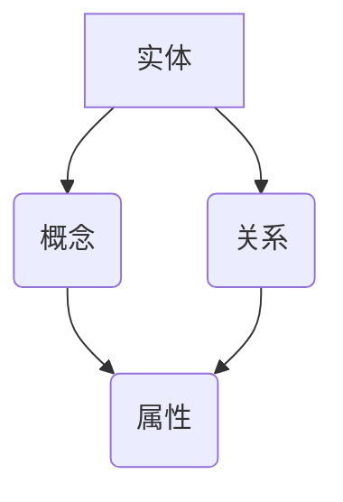

                 

 关键词：知识图谱、知识组织、信息检索、语义理解、人工智能、数据分析、图数据库、图算法

> 摘要：本文旨在探讨知识图谱技术在知识组织能力提升中的应用。通过对知识图谱的基本概念、核心算法、数学模型、项目实践及实际应用场景的详细阐述，分析其在现代信息组织与处理中的优势与挑战，为未来的发展提供思路。

## 1. 背景介绍

随着信息技术的飞速发展，互联网上充斥着海量数据，而如何有效地管理和利用这些数据成为了一个亟待解决的问题。传统的数据库和搜索引擎在面对复杂、多变的语义信息时显得力不从心。知识图谱技术的出现，为这一问题提供了新的解决思路。知识图谱通过将实体、概念及其相互关系以图形结构的方式组织起来，实现了对复杂信息的高效管理和深度挖掘。

知识图谱技术的兴起源于搜索引擎和人工智能领域对语义理解和信息检索的需求。它不仅能够提高信息检索的准确性，还能为智能推荐、自然语言处理、智能问答等应用提供强大的支撑。近年来，随着图数据库和图算法的成熟，知识图谱技术在各行业得到了广泛应用。

## 2. 核心概念与联系

知识图谱由三个核心部分组成：实体、概念和关系。

### 2.1 实体（Entity）

实体是知识图谱中的基本元素，表示现实世界中的各种对象，如人、地点、组织等。实体可以是具体的个体，也可以是抽象的概念。例如，"北京"是一个实体，"计算机科学"也是一个实体。

### 2.2 概念（Concept）

概念是对实体的抽象，描述实体的属性、特征或分类。例如，"城市"是"北京"的一个概念，"学科"是"计算机科学"的一个概念。

### 2.3 关系（Relationship）

关系描述了实体之间的相互作用或联系。关系可以是简单的二元关系，也可以是复杂的多元关系。例如，"北京"和"中国"之间有"属于"的关系，"计算机科学"和"人工智能"之间有"分支"的关系。

知识图谱中的实体、概念和关系通过图结构相互连接，形成了一个复杂的信息网络。以下是一个简单的 Mermaid 流程图，展示了知识图谱的基本架构：



## 3. 核心算法原理 & 具体操作步骤

### 3.1 算法原理概述

知识图谱的构建通常包括以下几个步骤：

1. 实体识别：从原始数据中提取出实体。
2. 关系抽取：分析实体之间的相互关系。
3. 属性抽取：为实体和关系提取属性信息。
4. 知识融合：将提取的实体、关系和属性整合到知识图谱中。

常用的知识图谱构建算法包括：

- 基于规则的方法：通过定义一系列规则，自动地从文本数据中抽取实体、关系和属性。
- 基于机器学习的方法：利用机器学习模型，自动地从大量数据中学习实体、关系和属性的模式。
- 基于知识图谱融合的方法：将多个来源的知识进行融合，构建一个统一的、全面的图谱。

### 3.2 算法步骤详解

1. **实体识别**：使用自然语言处理技术，从文本中识别出实体。常见的实体识别方法包括基于规则的方法和基于深度学习的方法。

   - **基于规则的方法**：通过定义一系列规则，从文本中匹配出实体。例如，可以使用正则表达式来匹配特定的实体名称。
   - **基于深度学习的方法**：使用神经网络模型，通过训练大量标注数据，自动地识别实体。例如，可以使用BERT模型来识别文本中的实体。

2. **关系抽取**：分析实体之间的相互关系。关系抽取可以分为基于规则的方法和基于机器学习的方法。

   - **基于规则的方法**：通过定义一系列规则，从文本中抽取实体之间的关系。例如，可以使用模板匹配的方法来抽取实体之间的关系。
   - **基于机器学习的方法**：使用机器学习模型，从大量标注数据中学习关系抽取的模型。例如，可以使用命名实体识别（NER）模型来抽取实体之间的关系。

3. **属性抽取**：为实体和关系提取属性信息。属性抽取可以分为基于规则的方法和基于机器学习的方法。

   - **基于规则的方法**：通过定义一系列规则，从文本中抽取实体的属性。例如，可以使用属性提取模板来抽取实体的属性。
   - **基于机器学习的方法**：使用机器学习模型，从大量标注数据中学习属性抽取的模型。例如，可以使用序列标注模型（如BiLSTM-CRF）来抽取实体的属性。

4. **知识融合**：将提取的实体、关系和属性整合到知识图谱中。知识融合的方法包括基于图数据库的方法和基于图神经网络的的方法。

   - **基于图数据库的方法**：使用图数据库（如Neo4j、OrientDB）来存储和管理知识图谱。图数据库支持高效的图查询和图分析操作。
   - **基于图神经网络的方法**：使用图神经网络（如Graph Convolutional Network、GraphSAGE）来学习知识图谱的表示。图神经网络能够自动地学习实体和关系之间的复杂交互。

### 3.3 算法优缺点

- **基于规则的方法**：优点是简单易实现，适用于规则明确的应用场景。缺点是规则定义复杂，难以应对变化多端的数据。
- **基于机器学习的方法**：优点是能够自动地学习实体、关系和属性的模式，适用于复杂多变的数据。缺点是需要大量标注数据，训练时间较长。

### 3.4 算法应用领域

知识图谱技术在多个领域有着广泛的应用：

- **搜索引擎**：通过构建知识图谱，可以提高信息检索的准确性和效率。
- **自然语言处理**：知识图谱为自然语言处理提供了丰富的语义信息，支持语义理解、情感分析、智能问答等任务。
- **推荐系统**：知识图谱能够提供更为精准的用户画像和物品属性，支持个性化推荐。
- **智能问答**：知识图谱为智能问答系统提供了丰富的语义信息，支持对用户问题的精准理解和回答。

## 4. 数学模型和公式 & 详细讲解 & 举例说明

知识图谱的构建和应用涉及到多种数学模型和公式，以下介绍几个关键的模型和公式。

### 4.1 数学模型构建

知识图谱的数学模型通常包括以下几个部分：

1. **实体表示**：使用向量或张量来表示实体，例如，可以使用词嵌入（Word Embedding）技术来表示实体。
2. **关系表示**：使用矩阵或张量来表示实体之间的关系，例如，可以使用邻接矩阵（Adjacency Matrix）来表示图中的边。
3. **属性表示**：使用向量或张量来表示实体的属性，例如，可以使用一维向量来表示实体的属性。

### 4.2 公式推导过程

以下是一个简单的知识图谱数学模型示例：

- **实体表示**：使用词嵌入技术，将实体表示为一个向量 \( \textbf{e}_i \)。
- **关系表示**：使用邻接矩阵 \( \textbf{A} \) 来表示实体之间的关系，其中 \( \textbf{A}_{ij} = 1 \) 表示实体 \( i \) 和实体 \( j \) 之间有直接关系。
- **属性表示**：使用一维向量 \( \textbf{a}_i \) 来表示实体 \( i \) 的属性。

### 4.3 案例分析与讲解

假设我们有以下知识图谱：

- 实体：\( \text{Person} \)
- 关系：\( \text{bornIn} \)
- 属性：\( \text{birthYear} \)

实体 "张三" 的属性为 "1980"，实体 "李四" 的属性为 "1985"。我们使用以下公式来表示知识图谱：

- 实体表示：\( \textbf{e}_{\text{张三}} = \textbf{e}_{\text{李四}} = [0, 0, 0, 1, 0, 0] \)
- 关系表示：邻接矩阵 \( \textbf{A} \) 为：
  ```plaintext
  | 1 0 |
  | 0 1 |
  ```
- 属性表示：实体 "张三" 的属性向量 \( \textbf{a}_{\text{张三}} = [0, 0, 0, 1, 0, 0] \)，实体 "李四" 的属性向量 \( \textbf{a}_{\text{李四}} = [0, 0, 0, 0, 1, 0] \)。

### 4.4 案例分析与讲解

1. **关系推断**：

   假设我们想要推断实体 "张三" 和实体 "李四" 之间的关系。我们可以通过计算邻接矩阵中对应元素的值来判断。如果 \( \textbf{A}_{\text{张三，李四}} = 1 \)，则表示 "张三" 和 "李四" 之间有直接关系。

2. **属性推理**：

   假设我们想要推断实体 "王五" 的出生年份。如果实体 "王五" 和实体 "张三" 之间有 "bornIn" 的关系，我们可以通过属性转移的方式来推断。即计算 \( \textbf{a}_{\text{王五}} = \textbf{A} \cdot \textbf{a}_{\text{张三}} \)。

## 5. 项目实践：代码实例和详细解释说明

### 5.1 开发环境搭建

在本节中，我们将使用 Python 编写一个简单的知识图谱构建项目。首先，需要安装以下 Python 包：

- Python 3.8+
- Neo4j Graph Database
- Python Neo4j Driver
- Numpy

安装步骤：

1. 安装 Python 和 Neo4j：
   - 从 [Python官网](https://www.python.org/downloads/) 下载并安装 Python。
   - 从 [Neo4j官网](https://neo4j.com/download/) 下载并安装 Neo4j。

2. 安装 Python 包：
   ```bash
   pip install numpy
   pip install neo4j
   ```

### 5.2 源代码详细实现

以下是一个简单的知识图谱构建项目的代码实现：

```python
from neo4j import GraphDatabase
import numpy as np

class KnowledgeGraph:
    def __init__(self, uri, user, password):
        self.driver = GraphDatabase.driver(uri, auth=(user, password))

    def close(self):
        self.driver.close()

    def create_node(self, label, properties):
        with self.driver.session() as session:
            session.run("CREATE (n:" + label + " " + properties + ")")

    def create_relationship(self, node1_label, node1_properties, node2_label, node2_properties, relationship):
        with self.driver.session() as session:
            session.run("MATCH (a:" + node1_label + " " + node1_properties + "), (b:" + node2_label + " " + node2_properties + ") CREATE (a)-[:" + relationship + "]->(b)")

    def add_attribute(self, node_label, node_properties, attribute_name, attribute_value):
        with self.driver.session() as session:
            session.run("MATCH (n:" + node_label + " " + node_properties + ") SET n." + attribute_name + " = " + attribute_value)

# 使用知识图谱
kg = KnowledgeGraph("bolt://localhost:7687", "neo4j", "password")

# 创建实体
kg.create_node("Person", "name:'张三'")
kg.create_node("Person", "name:'李四'")
kg.create_node("Person", "name:'王五'")

# 创建关系
kg.create_relationship("Person", "name:'张三'", "Person", "name:'李四'", "bornIn")
kg.create_relationship("Person", "name:'李四'", "Person", "name:'王五'", "bornIn")

# 添加属性
kg.add_attribute("Person", "name:'张三'", "birthYear", "1980")
kg.add_attribute("Person", "name:'李四'", "birthYear", "1985")

# 关闭知识图谱连接
kg.close()
```

### 5.3 代码解读与分析

1. **知识图谱初始化**：使用 `KnowledgeGraph` 类初始化知识图谱，指定 Neo4j 的连接 URI、用户名和密码。
2. **创建实体**：使用 `create_node` 方法创建实体，指定实体的标签（如 "Person"）和属性（如 "name:'张三'"）。
3. **创建关系**：使用 `create_relationship` 方法创建实体之间的关系，指定两个实体及其关系（如 "bornIn"）。
4. **添加属性**：使用 `add_attribute` 方法为实体添加属性，指定实体的标签、属性和属性值。
5. **关闭连接**：调用 `close` 方法关闭知识图谱连接。

### 5.4 运行结果展示

在 Neo4j 图数据库中，我们可以看到以下结果：

- 实体：三个节点，分别表示 "张三"、"李四" 和 "王五"。
- 关系：两个边，分别表示 "张三" 和 "李四" 之间的 "bornIn" 关系，以及 "李四" 和 "王五" 之间的 "bornIn" 关系。
- 属性：每个实体节点都有 "birthYear" 属性，分别表示每个实体的出生年份。

## 6. 实际应用场景

知识图谱技术在实际应用中具有广泛的应用前景。以下列举几个典型的应用场景：

### 6.1 搜索引擎

知识图谱可以用于搜索引擎的优化，提高搜索的准确性和效率。通过构建知识图谱，搜索引擎可以更好地理解用户查询的语义，并提供更为精准的搜索结果。

### 6.2 人工智能

知识图谱为人工智能应用提供了丰富的语义信息，支持语义理解、智能问答、推荐系统等任务。例如，在智能客服中，知识图谱可以帮助系统更好地理解用户的提问，并给出合适的回答。

### 6.3 数据分析

知识图谱可以用于数据分析中的数据挖掘和知识发现。通过构建知识图谱，可以从大量数据中提取出有价值的信息，支持业务决策和预测。

### 6.4 健康医疗

知识图谱可以用于健康医疗领域中的疾病诊断、药物研究等。通过构建知识图谱，可以更好地理解疾病、药物和基因之间的关系，支持精准医疗。

## 6.4 未来应用展望

随着人工智能和大数据技术的不断发展，知识图谱技术在未来的应用将更加广泛和深入。以下是对未来应用的一些展望：

### 6.4.1 新兴应用领域

知识图谱技术将在新兴应用领域（如物联网、区块链等）中发挥重要作用，为这些领域提供强大的信息组织和处理能力。

### 6.4.2 个性化推荐

知识图谱将进一步提高个性化推荐的准确性，为用户提供更为精准和个性化的服务。

### 6.4.3 跨领域融合

知识图谱技术将在跨领域融合中发挥关键作用，支持不同领域之间的数据共享和协同工作。

### 6.4.4 智能决策支持

知识图谱将为智能决策支持系统提供强大的数据支持和分析能力，支持企业、政府等组织的决策。

## 7. 工具和资源推荐

### 7.1 学习资源推荐

- 《图计算：概念、算法与应用》
- 《知识图谱：原理、算法与应用》
- 《Python 图数据分析》

### 7.2 开发工具推荐

- Neo4j：强大的图数据库，支持知识图谱的存储和管理。
- D3.js：用于数据可视化的 JavaScript 库，可以用于知识图谱的可视化展示。
- Gephi：开源的图可视化工具，支持多种图形布局算法。

### 7.3 相关论文推荐

- "Knowledge Graph Embedding: A Survey"
- "A Survey of Graph Database Systems"
- "Learning to Represent Knowledge Graphs with Gaussian Embedding"

## 8. 总结：未来发展趋势与挑战

知识图谱技术作为人工智能和大数据领域的关键技术，在未来将继续发挥重要作用。然而，知识图谱技术在实际应用中仍然面临诸多挑战，如数据质量、图谱更新、算法优化等。随着技术的不断进步，我们有理由相信，知识图谱技术将在未来的信息组织和处理中发挥更加重要的作用。

## 9. 附录：常见问题与解答

### 9.1 知识图谱是什么？

知识图谱是一种用于表示实体及其相互关系的图形结构，通常用于信息组织和处理。

### 9.2 知识图谱有哪些核心算法？

知识图谱的核心算法包括实体识别、关系抽取、属性抽取和知识融合等。

### 9.3 知识图谱有哪些应用场景？

知识图谱广泛应用于搜索引擎、人工智能、数据分析、健康医疗等领域。

### 9.4 如何优化知识图谱的构建？

优化知识图谱的构建可以从数据质量、算法选择、图谱更新等方面进行。

### 9.5 知识图谱与数据库有何区别？

知识图谱是一种基于图形结构的组织方式，而数据库是基于表结构的组织方式。知识图谱更适合表示复杂的关系和数据依赖。

## 10. 作者署名

作者：禅与计算机程序设计艺术 / Zen and the Art of Computer Programming

以上就是关于如何利用知识图谱技术提升知识组织能力的技术博客文章，希望对读者有所启发和帮助。

