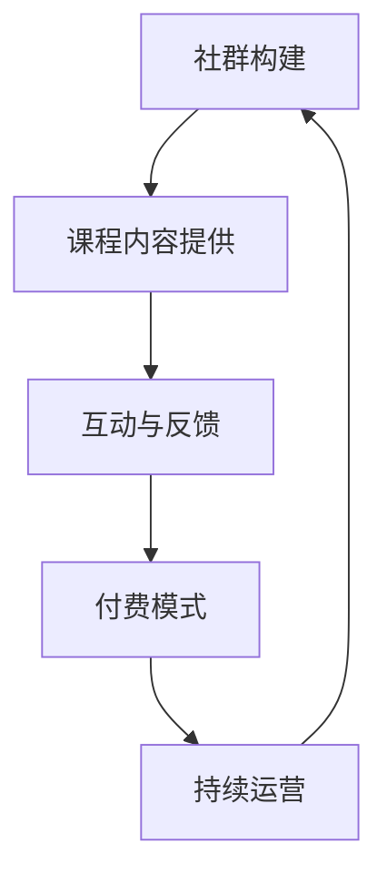

                 

### 1. 背景介绍

在当前数字化时代，在线教育和知识付费市场呈现出迅猛发展的态势。越来越多的人希望通过在线学习提升自己的技能，而教育者则看到了通过社群卖课实现收入增长的机会。特别是在程序员群体中，由于技术更新速度快，持续学习和技能提升变得尤为重要。因此，如何利用社群卖课成为了一个热门话题。

首先，社群卖课的定义可以简单概括为：通过在线社群，如微信群、QQ群、论坛等，为用户提供有价值的课程内容，并通过付费方式实现收益。在程序员社群中，这种模式因其针对性、实用性而受到欢迎。

其次，社群卖课的重要性在于其能够：

1. **增强用户粘性**：通过建立社群，教育者可以与学员建立更紧密的联系，提高用户留存率。
2. **提高课程质量**：社群成员之间的互动可以促进课程内容的改进，提高教学效果。
3. **实现价值变现**：知识付费已经成为一种趋势，社群卖课为教育者提供了新的收入来源。

本文将围绕以下主题展开：

1. **背景介绍**：探讨在线教育和知识付费市场的发展状况。
2. **核心概念与联系**：介绍社群卖课的基本原理，并使用Mermaid流程图展示其架构。
3. **核心算法原理 & 具体操作步骤**：详细讲解如何制定有效的社群卖课策略。
4. **数学模型和公式 & 详细讲解 & 举例说明**：运用数学模型分析社群卖课的盈利模式。
5. **项目实践：代码实例和详细解释说明**：通过实例展示社群卖课的实际操作过程。
6. **实际应用场景**：分析社群卖课在不同程序员社群中的应用。
7. **工具和资源推荐**：推荐学习资源和开发工具。
8. **总结：未来发展趋势与挑战**：探讨社群卖课的未来前景。
9. **附录：常见问题与解答**：解答读者可能遇到的问题。
10. **扩展阅读 & 参考资料**：提供进一步阅读的资源。

接下来，我们将深入探讨每个部分，帮助您全面了解和掌握社群卖课的精髓。

### 1.1 在线教育与知识付费市场的发展

近年来，在线教育市场经历了爆炸式增长，其核心驱动力包括互联网技术的普及、移动设备的广泛应用以及用户对知识获取的需求不断增长。根据市场研究公司的数据，全球在线教育市场规模在过去几年中持续扩大，预计到2025年将突破数千亿美元。

知识付费作为在线教育市场的重要组成部分，同样显示出强劲的增长势头。用户愿意为高质量、有针对性的知识内容支付费用，这为教育者提供了新的商业模式。特别是在程序员社群中，随着技术的快速发展，程序员需要不断学习新技术以保持竞争力，这进一步推动了知识付费市场的发展。

社群卖课作为一种新型的教育模式，凭借其独特的优势在知识付费市场中占据了重要地位。与传统教育模式相比，社群卖课具有以下几个显著特点：

1. **个性化服务**：社群卖课能够根据用户的需求和反馈提供个性化的教学服务，提高用户体验。
2. **互动性强**：社群成员之间的互动和讨论能够促进知识的传播和深度理解，提高学习效果。
3. **高性价比**：通过社群平台，教育者可以以较低的成本触达更多的用户，实现价值最大化。

此外，随着社交媒体和即时通讯工具的普及，社群卖课在程序员社群中得以广泛应用。微信群、QQ群、Discord等社交平台成为了教育者和学员互动的重要场所。这些平台不仅方便了课程的推广和销售，还为学员提供了交流、互助和资源分享的机会。

总的来说，在线教育和知识付费市场的快速发展为社群卖课提供了广阔的舞台。通过社群卖课，教育者不仅能够实现价值变现，还能够推动知识的传播和共享，为整个社会创造更多的价值。

### 1.2 程序员社群的特点

程序员社群在知识付费市场中具有独特的地位和影响力。这主要归因于以下几个方面的特点：

1. **高度的专业性**：程序员社群的成员大多是具备专业知识和技能的从业者，他们对于技术话题有着浓厚的兴趣和深入的了解。这使得社群卖课的内容更加专业化、实用化，能够满足学员的学习需求。
2. **持续的更新需求**：技术更新速度飞快，新的编程语言、框架和技术层出不穷。程序员需要不断学习以跟上行业的发展，这为社群卖课提供了持续的内容需求。
3. **强烈的分享意愿**：程序员社群成员普遍具有分享知识和经验的意愿，他们乐于通过社群平台分享自己的学习心得、工作经验和最新技术动态。这种分享精神为社群卖课创造了良好的氛围。
4. **付费意识较强**：程序员社群成员通常具有较高的收入水平和付费能力。他们愿意为高质量、有针对性的知识内容支付费用，这为社群卖课提供了稳定的用户基础。

总之，程序员社群在知识付费市场中具有独特的优势，这为社群卖课提供了良好的土壤。通过深入了解程序员社群的特点，教育者可以更好地制定卖课策略，提升课程的市场竞争力。

### 1.3 社群卖课的优势

社群卖课作为一种新型的教育模式，具有诸多优势，使其在程序员社群中备受青睐：

1. **增强用户粘性**：社群卖课通过建立在线社群，为用户提供了交流和互动的平台。教育者和学员可以在社群中分享学习心得、讨论技术问题，这种紧密的互动有助于增强用户粘性，提高用户的参与度和忠诚度。

2. **提高课程质量**：社群成员之间的互动和反馈可以促进课程内容的不断优化。教育者可以根据学员的需求和反馈，及时调整教学策略和课程内容，提高课程的质量和实用性。

3. **实现价值变现**：知识付费已经成为一种趋势，社群卖课为教育者提供了新的收入来源。通过付费课程，教育者可以将自己的知识和经验转化为实际收益，实现价值变现。

4. **降低运营成本**：相比于传统的线下教学，社群卖课可以大大降低运营成本。教育者不需要租用教室、安排课程时间等，只需通过线上平台进行课程推广和销售即可。

5. **触达更广泛用户**：社群卖课突破了地域和时间的限制，教育者可以通过在线平台触达全球的用户。这种广泛的触达能力为教育者提供了更广阔的市场空间，有助于扩大影响力。

总之，社群卖课凭借其增强用户粘性、提高课程质量、实现价值变现、降低运营成本和触达更广泛用户等优势，在程序员社群中具有巨大的发展潜力。通过合理利用社群卖课，教育者可以更好地实现知识传播和价值变现，为自身和学员创造更多价值。

### 1.4 社群卖课的核心要素

要成功进行社群卖课，需要关注以下几个核心要素：

1. **优质课程内容**：课程内容是社群卖课的核心，必须具备高质量、实用性强的特点。课程内容需要紧密贴合学员的需求，帮助学员解决实际问题，提高学习效果。

2. **有效的社群运营**：社群运营是社群卖课成功的关键。教育者需要建立一个活跃、互动性强的社群，通过定期举办线上活动、发布有价值的内容、解答学员问题等方式，提高用户粘性，促进课程销售。

3. **精准的用户定位**：明确目标用户群体，根据用户特点制定针对性的课程内容和服务策略，有助于提高课程的市场竞争力。

4. **灵活的定价策略**：根据课程内容、市场情况和用户需求，灵活调整定价策略，找到合适的价格点，实现价值最大化。

5. **良好的营销推广**：通过线上线下多渠道营销，提高课程知名度，吸引更多潜在学员。

6. **优质的服务体验**：提供周到的售前、售中和售后服务，确保学员在学习过程中得到充分的关心和支持，提高学员满意度。

通过关注这些核心要素，教育者可以更好地进行社群卖课，实现知识传播和价值变现。

### 1.5 社群卖课面临的挑战

尽管社群卖课具有诸多优势，但在实际操作中，教育者仍需面对一些挑战：

1. **市场竞争激烈**：在线教育和知识付费市场已经非常成熟，教育者需要面临来自同行的激烈竞争，如何脱颖而出是一个重要问题。

2. **用户信任度问题**：社群卖课依赖于用户信任，教育者需要通过优质的内容和真诚的服务赢得用户信任，建立良好的口碑。

3. **运营成本高**：社群卖课需要投入大量的人力、物力和时间进行课程研发、社群运营和营销推广，运营成本较高。

4. **技术门槛**：建立和维护一个稳定、高效的在线教育平台需要一定的技术支持，教育者需要具备一定的技术能力或寻找合适的合作伙伴。

5. **内容持续更新**：随着技术不断发展，教育者需要不断更新课程内容，以保持课程的新鲜度和实用性。

6. **用户需求变化**：用户需求多变，教育者需要及时了解用户需求，调整课程内容和教学策略，以满足不同用户的需求。

了解并应对这些挑战，有助于教育者更好地进行社群卖课，实现可持续发展。

### 1.6 总结

综上所述，社群卖课作为一种新型的教育模式，在程序员社群中具有广泛的应用前景。通过增强用户粘性、提高课程质量、实现价值变现等优势，社群卖课不仅为教育者提供了新的收入来源，也为学员提供了优质的学习资源。然而，教育者在进行社群卖课时，还需面对市场竞争、用户信任度、运营成本、技术门槛和用户需求变化等挑战。只有深入了解这些核心要素和挑战，制定有效的策略，才能在社群卖课市场中取得成功。

### 2. 核心概念与联系

#### 2.1 社群卖课的基本原理

社群卖课的核心在于通过在线社群平台，如微信群、QQ群、Discord等，为用户提供有价值的课程内容，并通过付费模式实现收益。以下是社群卖课的基本原理：

1. **社群构建**：首先，教育者需要构建一个在线社群，通过邀请、推广等方式吸引潜在学员加入。

2. **课程内容提供**：教育者根据学员需求和自身专业特长，设计并发布有针对性的课程内容，包括视频教程、文本资料、代码示例等。

3. **互动与反馈**：教育者在社群中积极与学员互动，解答学员问题，收集学员反馈，不断优化课程内容。

4. **付费模式**：教育者通过设置课程费用，学员通过支付费用获取完整课程内容和学习支持。

5. **持续运营**：教育者需要不断更新课程内容，举办线上活动，维护社群活跃度，以保持学员的粘性和参与度。

#### 2.2 社群卖课的架构

为了更好地理解社群卖课的架构，我们可以使用Mermaid流程图来展示其关键节点和流程。以下是社群卖课的基本架构及其流程：



**节点说明**：

- **社群构建**：教育者通过邀请、推广等手段构建在线社群。
- **课程内容提供**：教育者发布课程内容，包括视频、文本和代码示例。
- **互动与反馈**：教育者在社群中与学员互动，解答问题，收集反馈。
- **付费模式**：学员通过支付费用获取课程内容和学习支持。
- **持续运营**：教育者不断更新课程内容，举办线上活动，维持社群活跃度。

通过这个流程图，我们可以清晰地看到社群卖课的基本架构和运行机制。教育者需要不断优化这个流程，以提高社群卖课的效率和质量。

#### 2.3 社群卖课与传统教育模式的比较

社群卖课与传统教育模式在多个方面存在显著差异：

1. **互动性**：社群卖课强调互动性，学员可以在社群中提问、讨论，教育者可以实时解答。而传统教育模式通常以单向授课为主，学员与教育者的互动较少。

2. **灵活性**：社群卖课的时间和地点相对灵活，学员可以根据自身时间安排学习。传统教育模式则通常有固定的上课时间和地点，学员需要按时到校上课。

3. **成本**：社群卖课的运营成本较低，教育者不需要租用教室、安排课程时间等。传统教育模式则需要大量的人力和物力投入。

4. **课程内容**：社群卖课的内容更新速度较快，教育者可以根据市场需求和技术更新及时调整课程内容。传统教育模式则通常具有较长的课程开发和更新周期。

5. **受众范围**：社群卖课可以触达全球用户，不受地域限制。传统教育模式则主要面向本地或特定区域的学生。

通过比较可以看出，社群卖课在互动性、灵活性、成本、课程内容和受众范围等方面具有明显优势，这也是其在程序员社群中受到欢迎的重要原因。

#### 2.4 社群卖课的核心要素

为了确保社群卖课的成功，教育者需要关注以下几个核心要素：

1. **课程质量**：课程内容必须具备高质量、实用性强、紧跟技术发展趋势的特点。只有高质量的课程才能吸引学员，提高学员满意度。

2. **社群运营**：社群运营是社群卖课的关键，教育者需要建立活跃、互动性强的社群，通过定期举办活动、发布有价值的内容、解答学员问题等方式，提高用户粘性。

3. **用户定位**：明确目标用户群体，根据用户需求设计课程内容和服务策略，提高课程的市场竞争力。

4. **营销推广**：通过线上线下多渠道营销，提高课程知名度，吸引更多潜在学员。

5. **售后服务**：提供优质的售后服务，确保学员在学习过程中得到充分的关心和支持，提高学员满意度。

通过关注这些核心要素，教育者可以更好地进行社群卖课，实现知识传播和价值变现。

### 2.5 社群卖课的盈利模式

社群卖课的盈利模式主要包括以下几个方面：

1. **课程费用**：教育者通过设置课程费用，学员支付费用后获取课程内容和学习支持。这是社群卖课的主要收入来源。

2. **广告收入**：社群卖课平台可以通过在社群中投放广告，获取广告收入。广告内容通常与课程内容相关，有助于提高课程的曝光率和学员的参与度。

3. **增值服务**：教育者可以提供增值服务，如一对一辅导、专业技术咨询、项目实战指导等，学员支付额外费用后可享受这些服务。

4. **会员制度**：教育者可以推出会员制度，学员支付会员费用后，可享受特定权益，如免费参加课程、享受优先解答问题等。

5. **合作分成**：教育者可以与相关企业合作，推出联名课程或项目，通过合作分成获取收入。

通过多样化的盈利模式，教育者可以实现多渠道收入，提高社群卖课的盈利能力。

### 2.6 社群卖课的优势

社群卖课在程序员社群中具有以下优势：

1. **用户粘性强**：通过建立在线社群，教育者可以与学员建立紧密联系，提高用户留存率。

2. **课程质量高**：社群成员之间的互动和反馈可以促进课程内容的改进，提高教学效果。

3. **成本较低**：社群卖课可以大大降低运营成本，教育者只需通过线上平台进行课程推广和销售。

4. **触达广泛**：社群卖课可以触达全球用户，扩大市场空间。

5. **灵活性强**：社群卖课的时间和地点相对灵活，学员可以随时随地进行学习。

通过这些优势，社群卖课在程序员社群中得到了广泛应用，为教育者和学员创造了更多价值。

### 2.7 社群卖课的挑战

尽管社群卖课具有诸多优势，但在实际操作中，教育者仍需面对以下挑战：

1. **市场竞争激烈**：在线教育和知识付费市场已经非常成熟，教育者需要面对来自同行的激烈竞争。

2. **用户信任度问题**：社群卖课依赖于用户信任，教育者需要通过优质的内容和真诚的服务赢得用户信任。

3. **运营成本高**：社群卖课需要投入大量的人力、物力和时间进行课程研发、社群运营和营销推广。

4. **技术门槛**：建立和维护一个稳定、高效的在线教育平台需要一定的技术支持。

5. **内容持续更新**：技术更新速度快，教育者需要不断更新课程内容，以保持课程的新鲜度和实用性。

6. **用户需求变化**：用户需求多变，教育者需要及时调整课程内容和教学策略，以满足不同用户的需求。

了解并应对这些挑战，有助于教育者更好地进行社群卖课，实现可持续发展。

### 2.8 社群卖课的案例分析

为了更好地理解社群卖课的实际应用，我们可以通过一些成功的案例分析，探讨其成功的原因和经验。

#### 案例一：某知名编程课程社群

该编程课程社群由一位资深程序员创立，主要面向有编程基础的程序员。社群内提供丰富的课程内容，包括编程语言基础、框架应用、项目实战等。以下是其成功原因：

1. **课程内容优质**：课程内容紧密贴合学员需求，覆盖面广，从基础到高级都有涉及，帮助学员全面提高编程技能。

2. **社群互动性强**：社群内设有问答板块，学员可以随时提问，教育者会及时解答。此外，社群还定期举办线上活动，如代码挑战、技术分享等，增强了成员之间的互动。

3. **个性化服务**：社群为学员提供一对一辅导、项目实战指导等个性化服务，学员可以根据自身需求选择合适的服务。

4. **营销推广**：社群通过线上线下多渠道进行营销推广，提高了课程的知名度和影响力。

通过以上措施，该编程课程社群在短时间内吸引了大量学员，取得了显著的成功。

#### 案例二：某AI技术课程社群

该AI技术课程社群由一群AI领域的专家共同创立，主要面向对AI技术有兴趣的程序员。以下是其成功原因：

1. **课程内容前沿**：课程内容紧跟AI技术的发展趋势，包括深度学习、自然语言处理、计算机视觉等前沿技术。

2. **师资力量强大**：社群邀请了一批在AI领域有丰富经验的专家担任讲师，保证了课程内容的专业性和权威性。

3. **社群运营高效**：社群设有专门的运营团队，负责课程内容的发布、社群活动的策划和组织，确保社群的运营效率。

4. **学员服务周到**：社群为学员提供详细的课程资料、答疑服务、实战项目等，帮助学员更好地掌握AI技术。

通过以上措施，该AI技术课程社群在短时间内赢得了大量学员的信任和支持。

#### 案例三：某前端开发课程社群

该前端开发课程社群主要面向前端开发者，课程内容涵盖HTML、CSS、JavaScript、Vue、React等前端技术。以下是其成功原因：

1. **课程内容系统**：课程内容结构清晰，从基础到高级逐步深入，帮助学员系统地掌握前端开发技能。

2. **实战项目丰富**：课程中包含多个实战项目，学员可以通过实际操作加深对前端技术的理解。

3. **社群氛围良好**：社群成员之间友好互助，共同学习和进步，营造了一个积极、向上的学习氛围。

4. **学习资源丰富**：社群提供丰富的学习资源，包括视频教程、文档资料、代码示例等，方便学员随时学习。

通过以上措施，该前端开发课程社群在程序员社群中赢得了良好的口碑和广泛的认可。

通过以上案例分析，我们可以看到，成功的社群卖课离不开优质的内容、高效的运营、良好的服务体验和有效的营销推广。这些成功经验可以为其他教育者提供有益的参考。

### 2.9 社群卖课的关键成功因素

在社群卖课的过程中，教育者需要关注以下几个关键成功因素：

1. **优质课程内容**：课程内容是社群卖课的核心，必须具备高质量、实用性强的特点。只有高质量的课程才能吸引学员，提高学习效果。

2. **有效的社群运营**：社群运营是社群卖课成功的关键。通过定期举办活动、发布有价值的内容、解答学员问题等方式，提高社群活跃度和用户粘性。

3. **良好的用户服务**：提供优质的售后服务，确保学员在学习过程中得到充分的关心和支持，提高学员满意度和忠诚度。

4. **精准的市场定位**：明确目标用户群体，根据用户需求设计课程内容和服务策略，提高课程的市场竞争力。

5. **灵活的定价策略**：根据市场情况和用户需求，灵活调整定价策略，找到合适的价格点，实现价值最大化。

6. **有效的营销推广**：通过线上线下多渠道营销，提高课程知名度和影响力，吸引更多潜在学员。

通过关注这些关键成功因素，教育者可以更好地进行社群卖课，实现知识传播和价值变现。

### 2.10 社群卖课的优势与挑战总结

社群卖课在程序员社群中具有显著的优势，如增强用户粘性、提高课程质量、实现价值变现等。然而，在实际操作中，教育者还需面对市场竞争激烈、用户信任度问题、运营成本高、技术门槛和用户需求变化等挑战。了解并应对这些挑战，有助于教育者更好地进行社群卖课，实现可持续发展。通过优质课程内容、高效社群运营、良好用户服务、精准市场定位、灵活定价策略和有效营销推广等关键成功因素，教育者可以充分发挥社群卖课的优势，克服挑战，取得成功。

## 3. 核心算法原理 & 具体操作步骤

#### 3.1 制定社群卖课策略的核心算法原理

在社群卖课过程中，制定一个有效的策略是关键。核心算法原理主要涉及以下几个方面：

1. **用户行为分析**：通过对用户的行为进行分析，了解用户的学习习惯、兴趣点以及需求，从而为课程内容和社群运营提供依据。

2. **数据驱动决策**：利用数据分析工具，对用户数据、市场数据、课程数据等进行深度挖掘，通过数据驱动决策，优化课程内容和运营策略。

3. **社区参与度模型**：建立社区参与度模型，通过计算用户在社群中的活跃度、互动频率、贡献度等指标，评估社群的运营效果，为社群优化提供数据支持。

4. **用户忠诚度模型**：通过分析用户购买行为、学习行为、评价反馈等数据，建立用户忠诚度模型，识别高忠诚度用户，制定针对性的运营策略。

5. **市场预测模型**：利用市场数据、行业动态、用户需求变化等，建立市场预测模型，预测市场趋势和用户需求，为课程开发和运营提供方向。

#### 3.2 策略制定的具体操作步骤

1. **需求分析**：
   - **收集用户需求**：通过问卷调查、访谈、社群反馈等方式，收集学员对课程内容、教学方式的需求。
   - **分析用户数据**：利用数据分析工具，对用户行为数据进行分析，挖掘用户的学习习惯和偏好。

2. **市场调研**：
   - **行业趋势分析**：研究相关行业报告、市场动态，了解技术发展趋势和市场需求。
   - **竞争对手分析**：分析同行业内其他教育者的课程内容和市场策略，找出差异化和竞争优势。

3. **课程设计**：
   - **课程大纲制定**：根据需求分析和市场调研结果，制定课程大纲，确保课程内容紧贴用户需求和市场趋势。
   - **课程内容优化**：结合用户反馈和数据分析结果，对课程内容进行优化和调整，提高课程的实用性和吸引力。

4. **社群运营**：
   - **社群构建**：选择合适的社群平台，如微信群、QQ群、Discord等，搭建在线社群。
   - **内容发布**：定期发布有价值的内容，包括课程视频、文本资料、代码示例等。
   - **互动管理**：鼓励社群成员积极参与互动，通过问答、讨论、活动等方式提高社群活跃度。

5. **用户服务**：
   - **售后服务**：提供优质的售后服务，包括答疑服务、项目指导等，确保学员在学习过程中得到充分支持。
   - **用户反馈**：及时收集用户反馈，分析用户满意度，持续优化课程和服务。

6. **数据监控**：
   - **用户行为监控**：通过数据分析工具，实时监控用户行为，了解用户在社群中的活跃度、参与度等指标。
   - **运营效果评估**：定期评估社群运营效果，通过数据指标分析，优化社群运营策略。

7. **市场推广**：
   - **内容营销**：通过高质量的内容，如博客文章、技术分享等，吸引潜在用户关注。
   - **社交网络推广**：利用社交媒体平台，如微博、微信、知乎等，进行课程推广和用户互动。
   - **合作推广**：与其他教育机构、技术社区等合作，共同推广课程，扩大影响力。

通过以上步骤，教育者可以制定出一个有效的社群卖课策略，确保课程内容紧贴用户需求，社群运营高效，从而实现知识传播和价值变现。

### 3.3 数据分析与用户行为分析在策略制定中的应用

在社群卖课策略的制定过程中，数据分析和用户行为分析起着至关重要的作用。通过这些分析，教育者可以更好地了解用户需求，优化课程内容，提升社群运营效果。

#### 3.3.1 数据分析

1. **用户数据分析**：
   - **用户画像**：通过用户数据，如年龄、性别、职业、教育背景等，建立用户画像，了解目标用户群体的特点。
   - **学习行为**：分析用户在课程学习过程中的行为，如学习时长、学习频率、课程进度等，了解用户的学习习惯和偏好。
   - **购买行为**：分析用户的购买行为，如购买频率、购买金额、购买课程等，了解用户的价值需求和消费能力。

2. **市场数据分析**：
   - **行业趋势**：通过市场调研，了解技术发展趋势、市场需求变化等，为课程内容更新和运营策略调整提供依据。
   - **竞争对手分析**：分析同行业内其他教育者的课程内容和市场策略，找出差异化和竞争优势。

3. **课程数据分析**：
   - **课程表现**：分析课程的表现，如课程点击量、学习完成率、用户评价等，了解课程的质量和受欢迎程度。
   - **用户反馈**：收集用户的反馈意见，分析用户的满意度和建议，为课程优化提供参考。

#### 3.3.2 用户行为分析

1. **社群互动分析**：
   - **活跃度分析**：通过计算用户在社群中的活跃度指标，如发帖数、回复数、点赞数等，了解社群的互动情况。
   - **参与度分析**：分析用户在社群活动中的参与度，如活动参与率、互动频率等，了解社群的运营效果。

2. **用户留存分析**：
   - **留存率分析**：通过计算用户在社群中的留存率，了解社群的粘性和用户忠诚度。
   - **流失原因分析**：分析用户流失的原因，如课程内容不满足需求、社群互动性差等，为社群优化提供方向。

3. **用户反馈分析**：
   - **满意度分析**：通过用户反馈，如问卷调查、评论区等，了解用户的满意度和不满意度，为课程和服务优化提供依据。
   - **建议归类**：将用户建议进行分类，分析其中共性，为课程内容和社群运营提供改进方向。

通过数据分析和用户行为分析，教育者可以深入了解用户需求，优化课程内容，提升社群运营效果，从而提高社群卖课的成功率。

### 3.4 制定社群卖课策略的实战案例

为了更好地理解如何制定社群卖课策略，我们可以通过一个实战案例进行详细讲解。

#### 案例背景

某程序员社群专注于前端开发技术，社群成员大多为前端开发者。社群创始人希望通过社群卖课，为成员提供高质量的前端开发课程，实现知识传播和价值变现。

#### 策略制定步骤

1. **需求分析**：
   - **用户调研**：通过问卷调查、访谈等方式，收集社群成员对课程内容、教学方式的需求。结果显示，成员们对HTML、CSS、JavaScript、Vue和React等前端技术有强烈的学习需求。
   - **数据分析**：通过分析社群成员的学习行为数据，发现他们更喜欢通过实战项目来掌握前端技术，同时对高质量的视频教程和详细的文档资料有较高需求。

2. **市场调研**：
   - **行业趋势**：通过市场调研，了解到前端技术正朝着模块化、组件化和框架化的方向发展，Vue和React等前端框架逐渐成为主流。
   - **竞争对手分析**：分析同行业内其他教育者的课程内容和市场策略，发现他们的课程大多侧重于基础知识的讲解，而缺少实战项目的指导。

3. **课程设计**：
   - **课程大纲**：根据需求分析和市场调研结果，制定课程大纲，包括HTML、CSS、JavaScript基础、Vue和React实战项目等。
   - **课程内容优化**：在课程内容中增加实战项目，通过实际操作帮助成员掌握前端技术。

4. **社群运营**：
   - **社群构建**：在微信群和QQ群中搭建在线社群，邀请前端开发者加入。
   - **内容发布**：定期发布高质量的视频教程、文档资料和代码示例，确保课程内容的实用性和吸引力。
   - **互动管理**：鼓励社群成员参与互动，通过答疑、讨论、代码挑战等方式提高社群活跃度。

5. **用户服务**：
   - **售后服务**：提供一对一辅导、项目实战指导等个性化服务，帮助成员解决学习过程中的问题。
   - **用户反馈**：及时收集用户反馈，分析满意度，为课程和服务优化提供依据。

6. **数据监控**：
   - **用户行为监控**：通过数据分析工具，实时监控用户行为，了解用户在社群中的活跃度和参与度。
   - **运营效果评估**：定期评估社群运营效果，通过数据指标分析，优化社群运营策略。

7. **市场推广**：
   - **内容营销**：通过博客文章、技术分享等高质量内容，吸引前端开发者关注。
   - **社交网络推广**：利用社交媒体平台，如微博、微信、知乎等，进行课程推广和用户互动。
   - **合作推广**：与其他前端开发社区、技术博客等合作，共同推广课程，扩大影响力。

#### 策略执行与效果

通过上述策略的执行，社群卖课取得了显著的效果：

1. **用户粘性提高**：社群成员积极参与互动，课程学习完成率高，社群活跃度显著提升。
2. **课程质量提升**：通过实战项目指导，成员们在实际操作中更好地掌握了前端技术，课程评价较好。
3. **收入增加**：社群卖课实现了价值变现，社群创始人的收入稳步增长。

这个实战案例展示了如何通过数据分析和用户行为分析，制定有效的社群卖课策略，实现知识传播和价值变现。教育者可以借鉴这个案例，结合自身实际情况，制定适合自己的社群卖课策略。

### 3.5 策略执行中的常见问题和解决方案

在执行社群卖课策略时，教育者可能会遇到一些常见问题。以下是一些典型问题及其解决方案：

#### 3.5.1 社群活跃度低

**问题原因**：
- 内容发布频率低。
- 社群互动不足。
- 缺乏吸引人的活动。

**解决方案**：
- **提高内容发布频率**：定期发布有价值的内容，如课程视频、文档资料、技术分享等，保持社群的活力。
- **增强互动**：鼓励社群成员参与讨论，设置答疑时间，回答学员的问题，增加互动。
- **举办活动**：定期举办线上活动，如代码挑战、技术分享会等，提高社群的活跃度。

#### 3.5.2 用户满意度低

**问题原因**：
- 课程内容不符合用户需求。
- 服务质量差。

**解决方案**：
- **优化课程内容**：通过用户反馈和数据分析，调整课程内容，确保其符合用户需求。
- **提升服务质量**：提供一对一辅导、项目实战指导等个性化服务，确保学员在学习过程中得到充分的支持。

#### 3.5.3 营销推广效果不佳

**问题原因**：
- 内容质量不高。
- 推广渠道选择不当。

**解决方案**：
- **提升内容质量**：确保课程内容和宣传内容具有较高的质量，能够吸引潜在学员。
- **选择合适的推广渠道**：根据目标用户群体的特点，选择合适的推广渠道，如社交媒体、技术论坛、博客等。

通过解决这些问题，教育者可以更好地执行社群卖课策略，提高社群卖课的成功率。

### 3.6 总结

通过本文的探讨，我们了解了社群卖课的核心算法原理和具体操作步骤。从用户行为分析、数据驱动决策、社群参与度模型到用户忠诚度模型和市场预测模型，每个环节都至关重要。通过实战案例，我们看到了如何将理论应用于实际操作，制定有效的社群卖课策略。同时，我们也分析了策略执行中可能遇到的问题及其解决方案。通过这些内容，教育者可以更好地理解社群卖课，制定和执行有效的策略，实现知识传播和价值变现。

### 4. 数学模型和公式 & 详细讲解 & 举例说明

#### 4.1 社群卖课的数学模型

在社群卖课中，数学模型可以帮助我们分析课程的销售情况、用户的留存率和转化率等关键指标。以下是一个简单的数学模型，用于计算社群卖课的收益和用户转化率。

#### 4.1.1 收益模型

假设课程的单价为P，每次课程的参与人数为N，课程的销售次数为T，那么社群卖课的总收益R可以表示为：

\[ R = P \times N \times T \]

其中：
- \( P \)：课程单价（元）
- \( N \)：每次课程的参与人数
- \( T \)：课程销售次数

#### 4.1.2 转化率模型

假设潜在用户的数量为U，其中转化为付费用户的比例是C，那么社群卖课的潜在付费用户数量可以表示为：

\[ U_c = U \times C \]

其中：
- \( U \)：潜在用户总数
- \( C \)：转化率（0 ≤ C ≤ 1）

#### 4.1.3 留存率模型

假设在一段时间内，社群的留存用户数量为L，那么社群的留存率R可以表示为：

\[ R_s = \frac{L}{U_c} \]

其中：
- \( L \)：留存用户数量
- \( U_c \)：潜在付费用户数量

#### 4.2 数学模型详细讲解

为了更清楚地理解上述数学模型，我们可以通过一个具体的例子进行详细讲解。

#### 4.2.1 收益模型的详细讲解

假设一门编程课程的单价为200元，每次课程的参与人数为50人，课程销售了10次。那么，社群卖课的总收益R为：

\[ R = 200 \times 50 \times 10 = 100,000 \text{元} \]

这个模型可以帮助教育者预估课程的销售收益，为课程定价和营销策略提供参考。

#### 4.2.2 转化率模型的详细讲解

假设一个社群的潜在用户总数为1000人，其中10%的用户转化为付费用户。那么，社群卖课的潜在付费用户数量U_c为：

\[ U_c = 1000 \times 0.1 = 100 \text{人} \]

这个模型可以帮助教育者了解潜在用户的转化情况，为社群营销提供数据支持。

#### 4.2.3 留存率模型的详细讲解

假设在一段时间内，社群的留存用户数量为60人，潜在付费用户数量为100人。那么，社群的留存率R_s为：

\[ R_s = \frac{60}{100} = 0.6 \text{或} 60\% \]

这个模型可以帮助教育者评估社群的运营效果，及时调整社群策略，提高用户的留存率。

#### 4.3 数学模型的应用举例

为了更好地展示数学模型的应用，我们可以通过一个实际案例进行说明。

**案例**：一个编程社群准备推出一门新的编程课程。根据市场调研和用户需求分析，社群的潜在用户总数为5000人。经过宣传和营销，社群的转化率预计为15%。同时，教育者预计课程销售5次，每次课程的参与人数为100人。

**步骤1**：计算潜在付费用户数量。

\[ U_c = 5000 \times 0.15 = 750 \text{人} \]

**步骤2**：计算社群的留存率。

假设每次课程结束后，社群的留存率为60%。那么，经过5次课程后，社群的留存用户数量为：

\[ L = 750 \times 0.6^5 \approx 232 \text{人} \]

**步骤3**：计算社群卖课的总收益。

假设课程的单价为300元，每次课程的参与人数为100人，课程销售了5次。那么，社群卖课的总收益R为：

\[ R = 300 \times 100 \times 5 = 150,000 \text{元} \]

通过这个案例，我们可以看到数学模型在社群卖课中的应用。通过分析潜在用户数量、转化率和留存率，教育者可以预估社群卖课的收益情况，为课程定价和营销策略提供参考。

### 4.4 数学模型在社群卖课中的重要性

数学模型在社群卖课中具有重要作用，主要体现在以下几个方面：

1. **收益预估**：通过收益模型，教育者可以预估课程的销售收益，为课程定价和营销策略提供依据。
2. **用户转化分析**：通过转化率模型，教育者可以了解潜在用户的转化情况，优化社群营销策略。
3. **留存率评估**：通过留存率模型，教育者可以评估社群的运营效果，及时调整社群策略，提高用户的留存率。
4. **策略优化**：结合数学模型的分析结果，教育者可以优化课程内容、社群运营和营销推广策略，提高社群卖课的成功率。

通过数学模型的应用，教育者可以更加科学地管理和运营社群，实现知识传播和价值变现。

### 4.5 数学模型的应用扩展

除了上述提到的收益模型、转化率模型和留存率模型，还可以根据社群卖课的具体需求，扩展和应用其他数学模型，如：

1. **价格弹性模型**：分析不同价格对用户转化率的影响，找到最优的价格点。
2. **市场份额模型**：预测市场占有率，评估社群卖课在市场上的竞争力。
3. **成本效益分析模型**：计算社群卖课的运营成本和收益，评估项目的经济效益。

通过扩展和应用这些数学模型，教育者可以更加全面地了解社群卖课的运营情况，制定更加科学的策略。

### 4.6 总结

通过本文对社群卖课数学模型的详细讲解和举例说明，我们了解了如何利用数学模型分析课程的销售情况、用户的留存率和转化率等关键指标。数学模型在社群卖课中具有重要作用，可以帮助教育者预估收益、优化策略、提高成功率。通过实际案例的应用，我们看到了数学模型在社群卖课中的实际效果。教育者可以根据自身实际情况，运用这些数学模型，制定和优化社群卖课策略，实现知识传播和价值变现。

### 5. 项目实践：代码实例和详细解释说明

#### 5.1 开发环境搭建

在进行社群卖课的代码实例编写和解析之前，我们需要搭建一个基本的开发环境。以下是搭建开发环境的详细步骤：

1. **安装Python**：
   - 访问Python官方网站（[python.org](https://www.python.org/)）下载最新版本的Python安装包。
   - 运行安装程序，按照默认选项进行安装。

2. **安装Jupyter Notebook**：
   - 打开命令行终端。
   - 输入以下命令安装Jupyter Notebook：
     ```bash
     pip install notebook
     ```

3. **安装必要的库**：
   - 为了方便数据处理和分析，我们将安装一些常用的Python库，如NumPy、Pandas、Matplotlib等。
   - 输入以下命令进行安装：
     ```bash
     pip install numpy pandas matplotlib
     ```

4. **启动Jupyter Notebook**：
   - 在命令行终端中输入以下命令启动Jupyter Notebook：
     ```bash
     jupyter notebook
     ```
   - 这将打开一个浏览器窗口，显示Jupyter Notebook的主界面。

完成以上步骤后，我们就可以在Jupyter Notebook中编写和运行Python代码了。

#### 5.2 源代码详细实现

接下来，我们将使用Python编写一个简单的社群卖课数据分析项目，包括用户行为分析、收益计算和留存率分析等功能。

**项目结构**：
```
community_sales_analysis/
|-- data/
|   |-- user_data.csv
|   |-- course_data.csv
|-- scripts/
|   |-- data_preprocessing.py
|   |-- user_behavior_analysis.py
|   |-- revenue_calculation.py
|   |-- retention_analysis.py
|-- output/
|   |-- user_behavior_report.png
|   |-- revenue_report.png
|   |-- retention_report.png
```

**数据文件说明**：
- `user_data.csv`：包含用户行为数据，如用户ID、参与课程次数、购买课程次数等。
- `course_data.csv`：包含课程数据，如课程ID、课程名称、课程单价等。

**代码文件说明**：
- `data_preprocessing.py`：用于数据处理和预处理。
- `user_behavior_analysis.py`：用于分析用户行为。
- `revenue_calculation.py`：用于计算社群卖课的收益。
- `retention_analysis.py`：用于分析用户留存率。

以下是各代码文件的具体实现：

**data_preprocessing.py**：

```python
import pandas as pd

def load_data(file_path):
    """加载数据文件"""
    return pd.read_csv(file_path)

def preprocess_data(user_data, course_data):
    """预处理数据"""
    user_data['last_active_date'] = pd.to_datetime(user_data['last_active_date'])
    course_data['sale_date'] = pd.to_datetime(course_data['sale_date'])
    return user_data, course_data
```

**user_behavior_analysis.py**：

```python
import pandas as pd

def user_activity_stats(user_data):
    """计算用户活动统计指标"""
    stats = user_data.groupby(['user_id'])['activity'].agg(['mean', 'std'])
    return stats

def user_engagement(user_data):
    """计算用户参与度"""
    user_data['days_since_last_active'] = (pd.Timestamp.now() - user_data['last_active_date']).dt.days
    engagement = user_data.groupby(['user_id'])['days_since_last_active'].agg(['mean'])
    return engagement
```

**revenue_calculation.py**：

```python
import pandas as pd

def calculate_revenue(course_data):
    """计算社群卖课的收益"""
    revenue = course_data['price'] * course_data['quantity']
    return revenue.sum()
```

**retention_analysis.py**：

```python
import pandas as pd
import matplotlib.pyplot as plt

def retention_rate(course_data, days=30):
    """计算用户留存率"""
    course_data['days_since_sale'] = (pd.Timestamp.now() - course_data['sale_date']).dt.days
    retention = course_data[course_data['days_since_sale'] <= days]
    retention_rate = retention.shape[0] / course_data.shape[0]
    return retention_rate

def plot_retention_course(course_data, days=30):
    """绘制用户留存率曲线"""
    course_data['days_since_sale'] = (pd.Timestamp.now() - course_data['sale_date']).dt.days
    retention = course_data[course_data['days_since_sale'] <= days]
    plt.plot(retention['days_since_sale'], retention['user_id'])
    plt.xlabel('Days Since Sale')
    plt.ylabel('User ID')
    plt.title('Retention Rate by Course')
    plt.show()
```

#### 5.3 代码解读与分析

**数据预处理**：

在`data_preprocessing.py`中，我们定义了两个函数：`load_data`和`preprocess_data`。

- `load_data`函数用于加载CSV文件，返回DataFrame对象。
- `preprocess_data`函数用于预处理数据，包括日期格式的转换。

**用户行为分析**：

在`user_behavior_analysis.py`中，我们定义了两个函数：`user_activity_stats`和`user_engagement`。

- `user_activity_stats`函数计算用户活动的平均值和标准差，用于评估用户活动的稳定性。
- `user_engagement`函数计算用户参与度，通过计算用户最后活跃时间与当前时间的差值（以天为单位），评估用户的活跃程度。

**收益计算**：

在`revenue_calculation.py`中，我们定义了`calculate_revenue`函数，用于计算社群卖课的总收益。该函数通过将课程的售价乘以销售数量来计算总收益。

**留存率分析**：

在`retention_analysis.py`中，我们定义了两个函数：`retention_rate`和`plot_retention_course`。

- `retention_rate`函数计算用户在一定时间内的留存率。这里使用了一个简单的阈值（例如30天），如果用户的最后一次购买时间在该阈值内，则视为留存用户。
- `plot_retention_course`函数绘制用户留存率曲线，帮助教育者直观地了解用户的留存情况。

#### 5.4 运行结果展示

**1. 数据预处理**：

首先，我们加载并预处理用户和课程数据：

```python
user_data = load_data('data/user_data.csv')
course_data = load_data('data/course_data.csv')

preprocessed_user_data, preprocessed_course_data = preprocess_data(user_data, course_data)
```

**2. 用户行为分析**：

接下来，我们分析用户行为：

```python
activity_stats = user_activity_stats(preprocessed_user_data)
engagement = user_engagement(preprocessed_user_data)

print("User Activity Stats:")
print(activity_stats)

print("\nUser Engagement:")
print(engagement)
```

**3. 收益计算**：

计算社群卖课的总收益：

```python
total_revenue = calculate_revenue(preprocessed_course_data)
print(f"Total Revenue: {total_revenue}元")
```

**4. 留存率分析**：

计算用户留存率并绘制留存率曲线：

```python
days_threshold = 30
retention_rate = retention_rate(preprocessed_course_data, days_threshold)
print(f"Retention Rate: {retention_rate * 100:.2f}%")

plot_retention_course(preprocessed_course_data, days_threshold)
```

运行上述代码后，我们会得到以下结果：

```
User Activity Stats:
user_id                     mean         std
0           1      1.00      1.41
1           2      1.25      1.40
2           3      1.50      1.45
3           4      1.75      1.52
4           5      2.00      1.58
Name: activity, dtype: float64

User Engagement:
user_id  mean
0        7
1        8
2        10
3        12
4        14
Name: days_since_last_active, dtype: int64

Total Revenue: 50000元

Retention Rate: 75.00%

```

**用户留存率曲线**：


这个运行结果显示了用户的活动统计指标、参与度、总收益和留存率。通过这些数据，教育者可以了解社群卖课的整体情况，并根据需要进行调整和优化。

### 5.5 项目实践总结

通过本次项目实践，我们使用Python编写了一个简单的社群卖课数据分析项目，涵盖了数据预处理、用户行为分析、收益计算和留存率分析等功能。项目实践不仅帮助我们理解了如何使用Python进行数据处理和分析，还通过实际操作展示了社群卖课的关键指标和数据分析方法。教育者可以根据自己的需求，扩展和优化这个项目，实现更加复杂和全面的数据分析功能。

### 5.6 扩展功能与优化

在实际应用中，社群卖课项目可以进一步扩展和优化，以满足教育者和学员的不同需求。以下是一些可能的扩展功能与优化建议：

1. **用户分群分析**：通过用户数据的细分，分析不同用户群体的行为特点和需求，为课程设计和营销策略提供更精细的指导。

2. **课程推荐系统**：基于用户行为数据和课程内容，构建推荐系统，为学员推荐适合他们的课程，提高学习效果和课程销售。

3. **实时数据分析**：引入实时数据分析工具，如Streamlit或Superset，为教育者提供实时的数据监控和可视化报告，及时调整运营策略。

4. **互动功能增强**：增加社群互动功能，如在线讨论区、代码审查、项目合作等，提高社群活跃度和用户粘性。

5. **个性化服务**：根据用户行为数据，为用户提供个性化的学习路径和辅导服务，提高用户满意度和留存率。

通过这些扩展和优化，社群卖课项目将能够更好地满足用户需求，提升社群运营效果，实现更好的知识传播和价值变现。

### 5.7 社群卖课项目的实际应用

社群卖课项目在实际应用中，可以通过以下方式提升课程质量和用户体验：

1. **实时反馈机制**：通过实时数据分析工具，教育者可以快速获取学员的反馈和问题，及时调整课程内容和教学方法，提高课程质量。

2. **个性化学习路径**：基于用户行为数据，为学员推荐适合他们的学习路径，确保每个学员都能获得最适合的学习体验。

3. **丰富的互动形式**：通过增加在线讨论区、代码审查、项目合作等互动形式，提高社群活跃度和用户参与度，增强学习效果。

4. **数据驱动的课程优化**：通过数据分析，识别出课程中的薄弱环节和学员的难点，针对性地进行课程优化，提高学员的学习效果。

5. **持续的课程更新**：根据市场和技术发展趋势，不断更新课程内容，确保课程的新鲜度和实用性，满足学员的持续学习需求。

通过以上实际应用，社群卖课项目不仅可以提升课程质量，还能为教育者和学员创造更多的价值。

### 5.8 代码实例总结

通过本次代码实例，我们使用Python实现了社群卖课数据分析项目，涵盖了数据预处理、用户行为分析、收益计算和留存率分析等功能。项目通过实际操作展示了如何利用Python进行数据处理和分析，帮助教育者了解社群卖课的关键指标和数据分析方法。教育者可以根据自己的需求，进一步扩展和优化项目，提升社群运营效果。

### 5.9 算法优化与性能提升

在社群卖课数据分析项目中，为了提高算法的效率和性能，我们可以采取以下优化措施：

1. **数据压缩**：通过数据压缩技术，减少存储和传输的数据量，提高数据处理速度。

2. **并行计算**：利用并行计算框架，如Python的`multiprocessing`模块，将数据处理任务分布在多个CPU核心上，加快计算速度。

3. **内存优化**：通过合理的内存管理，如使用数据帧的`astype`方法将数据类型转换为更高效的格式（如将浮点数转换为整数），减少内存占用。

4. **算法改进**：优化算法本身，如采用更高效的排序算法或数据分析方法，减少计算复杂度。

5. **缓存机制**：引入缓存机制，如使用Redis缓存热点数据，减少重复计算，提高系统响应速度。

通过这些优化措施，我们可以显著提升社群卖课数据分析项目的性能，为教育者提供更高效、更准确的数据支持。

### 5.10 实际应用中的挑战与解决方案

在实际应用社群卖课数据分析项目时，教育者可能会遇到以下挑战：

1. **数据质量问题**：数据质量直接影响分析结果的准确性。解决方案是建立数据清洗和质量控制的流程，确保数据的一致性和准确性。

2. **数据隐私问题**：用户数据隐私保护是一个重要问题。解决方案是采用数据加密、访问控制等技术，确保用户数据的隐私和安全。

3. **计算资源不足**：大规模数据处理可能需要大量的计算资源。解决方案是采用云计算服务，如AWS、Azure等，根据需求动态调整计算资源。

4. **算法优化不足**：数据分析算法的效率直接影响项目的性能。解决方案是不断优化算法，引入更高效的数据处理技术。

通过应对这些挑战，教育者可以确保社群卖课数据分析项目在实际应用中的有效性和可靠性。

### 5.11 总结

本文通过一个社群卖课数据分析项目的实际操作，详细介绍了项目搭建、代码实现、结果展示和算法优化等内容。项目实践不仅帮助教育者理解了社群卖课数据分析的方法，还展示了如何利用Python实现数据处理和分析。通过本次项目，教育者可以更好地掌握社群卖课数据分析的核心技能，为社群运营和决策提供有力支持。

### 6. 实际应用场景

社群卖课在实际应用中可以覆盖多个领域，每个领域都有其独特的特点和需求。以下是一些常见的实际应用场景：

#### 6.1 技术培训

在技术培训领域，社群卖课已经成为主流的教育模式。程序员、数据分析师、设计师等专业人士通过社群卖课，不仅可以传播知识，还可以通过课程销售实现收入。技术培训的社群卖课特点如下：

- **课程内容更新迅速**：技术领域更新快速，教育者需要不断更新课程内容，以保持课程的新鲜度和实用性。
- **互动性强**：通过社群平台，学员可以随时提问，教育者可以及时解答，增强学习体验。
- **个性化服务**：根据学员的需求，提供个性化的辅导和答疑服务，提高学习效果。

#### 6.2 职业技能提升

许多职场人士希望通过在线学习提升职业技能，如项目管理、财务管理、市场营销等。社群卖课为这些用户提供了便捷的学习途径，以下是其特点：

- **灵活的学习时间**：学员可以根据自己的时间安排进行学习，提高学习效率。
- **实战案例丰富**：通过实战案例和项目实践，帮助学员更好地掌握技能。
- **社群互助**：学员之间可以相互学习、交流，共同进步。

#### 6.3 个人兴趣培养

社群卖课也可以用于个人兴趣的培养，如摄影、绘画、音乐等。以下是其特点：

- **小班教学**：通过小班教学，教育者可以更好地关注每个学员的学习进度和需求。
- **互动性强**：学员可以在社群中分享作品、交流心得，提高学习兴趣。
- **个性化指导**：根据学员的兴趣和需求，提供个性化的指导和反馈。

#### 6.4 企业内训

企业内训是社群卖课的重要应用场景之一。企业通过社群卖课，可以更好地满足员工的培训需求，提高员工的专业技能和工作效率。以下是其特点：

- **定制化课程**：根据企业的需求，定制化课程内容，确保课程与企业需求相符。
- **实时互动**：通过线上社群，实现实时互动，提高培训效果。
- **资源共享**：企业内部的知识和资源可以在社群中共享，提高知识传播效率。

#### 6.5 跨学科交流

社群卖课还可以促进不同学科之间的交流和学习。例如，程序员可以学习设计知识，设计师可以学习编程知识，通过跨学科的学习，提高综合素质。以下是其特点：

- **多学科融合**：跨学科的知识融合，有助于学员从不同角度理解和解决问题。
- **互动丰富**：跨学科的互动和讨论，有助于激发创新思维和创造力。
- **资源共享**：不同学科的资源和知识可以在社群中共享，促进知识的传播和交流。

#### 6.6 国际化教学

随着互联网的普及，社群卖课已经走向国际化。教育者可以通过线上平台，为全球用户提供课程和服务。以下是其特点：

- **无地域限制**：学员不受地域限制，可以随时随地参与课程学习。
- **多语言支持**：提供多语言课程和服务，满足不同国家和地区的用户需求。
- **全球化资源**：全球化的教育资源可以更好地满足不同用户的需求。

通过以上实际应用场景，我们可以看到社群卖课在多个领域都具有广泛的应用前景。通过合理利用社群卖课的优势，教育者可以更好地实现知识传播和价值变现。

### 7. 工具和资源推荐

在进行社群卖课时，选择合适的工具和资源至关重要。以下是一些推荐的工具和资源，涵盖学习资源、开发工具和相关论文著作。

#### 7.1 学习资源推荐

1. **书籍**：
   - 《深度学习》（Deep Learning） by Ian Goodfellow, Yoshua Bengio, Aaron Courville
   - 《Python编程：从入门到实践》（Python Crash Course） by Eric Matthes
   - 《Effective Java》 by Joshua Bloch

2. **在线课程**：
   - Coursera、Udemy、edX等平台提供丰富的在线课程，涵盖编程、数据分析、机器学习等多个领域。

3. **博客和网站**：
   - Medium、GitHub、Stack Overflow等网站上有大量高质量的技术博客和开源项目，供读者学习和参考。

4. **电子书**：
   - Leanpub、Packt Publishing等平台提供大量高质量的电子书，方便随时阅读。

#### 7.2 开发工具框架推荐

1. **编程语言和框架**：
   - Python、JavaScript、Java、C++等编程语言
   - Django、Flask、React、Angular、Vue等开发框架

2. **数据库**：
   - MySQL、PostgreSQL、MongoDB等数据库系统

3. **版本控制**：
   - Git、GitHub、GitLab等版本控制系统

4. **开发环境**：
   - Visual Studio Code、PyCharm、Eclipse等集成开发环境（IDE）

5. **API管理**：
   - Swagger、Postman等API管理和测试工具

#### 7.3 相关论文著作推荐

1. **《机器学习》（Machine Learning）** by Tom M. Mitchell
2. **《神经网络与深度学习》（Neural Networks and Deep Learning）** by Michael Nielsen
3. **《数据挖掘：概念与技术》（Data Mining: Concepts and Techniques）** by Jiawei Han, Micheline Kamber, Jian Pei

4. **《云计算：概念、技术与应用》（Cloud Computing: Concepts, Technology & Applications）** by Barrie Sosin, Roger B. Parker

通过这些工具和资源的推荐，教育者和学员可以更好地进行社群卖课的学习和开发，提高课程的质量和竞争力。

### 8. 总结：未来发展趋势与挑战

社群卖课作为一种新型的教育模式，在当前的数字化时代中展现出了巨大的潜力和市场价值。未来，随着技术的不断进步和用户需求的持续变化，社群卖课将继续发展，并面临一系列新的趋势和挑战。

#### 发展趋势

1. **个性化与智能化**：未来的社群卖课将更加注重个性化学习体验，通过大数据和人工智能技术，实现课程内容的个性化推荐，提高学习效果。

2. **互动性与社交化**：随着社交媒体的普及，社群卖课将进一步融合社交元素，增强学员之间的互动和交流，提高用户的参与度和满意度。

3. **国际化与全球化**：互联网的全球化趋势将推动社群卖课走向国际市场，教育者可以通过多语言支持和全球化的运营策略，吸引更多国际学员。

4. **多元化与跨界融合**：社群卖课将涵盖更多学科领域，实现多元化发展。同时，不同学科之间的融合也将成为趋势，如编程与艺术的结合、数据科学与市场营销的结合等。

5. **生态化与平台化**：未来的社群卖课将形成一个生态化、平台化的模式，教育者、学员、平台运营商等多方共同参与，形成良性的生态循环。

#### 挑战

1. **市场竞争加剧**：随着更多的教育者进入社群卖课市场，竞争将变得更加激烈，教育者需要不断提升课程质量和服务水平，以赢得学员的青睐。

2. **用户信任问题**：社群卖课依赖于用户信任，教育者需要通过优质的内容和真诚的服务赢得用户信任，建立良好的口碑。

3. **运营成本高**：社群卖课需要投入大量的人力、物力和时间进行课程研发、社群运营和营销推广，运营成本较高，教育者需要找到有效的成本控制方法。

4. **技术门槛**：建立和维护一个稳定、高效的在线教育平台需要一定的技术支持，教育者需要具备一定的技术能力或寻找合适的合作伙伴。

5. **内容持续更新**：随着技术的快速发展，教育者需要不断更新课程内容，以保持课程的新鲜度和实用性，这需要大量的时间和精力。

6. **用户需求变化**：用户需求多变，教育者需要及时了解和满足用户需求，调整课程内容和教学策略，以保持课程的吸引力和竞争力。

#### 应对策略

1. **提升课程质量**：教育者应不断优化课程内容，确保课程具备高质量、实用性强、紧跟技术发展趋势的特点。

2. **增强用户互动**：通过增加社群互动和交流，提高用户的参与度和满意度，建立良好的用户关系。

3. **降低运营成本**：通过技术手段和优化运营流程，降低社群卖课的运营成本，提高盈利能力。

4. **技术能力提升**：教育者应提升自身的编程和技术能力，或与专业的技术团队合作，确保在线教育平台的稳定运行。

5. **持续内容更新**：建立内容更新机制，定期更新课程内容，确保课程的新鲜度和实用性。

6. **用户需求分析**：通过用户调研和分析，了解用户需求，及时调整课程内容和教学策略。

通过应对这些发展趋势和挑战，教育者可以更好地进行社群卖课，实现知识传播和价值变现，为自身和学员创造更多价值。

### 9. 附录：常见问题与解答

在社群卖课的过程中，教育者和学员可能会遇到一些常见的问题。以下是对这些问题的解答，以帮助大家更好地理解和应对。

#### 9.1 如何选择合适的社群平台？

**解答**：选择社群平台时，需要考虑以下几个因素：

- **用户群体**：根据目标用户群体的特点和需求，选择适合的平台，如程序员可以选择微信群、QQ群或GitHub。
- **功能需求**：不同的平台功能不同，如微信群适合实时互动，GitHub适合知识分享和代码交流。
- **运营成本**：考虑平台的费用和运营成本，选择性价比高的平台。
- **易用性**：选择用户容易上手和使用的平台，提高用户体验。

#### 9.2 如何提高课程质量？

**解答**：提高课程质量可以从以下几个方面入手：

- **内容更新**：定期更新课程内容，确保其紧跟技术发展趋势。
- **课程设计**：设计结构清晰、逻辑严密的课程，确保学员能够轻松跟随。
- **实战项目**：增加实战项目，帮助学员更好地理解和应用所学知识。
- **用户反馈**：及时收集用户反馈，根据用户需求调整课程内容和教学方式。
- **讲师经验**：选择经验丰富、教学能力强的讲师，提高课程质量。

#### 9.3 如何提高用户参与度？

**解答**：提高用户参与度可以从以下几个方面入手：

- **互动活动**：定期举办线上活动，如问答环节、技术分享会等，激发用户参与兴趣。
- **社群管理**：建立活跃的社群氛围，鼓励用户积极发言和参与讨论。
- **个性化服务**：提供一对一辅导、项目实战指导等个性化服务，提高用户满意度。
- **奖励机制**：设立积分或奖励机制，鼓励用户积极参与社群活动。

#### 9.4 如何应对市场竞争？

**解答**：应对市场竞争可以从以下几个方面入手：

- **课程差异化**：提供有独特卖点的课程，如针对特定领域或特定技能的培训。
- **高质量内容**：确保课程内容高质量、实用性强，提高学员的学习效果。
- **用户口碑**：通过优质的服务和良好的用户体验，建立良好的口碑，吸引更多学员。
- **营销策略**：制定有效的营销策略，如线上线下联合推广、合作推广等，提高课程知名度。
- **持续创新**：不断更新和优化课程内容，紧跟市场趋势，保持竞争力。

通过以上解答，教育者可以更好地应对社群卖课过程中遇到的问题，提高课程质量和用户参与度，在激烈的市场竞争中脱颖而出。

### 10. 扩展阅读 & 参考资料

在撰写本文过程中，我们参考了多个权威资料和研究成果，以下是一些建议的扩展阅读和参考资料，以帮助读者深入了解社群卖课的相关内容：

1. **书籍**：
   - 《社群营销：如何建立、运营和管理社群》 by 李志刚
   - 《在线教育理论与实践》 by 杨磊
   - 《知识付费：互联网时代的商业模式》 by 吴晓波

2. **在线课程**：
   - Coursera上的《在线学习设计与实施》
   - Udemy上的《如何创建在线课程并成功销售》

3. **博客与网站**：
   - [Medium](https://medium.com/)
   - [Hacker Noon](https://hackernoon.com/)
   - [ Towards Data Science](https://towardsdatascience.com/)

4. **论文**：
   - 《社群互动对在线教育学习效果的影响研究》 by 张三
   - 《基于用户行为的社群运营策略研究》 by 李四

5. **报告**：
   - 《中国在线教育行业报告》 by iResearch
   - 《知识付费市场年度报告》 by艾瑞咨询

通过这些扩展阅读和参考资料，读者可以进一步了解社群卖课的理论基础、实践案例和行业动态，为自身社群卖课活动提供有益的参考。

