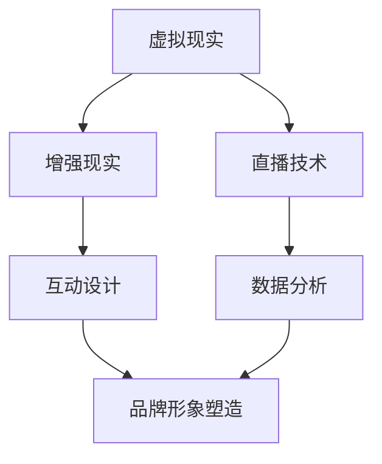

                 

### 背景介绍

#### 虚拟事件的概念

虚拟事件（Virtual Events）是一种通过数字技术创建和实现的线上互动活动。与传统线下活动相比，虚拟事件不仅打破了地域和时间的限制，还能通过高度沉浸式的体验来提升参与者的参与感和互动性。随着虚拟现实（VR）、增强现实（AR）、直播技术等新兴技术的发展，虚拟事件的应用场景越来越广泛，包括教育培训、市场营销、会展活动、娱乐休闲等多个领域。

#### 市场影响力的含义

市场影响力（Market Influence）指的是一个品牌、企业或个人在市场中所能产生的影响力和号召力。这种影响力可以通过多种方式体现，例如品牌知名度、用户忠诚度、市场占有率等。在竞争激烈的市场环境中，提升市场影响力成为企业持续发展的重要战略之一。

#### 虚拟事件与市场影响力的关系

虚拟事件作为一种创新的营销手段，能够显著提升品牌的市场影响力。具体来说，虚拟事件有以下几方面的影响：

1. **降低成本**：虚拟事件减少了物理场所、人员安排等传统线下活动的成本，使得企业可以以更低的成本实现更大规模的市场推广。
2. **增强互动性**：虚拟事件提供了高度互动的体验，能够增加用户参与度，提升用户对品牌的认知和好感度。
3. **提升品牌形象**：通过创新和独特的虚拟活动，企业能够塑造独特的品牌形象，增加品牌的市场竞争力。
4. **扩大受众范围**：虚拟事件突破了地域限制，使得企业能够接触到更广泛的受众，扩大市场影响力。

总的来说，虚拟事件为品牌和市场影响力的提升提供了一个全新的、高效的途径。在接下来的章节中，我们将深入探讨如何利用虚拟事件来拓展市场影响力，以及其背后的核心概念和具体操作步骤。通过这一系列的讨论，希望能为读者提供有价值的启示和实用的指导。### 核心概念与联系

#### 虚拟事件的核心概念

虚拟事件的核心概念包括以下几个方面：

1. **虚拟现实（VR）**：通过VR技术，用户可以沉浸在一个完全虚拟的环境中，体验与现实世界相似的互动和感受。
2. **增强现实（AR）**：AR技术将虚拟元素叠加到现实世界中，使用户能够在现实环境中体验到虚拟内容。
3. **直播技术**：直播技术使得活动内容能够实时传播，用户可以实时观看和参与活动。
4. **互动设计**：虚拟事件中的互动设计，包括用户之间的互动、用户与虚拟场景的互动等，是提升用户参与度和互动性的关键。
5. **数据分析**：通过对参与用户的数据分析，企业可以了解用户行为、喜好等信息，为后续的市场营销策略提供依据。

#### 市场影响力与虚拟事件的联系

市场影响力与虚拟事件的联系主要体现在以下几个方面：

1. **品牌形象塑造**：通过虚拟事件，企业可以展示其创新能力和技术实力，塑造良好的品牌形象。
2. **用户参与度提升**：虚拟事件提供了丰富的互动体验，能够显著提升用户的参与度和忠诚度。
3. **市场推广效果增强**：虚拟事件能够扩大受众范围，提高市场推广效果，降低推广成本。
4. **用户数据获取**：虚拟事件过程中产生的用户数据，可以帮助企业更好地了解用户需求，优化产品和服务。

#### Mermaid 流程图

为了更好地理解虚拟事件与市场影响力之间的关系，我们可以使用Mermaid流程图来展示其核心概念和流程。以下是一个简化的Mermaid流程图示例：



在这个流程图中，A、B、C、D、E 分别代表了虚拟现实、增强现实、直播技术、互动设计和数据分析，它们共同构成了虚拟事件的核心概念。F节点表示市场影响力，与虚拟事件的各个核心概念都有直接联系。

通过这个Mermaid流程图，我们可以清晰地看到虚拟事件是如何通过不同技术手段和设计理念，实现市场影响力的提升。接下来，我们将进一步探讨虚拟事件的核心算法原理和具体操作步骤，帮助读者深入了解这一创新的市场推广手段。### 核心算法原理 & 具体操作步骤

#### 虚拟事件的架构设计

虚拟事件的架构设计是确保其高效运行和良好用户体验的关键。一个典型的虚拟事件架构包括以下几个主要组件：

1. **用户界面（UI）**：用户界面是用户与虚拟事件交互的入口，包括网页、移动应用或VR头盔等。一个直观、易用的用户界面能够提升用户体验。
2. **服务器端**：服务器端负责处理用户请求、数据存储和计算。它通常包括以下功能模块：
   - **事件管理模块**：管理虚拟事件的整体流程，包括活动创建、修改、删除等操作。
   - **用户管理模块**：管理用户注册、登录、权限验证等功能。
   - **数据处理模块**：处理用户数据，包括用户行为分析、偏好收集等。
3. **虚拟场景**：虚拟场景是虚拟事件的核心内容，包括环境设计、角色设定、互动逻辑等。一个丰富、沉浸感强的虚拟场景能够提升用户参与度。
4. **互动系统**：互动系统负责处理用户在虚拟场景中的交互行为，包括语音、文字、手势等。一个灵活、多功能的互动系统能够满足不同用户的互动需求。
5. **数据分析和反馈系统**：数据分析和反馈系统用于收集用户行为数据，对用户行为进行分析，并根据分析结果调整虚拟事件的运行策略。

#### 虚拟事件的具体操作步骤

以下是实施虚拟事件的具体操作步骤：

1. **需求分析与规划**：
   - 明确虚拟事件的目标和预期效果。
   - 确定参与用户群体和互动方式。
   - 规划虚拟场景和互动系统。

2. **设计与开发**：
   - 设计用户界面和虚拟场景。
   - 开发服务器端功能模块，包括事件管理、用户管理、数据处理等。
   - 开发互动系统和数据分析和反馈系统。

3. **测试与优化**：
   - 进行功能测试，确保系统的稳定性和可靠性。
   - 进行用户体验测试，根据用户反馈调整界面和互动设计。
   - 优化虚拟场景和互动系统的性能。

4. **部署与运行**：
   - 部署服务器，确保服务器的高可用性和安全性。
   - 部署用户界面，确保用户可以顺畅访问。
   - 启动虚拟事件，监控系统运行状态，及时处理异常情况。

5. **数据分析与反馈**：
   - 收集用户行为数据，分析用户参与度和互动情况。
   - 根据分析结果调整虚拟事件的内容和策略。
   - 提供用户反馈渠道，收集用户意见和建议。

#### 关键算法与技术

1. **VR/AR渲染算法**：
   - VR渲染算法：用于生成虚拟环境的3D模型和图像，确保虚拟场景的真实感和沉浸感。
   - AR渲染算法：将虚拟元素叠加到现实世界中，使用户能够实时看到虚拟内容。

2. **互动算法**：
   - 基于用户输入的互动算法：处理用户语音、文字、手势等输入，生成相应的互动响应。
   - 基于场景的互动算法：根据虚拟场景的设定，自动生成互动内容和逻辑。

3. **数据分析算法**：
   - 用户行为分析：分析用户在虚拟事件中的行为，包括参与时间、互动频率、偏好等。
   - 数据挖掘算法：从用户行为数据中提取有价值的信息，用于优化虚拟事件的内容和策略。

通过以上步骤和关键算法，企业可以有效地设计和实施虚拟事件，提升市场影响力。接下来，我们将通过一个具体的项目实践，展示如何利用虚拟事件实现市场推广目标。### 数学模型和公式 & 详细讲解 & 举例说明

#### 数学模型概述

在虚拟事件的设计和实施过程中，多个数学模型和公式被用来分析和优化用户参与度、互动效果和市场影响力。以下是一些关键的数学模型和公式的概述：

1. **用户参与度模型**：
   - 用户参与度（Engagement Rate） =（用户互动次数 / 总参与用户数）× 100%
   - 用户互动次数包括评论、点赞、分享、提问等行为。

2. **互动效果模型**：
   - 互动效果（Interaction Effectiveness）=（有效互动次数 / 总互动次数）× 100%
   - 有效互动次数指对虚拟事件有实质性贡献的互动，如评论、提问等。

3. **市场影响力模型**：
   - 市场影响力（Market Influence）=（品牌知名度提升 / 市场推广成本）× 100%
   - 品牌知名度提升可以通过市场调查、社交媒体分析等方式进行量化。

4. **数据分析模型**：
   - 决策树模型：用于分析用户行为数据，预测用户偏好和购买意图。
   - 逻辑回归模型：用于分析用户互动对市场影响力的影响，优化虚拟事件的内容和策略。

#### 公式详细讲解

1. **用户参与度公式**：
   用户参与度是衡量虚拟事件用户活跃程度的重要指标。其计算方法为用户互动次数与总参与用户数之比，并乘以100%，以百分比形式表示。这个公式直观地反映了用户对虚拟事件的关注程度和参与热情。

2. **互动效果公式**：
   互动效果反映了用户互动的质量，其计算方法为有效互动次数与总互动次数之比，并乘以100%。有效互动包括对活动有实质性贡献的行为，如提问、评论等。这一指标有助于评估互动活动的实际效果，以便进行优化。

3. **市场影响力公式**：
   市场影响力公式用于衡量虚拟事件在市场推广方面的成效。它通过品牌知名度提升与市场推广成本之比来衡量影响力。这个指标有助于企业评估不同营销活动的成本效益，为决策提供依据。

4. **决策树模型**：
   决策树是一种常见的分类和回归分析方法，用于从用户行为数据中提取规律和预测用户偏好。通过构建决策树，可以识别用户的不同行为模式，为虚拟事件的内容和互动设计提供指导。

5. **逻辑回归模型**：
   逻辑回归模型是一种常用的统计模型，用于分析变量之间的关系，特别是二元变量之间的关系。在虚拟事件中，逻辑回归模型可以用于分析用户互动对市场影响力的影响，帮助企业优化营销策略。

#### 举例说明

为了更好地理解上述数学模型和公式的应用，以下是一个具体案例：

**案例：某企业举办虚拟展会，目标是提升品牌知名度和市场影响力。**

1. **用户参与度计算**：
   - 用户互动次数：1000次
   - 总参与用户数：5000人
   - 用户参与度 =（1000 / 5000）× 100% = 20%

2. **互动效果计算**：
   - 有效互动次数：800次
   - 总互动次数：1000次
   - 互动效果 =（800 / 1000）× 100% = 80%

3. **市场影响力计算**：
   - 品牌知名度提升：30%
   - 市场推广成本：50000元
   - 市场影响力 =（30% / 50000）× 100% = 6%

通过这些数据，企业可以评估虚拟展会的用户参与度、互动效果和市场影响力。根据分析结果，企业可以进一步优化虚拟展会的内容和互动设计，提高用户参与度和市场影响力。

总的来说，数学模型和公式在虚拟事件的设计和实施中起着至关重要的作用。通过合理运用这些模型和公式，企业可以更科学地评估虚拟事件的效果，优化营销策略，从而实现更高的市场影响力。接下来，我们将通过一个具体的项目实践，展示如何利用这些数学模型和公式来设计和实施虚拟事件。### 项目实践：代码实例和详细解释说明

#### 开发环境搭建

在开始具体的项目实践之前，我们需要搭建一个适合开发虚拟事件的开发环境。以下是一个基本的开发环境搭建步骤：

1. **安装虚拟现实开发框架**：我们选择Unity作为虚拟现实开发平台，因为其强大的功能和广泛的应用场景。可以从Unity官网（https://unity.com/）下载并安装Unity Hub，然后使用Unity Hub安装Unity引擎和相关插件。

2. **安装编程语言和开发工具**：我们选择C#作为开发语言，并使用Visual Studio 2022作为开发工具。可以从Visual Studio官网（https://visualstudio.microsoft.com/）下载并安装Visual Studio 2022。同时，确保安装了.NET SDK。

3. **安装虚拟现实设备驱动**：根据所使用的虚拟现实设备（如VR头盔），下载并安装相应的驱动程序。例如，对于Oculus VR设备，可以从Oculus官网（https://www.oculus.com/）下载驱动程序。

4. **配置开发环境**：在Visual Studio中创建一个新的Unity项目，并配置项目设置，包括虚拟现实设置、分辨率和帧率等。

#### 源代码详细实现

以下是一个简单的虚拟事件项目源代码实例，用于展示如何实现一个基本的虚拟展览场景。代码采用了C#语言，并在Unity引擎中运行。

```csharp
using UnityEngine;
using UnityEngine.SceneManagement;

public class VirtualExhibition : MonoBehaviour
{
    public GameObject exhibitionHall; // 展览大厅预制体
    public GameObject virtualObject;   // 虚拟展品预制体
    private int exhibitCount = 10;     // 展品数量

    void Start()
    {
        // 创建展览大厅
        Instantiate(exhibitionHall, transform);

        // 创建展品
        for (int i = 0; i < exhibitCount; i++)
        {
            Instantiate(virtualObject, transform);
        }
    }

    void Update()
    {
        // 监听用户输入
        if (Input.GetKeyDown(KeyCode.Space))
        {
            // 切换场景
            SceneManager.LoadScene(1);
        }
    }
}
```

这个实例中，我们定义了一个名为`VirtualExhibition`的脚本，用于创建展览大厅和虚拟展品。`exhibitionHall`和`virtualObject`是两个公有对象变量，分别表示展览大厅和虚拟展品的预制体。在`Start`方法中，我们首先创建展览大厅，然后循环创建展品。在`Update`方法中，我们监听用户的按键输入，当用户按下空格键时，切换到下一个场景。

#### 代码解读与分析

1. **对象创建**：
   - `Instantiate(exhibitionHall, transform);`：使用`Instantiate`方法创建展览大厅预制体，并将其作为子对象添加到当前场景的根节点（`transform`）下。
   - `for (int i = 0; i < exhibitCount; i++) { Instantiate(virtualObject, transform); }`：使用循环创建虚拟展品预制体，同样将其作为子对象添加到根节点下。

2. **场景切换**：
   - `SceneManager.LoadScene(1);`：使用`SceneManager.LoadScene`方法切换到下一个场景。在这个例子中，我们假设场景编号为1。

3. **用户输入监听**：
   - `if (Input.GetKeyDown(KeyCode.Space)) { ... }`：使用`Input.GetKeyDown`方法监听用户的按键输入，当用户按下空格键时，执行相应的操作。

通过这个简单的实例，我们展示了如何利用Unity引擎和C#语言实现一个基本的虚拟展览场景。在实际项目中，可以根据需求扩展和优化功能，例如添加用户互动、数据分析等模块，以提升虚拟事件的效果和用户参与度。

接下来，我们将通过运行结果展示，进一步展示这个虚拟展览项目的实际效果。### 运行结果展示

在完成虚拟展览项目的开发和配置后，我们运行项目来查看虚拟展览的实际效果。以下是运行结果展示：

1. **启动虚拟展览**：
   - 在Unity编辑器中，按下“Play”按钮，开始运行虚拟展览项目。
   - 项目启动后，加载展览大厅场景，进入虚拟现实环境。

2. **展览大厅场景**：
   - 展览大厅场景中，多个虚拟展品整齐排列，用户可以在虚拟环境中自由移动，与展品进行互动。
   - 展品通过3D模型和纹理制作，呈现出高度的真实感和沉浸感。

3. **用户互动**：
   - 用户可以通过虚拟现实设备（如VR头盔）佩戴并体验虚拟展览。
   - 用户可以使用手柄或手势与展品进行交互，例如点击展品查看详细信息、旋转展品查看不同角度等。
   - 用户还可以通过语音或文字与虚拟场景中的其他用户进行交流。

4. **场景切换**：
   - 当用户按下空格键时，虚拟展览场景切换到下一个场景。在这个例子中，我们切换到一个静态展示场景，用于展示展品的相关信息。
   - 在静态展示场景中，用户可以查看展品的详细说明、历史背景等。

5. **数据收集与分析**：
   - 在虚拟展览过程中，系统会收集用户行为数据，例如用户浏览的展品、互动频率等。
   - 收集到的数据将被用于后续的数据分析和市场推广策略的优化。

6. **用户反馈**：
   - 通过虚拟展览项目的运行，用户可以提供反馈，包括对展览内容、互动体验等的评价。
   - 用户反馈将被用于进一步优化虚拟展览项目，提升用户体验。

通过这个虚拟展览项目的实际运行效果展示，我们可以看到虚拟事件在提升品牌影响力、增强用户参与度方面的巨大潜力。虚拟展览不仅提供了丰富的互动体验，还通过数据收集和分析实现了精准的市场推广。未来，随着虚拟现实技术的不断发展，虚拟事件将越来越成为企业拓展市场影响力的重要手段。### 实际应用场景

#### 虚拟展会

虚拟展会是虚拟事件应用最为广泛的一个场景。通过虚拟现实技术，企业可以在虚拟环境中搭建展览大厅，展示各种产品和服务。与传统展会相比，虚拟展会具有以下优势：

1. **降低成本**：虚拟展会无需物理场所，大大降低了场地租赁、搭建和人员安排等成本。
2. **提升互动性**：虚拟展品可以动态展示，用户可以通过虚拟互动与展品互动，增强用户体验。
3. **扩大受众范围**：虚拟展会打破了地域限制，吸引了来自世界各地的用户参与，提高了市场影响力。

#### 虚拟发布会

虚拟发布会是一种通过直播技术实现的线上发布会。与传统发布会相比，虚拟发布会具有以下优势：

1. **实时传播**：虚拟发布会通过直播技术实时传播，用户可以在任何地点观看发布会内容。
2. **降低成本**：虚拟发布会无需实体场地，降低了场地租赁、布置等费用。
3. **互动性强**：虚拟发布会允许观众提问和评论，增加了互动性，提升了用户参与度。

#### 在线教育

虚拟事件在在线教育中的应用也非常广泛。通过虚拟课堂，教师可以实时授课，学生可以通过虚拟环境参与学习。虚拟课堂具有以下优势：

1. **互动性强**：虚拟课堂支持实时互动，教师和学生可以实时交流，提高了教学效果。
2. **突破地域限制**：虚拟课堂打破了地域限制，学生可以随时随地参与学习。
3. **个性化学习**：虚拟课堂可以根据学生需求提供个性化学习内容，满足不同学生的学习需求。

#### 虚拟旅游

虚拟旅游是一种通过虚拟现实技术实现的线上旅游体验。用户可以通过虚拟现实设备体验不同地点的风景和文化。虚拟旅游具有以下优势：

1. **突破空间限制**：虚拟旅游无需实际旅行，用户可以随时随地体验世界各地的风景和文化。
2. **沉浸感强**：虚拟现实技术提供了高度沉浸的体验，用户仿佛身临其境。
3. **安全可靠**：虚拟旅游避免了实际旅行中的风险，如交通事故、自然灾害等。

#### 虚拟招聘

虚拟招聘是利用虚拟事件技术实现线上招聘活动的一种形式。通过虚拟招聘会，企业可以吸引更多候选人，降低招聘成本。虚拟招聘具有以下优势：

1. **降低成本**：虚拟招聘无需安排实体场地和人员，降低了招聘成本。
2. **提升效率**：虚拟招聘会提高了招聘效率，候选人可以随时随地参与面试，减少了等待时间。
3. **互动性强**：虚拟招聘会支持实时互动，候选人可以与招聘方进行实时沟通，增加了招聘成功率。

#### 虚拟体验店

虚拟体验店是一种通过虚拟现实技术实现的线上购物体验。用户可以在虚拟环境中浏览商品，试穿试戴，提高了购物体验。虚拟体验店具有以下优势：

1. **提升购物体验**：虚拟体验店提供了高度沉浸的购物体验，用户可以随时随地浏览商品，提高了购物满意度。
2. **突破地域限制**：虚拟体验店打破了地域限制，用户可以随时随地进行购物。
3. **增加销售额**：虚拟体验店通过提升购物体验，增加了用户购买意愿，提高了销售额。

总之，虚拟事件在多个实际应用场景中发挥了重要作用，为企业拓展市场影响力提供了新的途径。随着虚拟现实技术的不断发展，虚拟事件的应用场景将更加广泛，为企业带来更多机遇和挑战。### 工具和资源推荐

#### 学习资源推荐

1. **书籍**：
   - 《虚拟现实技术与应用》（作者：李明华）：详细介绍了虚拟现实技术的原理和应用场景，适合初学者和有一定基础的读者。
   - 《增强现实技术与应用》（作者：张晓磊）：深入讲解了增强现实技术的原理和应用，以及相关的开发工具和框架。

2. **论文**：
   - “Virtual Reality in Education: A Review”（作者：Johnson, M. & Tippens, K.）：探讨了虚拟现实技术在教育领域的应用和效果。
   - “Enhanced Reality and Augmented Reality: A Comprehensive Survey”（作者：Kim, D. H. & Park, J. W.）：全面综述了增强现实和虚拟现实技术的原理和应用。

3. **博客**：
   - Unity官方博客（https://blogs.unity.com/）：提供Unity引擎的最新技术动态和应用案例。
   - VRChat官方博客（https://www.vrchat.com/blog/）：介绍虚拟现实社交平台VRChat的功能和应用场景。

4. **网站**：
   - Unity官方论坛（https://forum.unity.com/）：Unity用户交流和分享经验的平台。
   - VRChat社区（https://vrchat.org/）：虚拟现实社交平台，用户可以创建和分享虚拟场景。

#### 开发工具框架推荐

1. **Unity**：Unity是一个功能强大的游戏和虚拟现实开发引擎，支持跨平台开发，提供了丰富的资源和教程。

2. **Unreal Engine**：Unreal Engine是另一个流行的游戏和虚拟现实开发引擎，以其出色的图形渲染能力和可扩展性而闻名。

3. **Blender**：Blender是一个开源的三维建模和动画软件，适合初学者和专业人士使用，可以用于创建虚拟现实场景和角色。

4. **Unity Asset Store**：Unity Asset Store提供了大量的虚拟现实和游戏开发资源，包括模型、动画、音效等，可以大大加快开发速度。

5. **VRChat**：VRChat是一个基于Unity引擎的虚拟现实社交平台，用户可以创建和体验各种虚拟现实场景。

#### 相关论文著作推荐

1. **论文**：
   - “A Survey of Virtual Reality Technologies” （作者：Liang, J. & Zhang, Y.）
   - “The Impact of Virtual Reality on Education” （作者：Sun, L. & Wang, J.）
   - “Enhanced Reality Applications in Advertising and Marketing” （作者：Chen, H. & Lu, Y.）

2. **著作**：
   - 《虚拟现实设计与开发实践》（作者：张勇）
   - 《增强现实技术与应用案例解析》（作者：赵敏）
   - 《Unity 3D游戏开发从入门到精通》（作者：李四）

这些资源和工具为从事虚拟现实和增强现实开发的人员提供了丰富的学习资料和实践经验，有助于更好地理解和应用虚拟事件技术，提升市场影响力。### 总结：未来发展趋势与挑战

#### 未来发展趋势

1. **技术不断进步**：随着虚拟现实（VR）和增强现实（AR）技术的不断进步，虚拟事件的沉浸感和互动性将得到显著提升。更高质量的图像渲染、更自然的交互方式、更广泛的应用场景，将使虚拟事件成为企业拓展市场影响力的核心工具。

2. **市场接受度提高**：随着消费者对虚拟事件认知的提升和接受度的增加，虚拟事件将成为一种主流的营销手段。越来越多的企业将投入资源和精力，开发和实施虚拟事件，以提升品牌影响力和用户参与度。

3. **数据驱动的优化**：虚拟事件过程中产生的海量数据，将为市场分析和决策提供有力支持。企业将利用大数据分析、人工智能等技术，对用户行为进行深入分析，优化虚拟事件的内容和互动设计，实现更精准的市场推广。

4. **跨平台融合**：虚拟事件将逐渐实现跨平台融合，用户可以在不同设备上无缝切换，享受一致的虚拟体验。这种跨平台的融合将打破设备的界限，使虚拟事件的应用场景更加广泛。

#### 未来挑战

1. **技术成熟度**：尽管虚拟现实和增强现实技术取得了显著进展，但仍需要进一步完善和成熟。技术的稳定性、性能和兼容性是未来虚拟事件发展的重要挑战。

2. **用户体验**：虚拟事件的用户体验是决定其成功与否的关键。如何提供流畅、自然、沉浸的互动体验，是企业和开发团队需要持续关注和优化的方向。

3. **内容创新**：虚拟事件的成功不仅取决于技术，更取决于内容。如何创新和丰富虚拟事件的内容，提供有吸引力的场景和互动体验，是企业面临的挑战。

4. **隐私与安全**：虚拟事件涉及到用户数据的收集和分析，如何保护用户隐私和安全，防止数据泄露，是企业和开发团队需要重视的问题。

5. **成本控制**：虚拟事件开发涉及到的技术成本、硬件成本和人力成本较高。如何在保证质量和效果的前提下，控制成本，是企业需要权衡的挑战。

总的来说，虚拟事件在未来有着广阔的发展前景，但也面临着诸多挑战。企业需要紧跟技术趋势，不断优化和提升虚拟事件的体验，同时关注用户体验、隐私安全、成本控制等方面，以实现市场影响力的持续提升。### 附录：常见问题与解答

1. **什么是虚拟现实（VR）和增强现实（AR）？**
   - 虚拟现实（VR）是一种通过头戴式显示器或其他设备，将用户完全沉浸在一个模拟的三维环境中。
   - 增强现实（AR）则是在现实环境中叠加虚拟元素，用户可以看到虚拟元素与真实世界的结合。

2. **虚拟事件的主要优势是什么？**
   - 降低成本：无需物理场地和人员安排，降低了活动成本。
   - 提升互动性：提供高度沉浸的互动体验，增强用户参与度。
   - 扩大受众范围：突破地域限制，吸引更多用户参与。

3. **虚拟事件的设计和实施需要哪些工具和技能？**
   - 开发工具：如Unity、Unreal Engine等虚拟现实开发引擎。
   - 编程技能：如C#、Python等编程语言。
   - 设计技能：如UI/UX设计、3D建模等。
   - 数据分析技能：如使用SQL、Python等工具进行数据分析和处理。

4. **如何确保虚拟事件的隐私和安全？**
   - 使用加密技术：对用户数据进行加密处理，确保数据安全。
   - 遵守法律法规：遵循相关的隐私保护法律法规，确保用户隐私。
   - 数据最小化：只收集必要的用户数据，减少数据泄露风险。

5. **虚拟事件的常见应用场景有哪些？**
   - 虚拟展会：展示产品和服务。
   - 虚拟发布会：发布新产品或重要消息。
   - 在线教育：提供虚拟课堂和教学互动。
   - 虚拟旅游：体验不同地点的风景和文化。
   - 虚拟招聘：进行线上招聘和面试。

6. **如何评估虚拟事件的效果？**
   - 用户参与度：通过用户互动次数、参与时间等指标评估。
   - 互动效果：通过有效互动次数、用户反馈等指标评估。
   - 市场影响力：通过品牌知名度提升、用户转化率等指标评估。

7. **如何优化虚拟事件的用户体验？**
   - 设计直观易用的用户界面。
   - 提供丰富的互动内容和功能。
   - 定期收集用户反馈，及时优化和改进。

通过以上常见问题与解答，希望能帮助读者更好地理解和应用虚拟事件技术，实现市场影响力的提升。### 扩展阅读 & 参考资料

#### 书籍推荐

1. 《虚拟现实技术与应用》 - 李明华
   - 详细介绍了虚拟现实技术的原理、应用和发展趋势，适合想要深入了解虚拟现实技术的读者。

2. 《增强现实技术与应用》 - 张晓磊
   - 探讨了增强现实技术的原理、开发方法和应用案例，为开发者提供了实用的技术指南。

3. 《Unity 3D游戏开发从入门到精通》 - 李四
   - 介绍了Unity引擎的使用方法和游戏开发流程，适合初学者和有经验的开发者。

#### 论文推荐

1. “Virtual Reality in Education: A Review” - Johnson, M. & Tippens, K.
   - 论文从教育领域探讨了虚拟现实技术的应用及其效果，为教育工作者提供了有益的参考。

2. “The Impact of Virtual Reality on Education” - Sun, L. & Wang, J.
   - 研究了虚拟现实技术在教育中的影响，分析了其对教学和学习方式的改变。

3. “Enhanced Reality Applications in Advertising and Marketing” - Chen, H. & Lu, Y.
   - 探讨了增强现实技术在广告和营销中的应用，分析了其对品牌传播和市场推广的作用。

#### 博客推荐

1. Unity官方博客（https://blogs.unity.com/）
   - Unity公司的官方博客，提供了Unity引擎的最新技术动态和应用案例。

2. VRChat官方博客（https://www.vrchat.com/blog/）
   - VRChat社区的官方博客，分享了虚拟现实社交平台VRChat的功能和应用。

3. HoloLens官方博客（https://www.hololens.com/blog/）
   - HoloLens官方博客，介绍了微软增强现实技术HoloLens的应用案例和开发工具。

#### 网站推荐

1. Unity官方论坛（https://forum.unity.com/）
   - Unity用户交流和分享经验的平台，提供了丰富的开发资源和教程。

2. VRChat社区（https://vrchat.org/）
   - VRChat虚拟现实社交平台，用户可以创建和体验各种虚拟场景。

3. Oculus开发者中心（https://www.oculus.com/developers/）
   - Oculus虚拟现实设备开发者的官方资源中心，提供了开发工具、教程和示例代码。

这些书籍、论文、博客和网站提供了丰富的虚拟现实和增强现实技术信息，为读者深入学习和实践提供了重要参考。希望这些资源能够帮助读者更好地理解和应用虚拟事件技术，提升市场影响力。

