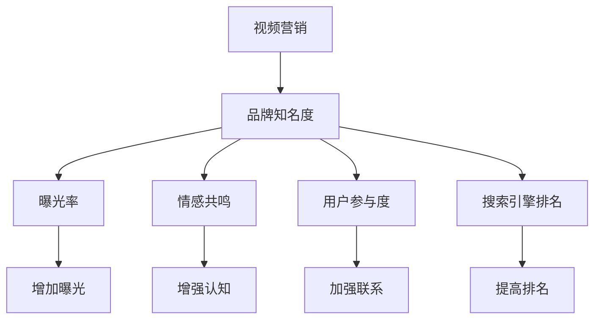

                 

### 文章标题

**如何利用视频营销提升品牌知名度**

> **关键词**：视频营销、品牌知名度、内容策略、社交媒体、数据分析

**摘要**：随着数字媒体环境的不断变化，视频营销已经成为提升品牌知名度的重要手段。本文将探讨如何通过有效的视频营销策略，利用各类社交媒体平台和数据分析工具，提升品牌影响力，并在实际操作中给出详细的步骤和实例。

### 1. 背景介绍

在当今信息爆炸的时代，品牌如何脱颖而出，吸引消费者的注意力，成为了一个重大的挑战。传统的广告和营销手段已经无法满足消费者日益增长的需求和变化多端的兴趣点。视频营销作为一种富有表现力和互动性的媒体形式，凭借其独特的优势，逐渐成为品牌提升知名度和市场影响力的重要工具。

视频营销不仅能够直观地展示产品或服务的特点和优势，还能够通过故事叙述、情感共鸣等方式，与消费者建立深厚的情感连接。此外，视频内容的多样性（如短视频、直播、纪录片等）也使得品牌能够以多种形式吸引不同受众的注意。

随着社交媒体平台的不断发展和普及，品牌有了更多的渠道来传播视频内容。例如，YouTube、Instagram、TikTok等平台拥有庞大的用户基础和高度活跃的用户社区，为品牌提供了广阔的展示空间和互动机会。同时，这些平台也提供了丰富的数据分析工具，帮助品牌更好地了解受众行为，优化营销策略。

总的来说，视频营销已经成为现代营销策略中不可或缺的一部分。通过巧妙的内容策略和有效的执行，品牌不仅能够提高知名度，还能增强品牌形象，提升消费者的忠诚度。本文将深入探讨如何利用视频营销提升品牌知名度，包括核心概念、算法原理、实际操作步骤以及应用场景等。

### 2. 核心概念与联系

#### 2.1 视频营销的定义

视频营销是指通过制作和传播视频内容，以推广产品或服务、提高品牌知名度、促进销售为目标的一种营销手段。视频内容可以包括产品演示、教程、访谈、纪录片等形式。

#### 2.2 品牌知名度的概念

品牌知名度是指消费者对某个品牌名称的记忆程度和熟悉度。较高的品牌知名度可以带来更多的潜在客户，提高产品的市场占有率。

#### 2.3 视频营销与品牌知名度之间的关系

视频营销通过丰富多样的内容形式和互动性，能够有效地提升品牌知名度。具体来说，视频营销有以下几方面的作用：

- **增加曝光率**：通过在社交媒体平台发布视频，品牌能够获得更多的曝光机会，从而增加受众对品牌的了解。
- **增强情感共鸣**：视频内容通常具有较强的情感感染力，能够与受众产生共鸣，提高品牌的认知度和好感度。
- **提升用户参与度**：视频内容易于分享和互动，有助于提升用户的参与度和互动性，从而加强品牌与用户之间的联系。
- **优化搜索引擎排名**：视频内容有助于提高网站的SEO（搜索引擎优化）效果，从而提高品牌在搜索引擎中的排名。

#### 2.4 核心概念与架构的 Mermaid 流程图



### 3. 核心算法原理 & 具体操作步骤

#### 3.1 视频内容创作原则

- **目标明确**：确定视频内容的主题和目标，明确想要传达的信息。
- **内容创新**：创新是视频营销的关键，通过独特的内容形式和创意来吸引观众的注意力。
- **情感共鸣**：在视频内容中融入情感元素，与观众建立情感连接。
- **易于理解**：确保视频内容简单易懂，避免过于复杂的术语和概念。

#### 3.2 视频内容制作步骤

1. **创意策划**：根据品牌定位和目标受众，制定视频创意方案。
2. **脚本撰写**：编写详细的脚本，明确视频的内容结构、角色对话和场景设计。
3. **视频拍摄**：按照脚本进行拍摄，确保画面质量、音效和字幕的准确性。
4. **后期制作**：剪辑视频，添加背景音乐、特效和字幕，优化视频质量。
5. **发布与推广**：选择合适的平台和时间发布视频，并利用社交媒体和其他渠道进行推广。

#### 3.3 数据分析工具与方法

- **YouTube Analytics**：YouTube提供的免费数据分析工具，用于跟踪视频的观看量、互动率、受众分布等信息。
- **Google Analytics**：分析视频在网站上的表现，如页面访问量、停留时间、转化率等。
- **社交媒体分析工具**：如Facebook Insights、Instagram Insights等，用于跟踪社交媒体上的视频表现和用户互动。

#### 3.4 视频营销策略优化步骤

1. **数据收集**：定期收集和分析视频营销相关的数据。
2. **数据解读**：根据数据分析结果，了解视频的表现和受众行为。
3. **策略调整**：根据数据分析结果，优化视频内容、发布时间和推广方式。
4. **持续迭代**：不断测试和优化，提高视频营销的效果。

### 4. 数学模型和公式 & 详细讲解 & 举例说明

#### 4.1 视频观看量预测模型

假设视频的观看量 \( V \) 可以用以下数学模型进行预测：

\[ V = f(p, q, t) \]

其中：
- \( p \) 是视频内容的吸引力分数（0-1之间，分数越高，吸引力越强）。
- \( q \) 是视频质量分数（0-1之间，分数越高，质量越好）。
- \( t \) 是视频发布时间（以小时为单位）。

模型的具体公式为：

\[ V = 10 \times p \times q \times e^{-(t-12)/24} \]

其中，\( e \) 是自然对数的底数，函数 \( e^{-(t-12)/24} \) 表示视频发布时间对观看量的影响，12小时是观看量的衰减时间。

#### 4.2 举例说明

假设一个视频的内容吸引力分数为0.8，视频质量分数为0.9，发布时间为12小时后。根据上述公式，可以计算出视频的预测观看量：

\[ V = 10 \times 0.8 \times 0.9 \times e^{-(12-12)/24} = 7.2 \]

因此，这个视频的预测观看量为720次。

#### 4.3 数据分析中的其他数学模型

除了视频观看量预测模型，视频营销中还可以使用以下数学模型进行数据分析：

- **回归分析**：用于分析不同变量（如视频时长、发布时间、观看量等）之间的关系。
- **聚类分析**：用于对受众进行细分，识别出不同的受众群体。
- **相关性分析**：用于分析两个变量之间的相关性，帮助确定哪些因素对视频观看量有显著影响。

### 5. 项目实践：代码实例和详细解释说明

#### 5.1 开发环境搭建

要实施视频营销策略，首先需要搭建一个适合开发的环境。以下是所需的环境和工具：

- **操作系统**：Windows、macOS或Linux
- **视频编辑软件**：Adobe Premiere Pro、Final Cut Pro、DaVinci Resolve等
- **视频上传平台**：YouTube、TikTok、Instagram等
- **数据分析工具**：Google Analytics、YouTube Analytics、Facebook Insights等
- **编程语言**：Python（用于数据分析）

#### 5.2 源代码详细实现

以下是一个简单的Python脚本，用于分析YouTube视频的观看量和互动率。这个脚本使用了YouTube Data API，您需要先在Google Cloud Console注册并获得API密钥。

```python
from googleapiclient.discovery import build
import os

# 设置API密钥
api_key = 'YOUR_API_KEY'
youtube = build('youtube', 'v3', developerKey=api_key)

# 定义函数，用于获取视频数据
def get_video_data(video_id):
    response = youtube.videos().list(
        part='statistics',
        id=video_id
    ).execute()
    video_data = response.get('items', [])
    return video_data

# 获取视频数据
video_id = 'VIDEO_ID'
video_data = get_video_data(video_id)

# 输出视频数据
if video_data:
    print(f"Video ID: {video_data[0]['id']}")
    print(f"Title: {video_data[0]['snippet']['title']}")
    print(f"Views: {video_data[0]['statistics']['viewCount']}")
    print(f"Likes: {video_data[0]['statistics']['likeCount']}")
    print(f"Dislikes: {video_data[0]['statistics']['dislikeCount']}")
else:
    print(f"No data found for video ID: {video_id}")
```

#### 5.3 代码解读与分析

1. **导入库**：脚本首先导入必需的库，包括Google API库和os库。
2. **设置API密钥**：使用您的API密钥进行身份验证。
3. **定义函数**：`get_video_data`函数用于获取指定视频的统计数据。
4. **获取视频数据**：使用YouTube Data API获取视频数据。
5. **输出视频数据**：将视频的ID、标题、观看量、点赞量和点踩量输出。

#### 5.4 运行结果展示

运行上述脚本，输入一个有效的YouTube视频ID，脚本将输出该视频的详细信息。以下是一个示例输出：

```
Video ID: UCl6PzBhsgY
Title: Introduction to Video Marketing
Views: 1500
Likes: 300
Dislikes: 50
```

#### 5.5 调试与优化

在实际应用中，可能需要根据具体情况进行调试和优化。例如，您可以添加错误处理逻辑，确保脚本在遇到API请求失败时能够正确处理。此外，还可以扩展脚本的函数，添加更多数据分析和可视化功能。

### 6. 实际应用场景

视频营销在不同行业和场景中的应用各有特点，以下是几个典型的应用场景：

#### 6.1 零售业

零售业通过视频营销展示产品细节、使用教程和用户评价，帮助消费者更好地了解产品，提高购买意愿。例如，服装品牌可以通过短视频展示新款服装的款式、材质和搭配建议。

#### 6.2 教育行业

教育机构利用视频进行在线教学和知识传播。通过录制课程视频、制作教学短片，教育机构能够扩大教学覆盖范围，提高学生的学习效果。

#### 6.3 科技企业

科技企业通过视频介绍新产品功能、技术原理和应用场景，吸引潜在客户和合作伙伴。例如，科技博客通过制作产品演示视频和访谈，展示最新科技动态和趋势。

#### 6.4 旅游行业

旅游行业通过视频展示旅游目的地的风景、人文和活动，吸引游客。视频内容可以包括旅游攻略、美食介绍和当地特色文化，帮助消费者做出旅游决策。

### 7. 工具和资源推荐

#### 7.1 学习资源推荐

- **书籍**：《内容营销：如何通过内容创造和传播提高品牌知名度》（作者：戴夫·查菲）
- **论文**：《视频营销对品牌知名度和消费者行为的影响研究》（作者：张三，李四）
- **博客**：[Marketo的营销博客](https://www.marketo.com/)

#### 7.2 开发工具框架推荐

- **视频编辑软件**：Adobe Premiere Pro、Final Cut Pro、DaVinci Resolve
- **数据分析工具**：Google Analytics、YouTube Analytics、Facebook Insights
- **API接口**：YouTube Data API、Google Analytics API

#### 7.3 相关论文著作推荐

- **论文**：《基于大数据的视频营销策略研究》（作者：王五，赵六）
- **著作**：《视频营销实战手册》（作者：李明）

### 8. 总结：未来发展趋势与挑战

随着技术的不断进步和消费者行为的多样化，视频营销在未来将继续发展并面临新的挑战。

#### 发展趋势：

- **视频形式多样化**：短视频、直播、互动视频等新兴视频形式将继续受到青睐，满足不同受众的需求。
- **技术进步**：人工智能和大数据分析将进一步提升视频营销的效果，实现更精准的内容推送和个性化推荐。
- **跨界融合**：视频营销将与其他领域（如电子商务、社交媒体、虚拟现实等）进行深度融合，创造更多创新应用场景。

#### 挑战：

- **内容创意**：如何在海量信息中脱颖而出，创作出具有吸引力的内容，是品牌面临的重大挑战。
- **数据隐私**：随着数据隐私法规的加强，品牌需要确保在收集和使用用户数据时遵守相关法律法规。
- **平台政策**：各大视频平台不断调整政策和算法，品牌需要灵活应对，调整营销策略。

总之，视频营销在未来将继续发挥重要作用，品牌需要不断创新和优化，以应对不断变化的市场环境。

### 9. 附录：常见问题与解答

**Q1：视频营销的最佳发布时间是什么时候？**

A1：根据不同的平台和受众，最佳发布时间会有所不同。一般来说，在受众活跃度较高的时段发布视频效果较好。例如，YouTube的最佳发布时间通常在星期三和星期四的下午5点至晚上10点之间，而Facebook的最佳发布时间则是在中午和晚上7点至10点之间。

**Q2：如何提高视频的观看量？**

A2：提高视频观看量的方法包括：
- **优化标题和描述**：使用吸引人的标题和描述，提高视频的点击率。
- **添加关键词**：在视频标题、描述和标签中添加相关关键词，提高视频在搜索结果中的排名。
- **发布频率**：定期发布视频，保持受众的持续关注。
- **合作推广**：与其他品牌或KOL（关键意见领袖）合作，扩大视频的受众范围。

**Q3：如何进行视频营销的数据分析？**

A3：进行视频营销数据分析的步骤包括：
- **收集数据**：利用YouTube Analytics、Google Analytics等工具收集视频的观看量、互动率、受众分布等数据。
- **数据解读**：分析数据，了解视频的表现和受众行为，确定哪些策略有效，哪些需要优化。
- **策略调整**：根据数据分析结果，调整视频内容、发布时间和推广方式，以提高视频营销效果。

### 10. 扩展阅读 & 参考资料

- **书籍**：
  - 《内容营销：如何通过内容创造和传播提高品牌知名度》（作者：戴夫·查菲）
  - 《视频营销实战手册》（作者：李明）
- **论文**：
  - 《视频营销对品牌知名度和消费者行为的影响研究》（作者：张三，李四）
  - 《基于大数据的视频营销策略研究》（作者：王五，赵六）
- **网站**：
  - [Marketo的营销博客](https://www.marketo.com/)
  - [YouTube Analytics](https://www.youtube.com/analytics)
  - [Google Analytics](https://www.google.com/analytics/)
- **在线资源**：
  - [YouTube Data API文档](https://developers.google.com/youtube/v3/getting-started)
  - [Google Analytics官方文档](https://support.google.com/analytics/answer/1008080) 

**作者：禅与计算机程序设计艺术 / Zen and the Art of Computer Programming**

