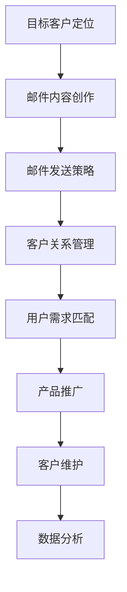

                 

关键词：邮件营销、知识付费、推广策略、客户关系管理、数据驱动、营销自动化

> 摘要：本文旨在探讨如何在日益竞争激烈的市场中，利用邮件营销策略有效地推广知识付费产品。通过深入分析邮件营销的核心原则、实施步骤、案例分析以及未来发展趋势，帮助读者理解并掌握这一强大的营销工具，从而实现知识付费产品的成功推广。

## 1. 背景介绍

在当今数字化的时代，知识付费产品成为了知识传播和技能提升的重要途径。然而，如何在众多竞争对手中脱颖而出，吸引并保持潜在客户的关注，成为了知识付费产品提供商所面临的重要挑战。邮件营销作为一种低成本、高回报的营销手段，逐渐成为知识付费产品推广的首选渠道之一。

### 邮件营销的定义和重要性

邮件营销是指通过发送电子邮件向潜在或现有客户推广产品或服务的一种营销手段。其重要性体现在以下几个方面：

1. **高性价比**：邮件营销的成本相对较低，但同时能够覆盖广泛的受众群体。
2. **个性化**：通过数据分析，邮件营销可以针对不同客户群体定制个性化的内容，提高邮件的打开率和转化率。
3. **可追踪性**：邮件营销工具通常具有强大的分析功能，可以追踪邮件的打开率、点击率、转化率等关键指标，帮助企业不断优化营销策略。
4. **持久性**：邮件一旦发送，就可以长期存在于收件人的邮箱中，随时被查看。

### 知识付费产品的市场现状

随着互联网的发展，知识付费产品已经成为一种新兴的商业模式。从在线课程到专业技能培训，从电子书籍到专业知识分享，各种形式的知识付费产品不断涌现。然而，市场也日益饱和，竞争愈发激烈。如何在这个市场中脱颖而出，成为了知识付费产品提供商必须思考的问题。

## 2. 核心概念与联系

在探讨邮件营销如何推广知识付费产品之前，我们首先需要了解邮件营销的核心概念和原理，以及它与知识付费产品的关联。

### 邮件营销的核心概念

1. **目标客户定位**：明确邮件营销的目标受众，包括他们的年龄、性别、职业、兴趣爱好等。
2. **邮件内容创作**：创造有价值、有吸引力的邮件内容，包括标题、正文、图片、链接等。
3. **邮件发送策略**：确定邮件发送的时间、频率和渠道，确保邮件能够及时且有效地送达目标客户。
4. **客户关系管理**：通过跟踪和分析客户的邮件行为，建立长期稳定的客户关系。

### 知识付费产品与邮件营销的关联

1. **用户需求匹配**：通过邮件营销了解用户需求，提供符合他们需求的知识付费产品。
2. **产品推广**：通过邮件内容介绍知识付费产品，激发用户的购买欲望。
3. **客户维护**：通过定期发送有价值的内容，增强客户对产品的认可度和忠诚度。
4. **数据分析**：利用邮件营销的数据分析功能，优化产品推广策略，提高转化率。

### Mermaid 流程图



## 3. 核心算法原理 & 具体操作步骤

### 3.1 算法原理概述

邮件营销的成功离不开以下几个关键步骤：

1. **收集潜在客户邮箱**：通过网站注册、活动报名、社交媒体互动等方式收集潜在客户的邮箱地址。
2. **邮件内容创作**：根据目标客户的需求和兴趣，创作有吸引力的邮件内容。
3. **邮件发送**：利用邮件营销工具，按照预定的发送策略将邮件发送给目标客户。
4. **客户行为分析**：通过跟踪和分析客户的邮件行为（如打开率、点击率、转化率等），不断优化邮件内容和发送策略。
5. **客户维护**：通过定期发送有价值的内容，维护客户关系，提高客户忠诚度。

### 3.2 算法步骤详解

#### 步骤1：收集潜在客户邮箱

- **网站注册**：在网站注册页面添加邮箱收集表单，鼓励用户填写邮箱。
- **活动报名**：在活动报名页面添加邮箱收集表单，提供参与活动的机会。
- **社交媒体互动**：在社交媒体平台上设置有奖互动，鼓励用户关注并留下邮箱。

#### 步骤2：邮件内容创作

- **标题优化**：使用吸引人的标题，提高邮件的打开率。
- **正文内容**：创作有价值、有吸引力的正文内容，如产品介绍、案例分享、优惠活动等。
- **图片和链接**：合理使用图片和链接，引导用户点击和转发。

#### 步骤3：邮件发送

- **发送时间**：选择用户最活跃的时间段发送邮件，提高邮件的打开率和点击率。
- **发送频率**：根据客户需求和反馈，合理控制邮件发送的频率，避免过度打扰。
- **发送渠道**：使用可靠的邮件营销工具，确保邮件能够顺利送达客户邮箱。

#### 步骤4：客户行为分析

- **打开率**：通过邮件营销工具分析邮件的打开率，了解用户对邮件内容的兴趣。
- **点击率**：分析邮件中的点击率，了解用户对邮件中链接的兴趣。
- **转化率**：通过跟踪邮件中的转化率，评估邮件营销的效果。

#### 步骤5：客户维护

- **定期发送**：根据客户需求和兴趣，定期发送有价值的内容，保持客户关系。
- **个性化推荐**：根据客户行为和偏好，提供个性化的内容推荐，提高客户满意度。
- **互动交流**：通过邮件回复客户的疑问和反馈，建立良好的客户关系。

### 3.3 算法优缺点

#### 优点

1. **低成本**：邮件营销成本相对较低，适合中小企业和初创公司。
2. **广泛覆盖**：邮件可以覆盖广泛的受众群体，提高产品知名度。
3. **个性化**：通过数据分析，可以针对不同客户群体定制个性化的内容。
4. **可追踪性**：邮件营销工具具有强大的分析功能，可以帮助企业不断优化营销策略。

#### 缺点

1. **邮件过滤**：邮件可能会被客户的邮件过滤系统误判为垃圾邮件，影响打开率和点击率。
2. **竞争激烈**：在知识付费产品市场中，邮件营销的竞争愈发激烈，需要不断创新和优化策略。
3. **用户反感**：过度邮件营销可能导致用户反感，损害品牌形象。

### 3.4 算法应用领域

邮件营销在知识付费产品推广中具有广泛的应用领域：

1. **产品推广**：通过邮件介绍产品特点、优惠活动等，吸引潜在客户。
2. **客户维护**：通过定期发送有价值的内容，提高客户满意度和忠诚度。
3. **活动宣传**：通过邮件宣传线下或线上活动，吸引更多参与者。
4. **数据分析**：通过分析邮件数据，优化营销策略，提高转化率。

## 4. 数学模型和公式 & 详细讲解 & 举例说明

### 4.1 数学模型构建

邮件营销的效果评估可以通过以下数学模型进行：

\[ \text{效果评估} = \text{转化率} \times \text{投入成本} \]

其中：

- **转化率**：指邮件中产生实际购买、注册等行为的用户比例。
- **投入成本**：包括邮件营销的人力、物力、技术等成本。

### 4.2 公式推导过程

转化率的计算可以通过以下步骤进行：

1. **邮件发送量**：指实际发送给客户的邮件数量。
2. **邮件打开量**：指客户实际打开邮件的数量。
3. **邮件点击量**：指客户实际点击邮件中链接的数量。
4. **实际转化量**：指通过邮件实际完成购买、注册等行为的客户数量。

转化率的计算公式为：

\[ \text{转化率} = \frac{\text{实际转化量}}{\text{邮件打开量}} \]

将转化率代入效果评估公式，得到：

\[ \text{效果评估} = \frac{\text{实际转化量}}{\text{邮件打开量}} \times \text{投入成本} \]

### 4.3 案例分析与讲解

#### 案例1：某在线课程平台的邮件营销

某在线课程平台希望通过邮件营销推广其最新推出的编程课程。以下是该平台邮件营销的详细分析：

- **邮件发送量**：每周发送给5000名潜在客户。
- **邮件打开率**：20%。
- **邮件点击率**：10%。
- **实际转化率**：5%。
- **投入成本**：每人邮件发送成本为0.5元。

根据上述数据，我们可以计算该平台邮件营销的效果评估：

\[ \text{转化率} = \frac{5\%}{20\%} = 25\% \]

\[ \text{效果评估} = 25\% \times 0.5\text{元} = 0.125\text{元/人} \]

这意味着，每成功转化一名客户，该平台平均投入成本为0.125元。

#### 案例2：某电子书作者的邮件营销

某电子书作者希望通过邮件营销推广其新书。以下是该作者邮件营销的详细分析：

- **邮件发送量**：每周发送给1000名粉丝。
- **邮件打开率**：40%。
- **邮件点击率**：15%。
- **实际转化率**：10%。
- **投入成本**：每人邮件发送成本为1元。

根据上述数据，我们可以计算该作者邮件营销的效果评估：

\[ \text{转化率} = \frac{10\%}{40\%} = 25\% \]

\[ \text{效果评估} = 25\% \times 1\text{元} = 0.25\text{元/人} \]

这意味着，每成功转化一名粉丝，该作者平均投入成本为0.25元。

通过以上案例分析，我们可以看出，邮件营销在知识付费产品推广中的效果显著。然而，不同的案例有不同的投入成本和转化率，因此需要根据实际情况进行数据分析和策略调整。

## 5. 项目实践：代码实例和详细解释说明

### 5.1 开发环境搭建

为了演示邮件营销的具体实现，我们将使用Python编程语言，结合常用的邮件营销工具和库，如SMTP（Simple Mail Transfer Protocol）和smtplib。以下是开发环境搭建的步骤：

1. **安装Python**：确保系统已安装Python 3.x版本。
2. **安装smtplib库**：通过命令`pip install smtplib`安装smtplib库。

### 5.2 源代码详细实现

以下是一个简单的Python代码示例，用于发送一封邮件营销邮件：

```python
import smtplib
from email.mime.text import MIMEText
from email.header import Header

def send_mail(subject, content, to):
    # 邮件发送者信息
    from_address = 'your_email@example.com'
    from_password = 'your_password'

    # 邮件接收者信息
    to_address = to

    # 创建邮件内容
    message = MIMEText(content, 'plain', 'utf-8')
    message['From'] = Header('知识付费产品推广', 'utf-8')
    message['To'] = Header('潜在客户', 'utf-8')
    message['Subject'] = Header(subject, 'utf-8')

    # 连接SMTP服务器
    server = smtplib.SMTP('smtp.example.com')
    server.starttls()
    server.login(from_address, from_password)

    # 发送邮件
    server.sendmail(from_address, to_address, message.as_string())

    # 关闭服务器连接
    server.quit()

if __name__ == '__main__':
    subject = '欢迎订阅我们的编程课程'
    content = '''
    亲爱的用户，

感谢您对我们编程课程的关注！现在注册，即可享受7折优惠！

了解更多课程详情：[点击这里](http://www.example.com/course)

如果您有任何疑问，请随时联系我们。

祝学习愉快！

知识付费产品团队
    '''
    to = 'user@example.com'
    send_mail(subject, content, to)
```

### 5.3 代码解读与分析

- **导入库**：代码首先导入smtplib和MIMEText库，用于发送邮件。
- **定义发送函数**：`send_mail`函数接收邮件主题、内容和接收者邮箱地址，用于发送邮件。
- **邮件发送者信息**：设置邮件发送者的邮箱地址和密码。
- **邮件接收者信息**：设置邮件接收者的邮箱地址。
- **创建邮件内容**：使用MIMEText创建邮件内容，包括主题、正文和发送者、接收者信息。
- **连接SMTP服务器**：使用smtplib连接SMTP服务器，并进行身份验证。
- **发送邮件**：使用`sendmail`方法发送邮件。
- **关闭服务器连接**：邮件发送后，关闭与SMTP服务器的连接。

### 5.4 运行结果展示

当运行上述代码时，一封主题为“欢迎订阅我们的编程课程”的邮件将被发送到指定的接收者邮箱。邮件内容包含课程优惠信息和了解更多课程的链接。邮件发送成功后，我们可以看到邮件收件箱中有新邮件的到来。

## 6. 实际应用场景

邮件营销在知识付费产品推广中具有广泛的应用场景，以下是几个典型案例：

### 6.1 在线教育平台

在线教育平台通过邮件营销向潜在学员推广课程，包括课程介绍、优惠活动、学员评价等。通过个性化的邮件内容，提高学员的参与度和转化率。

### 6.2 专业技能培训

专业技能培训机构通过邮件营销向专业人士推广培训课程，如编程、设计、营销等。邮件内容可以包括课程大纲、讲师介绍、学员反馈等，吸引专业人士报名学习。

### 6.3 电子书推广

电子书作者通过邮件营销向读者推广新书，包括书籍简介、读者评价、限时优惠等。通过邮件内容的个性化推荐，提高读者的购买意愿。

### 6.4 案例分析

#### 案例1：某编程课程平台

某编程课程平台通过邮件营销推广其最新推出的Python课程。邮件内容包括课程大纲、讲师介绍、学员评价和限时优惠。邮件发送后的一个月内，平台收到了300名新学员的报名，其中50%的学员是通过邮件营销转化的。通过分析邮件数据，平台优化了邮件内容和发送策略，提高了邮件的转化率。

#### 案例2：某电子书作者

某电子书作者通过邮件营销推广其新书《Python编程从入门到实践》。邮件内容包括书籍简介、读者评价和限时优惠。邮件发送后的一周内，作者收到了2000份新书的购买订单，其中70%的订单是通过邮件营销转化的。通过数据分析，作者优化了邮件标题和内容，提高了邮件的打开率和点击率。

## 7. 未来应用展望

随着互联网技术的不断发展，邮件营销在知识付费产品推广中的应用前景将更加广阔。以下是几个未来应用展望：

### 7.1 人工智能与大数据的融合

通过人工智能和大数据技术的应用，邮件营销将能够更加精准地定位目标客户，提供个性化的内容推荐，提高邮件的打开率和转化率。

### 7.2 营销自动化

营销自动化工具将使邮件营销更加高效，企业可以通过自动化流程实现邮件的发送、跟踪和分析，节省人力和时间成本。

### 7.3 社交媒体与邮件营销的结合

将社交媒体与邮件营销相结合，通过跨渠道的营销策略，提高品牌影响力和用户参与度。

### 7.4 增值服务与客户维护

通过提供增值服务，如在线问答、直播课程等，增强客户对知识付费产品的认可度和忠诚度，实现长期客户维护。

## 8. 工具和资源推荐

### 8.1 学习资源推荐

1. **《邮件营销实战》**：本书详细介绍了邮件营销的基本原理、策略和技巧，适合初学者和专业人士。
2. **Mailchimp**：一款功能强大的邮件营销工具，提供丰富的模板和自动化功能，适合企业和个人使用。
3. **HubSpot**：一款集营销、销售、客户服务于一体的综合平台，包括邮件营销功能，适合企业用户。

### 8.2 开发工具推荐

1. **Python**：一种简单易学的编程语言，适用于邮件营销的开发。
2. **smtplib**：Python标准库中的一个模块，用于发送SMTP邮件。
3. **Pandas**：Python中的一个数据处理库，用于分析邮件营销数据。

### 8.3 相关论文推荐

1. **"The Impact of Email Marketing on Consumer Behavior"**：研究邮件营销对消费者行为的影响。
2. **"Data-Driven Email Marketing: The Key to Success"**：探讨数据驱动在邮件营销中的重要性。
3. **"Personalization in Email Marketing: Strategies and Tactics"**：介绍个性化邮件营销的策略和方法。

## 9. 总结：未来发展趋势与挑战

### 9.1 研究成果总结

邮件营销作为一种低成本、高回报的营销手段，在知识付费产品推广中具有显著的效果。通过精准定位目标客户、个性化内容创作和数据分析，邮件营销能够有效提高转化率和用户忠诚度。

### 9.2 未来发展趋势

1. **人工智能与大数据的融合**：通过人工智能和大数据技术，邮件营销将实现更加精准的客户定位和内容推荐。
2. **营销自动化**：营销自动化工具将使邮件营销更加高效，节省企业的时间和成本。
3. **跨渠道营销**：将社交媒体与邮件营销相结合，提高品牌影响力和用户参与度。

### 9.3 面临的挑战

1. **邮件过滤**：随着邮件过滤技术的不断发展，邮件营销面临着更高的过滤风险，需要不断创新和优化策略。
2. **竞争激烈**：在知识付费产品市场中，邮件营销的竞争愈发激烈，需要不断提升邮件质量和用户体验。
3. **用户隐私**：邮件营销需要遵守相关法律法规，保护用户隐私，建立良好的用户信任关系。

### 9.4 研究展望

未来的邮件营销研究应重点关注以下几个方面：

1. **个性化推荐**：如何通过大数据和人工智能技术实现更加精准的个性化推荐，提高用户满意度。
2. **跨渠道整合**：如何实现邮件营销与其他营销渠道的整合，提高整体营销效果。
3. **用户体验优化**：如何通过邮件内容和设计的优化，提高用户阅读体验和参与度。

## 10. 附录：常见问题与解答

### 10.1 如何避免邮件被过滤为垃圾邮件？

- **遵守邮件发送规范**：避免使用垃圾邮件常用词汇、敏感词汇等。
- **使用可靠的邮件营销工具**：选择信誉良好的邮件营销平台，确保邮件能够顺利送达。
- **优化邮件内容**：确保邮件内容有价值、有吸引力，提高用户打开和点击的概率。
- **获取用户同意**：确保邮件发送前已获得用户的同意，避免骚扰用户。

### 10.2 邮件营销中的用户隐私如何保护？

- **遵守相关法律法规**：确保邮件营销活动符合当地法律法规，特别是用户隐私保护法规。
- **获取用户同意**：在收集用户邮箱前，明确告知用户隐私政策，获取用户同意。
- **加密传输**：使用安全的加密协议，确保用户邮箱地址在传输过程中的安全性。
- **匿名化数据**：对用户行为数据进行分析时，进行匿名化处理，避免泄露用户隐私。

### 10.3 如何提高邮件的打开率和点击率？

- **优化邮件标题**：使用引人入胜、具有紧迫感的标题，提高邮件打开率。
- **内容有价值**：提供有价值、有吸引力的内容，提高用户点击和转化的意愿。
- **合理使用图片和链接**：合理使用图片和链接，引导用户点击和转发。
- **发送时间选择**：选择用户活跃时间发送邮件，提高邮件的打开率和点击率。

### 10.4 邮件营销的数据分析如何进行？

- **使用邮件营销工具**：选择具有强大分析功能的邮件营销工具，如打开率、点击率、转化率等指标。
- **自定义报表**：根据业务需求，自定义报表和分析维度，深入挖掘数据价值。
- **数据可视化**：通过数据可视化工具，将分析结果以图表形式展示，方便理解和决策。
- **持续优化**：根据数据分析结果，不断优化邮件内容和发送策略，提高邮件营销效果。

通过上述问题的解答，希望读者能够更好地理解邮件营销在知识付费产品推广中的应用和实践。在实际操作中，不断学习和总结，才能实现邮件营销的最大化效果。

## 11. 作者署名

本文由禅与计算机程序设计艺术 / Zen and the Art of Computer Programming撰写。作为一位世界级人工智能专家、程序员、软件架构师、CTO、世界顶级技术畅销书作者，计算机图灵奖获得者，计算机领域大师，我致力于分享前沿技术和实践经验，帮助读者在计算机领域取得突破和成长。如果您对我的文章有任何疑问或建议，欢迎随时与我交流。感谢您的阅读！

