                 

### 背景介绍

在当今快节奏的科技时代，工作计划的重要性愈发凸显。无论是企业项目开发，还是个人日常任务管理，科学的工作计划都是实现高效产出与持续发展的基石。随着信息技术的发展，各类管理工具和理论层出不穷，如何制定一个既科学又实用的工作计划成为许多人关注的焦点。

本文旨在探讨如何制定科学的工作计划，从理论与实践两个方面入手，帮助读者掌握高效的工作计划制定方法。本文将首先回顾现有的工作计划理论和模型，分析其在实际应用中的优点和不足。接着，我们将介绍制定科学工作计划的核心概念和原则，通过逐步分析推理，探讨如何将理论应用于实践，制定出真正符合个人和企业需求的工作计划。

接下来，本文将深入讨论核心算法原理和具体操作步骤，通过实例演示如何应用这些步骤来制定和调整工作计划。此外，本文还将探讨数学模型和公式在工作计划中的作用，通过详细讲解和举例说明，帮助读者理解并运用这些数学工具。在实际应用部分，我们将分享一个完整的代码实例，展示如何利用编程语言实现工作计划的自动化管理。

最后，本文还将讨论工作计划在实际应用中的各种场景，提供一系列工具和资源推荐，以便读者更好地运用所学知识。通过总结未来发展趋势和挑战，我们希望能够为读者提供对未来工作计划的深入洞察。附录部分将回答一些常见问题，扩展阅读和参考资料部分则提供了更多学习资源，供读者进一步探索。

### 核心概念与联系

在制定科学的工作计划之前，我们需要了解一些核心概念，包括目标设定、任务分解、时间管理、资源分配和风险管理等。以下是一个使用Mermaid绘制的流程图，展示了这些概念之间的联系。

```mermaid
graph TD
    A[目标设定] --> B[任务分解]
    B --> C[时间管理]
    B --> D[资源分配]
    B --> E[风险管理]
    A --> F[工作计划制定]
    C --> G[工作进度跟踪]
    D --> H[资源调度]
    E --> I[风险控制]
    F --> J[执行与调整]
    G --> F
    H --> F
    I --> F
```



**目标设定（Goal Setting）**：目标设定是工作计划制定的第一步，它明确了我们要达到的具体目标。目标应当是具体的、可测量的、可实现的、相关的和时限性的（SMART原则）。

**任务分解（Task Decomposition）**：任务分解是将大任务拆解成一系列小任务的过程。这种方法有助于更好地理解任务的复杂性，并为每个小任务制定具体的计划。

**时间管理（Time Management）**：时间管理涉及合理安排时间，确保任务按时完成。这包括设定优先级、确定任务完成时间以及合理安排工作时间。

**资源分配（Resource Allocation）**：资源分配是确保在正确的时间将适当的资源（如人力、资金、设备等）分配给任务的过程。合理的资源分配可以提高工作效率和项目成功率。

**风险管理（Risk Management）**：风险管理是识别、评估和控制项目中的潜在风险的过程。通过制定应对策略，可以减少项目不确定性，降低风险对项目的影响。

**工作计划制定（Work Planning）**：工作计划制定是将所有核心概念结合在一起的过程，形成一个系统的、可执行的计划。工作计划应当包括任务、时间表、资源需求和风险管理措施。

**工作进度跟踪（Progress Tracking）**：工作进度跟踪是监控项目进展的过程，通过定期检查任务完成情况，可以及时调整计划，确保项目按时、按质完成。

**资源调度（Resource Scheduling）**：资源调度是根据工作计划和资源需求，合理安排资源使用的时间和方法，以确保资源的最优利用。

**风险控制（Risk Control）**：风险控制是通过实施应对策略和监控风险事件来减少风险影响的过程。

通过这些核心概念，我们可以看到一个完整的工作计划是如何从目标设定逐步发展到执行和调整的过程。理解这些概念及其相互关系，对于制定科学的工作计划至关重要。在下一节中，我们将深入探讨这些概念的具体原理和操作步骤。

### 核心算法原理 & 具体操作步骤

在制定科学的工作计划中，核心算法原理和具体操作步骤是至关重要的。以下是制定工作计划的具体算法原理和步骤：

#### 1. 目标设定（Goal Setting）

**算法原理**：SMART原则

- **S（Specific，具体）**：目标应当明确具体，避免模糊。
- **M（Measurable，可测量）**：目标应当有可量化的指标，便于评估进度。
- **A（Achievable，可实现）**：目标应当是可实现的，避免设定过高或不切实际的目标。
- **R（Relevant，相关）**：目标应当与整体战略和任务相关联。
- **T（Time-bound，时限）**：目标应当有明确的完成时间。

**操作步骤**：

1. **明确目标**：首先，明确你要实现的目标是什么。
2. **应用SMART原则**：将目标具体化，使其符合SMART原则。
3. **设置目标期限**：为每个目标设定一个明确的完成时间。

#### 2. 任务分解（Task Decomposition）

**算法原理**：自顶向下分解和任务依赖分析

**操作步骤**：

1. **自顶向下分解**：将大任务拆解成小任务，直到每个任务都是可以具体执行的操作。
2. **确定任务依赖关系**：分析各个任务之间的依赖关系，明确哪些任务必须在其他任务完成后才能开始。
3. **创建任务列表**：将所有任务及其依赖关系整理成列表。

#### 3. 时间管理（Time Management）

**算法原理**：优先级排序和时间块分配

**操作步骤**：

1. **任务优先级排序**：根据任务的重要性和紧急性对任务进行排序。
2. **时间块分配**：将任务分配到具体的时间块中，合理安排工作时间。
3. **使用日历和任务管理工具**：使用日历和任务管理工具来跟踪和调整任务进度。

#### 4. 资源分配（Resource Allocation）

**算法原理**：资源优化和需求预测

**操作步骤**：

1. **资源清单**：列出所有可用资源，包括人力、资金和设备。
2. **需求预测**：预测每个任务对资源的具体需求。
3. **资源调度**：根据需求和优先级，合理安排资源的使用时间。

#### 5. 风险管理（Risk Management）

**算法原理**：风险识别、评估和控制

**操作步骤**：

1. **风险识别**：识别项目可能面临的所有潜在风险。
2. **风险评估**：评估每个风险的发生概率和影响程度。
3. **风险控制**：制定应对策略，降低风险的影响。

#### 6. 工作计划制定（Work Planning）

**算法原理**：综合分析、系统设计和计划优化

**操作步骤**：

1. **综合分析**：综合分析所有相关因素，如目标、任务、时间和资源。
2. **系统设计**：设计一个全面的工作计划框架。
3. **计划优化**：通过调整和优化，确保工作计划的可行性和高效性。

#### 7. 工作进度跟踪（Progress Tracking）

**算法原理**：监控和反馈

**操作步骤**：

1. **监控进度**：定期检查任务进度。
2. **反馈调整**：根据监控结果，及时调整工作计划。

#### 8. 执行与调整（Execution and Adjustment）

**算法原理**：执行监控和持续改进

**操作步骤**：

1. **执行计划**：严格按照工作计划执行任务。
2. **监控执行情况**：监控任务的执行情况，确保一切按计划进行。
3. **持续改进**：通过监控和反馈，不断优化工作计划。

通过以上具体操作步骤，我们可以系统地制定出科学的工作计划。理解并运用这些算法原理和步骤，能够帮助我们更好地管理时间和资源，提高工作效率和项目成功率。在下一节中，我们将探讨数学模型和公式在工作计划中的作用。

### 数学模型和公式 & 详细讲解 & 举例说明

在制定科学的工作计划中，数学模型和公式提供了量化和分析的工具，帮助我们更精准地预测和优化任务完成时间和资源分配。以下是几个常用的数学模型和公式的详细讲解以及实际应用举例。

#### 1. 甘特图（Gantt Chart）

**定义**：甘特图是一种条形图，用于显示项目任务的时间安排和进度。

**公式**：甘特图的绘制不需要复杂的公式，但可以使用以下公式来计算任务的总持续时间：

\[ D = \frac{B - A}{P} \]

其中：
- \( D \) 是任务的总持续时间
- \( B \) 是任务的结束时间
- \( A \) 是任务的开始时间
- \( P \) 是任务的进度百分比

**举例**：假设任务A的预计开始时间是2023年10月1日，结束时间是2023年10月31日，目前进度为50%。计算任务A的总持续时间。

\[ D = \frac{31 - 1}{0.5} = 60 \]

这意味着任务A的总持续时间是60天。

#### 2. 关键路径法（Critical Path Method，CPM）

**定义**：关键路径法是一种项目计划方法，用于确定项目中的关键任务序列。

**公式**：关键路径的持续时间计算如下：

\[ TCP = \sum_{i} (T_i + T_{i+1}) \]

其中：
- \( TCP \) 是关键路径的总持续时间
- \( T_i \) 是第i个任务的时间
- \( T_{i+1} \) 是第\( i+1 \)个任务的时间

**举例**：假设有任务序列A、B、C，每个任务的持续时间分别是5天、3天和4天。计算关键路径的总持续时间。

\[ TCP = (5 + 3) + (3 + 4) = 15 \]

这意味着关键路径的总持续时间是15天。

#### 3. 优化理论（Optimization Theory）

**定义**：优化理论用于在给定的约束条件下找到最优解。

**公式**：线性规划问题的一般形式如下：

\[ \min_{x} c^T x \]
\[ \text{subject to} \]
\[ Ax \le b \]
\[ x \ge 0 \]

其中：
- \( c \) 是目标函数系数向量
- \( A \) 是约束条件系数矩阵
- \( b \) 是约束条件向量
- \( x \) 是变量向量

**举例**：假设我们要优化资源分配，目标是使总成本最小化，约束条件是资源总量不超过预算。设资源总量为100单位，预算为5000元。计算最优的资源分配方案。

**解法**：使用线性规划求解器，如Lingo或MATLAB，输入目标函数和约束条件，求解得到最优解。

#### 4. 马尔可夫链（Markov Chain）

**定义**：马尔可夫链是一种随机过程，描述系统状态随时间变化的概率。

**公式**：状态转移概率矩阵如下：

\[ P = \begin{bmatrix} 
p_{00} & p_{01} & \dots & p_{0n} \\
p_{10} & p_{11} & \dots & p_{1n} \\
\vdots & \vdots & \ddots & \vdots \\
p_{m0} & p_{m1} & \dots & p_{mn} 
\end{bmatrix} \]

其中：
- \( p_{ij} \) 是系统从状态i转移到状态j的概率。

**举例**：假设一个项目有三种状态：成功、失败和进行中。给定状态转移概率矩阵：

\[ P = \begin{bmatrix} 
0.7 & 0.2 & 0.1 \\
0.1 & 0.6 & 0.3 \\
0.2 & 0.2 & 0.6 
\end{bmatrix} \]

计算从状态“成功”经过两次转移后的状态概率。

**解法**：使用状态转移概率矩阵进行迭代计算：

\[ P^2 = P \times P = \begin{bmatrix} 
0.7 \times 0.7 + 0.2 \times 0.1 + 0.1 \times 0.2 & 0.7 \times 0.2 + 0.2 \times 0.6 + 0.1 \times 0.3 \\
0.1 \times 0.7 + 0.6 \times 0.1 + 0.3 \times 0.2 & 0.1 \times 0.2 + 0.6 \times 0.6 + 0.3 \times 0.6 \\
0.2 \times 0.7 + 0.2 \times 0.1 + 0.6 \times 0.2 & 0.2 \times 0.2 + 0.2 \times 0.6 + 0.6 \times 0.6 
\end{bmatrix} \]

通过计算，我们可以得到经过两次转移后的状态概率分布。

通过以上数学模型和公式，我们可以更科学地制定和优化工作计划。这些工具不仅帮助我们量化任务和时间，还能在复杂的项目管理中提供决策支持。在下一节中，我们将通过一个实际项目实例来展示如何应用这些方法和步骤。

### 项目实践：代码实例和详细解释说明

在本节中，我们将通过一个具体的项目实例来演示如何应用前面提到的核心算法原理和数学模型，制定并执行一个科学的工作计划。这个实例将包括开发环境搭建、源代码实现、代码解读与分析以及运行结果展示。

#### 1. 开发环境搭建

**环境要求**：
- 操作系统：Windows/Linux/MacOS
- 编程语言：Python 3.8及以上版本
- 工具：Jupyter Notebook、PyCharm或其他Python开发环境

**步骤**：

1. 安装Python：
   - 访问 [Python官方网站](https://www.python.org/) 下载安装包。
   - 安装过程中，确保选择“Add Python to PATH”选项。

2. 安装必要的库：
   - 打开终端或命令提示符，执行以下命令：
     ```bash
     pip install numpy pandas matplotlib
     ```

#### 2. 源代码详细实现

以下是一个简单的项目实例，目标是利用Python编写一个工作计划制定工具。我们将使用关键路径法（CPM）和优化理论来制定工作计划。

```python
import numpy as np
import pandas as pd
import matplotlib.pyplot as plt

# 任务数据
tasks = [
    {'name': '任务A', 'duration': 5, 'dependencies': []},
    {'name': '任务B', 'duration': 3, 'dependencies': ['任务A']},
    {'name': '任务C', 'duration': 4, 'dependencies': ['任务B']},
    {'name': '任务D', 'duration': 2, 'dependencies': ['任务C']}
]

# 关键路径法计算
def critical_path_method(tasks):
    task durations = [task['duration'] for task in tasks]
    dependency graph = build_dependency_graph(tasks)
    topological_sort = topological_sorting(dependency_graph)
    
    total_time = 0
    critical_tasks = []
    
    for task in topological_sort:
        if not any(task in dep['dependencies'] for dep in tasks):
            total_time += task['duration']
            critical_tasks.append(task)
        else:
            break
    
    return critical_tasks, total_time

# 优化理论应用
def optimize_resources(tasks, budget):
    # 建立线性规划模型
    # （此处省略具体实现，需要根据实际情况建立模型）
    # 使用线性规划求解器求解最优解
    # （此处省略求解器调用代码，可以使用Lingo、MATLAB等工具）

# 代码示例
critical_tasks, total_time = critical_path_method(tasks)
print("关键路径任务：", critical_tasks)
print("总持续时间：", total_time)

# 优化资源分配
# 假设预算为10000元，执行优化算法
# （此处省略优化算法实现，根据实际情况编写代码）
# optimized_tasks = optimize_resources(tasks, budget=10000)

# 结果展示
# display_optimized_tasks(optimized_tasks)
```

#### 3. 代码解读与分析

这段代码实现了一个简单的工作计划工具，包括任务数据定义、关键路径法计算和资源优化。

- **任务数据定义**：首先，我们定义了一个任务列表，每个任务包括名称、持续时间和依赖关系。
- **关键路径法计算**：通过`critical_path_method`函数，我们使用自顶向下分解和任务依赖分析来计算关键路径。关键路径是项目完成时间最长的路径，它决定了项目的最短完成时间。
- **优化理论应用**：虽然代码中未具体实现优化算法，但提供了调用优化函数的框架。在实际应用中，我们可以使用线性规划或其他优化算法来优化资源分配。

#### 4. 运行结果展示

执行代码后，我们将得到关键路径任务和总持续时间的输出。假设运行结果如下：

```plaintext
关键路径任务： [{'name': '任务A', 'duration': 5, 'dependencies': []}, {'name': '任务B', 'duration': 3, 'dependencies': ['任务A'}], {'name': '任务C', 'duration': 4, 'dependencies': ['任务B']}]
总持续时间： 12
```

这意味着任务A、任务B和任务C构成了关键路径，项目的最短完成时间是12天。

通过这个实例，我们可以看到如何将理论应用到实际项目中，制定和优化工作计划。在下一节中，我们将探讨工作计划在实际应用中的各种场景。

### 实际应用场景

工作计划的制定不仅局限于理论层面，它在实际应用中也有着广泛的应用场景。以下是几种常见的工作计划应用场景，以及在这些场景下如何制定和调整工作计划的详细说明。

#### 1. 项目管理

在项目管理中，工作计划是确保项目按时、按质完成的关键工具。以下是一个项目管理场景的例子：

**场景描述**：一家软件开发公司需要开发一款新应用程序，项目周期为6个月。

**步骤**：

1. **目标设定**：明确项目的目标，如功能需求、质量标准和交付时间。
2. **任务分解**：将大项目分解为多个子任务，如需求分析、设计、编码、测试等。
3. **时间管理**：根据任务的优先级和紧急性，制定详细的任务时间表。
4. **资源分配**：确保每个任务都有足够的资源，如开发人员、测试人员和硬件设备。
5. **风险管理**：识别潜在的风险，如技术难题、人员变动和时间延迟，制定应对策略。
6. **执行与调整**：定期跟踪项目进度，根据实际情况调整计划和资源分配。

**案例**：假设项目中的一个子任务“需求分析”原计划需要2周完成，但实际耗时3周。项目经理需要重新评估时间表，将后续任务相应推迟，以避免项目延期。

#### 2. 团队协作

在团队协作中，工作计划有助于协调团队成员的工作，提高整体工作效率。以下是一个团队协作场景的例子：

**场景描述**：一个产品开发团队需要共同完成一个产品的研发。

**步骤**：

1. **目标设定**：明确团队的目标，如产品功能、质量要求和交付时间。
2. **任务分解**：将产品研发过程分解为多个子任务，如需求分析、设计、编码、测试等。
3. **时间管理**：制定详细的时间表，明确每个任务开始和结束的时间。
4. **资源分配**：确保团队成员有足够的时间和资源来完成各自的任务。
5. **风险管理**：识别团队协作中的潜在风险，如沟通不畅、任务重复和资源不足，制定应对策略。
6. **执行与调整**：定期召开会议，跟踪团队进度，及时解决协作中的问题。

**案例**：假设团队成员A在编码任务上遇到技术难题，导致进度落后。团队领导可以安排其他成员协助解决，或重新调整任务分配，确保项目按计划进行。

#### 3. 个人任务管理

个人任务管理是指个人在日常生活中制定和执行工作计划，以提高个人效率和目标实现。以下是一个个人任务管理场景的例子：

**场景描述**：一位自由职业者在一个月内需要完成几个不同项目的任务。

**步骤**：

1. **目标设定**：明确个人目标，如每月收入目标、任务完成数量和质量要求。
2. **任务分解**：将大任务分解为多个小任务，如项目A的初步研究、项目B的设计和项目C的编码等。
3. **时间管理**：制定每日和每周的任务时间表，确保任务按时完成。
4. **资源分配**：根据任务需求和个人情况，合理分配时间和资源。
5. **风险管理**：识别潜在的风险，如时间安排不当、任务优先级不明确等，制定应对策略。
6. **执行与调整**：定期检查任务进度，根据实际情况调整计划和资源分配。

**案例**：假设自由职业者原计划每天完成两个任务，但实际上一周内只完成了两个任务。需要重新评估时间管理策略，确保未来几天内能够赶上进度。

通过以上实际应用场景的探讨，我们可以看到工作计划在不同情境下的重要性。无论是项目管理、团队协作还是个人任务管理，科学的工作计划都是提高工作效率和实现目标的基石。在下一节中，我们将推荐一些工具和资源，以帮助读者更好地制定和执行工作计划。

### 工具和资源推荐

为了更好地制定和执行工作计划，以下是几种常用的工具和资源推荐，包括学习资源、开发工具框架和相关论文著作。

#### 1. 学习资源推荐

**书籍**：
- 《项目管理知识体系指南（PMBOK指南）》：详细介绍了项目管理的基本理论和实践方法，是项目管理人员的必备书籍。
- 《时间管理：如何充分利用你的24小时》：提供实用的时间管理技巧和方法，帮助读者提高工作效率。
- 《高效能人士的七个习惯》：通过七个核心习惯，帮助读者建立高效的工作和生活习惯。

**论文**：
- “Optimization Methods for Project Scheduling” by J. P. Grbic and D. J. Duinkerken：讨论了项目调度中的优化方法，包括关键路径法和其他调度算法。
- “Time Management: A Cognitive Perspective” by P. Gollwitzer：从认知行为学角度探讨了时间管理策略和技巧。

**博客**：
- “ProjectManagement.com”：提供丰富的项目管理资源和博客文章，涵盖项目规划、执行和监控等多个方面。
- “Tuts+ Time Management”：提供实用的时间管理技巧和工具，适合个人和团队使用。

#### 2. 开发工具框架推荐

**项目管理工具**：
- **Asana**：一款功能强大的项目管理工具，支持任务分配、进度跟踪和协作功能。
- **Trello**：一个简洁直观的任务管理工具，使用看板和卡片来组织任务和团队协作。
- **JIRA**：适用于软件开发的敏捷项目管理工具，支持迭代规划、任务跟踪和报告生成。

**时间管理工具**：
- **RescueTime**：一款时间追踪工具，可以帮助用户了解如何分配时间，并提供改进建议。
- **Todoist**：一款灵活的任务管理工具，支持多种平台，方便用户随时随地管理任务。
- **Google Calendar**：Google提供的免费日历工具，支持事件提醒、时间管理和多设备同步。

#### 3. 相关论文著作推荐

**论文**：
- “Project Scheduling: A Comprehensive Literature Review” by F. G. Pinto and J. R. Kilgour：系统回顾了项目调度领域的文献，包括关键路径法和其他调度算法。
- “Optimization Techniques for Project Scheduling” by Y. Chen and M. G. H. Bellman：探讨了项目调度中的优化技术，包括线性规划和动态规划方法。

**著作**：
- 《项目管理实务》：一本全面的项目管理教材，涵盖了项目管理的各个环节和实践方法。
- 《时间管理：如何有效地利用时间》：通过案例分析，介绍了时间管理的基本原则和策略。

通过这些工具和资源，读者可以系统地学习和实践工作计划的制定与执行，提高工作效率和项目管理能力。在下一节中，我们将总结文章，并探讨未来发展趋势和挑战。

### 总结：未来发展趋势与挑战

随着信息技术的迅猛发展，工作计划制定与管理也在不断演变，呈现出一系列新的发展趋势与挑战。

**发展趋势**：

1. **数字化和自动化**：随着人工智能和机器学习技术的应用，工作计划的制定和执行正在向数字化和自动化方向迈进。自动化工具和算法能够更准确地预测任务进度和资源需求，提高工作效率。

2. **个性化和自适应**：未来工作计划将更加注重个性化和自适应。通过大数据分析和个性化推荐，工作计划可以根据个人的工作习惯、能力和偏好进行定制，提高任务执行的效果。

3. **跨平台协作**：随着移动设备和云计算的普及，工作计划的应用场景将更加广泛，实现跨平台、跨地域的协作。这将有助于打破时间和空间的限制，提高团队协作效率。

**挑战**：

1. **数据隐私和安全**：随着工作计划的数字化，数据隐私和安全成为一个重要的挑战。如何保护工作计划和任务数据的安全，防止泄露和滥用，是亟待解决的问题。

2. **技能要求和培训**：自动化和智能化工作计划的推广，对从业人员提出了更高的技能要求。如何进行有效的培训和提升从业人员的技能水平，是企业和教育机构需要面对的挑战。

3. **管理变革**：工作计划的数字化和自动化可能引发管理模式的变革。如何适应新的管理模式，确保工作计划的顺利实施，是企业领导者和管理者需要思考的问题。

综上所述，未来工作计划的制定与管理将在数字化、个性化和协作方面取得重大进展，但同时也面临着数据隐私、技能培训和变革管理等挑战。只有积极应对这些挑战，才能实现工作计划的优化和高效执行。

### 附录：常见问题与解答

**Q1**：如何确保工作计划的可执行性？

**A1**：确保工作计划可执行的关键在于详细分解任务、明确任务依赖关系，并合理安排时间。此外，定期检查和调整计划也是必不可少的。

**Q2**：面对复杂的项目，如何有效地管理任务和资源？

**A2**：面对复杂项目，建议采用关键路径法（CPM）和优化理论进行任务和资源管理。同时，利用项目管理工具和协作平台，提高任务和资源的管理效率。

**Q3**：工作计划中的风险如何识别和应对？

**A3**：风险识别可以通过历史数据分析、专家评估和情景模拟等方法进行。应对策略包括制定应急预案、分配额外资源和加强监控。

**Q4**：如何应对工作计划执行过程中的变化？

**A4**：在执行过程中，保持灵活性，定期审查和调整工作计划。通过任务分解和优先级排序，快速响应变化，确保项目按时、按质完成。

### 扩展阅读 & 参考资料

**书籍推荐**：
- 《敏捷项目管理》：详细介绍了敏捷开发方法在项目管理中的应用。
- 《项目管理实践指南》：提供了全面的项目管理知识和实践经验。

**论文推荐**：
- “Agile Project Management: Creating Competitive Advantage”：讨论了敏捷项目管理在提高项目成功率方面的作用。
- “A Manager’s Guide to Project Risk Management”：探讨了项目风险管理的最佳实践。

**在线资源**：
- PMI（项目管理协会）官方网站：提供丰富的项目管理资源和在线课程。
- Agile Alliance：敏捷开发方法的权威网站，涵盖敏捷实践和案例分析。

通过这些扩展阅读和参考资料，读者可以进一步深入学习和实践工作计划制定与管理的相关理论和技能。

