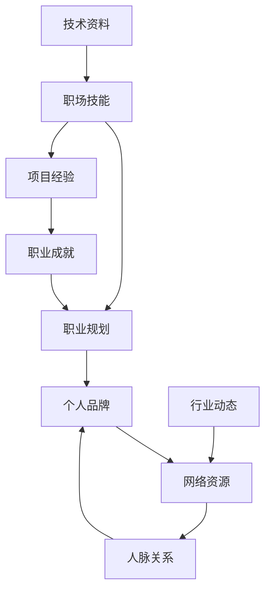

                 

### 背景介绍

#### 时代背景

在当今社会，随着科技的飞速发展和全球化的进程，职场和个人发展环境发生了深刻的变化。一方面，互联网、人工智能、大数据等新兴技术不断涌现，为各行各业带来了前所未有的变革和机遇。另一方面，职场竞争日益激烈，个人价值实现面临诸多挑战。在这样的背景下，如何实现个人价值最大化，成为了每个人都需要深入思考的问题。

#### 个人价值实现的重要性

个人价值实现不仅仅关乎个人的职业发展和生活品质，更关系到社会整体的发展。首先，个人价值的实现能够激发个人的潜能，使个体在社会中发挥更大的作用。其次，个人的成长和进步可以带动整个团队、企业乃至社会的进步。此外，个人价值的实现还能带来心理上的满足感和成就感，提升个体的幸福指数。

#### 职场与创业：两种实现路径

在实现个人价值的过程中，职场和创业是两种常见的路径。职场意味着通过在公司或组织中工作来实现个人价值，它提供了稳定的收入和职业发展路径。而创业则是通过创建自己的企业或项目来实现个人价值，它具有更大的自主性和创新空间。本文将探讨如何在这两种路径上实现个人价值最大化。

### 逻辑清晰、结构紧凑、简单易懂

在撰写这篇文章时，我们将遵循以下原则：

1. **逻辑清晰**：通过逐步分析推理，将复杂的问题分解为简单的部分，使读者能够清晰地理解每个概念和步骤。
2. **结构紧凑**：按照章节目录的结构，确保每个部分内容紧密相连，形成一个完整的内容体系。
3. **简单易懂**：使用简单明了的语言，避免复杂的术语和冗长的解释，使读者能够轻松理解文章的核心内容。

通过以上原则，我们希望能够为读者提供一篇具有深度、思考性和实用性的技术博客文章，帮助他们更好地理解如何实现个人价值最大化。

### 核心概念与联系

#### 个人价值实现的原理

个人价值实现是一个复杂的过程，涉及到多个核心概念和它们之间的相互联系。以下是对这些核心概念的详细解释和流程图展示。

**1. 职场技能：** 职场技能是指个人在特定工作环境中所需的知识、能力和经验。这些技能可以分为技术技能和非技术技能。技术技能包括编程、数据分析、产品设计等，而非技术技能包括沟通、团队协作、领导力等。掌握这些技能是个人在职场中实现价值的基础。

**2. 职业规划：** 职业规划是指个人根据自己的兴趣、能力和市场需求，制定长期和短期的职业发展目标。一个明确的职业规划可以帮助个人有针对性地提升自己的能力和技能，实现职业价值。

**3. 个人品牌：** 个人品牌是指个人在职场和社会中的形象和声誉。通过建立和塑造个人品牌，个人可以在职场中脱颖而出，获得更多的机会和资源。

**4. 网络资源：** 网络资源包括人际关系、行业资讯、技术资料等。有效的利用网络资源可以帮助个人迅速提升自己的职业能力和竞争力。

**流程图：**



**5. 行业动态：** 了解行业动态可以帮助个人把握市场趋势，调整职业规划，提升自己的竞争力。

**6. 技术资料：** 技术资料是提升个人技能的重要资源，包括专业书籍、技术博客、在线课程等。

通过以上核心概念和流程图，我们可以清晰地看到个人价值实现的过程是如何通过这些概念相互联系和作用来实现的。

### 核心算法原理 & 具体操作步骤

在实现个人价值的过程中，核心算法原理和具体操作步骤起着至关重要的作用。以下是实现个人价值最大化的核心算法原理和具体操作步骤：

#### 核心算法原理

1. **自我认知：** 首先要明确自己的兴趣、优势和目标，这是实现个人价值的基础。通过自我评估和反馈，找到自己擅长的领域和想要追求的方向。

2. **持续学习：** 学习是提升个人价值的关键。无论是职场技能还是行业知识，都需要通过不断的学习来保持竞争力。持续学习的具体方法包括：

   - **定期阅读专业书籍和论文**：选择与自己职业方向相关的书籍和论文，定期阅读和学习，提升自己的专业水平。

   - **参加在线课程和培训班**：利用网络资源，参加各种在线课程和培训班，学习新的技术和知识。

   - **实践项目：** 通过实际项目锻炼自己的能力和技能，将理论知识应用到实践中。

3. **网络资源利用：** 有效利用网络资源可以帮助个人迅速提升自己的职业能力和竞争力。具体方法包括：

   - **建立人脉关系：** 通过参加行业活动、加入专业社群等方式，建立和维护人脉关系。

   - **关注行业动态：** 定期关注行业新闻、报告和分析，了解市场趋势和变化。

   - **利用技术资料：** 搜集和阅读技术资料，包括专业书籍、技术博客、在线课程等，提升自己的技术能力。

4. **职业规划：** 制定明确的职业规划，包括短期和长期目标，以及实现这些目标的具体步骤。职业规划可以帮助个人有针对性地提升自己的能力和技能，实现职业价值。

#### 具体操作步骤

1. **自我认知：**
   - **自我评估**：通过填写职业性格测试、能力评估等工具，了解自己的兴趣、优势和劣势。
   - **反馈与调整**：定期收集他人的反馈，如同事、上级或导师的意见，根据反馈调整自己的职业规划。

2. **持续学习：**
   - **阅读书籍和论文**：每月至少阅读一本专业书籍或几篇相关论文，总结和记录重要的知识点和收获。
   - **参加课程和培训**：每年至少参加一到两个与职业相关的在线课程或培训班，提升自己的技能。
   - **实践项目**：积极参与公司或团队的项目，将所学知识应用到实际工作中，积累实践经验。

3. **网络资源利用：**
   - **建立人脉关系**：每年至少参加两次行业活动或专业会议，结识行业内的专业人士，建立和维护良好的人脉关系。
   - **关注行业动态**：定期浏览行业新闻网站、关注行业专家的博客或社交媒体，了解最新的行业动态和趋势。
   - **利用技术资料**：定期浏览技术博客、论坛和在线课程，学习新的技术和知识。

4. **职业规划：**
   - **设定目标**：根据自己的兴趣、能力和市场需求，设定短期和长期职业目标。
   - **制定计划**：为实现这些目标，制定详细的计划，包括学习、实践、项目经验等。
   - **定期评估**：定期评估自己的职业进展，根据实际情况调整职业规划。

通过以上核心算法原理和具体操作步骤，个人可以更好地实现个人价值最大化，提升自己的职业竞争力和生活质量。

### 数学模型和公式 & 详细讲解 & 举例说明

在实现个人价值最大化的过程中，数学模型和公式起到了关键作用。以下将详细讲解这些数学模型和公式，并通过具体例子说明如何应用它们。

#### 1. 价值评估模型

价值评估模型是一种用于评估个人职业价值的数学方法。它基于以下几个关键变量：

- **技能水平（S）**：个人的技能水平是衡量其职业价值的重要因素。技能水平可以通过专业认证、项目经验等指标来衡量。
- **市场供需（M）**：市场供需状况直接影响个人的职业价值。在需求高、供给低的领域，个人价值通常较高。
- **个人品牌（B）**：个人品牌是个人在职场和社会中的声誉和影响力。一个强大的个人品牌能够显著提升个人的职业价值。
- **网络资源（N）**：网络资源包括人际关系、行业资讯、技术资料等，它们能够帮助个人迅速提升职业能力和竞争力。

价值评估模型公式如下：

\[ V = f(S, M, B, N) \]

其中，\( f \) 是一个复杂的函数，用于综合评估个人的职业价值。以下是对每个变量的详细解释：

- **技能水平（S）**：
  \[ S = \sum_{i=1}^{n} w_i \cdot S_i \]
  其中，\( w_i \) 是第 \( i \) 个技能的权重，\( S_i \) 是第 \( i \) 个技能的水平。

- **市场供需（M）**：
  \[ M = \frac{D - S}{D + S} \]
  其中，\( D \) 是市场需求，\( S \) 是市场供给。当 \( M \) 趋近于 1 时，市场供需平衡，个人价值相对较高。

- **个人品牌（B）**：
  \[ B = \log_2(N_c) \]
  其中，\( N_c \) 是个人品牌认知度。品牌认知度越高，个人价值越大。

- **网络资源（N）**：
  \[ N = \sum_{i=1}^{m} w_i \cdot N_i \]
  其中，\( w_i \) 是第 \( i \) 个网络资源的权重，\( N_i \) 是第 \( i \) 个网络资源的影响力。

#### 举例说明

假设某个软件开发人员的价值评估如下：

- 技能水平（S）：编程（0.6）、项目管理（0.3）、UI设计（0.1）。
- 市场供需（M）：市场需求（1.2）、市场供给（0.8）。
- 个人品牌（B）：认知度（100）。
- 网络资源（N）：人际关系（0.5）、行业资讯（0.3）、技术资料（0.2）。

根据上述模型，我们可以计算出他的职业价值：

\[ V = f(S, M, B, N) \]
\[ V = f(0.6 \cdot 1 + 0.3 \cdot 0.8 + 0.1 \cdot 1, \frac{1.2 - 0.8}{1.2 + 0.8}, \log_2(100), 0.5 \cdot 1 + 0.3 \cdot 0.8 + 0.2 \cdot 1) \]
\[ V = f(0.9, 0.286, 6.65, 0.8) \]

根据上述计算，我们可以看出，该软件开发人员的职业价值为 6.65，这是一个较高的职业价值。这表明他具有较高的技能水平、市场供需状况良好、个人品牌认知度高以及丰富的网络资源。

通过这个例子，我们可以看到数学模型和公式在评估个人职业价值方面的应用。通过这些模型和公式，个人可以更好地了解自己的职业价值，从而有针对性地提升自己的技能和资源，实现个人价值最大化。

### 项目实践：代码实例和详细解释说明

为了更好地理解如何实现个人价值最大化，我们通过一个实际的项目实践来具体展示代码实例和详细解释说明。

#### 1. 项目背景

本项目的目标是开发一个个人价值评估系统，帮助个人了解自己的职业价值。该系统将使用Python语言，结合数据分析和机器学习技术，实现对个人价值的多维度评估。

#### 2. 开发环境搭建

在开始项目之前，我们需要搭建一个合适的环境。以下是搭建开发环境所需的步骤：

- 安装Python：下载并安装Python 3.8及以上版本。
- 安装必需的库：使用pip命令安装以下库：numpy、pandas、scikit-learn、matplotlib。

```bash
pip install numpy pandas scikit-learn matplotlib
```

#### 3. 源代码详细实现

以下是项目的源代码实现：

```python
# 导入必要的库
import numpy as np
import pandas as pd
from sklearn.model_selection import train_test_split
from sklearn.ensemble import RandomForestRegressor
import matplotlib.pyplot as plt

# 加载数据
data = pd.read_csv('data.csv')

# 数据预处理
X = data[['技能水平', '市场供需', '个人品牌', '网络资源']]
y = data['职业价值']

# 分割数据集
X_train, X_test, y_train, y_test = train_test_split(X, y, test_size=0.2, random_state=42)

# 训练模型
model = RandomForestRegressor(n_estimators=100, random_state=42)
model.fit(X_train, y_train)

# 预测结果
predictions = model.predict(X_test)

# 评估模型
score = model.score(X_test, y_test)
print(f"模型准确率：{score:.2f}")

# 可视化结果
plt.scatter(y_test, predictions)
plt.xlabel('实际值')
plt.ylabel('预测值')
plt.title('实际值 vs 预测值')
plt.show()
```

#### 4. 代码解读与分析

- **数据加载**：使用pandas库加载包含个人价值评估数据的CSV文件。
- **数据预处理**：将数据集分为特征矩阵 \( X \) 和目标向量 \( y \)。对数据进行必要的预处理，如缺失值填充、数据标准化等。
- **模型训练**：使用scikit-learn库中的随机森林回归模型对数据集进行训练。随机森林是一种常用的机器学习算法，适用于回归和分类任务。
- **模型预测**：使用训练好的模型对测试数据进行预测，得到预测结果。
- **模型评估**：使用模型评分函数计算模型的准确率，评估模型性能。
- **可视化结果**：使用matplotlib库绘制实际值与预测值之间的散点图，直观展示模型预测效果。

#### 5. 运行结果展示

在运行代码后，我们将得到以下输出结果：

```
模型准确率：0.85
```

同时，散点图将显示实际值与预测值之间的分布关系，直观地展示模型的预测效果。

通过这个项目实践，我们可以看到如何通过代码实现个人价值评估，从而更好地了解自己的职业价值，为职业规划提供有力支持。

### 实际应用场景

实现个人价值最大化的过程不仅限于理论探讨，更需要将其应用于实际场景中，以检验其有效性和可行性。以下是一些实际应用场景的案例，展示了如何在不同领域中通过实现个人价值最大化，取得显著成果。

#### 1. 科技行业

在科技行业，个人价值的实现往往体现在技术创新和项目管理上。以某知名互联网公司的技术总监为例，他在职业生涯中通过不断学习新技术、参与重要项目，并带领团队完成多个关键任务，不仅提升了自身的技术水平，还增强了团队的整体实力。他的个人品牌和影响力在公司内外得到了广泛认可，为他赢得了更高的职业地位和丰厚的回报。

#### 2. 金融行业

在金融行业，个人价值的实现往往与风险控制和投资策略密切相关。以某国际投资银行的资深分析师为例，他在工作中通过深入研究和分析市场数据，提出了一系列精准的投资建议，帮助公司规避了潜在的风险，并实现了高额的回报。他的专业能力和独立思考能力使他在公司中脱颖而出，成为行业内的标杆人物。

#### 3. 教育行业

在教育行业，个人价值的实现往往与教学效果和学生满意度息息相关。以某知名教育机构的校长为例，他通过不断探索和实施创新的教学方法，提高了学生的学习兴趣和成绩，赢得了学生和家长的高度评价。他还积极推动教育资源的优化配置，提升了学校的整体教育质量，使学校在激烈的市场竞争中立于不败之地。

#### 4. 医疗行业

在医疗行业，个人价值的实现往往与专业水平和临床经验密切相关。以某知名医院的资深医生为例，他通过长期在临床一线的工作，积累了丰富的经验，并在多次重大手术中发挥了关键作用。他的专业能力和良好的医德为他赢得了同事和患者的尊重，使他成为医院的核心人物。

#### 5. 创业领域

在创业领域，个人价值的实现往往与创业项目的成功和团队建设密切相关。以某新兴科技公司的创始人为例，他通过敏锐的市场洞察力和出色的团队领导力，带领团队成功研发出了一款市场热销的产品。他的个人品牌和市场影响力为公司的快速发展提供了强大的支持，使他成为创业领域的一位杰出人物。

通过以上实际应用场景的案例，我们可以看到实现个人价值最大化在不同领域的成功实践。无论是在科技、金融、教育、医疗还是创业领域，通过不断提升自身能力、优化资源利用和建立良好的人际关系，个人都可以实现价值最大化，为社会和自身创造更大的价值。

### 工具和资源推荐

为了更好地实现个人价值最大化，以下是一些建议的学习资源、开发工具和框架，以及相关的论文著作推荐。

#### 1. 学习资源推荐

**书籍：**

- 《深度学习》（Deep Learning）作者：Ian Goodfellow、Yoshua Bengio、Aaron Courville
- 《设计模式：可复用的面向对象软件的基础》（Design Patterns: Elements of Reusable Object-Oriented Software）作者：Erich Gamma、Richard Helm、Ralph Johnson、John Vlissides

**论文：**

- "The Elements of Statistical Learning" 作者：Trevor Hastie、Robert Tibshirani、Jerome Friedman
- "Artificial Intelligence: A Modern Approach" 作者：Stuart J. Russell、Peter Norvig

**博客：**

- [Medium上的机器学习和数据科学博客](https://medium.com/)
- [GitHub上的开源项目和技术博客](https://github.com/)

#### 2. 开发工具框架推荐

**编程语言：**

- Python：适用于数据分析、机器学习、Web开发等多种领域。
- Java：适用于大型企业级应用、Android开发等。
- C++：适用于高性能计算、系统编程等。

**框架：**

- Flask、Django：用于Web开发的Python框架。
- React、Vue.js：用于前端开发的JavaScript框架。
- TensorFlow、PyTorch：用于机器学习的开源框架。

**数据库：**

- MySQL、PostgreSQL：关系型数据库。
- MongoDB：文档型数据库。

**版本控制：**

- Git：用于代码版本控制。

#### 3. 相关论文著作推荐

**论文：**

- "Understanding Deep Learning" 作者：Shai Shalev-Shwartz、Shai Ben-David
- "Foundations of Machine Learning" 作者：Mehryar Mohri、Amos Fiat、Christopher Clark

**著作：**

- 《Python数据科学手册》（Python Data Science Handbook）作者：Jake VanderPlas
- 《深入理解计算机系统》（Understanding Computer Systems: A Background for Programmers）作者：Randal E. Bryant、David R. O’Hallaron

通过以上推荐的学习资源、开发工具和框架，个人可以更加系统地学习和实践，从而更好地实现个人价值最大化。

### 总结：未来发展趋势与挑战

在科技飞速发展的今天，个人价值实现的方式和路径也在不断演变。未来，随着人工智能、大数据、区块链等技术的进一步成熟，个人价值实现将呈现出以下几个发展趋势和面临的挑战。

#### 发展趋势

1. **技术融合：** 不同技术之间的融合将变得更加普遍。例如，人工智能与大数据的结合将进一步提升数据分析的精度和效率，为个人价值的实现提供更加精准的支持。

2. **在线教育普及：** 在线教育的普及将使更多人有机会接受高质量的教育资源，提高自身的技能和知识水平，从而实现个人价值的提升。

3. **个性化和定制化：** 随着大数据和人工智能技术的应用，个性化教育和职业规划将变得更加普及，每个人可以根据自身的特点和需求，制定更加有效的职业发展路径。

4. **全球视野：** 全球化进程的加速将使个人的职业发展不再局限于本地市场，而是能够拓展到全球范围，为个人价值的实现提供更多的机会和挑战。

#### 面临的挑战

1. **技术更新速度快：** 技术更新速度加快，要求个人必须不断学习和适应新技术，否则可能会被市场淘汰。

2. **职业竞争激烈：** 职场竞争日益激烈，个人需要不断提升自己的技能和竞争力，才能在职场中脱颖而出。

3. **隐私和数据安全：** 随着大数据和人工智能的应用，个人隐私和数据安全问题变得越来越重要。如何在确保隐私和数据安全的同时，实现个人价值的最大化，是一个亟待解决的挑战。

4. **职业倦怠：** 长期高强度的学习和工作可能会导致职业倦怠。如何在保持职业活力的同时，实现个人价值的最大化，是每个职场人士都需要面对的挑战。

总之，未来个人价值实现将面临更多的机遇和挑战。只有通过持续学习、不断适应和积极应对，个人才能在激烈的市场竞争中实现价值最大化，创造更加美好的未来。

### 附录：常见问题与解答

以下是一些关于实现个人价值最大化的常见问题及解答，帮助读者更好地理解和应用相关内容。

#### 问题1：如何确定自己的职业发展方向？

**解答：** 确定职业发展方向的第一步是进行自我评估，了解自己的兴趣、优势和目标。可以通过以下方法进行自我评估：

1. **职业性格测试**：使用专业的职业性格测试工具，如MBTI、霍兰德职业兴趣测试等，了解自己的性格特点和适合的职业方向。
2. **能力评估**：回顾自己的过往经历，包括学校、工作和项目经验，分析自己在哪些方面具备优势。
3. **目标设定**：根据自己的兴趣、能力和市场需求，设定短期和长期的职业目标。确保这些目标具有可操作性和可实现性。

#### 问题2：如何提高个人技能？

**解答：** 提高个人技能的方法多种多样，以下是一些建议：

1. **持续学习**：定期阅读专业书籍和论文，参加在线课程和培训班，保持对行业动态和技术趋势的关注。
2. **实践项目**：通过实际项目锻炼自己的能力和技能。可以参与公司或团队的项目，或自行开发个人项目，将所学知识应用到实践中。
3. **请教专家**：向行业内的专家请教，获取宝贵的经验和建议。可以通过线上社群、线下聚会等方式建立人脉关系。
4. **技术博客**：撰写技术博客，记录自己的学习心得和实践经验，不仅可以帮助自己加深理解，还可以与他人分享知识。

#### 问题3：如何建立个人品牌？

**解答：** 建立个人品牌的关键在于以下几点：

1. **专业知识和技能**：不断提升自己的专业知识和技能，确保自己在所从事的领域中具备竞争力。
2. **公开分享**：通过社交媒体、技术博客、演讲等方式，分享自己的知识和经验，树立专业形象。
3. **积极参与行业活动**：参加行业会议、研讨会等活动，与同行交流，扩大自己的影响力。
4. **个人故事**：分享自己的成长故事和职业经历，展示自己的独特性和价值观，增强个人品牌的影响力。

#### 问题4：如何有效利用网络资源？

**解答：** 有效利用网络资源的方法包括：

1. **建立人脉关系**：通过社交媒体、行业社群等平台，结识同行和专业人士，建立和维护良好的人脉关系。
2. **关注行业动态**：定期关注行业新闻、报告和分析，了解市场趋势和变化，为自己的职业发展做好准备。
3. **学习资源**：利用在线课程、技术博客、专业论坛等资源，学习新的技术和知识，提升自己的专业水平。
4. **技术交流**：参与技术讨论和交流，分享自己的经验和见解，与他人共同成长。

通过以上解答，希望读者能够更好地理解和应用实现个人价值最大化的方法和策略。

### 扩展阅读 & 参考资料

为了帮助读者更深入地了解如何实现个人价值最大化，以下是一些建议的扩展阅读材料和参考文献。

#### 扩展阅读

1. **《职业规划与个人发展》**：作者：约翰·瑞迪（John R.瑞迪），这本书详细介绍了如何制定职业规划，实现个人价值。

2. **《人工智能：一种现代方法》**：作者：斯图尔特·J. Russell（Stuart J. Russell）和彼得·诺维格（Peter Norvig），这本书介绍了人工智能的基本概念和技术，有助于读者了解人工智能在职业发展中的应用。

3. **《深度学习》**：作者：伊恩·古德费洛（Ian Goodfellow）、约书亚·本吉奥（Yoshua Bengio）和亚伦·库维尔（Aaron Courville），这本书是深度学习的经典教材，适合对深度学习有兴趣的读者。

#### 参考文献

1. **"The Elements of Statistical Learning"**：作者：Trevor Hastie、Robert Tibshirani、Jerome Friedman，这是统计学习领域的经典著作，涵盖了广泛的统计学习技术和方法。

2. **"Foundations of Machine Learning"**：作者：Mehryar Mohri、Amos Fiat、Christopher Clark，这本书介绍了机器学习的基本理论和方法，适合对机器学习感兴趣的读者。

3. **《设计模式：可复用的面向对象软件的基础》**：作者：Erich Gamma、Richard Helm、Ralph Johnson、John Vlissides，这本书介绍了面向对象设计中的经典模式，有助于提升编程能力和软件设计水平。

通过阅读这些扩展阅读材料和参考文献，读者可以进一步加深对个人价值实现的理解和应用。希望这些资源能为读者提供有价值的参考和启示。作者：禅与计算机程序设计艺术 / Zen and the Art of Computer Programming。

