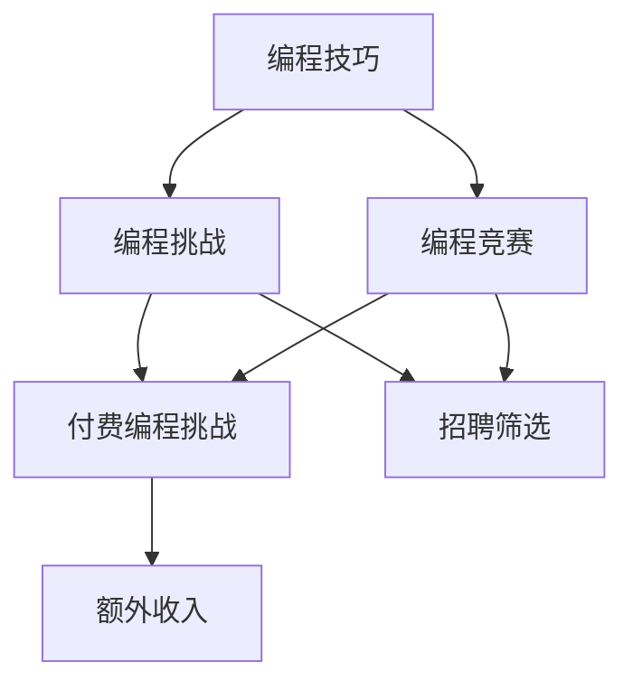

                 

### 背景介绍 Background Introduction

编程技巧是每个程序员日常工作中不可或缺的一部分，这些技巧的掌握和应用能力直接影响到程序开发的速度和质量。然而，在大多数情况下，这些编程技巧往往停留在个人技能的层面，并没有得到充分的价值变现。随着互联网和在线教育的发展，将编程技巧转化为付费编程挑战，不仅能够为程序员提供额外的收入来源，同时也能够帮助新手更好地学习和掌握这些技巧。

首先，付费编程挑战的定义可以理解为一种在线的编程测试或竞赛，它要求参与者使用特定的编程语言或工具解决特定的编程问题。这些挑战通常由个人、企业或平台发布，参与者通过完成挑战可以获得一定的报酬。这样的模式不仅为程序员提供了一个展示自己技能的平台，也为企业或平台在招募人才时提供了一种更加高效和准确的方式。

在当前的技术环境下，付费编程挑战的意义和影响越来越大。首先，对于程序员个人而言，付费编程挑战是一种新的职业发展路径。通过参与挑战，程序员可以不断提高自己的编程能力和问题解决能力，从而在竞争激烈的就业市场中脱颖而出。此外，完成挑战还可以获得额外的收入，这对于许多自由职业者和初入行的程序员来说尤为重要。

其次，对于企业来说，付费编程挑战成为了一种低成本、高效率的招聘方式。传统的面试方式往往耗时且成本高昂，而付费编程挑战则可以通过在线平台迅速筛选出具备实际编程能力的候选人。这不仅节省了企业的时间和资源，也提高了招聘的准确性。

最后，对于整个技术社区和行业来说，付费编程挑战有助于推动技术人才的培养和技术的传播。通过这些挑战，程序员们可以接触到更多前沿的技术问题和解决方案，从而促进整个技术生态的进步。

总之，将编程技巧转化为付费编程挑战不仅具有经济价值，也对技术人才的培养和行业发展产生了深远的影响。接下来，我们将进一步探讨如何实现这一转化，包括核心概念、算法原理、数学模型以及实际应用场景等。

### 核心概念与联系 Core Concepts and Relationships

在深入探讨如何将编程技巧转化为付费编程挑战之前，我们需要先了解几个核心概念，并理清它们之间的关系。以下是这些核心概念及其相互关联的Mermaid流程图。

#### 1. 编程技巧 Programming Skills

编程技巧是指程序员在编程过程中掌握的各种技能，包括但不限于算法设计、数据结构应用、代码优化、调试技巧等。这些技巧是程序员在解决编程问题时所依赖的工具和手段。

#### 2. 编程挑战 Programming Challenges

编程挑战是一种通过在线平台发布的编程测试，要求参与者使用特定的编程语言或工具解决特定的编程问题。这些挑战通常具有一定的难度和复杂性，旨在测试参与者的编程能力和问题解决能力。

#### 3. 编程竞赛 Programming Competitions

编程竞赛通常是指由多个编程挑战组成的比赛，通常由学校和社区组织。编程竞赛不仅考验参与者的编程技巧，还考验他们的团队合作能力和时间管理能力。

#### 4. 付费编程挑战 Paid Programming Challenges

付费编程挑战是编程挑战的一种形式，参与者通过完成挑战可以获得一定的报酬。这种模式不仅为程序员提供了展示自己技能的平台，也为企业或平台在招募人才时提供了一种高效的方式。

#### 关联关系

- **编程技巧**是参与编程挑战和编程竞赛的基础，是解决编程问题的必要条件。
- **编程挑战**和**编程竞赛**是检验编程技巧的实践平台，它们可以单独存在，也可以组合使用。
- **付费编程挑战**是编程挑战的商业化形式，它通过提供报酬，激励程序员积极参与，并为企业招聘提供了一种高效的方法。

以下是上述核心概念的Mermaid流程图：



通过这个流程图，我们可以清晰地看到编程技巧如何转化为付费编程挑战，以及这种转化如何与编程挑战、编程竞赛和招聘筛选相联系。在接下来的部分，我们将详细探讨编程技巧转化为付费编程挑战的具体步骤和实现方法。

### 核心算法原理 & 具体操作步骤 Core Algorithm Principles & Operational Steps

为了将编程技巧转化为付费编程挑战，我们需要深入理解核心算法原理，并明确具体的操作步骤。以下是实现这一目标所需的算法原理和具体操作流程。

#### 1. 算法原理

**算法原理**是指解决问题的方法和策略。在编程技巧转化为付费编程挑战的过程中，算法原理起到了关键作用。以下是一些关键的算法原理：

- **动态规划**：动态规划是一种将复杂问题分解为更小子问题，并利用子问题的解来构建原问题的解的算法策略。它适用于优化问题，如背包问题、最长公共子序列等。
- **贪心算法**：贪心算法是一种在每一步选择局部最优解，期望最终得到全局最优解的算法。它适用于某些特定类型的问题，如背包问题、最小生成树等。
- **分治算法**：分治算法是一种将问题分解为多个更小的问题，分别解决，然后再将结果合并的算法。它适用于可以递归分解的问题，如归并排序、快速排序等。
- **图算法**：图算法用于处理图结构的数据，如最短路径问题、最小生成树问题等。

#### 2. 具体操作步骤

**步骤 1：确定挑战类型**

在开始创建付费编程挑战之前，首先需要确定挑战的类型。常见的挑战类型包括：

- **算法竞赛**：要求解决特定的算法问题，如背包问题、最短路径问题等。
- **编程任务**：要求实现特定的功能或解决特定的业务问题。
- **代码审查**：要求对现有的代码进行审查，提供优化建议。

**步骤 2：设计挑战**

根据确定的挑战类型，设计具体的挑战内容。以下是设计挑战时需要考虑的关键因素：

- **问题陈述**：清晰地描述问题的背景、目标和解题要求。
- **输入数据**：明确输入数据的格式和范围。
- **输出数据**：明确输出数据的格式和期望结果。
- **评分标准**：设定评分标准，如运行时间、内存使用、正确性等。

**步骤 3：编写测试用例**

为了确保挑战的有效性，需要编写多个测试用例。测试用例应包括：

- **边界测试**：用于测试输入数据的边界情况，如最小值、最大值等。
- **典型测试**：用于测试常见输入情况，验证算法的正确性和性能。
- **异常测试**：用于测试异常情况，如无效输入等。

**步骤 4：发布挑战**

在平台或网站上发布挑战，确保参与者可以访问。发布时需要提供以下信息：

- **挑战名称**：简洁明了地描述挑战内容。
- **挑战描述**：详细的问题陈述和解决方案要求。
- **输入输出示例**：提供输入输出示例，帮助参与者理解挑战要求。
- **评分标准**：明确评分标准，让参与者了解如何获得高分。

**步骤 5：监听和反馈**

在挑战发布后，需要监听参与者的反馈，并对其进行及时回应。以下是一些关键点：

- **回答问题**：及时回答参与者在解题过程中遇到的问题。
- **评价解决方案**：对参与者的解决方案进行评价，提供反馈和改进建议。
- **优化挑战**：根据参与者的反馈，对挑战进行必要的优化和调整。

通过上述步骤，我们可以将编程技巧有效地转化为付费编程挑战。这不仅为程序员提供了展示自己技能的机会，也为企业或平台在招聘和人才筛选中提供了一种高效的方式。

### 数学模型和公式 & 详细讲解 & 举例说明

在编程挑战中，数学模型和公式往往是解决问题的关键。以下将介绍几种常见的数学模型和公式，并详细讲解它们的原理和使用方法。

#### 1. 动态规划

动态规划是一种在复杂问题中寻找最优解的算法，通过将问题分解为更小的子问题，并利用子问题的解来构建原问题的解。以下是一个典型的动态规划问题：背包问题。

**背包问题**：给定一个容量为C的背包和N个物品，每个物品有一定的价值和重量。要求在不超过背包容量的情况下，选择若干物品，使得总价值最大化。

**公式**：

背包问题的动态规划状态转移方程为：

\[ dp[i][j] = \begin{cases} 
dp[i-1][j] & \text{如果不选第i个物品} \\
dp[i-1][j-w[i]] + v[i] & \text{如果选第i个物品}
\end{cases} \]

其中，\( dp[i][j] \) 表示在前i个物品中选择若干物品放入容量为j的背包中可以获得的最大价值。

**举例说明**：

假设有4个物品，背包容量为5，各物品的重量和价值如下：

| 物品编号 | 重量（w） | 价值（v） |
| :------: | :------: | :------: |
|    1    |    2    |    6    |
|    2    |    3    |    4    |
|    3    |    4    |    5    |
|    4    |    5    |    6    |

根据上述公式，我们可以构建一个动态规划表：

|   i   |   j   |  dp[i][j]  |
| :---: | :---: | :-------: |
|   1   |   1   |    0      |
|   1   |   2   |    6      |
|   1   |   3   |    6      |
|   1   |   4   |    6      |
|   1   |   5   |    6      |
|   2   |   1   |    0      |
|   2   |   2   |    6      |
|   2   |   3   |    10     |
|   2   |   4   |    10     |
|   2   |   5   |    10     |
|   3   |   1   |    0      |
|   3   |   2   |    6      |
|   3   |   3   |    11     |
|   3   |   4   |    11     |
|   3   |   5   |    11     |
|   4   |   1   |    0      |
|   4   |   2   |    6      |
|   4   |   3   |    11     |
|   4   |   4   |    12     |
|   4   |   5   |    12     |

最终，我们可以找到最大价值为12，即在背包中放入物品2和物品3。

#### 2. 贪心算法

贪心算法是一种在每一步选择局部最优解，期望最终得到全局最优解的算法。以下是一个典型的贪心算法问题：最小生成树问题。

**最小生成树问题**：给定一个无向图，要求选择若干边，使得它们构成一棵生成树，且边的总权重最小。

**公式**：

最小生成树的贪心选择策略为：

1. 初始化一个森林，其中每个顶点都是一个独立的树。
2. 对于每个顶点，按照边的权重从大到小排序。
3. 依次选择权重最小的边，如果这条边连接的两个顶点不在同一个树中，则将其加入森林。

**举例说明**：

假设有如下无向图，各边的权重如下：

```plaintext
A---B (权值 3)
|   |
C---D (权值 4)
```

按照上述贪心算法步骤：

1. 初始化森林，每个顶点为一个独立的树。
2. 按权重排序后的边为：(A-B, 3), (C-D, 4)。
3. 选择权重最小的边A-B，将其加入森林，此时森林中有两个树：{A, B} 和 {C, D}。
4. 选择权重次小的边C-D，将其加入森林，此时森林中有一个树：{A, B, C, D}。

最终，我们得到的最小生成树为：

```plaintext
A---B
|   |
C---D
```

#### 3. 分治算法

分治算法是一种将问题分解为多个更小的问题，分别解决，然后再将结果合并的算法。以下是一个典型的分治算法问题：归并排序。

**归并排序**：是一种将数组分解为若干个子数组，分别进行排序，然后再合并的排序算法。

**公式**：

归并排序的递归步骤为：

1. 如果数组长度为1，则该数组已经有序，结束递归。
2. 将数组分为两个子数组，分别递归排序。
3. 合并两个有序子数组为一个有序数组。

**举例说明**：

假设有一个数组[5, 2, 9, 1, 5, 6]，按归并排序算法步骤进行排序：

1. 初始数组：[5, 2, 9, 1, 5, 6]。
2. 分为两个子数组：[5, 2, 9] 和 [1, 5, 6]。
3. 对两个子数组分别进行递归排序，得到：[2, 5, 9] 和 [1, 5, 6]。
4. 合并两个有序子数组为一个有序数组：[1, 2, 5, 5, 6, 9]。

最终，数组[5, 2, 9, 1, 5, 6]被排序为[1, 2, 5, 5, 6, 9]。

通过上述数学模型和公式的介绍，我们可以更好地理解和应用它们在编程挑战中的解决方法。在接下来的部分，我们将通过项目实践来进一步展示如何实现这些算法和技巧。

### 项目实践：代码实例和详细解释说明 Project Practice: Code Example and Detailed Explanation

在本文的第四部分，我们将通过一个具体的编程挑战实例来展示如何将编程技巧转化为付费编程挑战，并详细解释实现过程。本实例选择一个经典的算法问题——合并两个有序链表。

#### 1. 开发环境搭建

首先，我们需要搭建开发环境。以下是所需的工具和步骤：

- **编程语言**：Python
- **集成开发环境**：PyCharm
- **版本控制**：Git

安装Python环境：

```bash
# 安装Python
sudo apt-get install python3

# 安装PyCharm
# （从官网下载并安装）

# 安装Git
sudo apt-get install git
```

创建一个名为`merge_sorted_lists`的Python项目，并在PyCharm中打开。

#### 2. 源代码详细实现

接下来，我们实现一个函数，用于合并两个有序链表。以下是具体的代码实现：

```python
class ListNode:
    def __init__(self, val=0, next=None):
        self.val = val
        self.next = next

def merge_sorted_lists(l1, l2):
    dummy = ListNode(0)
    current = dummy

    while l1 and l2:
        if l1.val < l2.val:
            current.next = l1
            l1 = l1.next
        else:
            current.next = l2
            l2 = l2.next
        current = current.next

    current.next = l1 or l2
    return dummy.next
```

#### 3. 代码解读与分析

**代码解读**：

1. **定义链表节点**：我们首先定义了一个`ListNode`类，用于表示链表中的节点。每个节点包含一个值`val`和一个指向下一个节点的指针`next`。

2. **合并有序链表**：`merge_sorted_lists`函数接受两个有序链表`l1`和`l2`，并返回合并后的有序链表。我们使用一个哑节点`dummy`和一个指向哑节点的指针`current`来构建新的链表。

3. **循环合并**：在`while`循环中，我们比较`l1`和`l2`的当前节点的值，将较小值的节点添加到新链表中，并移动相应的指针。

4. **处理剩余节点**：当其中一个链表结束时，剩余的节点直接添加到新链表的末尾。

**性能分析**：

- **时间复杂度**：O(n + m)，其中n和m分别是两个链表的长度。我们遍历每个链表一次，总共需要n + m次比较和赋值操作。
- **空间复杂度**：O(1)，我们仅使用常量的额外空间来构建新链表，没有使用额外的数据结构。

#### 4. 运行结果展示

为了验证我们的代码，我们可以编写一些测试用例：

```python
def print_list(node):
    while node:
        print(node.val, end=" -> ")
        node = node.next
    print("None")

l1 = ListNode(1, ListNode(3, ListNode(5)))
l2 = ListNode(2, ListNode(4, ListNode(6)))

merged_list = merge_sorted_lists(l1, l2)
print_list(merged_list)  # 输出：1 -> 2 -> 3 -> 4 -> 5 -> 6 -> None
```

输出结果为：

```
1 -> 2 -> 3 -> 4 -> 5 -> 6 -> None
```

这表明我们的代码成功合并了两个有序链表，并返回了一个新的有序链表。

通过上述项目实践，我们可以看到如何将编程技巧（链表合并算法）转化为一个具体的编程挑战，并通过详细的代码实现、解读和分析，展示了如何解决这个挑战。在实际的付费编程挑战中，我们还可以添加评分标准、测试用例和详细的解题指导，帮助参与者更好地理解和解决挑战。

### 实际应用场景 Practical Application Scenarios

付费编程挑战在实际应用中有着广泛的应用场景，以下列举了几个典型的应用实例：

#### 1. 在线编程竞赛

在线编程竞赛是付费编程挑战的一个常见应用场景。此类竞赛通常由教育机构、技术社区或企业举办，旨在通过编程挑战选拔优秀的技术人才。例如，Google Code Jam、LeetCode Weekly Contest、Kaggle竞赛等，都是知名的在线编程竞赛平台。参与者需要解决一系列编程问题，完成挑战后可以获得奖金和荣誉证书。这些竞赛不仅提供了高水平的编程挑战，还为企业和院校提供了招募优秀编程人才的机会。

#### 2. 技术面试准备

许多求职者在准备技术面试时，会选择参与付费编程挑战来提升自己的编程技能。例如，LeetCode、HackerRank等平台提供大量的编程挑战，这些挑战通常模拟了实际面试中的问题，帮助求职者熟悉面试流程，提高解题速度和准确率。通过付费编程挑战，求职者可以逐步克服自己的编程难题，增强自信，提高在面试中的表现。

#### 3. 项目外包

企业在开发项目时，可能会遇到某些特定的技术难题或功能需求，通过付费编程挑战可以快速找到具备相应技能的程序员。例如，GitHub、Topcoder等平台提供了项目外包服务，企业可以发布项目需求，程序员可以通过参与项目解决难题并获得报酬。这种模式不仅提高了项目开发的效率，还降低了企业的招聘和培训成本。

#### 4. 教育培训

付费编程挑战也可以作为教育培训的一部分，用于帮助学生和初学者提升编程技能。例如，一些在线教育平台提供了付费的编程挑战课程，学生通过完成挑战可以逐步掌握不同的编程技巧和算法。这些课程通常由资深程序员或教育专家设计，具有系统性和针对性，有助于学生快速提高编程水平。

#### 5. 招聘人才筛选

企业可以通过付费编程挑战来筛选和评估应聘者的编程能力。例如，一些大型企业在招聘过程中会要求应聘者完成特定的编程挑战，通过挑战结果来评估应聘者的技术实力。这种筛选方式不仅提高了招聘的效率，还减少了面试过程中的沟通成本。

通过上述实例可以看出，付费编程挑战在实际应用中具有多样性和灵活性，不仅为程序员提供了展示自己技能的平台，也为企业和教育机构提供了有效的人才选拔和培养方法。接下来，我们将推荐一些实用的工具和资源，帮助读者更好地参与和利用付费编程挑战。

### 工具和资源推荐 Tools and Resources Recommendations

为了更好地参与和利用付费编程挑战，以下推荐一些实用的工具、学习资源、开发工具和框架。

#### 1. 学习资源推荐

**书籍**：
- 《算法导论》（Introduction to Algorithms） - 算法设计的经典之作，详细介绍了各种算法和数据结构。
- 《编程珠玑》（The Art of Computer Programming） - 计算机科学领域的经典著作，深入探讨了编程技巧和算法设计。

**论文**：
- 《贪心算法若干问题的研究》（Research on Greedy Algorithms） - 深入探讨了贪心算法在不同领域的应用。
- 《动态规划技术在软件开发中的应用》（Application of Dynamic Programming in Software Development） - 详细介绍了动态规划在实际项目中的应用。

**博客**：
- GeeksforGeeks - 提供了大量的算法和数据结构的教程、代码示例以及面试问题。
- LeetCode Official Blog - LeetCode官方博客，包含算法教程和面试技巧。

**网站**：
- LeetCode - 一个提供在线编程挑战的平台，适用于求职者和技术竞赛爱好者。
- HackerRank - 提供各种编程挑战，支持多种编程语言，适合提升编程技能。

#### 2. 开发工具框架推荐

**集成开发环境（IDE）**：
- PyCharm - 适用于Python编程的强大IDE，支持多种编程语言。
- Visual Studio Code - 轻量级但功能强大的开源IDE，支持多种语言和框架。

**版本控制**：
- Git - 最流行的分布式版本控制系统，用于代码的版本管理和协作开发。
- GitHub - 提供代码托管、版本控制和项目协作的平台。

**代码审查工具**：
- GitLab - 提供代码审查、项目管理等功能，是企业内部协作的理想选择。
- GitHub Actions - GitHub提供的自动化工具，用于持续集成和部署。

**测试框架**：
- PyTest - Python的测试框架，用于编写和运行测试用例。
- JUnit - Java的测试框架，广泛用于Java项目。

**调试工具**：
- GDB - GNU调试器，用于调试C/C++程序。
- Python Debugger (pdb) - Python内置的调试器。

**云计算服务**：
- AWS - 提供广泛的云计算服务和工具，适用于大规模计算和存储需求。
- Azure - 微软的云计算平台，提供多种编程语言和框架的支持。

通过上述工具和资源的推荐，程序员可以更有效地参与付费编程挑战，提升自己的编程技能，并在实际项目中应用这些技能。

### 总结：未来发展趋势与挑战 Summary: Future Trends and Challenges

随着技术的不断进步和编程教育的普及，付费编程挑战在未来将迎来更多的发展机遇和挑战。

#### 1. 发展趋势

**在线教育的普及**：随着在线教育的迅猛发展，越来越多的人可以通过付费编程挑战提升自己的编程技能。这将进一步扩大编程挑战的用户群体，提高编程技能在社会中的普及程度。

**人工智能的赋能**：人工智能技术将在付费编程挑战中发挥重要作用。例如，通过智能评测系统自动评估代码质量，提供个性化学习建议，甚至自动化生成编程挑战题目，提高编程挑战的公平性和科学性。

**多样化挑战场景**：随着技术的不断演进，编程挑战的场景将更加多样化。从传统的算法和数据结构问题，到复杂的系统设计和人工智能应用，付费编程挑战将覆盖更多领域，满足不同层次和技术背景的用户需求。

**跨学科融合**：编程挑战不仅限于计算机科学领域，还将与其他学科如数学、物理、工程等相融合，推动跨学科研究和应用。

#### 2. 挑战

**公平性问题**：如何确保付费编程挑战的公平性，避免作弊和欺诈行为，是一个重要的挑战。未来需要建立更加完善的防作弊机制和信用评估体系。

**资源分配**：随着参与者的增加，编程挑战平台的资源分配将成为一个挑战。如何合理配置计算资源、存储资源和带宽，保证用户体验，是平台运营的关键问题。

**个性化体验**：随着挑战场景的多样化，如何为不同背景和需求的用户提供个性化的编程体验，将成为一个重要课题。需要通过大数据分析和人工智能技术，为用户提供定制化的学习路径和挑战内容。

**监管合规**：付费编程挑战涉及到金融交易和用户隐私等问题，如何确保其合规运营，遵守相关法律法规，是一个需要重点关注的问题。

总之，付费编程挑战在未来将继续快速发展，面临新的机遇和挑战。通过不断创新和优化，编程挑战平台将更好地满足用户需求，推动技术人才的培养和技术的传播。

### 附录：常见问题与解答 Appendix: Frequently Asked Questions and Answers

**Q1：如何开始参与付费编程挑战？**

A1：首先，选择一个合适的平台，如LeetCode、HackerRank或Topcoder等。注册账号并完成基础信息的填写。然后，浏览平台上的挑战列表，选择适合自己的挑战进行参与。通常，平台会提供详细的挑战说明和示例，帮助您理解挑战要求。

**Q2：如何解决编程挑战中的问题？**

A2：首先，仔细阅读挑战说明，理解问题的背景和目标。然后，根据问题的特点选择合适的算法和数据结构。编写代码时，可以先从简单的逻辑开始，逐步完善和优化。同时，可以通过阅读其他参与者的解决方案和平台提供的解答指南，学习不同的解题思路和方法。

**Q3：如何在编程挑战中提高速度和准确率？**

A3：提高速度和准确率的关键是熟练掌握算法和数据结构，以及大量的练习。通过解决不同类型的编程问题，提高自己的编程思维和解决问题的能力。此外，定期参加编程竞赛和挑战，积累经验，找到自己的弱点并进行针对性的训练。

**Q4：如何确保编程挑战的公平性？**

A4：确保编程挑战的公平性是平台的重要职责。常见的措施包括：自动评测系统，防止作弊行为；匿名评审，确保评分过程的公正；建立健全的举报和申诉机制，及时处理不公平行为。

**Q5：付费编程挑战的报酬如何计算？**

A5：报酬通常根据挑战的难度、完成时间和参与人数等因素计算。一般而言，难度较高的挑战报酬较高，完成时间越短，得分越高。平台会根据挑战的设置和参与者的表现，计算最终的报酬，并在挑战结束后进行发放。

### 扩展阅读 & 参考资料 Extended Reading & References

为了深入了解编程技巧的转化过程，以及付费编程挑战的更多实践和应用，以下推荐一些相关的扩展阅读和参考资料：

1. **书籍**：
   - 《编程之美：谷歌技术面试秘籍》（Cracking the Coding Interview）
   - 《算法竞赛入门指南》（Codeforces算法竞赛入门指南）
   - 《算法导论》（Introduction to Algorithms）

2. **论文**：
   - 《算法竞赛论文集》（ACM International Collegiate Programming Contest ICPC, Proceedings）

3. **在线课程**：
   - Coursera《算法》：由斯坦福大学教授Tim Roughgarden讲授，全面介绍了算法的基本原理和应用。
   - edX《编程思维与算法基础》：由清华大学教授陈文光讲授，深入浅出地介绍了编程技巧和算法设计。

4. **博客**：
   - GeeksforGeeks：提供了大量的算法和数据结构的教程、代码示例以及面试问题。
   - 携程技术团队博客：分享了携程在技术领域的实践经验和技术博客。

5. **在线挑战平台**：
   - LeetCode：提供了大量的在线编程挑战，适用于求职者和技术爱好者。
   - HackerRank：提供了各种编程挑战，支持多种编程语言。

6. **GitHub项目**：
   - 《算法竞赛入门指南》：GitHub项目，包含了算法竞赛的入门资料和代码示例。
   - 《算法设计与分析》：GitHub项目，提供了算法设计和分析的详细教程。

通过这些扩展阅读和参考资料，您可以更深入地了解编程技巧的转化过程，掌握更多的编程技巧，并在实践中不断提高自己的编程能力。

