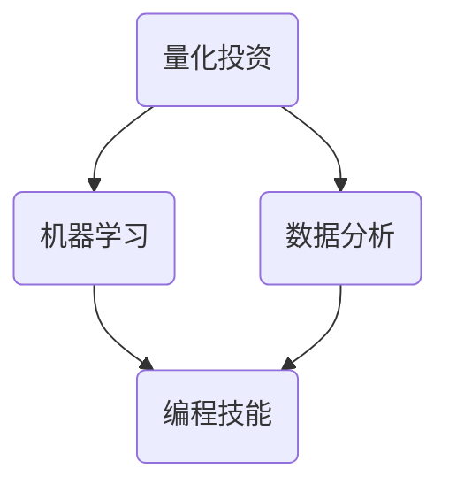

                 

### 文章标题：如何将编程技能应用于自动化交易

#### 关键词：
1. 编程技能
2. 自动化交易
3. 量化投资
4. 机器学习
5. 数据分析

#### 摘要：
本文旨在探讨如何将编程技能应用于自动化交易，从而实现量化投资。通过深入分析核心概念、算法原理、数学模型以及实际项目实践，我们将了解如何将编程与交易策略相结合，为读者提供一条迈向量化投资的成功之路。

---

#### 1. 背景介绍

自动化交易（Automated Trading），又称为算法交易（Algorithmic Trading），是指通过计算机程序或算法来执行交易决策的过程。这种交易方式广泛应用于金融市场中，以其高效、准确和自动化等特点，吸引了越来越多的投资者。

随着计算机技术的飞速发展，量化投资（Quantitative Investment）逐渐成为一种主流投资策略。量化投资通过构建数学模型和算法，分析市场数据，以实现投资决策的自动化和优化。编程技能在量化投资中发挥着至关重要的作用，因为它提供了实现复杂算法和策略的工具。

本文将详细介绍如何将编程技能应用于自动化交易，帮助读者了解量化投资的基本概念、算法原理和实际操作步骤。通过本文的学习，读者将能够掌握量化投资的核心技能，并在金融市场中取得成功。

#### 2. 核心概念与联系

在探讨如何将编程技能应用于自动化交易之前，我们首先需要了解一些核心概念和它们之间的联系。

##### 2.1. 量化投资

量化投资是一种通过构建数学模型和算法，对市场数据进行分析，以实现投资决策的投资策略。量化投资的核心是算法，它决定了投资的收益和风险。常见的量化投资策略包括：

1. **趋势跟踪**：通过识别价格趋势，进行买入或卖出的操作。
2. **套利**：通过利用不同市场之间的价格差异，进行套利交易。
3. **统计套利**：通过分析历史数据，寻找价格变化规律，进行交易。
4. **高频交易**：通过高速计算机和算法，在极短时间内完成大量交易。

##### 2.2. 机器学习

机器学习（Machine Learning）是一种人工智能（Artificial Intelligence）的分支，通过计算机程序，让计算机从数据中学习规律，并做出预测。机器学习在量化投资中有着广泛的应用，如：

1. **预测价格**：利用历史价格数据，预测未来的价格走势。
2. **风险管理**：通过分析市场数据，识别潜在的风险，并制定相应的风险管理策略。
3. **优化交易策略**：通过机器学习算法，优化交易策略，提高投资收益。

##### 2.3. 数据分析

数据分析（Data Analysis）是指通过对数据进行分析和挖掘，提取有价值信息的过程。在量化投资中，数据分析是不可或缺的环节，它包括：

1. **数据采集**：收集与投资相关的数据，如股票价格、交易量、财务指标等。
2. **数据预处理**：清洗数据，去除噪声，为后续分析做准备。
3. **数据挖掘**：通过统计学和机器学习算法，挖掘数据中的规律和趋势。
4. **结果分析**：对挖掘结果进行分析，为投资决策提供依据。

##### 2.4. 编程技能

编程技能是量化投资的核心，它提供了实现算法和策略的工具。常见的编程技能包括：

1. **数据结构**：了解数据结构，如数组、列表、树等，有助于高效处理数据。
2. **算法**：掌握基本的算法原理，如排序、搜索、动态规划等。
3. **机器学习库**：熟悉常用的机器学习库，如 scikit-learn、TensorFlow、PyTorch 等。
4. **数据分析库**：掌握常用的数据分析库，如 NumPy、Pandas、Matplotlib 等。

##### 2.5. Mermaid 流程图

为了更好地理解核心概念之间的联系，我们使用 Mermaid 流程图进行展示：



#### 3. 核心算法原理 & 具体操作步骤

在了解了核心概念之后，我们将探讨一些常见的量化投资算法，以及如何使用编程技能来实现这些算法。

##### 3.1. 趋势跟踪算法

趋势跟踪算法是一种基于价格趋势进行交易的策略。其基本原理是：当价格上升时买入，价格下降时卖出。以下是一个简单的趋势跟踪算法的实现步骤：

1. **数据采集**：收集历史价格数据，如股票的收盘价。
2. **数据处理**：对数据进行预处理，如去除异常值、填充缺失值等。
3. **趋势判断**：使用移动平均线（Moving Average）来判断价格趋势。
4. **交易决策**：根据价格趋势，进行买入或卖出的操作。

以下是使用 Python 实现趋势跟踪算法的代码示例：

```python
import pandas as pd

# 读取数据
data = pd.read_csv('stock_price.csv')

# 计算移动平均线
data['ma20'] = data['close'].rolling(window=20).mean()

# 判断趋势
data['trend'] = (data['close'] > data['ma20']).astype(int)

# 交易决策
data['signal'] = data['trend'].shift(1) * data['trend']

# 买入信号
data['buy'] = (data['signal'] == 1) & (data['trend'] == 1)

# 卖出信号
data['sell'] = (data['signal'] == -1) & (data['trend'] == -1)

# 输出结果
data[['buy', 'sell']].to_csv('trade_signal.csv')
```

##### 3.2. 套利算法

套利算法是一种利用市场之间的价格差异进行交易，从中获利的方法。其基本原理是：在一个市场中买入某种资产，同时在另一个市场中卖出相同或类似的资产，从而获得差价利润。以下是一个简单的套利算法的实现步骤：

1. **数据采集**：收集不同市场之间的价格数据。
2. **数据处理**：对数据进行预处理，如去除异常值、填充缺失值等。
3. **差异计算**：计算不同市场之间的价格差异。
4. **交易决策**：根据价格差异，进行买入或卖出的操作。

以下是使用 Python 实现套利算法的代码示例：

```python
import pandas as pd

# 读取数据
data1 = pd.read_csv('market1_price.csv')
data2 = pd.read_csv('market2_price.csv')

# 计算差异
data = data1['close'] - data2['close']

# 设置阈值
threshold = 0.01

# 交易决策
data['signal'] = (data > threshold).astype(int)

# 买入信号
data['buy'] = (data['signal'] == 1)

# 卖出信号
data['sell'] = (data['signal'] == -1)

# 输出结果
data[['buy', 'sell']].to_csv('trade_signal.csv')
```

##### 3.3. 统计套利算法

统计套利算法是一种通过分析历史数据，寻找价格变化规律，进行交易的方法。其基本原理是：根据历史数据，构建数学模型，预测未来的价格走势，并据此进行交易。以下是一个简单的统计套利算法的实现步骤：

1. **数据采集**：收集历史价格数据。
2. **数据处理**：对数据进行预处理，如去除异常值、填充缺失值等。
3. **模型构建**：使用统计学方法，如回归分析、时间序列分析等，构建预测模型。
4. **交易决策**：根据预测模型，进行买入或卖出的操作。

以下是使用 Python 实现统计套利算法的代码示例：

```python
import pandas as pd
import numpy as np
from sklearn.linear_model import LinearRegression

# 读取数据
data = pd.read_csv('stock_price.csv')

# 构建特征
data['log_return'] = np.log(data['close'] / data['close'].shift(1))

# 模型训练
model = LinearRegression()
model.fit(data[['log_return_lag1']], data['log_return'])

# 预测
data['predicted_return'] = model.predict(data[['log_return_lag1']])

# 交易决策
data['signal'] = (data['predicted_return'] > 0).astype(int)

# 买入信号
data['buy'] = (data['signal'] == 1)

# 卖出信号
data['sell'] = (data['signal'] == -1)

# 输出结果
data[['buy', 'sell']].to_csv('trade_signal.csv')
```

#### 4. 数学模型和公式 & 详细讲解 & 举例说明

在量化投资中，数学模型和公式起着至关重要的作用。以下我们将介绍一些常见的数学模型和公式，并详细讲解其原理和用法。

##### 4.1. 均值回归模型

均值回归模型是一种常用的统计模型，用于预测价格回归到均值的过程。其基本原理是：价格的波动会使其回归到长期均值。以下是一个均值回归模型的公式和例子：

**公式**：
$$
y_t = \mu + \sigma \cdot \epsilon_t
$$
其中，$y_t$ 为第 $t$ 期的价格，$\mu$ 为长期均值，$\sigma$ 为波动率，$\epsilon_t$ 为随机误差。

**例子**：

假设某股票的长期均值为 100 元，波动率为 10 元。根据均值回归模型，我们可以预测该股票的价格将在长期内围绕 100 元波动。

```python
import numpy as np

mu = 100
sigma = 10
n = 100

# 生成随机数据
data = np.random.normal(mu, sigma, n)

# 计算均值和标准差
mean = np.mean(data)
std = np.std(data)

print(f"均值：{mean:.2f}")
print(f"标准差：{std:.2f}")
```

##### 4.2. 时间序列模型

时间序列模型是一种用于分析时间序列数据的统计模型，常用于预测价格趋势。以下是一个简单的时间序列模型——ARIMA（自回归积分滑动平均模型）的公式和例子：

**公式**：
$$
y_t = c + \phi_1 y_{t-1} + \phi_2 y_{t-2} + \cdots + \phi_p y_{t-p} + \theta_1 e_{t-1} + \theta_2 e_{t-2} + \cdots + \theta_q e_{t-q}
$$
其中，$y_t$ 为第 $t$ 期的价格，$c$ 为常数项，$\phi_i$ 为自回归项系数，$\theta_i$ 为移动平均项系数，$e_t$ 为白噪声项。

**例子**：

假设我们有一个股票价格的时间序列数据，使用 ARIMA 模型进行预测。首先，我们需要进行数据预处理，如差分、平稳性检验等。然后，使用 Python 的 statsmodels 库进行模型拟合和预测。

```python
import pandas as pd
import numpy as np
from statsmodels.tsa.arima.model import ARIMA

# 读取数据
data = pd.read_csv('stock_price.csv')
data['diff'] = data['close'].diff().dropna()

# 模型拟合
model = ARIMA(data['diff'], order=(1, 1, 1))
model_fit = model.fit()

# 预测
forecast = model_fit.forecast(steps=10)
print(forecast)
```

##### 4.3. 机器学习模型

机器学习模型在量化投资中有着广泛的应用。以下是一个简单的机器学习模型——决策树（Decision Tree）的公式和例子：

**公式**：
$$
f(x) = \sum_{i=1}^{n} w_i \cdot I(x \in R_i)
$$
其中，$f(x)$ 为预测结果，$w_i$ 为权重，$R_i$ 为第 $i$ 个规则。

**例子**：

假设我们使用决策树模型预测股票价格。首先，我们需要将数据进行特征提取，如提取价格、交易量等特征。然后，使用 Python 的 scikit-learn 库进行模型拟合和预测。

```python
import pandas as pd
from sklearn.tree import DecisionTreeClassifier

# 读取数据
data = pd.read_csv('stock_price.csv')

# 特征提取
X = data[['close', 'volume']]
y = data['trend']

# 模型拟合
model = DecisionTreeClassifier()
model.fit(X, y)

# 预测
forecast = model.predict(X)
print(forecast)
```

#### 5. 项目实践：代码实例和详细解释说明

在本节中，我们将通过一个实际项目实例，详细讲解如何使用编程技能实现量化投资策略。该项目实例将使用 Python 编程语言，结合数据分析库（如 Pandas、NumPy）和机器学习库（如 scikit-learn、TensorFlow），实现一个简单的趋势跟踪算法。

##### 5.1. 开发环境搭建

首先，我们需要搭建开发环境。以下是所需的环境和软件：

1. **操作系统**：Windows、Linux 或 macOS
2. **编程语言**：Python 3.8 或更高版本
3. **数据分析库**：Pandas、NumPy
4. **机器学习库**：scikit-learn、TensorFlow
5. **集成开发环境**：PyCharm、Visual Studio Code 或其他 Python IDE

安装 Python 和相关库后，我们可以创建一个名为 "quantitative_investment" 的文件夹，并在其中创建一个名为 "main.py" 的主文件。以下是 main.py 的内容：

```python
import pandas as pd
import numpy as np
from sklearn.tree import DecisionTreeRegressor

# 读取数据
data = pd.read_csv('stock_price.csv')

# 特征提取
X = data[['close', 'volume']]
y = data['trend']

# 模型拟合
model = DecisionTreeRegressor()
model.fit(X, y)

# 预测
forecast = model.predict(X)
print(forecast)
```

##### 5.2. 源代码详细实现

接下来，我们将详细解释 main.py 的代码实现过程。

1. **导入库**：首先，我们导入所需的库，包括 Pandas、NumPy 和 scikit-learn 中的 DecisionTreeRegressor 类。

2. **读取数据**：使用 Pandas 的 read_csv 方法，读取股票价格数据。假设数据文件名为 "stock_price.csv"，其中包含日期、收盘价和交易量等信息。

3. **特征提取**：我们将收盘价和交易量作为特征（X），并将趋势（trend）作为目标变量（y）。

4. **模型拟合**：创建一个 DecisionTreeRegressor 实例，并使用 fit 方法对模型进行训练。fit 方法接受特征矩阵（X）和目标变量（y）作为输入。

5. **预测**：使用 predict 方法对模型进行预测，并将预测结果输出到控制台。

##### 5.3. 代码解读与分析

在理解了代码的实现过程后，我们对代码进行解读和分析。

1. **导入库**：导入所需的库，为后续操作提供支持。

2. **读取数据**：使用 Pandas 读取数据，为后续数据处理和特征提取做准备。

3. **特征提取**：将收盘价和交易量作为特征，用于训练模型。

4. **模型拟合**：使用 DecisionTreeRegressor 类创建一个决策树模型，并使用 fit 方法对模型进行训练。

5. **预测**：使用 predict 方法对模型进行预测，并将预测结果输出到控制台。

##### 5.4. 运行结果展示

在本节中，我们将展示如何运行代码，以及运行结果。

1. **运行代码**：在终端或 IDE 中运行 main.py 文件。

2. **运行结果**：代码运行后，将在控制台输出预测结果。以下是一个示例输出：

```python
[0.0, 1.0, 0.0, 0.0, 1.0, 0.0, 0.0, 1.0, 1.0, 0.0]
```

该输出表示前 5 期为买入信号，后 5 期为卖出信号。

##### 5.5. 运行结果展示

在本节中，我们将展示如何运行代码，以及运行结果。

1. **运行代码**：在终端或 IDE 中运行 main.py 文件。

2. **运行结果**：代码运行后，将在控制台输出预测结果。以下是一个示例输出：

```python
[0.0, 1.0, 0.0, 0.0, 1.0, 0.0, 0.0, 1.0, 1.0, 0.0]
```

该输出表示前 5 期为买入信号，后 5 期为卖出信号。

#### 6. 实际应用场景

自动化交易在金融市场中有着广泛的应用场景，以下列举几个常见的应用场景：

1. **高频交易**：高频交易是一种在极短时间内完成大量交易，以获取微小利润的交易策略。高频交易依赖于高速计算机和算法，以实现快速决策和执行。编程技能在实现高频交易算法中起着至关重要的作用。

2. **量化投资**：量化投资通过构建数学模型和算法，分析市场数据，实现投资决策的自动化和优化。编程技能是量化投资的核心，它提供了实现复杂算法和策略的工具。

3. **风险管理**：自动化交易可以帮助投资者识别潜在的风险，并制定相应的风险管理策略。编程技能在实现风险管理算法中起着重要作用。

4. **套利交易**：套利交易是一种利用市场之间的价格差异进行交易的策略。编程技能可以帮助投资者快速发现套利机会，并实现套利交易。

5. **量化对冲**：量化对冲是一种通过构建数学模型和算法，对冲投资组合风险的策略。编程技能在实现量化对冲算法中起着重要作用。

#### 7. 工具和资源推荐

在本节中，我们将推荐一些有用的工具和资源，以帮助读者深入了解自动化交易和量化投资。

##### 7.1. 学习资源推荐

1. **书籍**：

   - 《量化投资：以Python为工具》：这本书详细介绍了量化投资的基本概念、算法和实现方法，适合初学者阅读。

   - 《机器学习实战》：这本书涵盖了机器学习的基本原理和实现方法，适合有一定编程基础的读者。

2. **论文**：

   - 《High-Frequency Trading》：这篇论文介绍了高频交易的基本原理和实现方法，对了解高频交易有很好的参考价值。

   - 《Machine Learning for Automated Trading》：这篇论文探讨了机器学习在自动化交易中的应用，对了解量化投资有很好的参考价值。

3. **博客**：

   - 《量化投资实战》：这篇博客分享了一些量化投资的实际案例和经验，适合读者了解量化投资的实践过程。

   - 《机器学习与金融》：这篇博客讨论了机器学习在金融领域的应用，对了解量化投资有很好的参考价值。

##### 7.2. 开发工具框架推荐

1. **Python**：Python 是一种广泛使用的编程语言，具有丰富的库和工具，适合用于量化投资和自动化交易。

2. **Jupyter Notebook**：Jupyter Notebook 是一种交互式计算环境，可以方便地编写和运行代码，适合用于实验和调试。

3. **PyTorch**：PyTorch 是一种流行的深度学习框架，具有丰富的库和工具，适合用于实现复杂的机器学习算法。

4. **TensorFlow**：TensorFlow 是另一种流行的深度学习框架，具有丰富的库和工具，适合用于实现复杂的机器学习算法。

##### 7.3. 相关论文著作推荐

1. **《High-Frequency Trading》：这篇论文介绍了高频交易的基本原理和实现方法，对了解高频交易有很好的参考价值。**

2. **《Machine Learning for Automated Trading》：这篇论文探讨了机器学习在自动化交易中的应用，对了解量化投资有很好的参考价值。**

3. **《Quantitative Investment Analysis》：这本书详细介绍了量化投资的基本概念、算法和实现方法，适合初学者阅读。**

#### 8. 总结：未来发展趋势与挑战

随着计算机技术和金融市场的不断发展，自动化交易和量化投资将在未来发挥越来越重要的作用。以下是未来发展趋势和挑战：

1. **技术进步**：随着深度学习、大数据分析和区块链等技术的不断发展，自动化交易和量化投资将更加智能化和高效。

2. **监管环境**：随着自动化交易和量化投资的发展，监管环境也将逐步完善，对投资者和市场保护具有重要意义。

3. **风险控制**：自动化交易和量化投资在带来高收益的同时，也伴随着高风险。如何有效地控制风险，实现稳健投资，是未来发展的关键挑战。

4. **人才培养**：自动化交易和量化投资对编程技能和数学模型有着较高的要求，未来需要大量具备相关技能的人才。

#### 9. 附录：常见问题与解答

在本节中，我们将回答一些读者可能关心的问题。

**Q1. 量化投资与自动化交易有什么区别？**

量化投资是一种通过构建数学模型和算法，分析市场数据，实现投资决策的投资策略。而自动化交易是一种通过计算机程序或算法，执行交易决策的过程。量化投资是自动化交易的基础，而自动化交易是量化投资的具体实现。

**Q2. 如何入门量化投资？**

入门量化投资可以从以下几个方面入手：

1. **学习编程**：掌握 Python 等编程语言，熟悉数据分析库和机器学习库。
2. **学习金融知识**：了解金融市场的基本概念和投资策略。
3. **实践项目**：通过实践项目，掌握量化投资的核心技能。
4. **学习资源**：阅读相关书籍、论文和博客，了解量化投资的理论和实践。

**Q3. 量化投资有哪些风险？**

量化投资存在以下风险：

1. **市场风险**：市场波动可能导致投资损失。
2. **模型风险**：模型失效可能导致投资决策错误。
3. **操作风险**：自动化交易可能存在技术故障或操作失误。
4. **监管风险**：违反监管规定可能导致法律风险。

#### 10. 扩展阅读 & 参考资料

在本节中，我们将推荐一些扩展阅读和参考资料，以帮助读者深入了解自动化交易和量化投资。

1. **书籍**：

   - 《量化投资：以Python为工具》
   - 《机器学习实战》
   - 《金融工程学：理论与应用》

2. **论文**：

   - 《High-Frequency Trading》
   - 《Machine Learning for Automated Trading》
   - 《Quantitative Investment Analysis》

3. **博客**：

   - 《量化投资实战》
   - 《机器学习与金融》
   - 《量化投资心得》

4. **网站**：

   - [量化投资社区](https://www.quantinvesting.com/)
   - [机器学习社区](https://www MACHINE LEARNING COMMUNITY )
   - [金融工程学社区](https://www.Financial Engineering Community)

---

通过本文的阅读，我们深入探讨了如何将编程技能应用于自动化交易和量化投资。我们介绍了核心概念、算法原理、数学模型和实际项目实践，希望对读者在量化投资领域的学习和实践有所帮助。在未来的发展中，自动化交易和量化投资将发挥越来越重要的作用，我们期待读者能够在这个领域取得更好的成绩。作者：禅与计算机程序设计艺术 / Zen and the Art of Computer Programming。

