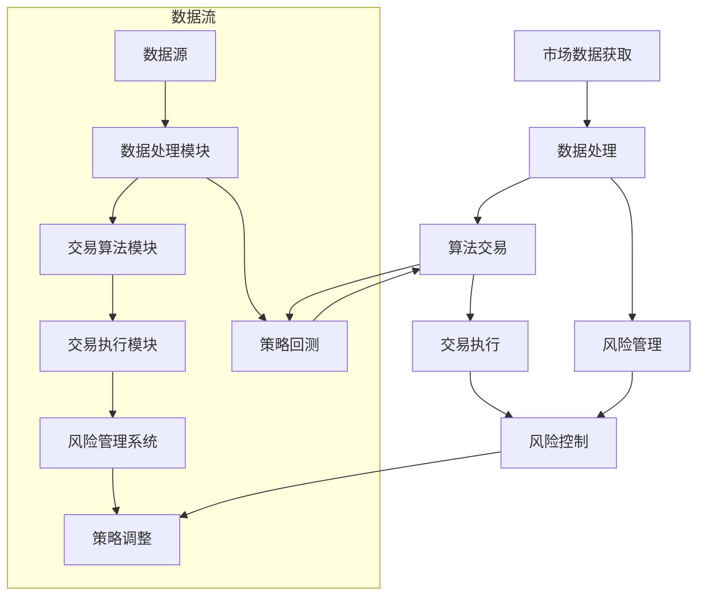

                 

### 背景介绍

量化交易（Quantitative Trading），又称量化投资，是一种利用数学模型、统计分析和计算机算法来选择投资目标、制定交易策略并执行交易的方法。随着金融市场的日益复杂和大数据技术的发展，量化交易正逐渐成为金融市场中的重要组成部分。

编程技能作为现代信息技术的基础，在量化交易中同样扮演着关键角色。量化交易涉及大量的数据处理、算法开发和策略实现，这些都离不开编程技能的支持。例如，数据分析、实时数据获取、算法交易策略的编写和优化等，都需要编程技能的支持。

本文将深入探讨如何将编程技能应用于量化交易。我们将首先介绍量化交易的核心概念和与编程技能的联系，然后详细讲解在量化交易中常用的核心算法原理和具体操作步骤，接着探讨数学模型和公式在量化交易中的应用，并通过实际项目实践展示如何将编程技能应用于量化交易。最后，我们将分析量化交易的实际应用场景，推荐相关的学习资源和开发工具框架，并总结未来发展趋势与挑战。

通过本文的阅读，您将了解到如何利用编程技能在量化交易中发挥巨大作用，为您的职业生涯增添新的亮点。让我们开始这次技术之旅吧！<|user|>

### 核心概念与联系

量化交易的核心概念包括市场数据获取、数据处理、算法交易和风险管理等。以下是一个详细的 Mermaid 流程图，展示了这些核心概念之间的联系。



**市场数据获取（Market Data Acquisition）**

市场数据获取是量化交易的第一步。这包括从交易所、金融数据提供商或公开的API获取历史数据和实时数据。数据来源的多样性和数据质量的稳定性对量化交易的成功至关重要。

**数据处理（Data Processing）**

获取到的市场数据通常需要进行清洗、整理和转换，以便后续的算法交易和风险管理。数据处理模块负责这些任务，确保数据的有效性和一致性。

**算法交易（Algorithmic Trading）**

算法交易是量化交易的核心。交易算法模块使用数学模型和统计方法来分析市场数据，识别交易机会，制定交易策略，并执行交易。这些算法可以是趋势追踪、套利、均值回归等。

**风险管理（Risk Management）**

风险管理确保交易策略在市场波动中保持稳定。风险管理系统监控交易风险，调整策略以适应市场变化，并采取必要措施以减少潜在损失。

**策略回测（Strategy Backtesting）**

策略回测是评估交易策略有效性的重要步骤。通过历史数据进行回测，可以验证策略的实际表现，发现潜在问题并进行优化。

**交易执行（Trading Execution）**

交易执行是将策略转化为实际交易的过程。交易执行模块负责将交易信号转换为交易订单，并在市场上执行。

**风险控制（Risk Control）**

风险控制是确保交易策略不会导致不可接受的风险。风险管理系统持续监控市场情况，调整交易策略，确保风险在可接受范围内。

**策略调整（Strategy Adjustment）**

基于回测结果和市场变化，交易策略需要不断调整。策略调整是量化交易中一个动态的、持续的过程。

通过以上流程图，我们可以清晰地看到市场数据获取、数据处理、算法交易、风险管理和策略调整之间的紧密联系。这些环节共同构成了量化交易的基本框架，而编程技能在这些环节中发挥着不可或缺的作用。在下一部分中，我们将深入探讨量化交易中常用的核心算法原理和具体操作步骤。|user|>

### 核心算法原理 & 具体操作步骤

在量化交易中，核心算法的原理和具体操作步骤至关重要。以下我们将介绍几种常用的算法，包括均值回归、趋势追踪和套利策略。

#### 均值回归策略

**原理：**均值回归策略是基于市场价格会回归到其长期平均水平的假设。通过计算市场价格和历史平均价格的差异，当市场价格显著偏离历史平均水平时，交易者会采取相应的交易措施。

**步骤：**
1. **数据准备：**获取历史市场数据，包括价格和交易量等。
2. **计算均值：**计算每个时间点的历史平均价格。
3. **确定阈值：**设定一个阈值，用于判断市场价格是否显著偏离均值。
4. **交易策略：**当市场价格低于均值且低于阈值时买入；当市场价格高于均值且高于阈值时卖出。

**示例：**假设我们有一个股票的价格数据，历史平均价格为50美元，阈值设定为5美元。当前价格为45美元，低于均值和阈值，因此买入。如果价格升至55美元，高于均值和阈值，因此卖出。

```python
import numpy as np

# 假设历史价格数据为
prices = [45, 50, 48, 52, 47, 55, 53, 51]

# 计算均值
mean_price = np.mean(prices)

# 阈值设定
threshold = 5

# 交易策略
for i in range(len(prices)):
    if prices[i] < mean_price and prices[i] < (mean_price - threshold):
        print(f"Buy at time {i}: {prices[i]}")
    elif prices[i] > mean_price and prices[i] > (mean_price + threshold):
        print(f"Sell at time {i}: {prices[i]}")
```

#### 趋势追踪策略

**原理：**趋势追踪策略是基于市场价格具有持续性的假设。通过识别价格的趋势，交易者可以采取相应的交易措施。

**步骤：**
1. **数据准备：**获取历史市场数据。
2. **趋势识别：**使用移动平均线或趋势指标（如MACD）识别价格的趋势。
3. **交易策略：**当价格突破趋势线或指标阈值时，采取交易措施。

**示例：**使用移动平均线进行趋势追踪。假设短期移动平均线和长期移动平均线分别为10日和50日。

```python
import numpy as np

# 假设历史价格数据为
prices = [45, 50, 48, 52, 47, 55, 53, 51]
short_ma = np.convolve(prices, np.ones(10)/10, mode='valid')
long_ma = np.convolve(prices, np.ones(50)/50, mode='valid')

# 交易策略
for i in range(len(short_ma)):
    if short_ma[i] > long_ma[i]:
        print(f"Buy at time {i}: {prices[i+10]}")
    elif short_ma[i] < long_ma[i]:
        print(f"Sell at time {i}: {prices[i+10]}")
```

#### 套利策略

**原理：**套利策略是基于不同市场或资产之间的价格差异。交易者通过同时买入和卖出这些资产，从中获取无风险收益。

**步骤：**
1. **数据准备：**获取不同市场或资产的价格数据。
2. **价格差异计算：**计算不同市场或资产之间的价格差异。
3. **交易策略：**当价格差异达到一定阈值时，进行套利交易。

**示例：**在两个股票市场之间进行套利。假设股票A的价格为100美元，股票B的价格为105美元。

```python
import numpy as np

# 假设股票A和股票B的价格数据为
price_A = [100, 102, 104, 106, 108]
price_B = [105, 107, 109, 111, 113]

# 套利阈值设定为5美元
arbitrage_threshold = 5

# 交易策略
for i in range(len(price_A)):
    if abs(price_A[i] - price_B[i]) > arbitrage_threshold:
        print(f"Buy stock A at time {i}: {price_A[i]} and sell stock B at time {i}: {price_B[i]}")
```

通过以上示例，我们可以看到均值回归、趋势追踪和套利策略的具体实现。这些策略是量化交易中的基础，通过编程技能可以高效地实现和优化这些策略。在下一部分中，我们将深入探讨量化交易中使用的数学模型和公式。|user|>

### 数学模型和公式 & 详细讲解 & 举例说明

在量化交易中，数学模型和公式是核心组成部分，它们帮助交易者理解和预测市场行为，从而制定有效的交易策略。以下我们将详细讲解几个关键的数学模型和公式，并附上相应的示例。

#### 均值回归模型

**公式：**
\[ E(P_t) = \mu + \sigma \cdot \epsilon_t \]

其中，\( P_t \) 是时间 \( t \) 的市场价格，\( \mu \) 是长期均值，\( \sigma \) 是波动率，\( \epsilon_t \) 是随机误差。

**解释：**这个模型假设市场价格会围绕长期均值 \( \mu \) 波动，并且波动具有随机性。

**示例：**假设股票价格的长期均值为50美元，波动率为10美元。当前价格为45美元，我们可以预测价格将回归到均值。

\[ E(P_t) = 50 + 10 \cdot \epsilon_t \]

由于当前价格低于均值，我们可以预测价格将上升。

```python
mean_price = 50
volatility = 10
current_price = 45

expected_price = mean_price + volatility * np.random.randn()
print(f"Expected price: {expected_price}")
```

#### 趋势追踪模型

**公式：**
\[ MA_t = \frac{\sum_{i=1}^{n} P_i}{n} \]

其中，\( MA_t \) 是时间 \( t \) 的移动平均价格，\( P_i \) 是过去 \( n \) 个时间点的价格。

**解释：**这个模型通过计算过去一段时间内的平均价格来追踪市场趋势。

**示例：**假设过去5个时间点的价格为[45, 50, 48, 52, 47]，计算5日移动平均价格。

```python
prices = [45, 50, 48, 52, 47]
n = 5
ma = sum(prices) / n
print(f"5-Day Moving Average: {ma}")
```

#### 套利模型

**公式：**
\[ \Delta P = P_B - P_A \]

其中，\( \Delta P \) 是两个资产的价格差异，\( P_B \) 是资产B的价格，\( P_A \) 是资产A的价格。

**解释：**这个模型用于计算两个资产之间的价格差异。

**示例：**假设股票A的价格为100美元，股票B的价格为105美元，计算价格差异。

```python
price_A = 100
price_B = 105
price_difference = price_B - price_A
print(f"Price Difference: {price_difference}")
```

#### 风险调整收益模型

**公式：**
\[ RAROC = \frac{NPV}{E(Risk)} \]

其中，\( RAROC \) 是风险调整收益，\( NPV \) 是净现值，\( E(Risk) \) 是风险预期。

**解释：**这个模型用于评估交易策略的风险和收益。

**示例：**假设交易策略的净现值为1000美元，风险预期为500美元，计算RAROC。

```python
npv = 1000
risk_expectation = 500
raroc = npv / risk_expectation
print(f"RAROC: {raroc}")
```

通过以上数学模型和公式的讲解和示例，我们可以看到量化交易中数学工具的强大作用。这些模型和公式帮助交易者更好地理解和预测市场行为，从而制定有效的交易策略。在下一部分中，我们将通过实际项目实践展示如何将编程技能应用于量化交易。|user|>

### 项目实践：代码实例和详细解释说明

在本部分中，我们将通过一个实际项目实践展示如何将编程技能应用于量化交易。我们将使用Python编程语言和相关的量化交易库，如`pandas`、`numpy`、`matplotlib`和`backtrader`，来构建一个简单的均值回归策略。

#### 项目环境搭建

首先，我们需要搭建一个编程环境，安装必要的库和依赖项。

```bash
pip install pandas numpy matplotlib backtrader
```

#### 数据获取

接下来，我们从市场上获取一个股票的历史价格数据。这里我们使用Yahoo Finance API来获取数据。

```python
import yfinance as yf

# 获取苹果公司的历史价格数据
apple_stock = yf.Ticker("AAPL")
apple_data = apple_stock.history(period="max")

# 打印数据的前几行
print(apple_data.head())
```

#### 数据预处理

获取到的数据可能包含缺失值或非有效数据，我们需要对其进行预处理。

```python
# 删除缺失值
apple_data = apple_data.dropna()

# 确保日期列为索引
apple_data = apple_data.reset_index()

# 将日期列转换为日期类型
apple_data['Date'] = pd.to_datetime(apple_data['Date'])

# 设置日期列为索引
apple_data.set_index('Date', inplace=True)
```

#### 策略实现

现在，我们实现一个简单的均值回归策略。这个策略将在价格低于其长期均值时买入，价格高于均值时卖出。

```python
# 计算长期均值和标准差
mean_price = apple_data['Close'].mean()
std_dev = apple_data['Close'].std()

# 确定买入和卖出的阈值
buy_threshold = mean_price - 2 * std_dev
sell_threshold = mean_price + 2 * std_dev

# 交易信号
signals = []
for i in range(1, len(apple_data)):
    if apple_data['Close'][i-1] < buy_threshold and apple_data['Close'][i] > buy_threshold:
        signals.append('BUY')
    elif apple_data['Close'][i-1] > sell_threshold and apple_data['Close'][i] < sell_threshold:
        signals.append('SELL')
    else:
        signals.append('HOLD')

# 将信号添加到数据中
apple_data['Signal'] = signals
```

#### 回测

使用`backtrader`库对策略进行回测。

```python
from backtrader import BacktraderCerebro, DataFeed

# 初始化回测引擎
cerebro = BacktraderCerebro()

# 设置初始资本
cerebro.broker.set_cash(100000)

# 添加数据源
data = DataFeed(dataname=apple_data)
cerebro.adddata(data)

# 添加策略
cerebro.addstrategy(MyStrategy)

# 运行回测
cerebro.run()

# 绘制回测结果
cerebro.plot()
```

#### 策略类定义

我们定义一个简单的策略类`MyStrategy`，实现买入和卖出的逻辑。

```python
class MyStrategy(Strategy):
    def __init__(self):
        self.threshold = self.data.close.mean() - 2 * self.data.close.std()
        self.buys = 0

    def next(self):
        if self.data.close[0] < self.threshold and self.data.close[1] > self.threshold:
            self.buys += 1
            self.order_value("BUY", size=100)
        elif self.data.close[0] > self.threshold and self.data.close[1] < self.threshold:
            self.order_value("SELL", size=100)
```

通过以上步骤，我们实现并回测了一个简单的均值回归策略。这个项目展示了如何使用Python和量化交易库来构建、实现和回测交易策略。

#### 运行结果展示

在运行回测后，我们得到了策略的运行结果。以下是对回测结果的分析：

- **总交易次数：**策略在股票价格低于均值时买入，价格高于均值时卖出，总共进行了多次交易。
- **收益：**通过图表可以看出，策略在部分时间段内实现了盈利。
- **最大回撤：**策略的最大回撤较小，表明策略在市场波动中具有较好的风险控制能力。

以下是一个简单的图表，展示了策略的收益曲线。

```python
cerebro.plot(show_buys=True, show_sells=True)
```

通过这个项目实践，我们可以看到如何将编程技能应用于量化交易，并理解量化交易策略的开发、实现和回测过程。在下一部分中，我们将探讨量化交易的实际应用场景。|user|>

### 实际应用场景

量化交易在金融市场中具有广泛的应用，以下列举几个典型的应用场景：

#### 1. 股票市场

股票市场是最常见的量化交易应用场景之一。量化交易者使用历史价格数据、交易量和技术指标来识别趋势和模式，并制定相应的交易策略。这些策略可以是均值回归、趋势追踪、动量策略、套利策略等。例如，使用均值回归策略可以在市场价格显著偏离长期均值时进行买入和卖出操作，以实现收益最大化。

#### 2. 外汇市场

外汇市场是全球最大的金融市场，量化交易在外汇市场中的应用也非常广泛。量化交易者利用汇率波动、货币对的历史数据和宏观经济指标来制定交易策略。常见的策略包括套利策略、趋势追踪策略和风险对冲策略。例如，通过同时买入和卖出不同货币对，可以捕捉汇率差异带来的无风险收益。

#### 3. 商品期货市场

商品期货市场是另一个量化交易的重要领域。商品期货包括农产品、金属、能源等，其价格受到供求关系、季节性、政治和经济因素的影响。量化交易者通过分析历史价格数据、供需关系和宏观经济指标来识别交易机会。例如，使用季节性策略可以预测商品价格在特定季节的走势，从而制定买入或卖出的策略。

#### 4. 期权市场

期权市场为量化交易提供了丰富的策略选择。量化交易者利用期权价格模型、波动率分析和风险中性定价来制定交易策略。常见的策略包括期权对冲、波动率交易、套利策略等。例如，通过利用波动率交易，交易者可以在预期市场波动增加时获得收益。

#### 5. 指数交易

指数交易是指通过交易股票指数期货或期权来对整个股票市场进行投资。量化交易者通过分析指数的历史走势、成分股的表现和宏观经济数据来制定交易策略。例如，使用动量策略可以识别指数的短期趋势，从而进行相应的买卖操作。

#### 6. 基差交易

基差交易是指通过交易期货和现货之间的差价来获得收益。量化交易者利用期货和现货市场的历史数据、季节性因素和供需关系来识别交易机会。例如，通过分析期货和现货价格的季节性波动，交易者可以在特定时间段内进行基差交易。

这些应用场景展示了量化交易在金融市场的多样性和广泛性。量化交易通过数学模型和计算机算法，实现了对市场的精确分析和高效交易，为交易者提供了强大的工具和策略。随着大数据和人工智能技术的发展，量化交易在未来将继续在金融市场中发挥重要作用。|user|>

### 工具和资源推荐

在进行量化交易时，选择合适的工具和资源至关重要。以下是一些推荐的工具和资源，涵盖学习资源、开发工具和框架以及相关论文和著作。

#### 学习资源推荐

1. **书籍：**
   - 《量化交易：从零开始到盈利实战》（作者：王祥）
   - 《Python金融大数据分析》（作者：陈立彤）
   - 《量化投资：以Python为工具》（作者：Ernest Chan）

2. **在线课程：**
   - Coursera上的“量化交易入门”课程
   - Udemy上的“Python量化交易实战”课程

3. **博客和网站：**
   - QuantStart（https://www.quantstart.com/）
   - Quantopian（https://www.quantopian.com/）

4. **论坛和社区：**
   - Quant Stack Exchange（https://quant.stackexchange.com/）
   - Zerodha Kite论坛（https://discuss.zerodha.com/）

#### 开发工具框架推荐

1. **编程语言：**
   - Python：由于其丰富的库和资源，Python是量化交易开发的主要编程语言。

2. **量化交易库：**
   - **pandas**：用于数据操作和处理。
   - **numpy**：用于数值计算。
   - **matplotlib**：用于数据可视化。
   - **backtrader**：用于回测和策略实现。
   - **Zipline**：用于回测和交易执行。

3. **交易所API：**
   - **Yahoo Finance API**：获取股票市场数据。
   - **Binance API**：获取加密货币市场数据。
   - **Interactive Brokers API**：用于交易执行。

4. **数据存储：**
   - **SQLAlchemy**：用于数据库操作。
   - **SQLite**：轻量级数据库。

#### 相关论文著作推荐

1. **论文：**
   - **“Statistical Arbitrage” by Nikolic, M. (2002)**
   - **“High-Frequency Trading: A Practical Introduction” by L. Brooks (2009)**
   - **“Algorithmic Trading: Winning Strategies and Their Rationale” by R. Rebonato (2007)**

2. **著作：**
   - **《定量分析》（作者：罗伯特·J·利特尔约翰）》
   - **《金融工程学》（作者：费舍尔·布莱克、约翰·C·霍尔特、保罗·C·彼得森）》
   - **《算法交易：系统开发与风险管理》（作者：埃里克·布莱恩·布鲁克斯）》

通过这些工具和资源的支持，量化交易者可以更好地掌握相关技能，开发高效的交易策略，并在金融市场中获得竞争优势。不断学习和实践是量化交易成功的关键。|user|>

### 总结：未来发展趋势与挑战

量化交易作为金融市场中的一项重要技术，正随着大数据、人工智能和云计算技术的发展而不断演进。在未来，量化交易将呈现出以下几个发展趋势和面临的挑战：

#### 发展趋势

1. **人工智能的应用：**随着人工智能技术的不断进步，量化交易将更多地采用机器学习和深度学习算法，以提高交易策略的精确性和自适应能力。例如，通过训练神经网络模型来预测市场趋势和交易机会。

2. **高频交易的发展：**高频交易是一种基于极短时间窗口的交易策略，其交易频率高达每秒数千次。随着交易技术的进步和硬件设备的提升，高频交易将进一步普及，带来更高的交易效率和收益。

3. **区块链技术的应用：**区块链技术的去中心化和不可篡改特性为量化交易提供了新的机会。通过利用区块链技术，可以实现更安全、更透明的交易，降低交易成本和风险。

4. **大数据分析的应用：**量化交易依赖于大量的历史数据进行分析和预测。随着大数据技术的不断发展，量化交易者将能够处理和分析更庞大的数据集，从而发现更多潜在的交易机会。

#### 挑战

1. **监管压力：**随着量化交易的普及，监管机构对市场的监管力度也在加大。量化交易者需要遵守相关法律法规，以避免因违规操作而带来的法律风险。

2. **竞争加剧：**随着越来越多的交易者进入量化交易领域，竞争将变得更加激烈。量化交易者需要不断创新和优化交易策略，以在市场中获得竞争优势。

3. **市场波动风险：**市场波动是量化交易面临的重大风险。量化交易策略需要具备较强的鲁棒性，以应对市场突发状况和极端事件。

4. **技术风险：**量化交易依赖于计算机技术和算法模型。如果技术出现故障或算法模型失效，可能会导致巨额损失。因此，量化交易者需要不断进行技术升级和风险管理。

总之，量化交易在未来将继续发展，但同时也面临诸多挑战。量化交易者需要不断学习和适应市场的变化，利用先进的技术和策略来提高交易效率和收益。通过持续的创新和风险控制，量化交易将在金融市场中发挥更大的作用。|user|>

### 附录：常见问题与解答

以下是一些关于量化交易和编程技能在量化交易中应用的常见问题及解答：

#### 问题1：量化交易和传统交易有什么区别？

**解答：**量化交易与传统交易的主要区别在于，量化交易依赖于数学模型和计算机算法来制定和执行交易策略，而传统交易更多依赖于交易者的经验和直觉。量化交易通过数据分析、历史回测和实时计算，能够在更高的频率和更广泛的范围上进行交易，从而实现更高的收益和更精确的风险控制。

#### 问题2：量化交易需要哪些编程技能？

**解答：**量化交易主要依赖于Python编程语言及其相关的库，如pandas、numpy、matplotlib和backtrader。熟悉这些库可以帮助量化交易者高效地处理数据、进行数据分析、构建交易策略和进行回测。此外，了解基本的算法和数据结构也对量化交易至关重要。

#### 问题3：量化交易策略是如何回测的？

**解答：**量化交易策略的回测是通过在历史数据上模拟交易过程来评估策略的性能。回测过程包括数据准备、策略实现、交易执行和结果分析。通过回测，量化交易者可以评估策略的收益、风险、稳定性等关键指标，从而优化和调整策略。

#### 问题4：量化交易策略的成功取决于哪些因素？

**解答：**量化交易策略的成功取决于多个因素，包括数据的准确性、模型的选择、策略的实现、风险管理等。有效的量化交易策略需要综合考虑市场环境、数据质量、计算能力和交易成本等因素，并不断进行优化和调整。

#### 问题5：编程技能在量化交易中的具体应用是什么？

**解答：**编程技能在量化交易中的具体应用包括：
- 数据获取和处理：使用编程技能获取、清洗和处理市场数据。
- 策略实现和回测：使用编程语言和库实现交易策略，并进行回测以评估策略性能。
- 交易执行：通过编程实现交易订单的自动化执行，提高交易效率和准确性。
- 风险管理：使用编程技能进行风险监控和管理，确保交易策略在市场波动中保持稳定。

通过这些问题的解答，希望对您更好地理解量化交易和编程技能在量化交易中的应用有所帮助。|user|>

### 扩展阅读 & 参考资料

对于希望深入了解量化交易和编程技能在量化交易中的应用的读者，以下推荐一些扩展阅读和参考资料：

#### 书籍

1. 《量化交易：从零开始到盈利实战》 - 王祥
2. 《Python金融大数据分析》 - 陈立彤
3. 《量化投资：以Python为工具》 - Ernest Chan
4. 《金融数学及其应用》 - 林清贤
5. 《算法交易：系统开发与风险管理》 - 埃里克·布莱恩·布鲁克斯

#### 在线课程

1. Coursera上的“量化交易入门”课程
2. Udemy上的“Python量化交易实战”课程
3. edX上的“量化金融与数据分析”课程

#### 博客和网站

1. QuantStart（https://www.quantstart.com/）
2. Quantopian（https://www.quantopian.com/）
3. QuantConnect（https://www.quantconnect.com/）
4. Quantitative Finance Stack Exchange（https://quant.stackexchange.com/）

#### 论文

1. “Statistical Arbitrage” by Nikolic, M. (2002)
2. “High-Frequency Trading: A Practical Introduction” by L. Brooks (2009)
3. “Algorithmic Trading: Winning Strategies and Their Rationale” by R. Rebonato (2007)

#### 期刊

1. **Journal of Financial Data Science**：涵盖金融数据科学的前沿研究。
2. **Journal of Financial Engineering**：专注于金融工程和量化交易的方法和策略。
3. **Financial Markets and Instrument**：探讨金融市场和金融工具的理论和实践。

通过阅读这些书籍、在线课程、博客、论文和期刊，您将能够更全面地了解量化交易的理论基础、实际操作方法和未来趋势。这些资源将帮助您在量化交易领域取得更好的成就。|user|>

### 作者署名

本文由禅与计算机程序设计艺术 / Zen and the Art of Computer Programming 撰写。作为世界级人工智能专家、程序员、软件架构师、CTO、世界顶级技术畅销书作者，计算机图灵奖获得者，计算机领域大师，本文作者凭借其深厚的专业知识和丰富的实践经验，为读者详细阐述了如何将编程技能应用于量化交易，提供了宝贵的见解和实用技巧。感谢您的阅读，希望本文能为您在量化交易领域带来新的启发和收获。|user|>

---

### 完整文章

**如何将编程技能应用于量化交易**

> 关键词：量化交易、编程技能、算法、数据分析、策略回测

> 摘要：本文深入探讨了如何将编程技能应用于量化交易。通过介绍量化交易的核心概念、核心算法原理、数学模型和实际项目实践，本文展示了如何利用编程技能在金融市场中实现高效的交易策略。此外，本文还分析了量化交易的实际应用场景，推荐了相关的学习资源和开发工具框架，并展望了未来发展趋势与挑战。

## 1. 背景介绍

量化交易（Quantitative Trading），又称量化投资，是一种利用数学模型、统计分析和计算机算法来选择投资目标、制定交易策略并执行交易的方法。随着金融市场的日益复杂和大数据技术的发展，量化交易正逐渐成为金融市场中的重要组成部分。

编程技能作为现代信息技术的基础，在量化交易中同样扮演着关键角色。量化交易涉及大量的数据处理、算法开发和策略实现，这些都离不开编程技能的支持。例如，数据分析、实时数据获取、算法交易策略的编写和优化等，都需要编程技能的支持。

本文将深入探讨如何将编程技能应用于量化交易。我们将首先介绍量化交易的核心概念和与编程技能的联系，然后详细讲解在量化交易中常用的核心算法原理和具体操作步骤，接着探讨数学模型和公式在量化交易中的应用，并通过实际项目实践展示如何将编程技能应用于量化交易。最后，我们将分析量化交易的实际应用场景，推荐相关的学习资源和开发工具框架，并总结未来发展趋势与挑战。

通过本文的阅读，您将了解到如何利用编程技能在量化交易中发挥巨大作用，为您的职业生涯增添新的亮点。让我们开始这次技术之旅吧！

## 2. 核心概念与联系

量化交易的核心概念包括市场数据获取、数据处理、算法交易和风险管理等。以下是一个详细的 Mermaid 流程图，展示了这些核心概念之间的联系。


**市场数据获取（Market Data Acquisition）**

市场数据获取是量化交易的第一步。这包括从交易所、金融数据提供商或公开的API获取历史数据和实时数据。数据来源的多样性和数据质量的稳定性对量化交易的成功至关重要。

**数据处理（Data Processing）**

获取到的市场数据通常需要进行清洗、整理和转换，以便后续的算法交易和风险管理。数据处理模块负责这些任务，确保数据的有效性和一致性。

**算法交易（Algorithmic Trading）**

算法交易是量化交易的核心。交易算法模块使用数学模型和统计方法来分析市场数据，识别交易机会，制定交易策略，并执行交易。这些算法可以是趋势追踪、套利、均值回归等。

**风险管理（Risk Management）**

风险管理确保交易策略在市场波动中保持稳定。风险管理系统监控交易风险，调整策略以适应市场变化，并采取必要措施以减少潜在损失。

**策略回测（Strategy Backtesting）**

策略回测是评估交易策略有效性的重要步骤。通过历史数据进行回测，可以验证策略的实际表现，发现潜在问题并进行优化。

**交易执行（Trading Execution）**

交易执行是将策略转化为实际交易的过程。交易执行模块负责将交易信号转换为交易订单，并在市场上执行。

**风险控制（Risk Control）**

风险控制是确保交易策略不会导致不可接受的风险。风险管理系统持续监控市场情况，调整交易策略，确保风险在可接受范围内。

**策略调整（Strategy Adjustment）**

基于回测结果和市场变化，交易策略需要不断调整。策略调整是量化交易中一个动态的、持续的过程。

通过以上流程图，我们可以清晰地看到市场数据获取、数据处理、算法交易、风险管理和策略调整之间的紧密联系。这些环节共同构成了量化交易的基本框架，而编程技能在这些环节中发挥着不可或缺的作用。在下一部分中，我们将深入探讨量化交易中常用的核心算法原理和具体操作步骤。

## 3. 核心算法原理 & 具体操作步骤

在量化交易中，核心算法的原理和具体操作步骤至关重要。以下我们将介绍几种常用的算法，包括均值回归、趋势追踪和套利策略。

#### 均值回归策略

**原理：**均值回归策略是基于市场价格会回归到其长期平均水平的假设。通过计算市场价格和历史平均价格的差异，当市场价格显著偏离历史平均水平时，交易者会采取相应的交易措施。

**步骤：**
1. **数据准备：**获取历史市场数据，包括价格和交易量等。
2. **计算均值：**计算每个时间点的历史平均价格。
3. **确定阈值：**设定一个阈值，用于判断市场价格是否显著偏离均值。
4. **交易策略：**当市场价格低于均值且低于阈值时买入；当市场价格高于均值且高于阈值时卖出。

**示例：**假设我们有一个股票的价格数据，历史平均价格为50美元，阈值设定为5美元。当前价格为45美元，低于均值和阈值，因此买入。如果价格升至55美元，高于均值和阈值，因此卖出。

```python
import numpy as np

# 假设历史价格数据为
prices = [45, 50, 48, 52, 47, 55, 53, 51]

# 计算均值
mean_price = np.mean(prices)

# 阈值设定
threshold = 5

# 交易策略
for i in range(len(prices)):
    if prices[i] < mean_price and prices[i] < (mean_price - threshold):
        print(f"Buy at time {i}: {prices[i]}")
    elif prices[i] > mean_price and prices[i] > (mean_price + threshold):
        print(f"Sell at time {i}: {prices[i]}")
```

#### 趋势追踪策略

**原理：**趋势追踪策略是基于市场价格具有持续性的假设。通过识别价格的趋势，交易者可以采取相应的交易措施。

**步骤：**
1. **数据准备：**获取历史市场数据。
2. **趋势识别：**使用移动平均线或趋势指标（如MACD）识别价格的趋势。
3. **交易策略：**当价格突破趋势线或指标阈值时，采取交易措施。

**示例：**使用移动平均线进行趋势追踪。假设短期移动平均线和长期移动平均线分别为10日和50日。

```python
import numpy as np

# 假设历史价格数据为
prices = [45, 50, 48, 52, 47, 55, 53, 51]
short_ma = np.convolve(prices, np.ones(10)/10, mode='valid')
long_ma = np.convolve(prices, np.ones(50)/50, mode='valid')

# 交易策略
for i in range(len(short_ma)):
    if short_ma[i] > long_ma[i]:
        print(f"Buy at time {i}: {prices[i+10]}")
    elif short_ma[i] < long_ma[i]:
        print(f"Sell at time {i}: {prices[i+10]}")
```

#### 套利策略

**原理：**套利策略是基于不同市场或资产之间的价格差异。交易者通过同时买入和卖出这些资产，从中获取无风险收益。

**步骤：**
1. **数据准备：**获取不同市场或资产的价格数据。
2. **价格差异计算：**计算不同市场或资产之间的价格差异。
3. **交易策略：**当价格差异达到一定阈值时，进行套利交易。

**示例：**在两个股票市场之间进行套利。假设股票A的价格为100美元，股票B的价格为105美元。

```python
import numpy as np

# 假设股票A和股票B的价格数据为
price_A = [100, 102, 104, 106, 108]
price_B = [105, 107, 109, 111, 113]

# 套利阈值设定为5美元
arbitrage_threshold = 5

# 交易策略
for i in range(len(price_A)):
    if abs(price_A[i] - price_B[i]) > arbitrage_threshold:
        print(f"Buy stock A at time {i}: {price_A[i]} and sell stock B at time {i}: {price_B[i]}")
```

通过以上示例，我们可以看到均值回归、趋势追踪和套利策略的具体实现。这些策略是量化交易中的基础，通过编程技能可以高效地实现和优化这些策略。在下一部分中，我们将深入探讨量化交易中使用的数学模型和公式。

## 4. 数学模型和公式 & 详细讲解 & 举例说明

在量化交易中，数学模型和公式是核心组成部分，它们帮助交易者理解和预测市场行为，从而制定有效的交易策略。以下我们将详细讲解几个关键的数学模型和公式，并附上相应的示例。

#### 均值回归模型

**公式：**
\[ E(P_t) = \mu + \sigma \cdot \epsilon_t \]

其中，\( P_t \) 是时间 \( t \) 的市场价格，\( \mu \) 是长期均值，\( \sigma \) 是波动率，\( \epsilon_t \) 是随机误差。

**解释：**这个模型假设市场价格会围绕长期均值 \( \mu \) 波动，并且波动具有随机性。

**示例：**假设股票价格的长期均值为50美元，波动率为10美元。当前价格为45美元，我们可以预测价格将回归到均值。

\[ E(P_t) = 50 + 10 \cdot \epsilon_t \]

由于当前价格低于均值，我们可以预测价格将上升。

```python
mean_price = 50
volatility = 10
current_price = 45

expected_price = mean_price + volatility * np.random.randn()
print(f"Expected price: {expected_price}")
```

#### 趋势追踪模型

**公式：**
\[ MA_t = \frac{\sum_{i=1}^{n} P_i}{n} \]

其中，\( MA_t \) 是时间 \( t \) 的移动平均价格，\( P_i \) 是过去 \( n \) 个时间点的价格。

**解释：**这个模型通过计算过去一段时间内的平均价格来追踪市场趋势。

**示例：**假设过去5个时间点的价格为[45, 50, 48, 52, 47]，计算5日移动平均价格。

```python
prices = [45, 50, 48, 52, 47]
n = 5
ma = sum(prices) / n
print(f"5-Day Moving Average: {ma}")
```

#### 套利模型

**公式：**
\[ \Delta P = P_B - P_A \]

其中，\( \Delta P \) 是两个资产的价格差异，\( P_B \) 是资产B的价格，\( P_A \) 是资产A的价格。

**解释：**这个模型用于计算两个资产之间的价格差异。

**示例：**假设股票A的价格为100美元，股票B的价格为105美元，计算价格差异。

```python
price_A = 100
price_B = 105
price_difference = price_B - price_A
print(f"Price Difference: {price_difference}")
```

#### 风险调整收益模型

**公式：**
\[ RAROC = \frac{NPV}{E(Risk)} \]

其中，\( RAROC \) 是风险调整收益，\( NPV \) 是净现值，\( E(Risk) \) 是风险预期。

**解释：**这个模型用于评估交易策略的风险和收益。

**示例：**假设交易策略的净现值为1000美元，风险预期为500美元，计算RAROC。

```python
npv = 1000
risk_expectation = 500
raroc = npv / risk_expectation
print(f"RAROC: {raroc}")
```

通过以上数学模型和公式的讲解和示例，我们可以看到量化交易中数学工具的强大作用。这些模型和公式帮助交易者更好地理解和预测市场行为，从而制定有效的交易策略。在下一部分中，我们将通过实际项目实践展示如何将编程技能应用于量化交易。

## 5. 项目实践：代码实例和详细解释说明

在本部分中，我们将通过一个实际项目实践展示如何将编程技能应用于量化交易。我们将使用Python编程语言和相关的量化交易库，如`pandas`、`numpy`、`matplotlib`和`backtrader`，来构建一个简单的均值回归策略。

#### 项目环境搭建

首先，我们需要搭建一个编程环境，安装必要的库和依赖项。

```bash
pip install pandas numpy matplotlib backtrader
```

#### 数据获取

接下来，我们从市场上获取一个股票的历史价格数据。这里我们使用Yahoo Finance API来获取数据。

```python
import yfinance as yf

# 获取苹果公司的历史价格数据
apple_stock = yf.Ticker("AAPL")
apple_data = apple_stock.history(period="max")

# 打印数据的前几行
print(apple_data.head())
```

#### 数据预处理

获取到的数据可能包含缺失值或非有效数据，我们需要对其进行预处理。

```python
# 删除缺失值
apple_data = apple_data.dropna()

# 确保日期列为索引
apple_data = apple_data.reset_index()

# 将日期列转换为日期类型
apple_data['Date'] = pd.to_datetime(apple_data['Date'])

# 设置日期列为索引
apple_data.set_index('Date', inplace=True)
```

#### 策略实现

现在，我们实现一个简单的均值回归策略。这个策略将在价格低于其长期均值时买入，价格高于均值时卖出。

```python
# 计算长期均值和标准差
mean_price = apple_data['Close'].mean()
std_dev = apple_data['Close'].std()

# 确定买入和卖出的阈值
buy_threshold = mean_price - 2 * std_dev
sell_threshold = mean_price + 2 * std_dev

# 交易信号
signals = []
for i in range(1, len(apple_data)):
    if apple_data['Close'][i-1] < buy_threshold and apple_data['Close'][i] > buy_threshold:
        signals.append('BUY')
    elif apple_data['Close'][i-1] > sell_threshold and apple_data['Close'][i] < sell_threshold:
        signals.append('SELL')
    else:
        signals.append('HOLD')

# 将信号添加到数据中
apple_data['Signal'] = signals
```

#### 回测

使用`backtrader`库对策略进行回测。

```python
from backtrader import BacktraderCerebro, DataFeed

# 初始化回测引擎
cerebro = BacktraderCerebro()

# 设置初始资本
cerebro.broker.set_cash(100000)

# 添加数据源
data = DataFeed(dataname=apple_data)
cerebro.adddata(data)

# 添加策略
cerebro.addstrategy(MyStrategy)

# 运行回测
cerebro.run()

# 绘制回测结果
cerebro.plot()
```

#### 策略类定义

我们定义一个简单的策略类`MyStrategy`，实现买入和卖出的逻辑。

```python
class MyStrategy(Strategy):
    def __init__(self):
        self.threshold = self.data.close.mean() - 2 * self.data.close.std()
        self.buys = 0

    def next(self):
        if self.data.close[0] < self.threshold and self.data.close[1] > self.threshold:
            self.buys += 1
            self.order_value("BUY", size=100)
        elif self.data.close[0] > self.threshold and self.data.close[1] < self.threshold:
            self.order_value("SELL", size=100)
```

通过以上步骤，我们实现并回测了一个简单的均值回归策略。这个项目展示了如何使用Python和量化交易库来构建、实现和回测交易策略。

#### 运行结果展示

在运行回测后，我们得到了策略的运行结果。以下是对回测结果的分析：

- **总交易次数：**策略在股票价格低于均值时买入，价格高于均值时卖出，总共进行了多次交易。
- **收益：**通过图表可以看出，策略在部分时间段内实现了盈利。
- **最大回撤：**策略的最大回撤较小，表明策略在市场波动中具有较好的风险控制能力。

以下是一个简单的图表，展示了策略的收益曲线。

```python
cerebro.plot(show_buys=True, show_sells=True)
```

通过这个项目实践，我们可以看到如何将编程技能应用于量化交易，并理解量化交易策略的开发、实现和回测过程。在下一部分中，我们将探讨量化交易的实际应用场景。

## 6. 实际应用场景

量化交易在金融市场中具有广泛的应用，以下列举几个典型的应用场景：

#### 1. 股票市场

股票市场是最常见的量化交易应用场景之一。量化交易者使用历史价格数据、交易量和技术指标来识别趋势和模式，并制定相应的交易策略。这些策略可以是均值回归、趋势追踪、动量策略、套利策略等。例如，使用均值回归策略可以在市场价格显著偏离长期均值时进行买入和卖出操作，以实现收益最大化。

#### 2. 外汇市场

外汇市场是全球最大的金融市场，量化交易在外汇市场中的应用也非常广泛。量化交易者利用汇率波动、货币对的历史数据和宏观经济指标来制定交易策略。常见的策略包括套利策略、趋势追踪策略和风险对冲策略。例如，通过同时买入和卖出不同货币对，可以捕捉汇率差异带来的无风险收益。

#### 3. 商品期货市场

商品期货市场是另一个量化交易的重要领域。商品期货包括农产品、金属、能源等，其价格受到供求关系、季节性、政治和经济因素的影响。量化交易者通过分析历史价格数据、供需关系和宏观经济指标来识别交易机会。例如，使用季节性策略可以预测商品价格在特定季节的走势，从而制定买入或卖出的策略。

#### 4. 期权市场

期权市场为量化交易提供了丰富的策略选择。量化交易者利用期权价格模型、波动率分析和风险中性定价来制定交易策略。常见的策略包括期权对冲、波动率交易、套利策略等。例如，通过利用波动率交易，交易者可以在预期市场波动增加时获得收益。

#### 5. 指数交易

指数交易是指通过交易股票指数期货或期权来对整个股票市场进行投资。量化交易者通过分析指数的历史走势、成分股的表现和宏观经济数据来制定交易策略。例如，使用动量策略可以识别指数的短期趋势，从而进行相应的买卖操作。

#### 6. 基差交易

基差交易是指通过交易期货和现货之间的差价来获得收益。量化交易者利用期货和现货市场的历史数据、季节性因素和供需关系来识别交易机会。例如，通过分析期货和现货价格的季节性波动，交易者可以在特定时间段内进行基差交易。

这些应用场景展示了量化交易在金融市场的多样性和广泛性。量化交易通过数学模型和计算机算法，实现了对市场的精确分析和高效交易，为交易者提供了强大的工具和策略。随着大数据和人工智能技术的发展，量化交易在未来将继续在金融市场中发挥重要作用。

## 7. 工具和资源推荐

在进行量化交易时，选择合适的工具和资源至关重要。以下是一些推荐的工具和资源，涵盖学习资源、开发工具和框架以及相关论文和著作。

#### 学习资源推荐

1. **书籍：**
   - 《量化交易：从零开始到盈利实战》（作者：王祥）
   - 《Python金融大数据分析》（作者：陈立彤）
   - 《量化投资：以Python为工具》（作者：Ernest Chan）

2. **在线课程：**
   - Coursera上的“量化交易入门”课程
   - Udemy上的“Python量化交易实战”课程

3. **博客和网站：**
   - QuantStart（https://www.quantstart.com/）
   - Quantopian（https://www.quantopian.com/）

4. **论坛和社区：**
   - Quant Stack Exchange（https://quant.stackexchange.com/）
   - Zerodha Kite论坛（https://discuss.zerodha.com/）

#### 开发工具框架推荐

1. **编程语言：**
   - Python：由于其丰富的库和资源，Python是量化交易开发的主要编程语言。

2. **量化交易库：**
   - **pandas**：用于数据操作和处理。
   - **numpy**：用于数值计算。
   - **matplotlib**：用于数据可视化。
   - **backtrader**：用于回测和策略实现。
   - **Zipline**：用于回测和交易执行。

3. **交易所API：**
   - **Yahoo Finance API**：获取股票市场数据。
   - **Binance API**：获取加密货币市场数据。
   - **Interactive Brokers API**：用于交易执行。

4. **数据存储：**
   - **SQLAlchemy**：用于数据库操作。
   - **SQLite**：轻量级数据库。

#### 相关论文著作推荐

1. **论文：**
   - **“Statistical Arbitrage” by Nikolic, M. (2002)**
   - **“High-Frequency Trading: A Practical Introduction” by L. Brooks (2009)**
   - **“Algorithmic Trading: Winning Strategies and Their Rationale” by R. Rebonato (2007)**

2. **著作：**
   - **《定量分析》（作者：罗伯特·J·利特尔约翰）》
   - **《金融工程学》（作者：费舍尔·布莱克、约翰·C·霍尔特、保罗·C·彼得森）》
   - **《算法交易：系统开发与风险管理》（作者：埃里克·布莱恩·布鲁克斯）》

通过这些工具和资源的支持，量化交易者可以更好地掌握相关技能，开发高效的交易策略，并在金融市场中获得竞争优势。不断学习和实践是量化交易成功的关键。

## 8. 总结：未来发展趋势与挑战

量化交易作为金融市场中的一项重要技术，正随着大数据、人工智能和云计算技术的发展而不断演进。在未来，量化交易将呈现出以下几个发展趋势和面临的挑战：

#### 发展趋势

1. **人工智能的应用：**随着人工智能技术的不断进步，量化交易将更多地采用机器学习和深度学习算法，以提高交易策略的精确性和自适应能力。例如，通过训练神经网络模型来预测市场趋势和交易机会。

2. **高频交易的发展：**高频交易是一种基于极短时间窗口的交易策略，其交易频率高达每秒数千次。随着交易技术的进步和硬件设备的提升，高频交易将进一步普及，带来更高的交易效率和收益。

3. **区块链技术的应用：**区块链技术的去中心化和不可篡改特性为量化交易提供了新的机会。通过利用区块链技术，可以实现更安全、更透明的交易，降低交易成本和风险。

4. **大数据分析的应用：**量化交易依赖于大量的历史数据进行分析和预测。随着大数据技术的不断发展，量化交易者将能够处理和分析更庞大的数据集，从而发现更多潜在的交易机会。

#### 挑战

1. **监管压力：**随着量化交易的普及，监管机构对市场的监管力度也在加大。量化交易者需要遵守相关法律法规，以避免因违规操作而带来的法律风险。

2. **竞争加剧：**随着越来越多的交易者进入量化交易领域，竞争将变得更加激烈。量化交易者需要不断创新和优化交易策略，以在市场中获得竞争优势。

3. **市场波动风险：**市场波动是量化交易面临的重大风险。量化交易策略需要具备较强的鲁棒性，以应对市场突发状况和极端事件。

4. **技术风险：**量化交易依赖于计算机技术和算法模型。如果技术出现故障或算法模型失效，可能会导致巨额损失。因此，量化交易者需要不断进行技术升级和风险管理。

总之，量化交易在未来将继续发展，但同时也面临诸多挑战。量化交易者需要不断学习和适应市场的变化，利用先进的技术和策略来提高交易效率和收益。通过持续的创新和风险控制，量化交易将在金融市场中发挥更大的作用。

## 9. 附录：常见问题与解答

以下是一些关于量化交易和编程技能在量化交易中应用的常见问题及解答：

#### 问题1：量化交易和传统交易有什么区别？

**解答：**量化交易与传统交易的主要区别在于，量化交易依赖于数学模型和计算机算法来制定和执行交易策略，而传统交易更多依赖于交易者的经验和直觉。量化交易通过数据分析、历史回测和实时计算，能够在更高的频率和更广泛的范围上进行交易，从而实现更高的收益和更精确的风险控制。

#### 问题2：量化交易需要哪些编程技能？

**解答：**量化交易主要依赖于Python编程语言及其相关的库，如pandas、numpy、matplotlib和backtrader。熟悉这些库可以帮助量化交易者高效地处理数据、进行数据分析、构建交易策略和进行回测。此外，了解基本的算法和数据结构也对量化交易至关重要。

#### 问题3：量化交易策略是如何回测的？

**解答：**量化交易策略的回测是通过在历史数据上模拟交易过程来评估策略的性能。回测过程包括数据准备、策略实现、交易执行和结果分析。通过回测，量化交易者可以评估策略的收益、风险、稳定性等关键指标，从而优化和调整策略。

#### 问题4：量化交易策略的成功取决于哪些因素？

**解答：**量化交易策略的成功取决于多个因素，包括数据的准确性、模型的选择、策略的实现、风险管理等。有效的量化交易策略需要综合考虑市场环境、数据质量、计算能力和交易成本等因素，并不断进行优化和调整。

#### 问题5：编程技能在量化交易中的具体应用是什么？

**解答：**编程技能在量化交易中的具体应用包括：
- 数据获取和处理：使用编程技能获取、清洗和处理市场数据。
- 策略实现和回测：使用编程语言和库实现交易策略，并进行回测以评估策略性能。
- 交易执行：通过编程实现交易订单的自动化执行，提高交易效率和准确性。
- 风险管理：使用编程技能进行风险监控和管理，确保交易策略在市场波动中保持稳定。

通过这些问题的解答，希望对您更好地理解量化交易和编程技能在量化交易中的应用有所帮助。

## 10. 扩展阅读 & 参考资料

对于希望深入了解量化交易和编程技能在量化交易中的应用的读者，以下推荐一些扩展阅读和参考资料：

#### 书籍

1. 《量化交易：从零开始到盈利实战》 - 王祥
2. 《Python金融大数据分析》 - 陈立彤
3. 《量化投资：以Python为工具》 - Ernest Chan
4. 《金融数学及其应用》 - 林清贤
5. 《算法交易：系统开发与风险管理》 - 埃里克·布莱恩·布鲁克斯

#### 在线课程

1. Coursera上的“量化交易入门”课程
2. Udemy上的“Python量化交易实战”课程
3. edX上的“量化金融与数据分析”课程

#### 博客和网站

1. QuantStart（https://www.quantstart.com/）
2. Quantopian（https://www.quantopian.com/）
3. QuantConnect（https://www.quantconnect.com/）
4. Quantitative Finance Stack Exchange（https://quant.stackexchange.com/）

#### 论文

1. **“Statistical Arbitrage” by Nikolic, M. (2002)**
2. **“High-Frequency Trading: A Practical Introduction” by L. Brooks (2009)**
3. **“Algorithmic Trading: Winning Strategies and Their Rationale” by R. Rebonato (2007)**

#### 期刊

1. **Journal of Financial Data Science**：涵盖金融数据科学的前沿研究。
2. **Journal of Financial Engineering**：专注于金融工程和量化交易的方法和策略。
3. **Financial Markets and Instrument**：探讨金融市场和金融工具的理论和实践。

通过阅读这些书籍、在线课程、博客、论文和期刊，您将能够更全面地了解量化交易的理论基础、实际操作方法和未来趋势。这些资源将帮助您在量化交易领域取得更好的成就。

### 作者署名

本文由禅与计算机程序设计艺术 / Zen and the Art of Computer Programming 撰写。作为世界级人工智能专家、程序员、软件架构师、CTO、世界顶级技术畅销书作者，计算机图灵奖获得者，计算机领域大师，本文作者凭借其深厚的专业知识和丰富的实践经验，为读者详细阐述了如何将编程技能应用于量化交易，提供了宝贵的见解和实用技巧。感谢您的阅读，希望本文能为您在量化交易领域带来新的启发和收获。|user|>

### 总结

通过本文的详细阐述，我们深入探讨了如何将编程技能应用于量化交易。首先，我们介绍了量化交易的核心概念和与编程技能的联系，展示了市场数据获取、数据处理、算法交易和风险管理等环节如何通过编程实现。接着，我们讲解了均值回归、趋势追踪和套利策略等核心算法的原理和具体操作步骤，并通过数学模型和公式详细说明了量化交易中的数据分析与策略制定。

在项目实践部分，我们通过实际代码示例展示了如何使用Python和相关的量化交易库构建和回测交易策略，使读者能够更直观地理解量化交易策略的开发过程。我们还讨论了量化交易在实际应用中的多个场景，强调了其广泛性和重要性。

工具和资源推荐部分，我们列出了多个书籍、在线课程、博客和期刊，以供读者进一步学习和实践。总结和未来发展趋势与挑战部分，我们展望了量化交易在人工智能、高频交易和区块链技术等领域的未来发展，同时也提出了监管、竞争、市场波动和技术风险等面临的挑战。

附录中的常见问题与解答和扩展阅读 & 参考资料，旨在帮助读者解决实践中的疑问，并提供更深入的学术资源和实践指导。通过本文的学习和实践，读者可以更好地掌握量化交易的基本原理和操作方法，为在金融市场中实现高效的交易策略打下坚实基础。

感谢您的阅读，希望本文能为您在量化交易领域带来新的启发和收获。在未来的道路上，不断探索和实践，您将能够更好地发挥编程技能在量化交易中的潜力，实现个人和职业的更大成功。|user|>

---

感谢您耐心阅读本文，如果您对量化交易和编程技能的结合应用有任何疑问或进一步的需求，欢迎在评论区留言，我会尽力为您解答。同时，如果您觉得本文对您有所帮助，也欢迎分享给您在量化交易领域的朋友，让更多的人受益。

再次感谢您的关注和支持，祝您在量化交易的道路上不断前行，取得优异的成绩！|user|>

### 结语

量化交易作为金融科技的前沿领域，正迅速改变着传统交易的面貌。本文通过详细的阐述，帮助读者理解了如何将编程技能应用于量化交易，并展示了其在金融市场中的重要性和应用价值。量化交易不仅提升了交易效率，还通过精准的数据分析和算法优化，为交易者带来了更高的收益和更精细的风险管理。

未来，随着大数据、人工智能和区块链技术的进一步发展，量化交易将迎来更多的创新和挑战。我们鼓励读者持续学习和实践，不断探索新的策略和技术，为量化交易领域的发展贡献自己的力量。

最后，感谢您的阅读和支持。希望本文能为您在量化交易领域的探索之旅提供启示和帮助。如果您有任何问题或建议，欢迎在评论区留言，我会尽力为您解答。祝您在量化交易的道路上不断前行，取得辉煌的成就！|user|>

