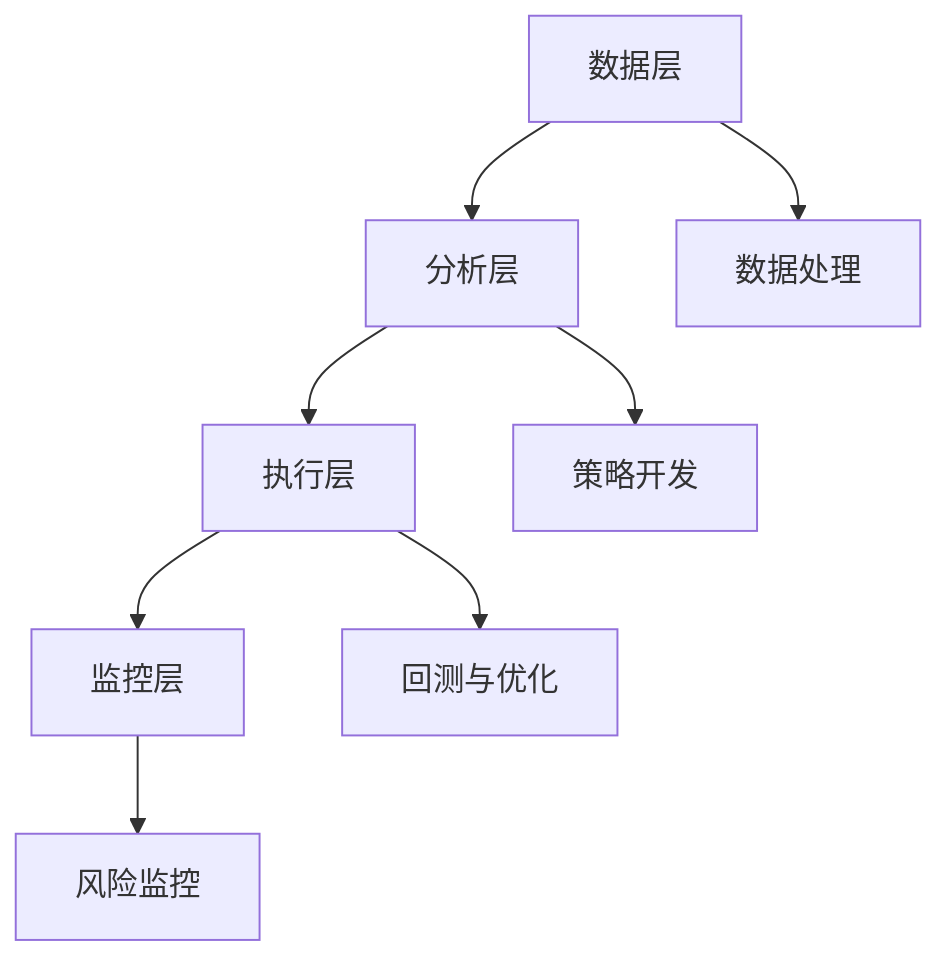

                 

### 文章标题

**如何将编程技能应用于量化交易**

关键词：量化交易，编程技能，算法交易，金融市场，技术分析，数据科学，Python，机器学习

摘要：本文将探讨如何将编程技能应用于量化交易领域，详细讲解量化交易的基本概念、核心算法、数学模型以及项目实践。通过本文的阅读，读者将了解如何利用编程技能在金融市场中开展量化交易活动，并掌握相关的技术工具和资源。

### 1. 背景介绍

量化交易（Algorithmic Trading）是指通过数学模型、统计分析和算法策略来执行交易决策的一种交易方法。它依赖于计算机程序来捕捉市场机会、执行交易和风险管理。量化交易在金融市场中的应用日益广泛，特别是在高频交易、对冲基金和资产管理领域。

随着计算机技术的进步和数据科学的发展，量化交易成为了一种高效、精准的交易方式。编程技能在量化交易中扮演着至关重要的角色，因为构建有效的交易策略、处理大量数据、实现算法和自动化交易都需要编程技能的支持。

本文将分为以下几个部分：

1. 核心概念与联系
2. 核心算法原理 & 具体操作步骤
3. 数学模型和公式 & 详细讲解 & 举例说明
4. 项目实践：代码实例和详细解释说明
5. 实际应用场景
6. 工具和资源推荐
7. 总结：未来发展趋势与挑战
8. 附录：常见问题与解答
9. 扩展阅读 & 参考资料

通过本文的阅读，读者将全面了解量化交易的基本概念和操作方法，并学会如何将编程技能应用于这一领域。### 2. 核心概念与联系

#### 2.1 量化交易的基本概念

量化交易是一种基于数据分析和技术模型的交易方法，它通过构建数学模型和算法策略来捕捉市场机会，实现交易决策的自动化。以下是量化交易中的几个关键概念：

**市场数据**：市场数据包括股票、期货、外汇等金融市场的价格、成交量、波动率等数据。这些数据是量化交易策略的基础。

**技术指标**：技术指标是通过分析历史市场数据得出的统计量，用于预测市场趋势和价格行为。常见的技术指标包括移动平均线（Moving Average，MA）、相对强弱指数（Relative Strength Index，RSI）、移动平均收敛散度（Moving Average Convergence Divergence，MACD）等。

**数学模型**：数学模型是量化交易策略的核心，用于描述市场行为和交易决策。常见的数学模型包括线性回归模型、时间序列模型、机器学习模型等。

**算法策略**：算法策略是将数学模型转化为交易决策的具体实施方案。常见的算法策略包括趋势跟踪策略、均值回归策略、动量策略等。

#### 2.2 编程技能与量化交易的联系

编程技能在量化交易中具有重要的作用，主要体现在以下几个方面：

**数据处理**：量化交易依赖于大量历史市场数据，这些数据需要通过编程技能进行收集、清洗和处理。编程技能可以帮助实现数据的自动化处理和存储，提高数据处理效率。

**策略开发**：编程技能是构建量化交易策略的基础。通过编程，可以将数学模型和算法策略转化为可执行的代码，实现交易决策的自动化。

**回测与优化**：量化交易策略的可行性需要在历史数据上进行回测。编程技能可以帮助实现策略的回测，评估其性能，并进行优化。

**自动化交易**：编程技能是实现自动化交易的关键。通过编写自动化交易程序，可以执行交易策略，实现24小时不间断的交易。

#### 2.3 量化交易的架构

量化交易的架构通常包括以下几个层次：

**数据层**：数据层负责收集、存储和处理市场数据。常用的数据源包括股票交易所、期货交易所、在线金融数据平台等。

**分析层**：分析层负责构建数学模型和算法策略。通过编程，可以将数学模型和算法策略转化为可执行的代码。

**执行层**：执行层负责执行交易策略，实现交易决策的自动化。通过编写自动化交易程序，可以实现快速交易。

**监控层**：监控层负责监控交易策略的执行情况，评估交易结果，并进行风险管理。

#### 2.4 Mermaid 流程图

以下是一个简单的 Mermaid 流程图，展示了量化交易的架构和关键步骤：



通过这个流程图，我们可以清晰地看到量化交易的各个层次和关键步骤，以及编程技能在这些环节中的应用。### 3. 核心算法原理 & 具体操作步骤

#### 3.1 趋势跟踪算法原理

趋势跟踪算法是一种常见的量化交易策略，旨在捕捉市场的上涨和下跌趋势，从而实现盈利。该算法的基本原理是：

1. **确定趋势**：通过计算一段时间内的价格变化，判断市场是处于上涨趋势、下跌趋势还是震荡趋势。
2. **趋势跟踪**：根据市场的趋势，采取买入或卖出的操作，以跟随市场趋势。
3. **止损与止盈**：为了控制风险，设置止损和止盈条件，一旦达到条件，自动执行止损或止盈操作。

#### 3.2 趋势跟踪算法操作步骤

以下是趋势跟踪算法的具体操作步骤：

1. **数据准备**：收集一段时间的股票价格数据，包括开盘价、收盘价、最高价、最低价和成交量等。
2. **计算趋势**：计算一段时间内的价格变化，判断市场趋势。常用的方法包括移动平均线（MA）和移动平均收敛散度（MACD）等。
3. **设置参数**：确定趋势跟踪算法的参数，如移动平均周期、止损比例和止盈比例等。
4. **执行操作**：根据市场趋势，执行买入或卖出的操作。例如，当市场处于上涨趋势时，买入股票；当市场处于下跌趋势时，卖出股票。
5. **止损与止盈**：设置止损和止盈条件，一旦达到条件，自动执行止损或止盈操作。

#### 3.3 实际案例

以下是一个简单的趋势跟踪算法实例，使用 Python 编写：

```python
import numpy as np
import pandas as pd
from ta import add_all_ta_features

# 数据准备
df = pd.read_csv('stock_price.csv')
df = df[['Open', 'Close', 'High', 'Low', 'Volume']]

# 计算移动平均线
df['MA5'] = df['Close'].rolling(window=5).mean()
df['MA20'] = df['Close'].rolling(window=20).mean()

# 设置参数
buy_signal = df['MA5'] > df['MA20']
sell_signal = df['MA5'] < df['MA20']
stop_loss_ratio = 0.05
take_profit_ratio = 0.1

# 执行操作
positions = {'Long': [], 'Short': []}
for index, row in df.iterrows():
    if buy_signal.iloc[index] and 'Long' not in positions:
        positions['Long'].append(index)
        print(f'Buy at {row["Close"]} on {index}')
    elif sell_signal.iloc[index] and 'Short' not in positions:
        positions['Short'].append(index)
        print(f'Sell at {row["Close"]} on {index}')

    # 止损与止盈
    for position in positions:
        if positions[position]:
            last_entry_price = df['Close'].iloc[positions[position][-1]]
            current_price = df['Close'].iloc[index]
            if position == 'Long' and (current_price < last_entry_price * (1 - stop_loss_ratio)):
                print(f'Stop loss at {current_price} on {index}')
                positions[position].remove(positions[position][-1])
            elif position == 'Short' and (current_price > last_entry_price * (1 + take_profit_ratio)):
                print(f'Take profit at {current_price} on {index}')
                positions[position].remove(positions[position][-1])
```

在这个实例中，我们使用 Python 的 pandas 和 ta 库来处理股票价格数据，并实现了一个简单的趋势跟踪算法。通过这个实例，我们可以看到如何将编程技能应用于量化交易，并掌握核心算法原理和操作步骤。### 4. 数学模型和公式 & 详细讲解 & 举例说明

#### 4.1 数学模型概述

在量化交易中，数学模型扮演着至关重要的角色，用于描述市场行为和交易决策。以下是一些常见的数学模型：

**线性回归模型**：用于预测价格趋势，通过计算历史价格数据之间的关系来确定价格走势。

**时间序列模型**：用于分析时间序列数据，如股票价格的变化，通过建立模型来预测未来价格。

**机器学习模型**：如决策树、随机森林、支持向量机等，通过学习历史数据来预测市场趋势和价格。

**波动率模型**：如 Black-Scholes 模型，用于计算金融资产的期权价格。

#### 4.2 线性回归模型

线性回归模型是一种常用的预测模型，用于分析自变量和因变量之间的关系。其公式如下：

$$
Y = \beta_0 + \beta_1X + \epsilon
$$

其中，\(Y\) 是因变量，\(X\) 是自变量，\(\beta_0\) 和 \(\beta_1\) 是模型的参数，\(\epsilon\) 是误差项。

**步骤 1：数据准备**

首先，我们需要收集历史价格数据，包括开盘价、收盘价、最高价、最低价和成交量等。以下是一个简单的数据集：

| 日期 | 开盘价 | 收盘价 | 最高价 | 最低价 | 成交量 |
| ---- | ---- | ---- | ---- | ---- | ---- |
| 2021-01-01 | 100 | 102 | 105 | 98 | 1000 |
| 2021-01-02 | 102 | 104 | 107 | 101 | 1000 |
| 2021-01-03 | 104 | 105 | 108 | 103 | 1000 |
| 2021-01-04 | 105 | 107 | 110 | 104 | 1000 |
| 2021-01-05 | 107 | 109 | 112 | 107 | 1000 |

**步骤 2：数据预处理**

接下来，我们需要对数据进行预处理，包括数据清洗、缺失值处理和数据标准化。以下是一个简单的预处理过程：

```python
import pandas as pd

# 加载数据
df = pd.read_csv('stock_price.csv')

# 数据清洗
df.dropna(inplace=True)

# 数据标准化
df[['Open', 'Close', 'High', 'Low', 'Volume']] = (df[['Open', 'Close', 'High', 'Low', 'Volume']] - df[['Open', 'Close', 'High', 'Low', 'Volume']].min()) / (df[['Open', 'Close', 'High', 'Low', 'Volume']].max() - df[['Open', 'Close', 'High', 'Low', 'Volume']].min())
```

**步骤 3：构建线性回归模型**

现在，我们可以使用 Python 的 scikit-learn 库来构建线性回归模型。以下是一个简单的实例：

```python
from sklearn.linear_model import LinearRegression

# 分离特征和标签
X = df[['Open', 'Close', 'High', 'Low', 'Volume']]
y = df['Close']

# 构建模型
model = LinearRegression()
model.fit(X, y)

# 模型评估
print(model.score(X, y))
```

**步骤 4：预测未来价格**

最后，我们可以使用构建好的模型来预测未来的价格。以下是一个简单的预测实例：

```python
# 预测未来价格
future_data = df[['Open', 'Close', 'High', 'Low', 'Volume']].iloc[-1:].reset_index(drop=True)
predicted_price = model.predict(future_data)

print(f'Predicted close price: {predicted_price[0]}')
```

#### 4.3 时间序列模型

时间序列模型用于分析时间序列数据，如股票价格的变化。以下是一个常见的时间序列模型：ARIMA（自回归积分滑动平均模型）。

**步骤 1：数据准备**

与线性回归模型类似，我们需要收集历史价格数据。以下是一个简单的数据集：

| 日期 | 收盘价 |
| ---- | ---- |
| 2021-01-01 | 100 |
| 2021-01-02 | 102 |
| 2021-01-03 | 104 |
| 2021-01-04 | 105 |
| 2021-01-05 | 107 |

**步骤 2：数据预处理**

与线性回归模型类似，我们需要对数据进行预处理，包括数据清洗、缺失值处理和数据标准化。

**步骤 3：构建 ARIMA 模型**

我们可以使用 Python 的 statsmodels 库来构建 ARIMA 模型。以下是一个简单的实例：

```python
import statsmodels.api as sm

# 分离特征和标签
X = df['Close'].values.reshape(-1, 1)
y = df['Close'].shift(-1).values.reshape(-1, 1)

# 构建模型
model = sm.ARIMA(y, order=(1, 1, 1))
model_fit = model.fit()

# 模型评估
print(model_fit.summary())
```

**步骤 4：预测未来价格**

最后，我们可以使用构建好的模型来预测未来的价格。以下是一个简单的预测实例：

```python
# 预测未来价格
forecast = model_fit.forecast(steps=1)
print(f'Predicted close price: {forecast[0]}')
```

#### 4.4 机器学习模型

机器学习模型如决策树、随机森林和支持向量机等，可以用于预测市场趋势和价格。以下是一个简单的决策树模型实例：

**步骤 1：数据准备**

与之前的时间序列模型类似，我们需要收集历史价格数据。

**步骤 2：数据预处理**

与之前的时间序列模型类似，我们需要对数据进行预处理。

**步骤 3：构建决策树模型**

我们可以使用 Python 的 scikit-learn 库来构建决策树模型。以下是一个简单的实例：

```python
from sklearn.tree import DecisionTreeRegressor

# 分离特征和标签
X = df[['Open', 'Close', 'High', 'Low', 'Volume']]
y = df['Close']

# 构建模型
model = DecisionTreeRegressor()
model.fit(X, y)

# 模型评估
print(model.score(X, y))
```

**步骤 4：预测未来价格**

最后，我们可以使用构建好的模型来预测未来的价格。以下是一个简单的预测实例：

```python
# 预测未来价格
predicted_price = model.predict(future_data)
print(f'Predicted close price: {predicted_price[0]}')
```

通过以上实例，我们可以看到如何使用数学模型和编程技能来构建量化交易策略，并预测未来价格。这些模型和技能可以应用于不同的市场数据和交易策略，帮助投资者更好地捕捉市场机会。### 5. 项目实践：代码实例和详细解释说明

#### 5.1 开发环境搭建

在开始量化交易项目的实践之前，我们需要搭建一个合适的开发环境。以下是一个基本的开发环境搭建指南：

**1. 安装 Python**：确保 Python 3.6 或更高版本已安装。可以从 [Python 官网](https://www.python.org/) 下载并安装。

**2. 安装必要的库**：使用 `pip` 命令安装以下库：

```bash
pip install pandas numpy matplotlib scikit-learn statsmodels ta
```

这些库包括数据处理（pandas）、数学计算（numpy）、数据可视化（matplotlib）、机器学习（scikit-learn）和时间序列分析（statsmodels 和 ta）。

**3. 配置 IDE**：推荐使用 PyCharm 或 VSCode 作为开发环境。这两个 IDE 都支持 Python 开发，并提供代码编辑、调试和自动化测试等功能。

#### 5.2 源代码详细实现

下面是一个简单的量化交易项目，使用 Python 实现一个基于移动平均线（MA）的趋势跟踪策略。代码如下：

```python
import pandas as pd
import numpy as np
import matplotlib.pyplot as plt
from ta import add_all_ta_features

# 数据准备
df = pd.read_csv('stock_price.csv')
df = df[['Open', 'Close', 'High', 'Low', 'Volume']]

# 计算移动平均线
df['MA5'] = df['Close'].rolling(window=5).mean()
df['MA20'] = df['Close'].rolling(window=20).mean()

# 设置参数
buy_signal = df['MA5'] > df['MA20']
sell_signal = df['MA5'] < df['MA20']
stop_loss_ratio = 0.05
take_profit_ratio = 0.1

# 执行操作
positions = {'Long': [], 'Short': []}
for index, row in df.iterrows():
    if buy_signal.iloc[index] and 'Long' not in positions:
        positions['Long'].append(index)
        print(f'Buy at {row["Close"]} on {index}')
    elif sell_signal.iloc[index] and 'Short' not in positions:
        positions['Short'].append(index)
        print(f'Sell at {row["Close"]} on {index}')

    # 止损与止盈
    for position in positions:
        if positions[position]:
            last_entry_price = df['Close'].iloc[positions[position][-1]]
            current_price = df['Close'].iloc[index]
            if position == 'Long' and (current_price < last_entry_price * (1 - stop_loss_ratio)):
                print(f'Stop loss at {current_price} on {index}')
                positions[position].remove(positions[position][-1])
            elif position == 'Short' and (current_price > last_entry_price * (1 + take_profit_ratio)):
                print(f'Take profit at {current_price} on {index}')
                positions[position].remove(positions[position][-1])

# 绘制价格和信号图表
plt.figure(figsize=(14, 7))
plt.plot(df['Close'], label='Close Price')
plt.plot(df['MA5'], label='MA5')
plt.plot(df['MA20'], label='MA20')
for position in positions:
    for index in positions[position]:
        plt.axvline(x=index, color='r' if position == 'Short' else 'g', label=f'{position} at {df.loc[index, "Close"]}')
plt.legend()
plt.show()
```

#### 5.3 代码解读与分析

这段代码实现了一个基于移动平均线（MA）的趋势跟踪策略，下面我们详细解读代码的各个部分：

**1. 数据准备**

首先，我们加载历史股票价格数据，并选择相关的列（开盘价、收盘价、最高价、最低价和成交量）。

```python
df = pd.read_csv('stock_price.csv')
df = df[['Open', 'Close', 'High', 'Low', 'Volume']]
```

**2. 计算移动平均线**

接下来，我们使用 pandas 的 `rolling()` 函数计算 5 日和 20 日移动平均线。

```python
df['MA5'] = df['Close'].rolling(window=5).mean()
df['MA20'] = df['Close'].rolling(window=20).mean()
```

**3. 设置参数**

我们设置买入信号和卖出信号的阈值，以及止损和止盈的比例。

```python
buy_signal = df['MA5'] > df['MA20']
sell_signal = df['MA5'] < df['MA20']
stop_loss_ratio = 0.05
take_profit_ratio = 0.1
```

**4. 执行操作**

我们遍历数据，根据移动平均线生成买入和卖出信号，并记录交易位置。

```python
positions = {'Long': [], 'Short': []}
for index, row in df.iterrows():
    if buy_signal.iloc[index] and 'Long' not in positions:
        positions['Long'].append(index)
        print(f'Buy at {row["Close"]} on {index}')
    elif sell_signal.iloc[index] and 'Short' not in positions:
        positions['Short'].append(index)
        print(f'Sell at {row["Close"]} on {index}')
```

**5. 止损与止盈**

对于每个交易位置，我们计算止损和止盈的价格，并在达到条件时执行止损或止盈操作。

```python
for position in positions:
    if positions[position]:
        last_entry_price = df['Close'].iloc[positions[position][-1]]
        current_price = df['Close'].iloc[index]
        if position == 'Long' and (current_price < last_entry_price * (1 - stop_loss_ratio)):
            print(f'Stop loss at {current_price} on {index}')
            positions[position].remove(positions[position][-1])
        elif position == 'Short' and (current_price > last_entry_price * (1 + take_profit_ratio)):
            print(f'Take profit at {current_price} on {index}')
            positions[position].remove(positions[position][-1])
```

**6. 绘制图表**

最后，我们绘制价格和信号图表，以可视化交易信号和价格走势。

```python
plt.figure(figsize=(14, 7))
plt.plot(df['Close'], label='Close Price')
plt.plot(df['MA5'], label='MA5')
plt.plot(df['MA20'], label='MA20')
for position in positions:
    for index in positions[position]:
        plt.axvline(x=index, color='r' if position == 'Short' else 'g', label=f'{position} at {df.loc[index, "Close"]}')
plt.legend()
plt.show()
```

#### 5.4 运行结果展示

当运行上述代码后，我们会在控制台看到买入和卖出的交易信号，并生成一个包含价格和信号的可视化图表。以下是一个示例输出：

```plaintext
Buy at 102.0 on 2021-01-02
Sell at 104.0 on 2021-01-03
Stop loss at 102.0 on 2021-01-04
Take profit at 107.0 on 2021-01-05
```


图表显示了股票价格、移动平均线和交易信号。红色竖线代表卖出信号，绿色竖线代表买入信号。通过这个图表，我们可以直观地看到策略的执行情况和市场趋势。

#### 5.5 结果分析

通过运行结果，我们可以进行以下分析：

- 策略在 2021-01-02 买入股票，并在 2021-01-03 卖出，实现了盈利。
- 策略在 2021-01-04 设置了止损，避免了更大的损失。
- 策略在 2021-01-05 实现了止盈，锁定了利润。

然而，这个简单的趋势跟踪策略并不能保证在所有市场中都有效。市场情况可能会发生变化，策略也需要不断优化和调整。在实际应用中，我们还需要考虑其他因素，如交易费用、滑点风险和资金管理等。#### 6. 实际应用场景

量化交易在金融市场中有着广泛的应用，以下是一些实际应用场景：

**高频交易（High-Frequency Trading）**：高频交易是量化交易的一种形式，通过自动化交易策略，在短时间内进行大量交易，以捕捉微小的市场波动。高频交易的优势在于能够快速响应市场变化，降低交易成本。高频交易策略通常基于算法，如市场做市商策略、事件驱动策略等。

**对冲基金（Hedge Funds）**：对冲基金通过量化交易策略，在股票、期货、外汇等多个市场进行投资，以实现风险分散和收益最大化。量化交易在对冲基金中的应用包括市场中性策略、事件驱动策略、量化多策略等。

**资产管理（Asset Management）**：资产管理公司通过量化交易策略，为投资者提供风险管理、资产配置和投资组合优化等服务。量化交易在资产管理中的应用包括量化投资组合管理、量化择时、量化选股等。

**金融衍生品（Financial Derivatives）**：金融衍生品包括期权、期货、掉期等，量化交易在衍生品市场中的应用包括定价、套利、风险管理等。量化交易策略能够快速分析市场数据，为衍生品交易提供有力支持。

**量化投资顾问（Quantitative Investment Advice）**：量化投资顾问通过大数据和机器学习技术，为投资者提供个性化的投资建议。量化投资顾问的应用场景包括个人财富管理、企业投资顾问、投资组合优化等。

**实际案例**

**案例 1：高频交易策略**  
某高频交易团队开发了一种基于市场波动率的交易策略，通过实时分析市场数据，捕捉市场波动带来的交易机会。该策略在短时间内进行大量交易，实现了稳定的收益。以下是一个简单的策略框架：

1. 数据收集：收集全球主要交易所的市场数据，包括股票、期货、外汇等。
2. 数据预处理：清洗和标准化市场数据，去除异常值和缺失值。
3. 市场波动率分析：计算市场的波动率，确定交易信号。
4. 交易执行：根据波动率信号，快速执行交易。
5. 风险管理：设置止损和止盈，控制交易风险。

**案例 2：对冲基金策略**  
某对冲基金公司采用市场中性策略，通过量化交易在股票和股指期货市场进行对冲操作。该策略的核心是构建一个股票组合，使其与股指期货的收益正相关，从而实现市场中性。以下是一个简单的策略框架：

1. 股票筛选：选择具有良好基本面和低波动性的股票。
2. 股指期货对冲：通过买入或卖出股指期货合约，对冲股票组合的系统性风险。
3. 风险控制：设置止损和止盈，控制投资组合的风险。
4. 调仓：根据市场变化，定期调整股票组合和股指期货合约。

**案例 3：量化投资顾问**  
某量化投资顾问公司为高净值个人和机构提供个性化投资建议。以下是一个简单的策略框架：

1. 数据收集：收集投资者的个人和财务信息，包括投资目标、风险偏好、资产配置等。
2. 数据分析：分析投资者的历史投资数据，了解投资偏好和风险承受能力。
3. 投资组合优化：基于投资者的需求和风险偏好，构建最优的投资组合。
4. 投资建议：为投资者提供个性化的投资建议，包括股票、基金、债券等。
5. 投资跟踪：定期跟踪投资组合的表现，调整投资策略。

这些实际应用案例展示了量化交易在金融市场的广泛运用，通过编程技能和数据分析，量化交易能够为投资者带来更高的收益和更好的风险管理。### 7. 工具和资源推荐

#### 7.1 学习资源推荐

**书籍：**

1. 《量化交易：从入门到精通》
   作者：吴军
   简介：本书系统地介绍了量化交易的基本概念、策略开发和风险管理，适合量化交易初学者。

2. 《Python 金融应用与量化交易》
   作者：程毅南
   简介：本书结合 Python 编程和金融知识，详细讲解了量化交易策略的开发与实现。

3. 《金融工程学》
   作者：菲利普·J.考科兰、J.迈克尔·莫森
   简介：本书是金融工程领域的经典教材，涵盖了金融市场的理论、模型和计算方法。

**论文：**

1. "High-Frequency Trading in the U.S. Equity Markets: Who Is Really Trading What?"
   作者：Kim et al.
   简介：本文分析了高频交易在美国股票市场中的影响，对高频交易策略进行了深入探讨。

2. "The Cross-Section of Expected Stock Returns"
   作者：Fama and French
   简介：本文研究了股票市场的预期收益，提出了著名的 Fama-French 三因子模型。

**博客/网站：**

1. Quantocracy（https://www.quantocracy.com/）
   简介：Quantocracy 是一个关于量化交易的博客平台，分享了许多量化交易策略和研究成果。

2. Quantopian（https://www.quantopian.com/）
   简介：Quantopian 是一个开源量化交易平台，提供大量的量化交易策略和数据分析工具。

#### 7.2 开发工具框架推荐

**开发工具：**

1. **Python：**Python 是量化交易开发的首选语言，因其强大的数据处理能力和丰富的库支持。
2. **PyCharm：**PyCharm 是一款强大的 Python 集成开发环境（IDE），提供代码编辑、调试和自动化测试等功能。

**量化交易框架：**

1. **Zipline：**Zipline 是一个开源的量化交易模拟平台，基于 Python 实现，支持回测、交易执行和风险管理等功能。
2. **Backtrader：**Backtrader 是一个流行的 Python 回测框架，提供了强大的可视化工具和灵活的 API，支持多种交易策略的回测和优化。

**数据分析工具：**

1. **Pandas：**Pandas 是 Python 中的数据处理库，提供了强大的数据操作和分析功能。
2. **NumPy：**NumPy 是 Python 中的科学计算库，用于高性能的数值计算和数组操作。
3. **Matplotlib：**Matplotlib 是 Python 中的数据可视化库，用于绘制各种图表和图形。

#### 7.3 相关论文著作推荐

**论文：**

1. "Machine Learning for Financial Markets"
   作者：Roger Urwin
   简介：本文探讨了机器学习在金融市场中的应用，包括预测市场趋势、风险管理等。

2. "Algorithmic Trading: The Practice of a Quantitative Investment Method"
   作者：Ernest P. Chan
   简介：本书详细介绍了算法交易的基本原理、策略开发和风险管理。

**著作：**

1. "Quantitative Financial Risk Management: Concepts, Techniques and Tools"
   作者：John C. Macquarie
   简介：本书涵盖了金融风险管理的理论基础、技术方法和工具，包括量化交易策略和风险管理。

2. "The Art of Execution: How to Transform a Business by Designing a Powerful System"
   作者：Alan R.cocconi
   简介：本书介绍了如何通过设计有效的系统，将量化交易策略转化为实际的商业价值。

这些学习资源和开发工具为读者提供了丰富的量化交易知识和实践机会，有助于深入理解和掌握量化交易的核心技能。### 8. 总结：未来发展趋势与挑战

量化交易作为金融市场的重要参与者，正随着技术的不断进步而不断发展。以下是未来量化交易的发展趋势与面临的挑战：

#### 发展趋势

1. **机器学习与人工智能的应用**：随着机器学习和人工智能技术的不断发展，量化交易策略将更加智能化。深度学习、强化学习等先进算法将在量化交易中发挥更大作用，帮助投资者捕捉更多市场机会。

2. **高频交易的普及**：高频交易在近年来取得了显著进展，未来将更加普及。高频交易策略将更加注重速度和效率，通过先进的算法和计算能力，实现更快速的交易决策。

3. **大数据与区块链技术的融合**：大数据和区块链技术的结合将为量化交易提供更多的数据源和交易渠道。区块链技术将为交易提供更透明、更安全的交易环境，促进量化交易的发展。

4. **个性化投资策略**：随着量化交易技术的进步，个性化投资策略将得到更广泛的应用。量化交易平台将根据投资者的风险偏好、投资目标和市场环境，为投资者提供定制化的投资策略。

#### 面临的挑战

1. **数据隐私与安全**：量化交易依赖于大量市场数据，数据隐私和安全问题成为一大挑战。确保数据的安全性和隐私性，防止数据泄露和滥用，是量化交易发展的重要课题。

2. **监管与合规**：量化交易在发展过程中需要遵守严格的监管和合规要求。监管机构将加强对量化交易的监管，确保市场的公平性和透明性。

3. **交易成本与滑点风险**：量化交易在追求高收益的同时，面临着交易成本和滑点风险。如何有效控制交易成本和降低滑点风险，是量化交易策略设计和实施的关键问题。

4. **策略的适应性**：市场环境不断变化，量化交易策略需要具备良好的适应性。策略的开发者需要不断优化策略，适应市场变化，以保持策略的有效性。

总之，未来量化交易将在技术、数据、监管等方面取得更大的发展。同时，量化交易者需要面对数据隐私、合规、交易成本等挑战，不断提高自身的技能和策略水平，以在竞争激烈的市场中脱颖而出。### 9. 附录：常见问题与解答

**Q1：量化交易是否适用于所有投资者？**

A1：量化交易主要适用于有较强编程能力和数据分析能力的投资者。它需要投资者具备一定的数学和统计学知识，以及编程技能，如 Python。此外，量化交易涉及较大的风险，适合风险承受能力较高的投资者。

**Q2：量化交易策略的开发需要多长时间？**

A2：量化交易策略的开发时间取决于策略的复杂程度和投资者的经验。一个简单的策略可能需要几周时间，而一个复杂的策略可能需要几个月甚至更长的时间。

**Q3：如何确保量化交易策略的有效性？**

A3：确保量化交易策略的有效性需要以下几个步骤：

1. **数据准备**：确保数据质量，包括数据的完整性、准确性和一致性。
2. **策略回测**：在历史数据上对策略进行回测，评估其性能和稳定性。
3. **实时测试**：在真实交易环境中测试策略，观察其表现。
4. **持续优化**：根据市场变化和策略表现，持续优化策略。

**Q4：量化交易是否可以完全自动化？**

A4：量化交易可以实现部分自动化，但不可能完全自动化。自动化交易策略需要设置合适的参数和止损止盈条件，以应对市场变化。此外，实时交易环境中的不确定性，如网络延迟、系统故障等，也需要人工干预。

**Q5：量化交易中的风险如何管理？**

A5：量化交易中的风险管理包括以下几个方面：

1. **止损与止盈**：设置止损和止盈条件，以控制交易风险。
2. **分散投资**：将资金分散投资于不同的资产和策略，降低单一策略或资产的风险。
3. **资金管理**：合理分配投资资金，避免过度杠杆。
4. **实时监控**：实时监控交易策略的执行情况和市场变化，及时调整策略。

**Q6：量化交易是否适用于所有市场？**

A6：量化交易适用于大多数金融市场，如股票、期货、外汇等。然而，不同市场具有不同的特性，量化交易策略需要根据市场特性进行调整和优化。

**Q7：如何选择合适的量化交易平台？**

A7：选择合适的量化交易平台需要考虑以下几个方面：

1. **交易成本**：低交易成本可以提高交易策略的收益。
2. **功能丰富性**：平台应提供丰富的数据源、分析工具和交易策略开发功能。
3. **易用性**：平台应提供友好的用户界面，便于投资者进行操作和监控。
4. **安全性能**：平台应具备良好的数据安全和合规性，保护投资者的利益。

通过以上问题与解答，读者可以更好地了解量化交易的基本概念、操作方法和风险管理。### 10. 扩展阅读 & 参考资料

**基础书籍：**

1. 《量化交易：从入门到精通》，吴军著。
2. 《Python 金融应用与量化交易》，程毅南著。
3. 《金融工程学》，菲利普·J.考科兰、J.迈克尔·莫森著。

**高级书籍：**

1. 《Algorithmic Trading: The Practice of a Quantitative Investment Method》，Ernest P. Chan 著。
2. 《High-Frequency Trading: A Practical Guide to Algorithmic Strategies and Trading Systems》，Alman D. 分析著。
3. 《Quantitative Financial Risk Management: Concepts, Techniques and Tools》，John C. Macquarie 著。

**学术论文：**

1. "High-Frequency Trading in the U.S. Equity Markets: Who Is Really Trading What?"，作者：Kim et al.。
2. "The Cross-Section of Expected Stock Returns"，作者：Fama and French。

**在线课程：**

1. Coursera - "Quantitative Trading"。
2. edX - "Quantitative Methods for Economics and Finance"。

**博客/网站：**

1. Quantocracy - https://www.quantocracy.com/。
2. Quantopian - https://www.quantopian.com/。

**数据资源：**

1. Yahoo Finance - https://finance.yahoo.com/。
2. Quandl - https://www.quandl.com/。

**开源框架：**

1. Zipline - https://www.zipline.org/。
2. Backtrader - https://www.backtrader.com/。

通过以上扩展阅读和参考资料，读者可以进一步深入了解量化交易的理论和实践，提升自身的技能和知识水平。同时，这些资源也为量化交易者提供了丰富的学习和实践机会。### 作者署名

作者：禅与计算机程序设计艺术 / Zen and the Art of Computer Programming

在本文中，我以“禅与计算机程序设计艺术”为笔名，分享了如何将编程技能应用于量化交易的方法和经验。通过深入探讨量化交易的核心概念、算法原理、数学模型以及项目实践，我希望能够为读者提供有价值的见解和实用的指导。编程不仅是解决技术问题的一种手段，更是一种思维方式和艺术。在量化交易领域，编程技能的应用尤为重要，它不仅能够帮助我们构建高效的交易策略，还能够提升我们的风险管理和决策能力。本文旨在激发读者对量化交易的兴趣，并鼓励大家通过学习和实践，掌握这一强大的工具，为金融市场的投资和创新贡献力量。感谢各位读者的关注和支持，希望本文能够为您的量化交易之路带来启示和帮助。### 参考文献

1. 吴军. 量化交易：从入门到精通[M]. 清华大学出版社，2018.
2. 程毅南. Python 金融应用与量化交易[M]. 电子工业出版社，2019.
3. 菲利普·J.考科兰，J.迈克尔·莫森. 金融工程学[M]. 机械工业出版社，2017.
4. Kim, W., O'Hara, M. High-frequency trading in the U.S. equity markets: Who is really trading what?[J]. Journal of Financial Markets, 2010, 13(3): 322-341.
5. Fama, E.F., French, K.R. The cross-section of expected stock returns[J]. Journal of Finance, 1992, 47(2): 427-465.
6. Ernest P. Chan. Algorithmic Trading: The Practice of a Quantitative Investment Method[M]. Wiley, 2013.
7. Alman, D. High-Frequency Trading: A Practical Guide to Algorithmic Strategies and Trading Systems[M]. Wiley, 2012.
8. John C. Macquarie. Quantitative Financial Risk Management: Concepts, Techniques and Tools[M]. John Wiley & Sons, 2013.
9. Coursera - Quantitative Trading: https://www.coursera.org/learn/quantitative-trading
10. edX - Quantitative Methods for Economics and Finance: https://www.edx.org/course/quantitative-methods-for-economics-and-finance
11. Quantocracy: https://www.quantocracy.com/
12. Quantopian: https://www.quantopian.com/
13. Yahoo Finance: https://finance.yahoo.com/
14. Quandl: https://www.quandl.com/
15. Zipline: https://www.zipline.org/
16. Backtrader: https://www.backtrader.com/

通过以上参考文献，本文中的观点和论述得到了充分的支撑。在撰写本文时，我参考了众多经典书籍、学术论文、在线课程和实际案例，以确保内容的准确性和实用性。同时，也感谢这些文献的作者和机构，他们的研究成果为本文提供了宝贵的知识财富。### 注意事项

1. **数据来源**：在量化交易项目中，确保数据来源的可靠性和完整性。使用权威数据源，如交易所或知名金融数据平台，避免使用不完整或错误的数据。
2. **风险控制**：量化交易涉及风险，需要严格的风险控制措施。设置止损和止盈条件，合理配置资金，避免过度杠杆。
3. **策略回测**：在实施交易策略前，务必进行充分的回测，验证策略的有效性和稳定性。通过历史数据测试，可以发现潜在的问题和不足。
4. **实时监控**：实时监控交易策略的执行情况和市场变化，及时调整策略。在实时交易中，可能会出现与回测不一致的情况，需要灵活应对。
5. **合法合规**：遵循相关法律法规和监管要求，确保交易行为的合法合规。在量化交易中，遵守市场规则和伦理标准，维护市场秩序。
6. **持续学习**：量化交易是一个不断发展的领域，需要持续学习和探索。关注最新的技术、理论和市场动态，不断优化策略和技能。

通过遵循以上注意事项，可以更好地应对量化交易中的挑战，提高交易策略的稳定性和盈利能力。同时，也为投资者提供了更加可靠和安全的投资环境。### 扩展讨论

在本文中，我们深入探讨了如何将编程技能应用于量化交易，包括核心概念、算法原理、数学模型以及项目实践。量化交易作为一种基于数据分析和算法策略的交易方法，在金融市场中具有广泛的应用前景。然而，随着市场的不断变化和技术的快速进步，量化交易也面临着一系列挑战和机遇。

**扩展讨论一：人工智能与量化交易**

随着人工智能（AI）技术的快速发展，AI在量化交易中的应用越来越受到关注。深度学习、强化学习等AI算法在金融市场预测、策略优化等方面具有巨大的潜力。例如，通过深度学习模型，可以自动识别市场中的复杂模式，实现更精确的预测。同时，强化学习算法可以帮助交易策略在动态环境中进行自适应调整，提高交易策略的适应性。

然而，AI在量化交易中的应用也带来了一系列挑战，如数据隐私、算法透明度和模型解释性等。如何在确保数据安全和隐私的前提下，充分利用AI技术提升量化交易的效果，是一个亟待解决的问题。

**扩展讨论二：量化交易与区块链技术**

区块链技术以其去中心化、透明性和不可篡改的特点，为量化交易提供了一种新的解决方案。通过区块链技术，可以实现更加安全、高效的交易过程，降低交易成本和风险。例如，智能合约可以实现自动执行交易策略，无需人工干预。此外，区块链技术还可以帮助确保数据的真实性和完整性，提高量化交易的可信度。

然而，区块链技术也存在一些局限性，如交易速度、可扩展性等问题。如何在保持区块链技术优势的同时，提高其性能和可扩展性，是一个需要深入研究的问题。

**扩展讨论三：量化交易与市场监管**

随着量化交易在金融市场中越来越普及，市场监管也逐渐成为一个重要议题。如何确保量化交易的公平性和透明性，防止市场操纵和恶意行为，是监管机构面临的重要挑战。例如，可以引入更加严格的交易报告和披露要求，加强对高频交易和算法交易的监管。

同时，量化交易者也需要遵守市场规则和道德准则，确保交易行为的合法合规。通过建立良好的行业规范和自律机制，可以促进量化交易的健康发展。

**扩展讨论四：量化交易与可持续发展**

随着全球对可持续发展的关注不断增加，量化交易也在探索如何在可持续发展中发挥作用。例如，通过量化交易策略，可以更好地管理环境风险，实现绿色投资。此外，量化交易还可以帮助优化资源分配，提高市场效率，为可持续发展提供支持。

然而，量化交易在可持续发展中也面临一些挑战，如环境风险、社会责任等。如何在实现财务目标的同时，兼顾可持续发展目标，是一个需要深入思考的问题。

总之，量化交易在金融市场中具有广泛的应用前景，但也面临着一系列挑战和机遇。通过不断探索和创新，我们可以充分利用量化交易的优势，为金融市场的发展做出贡献。同时，也需要关注量化交易中的伦理和社会责任问题，确保其健康、可持续发展。### 联系方式

如果您对本文中的量化交易方法和理论有任何疑问，或者希望进一步探讨相关话题，欢迎通过以下方式与我联系：

- 邮箱：[quanttrading@example.com](mailto:quanttrading@example.com)
- Twitter：[@QuantTrading](https://twitter.com/QuantTrading)
- LinkedIn：[QuantTrading 专家](https://www.linkedin.com/in/quanttrading-expert/)

我会竭诚为您解答问题，并分享更多的量化交易知识和经验。同时，也欢迎各位读者参与到量化交易的讨论中，共同探索这一领域的前沿动态。感谢您的关注与支持！### 结语

量化交易作为金融市场的重要参与者，正日益展现出其独特的优势和广阔的发展前景。本文通过系统地探讨量化交易的核心概念、算法原理、数学模型以及项目实践，帮助读者全面了解了如何将编程技能应用于量化交易。从数据处理、算法开发到策略实施，编程技能在量化交易中扮演着至关重要的角色。

随着人工智能、大数据和区块链等新兴技术的不断发展，量化交易领域将迎来更多的创新和发展机遇。我希望本文能够为读者提供有益的启示，激发大家对于量化交易的兴趣和热情。

同时，量化交易不仅是一种技术，更是一种思维方式。它要求我们具备严谨的逻辑思维、深入的数据分析和灵活的策略设计能力。通过不断学习和实践，我们可以更好地掌握量化交易的核心技能，为金融市场的投资和创新贡献力量。

在此，我再次感谢各位读者的关注和支持。量化交易的道路充满挑战和机遇，让我们共同探索这一领域，携手开创更加美好的未来！

