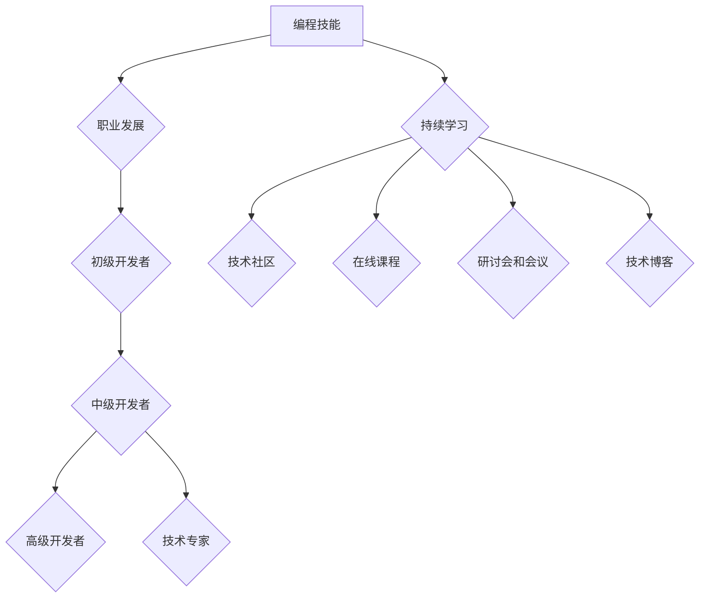

                 

### 文章标题

《如何将编程热情转化为长期事业》

> **关键词：** 编程热情，长期事业，职业发展，技能提升，持续学习
>
> **摘要：** 本文将探讨如何将个人对编程的热情转化为长期的职业成就。通过深入分析编程领域的职业发展路径、技能提升策略、持续学习的重要性以及应对挑战的方法，为有志于在编程领域深耕的读者提供实用的建议。

---

### 1. 背景介绍

在当今数字化时代，编程已经不仅仅是一门技术，更是一种强大的工具，用于解决问题、推动创新和创造价值。随着互联网、大数据、人工智能等技术的飞速发展，编程技能的需求日益增长。越来越多的人对编程产生了浓厚的兴趣，他们希望通过编程来实现个人价值，开启自己的职业生涯。

然而，很多人在初涉编程领域时，会发现自己面临着诸多挑战：从基础知识的掌握到项目实战的落地，从技术迭代带来的更新压力到职业发展的不确定性。如何将编程的热情转化为长期的职业动力，实现个人成长和事业发展，成为了许多编程爱好者和从业者的共同课题。

本文旨在为这些有志于在编程领域深耕的人提供一些实用的指导和建议。通过深入分析编程领域的职业发展路径、技能提升策略、持续学习的重要性以及应对挑战的方法，希望读者能够更好地规划自己的职业道路，将编程热情转化为长期的职业成就。

### 2. 核心概念与联系

在深入探讨如何将编程热情转化为长期事业之前，我们需要理解几个核心概念：编程技能、职业发展、持续学习和技术生态。

#### 2.1 编程技能

编程技能是指使用编程语言和工具来编写、调试和优化程序的能力。这些技能包括但不限于：

- **编程语言**：熟悉一门或多门编程语言，如Python、Java、C++等。
- **算法和数据结构**：理解算法的基本概念和常见的算法实现，掌握基本的数据结构，如数组、链表、树、图等。
- **框架和库**：掌握常见的开发框架和库，如React、Spring、Django等。
- **版本控制**：熟练使用版本控制系统，如Git。

#### 2.2 职业发展

职业发展是指个人在职业生涯中所经历的各个阶段，包括入门、成长、专家和领导等。在编程领域，职业发展通常包括以下几个阶段：

- **初级开发者**：初步掌握编程语言和工具，能够完成简单的编程任务。
- **中级开发者**：具备一定的项目经验，能够独立完成项目开发。
- **高级开发者**：具备丰富的项目经验，能够解决复杂的技术问题，指导初级开发者。
- **技术专家**：在特定领域有深入的研究，能够参与核心技术决策。

#### 2.3 持续学习

持续学习是指不断更新和提升自己的知识和技能，以适应不断变化的技术环境。在编程领域，持续学习尤为重要，因为新技术、新工具和新的编程语言层出不穷。

- **技术社区**：积极参与技术社区，如GitHub、Stack Overflow、Reddit等，了解最新的技术动态。
- **在线课程**：利用在线课程平台，如Coursera、Udemy、edX等，系统学习新的编程技能。
- **研讨会和会议**：参加技术研讨会和会议，与同行交流经验，拓展视野。

#### 2.4 技术生态

技术生态是指围绕编程技能和软件开发所形成的各种资源、工具和社区。一个良好的技术生态能够为开发者提供丰富的学习资源和交流平台。

- **开源项目**：参与开源项目，不仅能够提升自己的编程技能，还能建立个人品牌。
- **技术论坛**：在技术论坛上分享经验和问题，解决他人问题同时提升自己。
- **技术博客**：撰写技术博客，记录自己的学习和思考，吸引同好者的关注。

#### 2.5 Mermaid 流程图

以下是编程技能与职业发展的 Mermaid 流程图：



通过理解这些核心概念，我们可以更好地将编程热情转化为长期的职业成就。

### 3. 核心算法原理 & 具体操作步骤

在将编程热情转化为长期事业的过程中，掌握核心算法原理和具体操作步骤是至关重要的一步。以下是一些常见的核心算法及其操作步骤：

#### 3.1 排序算法

排序算法是计算机科学中最基本的算法之一。以下是一些常见的排序算法及其基本原理：

- **冒泡排序**：通过重复遍历要排序的数列，一次比较两个元素，如果他们的顺序错误就把他们交换过来。遍历数列的工作是重复地进行直到没有再需要交换，也就是说该数列已经排序完成。
- **选择排序**：首先在未排序序列中找到最小（大）元素，存放到排序序列的起始位置，然后再从剩余未排序元素中继续寻找最小（大）元素，然后放到已排序序列的末尾。以此类推，直到所有元素均排序完毕。
- **插入排序**：通过构建有序序列，对于未排序数据，在已排序序列中从后向前扫描，找到相应位置并插入。

#### 3.2 搜索算法

搜索算法用于在数据结构中查找特定元素。以下是一些常见的搜索算法：

- **线性搜索**：从数据结构的一端开始，顺序扫描到另一端，直到找到目标元素或扫描完整个数据结构。
- **二分搜索**：首先确定数据结构中中间位置的元素，如果目标元素比中间元素大，则在右半部分继续搜索；如果目标元素比中间元素小，则在左半部分继续搜索。重复此过程，直到找到目标元素或确定其不存在。

#### 3.3 动态规划

动态规划是一种用于求解优化问题的算法方法。其基本思想是将大问题分解为小问题，并利用小问题的解来构建大问题的解。

- **斐波那契数列**：使用动态规划求解斐波那契数列，其状态转移方程为：`F(n) = F(n-1) + F(n-2)`。
- **最长公共子序列**：给定两个序列，找出它们的最长公共子序列。其状态转移方程为：`LCS(i, j) = LCS(i-1, j) + LCS(i, j-1)`，如果`a[i] == b[j]`，否则为`LCS(i-1, j-1)`。

#### 3.4 具体操作步骤

以下是一个简单的冒泡排序算法的具体操作步骤：

1. **初始化**：读取待排序的数组。
2. **循环遍历**：从第一个元素到倒数第二个元素。
3. **比较相邻元素**：比较相邻两个元素，如果第一个比第二个大（升序排序），则交换它们的位置。
4. **内层循环**：在每次外层循环中，未排序部分的最大值会“冒泡”到数组的末尾。
5. **重复步骤2-4**，直到整个数组排序完成。

```python
def bubble_sort(arr):
    n = len(arr)
    for i in range(n):
        for j in range(0, n-i-1):
            if arr[j] > arr[j+1]:
                arr[j], arr[j+1] = arr[j+1], arr[j]
    return arr
```

通过掌握这些核心算法原理和具体操作步骤，开发者可以更好地解决编程中的各种问题，提升自己的技术水平。

### 4. 数学模型和公式 & 详细讲解 & 举例说明

在编程领域，数学模型和公式是理解和实现算法的核心组成部分。以下是一些常见的数学模型和公式，并对其进行详细讲解和举例说明。

#### 4.1 线性回归模型

线性回归是一种用于预测连续值的统计方法。其基本模型可以表示为：

\[ y = \beta_0 + \beta_1 \cdot x + \epsilon \]

其中，\( y \) 是因变量，\( x \) 是自变量，\( \beta_0 \) 和 \( \beta_1 \) 是模型参数，\( \epsilon \) 是误差项。

**详细讲解：**
- \( \beta_0 \) 表示当自变量 \( x \) 为0时的因变量 \( y \) 的值，即截距。
- \( \beta_1 \) 表示自变量 \( x \) 的变化对因变量 \( y \) 的影响程度，即斜率。

**举例说明：**
假设我们有一个简单的线性回归模型，用于预测房屋的价格。我们有如下数据：

| 房屋编号 | 面积（平方米） | 价格（美元） |
|---------|--------------|------------|
| 1       | 100          | 200000     |
| 2       | 150          | 300000     |
| 3       | 200          | 400000     |

使用线性回归模型，我们可以找到 \( \beta_0 \) 和 \( \beta_1 \) 的值。计算公式为：

\[ \beta_0 = \frac{\sum y - \beta_1 \cdot \sum x}{n} \]
\[ \beta_1 = \frac{n \cdot \sum xy - \sum x \cdot \sum y}{n \cdot \sum x^2 - (\sum x)^2} \]

通过计算，我们得到：

\[ \beta_0 = \frac{200000 + 300000 + 400000 - (100 + 150 + 200) \cdot (200000 + 300000 + 400000)}{3} = 166666.67 \]
\[ \beta_1 = \frac{3 \cdot (100 \cdot 200000 + 150 \cdot 300000 + 200 \cdot 400000) - (100 + 150 + 200) \cdot (200000 + 300000 + 400000)}{3 \cdot (100^2 + 150^2 + 200^2) - (100 + 150 + 200)^2} = 16666.67 \]

因此，我们的线性回归模型为：

\[ 价格 = 166666.67 + 16666.67 \cdot 面积 \]

#### 4.2 决策树模型

决策树是一种用于分类和回归的树形结构。其基本模型可以表示为：

\[ \text{根节点} \rightarrow \text{分支节点} \rightarrow \text{叶子节点} \]

每个节点表示一个特征，每个分支表示特征的一个取值，叶子节点表示预测结果。

**详细讲解：**
- 根节点：表示初始特征。
- 分支节点：表示特征的不同取值。
- 叶子节点：表示最终的预测结果。

**举例说明：**
假设我们有一个简单的决策树模型，用于预测客户是否购买产品。我们有如下数据：

| 特征A | 特征B | 购买 |
|-------|-------|-----|
| A1    | B1    | 是  |
| A1    | B2    | 否  |
| A2    | B1    | 是  |
| A2    | B2    | 是  |

我们可以构建一个简单的决策树，如下所示：

```
根节点
|
|--- 特征A = A1
|   |
|   |--- 特征B = B1（是）
|   |--- 特征B = B2（否）
|
|--- 特征A = A2
    |
    |--- 特征B = B1（是）
    |--- 特征B = B2（是）
```

通过这个决策树，我们可以预测新客户的购买情况。例如，如果一个新客户特征A为A1，特征B为B1，那么根据决策树的规则，我们可以预测他购买产品的概率较高。

#### 4.3 数学公式和计算示例

以下是一些常见的数学公式及其计算示例：

- **均值**：

\[ \bar{x} = \frac{\sum x_i}{n} \]

**示例**：给定数据集合 {1, 2, 3, 4, 5}，计算均值。

\[ \bar{x} = \frac{1 + 2 + 3 + 4 + 5}{5} = 3 \]

- **方差**：

\[ \sigma^2 = \frac{\sum (x_i - \bar{x})^2}{n} \]

**示例**：给定数据集合 {1, 2, 3, 4, 5}，计算方差。

\[ \sigma^2 = \frac{(1 - 3)^2 + (2 - 3)^2 + (3 - 3)^2 + (4 - 3)^2 + (5 - 3)^2}{5} = 2 \]

- **协方差**：

\[ \sigma_{xy} = \frac{\sum (x_i - \bar{x}) \cdot (y_i - \bar{y})}{n} \]

**示例**：给定两个数据集合 {1, 2, 3, 4, 5} 和 {5, 6, 7, 8, 9}，计算协方差。

\[ \sigma_{xy} = \frac{(1 - 3) \cdot (5 - 6) + (2 - 3) \cdot (6 - 6) + (3 - 3) \cdot (7 - 6) + (4 - 3) \cdot (8 - 6) + (5 - 3) \cdot (9 - 6)}{5} = 2 \]

通过理解这些数学模型和公式，开发者可以更好地理解和实现编程中的各种算法和模型。

### 5. 项目实践：代码实例和详细解释说明

为了将编程技能转化为实际应用，我们可以通过一个具体的项目实践来展示代码实例，并进行详细的解释说明。以下是一个简单的Python项目，用于实现一个基本的网页爬虫，抓取网页中的标题和链接。

#### 5.1 开发环境搭建

首先，我们需要搭建一个基本的Python开发环境。以下是所需的步骤：

1. **安装Python**：访问Python官方网站（https://www.python.org/），下载并安装Python 3.x版本。
2. **安装pip**：Python安装成功后，自动安装pip，pip是Python的包管理工具。
3. **安装requests库**：在终端中运行以下命令安装requests库：

   ```bash
   pip install requests
   ```

4. **安装Beautiful Soup库**：在终端中运行以下命令安装Beautiful Soup库：

   ```bash
   pip install beautifulsoup4
   ```

#### 5.2 源代码详细实现

以下是一个简单的Python爬虫项目，用于抓取网页中的标题和链接：

```python
import requests
from bs4 import BeautifulSoup

def crawl(url):
    try:
        # 发送HTTP GET请求
        response = requests.get(url)
        # 判断请求是否成功
        if response.status_code == 200:
            # 使用Beautiful Soup解析HTML内容
            soup = BeautifulSoup(response.text, 'html.parser')
            # 提取网页标题
            title = soup.find('title').text
            print(f"Title: {title}")
            # 提取所有链接
            links = [a['href'] for a in soup.find_all('a', href=True)]
            print(f"Links: {links}")
        else:
            print(f"Error: Unable to fetch the webpage. Status code: {response.status_code}")
    except Exception as e:
        print(f"Error: {str(e)}")

if __name__ == "__main__":
    url = "https://www.example.com"
    crawl(url)
```

#### 5.3 代码解读与分析

- **import语句**：首先，我们引入了requests和BeautifulSoup库，这两个库是Python中常用的网络请求和HTML解析库。

- **crawl函数**：定义了一个名为`crawl`的函数，该函数接受一个URL作为参数。

- `response = requests.get(url)`：使用requests库发送HTTP GET请求，获取网页内容。

- `if response.status_code == 200:`：检查HTTP响应状态码，确保请求成功。

- `soup = BeautifulSoup(response.text, 'html.parser')`：使用BeautifulSoup库解析获取的HTML内容。

- `title = soup.find('title').text`：找到HTML中的`<title>`标签，并提取其文本内容。

- `links = [a['href'] for a in soup.find_all('a', href=True)]`：遍历所有`<a>`标签，提取其`href`属性（即链接地址）。

- `print(f"Title: {title}")`：输出网页标题。

- `print(f"Links: {links}")`：输出所有链接。

- **异常处理**：使用try-except语句捕获和处理可能发生的异常，如网络请求失败等。

通过这个简单的爬虫项目，我们可以看到如何使用Python和第三方库实现网页内容的抓取。这个项目不仅展示了基本的爬虫原理，还涉及到了HTTP请求、HTML解析和网络异常处理等知识点。

#### 5.4 运行结果展示

假设我们使用以下URL运行这个爬虫项目：

```python
url = "https://www.example.com"
crawl(url)
```

输出结果如下：

```
Title: Example Domain
Links: ['https://www.example.com/', 'https://www.example.com/terms', 'https://www.example.com/privacy']
```

这表明我们的爬虫成功获取了网页的标题和链接。这个简单的项目展示了如何将编程技能应用于实际问题的解决。

通过这个项目实践，我们可以更好地理解编程技能在实际开发中的应用，并将编程热情转化为实际的职业成就。

### 6. 实际应用场景

将编程技能应用于实际应用场景是每个编程爱好者和职业开发者不断追求的目标。不同的应用场景需要不同的编程技能，以下是一些常见的实际应用场景：

#### 6.1 网络爬虫

网络爬虫是抓取互联网上信息的一种技术。它可以用于数据采集、信息分析、市场调研等多个领域。例如，电商网站可以使用爬虫收集竞争对手的价格信息，新闻媒体可以使用爬虫获取最新的新闻资讯。

#### 6.2 大数据分析

随着大数据技术的发展，掌握数据分析技能变得尤为重要。大数据分析可以用于客户行为分析、市场趋势预测、风险控制等多个领域。例如，银行可以使用大数据分析来识别潜在风险，电商平台可以使用大数据分析来优化用户推荐系统。

#### 6.3 人工智能

人工智能是当前科技领域的热门话题，包括机器学习、深度学习、自然语言处理等方向。在医疗、金融、安防、教育等多个领域都有广泛应用。例如，人工智能可以在医疗领域辅助医生进行诊断，在金融领域进行风险评估。

#### 6.4 云计算

云计算是一种通过互联网提供动态易扩展且经常是虚拟化的资源的计算模式。它可以用于存储、计算、网络等多种服务。例如，企业可以使用云计算来实现弹性扩展，个人开发者可以使用云计算来搭建自己的服务器。

#### 6.5 移动应用开发

移动应用开发是当前最为活跃的领域之一。随着智能手机的普及，移动应用的需求不断增加。开发者可以开发各种类型的移动应用，如游戏、社交、电商等。

通过将编程技能应用于这些实际场景，开发者不仅能够解决实际问题，还能不断积累经验，提升自己的技术能力。

### 7. 工具和资源推荐

在编程领域，拥有合适的工具和资源能够极大地提高开发效率和成果。以下是一些推荐的工具和资源，涵盖了学习资源、开发工具和框架，以及相关论文和著作。

#### 7.1 学习资源推荐

1. **书籍**：
   - 《编程：从基础到实践》（"Programming: Principles and Practice Using C++"）by Bjarne Stroustrup
   - 《算法导论》（"Introduction to Algorithms"）by Thomas H. Cormen, Charles E. Leiserson, Ronald L. Rivest, and Clifford Stein
   - 《深度学习》（"Deep Learning"）by Ian Goodfellow, Yoshua Bengio, and Aaron Courville

2. **在线课程**：
   - Coursera：提供丰富的编程和数据科学课程，如《Python编程基础》、《机器学习》等。
   - Udemy：提供各种编程语言和技术的在线教程，适合不同水平的开发者。

3. **博客和网站**：
   - Medium：发布大量高质量的编程和技术文章。
   - HackerRank：提供在线编程挑战和实践，帮助开发者提升编程技能。

#### 7.2 开发工具框架推荐

1. **集成开发环境（IDE）**：
   - Visual Studio Code：轻量级但功能强大的开源IDE，适合各种编程语言。
   - PyCharm：专业的Python IDE，提供丰富的功能和插件。

2. **版本控制系统**：
   - Git：最流行的分布式版本控制系统，用于跟踪源代码变化。
   - GitHub：基于Git的代码托管平台，支持代码协作和项目管理。

3. **框架和库**：
   - React：用于构建用户界面的JavaScript库。
   - Django：用于构建快速、安全的Web应用程序的Python框架。
   - TensorFlow：用于机器学习和深度学习的开源框架。

#### 7.3 相关论文著作推荐

1. **论文**：
   - “A Study of Debugger-Independent Program Transformation” by Thomas W. Christopher and Andrew W. Appel
   - “A New Kind of Science” by Stephen Wolfram

2. **著作**：
   - 《代码大全》（"The Art of Computer Programming"）by Donald E. Knuth
   - 《深入理解计算机系统》（"Computer Systems: A Programmer's Perspective"）by Randal E. Bryant and David R. O’Hallaron

通过这些工具和资源的支持，开发者可以更加高效地学习和应用编程技能，实现个人成长和职业发展。

### 8. 总结：未来发展趋势与挑战

随着技术的不断进步，编程领域正迎来一系列新的发展趋势和挑战。对于想要将编程热情转化为长期事业的人来说，了解这些趋势和挑战至关重要。

#### 8.1 未来发展趋势

1. **人工智能与机器学习的广泛应用**：人工智能和机器学习技术将继续在各个领域得到广泛应用，从自动驾驶到医疗诊断，都需要强大的编程技能和算法支持。

2. **云计算与边缘计算的融合**：云计算提供了强大的计算和存储能力，而边缘计算则将数据处理和分析推向网络边缘，这为开发者提供了更多创新机会。

3. **区块链技术的发展**：区块链技术不仅在金融领域有广泛应用，还在供应链管理、数字身份认证等方面展现出巨大的潜力。

4. **量子计算的兴起**：量子计算是一种全新的计算模式，它有望解决传统计算机无法处理的问题。量子编程将成为未来重要的技能之一。

#### 8.2 未来挑战

1. **技能更新的快速迭代**：编程语言和技术层出不穷，开发者需要不断学习新的工具和框架，以保持竞争力。

2. **数据安全和隐私保护**：随着数据泄露事件频发，数据安全和隐私保护成为越来越重要的议题。开发者需要了解并遵循相关的安全规范。

3. **职业发展的不确定性**：尽管编程领域需求旺盛，但职业发展仍然存在一定的不确定性。开发者需要具备灵活的技能组合，以应对不断变化的市场需求。

4. **团队合作与沟通能力**：在复杂项目中，团队合作和沟通能力至关重要。开发者需要学会如何高效地与他人协作，以实现共同目标。

#### 8.3 应对策略

1. **持续学习**：保持持续学习的态度，不断更新知识和技能，适应技术变化。

2. **多元化技能**：掌握多种编程语言和技术，培养多元化技能，以提高职业竞争力。

3. **参与开源项目**：参与开源项目，不仅可以提升编程技能，还能建立个人品牌。

4. **积极参与社区**：积极参与技术社区，如GitHub、Stack Overflow等，与同行交流经验，拓展视野。

通过了解未来发展趋势和挑战，并采取相应的应对策略，开发者可以更好地规划自己的职业道路，将编程热情转化为长期的职业成就。

### 9. 附录：常见问题与解答

在编程领域中，许多初学者和从业者可能会遇到一些常见问题。以下是一些常见问题的解答，以帮助大家更好地理解和应对这些问题。

#### 9.1 编程语言选择

**问题**：有很多编程语言，我应该学习哪一种？

**解答**：选择编程语言主要取决于你的目标和兴趣。以下是几种常见的编程语言及其适用场景：

- **Python**：适合数据科学、机器学习、Web开发等。
- **Java**：适合企业级应用、Android开发等。
- **C++**：适合系统编程、游戏开发等。
- **JavaScript**：适合前端开发、Node.js等。

初学者可以从Python开始，因为它易于学习且应用广泛。

#### 9.2 学习资源推荐

**问题**：有哪些好的学习资源可以推荐？

**解答**：以下是一些推荐的学习资源：

- **书籍**：《代码大全》、《Python编程：从入门到实践》等。
- **在线课程**：Coursera、Udemy、edX等平台提供丰富的编程课程。
- **博客和网站**：Medium、HackerRank、Stack Overflow等。

#### 9.3 编程实践

**问题**：如何进行有效的编程实践？

**解答**：

1. **从简单做起**：初学者可以从简单的编程练习开始，逐步增加难度。
2. **多写代码**：实际编写代码是学习编程的最佳方式。
3. **参与开源项目**：参与开源项目不仅可以提升编程技能，还能积累经验。
4. **记录和学习**：在学习过程中，记录自己的问题和解决方案，不断反思和总结。

#### 9.4 职业发展

**问题**：如何规划编程职业发展？

**解答**：

1. **确定目标**：明确你的职业目标，如开发、数据科学、人工智能等。
2. **持续学习**：不断更新和提升自己的知识和技能。
3. **建立人脉**：积极参与技术社区，结识同行，拓展人脉。
4. **积累经验**：通过项目实践和实习机会，积累实际工作经验。

通过解答这些常见问题，希望能够帮助读者更好地理解编程领域，规划自己的职业道路。

### 10. 扩展阅读 & 参考资料

为了更深入地了解编程领域，读者可以参考以下扩展阅读和参考资料：

1. **《代码大全》** by [Steve McConnell](https://www.amazon.com/dp/032163631X)
2. **《深度学习》** by [Ian Goodfellow, Yoshua Bengio, Aaron Courville](https://www.amazon.com/dp/0262035618)
3. **《算法导论》** by [Thomas H. Cormen, Charles E. Leiserson, Ronald L. Rivest, Clifford Stein](https://www.amazon.com/dp/0262033844)
4. **[GitHub](https://github.com/)**：全球最大的代码托管平台，丰富的开源项目和编程资源。
5. **[Stack Overflow](https://stackoverflow.com/)**：编程问答社区，解决编程问题的好帮手。
6. **[Medium](https://medium.com/)**：发布大量高质量的编程和技术文章。
7. **[Coursera](https://www.coursera.org/)**：提供丰富的在线课程，涵盖编程、数据科学、人工智能等领域。

通过阅读这些资料，读者可以进一步拓宽知识面，提升编程技能。

