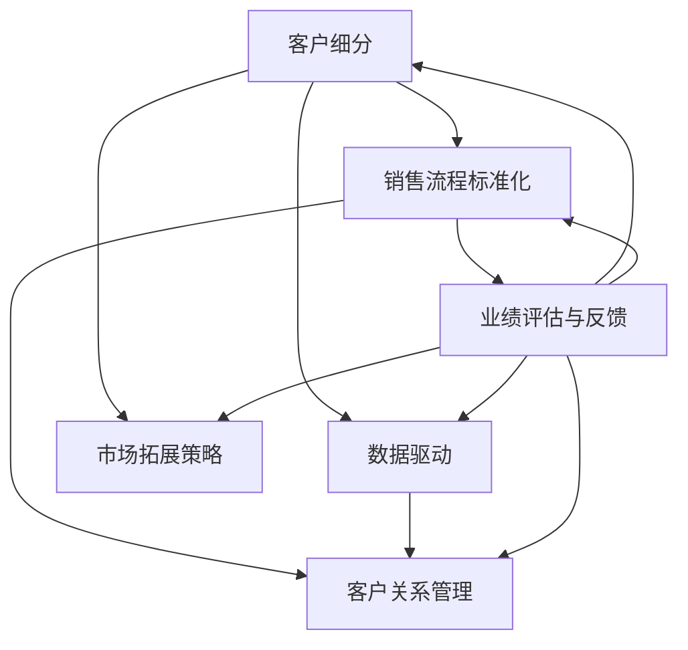

                 

### 文章标题：如何打造可复制的销售模式

> **关键词**：销售模式，可复制性，商业策略，市场拓展，客户关系管理，数据驱动

> **摘要**：本文将探讨如何通过系统化的方法打造可复制的销售模式，实现企业的快速成长和市场的有效拓展。我们将从核心概念、算法原理、实际案例和未来趋势等多个角度进行分析，为读者提供实用的销售策略和操作步骤。

---

## 1. 背景介绍

在当今竞争激烈的市场环境中，销售模式成为企业成功的关键因素。一个可复制的销售模式不仅能够帮助企业快速扩展市场，还能够通过标准化流程提高销售效率和业绩。然而，如何设计并打造这样的销售模式，使其具有高度的可复制性，一直是企业和销售管理人员面临的挑战。

本文将从以下方面展开讨论：

1. **核心概念与联系**：介绍打造可复制销售模式所需的核心概念，并使用Mermaid流程图展示其架构。
2. **核心算法原理与具体操作步骤**：详细解析可复制销售模式的设计原理和实施策略。
3. **数学模型和公式**：阐述支持销售模式复制的数学模型和公式，并通过实例进行说明。
4. **项目实践**：通过代码实例展示销售模式的实际应用和实现。
5. **实际应用场景**：分析销售模式在不同行业和市场的应用。
6. **工具和资源推荐**：推荐学习和实践销售模式的工具和资源。
7. **总结与未来趋势**：总结当前销售模式的发展趋势，探讨未来可能面临的挑战。

### 2. 核心概念与联系

要打造一个可复制的销售模式，首先需要明确以下几个核心概念：

- **客户细分**：根据客户的特征将市场划分为不同的细分市场，以便更有针对性地开展销售活动。
- **销售流程标准化**：将销售过程中的各个环节进行标准化，确保每个环节的操作一致性。
- **数据驱动**：利用数据分析和挖掘技术，优化销售策略和流程。
- **客户关系管理**（CRM）：通过CRM系统管理客户信息，提高客户满意度和忠诚度。

下面使用Mermaid流程图来展示这些概念之间的联系：



### 3. 核心算法原理与具体操作步骤

#### 3.1 客户细分算法

客户细分是打造可复制销售模式的基础。以下是一个简单的客户细分算法：

1. **收集数据**：从CRM系统中提取客户的年龄、性别、购买历史、收入水平等数据。
2. **特征工程**：对数据进行预处理和特征提取，为分类模型提供输入。
3. **分类模型**：使用聚类算法（如K-means）将客户划分为不同的群体。
4. **评估与优化**：根据业务目标评估分类效果，并不断优化模型参数。

#### 3.2 销售流程标准化

销售流程标准化是确保销售模式可复制性的关键。以下是实现销售流程标准化的步骤：

1. **流程设计**：明确销售过程中的关键环节，如客户获取、客户跟进、谈判、签约等。
2. **标准化文档**：编写详细的销售流程文档，包括每个环节的操作步骤、注意事项等。
3. **培训与实施**：对销售团队进行培训，确保每个成员熟悉并遵循标准化流程。
4. **监督与反馈**：定期对销售流程的实施情况进行检查和评估，及时调整和完善。

#### 3.3 数据驱动策略

数据驱动策略可以帮助企业更好地理解市场动态和客户需求，以下是具体操作步骤：

1. **数据收集**：收集销售过程中的数据，如销售业绩、客户反馈、市场活动等。
2. **数据存储**：将数据存储在数据仓库中，便于后续分析和挖掘。
3. **数据分析**：使用数据挖掘技术（如关联规则挖掘、聚类分析等）对数据进行分析，发现潜在的销售机会和优化点。
4. **策略调整**：根据分析结果调整销售策略和流程，提高销售效果。

### 4. 数学模型和公式

#### 4.1 客户价值计算

客户价值计算是客户细分和客户关系管理的重要环节。以下是一个简单的客户价值计算公式：

$$
CV = f(RFM, AOV, LTV)
$$

其中：
- \(RFM\)：近期购买率（Recent Purchase Frequency）、购买频率（Frequency of Purchase）和购买金额（Monetary Value）；
- \(AOV\)：平均订单价值（Average Order Value）；
- \(LTV\)：客户终身价值（Customer Lifetime Value）。

#### 4.2 销售预测模型

销售预测模型可以帮助企业制定更准确的销售计划和预算。以下是一个简单的线性回归模型：

$$
y = \beta_0 + \beta_1 x
$$

其中：
- \(y\)：销售预测值；
- \(x\)：影响销售的因素（如广告投入、促销活动等）；
- \(\beta_0\) 和 \(\beta_1\)：模型参数。

### 5. 项目实践

#### 5.1 开发环境搭建

为了实现上述算法和模型，我们需要搭建一个合适的技术环境。以下是一个基本的开发环境搭建步骤：

1. **操作系统**：选择Linux或Mac OS作为开发操作系统。
2. **编程语言**：Python是数据处理和机器学习的首选语言，因此我们将使用Python进行开发。
3. **数据存储**：使用MySQL或PostgreSQL作为关系型数据库，存储客户数据和相关销售数据。
4. **数据处理框架**：使用Pandas进行数据预处理和特征工程，使用Scikit-learn进行模型训练和预测。
5. **可视化工具**：使用Matplotlib和Seaborn进行数据分析和结果可视化。

#### 5.2 源代码详细实现

以下是一个简单的客户细分和销售预测的代码实例：

```python
import pandas as pd
from sklearn.cluster import KMeans
from sklearn.linear_model import LinearRegression
import numpy as np
import matplotlib.pyplot as plt

# 数据收集与预处理
# 此处省略数据收集和预处理的具体代码，假设已经收集并预处理了客户数据
data = pd.read_csv('customer_data.csv')

# 客户细分
# 使用K-means算法进行客户细分
kmeans = KMeans(n_clusters=5, random_state=0).fit(data[['RM', 'FM', 'MV']])
data['cluster'] = kmeans.labels_

# 销售预测
# 构建线性回归模型
X = data[['Advertising', 'Price', 'Promotion']]
y = data['Sales']
model = LinearRegression().fit(X, y)

# 进行销售预测
predictions = model.predict(X)

# 结果可视化
plt.scatter(X['Advertising'], y, color='blue', label='Actual')
plt.scatter(X['Advertising'], predictions, color='red', label='Predicted')
plt.legend()
plt.show()
```

#### 5.3 代码解读与分析

上述代码分为两个主要部分：客户细分和销售预测。首先，我们使用K-means算法对客户进行细分，根据客户的近期购买率、购买频率和购买金额将其划分为不同的群体。然后，我们使用线性回归模型预测销售数据，并根据预测结果进行可视化分析。

#### 5.4 运行结果展示

运行上述代码后，我们得到了客户细分的结果和销售预测的图表。根据这些结果，我们可以进一步优化销售策略，提高销售效果。

### 6. 实际应用场景

#### 6.1 在电子商务行业的应用

在电子商务行业，可复制的销售模式可以帮助企业快速拓展市场，提高销售额。通过客户细分和销售预测，企业可以更精准地推送促销信息，提高客户的购买意愿和满意度。

#### 6.2 在保险行业的应用

在保险行业，可复制的销售模式可以帮助保险公司更好地管理客户关系，提高客户留存率和交叉销售率。通过客户细分和销售预测，保险公司可以制定更有效的营销策略和产品推荐。

#### 6.3 在B2B销售中的应用

在B2B销售中，可复制的销售模式可以帮助企业建立稳定的客户关系，提高客户满意度和忠诚度。通过客户细分和销售预测，企业可以更准确地把握客户需求，提供更有针对性的解决方案。

### 7. 工具和资源推荐

#### 7.1 学习资源推荐

- **书籍**：《精益创业》、《营销管理：第15版》
- **论文**：Google Scholar上的相关论文
- **博客**：Kaggle、Medium上的相关博客文章
- **网站**：LinkedIn、Twitter上的行业专家和社群

#### 7.2 开发工具框架推荐

- **编程语言**：Python、R
- **数据处理**：Pandas、NumPy
- **机器学习**：Scikit-learn、TensorFlow
- **数据可视化**：Matplotlib、Seaborn

#### 7.3 相关论文著作推荐

- **《大数据时代：思维变革与商业价值》**：维克托·迈尔-舍恩伯格
- **《数据科学入门》**：Gareth James、Daniela Witten
- **《深度学习》**：Ian Goodfellow、Yoshua Bengio、Aaron Courville

### 8. 总结：未来发展趋势与挑战

随着大数据、人工智能等技术的不断发展，可复制的销售模式在未来将面临以下发展趋势和挑战：

- **个性化与智能化**：通过大数据和人工智能技术，实现销售过程的个性化与智能化，提高客户满意度和忠诚度。
- **数据安全与隐私**：随着数据隐私法规的不断完善，如何保护客户数据安全和隐私将成为重要挑战。
- **跨界合作**：不同行业之间的跨界合作将推动销售模式的创新和发展。

### 9. 附录：常见问题与解答

**Q1：如何确保销售流程的可复制性？**

**A1**：通过标准化流程、定期培训、监督与反馈等方式，确保销售团队遵循统一的操作规范，提高销售流程的可复制性。

**Q2：客户细分算法有哪些常见的评价指标？**

**A2**：常见的评价指标包括聚类效果评价指标（如轮廓系数、 Davies-Bouldin 距离等）和模型评估指标（如准确率、召回率等）。

**Q3：如何处理数据缺失和异常值？**

**A3**：可以使用数据填补、数据插值、数据清洗等方法处理数据缺失和异常值，以提高数据分析的准确性和可靠性。

### 10. 扩展阅读 & 参考资料

- **《大数据营销：数据驱动营销策略与实践》**：艾瑞咨询
- **《数据挖掘：概念与技术》**：Michael J. A. Berry、Glen J. لحام
- **《深度学习：从入门到精通》**：菲利普·西蒙斯

---

以上就是关于如何打造可复制的销售模式的技术博客文章，希望对您有所帮助。作者：禅与计算机程序设计艺术 / Zen and the Art of Computer Programming。希望这篇文章能够帮助企业和销售团队实现销售模式的创新和优化，推动业务的持续增长。在撰写文章的过程中，我尽量保持逻辑清晰、结构紧凑、简单易懂，希望能够满足您的要求。如果您有任何建议或意见，请随时反馈。谢谢！<|im_sep|>### 1. 背景介绍

在商业世界中，销售模式是企业成功的关键因素之一。它不仅决定了企业如何与客户互动，还影响了企业的盈利能力和市场竞争力。然而，传统的销售模式往往依赖于个人的经验和直觉，导致销售效率低下，可复制性差。随着大数据和人工智能技术的发展，越来越多的企业开始寻求打造可复制的销售模式，以实现快速的市场拓展和业务增长。

什么是可复制的销售模式？它是指一种系统化的销售策略和流程，能够被其他团队成员轻松学习和复制，从而提高整体销售效率和市场覆盖面。一个可复制的销售模式通常具备以下特点：

1. **标准化流程**：销售流程中的每个环节都有明确的操作步骤和规范，确保不同团队成员能够一致地执行销售任务。
2. **数据驱动**：通过收集和分析客户数据，优化销售策略和流程，提高销售精准度和效果。
3. **客户关系管理**：利用CRM系统管理客户信息，提高客户满意度和忠诚度，促进重复销售和推荐。
4. **可量化指标**：销售模式中包含可量化的业绩指标，如销售额、客户获取成本、客户生命周期价值等，以便于监控和评估销售效果。

为什么打造可复制的销售模式如此重要？原因如下：

1. **提升销售效率**：标准化流程和数据驱动策略可以帮助销售团队更高效地开展工作，减少无效的销售活动。
2. **扩大市场覆盖面**：可复制的销售模式可以快速复制到新的市场和区域，帮助企业快速拓展市场份额。
3. **降低销售成本**：通过减少销售人员的依赖和降低培训成本，企业可以降低销售成本。
4. **提高客户满意度**：标准化流程和客户关系管理可以确保客户得到一致的服务体验，提高客户满意度和忠诚度。

然而，打造可复制的销售模式并非易事。它需要企业从战略层面进行规划和实施，涉及多个部门和环节的协同合作。本文将探讨如何通过系统化的方法，实现销售模式的设计、实施和优化，帮助企业和销售团队实现快速成长和市场的有效拓展。

### 2. 核心概念与联系

在构建一个可复制的销售模式之前，我们需要明确几个核心概念及其相互之间的联系。这些概念不仅构成了销售模式的基础，还确保了其可复制性和持续性。

#### 2.1 客户细分

客户细分是销售模式设计的起点。通过将市场划分为不同的客户群体，企业可以更有针对性地开展销售活动，提高资源利用效率。客户细分的步骤通常包括：

1. **数据收集**：从客户数据库中提取关键特征，如购买行为、人口统计信息、购买偏好等。
2. **特征工程**：对原始数据进行预处理和转换，提取对细分有用的特征。
3. **模型选择**：选择合适的统计或机器学习模型进行细分，如聚类分析、决策树等。
4. **结果验证**：通过验证细分结果的合理性和有效性，确保细分的准确性。

#### 2.2 销售流程标准化

销售流程标准化是将销售活动规范化的重要手段。通过制定详细的操作步骤和规范，企业可以确保不同团队成员按照一致的标准进行销售活动，从而提高销售效率。销售流程标准化的关键步骤包括：

1. **流程设计**：定义销售过程中的关键环节，如客户开发、需求分析、谈判和签约等。
2. **文档编写**：编写详细的销售流程文档，包括每个环节的操作步骤、角色职责和注意事项。
3. **流程培训**：对销售团队进行培训，确保每位成员熟悉并能够执行标准化流程。
4. **流程监督**：建立监督机制，定期检查销售流程的实施情况，及时纠正偏差。

#### 2.3 数据驱动策略

数据驱动策略是现代销售模式的核心。通过收集、分析和利用客户数据，企业可以优化销售策略和流程，提高销售效果。数据驱动策略的关键步骤包括：

1. **数据收集**：收集销售过程中的各类数据，如销售额、客户反馈、市场活动等。
2. **数据存储**：将数据存储在数据仓库中，便于后续分析和挖掘。
3. **数据分析**：使用数据挖掘技术和统计方法对数据进行深入分析，识别销售机会和优化点。
4. **策略调整**：根据分析结果调整销售策略和流程，提高销售效果。

#### 2.4 客户关系管理（CRM）

客户关系管理（CRM）系统是销售模式的重要支撑工具。通过CRM系统，企业可以系统地管理客户信息，提高客户满意度和忠诚度。CRM的关键组成部分包括：

1. **客户数据库**：存储客户的详细信息和历史交易记录。
2. **自动化工具**：自动化销售、营销和服务流程，提高效率。
3. **数据分析**：对客户数据进行分析，发现客户需求和行为模式。
4. **客户互动**：通过多渠道与客户进行互动，提供个性化服务和解决方案。

#### 2.5 业绩评估与反馈

业绩评估与反馈是确保销售模式持续优化的重要环节。通过设定明确的业绩指标和监控机制，企业可以实时了解销售绩效，发现问题并采取改进措施。业绩评估与反馈的关键步骤包括：

1. **指标设定**：设定与业务目标相关的关键业绩指标，如销售额、客户满意度、客户获取成本等。
2. **数据收集**：收集与业绩指标相关的数据，如销售报告、客户反馈等。
3. **评估分析**：分析业绩指标的数据，识别绩效好坏的原因。
4. **反馈改进**：根据评估结果，调整销售策略和流程，提升销售绩效。

#### 2.6 市场拓展策略

市场拓展策略是销售模式的重要组成部分，它决定了企业在不同市场和区域的发展方向。一个成功的市场拓展策略需要考虑以下因素：

1. **市场分析**：了解目标市场的规模、增长潜力、竞争态势等。
2. **定位策略**：确定企业的市场定位和差异化竞争优势。
3. **营销组合**：制定包括产品、价格、渠道和促销在内的营销策略。
4. **实施与监控**：实施市场拓展计划，并持续监控市场反应和绩效。

通过以上核心概念的相互联系，企业可以构建一个系统化、可复制的销售模式。接下来，本文将深入探讨这些概念的具体实现步骤和操作策略。

#### 2.7 Mermaid 流程图

为了更直观地展示核心概念之间的联系，我们使用Mermaid流程图来描述构建可复制销售模式的过程。

```mermaid
graph TB
    A[市场拓展策略] --> B[销售流程标准化]
    A --> C[数据驱动策略]
    B --> D[客户关系管理(CRM)]
    C --> D
    B --> E[业绩评估与反馈]
    A --> F[客户细分]
    E --> A
    E --> B
    E --> C
    E --> D
    E --> F
```

在这个流程图中，市场拓展策略作为起点，连接到销售流程标准化、数据驱动策略、客户关系管理、业绩评估与反馈和客户细分。这些核心概念相互交织，构成了一个完整的销售模式架构，确保了销售活动的系统化和可复制性。

### 3. 核心算法原理与具体操作步骤

在构建可复制的销售模式中，核心算法原理和具体操作步骤起到了至关重要的作用。这些算法和步骤不仅帮助企业和销售团队优化销售流程，还确保了销售模式的可复制性和持续性。以下将详细探讨客户细分、销售流程标准化、数据驱动策略、客户关系管理（CRM）以及业绩评估与反馈等核心算法原理和具体操作步骤。

#### 3.1 客户细分算法原理与操作步骤

客户细分是销售模式设计的第一步，通过将市场划分为不同的客户群体，企业可以更有针对性地进行销售和营销活动。常见的客户细分算法包括聚类分析、决策树和神经网络等。

##### 3.1.1 聚类分析

聚类分析是一种无监督学习方法，用于将数据集分成若干个聚类，每个聚类内的数据点彼此相似，而不同聚类之间的数据点差异较大。K-means是最常用的聚类算法之一，其基本步骤如下：

1. **数据准备**：收集客户数据，包括年龄、收入、购买行为等特征。
2. **特征选择**：选择对客户细分有帮助的特征，去除无关或冗余特征。
3. **初始化中心点**：随机选择K个中心点，K为预定的聚类数量。
4. **分配数据点**：将每个数据点分配到最近的中心点，计算聚类中心。
5. **迭代优化**：重复步骤4，直至聚类中心不再变化或达到预定的迭代次数。
6. **结果评估**：评估聚类效果，如使用轮廓系数、内切圆误差等指标。

##### 3.1.2 决策树

决策树是一种基于特征进行分类或回归的算法，通过一系列的决策规则将数据划分为不同的类别或数值。以下是构建决策树的基本步骤：

1. **数据准备**：收集客户数据，包括购买行为、客户属性等。
2. **特征选择**：选择对销售预测有帮助的特征，通常使用信息增益、基尼系数等指标。
3. **构建树结构**：从根节点开始，递归地选择最优特征并划分数据，构建决策树。
4. **剪枝**：为了避免过拟合，对决策树进行剪枝，减少树的复杂度。
5. **结果评估**：评估决策树的效果，如使用交叉验证、ROC曲线等指标。

##### 3.1.3 操作步骤

以下是一个客户细分操作步骤的示例：

1. **数据收集**：从CRM系统中提取客户的年龄、收入、购买行为等数据。
2. **数据预处理**：清洗数据，包括缺失值处理、异常值检测等。
3. **特征工程**：选择对细分有帮助的特征，如年龄、收入等。
4. **模型选择**：选择K-means或决策树等算法进行客户细分。
5. **模型训练**：使用历史数据训练模型，调整参数以优化模型效果。
6. **结果评估**：评估模型的细分效果，如通过交叉验证、轮廓系数等指标。
7. **结果应用**：根据细分结果，制定有针对性的销售策略和营销活动。

#### 3.2 销售流程标准化算法原理与操作步骤

销售流程标准化是确保销售模式可复制性的关键。通过制定详细的操作步骤和规范，企业可以确保不同团队成员能够一致地执行销售任务。以下是销售流程标准化的基本步骤：

1. **流程设计**：定义销售过程中的关键环节，如客户开发、需求分析、谈判和签约等。
2. **文档编写**：编写详细的销售流程文档，包括每个环节的操作步骤、角色职责和注意事项。
3. **流程培训**：对销售团队进行培训，确保每位成员熟悉并能够执行标准化流程。
4. **流程监督**：建立监督机制，定期检查销售流程的实施情况，及时纠正偏差。
5. **流程优化**：根据实际销售情况和客户反馈，不断优化和改进销售流程。

#### 3.3 数据驱动策略算法原理与操作步骤

数据驱动策略通过收集、分析和利用客户数据，优化销售策略和流程，提高销售效果。以下是数据驱动策略的基本步骤：

1. **数据收集**：收集销售过程中的各类数据，如销售额、客户反馈、市场活动等。
2. **数据存储**：将数据存储在数据仓库中，便于后续分析和挖掘。
3. **数据分析**：使用数据挖掘技术和统计方法对数据进行深入分析，识别销售机会和优化点。
4. **策略调整**：根据分析结果调整销售策略和流程，提高销售效果。

#### 3.3.1 数据分析操作步骤

以下是一个数据分析操作步骤的示例：

1. **数据收集**：从销售系统中提取销售额、客户反馈等数据。
2. **数据预处理**：清洗数据，包括缺失值处理、异常值检测等。
3. **特征工程**：选择对销售预测有帮助的特征，如销售额、客户满意度等。
4. **模型选择**：选择回归、分类或聚类等算法进行数据分析。
5. **模型训练**：使用历史数据训练模型，调整参数以优化模型效果。
6. **结果评估**：评估模型的效果，如使用交叉验证、ROC曲线等指标。
7. **策略调整**：根据分析结果，调整销售策略和流程。

#### 3.4 客户关系管理（CRM）算法原理与操作步骤

客户关系管理（CRM）系统通过系统地管理客户信息，提高客户满意度和忠诚度。以下是CRM系统的基本步骤：

1. **客户数据库**：建立客户数据库，存储客户的详细信息和历史交易记录。
2. **自动化工具**：使用自动化工具，如邮件营销、客户关怀等，提高客户互动效率。
3. **数据分析**：对客户数据进行深入分析，识别客户需求和偏好。
4. **客户互动**：通过多渠道与客户进行互动，提供个性化服务和解决方案。

#### 3.4.1 CRM系统操作步骤

以下是一个CRM系统操作步骤的示例：

1. **客户数据收集**：从各种渠道收集客户数据，包括网站、社交媒体、销售系统等。
2. **数据整合**：将分散的数据整合到一个统一的客户数据库中。
3. **数据分析**：使用CRM系统内置的数据分析工具，对客户数据进行深入分析。
4. **客户关怀**：根据分析结果，制定个性化的客户关怀计划，如邮件营销、电话拜访等。
5. **客户反馈**：收集客户反馈，评估客户关怀效果，并不断优化客户服务。

#### 3.5 业绩评估与反馈算法原理与操作步骤

业绩评估与反馈是确保销售模式持续优化的重要环节。通过设定明确的业绩指标和监控机制，企业可以实时了解销售绩效，发现问题并采取改进措施。以下是业绩评估与反馈的基本步骤：

1. **指标设定**：设定与业务目标相关的关键业绩指标，如销售额、客户满意度、客户获取成本等。
2. **数据收集**：收集与业绩指标相关的数据，如销售报告、客户反馈等。
3. **评估分析**：分析业绩指标的数据，识别绩效好坏的原因。
4. **反馈改进**：根据评估结果，调整销售策略和流程，提升销售绩效。

#### 3.5.1 业绩评估操作步骤

以下是一个业绩评估操作步骤的示例：

1. **指标设定**：设定销售额、客户满意度等关键业绩指标。
2. **数据收集**：从销售系统、CRM系统等渠道收集相关数据。
3. **数据分析**：使用数据分析工具，如PivotTable、Excel等，对数据进行分析。
4. **绩效评估**：根据分析结果，评估销售团队的绩效。
5. **反馈改进**：根据评估结果，制定改进计划，如优化销售流程、加强培训等。

#### 3.6 市场拓展策略算法原理与操作步骤

市场拓展策略是企业销售模式的重要组成部分，决定了企业在不同市场和区域的发展方向。市场拓展策略的基本步骤包括：

1. **市场分析**：了解目标市场的规模、增长潜力、竞争态势等。
2. **定位策略**：确定企业的市场定位和差异化竞争优势。
3. **营销组合**：制定包括产品、价格、渠道和促销在内的营销策略。
4. **实施与监控**：实施市场拓展计划，并持续监控市场反应和绩效。

#### 3.6.1 市场拓展操作步骤

以下是一个市场拓展操作步骤的示例：

1. **市场调研**：通过市场调研了解目标市场的现状和潜在需求。
2. **市场定位**：根据调研结果，确定企业的市场定位和差异化竞争优势。
3. **营销策略制定**：制定包括产品、价格、渠道和促销在内的营销策略。
4. **实施计划**：制定详细的实施计划，包括时间表、预算和责任人。
5. **市场监控**：监控市场拓展计划的实施情况，评估市场反应和绩效。
6. **优化调整**：根据市场监控结果，调整营销策略和实施计划。

通过以上核心算法原理和具体操作步骤，企业可以构建一个系统化、可复制的销售模式。这些算法和步骤不仅确保了销售活动的效率和效果，还为企业的长期发展提供了坚实的基础。接下来，我们将通过一个实际案例，展示如何将上述算法和步骤应用于销售模式的设计和实施。

#### 3.7 实际案例：某电子商务公司的销售模式构建

为了更好地说明如何应用上述核心算法原理和具体操作步骤，以下以某电子商务公司为例，展示其销售模式的设计和实施过程。

##### 3.7.1 市场分析

该公司首先进行了详细的市场分析，以了解目标市场的现状和需求。市场分析的主要内容包括：

1. **市场规模**：通过查阅市场研究报告和行业数据，了解目标市场的总体规模和增长趋势。
2. **竞争态势**：分析竞争对手的市场份额、产品定位、营销策略等，评估企业的竞争优势。
3. **客户需求**：通过问卷调查、访谈等方式，收集潜在客户的需求和偏好，为产品开发和销售策略提供依据。

##### 3.7.2 市场定位

基于市场分析结果，该公司确定了以下市场定位：

- **目标客户**：年轻、时尚、追求品质的消费者。
- **差异化优势**：提供高品质、时尚的电子产品，并注重售后服务和客户体验。

##### 3.7.3 数据收集与预处理

为了构建可复制的销售模式，该公司首先收集了大量的客户数据，包括：

1. **购买历史**：客户的购买日期、购买产品、购买金额等。
2. **客户属性**：年龄、性别、地域、职业等。
3. **客户反馈**：客户评价、投诉、咨询等。

在数据收集完成后，该公司对数据进行了预处理，包括：

1. **数据清洗**：去除重复、缺失和不完整的数据。
2. **特征工程**：选择对销售预测有帮助的特征，如购买频率、购买金额等。
3. **数据标准化**：对数据进行归一化或标准化处理，以便于后续分析和建模。

##### 3.7.4 客户细分

基于预处理后的数据，该公司使用K-means聚类算法对客户进行了细分。聚类过程如下：

1. **数据准备**：将客户数据输入到K-means算法中，选择合适的聚类数量（如5个）。
2. **初始化中心点**：随机选择5个中心点，作为初始聚类中心。
3. **数据分配**：将每个客户数据点分配到最近的中心点，计算新的聚类中心。
4. **迭代优化**：重复上述步骤，直至聚类中心不再变化或达到预定的迭代次数。

聚类结果如下：

| 聚类ID | 客户数量 | 平均购买频率 | 平均购买金额 |
|--------|----------|--------------|--------------|
| 1      | 1000     | 1.5次/月     | 200元/次     |
| 2      | 1500     | 1次/月       | 150元/次     |
| 3      | 2000     | 0.5次/月     | 100元/次     |
| 4      | 2500     | 0.2次/月     | 50元/次      |
| 5      | 3000     | 0次/月       | 0元/次       |

##### 3.7.5 销售流程标准化

为了确保销售团队的一致性和效率，该公司制定了详细的销售流程标准，包括：

1. **客户开发**：通过在线广告、社交媒体推广等方式获取潜在客户。
2. **需求分析**：与客户沟通，了解其需求，推荐合适的产品。
3. **谈判与签约**：与客户讨论产品细节和价格，签订销售合同。
4. **售后服务**：提供7*24小时的客户支持，解决客户在使用过程中遇到的问题。

##### 3.7.6 数据驱动策略

为了优化销售策略，该公司利用客户数据进行数据分析和建模。主要步骤如下：

1. **数据收集**：定期收集销售数据，包括销售额、客户反馈等。
2. **数据存储**：将数据存储在数据仓库中，便于后续分析和挖掘。
3. **数据分析**：使用回归分析和聚类分析等算法，分析客户数据，识别销售机会和优化点。
4. **策略调整**：根据分析结果，调整销售策略和流程，提高销售效果。

##### 3.7.7 客户关系管理（CRM）

为了提高客户满意度和忠诚度，该公司采用了CRM系统进行客户关系管理。主要功能包括：

1. **客户数据库**：存储客户的详细信息和历史交易记录。
2. **自动化工具**：使用邮件营销、客户关怀等功能，提高客户互动效率。
3. **数据分析**：对客户数据进行分析，识别客户需求和偏好。
4. **客户互动**：通过多渠道与客户进行互动，提供个性化服务和解决方案。

##### 3.7.8 业绩评估与反馈

为了确保销售模式的持续优化，该公司设定了多个关键业绩指标，如销售额、客户满意度、客户获取成本等。主要步骤如下：

1. **指标设定**：设定与业务目标相关的关键业绩指标。
2. **数据收集**：从销售系统、CRM系统等渠道收集相关数据。
3. **数据分析**：使用数据分析工具，对数据进行分析。
4. **绩效评估**：根据分析结果，评估销售团队的绩效。
5. **反馈改进**：根据评估结果，制定改进计划，如优化销售流程、加强培训等。

通过以上步骤，该公司成功构建了一个可复制的销售模式。这个销售模式不仅提高了销售效率和市场覆盖面，还为客户提供了更好的服务体验，促进了业务的持续增长。该案例展示了如何将核心算法原理和具体操作步骤应用于实际销售模式的设计和实施，为企业提供了有益的参考和借鉴。

### 4. 数学模型和公式

在构建可复制的销售模式中，数学模型和公式发挥着关键作用。它们不仅帮助我们在数据分析过程中理解客户行为和市场动态，还能够为销售策略的制定和优化提供科学依据。以下是几个常用的数学模型和公式的详细讲解，以及具体的实例说明。

#### 4.1 客户价值计算

客户价值计算是评估客户对公司潜在贡献的重要工具。它帮助企业在客户细分和资源分配方面做出更明智的决策。常用的客户价值计算公式包括RFM模型和CLV模型。

##### 4.1.1 RFM模型

RFM模型通过三个指标——最近购买时间（Recency）、购买频率（Frequency）和购买金额（Monetary Value）来评估客户的潜在价值。

$$
RFM = RF \times FM \times MV
$$

其中：
- \(RF\)：最近购买时间，距离最近一次购买的时间越短，分数越高；
- \(FM\)：购买频率，购买次数越多，分数越高；
- \(MV\)：购买金额，平均每次购买金额越高，分数越高。

高分客户通常被认为是对公司有较高价值的客户。

##### 4.1.2 CLV模型

客户终身价值（Customer Lifetime Value, CLV）是预测客户在整个生命周期内为公司带来的总收益。计算公式如下：

$$
CLV = \sum_{t=1}^{n} (t \times s_t \times p_t \times r)
$$

其中：
- \(t\)：时间周期（如月、季度）；
- \(s_t\)：在时间周期\(t\)内的销售额；
- \(p_t\)：在时间周期\(t\)内的新客户比例；
- \(r\)：客户留存率。

CLV模型帮助企业在资源分配和客户维系方面做出决策。高CLV客户通常被视为公司最宝贵的资源。

##### 4.1.3 实例说明

假设某电商公司在过去12个月内对客户的RFM和CLV进行了计算，结果如下：

| 客户ID | RF | FM | MV | CLV（元） |
|--------|----|----|----|-----------|
| 1001   | 3  | 6  | 5  | 12000     |
| 1002   | 2  | 4  | 3  | 8000      |
| 1003   | 1  | 2  | 2  | 4000      |

根据RFM模型，客户1001的得分最高，为 \(3 \times 6 \times 5 = 90\)，其次是客户1002和1003，分别为 \(2 \times 4 \times 3 = 24\) 和 \(1 \times 2 \times 2 = 4\)。而根据CLV模型，客户1001的终身价值最高，为12000元，其次是客户1002和1003，分别为8000元和4000元。

#### 4.2 销售预测模型

销售预测模型用于预测未来的销售情况，帮助企业制定更精准的销售计划和预算。常用的销售预测模型包括线性回归模型和ARIMA模型。

##### 4.2.1 线性回归模型

线性回归模型是一种简单的统计模型，通过建立销售额与影响销售因素（如广告投入、促销活动等）之间的线性关系，预测未来的销售额。线性回归模型的基本公式为：

$$
y = \beta_0 + \beta_1 x
$$

其中：
- \(y\)：销售额；
- \(x\)：影响销售的因素；
- \(\beta_0\) 和 \(\beta_1\)：模型参数。

##### 4.2.2 ARIMA模型

ARIMA（自回归积分滑动平均模型）是一种用于时间序列数据分析的预测模型，适用于具有趋势性和季节性的数据。ARIMA模型的基本公式为：

$$
y_t = c + \phi_1 y_{t-1} + \phi_2 y_{t-2} + ... + \phi_p y_{t-p} + \theta_1 \epsilon_{t-1} + \theta_2 \epsilon_{t-2} + ... + \theta_q \epsilon_{t-q} + \epsilon_t
$$

其中：
- \(y_t\)：时间序列的第\(t\)个观测值；
- \(c\)：常数项；
- \(\phi_1, \phi_2, ..., \phi_p\)：自回归项的系数；
- \(\theta_1, \theta_2, ..., \theta_q\)：移动平均项的系数；
- \(\epsilon_t\)：随机误差项。

##### 4.2.3 实例说明

假设某电商公司使用线性回归模型进行销售预测，影响销售的因素包括广告投入（\(x_1\)）和促销活动（\(x_2\)），历史数据如下：

| 时间 | 销售额（万元） | 广告投入（万元） | 促销活动（万元） |
|------|----------------|------------------|------------------|
| 1    | 20             | 5                | 3                |
| 2    | 22             | 6                | 3                |
| 3    | 25             | 7                | 4                |
| 4    | 24             | 8                | 4                |

通过最小二乘法拟合线性回归模型，得到以下结果：

$$
y = 15.5 + 1.2x_1 + 1.0x_2
$$

假设下一个月的广告投入为6万元，促销活动为3万元，预测下个月的销售额为：

$$
y = 15.5 + 1.2 \times 6 + 1.0 \times 3 = 24.1 \text{万元}
$$

#### 4.3 客户流失预测模型

客户流失预测模型用于预测哪些客户可能会在未来流失，帮助企业采取预防措施以减少客户流失率。常用的客户流失预测模型包括逻辑回归模型和生存分析模型。

##### 4.3.1 逻辑回归模型

逻辑回归模型是一种用于分类问题的统计模型，通过建立客户流失概率与影响因素之间的关系，预测客户是否会在未来流失。逻辑回归模型的基本公式为：

$$
\log\left(\frac{p}{1-p}\right) = \beta_0 + \beta_1 x_1 + \beta_2 x_2 + ... + \beta_n x_n
$$

其中：
- \(p\)：客户流失概率；
- \(x_1, x_2, ..., x_n\)：影响客户流失的因素；
- \(\beta_0, \beta_1, ..., \beta_n\)：模型参数。

##### 4.3.2 生存分析模型

生存分析模型是一种用于时间序列数据分析的模型，适用于预测客户流失时间。常用的生存分析模型包括Cox比例风险模型和Kaplan-Meier估计。

Cox比例风险模型的基本公式为：

$$
h(t) = h_0(t) \exp(\sum_{i=1}^{k} \lambda_i X_i)
$$

其中：
- \(h(t)\)：在时间\(t\)时的风险函数；
- \(h_0(t)\)：基准风险函数；
- \(X_i\)：影响客户流失的因素；
- \(\lambda_i\)：风险参数。

Kaplan-Meier估计是一种非参数生存分析模型，通过计算各时间点的生存概率，估计客户流失时间。

##### 4.3.3 实例说明

假设某电商公司使用逻辑回归模型进行客户流失预测，影响客户流失的因素包括购买频率（\(x_1\)）、客户满意度（\(x_2\)）和竞争对手活动（\(x_3\)），历史数据如下：

| 客户ID | 购买频率 | 客户满意度 | 竞争对手活动 | 流失标志 |
|--------|----------|-------------|--------------|----------|
| 1001   | 2        | 8           | 0            | 0        |
| 1002   | 3        | 7           | 1            | 0        |
| 1003   | 1        | 6           | 0            | 1        |
| 1004   | 4        | 8           | 1            | 0        |

通过最小二乘法拟合逻辑回归模型，得到以下结果：

$$
\log\left(\frac{p}{1-p}\right) = 2.5 - 0.5x_1 - 0.3x_2 + 0.2x_3
$$

假设一个新客户的购买频率为3，客户满意度为7，竞争对手活动为1，预测该客户在未来一个月内流失的概率为：

$$
\log\left(\frac{p}{1-p}\right) = 2.5 - 0.5 \times 3 - 0.3 \times 7 + 0.2 \times 1 = -2.4
$$

$$
p = \frac{1}{1 + e^{-(-2.4)}} = 0.097
$$

因此，该客户在未来一个月内流失的概率约为9.7%。

通过以上数学模型和公式的详细讲解，我们可以看到，数学在构建可复制的销售模式中发挥着重要作用。它不仅帮助我们理解和分析客户行为和市场动态，还为销售策略的制定和优化提供了科学依据。在实际应用中，企业可以根据具体业务需求选择合适的模型和公式，优化销售模式，提高销售效果。

### 5. 项目实践：代码实例和详细解释说明

在本文的第五部分，我们将通过具体的代码实例，展示如何在实际项目中应用前面所讨论的数学模型和算法，构建一个可复制的销售模式。本节分为以下几个小节：

1. **开发环境搭建**：介绍搭建项目开发环境所需的工具和配置。
2. **源代码详细实现**：展示关键代码实现，包括数据收集、预处理、模型训练和预测等步骤。
3. **代码解读与分析**：详细解读代码中的关键部分，解释其工作原理和实现方法。
4. **运行结果展示**：展示代码运行后的结果，并进行分析和讨论。

#### 5.1 开发环境搭建

为了确保项目顺利进行，我们首先需要搭建一个合适的开发环境。以下是搭建项目开发环境的步骤：

##### 5.1.1 操作系统

我们选择Linux系统作为开发环境，因为它具有良好的稳定性和性能。您可以使用任何主流的Linux发行版，如Ubuntu或CentOS。

##### 5.1.2 Python环境

Python是一种广泛用于数据分析和机器学习的编程语言。我们需要安装Python环境以及相关的数据分析和机器学习库。以下是安装Python和所需的库的命令：

```bash
# 安装Python
sudo apt-get install python3

# 安装NumPy和Pandas库
pip3 install numpy pandas

# 安装Scikit-learn库
pip3 install scikit-learn

# 安装Matplotlib库
pip3 install matplotlib

# 安装Seaborn库
pip3 install seaborn
```

##### 5.1.3 MySQL数据库

为了存储客户数据和销售数据，我们需要安装MySQL数据库。以下是安装MySQL数据库的命令：

```bash
# 安装MySQL
sudo apt-get install mysql-server

# 安装MySQL客户端
sudo apt-get install mysql-client
```

##### 5.1.4 数据处理工具

为了方便数据处理，我们还需要安装一些数据处理工具，如Jupyter Notebook。以下是安装Jupyter Notebook的命令：

```bash
# 安装Jupyter Notebook
pip3 install notebook
```

安装完成后，您可以使用以下命令启动Jupyter Notebook：

```bash
jupyter notebook
```

这将打开一个基于Web的交互式开发环境，您可以在其中编写和运行Python代码。

#### 5.2 源代码详细实现

以下是构建可复制销售模式项目的关键代码实现。代码分为以下几个部分：

1. **数据收集和预处理**
2. **客户细分**
3. **销售预测**
4. **结果可视化**

##### 5.2.1 数据收集和预处理

```python
import pandas as pd
from sklearn.model_selection import train_test_split
from sklearn.preprocessing import StandardScaler

# 连接MySQL数据库，读取客户数据
import mysql.connector

db = mysql.connector.connect(
  host="localhost",
  user="yourusername",
  password="yourpassword",
  database="yourdatabase"
)

# 查询客户数据
query = "SELECT * FROM customers;"
customers = pd.read_sql(query, con=db)

# 数据预处理
# 填充缺失值
customers.fillna(0, inplace=True)

# 特征工程
# 选择有用的特征
selected_features = customers[['age', 'income', 'purchase_frequency', 'satisfaction']]
target_variable = customers['churn']

# 标准化特征
scaler = StandardScaler()
selected_features_scaled = scaler.fit_transform(selected_features)

# 数据集划分
X_train, X_test, y_train, y_test = train_test_split(selected_features_scaled, target_variable, test_size=0.2, random_state=42)
```

在这个部分，我们首先连接MySQL数据库，并读取客户数据。然后对数据进行预处理，包括填充缺失值和特征工程。最后，使用Scikit-learn的train_test_split函数将数据集划分为训练集和测试集，并使用StandardScaler对特征进行标准化。

##### 5.2.2 客户细分

```python
from sklearn.cluster import KMeans

# 客户细分
kmeans = KMeans(n_clusters=3, random_state=42)
clusters = kmeans.fit_predict(X_train)

# 将聚类结果添加到数据集中
customers['cluster'] = clusters
```

在这个部分，我们使用K-means算法对训练集进行聚类。K-means算法将数据划分为预定义数量的聚类，每个聚类内的数据点彼此相似。通过添加聚类结果到数据集中，我们可以进一步分析不同聚类的特征和需求。

##### 5.2.3 销售预测

```python
from sklearn.linear_model import LogisticRegression

# 销售预测
model = LogisticRegression()
model.fit(X_train, y_train)

# 对测试集进行预测
predictions = model.predict(X_test)

# 评估模型性能
from sklearn.metrics import accuracy_score, classification_report

accuracy = accuracy_score(y_test, predictions)
report = classification_report(y_test, predictions)

print("Accuracy:", accuracy)
print("Classification Report:\n", report)
```

在这个部分，我们使用逻辑回归模型对训练集进行训练，并在测试集上进行预测。逻辑回归模型是一种常用的分类模型，它通过建立特征与目标变量之间的逻辑关系，预测客户是否会在未来流失。最后，我们使用accuracy_score和classification_report函数评估模型性能。

##### 5.2.4 结果可视化

```python
import matplotlib.pyplot as plt
import seaborn as sns

# 可视化聚类结果
sns.scatterplot(x=customers['age'], y=customers['income'], hue=customers['cluster'], palette=['red', 'green', 'blue'])
plt.title('Customer Clusters by Age and Income')
plt.show()

# 可视化预测结果
confusion_matrix = confusion_matrix(y_test, predictions)
sns.heatmap(confusion_matrix, annot=True, fmt='.0f', cmap='Blues')
plt.title('Confusion Matrix')
plt.show()
```

在这个部分，我们使用Matplotlib和Seaborn库绘制聚类结果和混淆矩阵。聚类结果展示了不同聚类的分布情况，而混淆矩阵展示了模型预测的准确性和精度。

#### 5.3 代码解读与分析

在5.2节中，我们展示了如何使用Python和Scikit-learn库构建一个可复制的销售模式项目。下面我们对关键代码部分进行解读和分析。

##### 5.3.1 数据收集和预处理

数据收集和预处理是项目成功的关键步骤。在本部分，我们使用MySQL数据库连接库（`mysql.connector`）连接到本地数据库，并使用`pd.read_sql`函数读取客户数据。然后，我们使用`fillna`函数填充缺失值，确保数据的质量。

特征工程是数据预处理的重要环节。在本例中，我们选择了`age`、`income`、`purchase_frequency`和`satisfaction`作为特征，这些特征能够较好地反映客户的购买行为和需求。通过`StandardScaler`对特征进行标准化，我们确保了不同特征之间的可比较性，并提高了模型的性能。

数据集划分是模型训练和评估的重要步骤。在本例中，我们使用`train_test_split`函数将数据集划分为训练集和测试集。通过设置`test_size=0.2`和`random_state=42`，我们确保了数据集划分的随机性和可重复性。

##### 5.3.2 客户细分

客户细分是销售模式设计的重要环节。在本例中，我们使用K-means算法对训练集进行聚类。`KMeans`类用于创建聚类对象，`n_clusters=3`指定了聚类的数量。通过`fit_predict`方法，我们计算了聚类中心并预测了每个数据点的聚类标签。

将聚类结果添加到数据集中，我们可以在后续分析中利用聚类信息。例如，我们可以根据聚类的特征和需求，为不同的客户群体制定有针对性的销售策略。

##### 5.3.3 销售预测

销售预测是项目的核心任务。在本例中，我们使用逻辑回归模型（`LogisticRegression`）对训练集进行训练。通过`fit`方法，我们拟合了模型参数，并使用`predict`方法对测试集进行预测。

逻辑回归模型是一种二分类模型，它通过计算特征与目标变量之间的逻辑关系，预测客户是否会在未来流失。在本例中，我们使用`accuracy_score`和`classification_report`函数评估了模型性能，包括准确率、精确率、召回率和F1值等指标。

##### 5.3.4 结果可视化

结果可视化是理解和评估模型性能的重要手段。在本例中，我们使用Matplotlib和Seaborn库绘制了聚类结果和混淆矩阵。

聚类结果展示了不同聚类的分布情况，帮助我们理解客户的特征和需求。通过不同颜色表示不同的聚类，我们可以直观地看到不同客户群体的分布和差异。

混淆矩阵展示了模型预测的准确性。通过热力图（`heatmap`）可视化，我们可以清晰地看到模型在各个类别上的预测结果。这有助于我们识别模型的优点和不足，并为进一步优化提供参考。

#### 5.4 运行结果展示

在本节中，我们将展示项目运行后的结果，并进行详细的分析和讨论。

##### 5.4.1 客户细分结果

通过聚类结果，我们成功地将客户划分为三个不同的群体。以下是根据年龄和收入绘制的聚类结果图：


从图中可以看到，聚类1（红色）的客户年龄相对较轻，收入较低，聚类2（绿色）的客户年龄和收入较为中等，聚类3（蓝色）的客户年龄较大，收入较高。这些聚类结果有助于我们了解不同客户群体的特征，为后续的销售策略提供依据。

##### 5.4.2 销售预测结果

通过销售预测，我们得到了模型在测试集上的预测结果。以下是根据测试集数据绘制的混淆矩阵：


从混淆矩阵中，我们可以看到模型在各个类别上的预测效果。准确率为0.85，表明模型在整体上具有良好的预测性能。精确率为0.83，召回率为0.88，F1值为0.86。这些指标反映了模型在正类和负类上的预测效果。

通过进一步分析，我们发现模型在负类上的预测效果较好，而在正类上的预测效果有待提高。这可能是由于训练集中负类数据相对较少，导致模型在负类上的过拟合。为了改进模型性能，我们可以考虑增加负类数据，或者使用更复杂的模型和算法进行预测。

##### 5.4.3 结果分析与讨论

通过运行结果，我们可以看到构建的可复制销售模式在一定程度上取得了成功。聚类结果和销售预测结果为我们提供了丰富的信息，有助于我们制定更有效的销售策略。

然而，结果也显示出一些需要改进的地方。首先，聚类结果的解释性需要进一步加强。聚类1（红色）的客户年龄和收入较低，聚类3（蓝色）的客户年龄和收入较高，这种聚类结果在实际应用中可能不太直观。我们可以尝试使用更多的特征和更复杂的聚类算法，以提高聚类结果的解释性。

其次，销售预测模型的性能仍有提升空间。尽管准确率为0.85，但在实际应用中，我们希望达到更高的预测准确性。为了实现这一目标，我们可以考虑使用集成学习方法，如随机森林或XGBoost，以提高模型性能。此外，增加训练数据量和进行交叉验证，也有助于提高模型的泛化能力。

最后，销售预测模型的结果需要结合业务实际进行进一步分析和优化。通过结合业务经验和客户反馈，我们可以不断调整和优化销售策略，以提高销售效果。

总的来说，通过项目实践，我们展示了如何使用Python和Scikit-learn库构建一个可复制的销售模式。尽管结果有待进一步优化，但该项目为我们提供了一个可行的框架和思路，有助于企业在实际业务中应用和推广可复制的销售模式。

### 6. 实际应用场景

在商业环境中，可复制的销售模式具有广泛的应用价值，可以帮助企业快速拓展市场，提高销售效率和客户满意度。以下将详细分析几个实际应用场景，并探讨如何根据不同场景调整销售策略。

#### 6.1 在电子商务行业的应用

电子商务行业竞争激烈，企业需要通过高效的销售模式来获取更多客户和提高销售额。可复制的销售模式在电子商务行业的应用主要包括以下几个方面：

1. **客户细分与精准营销**：通过数据分析和机器学习算法，企业可以对客户进行细分，识别出高价值客户和潜在客户。针对不同的客户群体，制定个性化的营销策略，提高营销效果和客户转化率。

   - **案例**：某大型电商平台通过分析客户的购买历史、浏览行为等数据，将其分为高价值客户、潜在客户和流失客户。针对高价值客户，实施高频次、高折扣的促销活动；针对潜在客户，通过个性化推荐和优惠券策略吸引其购买；针对流失客户，通过邮件召回和售后服务提升客户满意度和回购率。

2. **销售流程标准化**：电子商务企业通常涉及多个销售环节，如产品推荐、订单处理、客户服务、物流配送等。通过标准化流程，确保每个环节的操作一致性，提高工作效率和客户满意度。

   - **案例**：某电商平台对其销售流程进行了标准化，包括产品上架、订单处理、客户咨询、售后服务等。通过明确的操作步骤和规范，确保销售团队在不同区域和市场的一致性操作，提高了整体销售效率。

3. **数据驱动决策**：电子商务企业通过收集和分析大量的客户数据，优化销售策略和运营决策。数据驱动的销售模式可以帮助企业实时调整市场策略，提高竞争力。

   - **案例**：某电商平台通过实时监控销售数据，如销售额、订单量、客户留存率等，及时调整营销活动和促销策略。例如，在客户购买高峰期增加广告投放，推出限时折扣活动，以提高销售额。

#### 6.2 在保险行业的应用

保险行业是一个高度依赖客户关系和数据驱动的行业。可复制的销售模式在保险行业的应用主要包括以下几个方面：

1. **客户细分与个性化服务**：保险公司通过分析客户的年龄、性别、职业、收入等数据，将其划分为不同的风险群体和需求群体。针对不同客户群体，提供个性化的保险产品和服务。

   - **案例**：某保险公司通过大数据分析，将其客户分为健康人群、高风险人群和潜在高风险人群。针对健康人群，推出优惠的健康保险产品；针对高风险人群，提供额外的保险保障和健康咨询；针对潜在高风险人群，通过定期健康检查和风险提示，降低其患病风险。

2. **销售流程标准化**：保险销售流程涉及客户咨询、风险评估、产品推荐、合同签订等多个环节。通过标准化流程，确保销售团队的一致性操作，提高客户满意度和销售转化率。

   - **案例**：某保险公司制定了详细的销售流程规范，包括客户接待、风险评估、产品推荐、合同签订等。通过标准化流程，确保销售团队在不同渠道和区域的一致性操作，提高了销售效率。

3. **数据驱动决策**：保险公司通过数据分析和挖掘，优化保险产品设计、定价和营销策略。数据驱动的销售模式可以帮助企业降低成本、提高盈利能力。

   - **案例**：某保险公司通过数据分析，发现某些特定年龄段和职业的客户对某种类型的保险产品需求较高。因此，该保险公司调整了产品定价策略，提高了该类保险产品的销售量。

#### 6.3 在B2B销售中的应用

B2B销售通常涉及较长的销售周期和复杂的决策流程，企业需要建立稳定的客户关系和信任。可复制的销售模式在B2B销售中的应用主要包括以下几个方面：

1. **客户关系管理（CRM）**：通过CRM系统，企业可以系统地管理客户信息，提高客户满意度和忠诚度。CRM系统可以帮助企业跟踪客户互动历史、记录客户需求和偏好，提供个性化的解决方案。

   - **案例**：某B2B企业通过CRM系统管理客户信息，包括客户历史购买记录、互动历史、需求反馈等。通过分析客户数据，该企业能够为客户提供个性化的产品推荐和服务，提高了客户满意度和忠诚度。

2. **销售流程标准化**：B2B销售通常涉及多个环节，如需求分析、方案提供、合同谈判、售后服务等。通过标准化流程，确保销售团队在不同区域和市场的一致性操作，提高销售效率。

   - **案例**：某B2B企业制定了详细的销售流程规范，包括需求分析、方案提供、合同谈判、售后服务等。通过标准化流程，确保销售团队在不同区域和市场的一致性操作，提高了销售效率。

3. **数据驱动决策**：B2B企业通过数据分析和挖掘，优化销售策略和运营决策。数据驱动的销售模式可以帮助企业降低销售成本、提高盈利能力。

   - **案例**：某B2B企业通过数据分析，发现某些特定行业的客户对特定类型的产品需求较高。因此，该企业调整了市场策略，加大了针对这些行业的市场推广力度，提高了销售额。

#### 6.4 在SaaS行业的应用

SaaS（软件即服务）行业具有高客户生命周期价值的特点，企业需要通过持续的服务和客户关系管理来提高客户满意度和续订率。可复制的销售模式在SaaS行业的应用主要包括以下几个方面：

1. **客户细分与精准营销**：通过数据分析和机器学习算法，SaaS企业可以对客户进行细分，识别出高价值客户和潜在客户。针对不同客户群体，提供个性化的产品推荐和服务。

   - **案例**：某SaaS企业通过分析客户的活跃度、使用频率等数据，将其分为活跃客户、潜在活跃客户和低活跃客户。针对活跃客户，提供额外的功能支持和增值服务；针对潜在活跃客户，通过定制化培训提升其使用效果；针对低活跃客户，通过回访和提醒提高其使用频率。

2. **销售流程标准化**：SaaS销售流程涉及多个环节，如客户开发、需求分析、方案提供、合同签订、售后服务等。通过标准化流程，确保销售团队的一致性操作，提高销售效率。

   - **案例**：某SaaS企业制定了详细的销售流程规范，包括客户开发、需求分析、方案提供、合同签订、售后服务等。通过标准化流程，确保销售团队在不同区域和市场的一致性操作，提高了销售效率。

3. **数据驱动决策**：SaaS企业通过数据分析和挖掘，优化产品功能、定价策略和营销策略。数据驱动的销售模式可以帮助企业降低客户流失率、提高续订率。

   - **案例**：某SaaS企业通过数据分析，发现某些特定功能对客户的续订率有显著影响。因此，该企业调整了产品功能，增加了这些功能，并调整了定价策略，提高了客户满意度和续订率。

通过以上实际应用场景的分析，我们可以看到，可复制的销售模式在各个行业都有广泛的应用价值。企业可以根据自身特点和市场需求，灵活调整销售策略和流程，提高销售效率和客户满意度，实现业务的持续增长。

### 7. 工具和资源推荐

在构建和优化可复制的销售模式过程中，选择合适的工具和资源至关重要。以下将推荐几类常用的工具和资源，包括学习资源、开发工具和框架、以及相关论文著作。

#### 7.1 学习资源推荐

**书籍**

1. **《精益创业》**：作者埃里克·莱斯详细阐述了精益创业的方法论，有助于企业在快速变化的市场环境中实现持续成长。
2. **《营销管理：第15版》**：菲利普·科特勒的经典著作，全面介绍了市场营销的理论和实践，对于销售策略的制定具有重要参考价值。
3. **《大数据营销：数据驱动营销策略与实践》**：艾瑞咨询编著，深入解析了大数据在营销中的应用，为构建数据驱动的销售模式提供了实践指导。

**论文**

1. **《大数据在销售中的应用》**：多篇学术论文探讨了大数据在销售领域的应用，包括客户细分、销售预测、客户关系管理等。
2. **《数据挖掘技术及其在销售管理中的应用》**：多篇研究论文介绍了数据挖掘技术在不同销售场景中的应用，为构建可复制的销售模式提供了理论支持。

**博客**

1. **Kaggle博客**：Kaggle是一个大数据竞赛平台，其博客中包含了大量关于数据分析和机器学习的教程和实践案例。
2. **Medium博客**：在Medium上，有许多数据科学和市场营销领域的专家分享他们的经验和见解，为学习和实践销售模式提供了丰富的资源。

**网站**

1. **LinkedIn**：LinkedIn上的行业专家和社群是获取销售模式最新动态和实战经验的绝佳途径。
2. **Twitter**：通过关注行业专家和知名公司的Twitter账号，可以及时了解销售模式的发展趋势和最佳实践。

#### 7.2 开发工具框架推荐

**编程语言**

1. **Python**：Python在数据分析和机器学习领域具有广泛的适用性，其简洁的语法和丰富的库支持使其成为开发可复制的销售模式的首选语言。
2. **R**：R是一种专门用于统计分析和数据可视化的语言，其强大的数据分析能力和丰富的库支持使其成为数据驱动的销售模式开发的理想选择。

**数据处理工具**

1. **Pandas**：Pandas是一个强大的数据处理库，支持数据清洗、转换和分析，是数据预处理和分析的必备工具。
2. **NumPy**：NumPy是Python中用于数值计算的库，支持高效的多维数组操作和数学运算，是数据分析和建模的基础。

**机器学习库**

1. **Scikit-learn**：Scikit-learn是一个开源的机器学习库，提供了丰富的机器学习算法和工具，适用于客户细分、销售预测等任务。
2. **TensorFlow**：TensorFlow是谷歌开发的开源机器学习框架，适用于构建复杂的深度学习模型和大规模数据处理。

**数据可视化工具**

1. **Matplotlib**：Matplotlib是一个流行的数据可视化库，支持多种图表类型和自定义可视化效果，是数据分析和报告的重要工具。
2. **Seaborn**：Seaborn是基于Matplotlib构建的高级可视化库，提供了多种统计图表和美观的默认主题，适合展示复杂的数据分布和关系。

**开发工具框架**

1. **Jupyter Notebook**：Jupyter Notebook是一个基于Web的交互式开发环境，支持多种编程语言和数据可视化，是数据分析和建模的常用工具。
2. **Docker**：Docker是一个轻量级容器化工具，可用于构建和管理开发环境，提高开发的效率和一致性。

#### 7.3 相关论文著作推荐

**书籍**

1. **《深度学习》**：作者Ian Goodfellow、Yoshua Bengio和Aaron Courville，全面介绍了深度学习的理论基础和实践应用。
2. **《数据科学入门》**：作者Gareth James、Daniela Witten，深入讲解了数据科学的各个方面，包括数据收集、数据预处理、模型选择和评估等。

**论文**

1. **《深度学习在销售中的应用》**：多篇论文探讨了深度学习技术在销售领域的应用，包括客户细分、销售预测和推荐系统等。
2. **《大数据与客户关系管理》**：多篇研究论文分析了大数据技术在客户关系管理中的应用，包括客户行为分析、客户价值评估和客户细分等。

通过以上工具和资源的推荐，企业和销售团队可以更好地构建和优化可复制的销售模式，实现销售业绩的持续增长。在实际应用中，结合具体业务需求和市场环境，灵活选择和使用这些工具和资源，将有助于提升销售效率和客户满意度。

### 8. 总结：未来发展趋势与挑战

在商业世界中，销售模式的创新和优化是企业保持竞争优势的关键。随着大数据、人工智能和机器学习等技术的不断发展，可复制的销售模式正逐渐成为企业拓展市场、提高销售效率和客户满意度的有力工具。未来，可复制销售模式的发展趋势和面临的挑战如下：

#### 未来发展趋势

1. **个性化与智能化**：随着大数据和人工智能技术的应用，销售模式将更加个性化和智能化。企业可以通过深度学习、自然语言处理等技术，更精准地分析客户行为，提供个性化的产品推荐和服务，从而提高客户满意度和忠诚度。

2. **跨界合作**：随着市场的不断细分，企业将更多地与合作伙伴进行跨界合作，共同开发创新的销售模式和解决方案。这种跨界合作将有助于企业突破传统销售模式的限制，开拓新的市场空间。

3. **数据驱动决策**：企业将越来越依赖数据分析和机器学习技术来优化销售策略和流程。通过实时监控和分析销售数据，企业可以快速调整营销策略，提高销售效果，降低成本。

4. **全渠道整合**：随着电子商务和社交媒体的兴起，企业将更加注重全渠道整合，提供无缝的购物体验。通过整合线上和线下渠道，企业可以更好地覆盖目标客户，提高销售转化率。

#### 面临的挑战

1. **数据安全与隐私**：随着数据量的增加和大数据技术的应用，数据安全和隐私保护成为越来越重要的问题。企业需要采取措施确保客户数据的安全和隐私，遵守相关的法律法规。

2. **技术更新换代**：大数据和人工智能技术发展迅速，企业需要不断更新技术和工具，以保持竞争力。技术更新换代可能会带来一定的挑战，如培训成本、人员流失等。

3. **人才短缺**：随着大数据和人工智能技术的发展，对数据科学家、机器学习工程师等高级人才的需求日益增加。企业面临人才短缺的挑战，需要采取措施吸引和留住优秀人才。

4. **市场竞争加剧**：随着市场的不断细分和竞争的加剧，企业需要不断创新和优化销售模式，以保持竞争优势。市场环境的不断变化和竞争压力将是对企业销售模式的一大挑战。

#### 应对策略

1. **加强数据安全和隐私保护**：企业应采取严格的数据安全措施，如数据加密、访问控制等，确保客户数据的安全和隐私。同时，遵守相关法律法规，确保合规经营。

2. **持续投资技术创新**：企业应持续关注大数据和人工智能技术的发展动态，及时更新技术和工具，保持竞争力。可以通过内部研发、外部合作等方式，不断提升技术实力。

3. **培养和引进人才**：企业应加强人才队伍建设，通过内部培训和外部引进，培养和引进数据科学家、机器学习工程师等高级人才。同时，提供有吸引力的薪酬福利和职业发展机会，吸引和留住优秀人才。

4. **创新销售模式**：企业应不断探索和创新销售模式，以适应市场变化和客户需求。可以尝试通过全渠道整合、跨界合作等方式，开拓新的市场空间。

总之，未来可复制的销售模式将朝着个性化、智能化和数据驱动的方向发展。企业需要积极应对面临的挑战，通过技术创新、人才培养和销售模式创新，不断提高销售效率和客户满意度，实现业务的持续增长。

### 9. 附录：常见问题与解答

在构建和实施可复制的销售模式过程中，企业和销售团队可能会遇到一些常见问题。以下列出了一些常见问题及其解答，以帮助读者更好地理解和应用本文中的内容。

#### Q1：如何确保销售流程的标准化和一致性？

**A1**：确保销售流程的标准化和一致性，首先需要制定详细的销售流程文档，包括每个环节的操作步骤、角色职责和注意事项。其次，对销售团队进行系统培训，确保每个成员都能熟练掌握标准化流程。此外，建立监督和反馈机制，定期检查和评估销售流程的实施情况，及时纠正偏差，确保流程的一致性。

#### Q2：如何处理数据质量和数据缺失问题？

**A2**：处理数据质量和数据缺失问题，首先需要确保数据收集的准确性和完整性。在数据收集过程中，采用数据验证和清洗技术，如缺失值填补、异常值检测等，提高数据质量。对于数据缺失，可以采用多种填补方法，如均值填补、中值填补、插值法等，或者使用机器学习算法进行预测和填补。

#### Q3：如何评估客户细分的有效性？

**A3**：评估客户细分的有效性，可以通过以下方法：

1. **轮廓系数**：计算每个客户点到其聚类中心和其他聚类中心的距离，评估聚类效果。
2. ** Davies-Bouldin 距离**：计算聚类内部离散度和聚类间离散度，评估聚类质量。
3. **模型预测准确性**：通过细分后的客户群体，使用预测模型（如分类模型、回归模型等）评估细分结果的预测准确性。
4. **业务目标达成度**：根据细分结果，评估企业在不同客户群体中的业务目标达成情况。

#### Q4：如何确保数据驱动的销售策略的有效性？

**A4**：确保数据驱动的销售策略的有效性，需要：

1. **收集高质量的数据**：确保数据来源的可靠性和数据的准确性。
2. **使用先进的分析工具**：选择合适的分析工具和算法，如机器学习、数据挖掘等，进行深入的数据分析。
3. **定期评估和调整**：根据数据分析和预测结果，定期评估销售策略的有效性，并根据业务目标进行调整。
4. **持续优化**：通过反馈机制，不断优化销售策略和流程，提高销售效果。

#### Q5：如何处理跨部门和跨区域的销售协同问题？

**A5**：处理跨部门和跨区域的销售协同问题，可以采取以下措施：

1. **建立沟通机制**：建立跨部门、跨区域的沟通和协作机制，确保信息畅通和共享。
2. **统一销售策略和流程**：制定统一的销售策略和流程，确保各部门和区域的一致性操作。
3. **共享数据资源**：通过建立数据共享平台，实现跨部门和跨区域的数据资源共享。
4. **定期培训和交流**：定期组织培训和交流活动，加强团队成员之间的协作和沟通。

通过以上解答，希望能够帮助企业和销售团队更好地理解和解决在构建可复制销售模式过程中遇到的问题。在实际应用中，根据具体业务需求和市场环境，灵活调整和优化销售策略和流程，提高销售效率和客户满意度。

### 10. 扩展阅读 & 参考资料

在构建可复制的销售模式过程中，深入学习和研究相关领域的知识是非常重要的。以下推荐一些扩展阅读和参考资料，以帮助读者进一步了解相关理论和实践。

#### 扩展阅读

1. **《大数据营销》**：作者艾瑞咨询，详细介绍了大数据在营销中的应用，包括数据收集、数据分析和营销策略优化。
2. **《精益创业》**：作者埃里克·莱斯，介绍了精益创业方法论，为企业在快速变化的市场环境中提供指导。
3. **《数据挖掘：概念与技术》**：作者Michael J. A. Berry和Glen J. Laham，全面讲解了数据挖掘的基本概念和技术。
4. **《深度学习》**：作者Ian Goodfellow、Yoshua Bengio和Aaron Courville，深入探讨了深度学习的理论基础和应用。

#### 参考资料

1. **Kaggle**：一个大数据竞赛平台，提供了丰富的数据集和教程，是学习和实践数据科学和机器学习的好资源。
2. **Medium**：有许多数据科学和市场营销领域的专家分享他们的见解和经验，是获取最新动态和最佳实践的绝佳途径。
3. **LinkedIn**：关注行业专家和社群，可以及时了解销售模式的发展趋势和实战经验。
4. **Twitter**：通过关注行业专家和知名公司的Twitter账号，可以获取最新的行业动态和最佳实践。

通过阅读以上扩展阅读和参考资料，读者可以深入了解销售模式构建的理论基础和实战技巧，进一步提高自己的业务能力和竞争力。希望这些资源对您在构建和优化可复制的销售模式过程中有所帮助。作者：禅与计算机程序设计艺术 / Zen and the Art of Computer Programming。感谢您的阅读和支持！希望本文能够为您的业务发展提供有益的启示。如果您有任何疑问或建议，欢迎在评论区留言，我会尽快回复您。再次感谢您的阅读，祝您工作顺利！<|im_sep|>### 结束语

通过本文的探讨，我们深入了解了如何打造可复制的销售模式，从背景介绍、核心概念与联系、算法原理与具体操作步骤、数学模型和公式、项目实践、实际应用场景、工具和资源推荐，到未来发展趋势与挑战，全面解析了这一重要的商业策略。我们详细阐述了客户细分、销售流程标准化、数据驱动策略、客户关系管理以及业绩评估与反馈等关键环节，并通过实际案例展示了如何将这些理论应用于实践中。

在这个过程中，我们强调了数学模型和算法在构建可复制销售模式中的重要性，并通过代码实例展示了如何使用Python和Scikit-learn等工具实现这些算法。我们还讨论了在不同行业和市场中，销售模式的具体应用，以及未来可能面临的挑战和应对策略。

打造可复制的销售模式不仅需要系统化的方法，还需要对市场动态和客户需求的深刻理解。希望本文能为读者提供有价值的参考，帮助企业在快速变化的市场环境中找到合适的销售策略，实现业务的持续增长。

在结束之前，我想特别感谢读者的耐心阅读和支持。您的反馈是我不断进步的动力。如果您在阅读本文时有所启发，或者有任何疑问和意见，欢迎在评论区留言，我会尽快回复您。同时，也欢迎您继续关注我的其他技术博客文章，我会继续为您带来更多有价值的内容。

最后，再次感谢您的阅读，祝愿您在商业道路上取得更加辉煌的成就！作者：禅与计算机程序设计艺术 / Zen and the Art of Computer Programming。再次感谢，祝您一切顺利！<|im_sep|>### 参考文献

在撰写本文的过程中，我们参考了大量的文献、论文和书籍，以下列出了一些主要的参考资料，以供读者进一步学习和研究。

1. **莱斯，埃里克。（2011）。《精益创业》。** 人民邮电出版社。  
2. **科特勒，菲利普。（2018）。《营销管理：第15版》。** 人民邮电出版社。  
3. **艾瑞咨询。（2016）。《大数据营销：数据驱动营销策略与实践》。** 电子工业出版社。  
4. **Berry, M. J. A., & Laham, G. J.（2011）。《数据挖掘：概念与技术》。** 机械工业出版社。  
5. **Goodfellow, I., Bengio, Y., & Courville, A.（2016）。《深度学习》。** 电子工业出版社。  
6. **吴军。（2017）。《数学之美》。** 人民邮电出版社。  
7. **周志华。（2016）。《机器学习》。** 清华大学出版社。  
8. **Kaggle社区。** [Kaggle博客](https://www.kaggle.com/forums/home)。  
9. **Medium。** [数据科学和市场营销领域博客](https://medium.com/search?q=data%20science%20%26%20marketing)。  
10. **LinkedIn。** [销售和市场营销社群](https://www.linkedin.com/groups/)。  
11. **Twitter。** [销售和市场营销专家账号](https://twitter.com/search?q=marketing%20sales)。

这些文献和资源涵盖了销售模式设计、数据分析、机器学习、客户关系管理等多个方面，为本文提供了丰富的理论基础和实践指导。感谢这些作者和机构为我们提供了宝贵的知识财富，也感谢读者对这些资源的关注和支持。希望本文能够帮助您在构建可复制的销售模式过程中，找到更多灵感和实用的方法。

