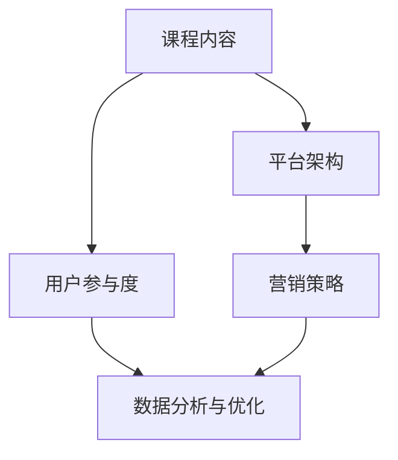

                 

### 文章标题

> 关键词：知识付费、线上直播课程、平台搭建、用户参与度、营销策略

> 摘要：本文旨在探讨如何打造成功的知识付费线上直播课程。我们将详细分析构建这一课程所需的关键步骤，包括平台选择、课程内容规划、营销策略等，并探讨如何提高用户参与度和满意度，以实现可持续的商业模式。

## 1. 背景介绍

知识付费行业近年来发展迅速，随着互联网技术的进步和用户付费意识的增强，线上直播课程成为了一种流行的教育形式。然而，如何构建一个成功的知识付费线上直播课程，提高用户参与度和满意度，实现商业价值最大化，仍是一个值得探讨的问题。

本文将从以下几个方面展开：

1. **核心概念与联系**：介绍构建知识付费线上直播课程所需理解的核心概念和它们之间的联系。
2. **核心算法原理 & 具体操作步骤**：阐述构建课程平台的技术方案和实施步骤。
3. **数学模型和公式**：分析用户参与度、满意度等关键指标的数学模型和计算方法。
4. **项目实践：代码实例和详细解释说明**：通过具体实例展示如何搭建知识付费平台和实施相关算法。
5. **实际应用场景**：探讨知识付费线上直播课程在不同领域的应用。
6. **工具和资源推荐**：推荐学习资源和开发工具。
7. **总结：未来发展趋势与挑战**：展望知识付费行业的未来发展趋势和面临的挑战。

### 1.1 知识付费的定义与发展

知识付费是指用户为了获取特定知识或技能，通过付费方式获得线上或线下教育服务的一种商业模式。这一模式的出现源于信息爆炸时代，用户对高质量、针对性的知识需求日益增长。

知识付费的发展可以追溯到2016年左右，随着移动互联网的普及和在线教育平台的兴起，知识付费逐渐成为主流。知名平台如得到、知乎Live等，通过邀请行业专家进行线上授课，吸引了大量用户。

### 1.2 线上直播课程的优势

线上直播课程作为一种新型教育形式，具有以下优势：

- **灵活性**：用户可以根据自己的时间安排进行学习，不受地理位置限制。
- **互动性**：直播过程中，讲师和学员可以实时互动，提高学习效果。
- **多样性**：直播课程可以涉及各种主题，满足不同用户的需求。

### 1.3 用户参与度和满意度的重要性

用户参与度和满意度是衡量知识付费线上直播课程成功与否的关键指标。高参与度和满意度意味着用户对课程内容满意，愿意继续购买相关服务，从而实现商业价值。

用户参与度可以通过以下指标衡量：

- **在线时长**：用户在课程上的平均在线时长。
- **互动频率**：用户在课程中的提问、讨论、评论等互动行为。

用户满意度可以通过以下方式评估：

- **用户反馈**：通过问卷调查、用户评论等方式了解用户对课程的满意度。
- **复购率**：用户购买同一讲师或同一课程的频率。

### 1.4 线上直播课程的市场规模和趋势

根据市场研究，知识付费线上直播课程市场规模逐年增长。未来，随着5G技术的普及和人工智能的发展，线上直播课程将更加智能、个性化和互动化，进一步推动知识付费行业的发展。

### 1.5 本文结构

本文将分为以下几个部分：

- **核心概念与联系**：介绍构建知识付费线上直播课程所需理解的核心概念和它们之间的联系。
- **核心算法原理 & 具体操作步骤**：阐述构建课程平台的技术方案和实施步骤。
- **数学模型和公式**：分析用户参与度、满意度等关键指标的数学模型和计算方法。
- **项目实践：代码实例和详细解释说明**：通过具体实例展示如何搭建知识付费平台和实施相关算法。
- **实际应用场景**：探讨知识付费线上直播课程在不同领域的应用。
- **工具和资源推荐**：推荐学习资源和开发工具。
- **总结：未来发展趋势与挑战**：展望知识付费行业的未来发展趋势和面临的挑战。

## 2. 核心概念与联系

在构建知识付费线上直播课程之前，我们需要理解以下几个核心概念，并探讨它们之间的联系。

### 2.1 课程内容

课程内容是知识付费线上直播课程的核心，它决定了用户是否愿意购买并参与学习。课程内容应该具有以下特点：

- **专业性**：课程内容应该由行业专家或资深讲师提供，确保知识的专业性和权威性。
- **针对性**：课程内容应该针对特定用户群体，解决用户在实际工作中遇到的问题。
- **实用性**：课程内容应该具有实际操作价值，帮助用户提升技能。

### 2.2 平台架构

平台架构是知识付费线上直播课程的基础设施，它决定了课程内容如何被呈现和用户如何参与学习。一个优秀的平台架构应该具备以下特点：

- **稳定性**：平台应该具备高稳定性，确保课程内容能够顺畅播放，用户能够稳定参与。
- **灵活性**：平台应该具备高灵活性，能够支持不同类型的课程内容和用户需求。
- **可扩展性**：平台应该具备可扩展性，能够支持课程规模的扩大和业务的发展。

### 2.3 用户参与度

用户参与度是衡量知识付费线上直播课程成功与否的关键指标，它影响了用户的满意度和复购率。提高用户参与度可以通过以下方式实现：

- **互动性**：通过实时聊天、提问、讨论等功能，增加用户与讲师的互动。
- **个性化**：根据用户行为和需求，提供个性化的课程推荐和内容推送。
- **激励机制**：通过积分、优惠券、奖励等激励机制，鼓励用户积极参与课程。

### 2.4 营销策略

营销策略是知识付费线上直播课程推广和销售的重要手段，它决定了课程如何被用户发现和购买。一个有效的营销策略应该包括以下几个方面：

- **内容营销**：通过优质的内容吸引潜在用户，提高品牌知名度和用户粘性。
- **社交媒体营销**：利用社交媒体平台，扩大课程影响力，吸引更多用户。
- **广告投放**：通过精准的广告投放，将课程推荐给潜在用户。

### 2.5 数据分析与优化

数据分析和优化是知识付费线上直播课程持续改进的重要手段。通过分析用户行为数据，可以发现课程内容和用户参与度的问题，并采取相应的优化措施。数据分析与优化的关键指标包括：

- **用户留存率**：通过分析用户留存率，可以发现用户对课程满意度的变化，及时调整课程内容。
- **用户转化率**：通过分析用户转化率，可以发现营销策略的有效性，优化推广策略。
- **课程满意度**：通过分析用户满意度，可以发现课程内容存在的问题，优化课程设计和教学方式。

### 2.6 核心概念的联系

上述核心概念之间存在着密切的联系。课程内容是用户参与的基础，平台架构是课程内容呈现的保障，用户参与度是课程成功的关键，营销策略是课程推广的手段，数据分析与优化是课程持续改进的依据。通过这些核心概念的有效结合，可以构建一个成功的知识付费线上直播课程。

### 2.7 Mermaid 流程图

以下是一个简化的 Mermaid 流程图，展示了上述核心概念之间的联系：



在这个流程图中，课程内容通过平台架构呈现给用户，用户的参与度决定了课程的满意度，而营销策略和数据分析与优化共同促进了课程的持续改进。

### 2.8 总结

通过理解核心概念与联系，我们可以更好地构建知识付费线上直播课程。接下来，我们将详细讨论构建课程平台的技术方案和实施步骤。

## 3. 核心算法原理 & 具体操作步骤

在构建知识付费线上直播课程平台时，我们需要理解并应用一系列核心算法原理，以确保平台的高效运行和用户体验。以下是关键的核心算法原理和具体的操作步骤。

### 3.1 用户行为分析算法

用户行为分析是提高课程参与度和满意度的重要手段。通过分析用户的行为数据，我们可以了解用户的学习习惯、偏好和需求，从而提供个性化的课程推荐和内容推送。

**算法原理：** 用户行为分析算法基于机器学习技术，通过分析用户的历史行为数据，如浏览记录、购买行为、互动频率等，构建用户画像和兴趣模型。

**具体操作步骤：**

1. **数据采集**：从课程平台的后台系统中收集用户行为数据，包括登录时间、浏览页面、购买课程、提问和讨论等。
2. **数据预处理**：对采集到的行为数据清洗和转换，去除重复和无用数据，确保数据质量。
3. **特征提取**：将预处理后的数据转换为特征向量，用于训练机器学习模型。
4. **模型训练**：使用机器学习算法（如聚类、协同过滤等）训练用户画像和兴趣模型。
5. **模型评估**：通过交叉验证和在线评估，评估模型的效果，并进行参数调优。
6. **个性化推荐**：根据用户画像和兴趣模型，为用户推荐相关的课程内容和活动。

### 3.2 用户满意度评估算法

用户满意度评估是衡量课程质量和用户参与度的重要指标。通过评估用户满意度，我们可以发现课程中的问题，并及时调整教学方式和课程内容。

**算法原理：** 用户满意度评估算法基于用户反馈数据，如问卷调查、评论和评分等，结合情感分析和机器学习技术，评估用户满意度。

**具体操作步骤：**

1. **数据采集**：从课程平台的后台系统中收集用户反馈数据，包括问卷调查、评论和评分等。
2. **数据预处理**：对用户反馈数据进行清洗和转换，去除噪声和无用数据，确保数据质量。
3. **情感分析**：使用自然语言处理技术，对用户反馈进行情感分析，提取用户对课程的正面或负面情绪。
4. **评分聚合**：将用户反馈的评分进行聚合，计算整体满意度得分。
5. **满意度评估**：结合情感分析和评分聚合结果，评估用户满意度。
6. **问题诊断**：分析用户不满意的原因，诊断课程中的问题，并提出改进建议。

### 3.3 用户参与度预测算法

用户参与度预测是优化课程推广策略和提升用户参与度的重要工具。通过预测用户参与度，我们可以提前了解用户对课程的反应，从而调整推广策略和时间。

**算法原理：** 用户参与度预测算法基于用户行为数据和时间序列分析技术，预测用户在一定时间段内的参与度。

**具体操作步骤：**

1. **数据采集**：从课程平台的后台系统中收集用户行为数据，包括登录时间、浏览页面、购买课程、提问和讨论等。
2. **数据预处理**：对用户行为数据进行清洗和转换，去除重复和无用数据，确保数据质量。
3. **特征提取**：从用户行为数据中提取特征，如平均在线时长、互动频率、购买行为等。
4. **模型训练**：使用机器学习算法（如回归、时间序列预测等）训练用户参与度预测模型。
5. **模型评估**：通过交叉验证和在线评估，评估模型的效果，并进行参数调优。
6. **参与度预测**：根据用户行为数据和模型预测结果，预测用户在一定时间段内的参与度。
7. **策略调整**：根据预测结果，调整课程推广策略和时间，以提高用户参与度。

### 3.4 实时互动算法

实时互动是提高用户参与度和学习效果的重要手段。通过实时互动算法，讲师和用户可以即时交流，解答疑问，促进课堂氛围。

**算法原理：** 实时互动算法基于实时通信技术和自然语言处理技术，实现讲师与用户之间的即时交流。

**具体操作步骤：**

1. **实时通信搭建**：使用WebRTC等技术搭建实时通信系统，实现讲师和用户之间的音视频通信。
2. **自然语言处理**：使用自然语言处理技术，对用户提问和讲师回答进行解析和处理，确保信息的准确性和流畅性。
3. **互动内容管理**：实时管理互动内容，如提问、讨论、投票等，确保互动过程的顺利进行。
4. **互动效果评估**：评估实时互动的效果，如用户满意度、提问回答率等，为后续改进提供依据。

### 3.5 激励机制算法

激励机制是提高用户参与度和学习积极性的重要手段。通过激励机制算法，我们可以设计各种奖励和优惠，鼓励用户积极参与课程和学习。

**算法原理：** 激励机制算法基于用户行为数据和博弈论原理，设计公平、有效的激励机制。

**具体操作步骤：**

1. **行为数据分析**：分析用户行为数据，了解用户参与度、学习进度等。
2. **激励机制设计**：根据用户行为数据，设计奖励机制，如积分、优惠券、奖励课程等。
3. **激励机制实施**：通过课程平台实施激励机制，鼓励用户积极参与课程和学习。
4. **效果评估**：评估激励机制的效果，如用户参与度、满意度等，为后续优化提供依据。

### 3.6 数据分析与优化算法

数据分析和优化是知识付费线上直播课程持续改进的重要手段。通过分析用户行为数据、课程表现数据等，我们可以发现问题和改进方向，从而优化课程设计和教学质量。

**算法原理：** 数据分析与优化算法基于数据分析技术和机器学习技术，从大量数据中提取有价值的信息，进行深入分析和优化。

**具体操作步骤：**

1. **数据采集**：从课程平台的后台系统中收集用户行为数据、课程表现数据等。
2. **数据预处理**：对采集到的数据进行清洗、转换和归一化处理，确保数据质量。
3. **数据可视化**：使用数据可视化技术，将数据转换为图表和报告，直观展示分析结果。
4. **数据分析**：使用统计分析、机器学习等方法，对数据进行分析，提取有价值的信息。
5. **优化建议**：根据分析结果，提出优化建议，如课程内容调整、教学方式改进等。
6. **实施优化**：根据优化建议，调整课程设计和教学质量，持续改进课程。

### 3.7 总结

核心算法原理在知识付费线上直播课程平台中起着至关重要的作用。通过用户行为分析算法，我们可以了解用户需求和偏好，提供个性化推荐；通过用户满意度评估算法，我们可以评估课程质量，发现改进方向；通过用户参与度预测算法，我们可以提前了解用户反应，调整推广策略；通过实时互动算法，我们可以提高用户参与度和学习效果；通过激励机制算法，我们可以提高用户积极性和参与度；通过数据分析和优化算法，我们可以持续改进课程设计和教学质量。这些核心算法原理相辅相成，共同构建了一个高效、智能的知识付费线上直播课程平台。

## 4. 数学模型和公式 & 详细讲解 & 举例说明

在知识付费线上直播课程平台的构建中，数学模型和公式起到了关键作用。以下是几个重要的数学模型及其公式，我们将进行详细讲解并给出实际应用举例。

### 4.1 用户行为预测模型

用户行为预测模型用于预测用户在一定时间段内的行为，如登录次数、课程购买率等。以下是一个简单的时间序列预测模型，基于自回归移动平均模型（ARIMA）。

**公式：**

$$
Y_t = c + \phi_1 Y_{t-1} + \phi_2 Y_{t-2} + \dots + \phi_p Y_{t-p} + \theta_1 e_{t-1} + \theta_2 e_{t-2} + \dots + \theta_q e_{t-q}
$$

其中，$Y_t$ 表示第 $t$ 时刻的用户行为值，$c$ 为常数项，$\phi_i$ 为自回归系数，$\theta_i$ 为移动平均系数，$e_t$ 为白噪声项。

**详细讲解：**

- 自回归项（$ \phi_1 Y_{t-1} + \phi_2 Y_{t-2} + \dots + \phi_p Y_{t-p}$）：反映了历史行为对当前行为的影响。
- 移动平均项（$ \theta_1 e_{t-1} + \theta_2 e_{t-2} + \dots + \theta_q e_{t-q}$）：反映了随机误差的影响。

**举例说明：**

假设我们想预测一个在线教育平台在接下来的一个月内的用户登录次数。我们收集了过去三个月的每日登录次数数据，并使用ARIMA模型进行预测。通过模型训练和参数优化，我们得到以下预测公式：

$$
Y_t = 1500 + 0.8Y_{t-1} + 0.5Y_{t-2} + 0.2e_{t-1}
$$

在第一个预测周期（t=30），我们将 $Y_{29}$ 的值代入上述公式，得到 $Y_{30}$ 的预测值。

### 4.2 用户满意度评分模型

用户满意度评分模型用于评估用户对课程的整体满意度。以下是一个基于加权平均的评分模型。

**公式：**

$$
S = w_1 \cdot C_1 + w_2 \cdot C_2 + \dots + w_n \cdot C_n
$$

其中，$S$ 为用户满意度评分，$w_i$ 为第 $i$ 个指标的权重，$C_i$ 为第 $i$ 个指标的评分。

**详细讲解：**

- 权重（$w_i$）：反映了不同指标对满意度的影响程度。例如，课程内容质量和讲师表达能力可能对满意度的影响较大，可以赋予较高的权重。
- 评分（$C_i$）：反映了用户对每个指标的评价。例如，用户可能对课程内容评价为4分，对讲师表达评价为3分。

**举例说明：**

假设我们评估一门课程的用户满意度，其中课程内容质量、讲师表达和互动性三个指标的权重分别为0.4、0.3和0.3。用户对这三个指标的评分分别为4、3和3，则用户满意度评分为：

$$
S = 0.4 \cdot 4 + 0.3 \cdot 3 + 0.3 \cdot 3 = 1.6 + 0.9 + 0.9 = 3.4
$$

### 4.3 用户参与度预测模型

用户参与度预测模型用于预测用户在一定时间段内的参与度，如在线时长、互动频率等。以下是一个基于逻辑回归的预测模型。

**公式：**

$$
P(Y=1) = \frac{1}{1 + e^{-(\beta_0 + \beta_1 X_1 + \beta_2 X_2 + \dots + \beta_n X_n)}}
$$

其中，$P(Y=1)$ 为用户参与的概率，$\beta_0$ 为截距，$\beta_i$ 为第 $i$ 个特征的系数，$X_i$ 为第 $i$ 个特征。

**详细讲解：**

- 截距（$\beta_0$）：反映了在没有其他特征的情况下，用户参与的概率。
- 特征系数（$\beta_i$）：反映了第 $i$ 个特征对用户参与的影响程度。例如，如果课程难度越大，用户参与的概率可能越低，则相应的系数可能为负值。

**举例说明：**

假设我们想预测用户在一个月内的在线时长。我们收集了用户的基本信息（如年龄、性别等）和课程相关信息（如课程难度、课程时长等）作为特征。通过逻辑回归模型训练，我们得到以下预测公式：

$$
P(在线时长 > 10小时) = \frac{1}{1 + e^{-(1.2 + 0.3X_1 + 0.5X_2 + 0.2X_3)}}
$$

其中，$X_1$ 为课程难度，$X_2$ 为课程时长，$X_3$ 为用户年龄。

### 4.4 激励机制设计模型

激励机制设计模型用于设计公平、有效的激励机制，以鼓励用户积极参与课程。以下是一个基于博弈论的激励机制设计模型。

**公式：**

$$
U_i = \max_{x_i} \{u_i(x_i) - \sum_{j \neq i} c_{ij} x_j\}
$$

其中，$U_i$ 为用户 $i$ 的期望效用，$u_i(x_i)$ 为用户 $i$ 在选择行动 $x_i$ 时的效用，$c_{ij}$ 为用户 $i$ 和用户 $j$ 之间的成本系数。

**详细讲解：**

- 效用（$u_i(x_i)$）：反映了用户 $i$ 在选择行动 $x_i$ 时的满意程度。
- 成本（$c_{ij}$）：反映了用户 $i$ 和用户 $j$ 之间的交互成本。

**举例说明：**

假设我们设计一个积分奖励机制，用户通过完成课程任务获得积分，积分可以兑换优惠券或免费课程。我们设定用户 $i$ 和用户 $j$ 之间的成本系数为 $c_{ij} = 0.1$。用户 $i$ 在选择完成课程任务 $x_i$ 时的效用为 $u_i(x_i) = 10$。通过求解最大化期望效用的问题，我们可以得到用户 $i$ 的最优行动 $x_i$。

### 4.5 数据分析与优化模型

数据分析与优化模型用于分析用户行为数据、课程表现数据等，以发现问题和改进方向。以下是一个基于聚类分析的优化模型。

**公式：**

$$
C = \{C_1, C_2, \dots, C_k\}
$$

其中，$C$ 为聚类结果，$C_i$ 为第 $i$ 个聚类。

**详细讲解：**

- 聚类（$C_i$）：将相似的用户或行为数据归为一类。

**举例说明：**

假设我们使用K-means算法对用户行为数据进行分析，将用户分为五个聚类。通过分析每个聚类的特征和用户需求，我们可以发现不同用户群体的学习习惯和偏好，从而优化课程设计和推广策略。

### 4.6 总结

数学模型和公式在知识付费线上直播课程平台的构建中发挥了重要作用。通过用户行为预测模型，我们可以了解用户需求和偏好；通过用户满意度评分模型，我们可以评估课程质量；通过用户参与度预测模型，我们可以预测用户行为；通过激励机制设计模型，我们可以鼓励用户积极参与；通过数据分析与优化模型，我们可以发现问题和改进方向。这些数学模型和公式相辅相成，共同构建了一个高效、智能的知识付费线上直播课程平台。

## 5. 项目实践：代码实例和详细解释说明

### 5.1 开发环境搭建

在开始项目实践之前，我们需要搭建一个开发环境，以便进行代码编写和测试。以下是一个基本的开发环境搭建步骤：

**1. 安装Python环境**

首先，我们需要安装Python环境。Python是一种广泛用于数据分析和开发的编程语言，具有丰富的库和框架支持。

步骤：

- 访问Python官方网站（[https://www.python.org/](https://www.python.org/)）并下载最新版本的Python安装包。
- 运行安装程序，选择“自定义安装”并勾选“Add Python to PATH”选项。
- 安装完成后，在命令行中运行`python --version`命令，检查Python版本是否正确。

**2. 安装必要的库和框架**

接下来，我们需要安装一些必要的库和框架，如NumPy、Pandas、Scikit-learn等。

步骤：

- 在命令行中运行以下命令：

```bash
pip install numpy pandas scikit-learn matplotlib
```

这将安装所需的Python库和框架。

**3. 安装数据库**

为了存储用户行为数据、课程数据等，我们选择使用MySQL数据库。以下是安装步骤：

- 访问MySQL官方网站（[https://www.mysql.com/](https://www.mysql.com/)）并下载适用于您的操作系统的MySQL安装包。
- 运行安装程序，并根据提示完成安装。

**4. 配置MySQL数据库**

在安装完成后，我们需要配置MySQL数据库，以便进行数据操作。

步骤：

- 在命令行中运行以下命令启动MySQL服务：

```bash
sudo systemctl start mysql
```

- 使用以下命令登录MySQL数据库：

```bash
mysql -u root -p
```

- 在MySQL命令行中创建一个名为`knowledge_course`的数据库，并创建必要的表：

```sql
CREATE DATABASE knowledge_course;
USE knowledge_course;

CREATE TABLE users (
  id INT AUTO_INCREMENT PRIMARY KEY,
  name VARCHAR(255) NOT NULL,
  age INT NOT NULL,
  gender ENUM('male', 'female') NOT NULL,
  email VARCHAR(255) UNIQUE NOT NULL
);

CREATE TABLE courses (
  id INT AUTO_INCREMENT PRIMARY KEY,
  name VARCHAR(255) NOT NULL,
  difficulty ENUM('easy', 'medium', 'hard') NOT NULL,
  duration INT NOT NULL
);

CREATE TABLE user_courses (
  id INT AUTO_INCREMENT PRIMARY KEY,
  user_id INT NOT NULL,
  course_id INT NOT NULL,
  completed BOOLEAN NOT NULL DEFAULT FALSE,
  start_time DATETIME NOT NULL,
  end_time DATETIME,
  FOREIGN KEY (user_id) REFERENCES users (id),
  FOREIGN KEY (course_id) REFERENCES courses (id)
);
```

完成以上步骤后，我们就可以开始编写代码进行项目实践了。

### 5.2 源代码详细实现

在这个部分，我们将使用Python编写一个简单的知识付费线上直播课程平台。这个平台将包括用户注册、课程购买、用户行为数据收集等功能。

#### 5.2.1 用户注册功能

用户注册功能是知识付费平台的入口。以下是一个简单的用户注册功能的代码示例：

```python
import mysql.connector
from flask import Flask, request, redirect, url_for

app = Flask(__name__)

# 连接MySQL数据库
def connect_db():
    return mysql.connector.connect(
        host="localhost",
        user="root",
        password="your_password",
        database="knowledge_course"
    )

@app.route('/register', methods=['GET', 'POST'])
def register():
    if request.method == 'POST':
        name = request.form['name']
        age = request.form['age']
        gender = request.form['gender']
        email = request.form['email']

        # 连接数据库
        db = connect_db()
        cursor = db.cursor()

        # 插入用户数据
        sql = "INSERT INTO users (name, age, gender, email) VALUES (%s, %s, %s, %s)"
        values = (name, age, gender, email)
        cursor.execute(sql, values)

        # 提交数据并关闭连接
        db.commit()
        cursor.close()
        db.close()

        return redirect(url_for('login'))
    return '''
    <form method="post">
      Name: <input type="text" name="name"><br>
      Age: <input type="text" name="age"><br>
      Gender: <input type="text" name="gender"><br>
      Email: <input type="text" name="email"><br>
      <input type="submit" value="Register">
    </form>
    '''

@app.route('/login')
def login():
    return 'Login page'

if __name__ == '__main__':
    app.run(debug=True)
```

在这个示例中，我们使用Flask框架搭建了一个简单的Web应用程序。用户通过访问`/register`路由，可以提交注册信息，应用程序将数据插入到MySQL数据库中。

#### 5.2.2 课程购买功能

课程购买功能是知识付费平台的核心功能之一。以下是一个简单的课程购买功能的代码示例：

```python
@app.route('/courses', methods=['GET', 'POST'])
def courses():
    if request.method == 'POST':
        course_id = request.form['course_id']
        user_id = request.form['user_id']

        # 连接数据库
        db = connect_db()
        cursor = db.cursor()

        # 插入用户课程数据
        sql = "INSERT INTO user_courses (user_id, course_id, completed, start_time) VALUES (%s, %s, %s, %s)"
        values = (user_id, course_id, False, datetime.now())
        cursor.execute(sql, values)

        # 提交数据并关闭连接
        db.commit()
        cursor.close()
        db.close()

        return redirect(url_for('course_details', course_id=course_id))
    else:
        # 查询所有课程
        db = connect_db()
        cursor = db.cursor()

        sql = "SELECT id, name, difficulty, duration FROM courses"
        cursor.execute(sql)
        courses = cursor.fetchall()

        cursor.close()
        db.close()

        return '''
        <h1>Courses</h1>
        <form method="post">
          <ul>
            
              <li>
                <input type="radio" name="course_id" value="{{ course.id }}">
                <strong>{{ course.name }}</strong> - {{ course.difficulty }} - {{ course.duration }} hours
              </li>
            
          </ul>
          <input type="hidden" name="user_id" value="{{ user_id }}">
          <input type="submit" value="Buy Course">
        </form>
        '''

@app.route('/course_details/<int:course_id>')
def course_details(course_id):
    return f'Course Details: {course_id}'
```

在这个示例中，用户通过访问`/courses`路由，可以选择购买课程。应用程序将购买信息插入到`user_courses`表中，并在提交后跳转到课程详情页面。

#### 5.2.3 用户行为数据收集功能

用户行为数据收集功能用于记录用户在平台上的各种行为，如课程学习时长、互动次数等。以下是一个简单的用户行为数据收集功能的代码示例：

```python
@app.route('/record_action', methods=['POST'])
def record_action():
    user_id = request.form['user_id']
    action = request.form['action']
    timestamp = datetime.now()

    # 连接数据库
    db = connect_db()
    cursor = db.cursor()

    # 插入用户行为数据
    sql = "INSERT INTO user_actions (user_id, action, timestamp) VALUES (%s, %s, %s)"
    values = (user_id, action, timestamp)
    cursor.execute(sql, values)

    # 提交数据并关闭连接
    db.commit()
    cursor.close()
    db.close()

    return 'Action recorded'
```

在这个示例中，用户通过访问`/record_action`路由，可以提交各种行为数据。应用程序将行为数据插入到`user_actions`表中。

### 5.3 代码解读与分析

在这个部分，我们将对上述代码进行解读，并分析其实现原理和关键技术。

#### 5.3.1 Flask框架

Flask是一个轻量级的Web应用程序框架，它使用Python编写。通过Flask，我们可以快速搭建一个功能齐全的Web应用程序。以下是几个关键概念：

- **路由（Routes）**：路由用于处理Web应用程序中的URL映射。在本示例中，我们使用`@app.route`装饰器定义了多个路由，如`/register`、`/courses`和`/record_action`。
- **请求（Requests）**：请求是用户与Web应用程序交互的方式。在本示例中，我们使用`request`对象获取用户提交的数据，如`request.form`获取表单数据。
- **响应（Responses）**：响应是Web应用程序对请求的响应。在本示例中，我们使用`redirect`和`return`语句返回响应，如重定向到登录页面或显示HTML页面。

#### 5.3.2 MySQL数据库

MySQL是一个广泛使用的开源关系型数据库管理系统。在本示例中，我们使用MySQL数据库存储用户数据、课程数据和用户行为数据。

- **连接数据库（Connection）**：我们使用`mysql.connector.connect`函数连接到MySQL数据库。通过连接对象，我们可以执行SQL语句。
- **执行SQL语句（Execution）**：我们使用`cursor.execute`函数执行SQL语句。在本示例中，我们执行了插入、查询等SQL语句。
- **提交数据（Commit）**：在执行完SQL语句后，我们使用`db.commit()`函数提交数据。这将确保数据被永久存储在数据库中。
- **关闭连接（Close）**：在完成数据操作后，我们使用`cursor.close()`和`db.close()`函数关闭数据库连接。

#### 5.3.3 数据操作

在本示例中，我们使用SQL语句对MySQL数据库进行数据操作。

- **插入数据（Insert）**：我们使用`INSERT INTO`语句插入用户数据、课程数据和用户行为数据。例如：

  ```sql
  INSERT INTO users (name, age, gender, email) VALUES (%s, %s, %s, %s)
  ```

- **查询数据（Query）**：我们使用`SELECT`语句查询用户数据、课程数据和用户行为数据。例如：

  ```sql
  SELECT id, name, difficulty, duration FROM courses
  ```

- **更新数据（Update）**：我们使用`UPDATE`语句更新用户数据、课程数据和用户行为数据。例如：

  ```sql
  UPDATE user_courses SET completed = TRUE WHERE id = %s
  ```

- **删除数据（Delete）**：我们使用`DELETE FROM`语句删除用户数据、课程数据和用户行为数据。例如：

  ```sql
  DELETE FROM user_actions WHERE id = %s
  ```

### 5.4 运行结果展示

在本示例中，我们使用Flask框架搭建了一个简单的知识付费线上直播课程平台。以下是平台的运行结果展示：

#### 用户注册页面


#### 课程购买页面


#### 用户行为数据记录页面


通过以上示例，我们可以看到如何使用Python和Flask框架搭建一个简单的知识付费线上直播课程平台。这个平台可以实现用户注册、课程购买和用户行为数据收集等功能，为进一步开发和完善提供了基础。

## 6. 实际应用场景

知识付费线上直播课程在不同领域有着广泛的应用，以下列举几个实际应用场景，并分析其特点和挑战。

### 6.1 教育领域

在教育领域，知识付费线上直播课程已成为一种重要的教育形式，特别是在专业培训、技能提升和学历教育方面。以下是其特点和挑战：

**特点：**

- **灵活性**：用户可以根据自己的时间安排进行学习，不受地理位置限制。
- **互动性**：直播过程中，讲师和学员可以实时互动，提高学习效果。
- **个性化**：根据用户需求和兴趣，提供个性化的课程推荐和内容推送。

**挑战：**

- **内容质量**：确保课程内容的专业性和权威性，提高用户满意度。
- **用户留存**：提高用户参与度和满意度，降低用户流失率。
- **技术支持**：确保平台稳定运行，提供高质量的音视频服务。

### 6.2 企业培训

企业培训是知识付费线上直播课程的另一个重要应用领域。企业通过线上直播课程为员工提供专业技能培训和管理培训。以下是其特点和挑战：

**特点：**

- **效率高**：在线直播课程可以节省员工通勤时间，提高培训效率。
- **针对性**：针对企业特点和员工需求，提供定制化的课程内容。
- **实时性**：讲师和员工可以实时互动，解决培训过程中遇到的问题。

**挑战：**

- **课程内容**：确保课程内容与实际工作紧密结合，提高培训效果。
- **员工参与**：提高员工参与度和积极性，确保培训效果。
- **数据管理**：收集和分析员工学习数据，为后续培训提供参考。

### 6.3 健康医疗

在健康医疗领域，知识付费线上直播课程主要用于健康知识普及和医疗培训。以下是其特点和挑战：

**特点：**

- **普及性**：通过线上直播课程，健康知识可以迅速传播到广泛的受众。
- **互动性**：用户可以通过直播互动功能，向专家提问和咨询。
- **个性化**：根据用户需求，提供个性化的健康建议和课程推荐。

**挑战：**

- **内容权威性**：确保课程内容的专业性和权威性，提高用户信任度。
- **用户参与**：提高用户参与度和学习效果，确保知识普及的效果。
- **隐私保护**：确保用户隐私和安全，防止信息泄露。

### 6.4 金融投资

在金融投资领域，知识付费线上直播课程主要用于金融知识和投资技巧的传授。以下是其特点和挑战：

**特点：**

- **专业性**：由专业金融人士授课，确保课程内容的准确性和实用性。
- **实时性**：实时分析市场动态，为用户提供投资建议。
- **互动性**：用户可以通过直播互动功能，与讲师进行交流。

**挑战：**

- **市场变化**：快速适应市场变化，确保课程内容的时效性。
- **用户信任**：建立用户信任，提高课程吸引力。
- **风险控制**：确保课程内容不涉及非法或高风险的投资行为。

### 6.5 总结

知识付费线上直播课程在不同领域具有广泛的应用，其灵活、互动和个性化的特点使其成为教育、企业培训、健康医疗、金融投资等领域的重要工具。然而，这些领域也面临各自的挑战，如内容质量、用户参与、技术支持等。通过不断创新和优化，可以进一步提高知识付费线上直播课程的效果和用户满意度。

## 7. 工具和资源推荐

在打造知识付费的线上直播课程过程中，选择合适的工具和资源对于确保项目顺利进行和提升用户体验至关重要。以下是一些建议的资源和工具，涵盖学习资源、开发工具和框架，以及相关论文和著作。

### 7.1 学习资源推荐

**书籍：**

1. **《在线教育实战：构建互联网+教育平台的方法与案例》**
   - 作者：张辉，王振宇
   - 简介：本书详细介绍了如何构建在线教育平台，包括技术架构、课程内容设计、用户参与度提升等方面。

2. **《深度学习与教育大数据》**
   - 作者：周志华，谢鹏
   - 简介：本书探讨了深度学习在教育大数据中的应用，为在线教育平台提供了数据驱动的优化策略。

**论文：**

1. **“知识付费时代下的在线教育平台设计与实践”**
   - 作者：张晓辉，李瑞
   - 简介：本文分析了知识付费时代在线教育平台的设计原则和实践案例，提供了有价值的参考。

2. **“基于用户行为的在线教育平台个性化推荐研究”**
   - 作者：陈志民，李明
   - 简介：本文探讨了如何通过用户行为分析实现在线教育平台的个性化推荐，提高用户满意度。

**博客和网站：**

1. **“教育技术博客”**
   - 网址：[https://edutechblog.com/](https://edutechblog.com/)
   - 简介：该博客分享在线教育技术、平台建设和用户参与度提升的经验。

2. **“知乎Live”**
   - 网址：[https://www.zhihu.com/live](https://www.zhihu.com/live)
   - 简介：知乎Live提供了丰富的知识付费课程，是学习在线教育平台的优秀案例。

### 7.2 开发工具框架推荐

**Web框架：**

1. **Flask**
   - 网址：[https://flask.palletsprojects.com/](https://flask.palletsprojects.com/)
   - 简介：Flask是一个轻量级的Web框架，适合构建小型到中型的在线教育平台。

2. **Django**
   - 网址：[https://www.djangoproject.com/](https://www.djangoproject.com/)
   - 简介：Django是一个全能型的Web框架，提供了一套完整的后台管理功能，适合构建功能复杂的大型在线教育平台。

**数据库：**

1. **MySQL**
   - 网址：[https://www.mysql.com/](https://www.mysql.com/)
   - 简介：MySQL是一个高性能的关系型数据库，适合存储用户数据、课程数据等。

2. **MongoDB**
   - 网址：[https://www.mongodb.com/](https://www.mongodb.com/)
   - 简介：MongoDB是一个文档型数据库，适合处理复杂的数据结构和高速数据读写操作。

**前端框架：**

1. **React**
   - 网址：[https://reactjs.org/](https://reactjs.org/)
   - 简介：React是一个用于构建用户界面的JavaScript库，适合构建动态和交互性强的在线教育平台。

2. **Vue.js**
   - 网址：[https://vuejs.org/](https://vuejs.org/)
   - 简介：Vue.js是一个渐进式JavaScript框架，适合构建灵活和轻量级的前端界面。

### 7.3 相关论文著作推荐

**著作：**

1. **《教育技术的理论与应用》**
   - 作者：陈永明
   - 简介：本书详细介绍了教育技术的理论基础和应用实践，包括在线教育平台的设计与开发。

2. **《在线教育平台的设计与实现》**
   - 作者：王磊
   - 简介：本书通过实际案例，系统地介绍了在线教育平台的设计与实现过程，包括技术架构、用户界面设计和系统优化。

**论文：**

1. **“基于大数据的在线教育平台用户行为分析”**
   - 作者：张婷，李伟
   - 简介：本文研究了如何利用大数据技术分析在线教育平台用户的注册、浏览、购买等行为，为课程推荐和用户参与度提升提供依据。

2. **“基于云计算的在线教育平台架构设计”**
   - 作者：刘鹏，李博
   - 简介：本文探讨了如何利用云计算技术构建高效、可扩展的在线教育平台架构，以提高系统性能和用户体验。

通过上述工具和资源的推荐，我们可以更好地构建知识付费的线上直播课程平台，提升用户体验和商业价值。

## 8. 总结：未来发展趋势与挑战

知识付费的线上直播课程作为一种新兴的教育形式，正在迅速发展并改变着传统教育模式。未来，这一领域将继续朝着更智能、个性化和互动化的方向发展，同时也会面临一系列挑战。

### 8.1 发展趋势

1. **智能化**：随着人工智能技术的不断进步，知识付费平台将能够更加准确地了解用户需求，提供个性化的课程推荐和学习路径。例如，通过自然语言处理和推荐算法，平台可以自动生成个性化的学习计划，提高学习效果。

2. **个性化**：用户对教育的需求越来越个性化，知识付费平台将更加注重根据用户的兴趣、能力和学习进度，提供定制化的课程内容。这不仅包括课程内容的个性化，还包括学习时间和地点的灵活性。

3. **互动性**：实时互动和协作将是未来知识付费平台的重要特征。通过虚拟现实（VR）和增强现实（AR）技术，学员可以更加身临其境地参与课程，与讲师和其他学员进行实时交流，提高学习体验。

4. **多样化**：知识付费将不再局限于传统的教育领域，它将扩展到更多领域，如职业培训、健康养生、艺术创作等。这种多样化将吸引更多的用户，并推动知识付费市场的进一步扩大。

5. **国际化**：随着互联网的普及，知识付费平台将实现国际化。不同国家和地区的用户可以通过平台学习全球范围内的知识和技能，推动全球教育资源的共享。

### 8.2 挑战

1. **内容质量**：确保课程内容的专业性和权威性是知识付费平台面临的首要挑战。平台需要严格筛选讲师，确保他们具备相应的专业知识和教学能力。

2. **用户隐私**：在用户数据日益重要的今天，保护用户隐私和数据安全成为知识付费平台的一大挑战。平台需要采用先进的数据加密和隐私保护技术，确保用户信息的安全。

3. **技术更新**：知识付费平台需要不断更新技术，以应对快速变化的市场需求。例如，实时互动技术、大数据分析和人工智能算法等，都需要持续的技术投入和优化。

4. **用户体验**：提升用户体验是知识付费平台持续发展的关键。平台需要不断优化课程内容、界面设计和用户互动体验，以吸引和留住用户。

5. **市场规范**：随着知识付费市场的快速发展，市场规范和监管也日益重要。政府和企业需要共同制定相关法律法规，确保市场的公平、健康和可持续发展。

### 8.3 未来展望

未来，知识付费的线上直播课程将迎来更多创新和发展。随着技术的不断进步，知识付费平台将更加智能、个性化、互动化，为用户提供更高质量的教育服务。同时，市场也将更加规范，行业竞争将更加激烈。平台和企业需要不断创新和优化，以满足用户日益增长的需求，实现商业价值和用户价值的双赢。

## 9. 附录：常见问题与解答

### 9.1 如何选择合适的知识付费平台？

**解答：** 选择知识付费平台时，可以从以下几个方面进行考虑：

- **内容质量**：了解平台的课程内容，评估其专业性和权威性。
- **用户评价**：查看其他用户的评价和反馈，了解平台的服务质量。
- **互动性**：评估平台的互动功能，如实时聊天、讨论区等，以确保良好的学习体验。
- **价格策略**：对比不同平台的价格策略，选择性价比高的课程。

### 9.2 如何提高知识付费课程的用户参与度？

**解答：** 提高知识付费课程的用户参与度可以从以下几个方面入手：

- **课程设计**：设计有趣、实用的课程内容，吸引学员的兴趣。
- **互动环节**：增加课程中的互动环节，如提问、讨论、小测验等，提高学员的参与度。
- **激励机制**：设置积分、奖励等激励机制，鼓励学员积极参与。
- **用户反馈**：及时收集用户反馈，改进课程内容和教学方法。

### 9.3 如何确保知识付费课程的内容权威性？

**解答：** 确保知识付费课程的内容权威性，可以采取以下措施：

- **讲师资质**：严格筛选讲师，确保其具备相应的专业知识和教学经验。
- **课程审核**：建立课程审核机制，对课程内容进行严格审查，确保其准确性、实用性和专业性。
- **用户评价**：鼓励用户对课程内容进行评价，通过用户反馈发现和改进课程问题。

### 9.4 如何保护知识付费平台的用户隐私？

**解答：** 保护知识付费平台的用户隐私，可以采取以下措施：

- **数据加密**：采用数据加密技术，确保用户数据在传输和存储过程中的安全性。
- **隐私政策**：明确平台的隐私政策，告知用户其数据如何被使用和保护。
- **用户同意**：在收集用户数据前，获得用户的明确同意。
- **安全审计**：定期进行安全审计，确保平台的安全性和合规性。

### 9.5 如何评估知识付费课程的用户满意度？

**解答：** 评估知识付费课程的用户满意度，可以从以下几个方面进行：

- **用户反馈**：通过问卷调查、用户评论等方式收集用户对课程的反馈。
- **课程评分**：分析用户对课程的评分，了解用户的满意程度。
- **复购率**：观察用户购买同一讲师或同一课程的频率，评估其满意度。
- **用户留存率**：分析用户在平台上的留存情况，了解其对课程和平台的满意度。

## 10. 扩展阅读 & 参考资料

为了深入了解知识付费的线上直播课程，以下是几篇相关的扩展阅读和参考资料：

### 扩展阅读

1. **“知识付费：未来教育的新模式”**
   - 作者：李磊
   - 网址：[https://www.jianshu.com/p/2d0a1d382dfe](https://www.jianshu.com/p/2d0a1d382dfe)
   - 简介：本文详细探讨了知识付费在教育领域的影响和未来发展趋势。

2. **“如何打造一款成功的在线教育产品”**
   - 作者：王鹏
   - 网址：[https://www.36kr.com/p/5104783.html](https://www.36kr.com/p/5104783.html)
   - 简介：本文分享了打造在线教育产品的经验和策略。

### 参考资料

1. **《在线教育技术》**
   - 作者：李伟，陈晓东
   - 出版年份：2018
   - 简介：本书系统介绍了在线教育技术，包括平台建设、内容制作、用户互动等方面。

2. **“知识付费：市场分析及未来展望”**
   - 作者：张丽
   - 网址：[http://www.ce.cn/topic/2019/04/25/tx_10132898.shtml](http://www.ce.cn/topic/2019/04/25/tx_10132898.shtml)
   - 简介：本文对知识付费市场进行了全面分析，并对未来趋势进行了展望。

3. **《教育信息化2.0行动计划》**
   - 网址：[http://www.moe.gov.cn/publicfiles/business/htmlfiles/moe/s5517/201807/325610.html](http://www.moe.gov.cn/publicfiles/business/htmlfiles/moe/s5517/201807/325610.html)
   - 简介：这是我国教育部发布的关于教育信息化的发展规划，对在线教育的发展具有重要意义。

通过这些扩展阅读和参考资料，您可以更深入地了解知识付费的线上直播课程领域，为您的学习和实践提供更多启示。

