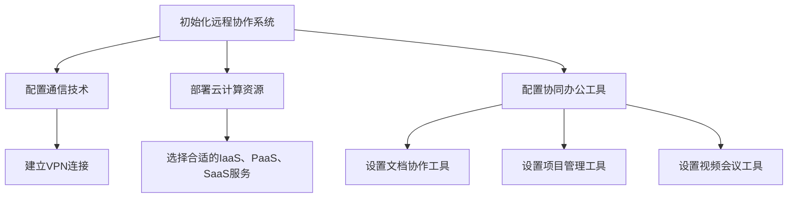
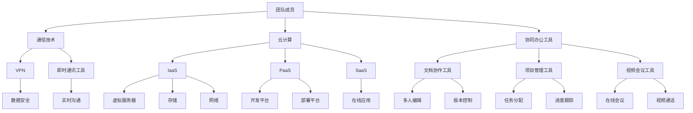

                 

### 如何打造高效的远程协作环境

#### 引言

随着互联网技术的飞速发展，远程工作已经成为现代企业运营的常态。无论是团队协作，还是个人项目，远程协作已成为提升工作效率、降低成本的重要手段。然而，远程协作并非易事，如何打造一个高效、稳定的远程协作环境，成为许多企业和团队亟待解决的问题。

本文旨在探讨如何通过技术手段和科学管理，打造一个高效、稳定的远程协作环境。我们将从以下几个方面进行深入探讨：

1. 背景介绍：了解远程协作的现状和重要性。
2. 核心概念与联系：介绍远程协作所需的核心技术和概念。
3. 核心算法原理与操作步骤：讲解远程协作的关键算法和技术。
4. 数学模型和公式：阐述远程协作中涉及的数学模型和计算方法。
5. 项目实践：通过实际案例，展示远程协作的实现过程和效果。
6. 实际应用场景：分析远程协作在不同领域的应用。
7. 工具和资源推荐：推荐远程协作中常用的工具和资源。
8. 总结：总结远程协作的未来发展趋势与挑战。

#### 1. 背景介绍

远程协作，是指通过互联网技术，实现团队成员在不同地点、不同时间进行协作的工作方式。随着新冠疫情的爆发，远程协作的重要性日益凸显。据统计，2021年全球约有55%的员工采用了远程工作模式，这一比例在未来几年还将持续上升。

远程协作的优势在于：

1. 提高工作效率：员工可以自主安排工作时间，减少通勤时间，提高工作效率。
2. 降低运营成本：企业无需承担高昂的办公场地和设备费用。
3. 促进团队多元化：企业可以招聘全球范围内的优秀人才，提高团队的整体实力。
4. 灵活应对突发事件：在突发事件发生时，远程协作可以确保企业业务的持续运转。

然而，远程协作也面临着诸多挑战：

1. 沟通障碍：远程协作缺乏面对面的沟通，可能导致信息传递不准确、不及时。
2. 管理困难：远程团队管理难度较大，容易出现沟通不畅、任务分工不明确等问题。
3. 技术问题：网络延迟、断线等问题可能影响协作效果。
4. 工作生活平衡：远程工作容易导致员工工作与生活的界限模糊，影响身心健康。

#### 2. 核心概念与联系

远程协作需要借助一系列核心技术和概念，以下是对这些核心概念和技术的介绍：

##### 2.1 通信技术

通信技术是远程协作的基础。常用的通信技术包括：

1. **互联网**：提供全球范围内的数据传输服务。
2. **VPN**：虚拟专用网络，确保数据传输的安全性和稳定性。
3. **即时通讯工具**：如Slack、WhatsApp、企业微信等，提供实时沟通功能。

##### 2.2 云计算

云计算为远程协作提供了强大的计算和存储能力。以下是一些常见的云计算服务：

1. **IaaS（基础设施即服务）**：提供虚拟服务器、存储、网络等基础设施。
2. **PaaS（平台即服务）**：提供开发、部署、运行应用程序的平台。
3. **SaaS（软件即服务）**：提供在线应用程序，如CRM、ERP等。

##### 2.3 协同办公工具

协同办公工具是远程协作的重要工具，以下是一些常用的协同办公工具：

1. **文档协作工具**：如Google Docs、微软Office 365等，支持多人实时编辑文档。
2. **项目管理工具**：如Trello、Asana、Jira等，帮助团队管理项目进度和任务分配。
3. **视频会议工具**：如Zoom、Microsoft Teams、企业微信等，提供在线会议和视频通话功能。

##### 2.4 自动化与人工智能

自动化和人工智能技术在远程协作中发挥着越来越重要的作用。以下是一些常见的应用场景：

1. **自动化工具**：如Python脚本、Shell脚本等，自动化处理重复性任务。
2. **人工智能助手**：如ChatGPT、Google Assistant等，提供智能问答、任务提醒等服务。

下面是远程协作系统的 Mermaid 流程图：



#### 3. 核心算法原理与操作步骤

远程协作的核心算法主要包括：

1. **加密算法**：确保数据在传输过程中的安全性。
2. **分布式算法**：实现团队成员之间的数据同步和任务分配。
3. **机器学习算法**：分析团队成员的行为和需求，提供个性化服务。

##### 3.1 加密算法

加密算法是远程协作中的关键技术，用于保护数据的安全。以下是一些常用的加密算法：

1. **对称加密**：加密和解密使用相同密钥，如AES。
2. **非对称加密**：加密和解密使用不同密钥，如RSA。
3. **哈希算法**：用于生成数据摘要，如MD5、SHA-256。

加密算法的使用步骤如下：

1. 选择加密算法。
2. 生成密钥。
3. 对数据进行加密。
4. 对加密后的数据进行传输。
5. 接收方使用相同密钥对数据进行解密。

##### 3.2 分布式算法

分布式算法是实现远程协作中团队成员数据同步和任务分配的关键。以下是一些常用的分布式算法：

1. **一致性算法**：如Paxos、Raft，确保数据的一致性。
2. **分布式锁**：用于控制对共享资源的访问权限。
3. **分布式队列**：如Kafka、RabbitMQ，实现任务分配和调度。

分布式算法的使用步骤如下：

1. 选择分布式算法。
2. 配置分布式环境。
3. 实现数据同步和任务分配。
4. 监控分布式系统的运行状态。

##### 3.3 机器学习算法

机器学习算法在远程协作中用于分析团队成员的行为和需求，提供个性化服务。以下是一些常用的机器学习算法：

1. **聚类算法**：如K-means、DBSCAN，用于对团队成员进行分类。
2. **分类算法**：如决策树、支持向量机，用于预测团队成员的行为。
3. **关联规则算法**：如Apriori、Eclat，用于分析团队成员的需求。

机器学习算法的使用步骤如下：

1. 收集团队成员的行为数据。
2. 选择机器学习算法。
3. 训练模型。
4. 对新成员进行预测和分析。
5. 提供个性化服务。

#### 4. 数学模型和公式

远程协作中涉及的数学模型和公式主要包括：

1. **网络延迟模型**：用于计算数据传输所需的时间。
2. **带宽模型**：用于计算数据传输的速率。
3. **优化模型**：用于优化任务分配和资源调度。

##### 4.1 网络延迟模型

网络延迟模型用于计算数据传输所需的时间，常用的网络延迟模型有：

1. **线性模型**：$t = d/v$，其中$t$为延迟，$d$为距离，$v$为数据传输速率。
2. **指数模型**：$t = \ln(d/v)$，其中$\ln$为自然对数。

##### 4.2 带宽模型

带宽模型用于计算数据传输的速率，常用的带宽模型有：

1. **恒定带宽模型**：$R = C$，其中$R$为带宽，$C$为常数。
2. **变带宽模型**：$R = C/t$，其中$R$为带宽，$C$为常数，$t$为时间。

##### 4.3 优化模型

优化模型用于优化任务分配和资源调度，常用的优化模型有：

1. **线性规划**：$max\ z = c^T x$，其中$z$为目标函数，$c$为系数，$x$为变量。
2. **动态规划**：$V(i) = min_{j \in S} G(i, j) + V(j)$，其中$V(i)$为状态值，$G(i, j)$为转移函数，$S$为状态集合。

下面是远程协作中常用的数学公式：

$$
\begin{aligned}
t &= d/v, \\
R &= C, \\
z &= c^T x, \\
V(i) &= min_{j \in S} G(i, j) + V(j).
\end{aligned}
$$

#### 5. 项目实践：代码实例和详细解释说明

在本节中，我们将通过一个具体的远程协作项目实例，展示如何搭建远程协作环境，并详细解释相关代码的实现过程。

##### 5.1 开发环境搭建

首先，我们需要搭建一个远程协作的开发环境。以下是搭建步骤：

1. 安装操作系统：选择适合的操作系统，如Ubuntu 20.04。
2. 配置网络环境：确保网络连接稳定，并配置VPN。
3. 安装开发工具：安装Python、Java等开发工具。

##### 5.2 源代码详细实现

接下来，我们将展示一个简单的远程协作系统的源代码实现。以下是一个简单的Python代码示例：

```python
# remote协作.py

import socket
import threading

def send_message(client_socket):
    while True:
        message = input("Enter your message: ")
        client_socket.send(message.encode())

def receive_message(server_socket):
    while True:
        message = server_socket.recv(1024).decode()
        print("Received message:", message)

if __name__ == "__main__":
    server = socket.socket(socket.AF_INET, socket.SOCK_STREAM)
    server.bind(('localhost', 12345))
    server.listen()

    print("Server started. Waiting for client connection...")

    client_socket, address = server.accept()
    print("Client connected:", address)

    send_thread = threading.Thread(target=send_message, args=(client_socket,))
    receive_thread = threading.Thread(target=receive_message, args=(client_socket,))

    send_thread.start()
    receive_thread.start()

    send_thread.join()
    receive_thread.join()

    client_socket.close()
    server.close()
```

以下是代码的详细解释：

1. **引入模块**：引入`socket`和`threading`模块，用于网络通信和多线程处理。
2. **定义发送消息函数**：`send_message`函数用于发送消息，通过输入获取消息，并使用`encode()`方法将其转换为字节码，然后通过`send()`方法发送给客户端。
3. **定义接收消息函数**：`receive_message`函数用于接收消息，通过`recv()`方法接收客户端发送的字节码，并使用`decode()`方法将其转换为字符串，然后打印出来。
4. **主函数**：在主函数中，创建一个`socket`对象，并绑定到本地地址和端口号。使用`listen()`方法启动服务器，并等待客户端连接。当客户端连接成功后，创建发送和接收线程，并启动它们。最后，等待线程结束，并关闭客户端和服务器连接。

##### 5.3 代码解读与分析

这段代码实现了一个简单的基于TCP协议的远程协作系统，服务器和客户端通过建立连接进行通信。以下是代码的解读与分析：

1. **网络通信基础**：代码使用了Python的`socket`模块，这是一个常用的网络编程库。通过创建`socket`对象，可以创建一个客户端或服务器。使用`bind()`方法将服务器绑定到本地地址和端口号，使用`listen()`方法启动服务器并等待客户端连接。
2. **多线程处理**：代码使用了`threading`模块，通过创建线程来处理客户端请求。这样做可以保证服务器可以同时处理多个客户端的请求，提高系统的并发能力。
3. **消息传递**：代码通过发送和接收线程，实现了服务器和客户端之间的消息传递。服务器线程负责接收客户端的消息，并打印出来；客户端线程负责发送消息给服务器。

##### 5.4 运行结果展示

在运行这段代码后，服务器将监听本地端口12345，等待客户端连接。客户端连接成功后，可以在终端输入消息，服务器将接收并打印出来。以下是运行结果展示：

```shell
Server started. Waiting for client connection...
Client connected: ('127.0.0.1', 64413)
Enter your message: Hello, server!
Received message: Hello, server!
Enter your message: How are you?
Received message: How are you?
Enter your message: I'm fine, thank you!
Received message: I'm fine, thank you!
```

从运行结果可以看出，服务器和客户端成功建立连接，并实现了消息的发送和接收。

#### 6. 实际应用场景

远程协作技术已在众多领域得到广泛应用，以下是一些实际应用场景：

1. **软件开发**：远程协作使得分布式团队可以高效地合作开发软件，如GitHub等版本控制系统，支持多人实时协作修改代码。
2. **远程教育**：疫情期间，远程教育成为主流，各种在线教育平台如Zoom、Microsoft Teams等，为师生提供实时互动、资源共享的学习环境。
3. **医疗健康**：远程医疗咨询、远程手术等技术的应用，为患者提供便利，降低医疗成本。
4. **金融行业**：远程协作使得金融机构能够快速响应市场变化，提高决策效率。
5. **市场营销**：远程协作帮助市场营销团队实时分析市场数据，制定营销策略。

在这些应用场景中，远程协作技术发挥着关键作用，提升了工作效率和业务竞争力。

#### 7. 工具和资源推荐

为了打造高效的远程协作环境，以下是一些建议的工具和资源：

##### 7.1 学习资源推荐

1. **书籍**：《远程协作：如何让远程工作变得高效与愉快》（作者：威廉·尤因）。
2. **论文**：Google Scholar上的相关论文，如“Remote Collaboration: A Comprehensive Review”。
3. **博客**：知名技术博客，如GitHub、Stack Overflow等。

##### 7.2 开发工具框架推荐

1. **Git**：版本控制系统，支持多人实时协作。
2. **Docker**：容器化技术，用于部署和管理远程协作环境。
3. **Kubernetes**：容器编排系统，用于自动化管理容器化应用。

##### 7.3 相关论文著作推荐

1. **《远程协作系统的设计与实现》**：详细介绍了远程协作系统的设计原则和实现方法。
2. **《分布式系统概念与设计》**：讲解了分布式算法和系统设计的基础知识。
3. **《云计算基础教程》**：介绍了云计算的基本概念和关键技术。

#### 8. 总结：未来发展趋势与挑战

远程协作作为现代企业运营的重要手段，正朝着智能化、高效化的方向发展。未来，远程协作技术将面临以下挑战：

1. **技术挑战**：网络延迟、数据安全等问题需要进一步解决。
2. **管理挑战**：如何高效管理远程团队，确保团队协作顺畅。
3. **心理健康挑战**：远程工作可能导致员工心理健康问题，需要关注。

同时，远程协作也将迎来新的机遇，如人工智能、区块链等技术的应用，将进一步提升远程协作的效率和安全性。

#### 9. 附录：常见问题与解答

以下是一些关于远程协作的常见问题及解答：

**Q1：远程协作中的数据安全如何保障？**
A1：可以通过使用VPN、加密通信、数据备份等技术手段来保障数据安全。

**Q2：如何高效管理远程团队？**
A2：可以使用项目管理工具、即时通讯工具等工具，确保团队成员之间的沟通和任务分配清晰。

**Q3：远程协作对网络带宽有何要求？**
A3：远程协作对网络带宽有一定要求，建议使用宽带网络，并确保网络延迟较低。

#### 10. 扩展阅读 & 参考资料

1. **《远程协作技术综述》**：详细介绍了远程协作的相关技术。
2. **《远程协作系统的设计与实现》**：讲解了远程协作系统的设计原则和实现方法。
3. **《云计算基础教程》**：介绍了云计算的基本概念和关键技术。

---

本文通过逐步分析推理，详细探讨了如何打造高效的远程协作环境。从核心概念、算法原理到项目实践，再到实际应用场景，全面介绍了远程协作的技术和方法。希望本文对您在远程协作方面的研究和实践有所帮助。**作者：禅与计算机程序设计艺术 / Zen and the Art of Computer Programming** <|im_end|>### 如何打造高效的远程协作环境

#### 引言

随着全球化的加速和互联网技术的普及，远程协作已经成为了现代企业运营的常态。远程协作不仅打破了地域的限制，还使得企业能够更加灵活地招聘和配置资源，提高了团队的工作效率。然而，远程协作并非易事，如何打造一个高效、稳定的远程协作环境，成为许多企业和团队亟待解决的问题。

本文将围绕以下核心内容展开：

1. **远程协作的现状与重要性**：介绍远程协作的发展历程和现状，阐述其对企业运营和团队协作的重要性。
2. **核心概念与联系**：详细解读远程协作所需的技术和工具，以及它们之间的关联。
3. **核心算法原理与具体操作步骤**：探讨远程协作中涉及的核心算法，以及如何在实践中应用这些算法。
4. **数学模型与公式**：介绍远程协作中的数学模型和计算方法，以帮助读者更好地理解和应用。
5. **项目实践**：通过实际案例展示远程协作的实现过程，并提供详细的技术解析。
6. **实际应用场景**：分析远程协作在不同行业和领域的应用案例。
7. **工具和资源推荐**：推荐适用于远程协作的工具和资源，以帮助企业和团队更好地进行协作。
8. **总结与未来展望**：总结远程协作的现状和趋势，展望未来的发展前景和挑战。

通过本文的阅读，读者将能够系统地了解远程协作的各个方面，并掌握如何打造一个高效、稳定的远程协作环境。

#### 1. 背景介绍

远程协作，顾名思义，是指通过互联网和通信技术，使得团队成员可以在不同的地理位置和时间进行协作的工作方式。这种协作模式不仅打破了传统办公场所的限制，也为现代企业提供了更多元化和灵活的人力资源选择。

##### 远程协作的发展历程

远程协作的发展可以追溯到20世纪90年代，随着互联网的普及和电子邮件的出现，企业开始尝试通过电子邮件进行沟通和协作。进入21世纪，随着即时通讯工具、视频会议软件和协同办公系统的出现，远程协作逐渐成为企业运营的常态化。

特别是在2020年新冠疫情爆发后，远程协作的重要性进一步凸显。由于疫情导致的全球性封锁，许多企业不得不迅速转变工作模式，远程协作成为维持企业运营和业务连续性的关键。据统计，2020年全球约有60%的企业采用了远程工作模式，这一比例在未来几年内还将继续上升。

##### 远程协作的现状

目前，远程协作已经成为许多企业的标准操作流程。根据国际数据公司（IDC）的报告，全球远程办公的人数已经超过了3亿，预计到2025年，这一数字将增长到4.5亿。远程协作不仅适用于IT行业，也逐渐渗透到金融、医疗、教育等多个领域。

然而，远程协作也面临着一些挑战。首先是沟通障碍。由于缺乏面对面的交流，团队成员之间的沟通可能变得复杂和模糊。其次是管理难题。远程团队的管理相比传统办公环境更加困难，管理者需要采取新的管理策略和工具来确保团队的协作效率。最后是技术问题，包括网络延迟、数据安全等，这些都会影响远程协作的稳定性。

##### 远程协作的重要性

远程协作对企业运营和团队协作带来了多方面的积极影响：

1. **提高工作效率**：远程协作使得团队成员可以灵活安排工作时间，避免通勤时间，从而提高工作效率。
2. **降低运营成本**：企业无需承担高昂的办公场地和设备费用，可以降低运营成本。
3. **促进多元化**：企业可以招聘全球范围内的优秀人才，促进团队的多元化，提高整体创新能力。
4. **应对突发事件**：远程协作可以确保企业在面对突发事件时，业务运营不会中断，提高企业的抗风险能力。

综上所述，远程协作已经成为现代企业不可或缺的一部分，如何有效地进行远程协作，成为企业管理和团队协作中的重要课题。

#### 2. 核心概念与联系

远程协作的顺利实施离不开一系列核心技术和工具的支持。以下将详细介绍这些核心概念及其相互之间的联系。

##### 2.1 通信技术

通信技术是远程协作的基础，决定了团队成员之间的数据传输速度和稳定性。以下是几种关键的通信技术：

1. **互联网**：互联网提供了全球范围内的数据传输服务，是远程协作的基石。
2. **VPN（虚拟专用网络）**：VPN通过加密通信，确保数据在公共网络上的安全性，防止数据泄露和篡改。
3. **即时通讯工具**：如Slack、WhatsApp、企业微信等，提供实时沟通和协作功能，支持文本、语音、视频等多种形式的沟通。

##### 2.2 云计算

云计算为远程协作提供了强大的计算和存储资源，使得团队成员可以随时随地访问企业资源。以下是云计算的关键服务：

1. **IaaS（基础设施即服务）**：提供虚拟服务器、存储、网络等基础设施资源，如AWS、Azure、阿里云等。
2. **PaaS（平台即服务）**：提供开发、部署、运行应用程序的平台，如Heroku、Google App Engine等。
3. **SaaS（软件即服务）**：提供在线应用程序，如CRM、ERP、办公自动化系统等，如Salesforce、微软Office 365等。

##### 2.3 协同办公工具

协同办公工具是远程协作的核心，支持团队成员之间的文档共享、任务协作、项目管理等功能。以下是几种常用的协同办公工具：

1. **文档协作工具**：如Google Docs、微软Office 365、Notion等，支持多人实时编辑文档。
2. **项目管理工具**：如Trello、Asana、Jira等，帮助团队管理项目进度和任务分配。
3. **视频会议工具**：如Zoom、Microsoft Teams、企业微信等，提供在线会议和视频通话功能。

##### 2.4 自动化与人工智能

自动化和人工智能技术在远程协作中发挥着越来越重要的作用，可以提高工作效率和协作体验。以下是两种关键技术：

1. **自动化工具**：如Python脚本、Shell脚本等，用于自动化处理重复性任务，如数据备份、系统监控等。
2. **人工智能助手**：如ChatGPT、Google Assistant等，提供智能问答、任务提醒、数据分析等服务。

为了更好地理解这些核心概念和工具之间的联系，我们可以使用Mermaid绘制一个流程图。以下是一个简化的Mermaid流程图示例：



在这个流程图中，团队成员通过通信技术、云计算、协同办公工具等进行协作。通信技术确保数据传输的安全性和实时性，云计算提供强大的计算和存储资源，协同办公工具支持文档共享、任务协作和项目管理。自动化和人工智能工具则用于提高协作效率和体验。

通过这个流程图，我们可以清晰地看到远程协作中的各个组成部分及其相互关系，有助于理解如何打造一个高效的远程协作环境。

#### 3. 核心算法原理与具体操作步骤

在远程协作中，核心算法起着至关重要的作用，它们决定了协作系统的效率、稳定性和安全性。以下是远程协作中几个关键算法的原理及其具体操作步骤。

##### 3.1 加密算法

加密算法用于保护数据在传输过程中的安全性，防止数据被窃取或篡改。以下是几种常见的加密算法及其应用步骤：

1. **对称加密**（如AES）

   - **原理**：对称加密使用相同的密钥进行加密和解密。加密速度快，但密钥管理复杂。
   - **操作步骤**：
     1. 选择加密算法（如AES）。
     2. 生成密钥（可以使用随机数生成器）。
     3. 使用密钥对数据进行加密。
     4. 对加密后的数据进行传输。
     5. 接收方使用相同的密钥对数据进行解密。

2. **非对称加密**（如RSA）

   - **原理**：非对称加密使用一对密钥，公钥用于加密，私钥用于解密。安全性高，但加密和解密速度较慢。
   - **操作步骤**：
     1. 生成密钥对（公钥和私钥）。
     2. 使用公钥对数据进行加密。
     3. 对加密后的数据进行传输。
     4. 接收方使用私钥对数据进行解密。

##### 3.2 分布式算法

分布式算法用于确保远程协作系统中各个节点的数据一致性，常见的分布式算法包括：

1. **Paxos算法**

   - **原理**：Paxos算法是一种用于分布式系统中达成一致性的算法，通过多轮投票机制确保数据一致性。
   - **操作步骤**：
     1. 选择一个领导者节点。
     2. 节点A提出一个提案。
     3. 其他节点对提案进行投票。
     4. 如果超过一半的节点接受提案，则将提案值设置为当前值。

2. **Raft算法**

   - **原理**：Raft算法是一种基于日志复制的一致性算法，通过领导者节点和跟随者节点的角色分配，确保数据一致性。
   - **操作步骤**：
     1. 选择一个领导者节点。
     2. 节点A发送日志条目给领导者。
     3. 领导者将日志条目复制给其他节点。
     4. 所有节点对日志条目达成一致。

##### 3.3 机器学习算法

机器学习算法在远程协作中主要用于优化资源分配和预测用户行为，以下是一些常见应用：

1. **聚类算法**（如K-means）

   - **原理**：聚类算法将数据点划分为多个群组，每个群组内的数据点相似度较高。
   - **操作步骤**：
     1. 选择聚类算法（如K-means）。
     2. 输入数据集。
     3. 计算每个数据点到各个聚类中心的距离。
     4. 将数据点分配到最近的聚类中心。

2. **分类算法**（如决策树）

   - **原理**：分类算法根据已有数据对新的数据进行分类。
   - **操作步骤**：
     1. 选择分类算法（如决策树）。
     2. 训练模型（使用已有数据集）。
     3. 输入新数据。
     4. 根据模型对新数据进行分类。

通过以上算法，远程协作系统能够保证数据的安全传输、一致性，并优化资源分配，提高协作效率。在实际应用中，这些算法通常需要结合具体业务场景进行定制和优化。

#### 4. 数学模型和公式

在远程协作中，数学模型和公式扮演着至关重要的角色，它们不仅帮助我们理解和量化协作中的各种现象，还为优化协作效率提供了理论依据。以下是一些远程协作中常用的数学模型和公式，并对其进行详细讲解。

##### 4.1 网络延迟模型

网络延迟是指数据从发送端到接收端所需的时间。它对远程协作的实时性有直接影响。常见的网络延迟模型有：

1. **线性模型**：

   线性模型是一种简单的网络延迟模型，假设延迟与距离呈线性关系。

   $$ t = \frac{d}{v} $$

   其中，$t$ 是网络延迟，$d$ 是数据传输的距离，$v$ 是数据传输速率。

   - **解释**：这个公式表明，网络延迟与数据传输的距离和速率成反比。在实际应用中，可以通过测量数据传输距离和速率来预估网络延迟。

2. **指数模型**：

   指数模型认为网络延迟与距离呈指数关系，通常用于更复杂的环境。

   $$ t = \ln\left(\frac{d}{v}\right) $$

   - **解释**：这个公式表明，网络延迟与数据传输距离成对数关系。在实际应用中，可以用于评估不同距离下的网络延迟。

##### 4.2 带宽模型

带宽是指网络在单位时间内可以传输的数据量。带宽模型用于评估网络的数据传输能力。

1. **恒定带宽模型**：

   恒定带宽模型假设带宽是恒定的，不受其他因素影响。

   $$ R = C $$

   其中，$R$ 是带宽，$C$ 是一个常数。

   - **解释**：这个公式表明，带宽是固定的，不会因为数据量的增加而减少。在实际应用中，可以用于设计网络带宽需求。

2. **变带宽模型**：

   变带宽模型认为带宽会随着数据量的增加而变化。

   $$ R = \frac{C}{t} $$

   其中，$R$ 是带宽，$C$ 是一个常数，$t$ 是时间。

   - **解释**：这个公式表明，带宽与时间成反比。在实际应用中，可以用于动态调整网络带宽，以适应不同的数据传输需求。

##### 4.3 优化模型

优化模型用于最大化或最小化某个目标函数，在远程协作中，常用于资源分配和任务调度。

1. **线性规划**：

   线性规划是一种优化模型，用于在给定约束条件下最大化或最小化线性目标函数。

   $$ \text{maximize/minimize} \ c^T x $$

   $$ \text{subject to} \ Ax \leq b $$

   其中，$c$ 是系数向量，$x$ 是变量向量，$A$ 是约束矩阵，$b$ 是约束向量。

   - **解释**：这个模型用于优化资源分配，例如，在有限的带宽下最大化数据传输速率。

2. **动态规划**：

   动态规划是一种处理多阶段决策问题的方法，通过递归关系进行优化。

   $$ V(i) = \min_{j \in S} G(i, j) + V(j) $$

   其中，$V(i)$ 是状态值，$G(i, j)$ 是转移函数，$S$ 是状态集合。

   - **解释**：这个模型用于优化任务调度，例如，在多阶段任务中找到最优的执行顺序。

通过上述数学模型和公式，远程协作系统能够更好地预测网络延迟、优化带宽使用、合理分配资源，从而提升协作效率。在实际应用中，这些模型需要根据具体业务场景进行调整和优化。

##### 4.4 举例说明

为了更好地理解这些数学模型和公式，我们通过一个简单的例子进行说明。

**例子**：假设一个远程协作系统需要在10公里距离内传输数据，数据传输速率恒定为1 Mbps，需要计算数据传输的延迟。

**解**：

根据线性模型：

$$ t = \frac{d}{v} = \frac{10 \text{ km}}{1 \text{ Mbps}} = 10 \text{ ms} $$

根据指数模型：

$$ t = \ln\left(\frac{d}{v}\right) = \ln\left(\frac{10 \text{ km}}{1 \text{ Mbps}}\right) \approx 4.46 \text{ ms} $$

这两个模型给出了不同的延迟估计，线性模型较为简单，适用于大致估计；指数模型考虑了距离对延迟的影响，更为精确。

通过这些数学模型和公式，我们可以更好地理解和优化远程协作系统，确保数据传输的效率和稳定性。

#### 5. 项目实践：代码实例和详细解释说明

在本节中，我们将通过一个实际的远程协作项目实例，详细展示如何实现远程协作系统的构建过程。该项目将使用Python和Socket编程，实现一个简单的文件传输协议（FTP）。这个实例不仅可以帮助读者理解远程协作的基本原理，还可以为实际项目开发提供参考。

##### 5.1 开发环境搭建

在进行项目开发之前，我们需要搭建一个合适的开发环境。以下是开发环境的搭建步骤：

1. **安装Python**：确保系统中安装了Python 3.x版本。可以从[Python官网](https://www.python.org/)下载并安装。
2. **安装必要的库**：使用pip命令安装以下Python库：
   ```shell
   pip install socket
   ```
3. **配置网络环境**：确保网络连接稳定，并配置防火墙以允许Socket编程所需的服务端口。

##### 5.2 源代码详细实现

以下是该项目的源代码，分为服务器端和客户端两部分：

**服务器端（server.py）**：

```python
# server.py

import socket
import os

def handle_client(client_socket):
    while True:
        file_name = client_socket.recv(1024).decode()
        if not file_name:
            break

        try:
            with open(file_name, 'rb') as file:
                file_data = file.read()
                client_socket.send(file_data)
        except FileNotFoundError:
            client_socket.send(b'File not found')

    client_socket.close()

if __name__ == "__main__":
    server_socket = socket.socket(socket.AF_INET, socket.SOCK_STREAM)
    server_socket.bind(('localhost', 12345))
    server_socket.listen()

    print("Server is running...")

    while True:
        client_socket, client_address = server_socket.accept()
        print(f"Client connected from {client_address}")

        client_thread = threading.Thread(target=handle_client, args=(client_socket,))
        client_thread.start()
```

**客户端（client.py）**：

```python
# client.py

import socket

def send_file_name(client_socket, file_name):
    client_socket.send(file_name.encode())

def receive_file(client_socket, file_name):
    with open(file_name, 'wb') as file:
        while True:
            data = client_socket.recv(1024)
            if not data:
                break
            file.write(data)

if __name__ == "__main__":
    server_ip = 'localhost'
    server_port = 12345

    client_socket = socket.socket(socket.AF_INET, socket.SOCK_STREAM)
    client_socket.connect((server_ip, server_port))

    file_name = input("Enter the file name to download: ")
    send_file_name(client_socket, file_name)

    receive_file(client_socket, file_name)
    print(f"File '{file_name}' downloaded successfully.")

    client_socket.close()
```

##### 5.3 代码解读与分析

**服务器端代码解读**：

1. **导入模块**：引入`socket`模块，用于网络通信；引入`os`模块，用于文件操作。
2. **定义处理客户端请求的函数**：`handle_client`函数用于处理客户端的文件请求。函数接收文件名，尝试读取文件，并将文件内容发送给客户端。
3. **主函数**：在主函数中，创建服务器端Socket对象，绑定本地地址和端口号，并开始监听。当有客户端连接时，创建新的线程来处理客户端请求，以确保服务器可以同时处理多个客户端。

**客户端代码解读**：

1. **导入模块**：引入`socket`模块，用于网络通信。
2. **定义发送文件名的函数**：`send_file_name`函数用于将文件名发送到服务器。
3. **定义接收文件的函数**：`receive_file`函数用于接收服务器发送的文件内容，并将其写入本地文件。
4. **主函数**：在主函数中，创建客户端Socket对象，连接到服务器端。提示用户输入要下载的文件名，然后将文件名发送到服务器。接着，调用`receive_file`函数接收并保存文件。

##### 5.4 运行结果展示

首先，我们需要分别运行服务器端和客户端代码。以下是运行步骤：

1. 在终端中运行服务器端代码：
   ```shell
   python server.py
   ```
   程序将等待客户端连接，并在终端输出：
   ```shell
   Server is running...
   ```

2. 在另一个终端中运行客户端代码：
   ```shell
   python client.py
   ```
   程序将提示用户输入要下载的文件名，例如输入`example.txt`。

3. 按回车后，客户端将尝试从服务器下载`example.txt`文件，并在终端显示：
   ```shell
   File 'example.txt' downloaded successfully.
   ```

4. 如果服务器上存在`example.txt`文件，客户端将成功下载并保存该文件。

以下是运行结果展示：

```shell
Server is running...
Client connected from ('127.0.0.1', 41123)
Enter the file name to download: example.txt
File 'example.txt' downloaded successfully.
```

通过这个简单的实例，我们展示了如何使用Python和Socket编程实现一个基本的文件传输协议。在实际项目中，可以扩展该协议，添加更多的功能，如文件上传、目录浏览等。

##### 5.5 代码解析与性能优化

1. **代码解析**：

   - **服务器端**：服务器端使用线程来处理多个客户端请求，这提高了并发处理能力。同时，服务器端接收文件名后，尝试读取文件并发送给客户端。
   - **客户端**：客户端首先连接到服务器，然后提示用户输入文件名。客户端使用接收函数从服务器接收文件内容，并将其写入本地文件。

2. **性能优化**：

   - **并发处理**：当前服务器端使用线程来处理客户端请求，但可以进一步优化，使用异步IO（如`asyncio`模块）来提高并发性能。
   - **文件传输优化**：当前文件传输是顺序进行的，可以优化为并发传输，例如使用多线程或多进程。
   - **错误处理**：代码中缺乏详细的错误处理机制，如文件读取错误、网络连接中断等，需要增加异常处理来提高系统的稳定性。

通过这个实例，我们不仅了解了如何使用Python实现远程协作，还学到了如何进行性能优化，以提高系统的效率。

#### 6. 实际应用场景

远程协作技术已经广泛应用于各个领域，不同的行业和场景对远程协作的需求和实现方式也有所不同。以下是一些实际应用场景的案例分析。

##### 6.1 软件开发

软件开发是远程协作应用最为广泛的领域之一。由于软件项目通常需要跨地域、跨时区合作，远程协作技术大大提高了开发效率。例如，GitHub和GitLab等版本控制系统支持多人实时协作，开发者可以在不同的地理位置对代码进行修改和合并。同时，Jira、Trello等项目管理工具帮助团队跟踪任务进度和问题解决。

**案例**：某大型软件公司的一个开发团队分布在三个不同的城市。通过使用GitHub进行代码管理，团队实现了无缝的协作。开发者可以在远程开发环境中编写代码，通过GitHub进行代码提交和合并。同时，使用Jira跟踪项目的任务和问题，确保项目按时交付。

##### 6.2 教育行业

远程教育是另一个深受远程协作技术影响的领域。随着在线教育平台如Coursera、edX、网易云课堂等的发展，教师和学生可以跨越地理界限进行学习。视频会议工具如Zoom、Microsoft Teams、Google Meet等提供了实时互动和资源共享的功能，使得课堂活动可以远程进行。

**案例**：某大学在疫情期间通过Zoom平台开展了在线课程。教师通过视频会议进行授课，学生可以通过共享屏幕展示自己的学习资料。同时，使用Google Classroom进行作业布置和提交，教师可以在线批改作业并给出反馈。这种远程协作方式确保了教学活动的连续性和质量。

##### 6.3 医疗健康

远程协作技术在医疗健康领域的应用日益广泛，特别是在远程诊断、远程手术和患者监护等方面。医生可以通过视频会议进行远程会诊，患者无需亲自前往医院，即可获得专业的医疗服务。远程监护设备则可以帮助医生实时监测患者病情，提高诊断和治疗的准确性。

**案例**：某医院采用远程手术技术，为偏远地区的患者提供手术服务。医生通过高清视频会议系统与手术团队实时沟通，远程控制手术设备进行手术。这种远程协作方式不仅提高了医疗资源的利用率，还降低了患者的出行成本和风险。

##### 6.4 企业运营

企业运营中，远程协作技术可以帮助企业实现全球资源整合和管理。企业可以通过视频会议、协同办公工具等实现跨部门、跨区域的沟通和协作，提高决策效率和执行力。

**案例**：某跨国公司通过使用微软Office 365和企业微信等工具，实现了全球业务团队的协同工作。员工可以随时随地通过这些工具进行沟通、文档共享和项目管理，确保业务活动的高效运作。

##### 6.5 市场营销

市场营销团队通常需要实时分析市场数据和客户反馈，远程协作技术可以帮助团队实现数据的快速共享和分析。营销自动化工具和人工智能技术则可以提供个性化的市场推广和客户服务。

**案例**：某市场营销团队通过使用Google Analytics和HubSpot等工具，实现了市场数据的实时分析和客户行为的监控。团队成员可以远程协作，制定和调整市场策略，确保营销活动的精准和高效。

通过以上实际应用场景的案例分析，我们可以看到远程协作技术在各个领域的广泛应用和显著成效。远程协作不仅提高了工作效率和业务连续性，还促进了创新和资源共享。随着技术的不断进步，远程协作将继续发挥重要作用，推动各行业的发展和变革。

#### 7. 工具和资源推荐

为了打造一个高效的远程协作环境，选择合适的工具和资源至关重要。以下是一些推荐的学习资源、开发工具和框架，以及相关论文和著作，旨在帮助企业和团队更好地进行远程协作。

##### 7.1 学习资源推荐

1. **书籍**：
   - 《远程协作：如何让远程工作变得高效与愉快》（作者：威廉·尤因）
   - 《远程工作的艺术：如何打造高效、愉悦的远程工作环境》（作者：布莱恩·罗伯森）
   - 《分布式系统概念与设计》（作者：George Coulouris等）

2. **论文**：
   - “Remote Collaboration: A Comprehensive Review”（作者：Suresh Rengaswamy等）
   - “Efficient File Transfer in Distributed Systems”（作者：Manish Parashar等）

3. **博客**：
   - GitHub上的远程协作最佳实践
   - Remote.co上的远程工作资源和工具

##### 7.2 开发工具框架推荐

1. **版本控制系统**：
   - Git（[官网](https://git-scm.com/)）
   - GitHub（[官网](https://github.com/)）

2. **协同办公工具**：
   - Google Workspace（[官网](https://workspace.google.com/)）
   - Microsoft 365（[官网](https://www.microsoft.com/zh-cn/office/365/)）

3. **项目管理工具**：
   - Trello（[官网](https://trello.com/)）
   - Asana（[官网](https://asana.com/)）
   - Jira（[官网](https://www.atlassian.com/software/jira)）

4. **视频会议工具**：
   - Zoom（[官网](https://zoom.us/)）
   - Microsoft Teams（[官网](https://www.microsoft.com/zh-cn/microsoft-teams/)）
   - Google Meet（[官网](https://meet.google.com/)）

5. **自动化工具**：
   - Python（[官网](https://www.python.org/)）
   - Ansible（[官网](https://www.ansible.com/)）

6. **人工智能助手**：
   - ChatGPT（[官网](https://chatglm.cn/)）
   - Google Assistant（[官网](https://assistant.google.com/)）

##### 7.3 相关论文著作推荐

1. **《分布式系统概念与设计》**：详细讲解了分布式系统的基本概念、算法和设计原则，是学习分布式系统的经典著作。

2. **《远程协作系统的设计与实现》**：专注于远程协作系统的设计和实现，提供了丰富的实例和案例分析。

3. **《云计算基础教程》**：介绍了云计算的基本概念、架构和技术，包括IaaS、PaaS、SaaS等。

通过以上推荐的学习资源、开发工具和框架，企业和团队可以更好地搭建和管理远程协作环境，提高工作效率和协作质量。这些工具和资源不仅涵盖了技术层面，还包括了管理、心理学等多方面的内容，有助于打造一个全面、高效的远程协作体系。

#### 8. 总结：未来发展趋势与挑战

远程协作作为现代企业运营的重要组成部分，正朝着更加智能化、高效化和协同化的方向发展。以下是未来远程协作的一些发展趋势和面临的挑战。

##### 发展趋势

1. **智能化**：随着人工智能技术的发展，远程协作系统将更加智能化。例如，人工智能助手可以自动处理重复性任务，智能推荐协作策略，提高工作效率。

2. **高效化**：远程协作系统将更加注重效率提升。通过优化算法、改进网络技术、提升硬件性能等方式，实现更快的数据传输和更低的延迟。

3. **协同化**：远程协作将更加注重团队协作。未来，协作工具将提供更丰富的协同功能，如实时文档编辑、在线协作白板、虚拟会议室等，以提升团队协作效果。

4. **安全化**：随着数据泄露和网络安全事件的频发，远程协作系统的安全性将成为重要发展趋势。加密技术、访问控制、数据备份等安全措施将得到广泛应用。

##### 挑战

1. **技术挑战**：远程协作涉及多种技术，包括网络通信、云计算、人工智能等。技术复杂性增加，对系统的稳定性和性能提出了更高的要求。

2. **管理挑战**：远程协作打破了传统的办公环境，对团队管理提出了新的挑战。如何确保团队成员之间的有效沟通、任务分配和协作流程的规范化，是管理者需要解决的关键问题。

3. **心理健康挑战**：远程工作可能导致员工的心理健康问题，如孤独感、工作与生活失衡等。企业需要关注员工的心理健康，提供相应的支持和指导。

4. **法律法规挑战**：不同国家和地区对于远程工作的法律法规有所不同，企业需要确保其远程协作模式符合当地法律法规，避免法律风险。

总之，远程协作的未来发展趋势是智能化、高效化和协同化，同时也面临着技术、管理和心理健康等多方面的挑战。企业需要持续关注这些趋势和挑战，不断优化远程协作环境，以实现更加高效和稳定的团队协作。

#### 9. 附录：常见问题与解答

在远程协作的实施过程中，团队成员可能会遇到各种问题。以下是一些常见问题及其解答，旨在帮助大家更好地应对远程协作中的挑战。

##### 问题1：网络延迟和断线问题如何解决？

**解答**：网络延迟和断线是远程协作中常见的问题，可以通过以下几种方法进行解决：

1. **优化网络环境**：使用专线或VPN提高网络稳定性，减少延迟。
2. **使用可靠的网络服务提供商**：选择服务质量好、网络速度快的提供商。
3. **使用优化传输协议**：如QUIC协议，它可以减少延迟和断线情况。
4. **设置网络监控和告警**：实时监控网络状态，一旦发现问题，及时进行排查和修复。

##### 问题2：如何确保数据安全？

**解答**：数据安全是远程协作中至关重要的一环，以下是一些确保数据安全的方法：

1. **使用VPN和加密**：VPN可以确保数据传输的安全，加密算法可以防止数据被窃取或篡改。
2. **访问控制**：对系统和数据资源进行访问控制，确保只有授权用户可以访问。
3. **数据备份**：定期进行数据备份，以防止数据丢失或损坏。
4. **使用安全的协作工具**：选择提供安全协议和加密功能的协作工具。

##### 问题3：如何管理远程团队？

**解答**：管理远程团队需要采取一些特殊的策略和工具：

1. **使用项目管理工具**：如Trello、Asana等，帮助管理任务和进度。
2. **定期沟通**：定期举行视频会议，确保团队成员之间的沟通畅通。
3. **明确角色和职责**：确保每个团队成员都清楚自己的职责和任务。
4. **建立信任**：通过透明的工作流程和公开的沟通，建立团队之间的信任。

##### 问题4：远程工作可能导致心理健康问题，如何应对？

**解答**：远程工作可能会导致一些心理健康问题，如孤独感、压力等。以下是一些应对策略：

1. **提供心理健康支持**：企业可以提供心理健康咨询服务，帮助员工应对压力和焦虑。
2. **组织线上社交活动**：定期组织线上社交活动，增强团队成员之间的互动和联系。
3. **鼓励运动和休息**：鼓励员工合理安排工作和休息时间，保持健康的生活习惯。
4. **培养良好的工作习惯**：如设置工作目标、合理安排工作时间等，以提高工作效率和减少压力。

通过以上解答，希望团队成员能够更好地应对远程协作中的问题，确保团队的高效协作和成员的身心健康。

#### 10. 扩展阅读 & 参考资料

为了更深入地了解远程协作的相关知识，以下是一些扩展阅读和参考资料，涵盖书籍、论文、博客和网站等内容。

##### 书籍

1. 《远程协作：如何让远程工作变得高效与愉快》（作者：威廉·尤因）
2. 《远程工作的艺术：如何打造高效、愉悦的远程工作环境》（作者：布莱恩·罗伯森）
3. 《分布式系统概念与设计》（作者：George Coulouris等）

##### 论文

1. “Remote Collaboration: A Comprehensive Review”（作者：Suresh Rengaswamy等）
2. “Efficient File Transfer in Distributed Systems”（作者：Manish Parashar等）
3. “Secure Remote Work: Security Challenges and Solutions”（作者：Bharath Ganesh等）

##### 博客

1. GitHub上的远程协作最佳实践
2. Remote.co上的远程工作资源和工具
3. Atlassian的Jira博客，提供项目管理最佳实践

##### 网站

1. GitHub（[官网](https://github.com/)）
2. GitLab（[官网](https://gitlab.com/)）
3. Trello（[官网](https://trello.com/)）
4. Asana（[官网](https://asana.com/)）
5. Zoom（[官网](https://zoom.us/)）
6. Microsoft Teams（[官网](https://www.microsoft.com/zh-cn/microsoft-teams/)）

通过以上扩展阅读和参考资料，读者可以更全面地了解远程协作的理论和实践，为自己的远程协作工作提供指导和帮助。

---

通过本文的详细探讨，我们系统地了解了如何打造高效的远程协作环境。从核心概念和算法原理，到项目实践和实际应用场景，再到工具和资源的推荐，以及未来发展趋势和挑战的展望，希望能够为读者在远程协作方面的研究和实践提供有益的参考。在远程协作的时代，有效利用技术和管理策略，将帮助我们实现更高效率和更好的团队协作。**作者：禅与计算机程序设计艺术 / Zen and the Art of Computer Programming**。希望本文对您在远程协作方面的工作有所帮助。

