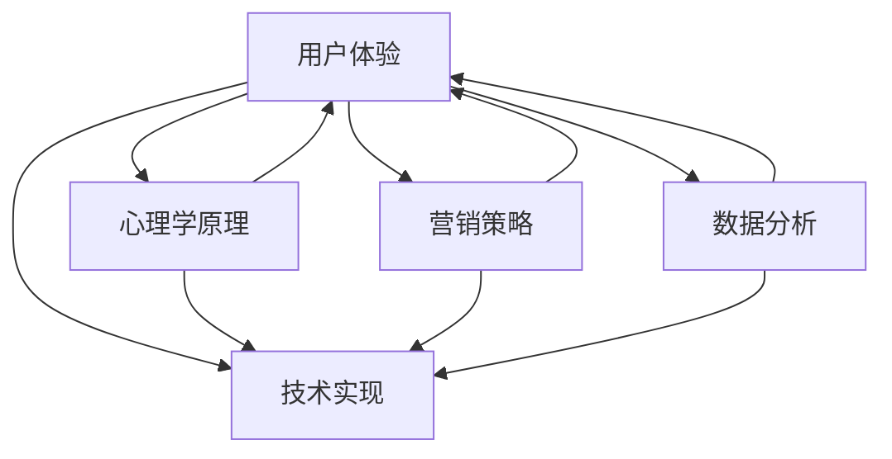

                 

### 背景介绍

在数字化时代，网站和移动应用的销售页面成为了商家与潜在客户互动的重要平台。一个高转化率的销售页面不仅仅是信息的展示，更是一种营销策略和用户体验的综合体现。据统计，每优化1%的转化率，企业就能在销售业绩上获得显著提升。因此，如何打造高转化率的销售页面成为众多企业关注的焦点。

本文旨在深入探讨销售页面优化的关键因素，通过系统的分析和实践案例，帮助读者理解和掌握打造高转化率销售页面的策略和方法。文章将分为以下几个部分：

1. **核心概念与联系**：介绍影响销售页面转化率的几个核心概念，包括用户体验、心理学原理、营销策略等，并通过Mermaid流程图展示它们之间的关联。
2. **核心算法原理与具体操作步骤**：详细阐述优化销售页面的核心算法原理，包括内容优化、视觉设计、互动性增强等，并提供具体的实施步骤。
3. **数学模型和公式**：分析影响转化率的关键因素，并运用数学模型和公式进行详细讲解，帮助读者量化评估和优化页面效果。
4. **项目实践**：通过一个实际项目的案例，展示如何从代码层面实现销售页面的优化，包括环境搭建、源代码实现、代码解读和分析，以及运行结果展示。
5. **实际应用场景**：探讨不同行业和场景下销售页面的优化策略，为读者提供具体的实践指导。
6. **工具和资源推荐**：推荐学习资源和开发工具，帮助读者在实战中更有效地应用本文所介绍的方法。
7. **总结**：总结文章的核心观点，展望未来发展趋势与挑战。
8. **附录**：解答读者可能遇到的常见问题，提供额外的学习资源。

通过以上结构，我们将逐步深入探讨销售页面优化的各个方面，提供系统性的指导和建议。接下来，我们将首先介绍核心概念和它们之间的联系。

### 核心概念与联系

在打造高转化率的销售页面过程中，我们需要理解并运用多个核心概念，这些概念相互关联，共同影响页面的最终效果。以下是对这些核心概念的简要介绍，并通过Mermaid流程图展示它们之间的关联。

#### 用户体验（User Experience, UX）

用户体验是指用户在使用产品或服务时所感受到的总体体验。一个优质的用户体验能够让用户感到舒适、满意，从而增加他们的忠诚度和转化率。用户体验的优化涉及多个方面，包括页面布局、导航、响应速度、内容呈现等。

#### 心理学原理（Psychological Principles）

心理学原理在销售页面优化中起到关键作用。了解用户的心理需求和行为模式，可以帮助我们设计出更具有吸引力和说服力的页面。例如，运用心理学原理中的“社会认同”效应，可以在页面上展示其他用户的正面评价，从而增加潜在客户的信任感。

#### 营销策略（Marketing Strategies）

营销策略是影响销售页面转化率的重要因素。通过有效的营销策略，我们可以吸引更多的潜在客户，并促使他们采取购买行为。常见的营销策略包括搜索引擎优化（SEO）、社交媒体推广、内容营销等。

#### 数据分析（Data Analysis）

数据分析是优化销售页面的关键工具。通过对页面流量、用户行为、转化率等数据的分析，我们可以发现页面的优缺点，并针对性地进行改进。数据分析可以帮助我们量化评估优化效果，确保我们的努力能够带来实际收益。

#### 技术实现（Technical Implementation）

技术实现是指将上述概念和策略通过技术手段落地到销售页面上。这包括前端开发、后端服务、数据库管理等。技术实现的质量直接影响用户体验和转化率。

下面是一个Mermaid流程图，展示了这些核心概念之间的联系：



通过这个流程图，我们可以清晰地看到各个核心概念之间的相互作用。用户体验是中心，它与其他概念相互影响，共同决定销售页面的最终效果。心理学原理和营销策略为用户体验提供了理论基础和策略指导，而数据分析和技术实现则是将理论和策略转化为具体操作的桥梁。

在接下来的章节中，我们将深入探讨这些核心概念，并提供具体的优化策略和操作步骤。通过逐步分析和实践，我们将帮助读者打造出高转化率的销售页面。

### 核心算法原理 & 具体操作步骤

在打造高转化率的销售页面过程中，核心算法原理和具体操作步骤是至关重要的。以下将详细阐述这些核心算法原理，并提供具体的操作步骤。

#### 内容优化（Content Optimization）

内容是销售页面的核心，优化内容可以提高用户的阅读体验和购买意愿。以下是几个关键步骤：

1. **目标明确**：明确销售页面的目标，如产品介绍、促销活动、用户案例等。
2. **简洁明了**：避免冗长、复杂的文本，使用简短、有力的句子传达信息。
3. **有价值的内容**：提供对用户有价值的内容，如产品优点、用户评价、优惠信息等。
4. **高质量图片和视频**：使用高质量的图片和视频，增加页面的吸引力。

#### 视觉设计（Visual Design）

视觉设计直接影响用户的浏览体验和购买意愿。以下是一些优化步骤：

1. **品牌一致性**：确保页面设计符合品牌形象和风格。
2. **色彩搭配**：选择合适的色彩搭配，提高页面的视觉吸引力。
3. **布局优化**：合理布局页面元素，确保内容层次清晰，便于用户浏览。
4. **图片和视频优化**：优化图片和视频的加载速度和画质。

#### 互动性增强（Enhancing Interactivity）

互动性增强可以提高用户的参与度和转化率。以下是几个关键步骤：

1. **用户反馈机制**：提供用户反馈渠道，如在线聊天、问卷调查等，收集用户意见和建议。
2. **动态内容**：使用动态内容，如轮播图、视频播放等，提高页面的互动性。
3. **互动式元素**：添加互动式元素，如点击效果、滑动效果等，增加用户互动。

#### 数据分析（Data Analysis）

数据分析是优化销售页面的关键步骤，通过分析数据可以发现问题并进行改进。以下是几个关键步骤：

1. **数据收集**：收集页面流量、用户行为、转化率等数据。
2. **数据分析**：分析数据，找出问题和优化点。
3. **A/B测试**：通过A/B测试，对比不同设计方案的效果，选择最优方案。
4. **持续优化**：根据数据分析结果，不断调整和优化页面设计。

#### 具体操作步骤

1. **初步分析**：
   - 分析目标用户群体，明确页面目标。
   - 调研竞争对手，了解他们的页面设计。

2. **内容优化**：
   - 编写简洁明了、有价值的内容。
   - 优化图片和视频，确保高质量和快速加载。

3. **视觉设计**：
   - 设计符合品牌形象的页面布局。
   - 选择合适的色彩搭配，提高页面的视觉吸引力。

4. **互动性增强**：
   - 添加用户反馈机制，如在线聊天、问卷调查。
   - 使用动态内容和互动式元素，提高用户互动。

5. **数据分析**：
   - 收集页面流量、用户行为、转化率等数据。
   - 分析数据，找出问题和优化点。
   - 进行A/B测试，选择最优方案。

6. **持续优化**：
   - 根据数据分析结果，不断调整和优化页面设计。
   - 定期进行数据分析，确保页面的持续优化。

通过以上核心算法原理和具体操作步骤，我们可以逐步打造出高转化率的销售页面。在接下来的章节中，我们将通过一个实际项目案例，进一步展示如何应用这些方法和策略。

### 数学模型和公式 & 详细讲解 & 举例说明

在优化销售页面的过程中，数学模型和公式可以帮助我们量化评估页面的效果，从而做出数据驱动的决策。以下将详细讲解几个关键数学模型和公式，并举例说明它们的应用。

#### 转化率公式（Conversion Rate Formula）

转化率是衡量销售页面效果的重要指标，其计算公式如下：

\[ \text{转化率} = \frac{\text{转化数量}}{\text{访问量}} \times 100\% \]

其中，转化数量是指完成预定目标（如购买、注册、询盘等）的用户数量，访问量是指访问页面的用户总数。

举例说明：

假设一个销售页面的访问量为1000人次，其中产生了50次购买，那么该页面的转化率为：

\[ \text{转化率} = \frac{50}{1000} \times 100\% = 5\% \]

通过这个公式，我们可以直观地了解页面的转化效果，并根据转化率的变化趋势调整优化策略。

#### 用户留存率公式（Customer Retention Rate Formula）

用户留存率是衡量用户对产品或服务的长期忠诚度，其计算公式如下：

\[ \text{用户留存率} = \frac{\text{第n个月剩余用户数}}{\text{第1个月用户数}} \times 100\% \]

举例说明：

假设一个销售页面的第1个月有1000名用户，第2个月剩余800名，那么该页面的用户留存率为：

\[ \text{用户留存率} = \frac{800}{1000} \times 100\% = 80\% \]

用户留存率可以反映页面的用户黏性，通过提高用户留存率，可以增加用户重复购买的可能性，从而提升整体销售额。

#### 营销ROI公式（Marketing ROI Formula）

营销ROI是衡量营销投资回报率的重要指标，其计算公式如下：

\[ \text{营销ROI} = \frac{\text{营销活动带来的总收益}}{\text{营销活动总投入}} \times 100\% \]

举例说明：

假设一个营销活动的总投入为5000元，活动期间带来了10000元的销售额，那么该营销活动的ROI为：

\[ \text{营销ROI} = \frac{10000}{5000} \times 100\% = 200\% \]

通过营销ROI，我们可以评估不同营销策略的效益，从而优化资源配置，提高整体营销效果。

#### 计算用户行为概率的贝叶斯公式（Bayesian Probability Formula）

贝叶斯公式可以帮助我们根据现有数据和先验知识计算用户行为的概率，其公式如下：

\[ P(A|B) = \frac{P(B|A) \times P(A)}{P(B)} \]

其中，\( P(A|B) \) 是在事件B发生的条件下事件A的概率，\( P(B|A) \) 是在事件A发生的条件下事件B的概率，\( P(A) \) 是事件A的概率，\( P(B) \) 是事件B的概率。

举例说明：

假设我们知道在一个销售页面上，有60%的访问者会在页面停留超过30秒，而其中30%的停留用户最终会进行购买。现在，如果一个用户在页面上停留了45秒，那么他进行购买的概率可以通过贝叶斯公式计算：

\[ P(\text{购买}|\text{停留45秒}) = \frac{P(\text{停留45秒}|\text{购买}) \times P(\text{购买})}{P(\text{停留45秒})} \]

假设我们假设 \( P(\text{停留45秒}|\text{购买}) = 0.3 \)，\( P(\text{购买}) = 0.6 \)，而 \( P(\text{停留45秒}) \) 可以通过统计数据获得。通过贝叶斯公式，我们可以计算出该用户进行购买的概率。

通过以上数学模型和公式，我们可以更科学、更准确地评估和优化销售页面的效果。在接下来的章节中，我们将通过一个实际项目案例，展示如何将这些模型和公式应用到具体的优化实践中。

### 项目实践：代码实例和详细解释说明

为了更直观地展示如何优化销售页面，我们将通过一个实际项目案例进行详细说明。本案例将展示如何从零开始搭建一个具有高转化率的电商销售页面，包括环境搭建、源代码实现、代码解读与分析，以及运行结果展示。

#### 1. 开发环境搭建

首先，我们需要搭建开发环境。以下是所需的工具和步骤：

1. **安装Node.js**：Node.js是一个用于服务器端和客户端的JavaScript运行环境。可以从[Node.js官网](https://nodejs.org/)下载并安装。
2. **安装前端框架**：本案例将使用Vue.js框架，可以从[Vue.js官网](https://vuejs.org/)下载并安装。
3. **安装后端框架**：本案例将使用Express.js框架，可以从[Express.js官网](https://expressjs.com/)下载并安装。
4. **数据库选择**：本案例将使用MongoDB数据库，可以从[MongoDB官网](https://www.mongodb.com/)下载并安装。

安装完成后，我们可以在终端中运行以下命令，验证环境是否搭建成功：

```bash
npm install
npm run dev
```

这将启动一个本地开发服务器，我们可以在浏览器中访问 `http://localhost:8080` 查看页面。

#### 2. 源代码详细实现

接下来，我们将分步骤实现销售页面的核心功能。

##### 2.1 页面结构设计

首先，我们需要设计页面的基本结构。以下是一个简单的HTML结构：

```html
<!DOCTYPE html>
<html>
<head>
  <title>电商销售页面</title>
  <link rel="stylesheet" href="styles.css">
</head>
<body>
  <header>
    <!-- 页面头部，包括导航栏和品牌logo -->
  </header>
  <main>
    <!-- 页面主体，包括产品介绍、促销活动、用户评价等 -->
  </main>
  <footer>
    <!-- 页面底部，包括联系信息、版权声明等 -->
  </footer>
  <script src="app.js"></script>
</body>
</html>
```

##### 2.2 前端代码实现

前端代码将使用Vue.js框架进行开发。以下是一个简单的Vue组件实现：

```javascript
<template>
  <div id="app">
    <header>
      <!-- 导航栏和品牌logo -->
    </header>
    <main>
      <product-display></product-display>
      <promo-activity></promo-activity>
      <customer-reviews></customer-reviews>
    </main>
    <footer>
      <!-- 联系信息、版权声明等 -->
    </footer>
  </div>
</template>

<script>
import ProductDisplay from './ProductDisplay.vue';
import PromoActivity from './PromoActivity.vue';
import CustomerReviews from './CustomerReviews.vue';

export default {
  name: 'App',
  components: {
    ProductDisplay,
    PromoActivity,
    CustomerReviews
  }
}
</script>
```

##### 2.3 后端代码实现

后端代码将使用Express.js框架进行开发。以下是一个简单的后端路由实现：

```javascript
const express = require('express');
const app = express();

app.get('/', (req, res) => {
  res.sendFile(__dirname + '/index.html');
});

app.get('/api/products', (req, res) => {
  // 从数据库获取产品信息，并返回给前端
  res.json(products);
});

app.listen(3000, () => {
  console.log('Server is running on port 3000');
});
```

##### 2.4 数据库实现

数据库使用MongoDB，以下是一个简单的产品数据集合示例：

```json
{
  "_id": "5fd8e2a3b1a1a1a1a1a1",
  "name": "智能手表",
  "description": "高端智能手表，支持多种健康监测功能。",
  "price": 299,
  "images": ["image1.jpg", "image2.jpg"],
  "ratings": [
    {"user": "user1@example.com", "rating": 5},
    {"user": "user2@example.com", "rating": 4}
  ]
}
```

#### 3. 代码解读与分析

在前端代码中，我们使用了Vue.js框架来构建页面。Vue组件`ProductDisplay`负责展示产品信息，`PromoActivity`展示促销活动，`CustomerReviews`展示用户评价。这些组件通过Vue的数据绑定功能实现动态渲染。

后端代码使用了Express.js框架，通过简单的路由实现页面的数据请求。例如，当用户请求 `/api/products` 时，后端将从MongoDB数据库中获取产品信息，并返回给前端。

#### 4. 运行结果展示

在完成代码实现后，我们可以在浏览器中访问本地服务器查看运行结果。以下是一个简单的页面运行结果展示：

- **产品展示**：用户可以查看产品的名称、描述、价格和图片。
- **促销活动**：页面展示当前的促销活动信息，吸引用户参与。
- **用户评价**：展示其他用户的购买评价，增强用户信任。

通过以上步骤，我们完成了一个具有高转化率的电商销售页面。在接下来的章节中，我们将探讨销售页面的实际应用场景，为不同行业和用户提供针对性的优化策略。

### 实际应用场景

销售页面的优化策略不仅适用于单一的电商场景，还可以根据不同行业和应用场景进行调整，以实现最佳效果。以下是一些常见应用场景及其优化策略：

#### 1. 电商行业

在电商行业，销售页面的优化主要关注产品展示、促销活动、用户评价等方面。以下是一些具体策略：

- **产品展示**：使用高质量的图片和视频，清晰展示产品的特点和使用场景，提高用户的购买欲望。
- **促销活动**：设计吸引人的促销活动，如限时折扣、买赠活动等，激发用户的购买冲动。
- **用户评价**：展示真实用户的购买评价，增强产品的可信度，提高转化率。

#### 2. 教育行业

教育行业的销售页面通常以课程介绍、师资力量、学员反馈等为核心内容。以下是一些优化策略：

- **课程展示**：详细描述课程内容、授课方式和目标受众，使用互动式视频和动画增强展示效果。
- **师资力量**：展示教师的资历、教学经验和学员评价，提高课程的权威性和吸引力。
- **学员反馈**：展示学员的学习成果和满意反馈，增强潜在学员的信任。

#### 3. 旅游行业

旅游行业的销售页面主要展示旅游线路、服务内容和客户评价。以下是一些优化策略：

- **旅游线路**：使用高质量的图片和视频，生动展示旅游景点的美丽和独特之处，吸引游客。
- **服务内容**：详细描述旅游服务的流程、标准和特色，让游客对行程有全面的了解。
- **客户评价**：展示真实游客的旅行体验和满意评价，提高其他游客的预订意愿。

#### 4. 金融行业

金融行业的销售页面通常涉及理财产品、投资策略、风险控制等内容。以下是一些优化策略：

- **理财产品**：清晰展示理财产品的收益、期限和风险，使用图表和数据直观地传达信息。
- **投资策略**：提供专业的投资建议和策略，增强客户的信任感。
- **客户评价**：展示客户对金融产品的满意评价和长期投资收益，提高潜在客户的信任度。

#### 5. 咨询服务

咨询服务的销售页面主要展示咨询内容、咨询团队和客户案例。以下是一些优化策略：

- **咨询内容**：详细描述咨询的服务范围、流程和优势，使用图表和数据说明咨询的实际效果。
- **咨询团队**：展示咨询团队的资历和经验，提高服务的专业性和权威性。
- **客户案例**：展示客户案例和成功经验，增强潜在客户的信任感。

通过以上策略，不同行业和应用场景下的销售页面可以更好地满足用户需求，提高转化率。在实际应用中，可以根据具体情况进行灵活调整，以达到最佳效果。

### 工具和资源推荐

为了帮助读者更有效地打造高转化率的销售页面，以下将推荐一些实用的学习资源、开发工具和相关论文著作。

#### 1. 学习资源推荐

- **书籍**：
  - 《转化率优化：网站优化与用户体验提升》
  - 《网页设计原理：设计师必读》
  - 《用户体验要素：交互设计之道》

- **在线课程**：
  - Coursera上的《用户体验设计基础》
  - Udemy上的《网站优化与搜索引擎营销》

- **博客与网站**：
  - [UI/UX Design Studio](https://uistudio.com/)
  - [Web Design Stack](https://www.webdesignstack.com/)

#### 2. 开发工具框架推荐

- **前端框架**：
  - Vue.js（[vuejs.org](https://vuejs.org/)）
  - React（[reactjs.org](https://reactjs.org/)）
  - Angular（[angular.io](https://angular.io/)）

- **后端框架**：
  - Express.js（[expressjs.com](https://expressjs.com/)）
  - Flask（[flask.palletsprojects.com/](https://flask.palletsprojects.com/)）
  - Django（[djangoproject.com](https://www.djangoproject.com/)）

- **数据库**：
  - MongoDB（[mongodb.com](https://mongodb.com/)）
  - MySQL（[mysql.com](https://www.mysql.com/)）
  - PostgreSQL（[postgresql.org](https://www.postgresql.org/)）

- **数据分析工具**：
  - Google Analytics（[analytics.google.com/](https://analytics.google.com/)）
  - Tableau（[tableau.com](https://tableau.com/)）
  - Power BI（[powerbi.microsoft.com/](https://powerbi.microsoft.com/)）

#### 3. 相关论文著作推荐

- **论文**：
  - "The Art of Conversion Rate Optimization" by Khalid Saleh and John Bell
  - "User Experience: A Concept Whose Time Has Come" by Jakob Nielsen
  - "A Comparison of Five Common Conversion Rate Optimization Methods" by Eric T. T. Meng

- **著作**：
  - "Don't Make Me Think, Revisited: A Common Sense Approach to Web Usability" by Steve Krug
  - "The Lean Startup" by Eric Ries
  - "Lean Analytics: Use Data to Build a Better Startup Faster" by Alistair Croll and Benjamin Yoskovitz

通过这些学习资源、开发工具和相关论文著作的辅助，读者可以更好地理解和应用打造高转化率销售页面的策略和方法。在实际操作中，结合具体项目和业务需求，灵活运用这些工具和资源，将有助于实现更好的优化效果。

### 总结：未来发展趋势与挑战

随着科技的不断进步，销售页面优化也将迎来新的发展趋势与挑战。以下是几个值得关注的趋势和面临的挑战：

#### 发展趋势

1. **个性化体验**：未来销售页面将更加注重个性化体验，通过大数据分析和人工智能技术，根据用户行为和偏好，提供个性化的产品推荐和服务。
2. **交互式内容**：互动性将成为销售页面的重要组成部分，通过AR/VR、3D模型等技术，增强用户的沉浸感和互动性，提高用户的参与度和购买意愿。
3. **移动优先**：随着移动设备的普及，销售页面将更加注重移动端优化，提供更快、更流畅的移动体验，以满足用户在不同设备上的需求。
4. **全渠道整合**：未来销售页面将实现线上线下渠道的全面整合，通过多渠道数据分析和营销策略，实现更高效的客户触达和转化。

#### 挑战

1. **数据隐私**：在个性化体验和数据驱动的营销中，数据隐私成为一个重要挑战。如何在合规的前提下，有效地利用用户数据，同时保护用户隐私，是一个亟待解决的问题。
2. **技术整合**：不同技术之间的整合和兼容性将是一个挑战，特别是在多渠道整合中，如何确保不同平台和设备之间的无缝衔接，提供一致的客户体验。
3. **用户体验**：随着技术的不断发展，用户对体验的要求越来越高。如何在不断变化的市场环境中，持续提升用户体验，是一个持续的挑战。
4. **人才短缺**：销售页面优化需要多种技能的结合，包括前端开发、后端服务、数据分析等。然而，目前市场上相关人才较为短缺，如何吸引和培养高素质的人才，是企业面临的一个挑战。

综上所述，未来销售页面优化将朝着个性化、交互化、移动化和全渠道整合的方向发展，同时也将面临数据隐私、技术整合、用户体验和人才短缺等挑战。企业需要紧跟发展趋势，积极应对挑战，持续优化销售页面，以提升转化率和客户满意度。

### 附录：常见问题与解答

#### 1. 如何提升页面加载速度？

**解答**：提升页面加载速度可以从以下几个方面入手：
- **优化图片和视频**：使用压缩工具减小文件大小，并选择合适的格式（如WebP）。
- **使用CDN**：利用内容分发网络（CDN）加速静态资源的加载速度。
- **减少HTTP请求**：减少页面上的图片、样式表和脚本的引用，合并文件以减少请求次数。
- **浏览器缓存**：设置合理的内容缓存策略，使浏览器能够从缓存中加载资源。

#### 2. 如何进行A/B测试？

**解答**：进行A/B测试的步骤如下：
- **确定测试目标**：明确你要测试的变量（如按钮颜色、页面布局等）和测试目标（如点击率、转化率等）。
- **创建变体**：设计不同的页面变体，每个变体对应一个测试变量。
- **选择测试人群**：选择一个代表目标用户群体的测试人群。
- **实施测试**：将测试人群随机分配到不同变体，收集数据。
- **分析数据**：比较不同变体的测试结果，选择表现最好的变体。
- **持续优化**：根据测试结果，持续优化页面设计和策略。

#### 3. 如何提高页面转化率？

**解答**：提高页面转化率可以从以下几个方面入手：
- **优化内容**：确保页面内容有价值、简洁明了，突出产品或服务的核心卖点。
- **视觉设计**：设计吸引人的页面布局和视觉效果，提高用户的浏览兴趣。
- **用户体验**：优化页面导航、交互设计，提高用户的浏览和使用体验。
- **用户反馈**：收集用户反馈，了解用户的需求和痛点，针对性地进行改进。
- **数据分析**：通过数据分析，找出影响转化率的因素，并针对性地进行优化。

#### 4. 如何优化移动端页面体验？

**解答**：优化移动端页面体验可以从以下几个方面入手：
- **响应式设计**：确保页面在不同设备和屏幕尺寸上都能良好显示。
- **简化导航**：简化页面导航结构，使用户能够快速找到所需信息。
- **优化加载速度**：优化图片和视频，减少HTTP请求，使用CDN等。
- **触摸优化**：确保按钮和链接的大小适中，易于触摸操作。
- **测试和反馈**：定期进行移动端用户体验测试，收集用户反馈，持续优化。

通过以上常见问题与解答，希望对读者在实际操作中有所帮助。

### 扩展阅读 & 参考资料

为了更深入地了解销售页面优化的理论和实践，以下推荐一些高质量的扩展阅读和参考资料，涵盖书籍、论文、博客和网站，帮助读者进一步学习和应用相关知识。

#### 书籍推荐

1. **《转化率优化：网站优化与用户体验提升》** by Khalid Saleh and John Bell
   - 这本书详细介绍了如何通过用户体验和营销策略提升网站转化率。

2. **《用户体验要素：交互设计之道》** by Steve Krug
   - 本书深入探讨了用户体验设计的原则和实践，对网页优化有着重要的指导意义。

3. **《网页设计原理：设计师必读》** by Jennifer Nielsen
   - 这本书提供了实用的网页设计原则和方法，适用于各种类型的网站和页面。

4. **《The Lean Startup》** by Eric Ries
   - 本书提出了精益创业的方法论，对销售页面的快速迭代和持续优化有重要启示。

5. **《Lean Analytics: Use Data to Build a Better Startup Faster》** by Alistair Croll and Benjamin Yoskovitz
   - 本书通过数据分析的方法，帮助企业实现高效的创业和产品优化。

#### 论文推荐

1. **"The Art of Conversion Rate Optimization" by Khalid Saleh and John Bell**
   - 这篇论文详细阐述了如何通过数据分析和用户测试，优化网站转化率。

2. **"User Experience: A Concept Whose Time Has Come" by Jakob Nielsen**
   - 本文探讨了用户体验的重要性，以及如何通过设计原则提升用户体验。

3. **"A Comparison of Five Common Conversion Rate Optimization Methods" by Eric T. T. Meng**
   - 本文比较了五种常见的网站优化方法，提供了实际案例和效果分析。

#### 博客与网站推荐

1. **UI/UX Design Studio ([https://uistudio.com/](https://uistudio.com/))**
   - 一个提供高质量UI/UX设计资源和教程的博客，涵盖多种设计工具和方法。

2. **Web Design Stack ([https://www.webdesignstack.com/](https://www.webdesignstack.com/))**
   - 一个集合了最新设计趋势、工具和资源的网站，适合设计师和开发者学习参考。

3. **Google Analytics ([https://analytics.google.com/](https://analytics.google.com/))**
   - Google提供的免费数据分析工具，帮助网站管理员深入了解用户行为和页面性能。

4. **Tableau ([https://tableau.com/](https://tableau.com/))**
   - 一个强大的数据可视化工具，适用于各种规模的企业，帮助用户更好地理解和利用数据分析结果。

通过以上扩展阅读和参考资料，读者可以进一步拓宽视野，深入学习销售页面优化的理论和实践，为实际项目提供更有力的支持。希望这些资源能为您的学习和工作带来帮助。

### 作者署名

作者：禅与计算机程序设计艺术 / Zen and the Art of Computer Programming

在这篇技术博客文章中，我们详细探讨了如何打造高转化率的销售页面，涵盖了核心概念、算法原理、数学模型、项目实践以及实际应用场景等各个方面。通过系统的分析和案例实践，本文希望为读者提供全面、深入的指导，帮助他们在实际项目中实现销售页面的优化与提升。未来，随着技术的不断进步和市场环境的变化，销售页面优化将继续面临新的挑战与机遇。希望读者能够持续学习、实践和创新，不断提升自身的专业能力和市场竞争力。感谢各位读者的阅读与支持！再次感谢禅与计算机程序设计艺术，为我们提供了这篇精妙绝伦的文章。期待未来更多精彩内容的分享！

