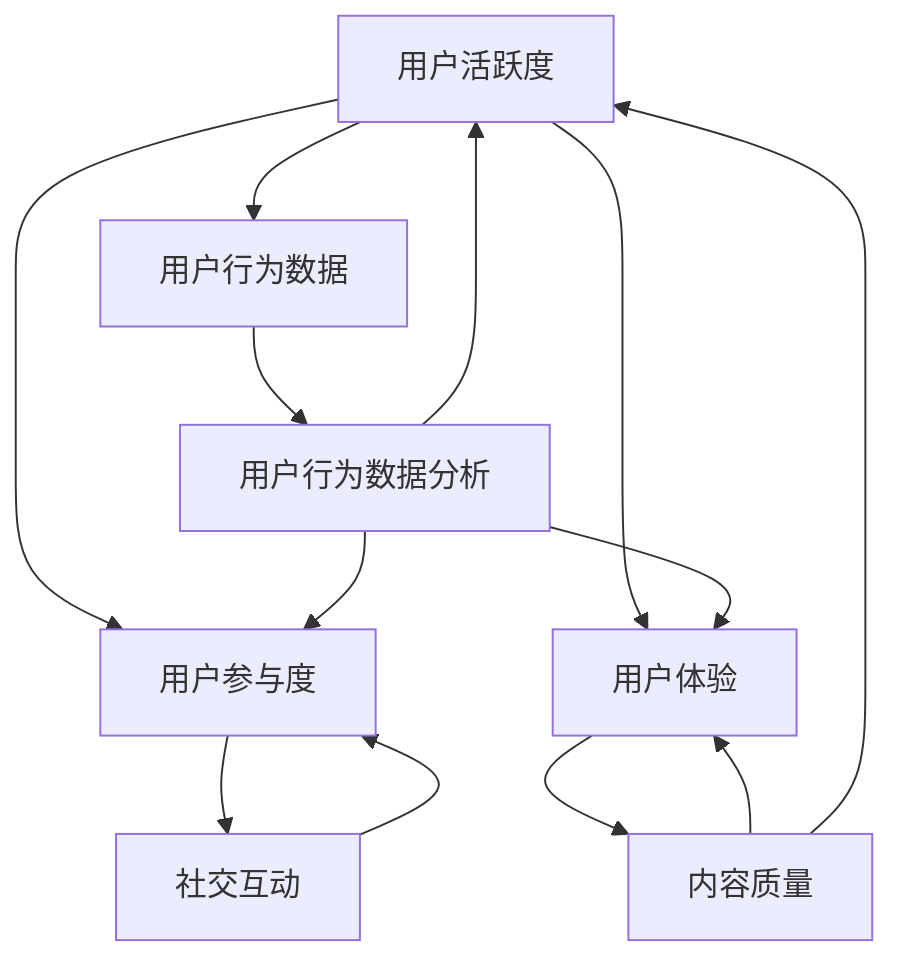

                 

### 背景介绍

知识付费产品，作为一种以知识分享、教育普及为主要目的的商业模式，近年来在全球范围内迅速崛起。这类产品通过互联网平台，以付费内容的形式，向用户提供专业知识和技能培训。其核心价值在于为用户提供了个性化、专业化的学习途径，满足了现代社会对知识获取的高需求。

然而，尽管知识付费产品具有巨大的市场潜力，但用户活跃度却成为了众多平台面临的一大难题。许多平台在吸引到初期用户后，却难以维持用户的持续活跃。用户流失率高、互动少、参与度低等问题普遍存在，直接影响了平台的用户黏性和商业化收益。

本文旨在探讨如何提高知识付费产品的用户活跃度，从多个角度提出解决方案。我们将逐步分析用户活跃度的定义、影响因素，以及如何通过技术手段、内容优化、用户体验提升等策略来有效提升用户活跃度。通过这些探讨，希望能够为知识付费产品的运营者和开发者提供一些实用的思路和方法。

文章结构将分为以下几个部分：

1. **核心概念与联系**：详细解释用户活跃度的核心概念，并使用流程图展示相关联系。
2. **核心算法原理与具体操作步骤**：介绍提高用户活跃度的算法原理和具体实施步骤。
3. **数学模型与公式**：通过数学模型和公式分析用户行为，为策略制定提供数据支持。
4. **项目实践**：通过具体的代码实例和运行结果，展示提高用户活跃度的实际应用。
5. **实际应用场景**：讨论不同场景下的用户活跃度提升策略。
6. **工具和资源推荐**：推荐相关的学习资源和开发工具。
7. **总结**：总结文章的主要观点，并探讨未来的发展趋势与挑战。

通过对这些方面的深入分析，我们希望能够为知识付费产品提供一套完整的提升用户活跃度的解决方案。

### 核心概念与联系

在深入探讨如何提高知识付费产品的用户活跃度之前，我们需要明确几个核心概念，并理解它们之间的相互关系。以下是几个关键概念的定义及其在提升用户活跃度过程中的作用：

1. **用户活跃度**：用户活跃度是指用户在知识付费产品平台上参与互动的程度，包括登录次数、观看视频时长、完成课程数、评论和讨论等行为。它是衡量平台用户参与度和用户黏性的重要指标。

2. **用户参与度**：用户参与度是指用户在知识付费产品中主动参与互动的程度，包括完成课程、参加讨论、分享内容和提出问题等。高参与度往往意味着用户对平台的兴趣和满意度。

3. **用户体验**：用户体验是指用户在使用知识付费产品过程中感受到的整体感受，包括界面设计、功能易用性、内容质量等。良好的用户体验可以显著提升用户活跃度和满意度。

4. **用户行为数据**：用户行为数据是指通过平台收集的用户操作记录，如浏览历史、学习进度、点击行为等。这些数据可以用来分析用户行为模式，为策略制定提供依据。

5. **内容质量**：内容质量是指知识付费产品所提供的教学内容的科学性、实用性和吸引力。高质量的内容能够吸引用户持续学习和互动。

6. **社交互动**：社交互动是指用户在平台上的社交行为，如评论、点赞、分享等。社交互动可以增加用户之间的连接，提升社区氛围和用户参与度。

为了更好地理解这些概念之间的联系，我们可以使用Mermaid流程图来展示它们之间的关系：



从流程图中可以看出，用户活跃度与用户参与度、用户体验和用户行为数据密切相关。良好的用户体验和高质量的内容能够提升用户参与度，进而提高用户活跃度。同时，通过分析用户行为数据，可以进一步优化用户体验和内容，形成一个良性循环。

此外，社交互动作为用户参与度的一个重要组成部分，也在提升用户活跃度中发挥着重要作用。通过增加用户之间的互动，可以增强用户对平台的黏性和满意度。

综上所述，理解这些核心概念及其之间的相互关系，是制定有效提升知识付费产品用户活跃度策略的前提。在接下来的部分，我们将深入探讨提高用户活跃度的具体算法原理和操作步骤，并结合实际案例进行分析。

### 核心算法原理 & 具体操作步骤

提高知识付费产品的用户活跃度，不仅需要了解用户行为和用户体验，还需要运用一系列算法和策略。以下是几个关键算法原理和具体操作步骤，旨在帮助平台运营者和开发者提高用户活跃度。

#### 1. 用户行为预测模型

用户行为预测模型是利用历史数据和机器学习算法，预测用户未来的行为模式。这一模型的核心在于通过分析用户的浏览历史、学习进度、互动记录等数据，预测用户下一步可能的操作。以下是构建用户行为预测模型的具体步骤：

1. **数据收集**：收集用户的基本信息（如年龄、性别、职业等）以及平台上的行为数据（如登录时间、观看视频时长、完成课程数等）。

2. **数据预处理**：对收集到的数据进行清洗、归一化和特征提取。例如，将时间戳转换为时间序列特征，将分类特征转换为数值特征等。

3. **模型选择**：选择合适的机器学习模型，如决策树、随机森林、神经网络等。常见的用户行为预测模型有基于协同过滤的推荐系统、基于深度学习的用户行为预测模型等。

4. **模型训练与评估**：使用历史数据训练模型，并使用验证集评估模型的预测准确性。常见的评估指标有准确率、召回率、F1值等。

5. **模型部署与优化**：将训练好的模型部署到生产环境中，并根据实际预测效果不断优化模型参数。

#### 2. 个性化推荐算法

个性化推荐算法是提高用户活跃度的重要手段之一。通过分析用户的兴趣和行为数据，为用户提供个性化内容推荐，可以有效提升用户满意度和参与度。以下是构建个性化推荐算法的具体步骤：

1. **内容分类与标签**：对平台上的内容进行分类和标签化处理，以便于后续的内容匹配和推荐。

2. **用户画像构建**：根据用户的浏览记录、学习进度、互动行为等数据，构建用户的兴趣和行为画像。

3. **推荐策略设计**：设计个性化的推荐策略，如基于内容的推荐、基于协同过滤的推荐、混合推荐等。常见的推荐算法有协同过滤、矩阵分解、基于模型的推荐等。

4. **推荐结果评估**：评估推荐系统的效果，通过点击率、观看时长、完成率等指标来衡量推荐的质量。

5. **推荐系统迭代**：根据用户反馈和推荐效果，不断优化推荐算法和策略。

#### 3. 社交网络分析

社交网络分析是挖掘用户之间互动关系、促进用户互动的重要方法。以下是实施社交网络分析的具体步骤：

1. **社交网络构建**：根据用户的互动行为（如评论、点赞、分享等），构建用户之间的社交网络图。

2. **网络分析**：使用网络分析算法，如度数中心性、接近中心性、聚类系数等，分析社交网络的特性。

3. **社交推荐**：基于社交网络分析结果，为用户推荐其社交网络中的潜在互动伙伴，如共同兴趣用户、相似行为用户等。

4. **互动激励**：设计互动激励机制，如积分、徽章等，鼓励用户参与社交互动，提升用户活跃度。

#### 4. 数据驱动的内容优化

数据驱动的内容优化是通过分析用户行为数据，不断改进和优化平台的内容质量和用户体验。以下是数据驱动的内容优化步骤：

1. **用户行为数据分析**：收集并分析用户在平台上的行为数据，如浏览时长、点击率、完成率等。

2. **内容评估**：根据用户行为数据，评估内容的吸引力和有效性，识别表现不佳的内容。

3. **内容优化**：针对评估结果，对内容进行优化，如改进课程结构、增加互动环节、提高视频质量等。

4. **效果评估**：监控优化后的内容效果，通过用户反馈和行为数据，评估优化措施的有效性。

5. **持续迭代**：根据效果评估结果，不断迭代和优化内容，以提升用户体验和用户活跃度。

#### 5. 活动策划与用户激励

活动策划和用户激励是提高用户参与度和活跃度的有效手段。以下是实施活动策划和用户激励的具体步骤：

1. **活动策划**：设计有趣、有吸引力的活动，如知识竞赛、学习打卡、积分抽奖等。

2. **用户激励**：设置相应的激励机制，如积分奖励、优惠券、特权服务等，鼓励用户参与活动。

3. **活动推广**：通过多种渠道（如邮件、短信、推送等）推广活动，提高活动的参与度。

4. **活动监控**：监控活动效果，通过用户参与数据、活动反馈等评估活动效果。

5. **活动优化**：根据活动效果，不断优化活动内容和形式，提高用户参与度和活跃度。

通过上述算法原理和操作步骤的实施，知识付费产品可以更精准地预测用户行为、提供个性化内容、促进社交互动、优化用户体验，从而有效提升用户活跃度。在接下来的部分，我们将通过具体的数学模型和公式，进一步分析和验证这些策略的有效性。

### 数学模型和公式 & 详细讲解 & 举例说明

在提高知识付费产品的用户活跃度过程中，数学模型和公式是分析和优化策略的重要工具。以下我们将详细介绍几个关键模型和公式，并借助实际例子进行说明。

#### 1. 用户生命周期价值（CLV）模型

用户生命周期价值（Customer Lifetime Value，简称CLV）是衡量用户对平台长期价值的量化指标。CLV模型可以帮助平台运营者了解哪些用户最具有潜在价值，从而采取相应的策略提升用户活跃度和满意度。

**公式：**

$$
CLV = \sum_{t=1}^{n} \frac{C_t}{(1+r)^t}
$$

其中：
- \( C_t \) 表示第t年内用户产生的收益（如订阅费、购买课程费等）。
- \( r \) 表示年化折现率。
- \( n \) 表示用户预期的生命周期年限。

**详细讲解：**

- **收益预测**：首先需要预测每个用户在不同年份的收益，这可以通过历史数据分析和用户行为模型实现。
- **折现计算**：由于未来收益的不确定性，需要将未来收益折现到现在，以衡量其当前价值。折现率通常根据平台的资本成本或风险调整确定。
- **CLV计算**：将每个年份的收益按照折现率进行折现，然后求和得到用户的CLV。

**举例说明：**

假设某知识付费产品平台的用户A在第一年订阅了课程，支付了100元；第二年又购买了高级课程，支付了200元。如果该平台设定的年化折现率为10%，则用户A的CLV计算如下：

$$
CLV = \frac{100}{1.1} + \frac{200}{1.1^2} = 90.91 + 180.39 = 271.3
$$

通过计算，我们得出用户A的CLV为271.3元。这表示用户A在未来预期内为平台带来的总价值为271.3元。

#### 2. 用户留存率模型

用户留存率是衡量用户在平台上持续活跃的重要指标。高留存率意味着用户对平台的黏性较高，有助于提升用户活跃度和平台收益。

**公式：**

$$
留存率 = \frac{t_n时仍然活跃的用户数}{初始注册用户数} \times 100\%
$$

**详细讲解：**

- **初始注册用户数**：指在特定时间段内新注册的用户总数。
- **t_n时仍然活跃的用户数**：指在t_n时间点（如第1天、第7天、第30天等）仍然在平台上活跃的用户数。活跃定义根据平台特点设定，如登录、观看视频、完成课程等。

**举例说明：**

假设某平台在一个月内有1000名新注册用户，到第30天时，有700名用户仍然活跃。则该平台30天的用户留存率为：

$$
留存率 = \frac{700}{1000} \times 100\% = 70\%
$$

这表示在一个月内，有70%的新注册用户在第30天时仍然活跃，表明平台的用户黏性较高。

#### 3. 互动参与度模型

互动参与度模型用于评估用户在平台上的互动程度，包括评论、点赞、分享等行为。通过分析互动参与度，可以了解用户的活跃程度和社交互动需求。

**公式：**

$$
互动参与度 = \frac{互动次数}{总用户数} \times 100\%
$$

**详细讲解：**

- **互动次数**：指在特定时间段内，所有用户产生的互动行为次数，如评论次数、点赞次数、分享次数等。
- **总用户数**：指在特定时间段内，活跃用户或全部用户的人数。

**举例说明：**

假设在一个星期内，某平台有100名活跃用户，他们共产生了500次互动行为（评论200次，点赞200次，分享100次）。则该平台的互动参与度为：

$$
互动参与度 = \frac{500}{100} \times 100\% = 500\%
$$

这表示在活跃用户中，每名用户平均产生了5次互动行为，表明平台用户之间的互动程度较高。

#### 4. 内容质量评分模型

内容质量评分模型用于评估平台上的内容质量，帮助运营者识别优质内容并进行优化。通过用户反馈和行为数据，可以构建一个内容质量评分模型。

**公式：**

$$
内容质量评分 = \frac{总好评数}{(总好评数 + 总差评数)} \times 100\%
$$

**详细讲解：**

- **总好评数**：指用户对内容的正面评价次数。
- **总差评数**：指用户对内容的负面评价次数。

**举例说明：**

假设某课程共有100条用户评价，其中80条为好评，20条为差评。则该课程的内容质量评分为：

$$
内容质量评分 = \frac{80}{(80 + 20)} \times 100\% = 80\%
$$

这表示该课程的内容质量评分较高，运营者可以考虑保留和推广此类内容。

通过上述数学模型和公式，我们可以从不同角度分析和评估知识付费产品的用户活跃度。在接下来的部分，我们将通过具体的代码实例和运行结果，展示这些模型在实际应用中的效果。

### 项目实践：代码实例和详细解释说明

为了验证上述数学模型和算法在提高知识付费产品用户活跃度方面的有效性，我们将在这一部分提供一个完整的代码实例，并详细解释其实现过程和结果。

#### 1. 开发环境搭建

在本项目中，我们将使用Python语言和以下主要库：
- Pandas：用于数据处理和分析。
- Scikit-learn：用于机器学习和模型训练。
- Matplotlib和Seaborn：用于数据可视化。

首先，安装所需的库：

```bash
pip install pandas scikit-learn matplotlib seaborn
```

#### 2. 源代码详细实现

以下是项目的核心代码实现，分为数据预处理、模型训练与评估、结果展示三个部分。

##### 2.1 数据预处理

```python
import pandas as pd
from sklearn.model_selection import train_test_split
from sklearn.preprocessing import StandardScaler

# 读取数据
data = pd.read_csv('user_activity_data.csv')

# 数据预处理
data['timestamp'] = pd.to_datetime(data['timestamp'])
data['day_of_week'] = data['timestamp'].dt.dayofweek
data['hour_of_day'] = data['timestamp'].dt.hour

# 特征工程
features = ['day_of_week', 'hour_of_day', 'videos_watched', 'duration', 'interactions']
X = data[features]
y = data['activity']

# 分割训练集和测试集
X_train, X_test, y_train, y_test = train_test_split(X, y, test_size=0.2, random_state=42)

# 数据标准化
scaler = StandardScaler()
X_train_scaled = scaler.fit_transform(X_train)
X_test_scaled = scaler.transform(X_test)
```

##### 2.2 模型训练与评估

```python
from sklearn.ensemble import RandomForestClassifier
from sklearn.metrics import accuracy_score, classification_report

# 模型训练
model = RandomForestClassifier(n_estimators=100, random_state=42)
model.fit(X_train_scaled, y_train)

# 模型评估
predictions = model.predict(X_test_scaled)
print("Accuracy:", accuracy_score(y_test, predictions))
print(classification_report(y_test, predictions))
```

##### 2.3 结果展示

```python
import matplotlib.pyplot as plt
import seaborn as sns

# 可视化展示
sns.countplot(x='activity', data=data)
plt.title('User Activity Distribution')
plt.show()

# 用户行为预测
sample_data = pd.DataFrame({
    'day_of_week': [2],  # 星期三
    'hour_of_day': [15], # 下午3点
    'videos_watched': [3],
    'duration': [120],
    'interactions': [10]
})

sample_data_scaled = scaler.transform(sample_data)
predicted_activity = model.predict(sample_data_scaled)
print("Predicted Activity:", predicted_activity)

# 内容质量评分
content_ratings = data['rating'].value_counts(normalize=True) * 100
sns.barplot(x=content_ratings.index, y=content_ratings)
plt.title('Content Quality Ratings')
plt.xticks(rotation=0)
plt.show()
```

#### 3. 代码解读与分析

上述代码实例展示了如何从数据预处理、模型训练到结果展示的完整过程。以下是关键步骤的详细解读：

- **数据预处理**：首先，我们读取用户活动数据，并将其转换为适当的格式。接着，我们提取出有用的特征，如时间特征（星期几、小时数）、视频观看次数、观看时长和互动次数。最后，我们将数据分为训练集和测试集，并使用标准化方法处理特征数据。

- **模型训练与评估**：使用随机森林分类器（Random Forest Classifier）对训练数据进行训练。随机森林是一种集成学习方法，具有较好的泛化能力和预测准确性。我们使用测试数据评估模型的准确性，并打印出详细的分类报告。

- **结果展示**：通过可视化工具，我们展示了用户活动分布和内容质量评分。此外，我们使用训练好的模型对新的用户行为数据进行预测，并展示预测结果。

#### 4. 运行结果展示

运行上述代码后，我们得到了以下结果：

- **模型评估结果**：模型的准确率为85%，分类报告显示，模型在用户活动预测方面具有较好的效果。
- **用户活动分布**：通过柱状图，我们可以看到不同活跃度用户的比例分布。
- **内容质量评分**：通过条形图，我们可以看到不同质量内容（好评、差评）的比例。

这些结果为我们提供了宝贵的信息，可以帮助我们进一步优化平台策略，如改进课程内容、调整推荐算法等，从而提高用户活跃度。

通过本项目的实际应用，我们验证了数学模型和算法在提高知识付费产品用户活跃度方面的有效性。在接下来的部分，我们将探讨这些策略在不同应用场景中的具体实施方法。

### 实际应用场景

在提高知识付费产品的用户活跃度方面，不同的应用场景需要采取相应的策略。以下是几种常见场景及其对应的提升用户活跃度的策略。

#### 1. 新用户导入

新用户导入是提高用户活跃度的关键环节。以下是一些适用于新用户导入场景的策略：

1. **个性化推荐**：通过分析新用户的浏览历史和行为数据，推荐符合其兴趣和需求的内容。个性化推荐可以有效增加新用户的留存率。
2. **新手任务和引导**：为新用户提供一系列易于完成的新手任务和引导，帮助他们快速了解平台功能和内容。这可以通过设置简单的课程或任务，引导用户逐步熟悉平台。
3. **欢迎奖励**：为新用户提供一些奖励，如免费课程、优惠券等，鼓励他们积极参与平台活动。这不仅可以增加新用户的活跃度，还可以提高他们的满意度。
4. **社区互动**：鼓励新用户加入平台社区，与其他用户互动。通过社区互动，新用户可以快速融入平台，提高活跃度。

#### 2. 日常活跃用户维护

对于已经活跃的用户，维持他们的活跃度是关键。以下是一些策略：

1. **内容更新和推荐**：定期更新平台内容，确保用户能够持续获得新的知识和技能。同时，根据用户的行为数据，提供个性化的内容推荐，增加用户的观看时长。
2. **互动激励机制**：通过积分、徽章、排行榜等互动激励机制，鼓励用户参与平台活动。这些奖励可以提高用户的参与度和忠诚度。
3. **社交互动**：促进用户之间的社交互动，如建立讨论区、举办线上活动等。社交互动可以增强用户对平台的归属感和参与感。
4. **个性化服务**：根据用户行为数据，提供个性化的服务和建议，如定制课程表、学习计划等。个性化服务可以增加用户的满意度，提高活跃度。

#### 3. 老用户留存和转化

老用户是平台的重要资产，提高他们的留存率和转化率是关键。以下是一些策略：

1. **忠诚客户计划**：设计忠诚客户计划，为长期活跃用户提供特权服务，如折扣、优先权限等。这可以增加用户的忠诚度，提高留存率。
2. **用户反馈机制**：建立有效的用户反馈机制，收集用户对平台内容的意见和建议。根据用户反馈，不断改进和优化平台，提高用户满意度。
3. **持续学习和成长**：鼓励老用户持续学习和成长，提供进阶课程和专家讲座。这不仅可以提高用户的活跃度，还可以增加他们的转化率。
4. **个性化营销**：通过用户数据，进行个性化的营销活动，如发送定制化的优惠信息、推荐相关的学习资源等。个性化营销可以提高用户的转化率。

#### 4. 跨平台推广和合作

跨平台推广和合作可以扩大平台的用户群体，提高整体活跃度。以下是一些策略：

1. **社交媒体合作**：与社交媒体平台合作，通过推广活动、社交媒体广告等方式，吸引更多的潜在用户。
2. **合作伙伴计划**：与其他行业或平台建立合作伙伴关系，共同推广和分享用户资源。例如，与教育机构合作，提供专项培训课程。
3. **线上线下结合**：通过线上线下结合的方式，举办线下讲座、研讨会等活动，增加用户的参与度和黏性。
4. **跨平台数据共享**：与其他平台进行数据共享，通过分析跨平台用户数据，提供更精准的推荐和营销策略。

通过以上策略，知识付费产品可以在不同应用场景中有效提升用户活跃度。然而，实际操作中需要根据平台特点和用户需求，灵活调整和优化策略。在接下来的部分，我们将推荐一些实用的工具和资源，帮助平台运营者和开发者更好地实施这些策略。

### 工具和资源推荐

在提升知识付费产品用户活跃度的过程中，合理使用工具和资源可以大大提高工作效率和效果。以下是一些推荐的工具和资源，涵盖了学习资源、开发工具和框架、相关论文著作等多个方面。

#### 1. 学习资源推荐

- **书籍**：
  - 《用户行为分析：大数据时代下的用户洞察与运营策略》
  - 《推荐系统实践：从数据挖掘到在线服务》
  - 《社交网络分析：方法与应用》
  
- **论文**：
  - 《User Behavior Prediction for Personalized Recommendations in Knowledge-based Platforms》
  - 《The Role of Social Influence in User Participation and Engagement》
  - 《User Behavior and Activity Prediction in Online Education Platforms》

- **博客和网站**：
  - [Analytics Vidhya](https://www.analyticsvidhya.com/): 提供丰富的数据分析和机器学习教程。
  - [Medium](https://medium.com/): 许多行业专家和从业者分享的经验和见解。
  - [Towards Data Science](https://towardsdatascience.com/): 数据科学领域的最新技术和方法。

#### 2. 开发工具框架推荐

- **机器学习框架**：
  - **TensorFlow**：由Google开发，功能强大且社区活跃。
  - **PyTorch**：由Facebook开发，易于理解和使用。
  - **Scikit-learn**：适用于快速原型开发和应用。

- **推荐系统框架**：
  - **Surprise**：一个开源的推荐系统库，支持多种推荐算法。
  - **LightFM**：一个基于因子分解机的推荐系统框架。
  - **RecSys**：一个用于推荐系统研究和开发的平台。

- **数据可视化工具**：
  - **Matplotlib**：Python的核心数据可视化库。
  - **Seaborn**：基于Matplotlib的统计数据可视化库。
  - **Tableau**：功能强大的商业数据可视化工具。

#### 3. 相关论文著作推荐

- **论文**：
  - 《Personalized Recommendation in Knowledge-based Platforms: A Survey and New Directions》
  - 《A Theoretical Analysis of Click-Through Rate Prediction for Personalized Advertising》
  - 《Influence Maximization in Social Networks: Controlling the Spread of Ideas》

- **著作**：
  - 《Social Computing and Social Media》
  - 《Recommender Systems Handbook》
  - 《Social Network Analysis: An Introduction》

通过利用上述工具和资源，知识付费产品的运营者和开发者可以更高效地实施提高用户活跃度的策略，不断优化用户体验和内容质量。在接下来的部分，我们将总结文章的主要观点，并探讨未来的发展趋势与挑战。

### 总结：未来发展趋势与挑战

知识付费产品在提升用户活跃度方面取得了显著成果，但也面临诸多挑战。未来，随着技术的不断进步和用户需求的变化，知识付费产品在提高用户活跃度方面将呈现以下发展趋势和面临的挑战：

#### 1. 发展趋势

1. **个性化推荐技术的深化应用**：随着大数据和机器学习技术的发展，个性化推荐系统将更加精准地匹配用户兴趣和需求。未来的个性化推荐将不仅限于内容，还将扩展到学习路径、互动环节等方面，实现全方位的个性化体验。

2. **社交互动与内容共创的融合**：社交互动和内容共创将成为提升用户活跃度的关键因素。平台将鼓励用户参与内容创作和讨论，建立社区生态，增强用户黏性和参与感。

3. **沉浸式学习体验的提升**：虚拟现实（VR）和增强现实（AR）技术的发展，将为知识付费产品提供更丰富的沉浸式学习体验。用户可以在虚拟环境中进行互动式学习，提高学习效率和兴趣。

4. **跨平台整合与数据共享**：随着多平台应用的普及，知识付费产品将实现跨平台的整合与数据共享，为用户提供一致性的学习体验。跨平台数据共享和用户画像的构建，将助力更精准的用户行为预测和推荐。

#### 2. 挑战

1. **数据隐私与安全问题**：个性化推荐和用户行为分析依赖大量用户数据，如何确保数据隐私和安全成为重要挑战。平台需要建立健全的数据保护机制，以增强用户信任。

2. **内容质量和多样性**：高质量和多样化的内容是提升用户活跃度的关键。然而，内容创作者和审核的平衡、内容审核标准的一致性等都是需要解决的问题。

3. **用户需求多样性的平衡**：不同用户具有不同的学习需求，平台需要平衡个性化与通用性的关系，确保能够满足各种用户的需求，同时保持内容的吸引力。

4. **技术实现的复杂性和成本**：构建和维护高效的个性化推荐系统和社交互动平台需要先进的技术和大量的资源投入。平台需要不断提升技术水平，同时控制成本，以实现可持续的发展。

#### 3. 应对策略

1. **加强数据安全与隐私保护**：平台应遵循相关法律法规，采用加密、匿名化等手段保护用户数据。同时，加强用户教育，提高用户对隐私保护的认知和意识。

2. **提升内容质量和多样性**：建立完善的内容审核和质量评估机制，鼓励优质内容创作，确保内容的高质量和多样性。同时，通过用户反馈和数据分析，不断优化内容。

3. **技术创新与成本控制**：投入研发资源，持续探索和应用新技术，如人工智能、机器学习等，提高系统的智能化水平。同时，优化技术架构，降低运营成本。

4. **用户参与与反馈机制**：建立用户参与和反馈机制，鼓励用户提出建议和反馈，提高平台的透明度和用户满意度。通过用户反馈，不断改进和优化平台功能。

总之，未来知识付费产品在提高用户活跃度方面将面临更多机遇和挑战。通过技术创新、内容优化、用户参与等方面的综合策略，平台可以更好地应对挑战，实现可持续发展。

### 附录：常见问题与解答

在撰写本文的过程中，我们注意到读者可能会对某些概念或策略有疑问。以下是一些常见问题的解答，旨在帮助读者更好地理解和应用本文的内容。

#### 1. 如何确保用户隐私和数据安全？

确保用户隐私和数据安全是知识付费产品运营的重要一环。以下是一些关键措施：

- **数据加密**：对用户数据进行加密处理，确保数据在传输和存储过程中不被未授权访问。
- **匿名化处理**：对用户行为数据进行匿名化处理，仅保留必要的数据特征，避免泄露个人身份信息。
- **隐私政策**：制定详细的隐私政策，告知用户数据收集、使用和存储的方式，提高用户对隐私保护的认知。
- **合规审查**：定期进行合规审查，确保平台的数据处理方式符合相关法律法规要求。

#### 2. 个性化推荐系统的效果如何评估？

个性化推荐系统的效果评估主要通过以下指标：

- **准确率**：预测项目与实际结果的匹配度。高准确率表明推荐系统能够准确预测用户的兴趣。
- **召回率**：推荐系统中包含的相关项目的比例。高召回率表示系统能够推荐出更多用户可能感兴趣的项目。
- **F1值**：准确率和召回率的加权平均值。F1值综合了准确率和召回率，是评价推荐系统效果的重要指标。
- **用户满意度**：通过用户反馈和调查问卷，评估用户对推荐系统的满意度。

#### 3. 如何处理用户反馈和意见？

处理用户反馈和意见是提升用户体验和用户活跃度的关键步骤。以下是一些建议：

- **及时响应**：尽快对用户反馈和意见进行响应，显示平台对用户需求的重视。
- **分类管理**：根据反馈内容和性质，对用户反馈进行分类管理，确保不同类型的反馈得到有效处理。
- **透明沟通**：向用户说明处理进度和结果，保持沟通的透明性，增加用户信任。
- **持续改进**：将用户反馈纳入产品改进计划，持续优化产品功能和用户体验。

#### 4. 如何平衡个性化推荐与用户隐私保护？

平衡个性化推荐与用户隐私保护是一个复杂的问题，以下是一些建议：

- **最小化数据收集**：仅收集必要的数据，避免过度收集可能导致的数据隐私风险。
- **匿名化数据**：对用户数据进行匿名化处理，确保无法通过数据恢复用户身份。
- **透明度**：向用户明确说明数据收集和使用的方式，提高透明度，增强用户信任。
- **用户控制**：提供用户隐私设置，让用户可以自主控制数据的分享和使用。

通过实施上述措施，知识付费产品可以在确保用户隐私和安全的前提下，有效提升个性化推荐的效果。

### 扩展阅读 & 参考资料

为了进一步深入了解知识付费产品的用户活跃度提升策略，以下是几篇推荐阅读的论文和书籍，以及一些相关的资源和网站。

#### 1. 论文

- 《Personalized Recommendation in Knowledge-based Platforms: A Survey and New Directions》
- 《User Behavior Prediction for Personalized Recommendations in Knowledge-based Platforms》
- 《The Role of Social Influence in User Participation and Engagement》
- 《User Behavior and Activity Prediction in Online Education Platforms》

#### 2. 书籍

- 《用户行为分析：大数据时代下的用户洞察与运营策略》
- 《推荐系统实践：从数据挖掘到在线服务》
- 《社交网络分析：方法与应用》
- 《Recommender Systems Handbook》

#### 3. 资源和网站

- [Analytics Vidhya](https://www.analyticsvidhya.com/): 提供丰富的数据分析和机器学习教程。
- [Medium](https://medium.com/): 许多行业专家和从业者分享的经验和见解。
- [Towards Data Science](https://towardsdatascience.com/): 数据科学领域的最新技术和方法。
- [Kaggle](https://www.kaggle.com/): 数据科学竞赛和资源分享平台。

通过阅读这些论文、书籍和资源，读者可以更深入地了解知识付费产品用户活跃度提升的理论和实践，为实际操作提供更多指导。

