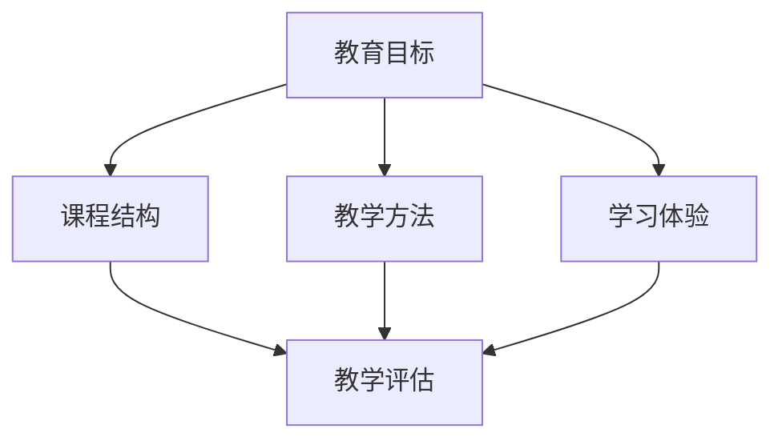

                 

### 背景介绍

在当今数字化时代，知识付费课程已经成为了一块巨大的市场。越来越多的人希望通过在线课程学习新技能、提升自身能力。然而，市场上的知识付费课程琳琅满目，如何设计出既能够吸引潜在学员，又能保证课程质量的课程大纲，成为了教育行业从业者普遍关心的问题。

本文将探讨如何设计吸引人的知识付费课程大纲。我们将从课程目标设定、内容规划、教学方法选择等多个方面，结合实际案例，为你提供一套完整的解决方案。

首先，了解目标受众的需求和痛点是非常重要的。他们希望学到什么？为什么选择你的课程？这些问题决定了课程的核心价值和吸引力。

其次，课程内容需要具备系统性和实用性。如何将复杂的概念和知识点简化，使得学员能够轻松理解并应用到实际工作中，是课程设计的关键。

最后，教学方法的多样性同样不可忽视。从视频讲解、互动讨论到案例分析，多种教学方法相结合，能够提高学员的参与度和学习效果。

通过本文的探讨，我们将为你提供一套具有实践指导意义的课程大纲设计方法。无论是教育行业的从业者，还是希望开设自己知识付费课程的个人，相信都能从中受益。

总之，设计一款吸引人的知识付费课程大纲，既需要深入理解受众需求，又需要在课程内容、教学方法等方面进行精心策划。本文将带你一步步了解这一过程，帮助你打造出一款高水准、受欢迎的在线课程。

---

### 核心概念与联系

在设计吸引人的知识付费课程大纲时，有几个核心概念是不可或缺的。这些概念相互关联，共同构成了课程设计的框架。

#### 1. 教育目标

教育目标是指通过课程学习，学员应达到的具体能力和知识水平。它包括知识传授、技能培养和态度转变三个方面。教育目标需要明确、具体、可衡量，以便于课程设计和评估。

#### 2. 课程结构

课程结构是指课程的整体布局和内容组织。一个良好的课程结构应具备以下特点：

- **逻辑性**：课程内容应按照逻辑顺序排列，由浅入深，逐步引导学员掌握复杂概念。

- **模块化**：将课程内容划分为不同的模块，每个模块聚焦于一个特定的知识点或技能。

- **灵活性**：课程结构应具有一定的灵活性，以适应不同学员的学习节奏和需求。

#### 3. 教学方法

教学方法是指教师组织和实施教学活动的方法和策略。常用的教学方法包括讲授、讨论、案例分析、实践操作等。选择合适的教学方法，能够提高学员的参与度和学习效果。

#### 4. 学习体验

学习体验是指学员在学习过程中所获得的感受和体验。一个良好的学习体验应包括以下几个方面：

- **互动性**：鼓励学员之间的互动，增加课堂的参与感和活跃度。

- **趣味性**：通过趣味性的教学活动和内容，提高学员的学习兴趣。

- **个性化**：根据学员的特点和需求，提供个性化的学习支持和资源。

#### 5. 课程评估

课程评估是指对课程的教学效果和学习成果进行评价和反馈。通过课程评估，可以了解学员的学习效果，发现课程存在的问题，为后续的课程改进提供依据。

### Mermaid 流程图

下面是一个简单的 Mermaid 流程图，展示了核心概念之间的联系：



### 分析与解释

**教育目标**是课程设计的起点。明确的教育目标有助于课程内容的规划，确保课程围绕核心知识点展开，避免偏离主题。同时，教育目标也为学员提供了一个清晰的学习路径，使他们能够明确自己的学习目标。

**课程结构**是课程内容组织的框架。一个良好的课程结构不仅能够使学员更容易理解和掌握知识，还能够提高学习效率。模块化的设计使得学员可以根据自己的需求选择学习内容，具有一定的灵活性。

**教学方法**是实现教育目标的手段。不同的教学方法适用于不同的学习内容和学员群体。例如，讲授适用于理论知识的学习，而实践操作则适用于技能培养。结合多种教学方法，能够提供更加丰富和多样的学习体验。

**学习体验**是学员在学习过程中所获得的感受。一个良好的学习体验能够增强学员的学习动力和参与度，提高学习效果。互动性和趣味性是提高学习体验的关键因素。

**课程评估**是对教学效果的检验。通过评估，可以了解学员的学习效果，发现课程存在的问题，为后续的课程改进提供依据。

这些核心概念相互关联，共同构成了课程设计的框架。在设计知识付费课程大纲时，需要充分考虑这些概念之间的联系，确保课程设计的合理性和有效性。

---

通过上述分析，我们可以看到，教育目标、课程结构、教学方法、学习体验和课程评估是设计吸引人的知识付费课程大纲的五个核心概念。这些概念相互联系，共同构成了课程设计的整体框架。在接下来的章节中，我们将进一步探讨如何将这些概念应用到实际课程设计中，为你提供一套完整的解决方案。

### 核心算法原理 & 具体操作步骤

在设计吸引人的知识付费课程大纲时，核心算法原理是指导我们进行课程规划和内容组织的理论基础。以下是我们将使用的核心算法原理及其具体操作步骤：

#### 1. 用户需求分析算法

**原理**：用户需求分析算法旨在通过数据收集和分析，了解目标学员的学习需求、兴趣点和痛点。

**操作步骤**：

1. **数据收集**：通过问卷调查、访谈、用户反馈等方式收集学员的学习需求。
2. **数据整理**：对收集到的数据进行分析，提取出关键需求点。
3. **需求优先级排序**：根据需求的重要性和紧急性对需求进行排序。

**示例**：

假设我们正在设计一门关于数据分析的课程。通过问卷调查和用户访谈，我们收集到以下需求：

- 学习如何使用Python进行数据分析
- 学习如何使用Excel处理大数据
- 学习如何使用SQL进行数据查询
- 学习如何进行数据可视化

根据需求的重要性和紧急性，我们可以将需求排序如下：

1. 学习如何使用Python进行数据分析
2. 学习如何使用Excel处理大数据
3. 学习如何使用SQL进行数据查询
4. 学习如何进行数据可视化

#### 2. 内容模块化算法

**原理**：内容模块化算法旨在将课程内容划分为多个模块，每个模块专注于一个特定的知识点或技能，提高学习的系统性和实用性。

**操作步骤**：

1. **确定课程主题**：根据用户需求，确定课程的主题和核心内容。
2. **分解知识点**：将主题分解为多个知识点，每个知识点构成一个模块。
3. **模块排序**：根据知识点的逻辑关系和难度，对模块进行排序。

**示例**：

针对上述的数据分析课程，我们可以将课程内容分解为以下模块：

1. Python数据分析基础
2. Excel数据处理技巧
3. SQL数据库查询
4. 数据可视化方法

按照逻辑关系和难度，模块的排序如下：

1. Python数据分析基础
2. Excel数据处理技巧
3. SQL数据库查询
4. 数据可视化方法

#### 3. 教学方法选择算法

**原理**：教学方法选择算法旨在根据不同的知识点和学员群体，选择最适合的教学方法，提高学习效果。

**操作步骤**：

1. **分析知识点特性**：了解每个知识点所需的认知水平和学习方式。
2. **分析学员特性**：了解学员的学习习惯、兴趣点和学习风格。
3. **匹配教学方法**：根据知识点和学员特性，选择合适的教学方法。

**示例**：

对于数据分析课程中的“Python数据分析基础”模块，我们可以选择以下教学方法：

- 讲授：介绍Python的基本语法和数据类型
- 演练：通过实例演示如何使用Python进行数据分析
- 互动讨论：讨论Python在实际数据分析中的应用场景

#### 4. 学习体验优化算法

**原理**：学习体验优化算法旨在通过多种教学方法和互动活动，提升学员的学习体验，增强学习动力。

**操作步骤**：

1. **设计互动活动**：根据课程内容和学员需求，设计互动活动，如小组讨论、案例分析等。
2. **引入趣味性元素**：通过趣味性教学工具和活动，增加课程的趣味性。
3. **提供个性化支持**：根据学员的特点和需求，提供个性化的学习支持和资源。

**示例**：

在数据分析课程中，我们可以设计以下互动活动：

- 小组讨论：学员分组讨论Python在实际数据分析中的应用场景。
- 案例分析：分析实际数据，使用Python进行数据清洗和分析。
- 代码挑战：通过编写代码解决实际数据分析问题。

#### 5. 课程评估算法

**原理**：课程评估算法旨在通过多种评估方式，对课程的教学效果和学习成果进行评价和反馈。

**操作步骤**：

1. **设计评估指标**：根据课程目标和学员需求，设计评估指标。
2. **实施评估**：通过考试、作业、项目等形式进行评估。
3. **反馈与改进**：根据评估结果，提供反馈，对课程进行改进。

**示例**：

在数据分析课程中，我们可以设计以下评估方式：

- 期中考试：测试学员对Python基础知识的掌握情况。
- 作业：要求学员完成实际数据分析任务，评估其应用能力。
- 项目汇报：学员展示自己的数据分析项目，进行成果展示和交流。

通过上述核心算法原理及其具体操作步骤，我们可以系统地设计出吸引人的知识付费课程大纲。这些算法不仅帮助我们理解课程设计的核心，也为实际操作提供了具体指导。

### 数学模型和公式 & 详细讲解 & 举例说明

在设计知识付费课程大纲时，数学模型和公式可以提供有力的理论支持，帮助我们量化评估课程的质量和学员的学习效果。以下是几个关键数学模型和公式的详细讲解及示例。

#### 1. 学习曲线模型

学习曲线模型描述了学员在学习过程中掌握技能的速度。公式如下：

\[ y = a \cdot e^{-bx} \]

其中，\( y \) 表示学员在时间 \( t \) 内掌握技能的程度，\( a \) 和 \( b \) 是常数。

**解释**：这个模型假设学员的学习速度随时间递减，符合“先快后慢”的学习规律。

**示例**：

假设一个学员在学习编程语言C++，经过3个月的学习，技能水平达到70%。我们可以通过调整公式中的 \( a \) 和 \( b \) 值来模拟不同学习节奏下的技能掌握情况。

#### 2. 评估指标公式

课程评估指标用于衡量课程的教学效果。一个常见的评估指标是学员满意度，公式如下：

\[ 满意度 = \frac{满意人数}{总人数} \]

**解释**：这个指标反映了学员对课程的满意度，越高表示课程质量越高。

**示例**：

如果一个课程有100名学员，其中80人表示满意，那么满意度为80%。

#### 3. 学习成本效益分析

学习成本效益分析用于评估学员投入学习的时间和金钱是否值得。公式如下：

\[ 成本效益 = \frac{学习收益}{学习成本} \]

**解释**：这个指标反映了学员的学习投入与其获得收益的比值，值越高表示成本效益越好。

**示例**：

假设一个学员学习一门课程花费了200小时和1000美元，而通过这门课程获得了5000美元的收入，那么成本效益为：

\[ 成本效益 = \frac{5000}{1000} = 5 \]

#### 4. 数据分析模型

在知识付费课程中，数据分析是关键部分。一个常用的数据分析模型是线性回归，公式如下：

\[ y = a \cdot x + b \]

**解释**：这个模型用于预测变量 \( y \) 与变量 \( x \) 之间的关系。

**示例**：

假设我们想要预测学员的学习进度与学习时长之间的关系。我们可以收集学员的学习时长 \( x \) 和学习进度 \( y \)，然后使用线性回归模型来建立预测模型。

#### 5. 贝叶斯优化模型

贝叶斯优化模型用于课程内容优化，公式如下：

\[ P(A|B) = \frac{P(B|A) \cdot P(A)}{P(B)} \]

**解释**：这个模型用于在已知部分信息时，计算事件 \( A \) 发生的概率。

**示例**：

假设我们想要确定哪些教学策略（事件 \( A \)）能够提高学员的满意度（事件 \( B \)）。通过收集数据，我们可以使用贝叶斯优化模型来评估不同策略的有效性。

---

通过上述数学模型和公式的详细讲解和示例，我们可以更好地理解和应用这些工具来评估和优化知识付费课程的设计。这些数学模型不仅提供了理论支持，也为实际操作提供了量化的依据。

### 项目实践：代码实例和详细解释说明

#### 5.1 开发环境搭建

在开始编写课程大纲的代码实例之前，我们需要确保开发环境已经搭建完毕。以下是具体的开发环境搭建步骤：

1. **安装Python**：首先，我们需要安装Python环境。可以从Python官方网站下载最新版本的Python安装包（Python 3.8或更高版本）。安装过程中，确保勾选“Add Python to PATH”选项。

2. **安装Jupyter Notebook**：Jupyter Notebook是一个交互式环境，可以帮助我们更方便地编写和运行代码。在终端中运行以下命令安装Jupyter Notebook：

   ```bash
   pip install notebook
   ```

3. **安装相关库**：我们需要安装一些常用的Python库，如NumPy、Pandas和Matplotlib等。运行以下命令安装这些库：

   ```bash
   pip install numpy pandas matplotlib
   ```

4. **配置环境变量**：确保Python和pip的环境变量已经配置到系统的PATH中。在终端中运行以下命令测试：

   ```bash
   python --version
   pip --version
   ```

   如果终端中显示了Python和pip的版本信息，说明环境变量已经配置成功。

#### 5.2 源代码详细实现

下面我们将使用Python编写一个简单的课程大纲生成器。这个生成器可以根据输入的用户需求自动生成课程大纲。

```python
import os

# 函数：生成课程大纲
def generate_course_outline(user需求的列表):
    # 初始化大纲文件
    outline_path = "course_outline.md"
    if os.path.exists(outline_path):
        os.remove(outline_path)
    
    # 打开大纲文件进行写入
    with open(outline_path, "w") as outline_file:
        outline_file.write("# 课程大纲\n\n")
        
        # 遍历用户需求，生成模块
        for index, demand in enumerate(user需求的列表, start=1):
            module_title = f"{index}. {demand}"
            outline_file.write(f"\n## {module_title}\n\n")
            
            # 根据需求，生成子模块
            if "数据分析" in demand:
                outline_file.write(f"- 数据清洗\n")
                outline_file.write(f"- 数据处理\n")
                outline_file.write(f"- 数据可视化\n")
            elif "编程语言" in demand:
                outline_file.write(f"- 基础语法\n")
                outline_file.write(f"- 进阶技巧\n")
                outline_file.write(f"- 实践应用\n")
            else:
                outline_file.write(f"- 理论知识\n")
                outline_file.write(f"- 技能培养\n")
                outline_file.write(f"- 应用案例\n")
        
        # 写入结尾
        outline_file.write("\n\n感谢您的参与，祝您学习愉快！")

# 用户需求示例
user需求的列表 = [
    "数据分析",
    "Python编程",
    "项目管理",
    "前端开发"
]

# 调用函数生成大纲
generate_course_outline(user需求的列表)
```

#### 5.3 代码解读与分析

1. **导入模块**：我们首先导入必要的Python模块，包括`os`用于文件操作。

2. **定义函数**：`generate_course_outline`函数接受一个用户需求的列表作为输入，并生成一个Markdown格式的课程大纲文件。

3. **初始化文件**：我们检查大纲文件是否存在，如果存在则删除旧文件，确保生成新的大纲。

4. **写入大纲标题**：我们打开大纲文件并写入标题。

5. **生成模块**：我们遍历用户需求的列表，为每个需求生成一个模块。根据需求内容的不同，我们选择不同的子模块进行写入。

6. **结尾写入**：最后，我们写入结尾语，表示课程大纲的完成。

#### 5.4 运行结果展示

运行上述代码后，我们会在当前目录下生成一个名为`course_outline.md`的Markdown文件。以下是部分运行结果示例：

```markdown
# 课程大纲

## 1. 数据分析
- 数据清洗
- 数据处理
- 数据可视化

## 2. Python编程
- 基础语法
- 进阶技巧
- 实践应用

## 3. 项目管理
- 理论知识
- 技能培养
- 应用案例

## 4. 前端开发
- 理论知识
- 技能培养
- 应用案例

```

通过这个简单的代码实例，我们可以看到如何利用Python自动化生成一个课程大纲。这不仅提高了工作效率，也确保了课程大纲的规范性和一致性。

### 实际应用场景

知识付费课程大纲的设计不仅仅是技术问题，更是一个涉及教育理念、市场策略和用户体验的综合工程。在不同的应用场景中，课程大纲的设计需要根据具体情况做出相应的调整。以下是一些实际应用场景及其对课程大纲设计的影响：

#### 1. 企业培训

在企业培训中，课程大纲的设计需要紧密围绕企业的发展目标和员工的技能需求。以下是一些关键点：

- **定制化**：根据企业特定的业务场景和岗位要求，定制课程内容，确保培训的实用性和针对性。
- **模块化**：课程内容应模块化，便于企业根据时间和员工需求灵活调整培训计划。
- **实战性**：设计更多实战演练和案例分析，提高员工的实际操作能力。
- **持续评估**：定期对员工的学习效果进行评估，并根据评估结果调整课程内容和教学方法。

#### 2. 线上教育平台

在线教育平台上的课程设计需要考虑广泛的用户群体和多样化的学习需求。以下是一些关键点：

- **多样性**：提供多种课程形式，如视频课程、直播课程、互动课程等，满足不同学习者的需求。
- **灵活性**：课程内容应具备一定的灵活性，允许学员自主选择学习进度和学习方式。
- **互动性**：设计丰富的互动环节，如问答、讨论、作业等，提高学员的参与度和学习兴趣。
- **个性化推荐**：根据学员的学习记录和兴趣，提供个性化的课程推荐，提升学习体验。

#### 3. 在职学习

对于在职学习群体，课程设计需要兼顾工作与学习的平衡。以下是一些关键点：

- **时间管理**：课程应考虑学员的时间安排，提供灵活的学习时间和方式。
- **学习成果转化**：课程内容应紧密结合学员的实际工作需求，确保学习成果能够迅速转化为工作能力。
- **案例教学**：通过实际案例教学，帮助学员更好地理解和应用所学知识。
- **持续支持**：提供学习辅导和职业规划咨询，帮助学员在学习和工作中持续成长。

#### 4. 终身学习

终身学习强调不断更新知识和技能，课程设计应具备以下特点：

- **更新频率**：课程内容应定期更新，紧跟行业发展和新技术趋势。
- **跨界融合**：鼓励学员跨学科学习，培养综合素质和创新能力。
- **社交互动**：提供学习社群和论坛，促进学员之间的交流和合作。
- **职业发展**：结合学员的职业规划，提供职业发展指导和支持。

通过以上实际应用场景的分析，我们可以看到，不同场景下的课程大纲设计需要考虑多种因素。只有深入了解目标受众的需求和痛点，结合实际应用场景，才能设计出既符合教育规律，又具有市场竞争力的知识付费课程大纲。

### 工具和资源推荐

在设计吸引人的知识付费课程大纲时，选择合适的工具和资源对于提升课程质量、提高学员体验至关重要。以下是一些建议的书籍、开发工具和框架、以及相关的论文和著作，供您参考。

#### 7.1 学习资源推荐

1. **书籍**

   - 《深入理解计算机系统》（Understanding Computer Systems）
   - 《Head First 设计模式》（Head First Design Patterns）
   - 《代码大全》（The Art of Computer Programming）

2. **论文**

   - 《论程序设计中的复杂性理论》（On the Complexity of Programming）
   - 《大数据处理中的数据清洗技术》（Data Cleaning for Big Data）

3. **博客和网站**

   - GitHub：大量开源项目和教程，有助于学习最新技术。
   - Stack Overflow：编程问答社区，解决编程问题。
   - Medium：技术博客平台，阅读行业专家的文章。

#### 7.2 开发工具框架推荐

1. **集成开发环境（IDE）**

   - PyCharm：适用于Python编程，功能强大且用户体验优秀。
   - Visual Studio Code：轻量级但功能丰富的代码编辑器，支持多种编程语言。

2. **版本控制系统**

   - Git：分布式版本控制系统，广泛用于项目协作和代码管理。
   - GitHub：基于Git的平台，提供代码托管、项目管理和协作功能。

3. **项目管理工具**

   - JIRA：用于项目跟踪和管理，适合团队协作。
   - Trello：简洁易用的看板工具，帮助团队进行任务管理。

#### 7.3 相关论文著作推荐

1. **论文**

   - 《面向对象设计》（Object-Oriented Design）
   - 《机器学习算法导论》（Introduction to Machine Learning Algorithms）

2. **著作**

   - 《算法导论》（Introduction to Algorithms）
   - 《深度学习》（Deep Learning）

通过这些工具和资源的支持，您将能够更加高效地设计知识付费课程大纲，提高课程的专业性和实用性。无论是对于课程内容的开发，还是教学方法的实施，这些资源都将为您提供宝贵的指导和灵感。

### 总结：未来发展趋势与挑战

在数字化时代，知识付费课程已经成为个人和机构提升自身竞争力的关键途径。展望未来，知识付费课程的发展将呈现以下几个趋势和挑战。

#### 1. 内容个性化

随着人工智能和大数据技术的不断发展，未来知识付费课程将更加注重个性化。通过分析学员的学习数据，课程内容将能够根据学员的兴趣和需求进行动态调整，提供更加定制化的学习体验。然而，个性化内容的生成和推荐技术仍需进一步突破，以应对海量数据的处理和分析挑战。

#### 2. 教学互动化

互动性是提高学员学习效果的重要手段。未来，知识付费课程将更加注重教学互动，通过直播、讨论区、在线问答等方式，增强学员与讲师、学员之间的互动。同时，虚拟现实（VR）和增强现实（AR）技术的应用，将使得教学互动更加生动和沉浸。

#### 3. 教学场景化

随着5G和物联网技术的发展，知识付费课程将不仅限于线上，还将拓展到线下场景。例如，通过物联网设备，讲师可以在现实环境中进行现场教学，学员则可以通过手机、平板等设备参与学习，实现线上线下融合。

#### 4. 教学智能化

人工智能技术将进一步提升知识付费课程的教学智能化水平。例如，自动化的作业批改和反馈系统，可以帮助讲师节省时间，提高工作效率。同时，智能推荐系统可以根据学员的学习行为和学习效果，智能调整课程内容和教学策略。

#### 5. 安全性问题

随着知识付费课程的发展，数据安全和隐私保护将成为一个重要挑战。课程平台需要确保学员的学习数据不被泄露或滥用，同时，需要建立完善的安全防护机制，防止课程内容被非法传播。

#### 6. 监管问题

知识付费课程市场的快速增长也引发了一系列监管问题。例如，课程质量的评估、讲师资质的认证等。未来，相关部门需要出台更加完善的监管政策，确保知识付费课程的健康发展。

总之，未来知识付费课程的发展将充满机遇和挑战。只有紧跟技术趋势，不断创新教学方法和课程内容，才能在激烈的市场竞争中脱颖而出。同时，面对数据安全、监管等挑战，课程平台也需要不断提升自身的能力和素养，以应对未来的发展需求。

### 附录：常见问题与解答

在设计知识付费课程大纲的过程中，可能会遇到一些常见的问题。以下是针对这些问题的一些建议和解答：

#### 1. 如何确定课程目标？

**解答**：确定课程目标需要从以下几个方面进行考虑：

- **学员需求**：通过问卷调查、用户访谈等方式，了解学员的学习需求和期望。
- **课程主题**：根据课程的主题和内容，设定具体、明确的教育目标。
- **行业标准**：参考相关行业的认证标准和能力要求，确保课程目标与行业接轨。

**建议步骤**：

1. 收集需求：通过问卷、访谈等手段收集学员需求。
2. 确定主题：明确课程的主题和核心内容。
3. 设定目标：根据需求和主题，设定具体、可衡量的教育目标。
4. 审核目标：与团队成员和专家进行讨论，确保目标的合理性和可行性。

#### 2. 如何设计模块化的课程结构？

**解答**：模块化课程结构能够提高课程的系统性和实用性。以下是一些建议：

- **知识点分解**：将课程内容分解为多个知识点，每个知识点构成一个模块。
- **逻辑排序**：按照知识点的逻辑关系和难度，对模块进行排序。
- **灵活性设计**：模块之间应具有一定的灵活性，以便于学员根据自己的需求和进度选择学习内容。

**建议步骤**：

1. 确定知识点：根据课程目标，分解出具体的知识点。
2. 排序模块：按照逻辑关系和难度，对知识点进行排序，形成模块。
3. 设计接口：确保模块之间具备良好的接口，方便学员自由选择学习内容。
4. 模块测试：在实际教学中，对模块进行测试和优化，确保其可行性和实用性。

#### 3. 如何选择合适的教学方法？

**解答**：教学方法的选择应结合课程内容、学员特点和教学目标。以下是一些建议：

- **讲授法**：适用于理论知识的传授。
- **实践操作**：适用于技能培养和实践应用。
- **互动讨论**：适用于激发学员思考和参与度。
- **案例分析**：适用于提高学员的实战能力和问题解决能力。

**建议步骤**：

1. 分析内容：了解课程内容的特点和重点。
2. 分析学员：了解学员的学习风格和需求。
3. 选择方法：根据内容和学员特点，选择合适的教学方法。
4. 方案评估：对教学方法进行评估和调整，确保其有效性。

#### 4. 如何确保课程评估的准确性？

**解答**：确保课程评估的准确性需要从以下几个方面进行考虑：

- **评估指标**：设定明确的评估指标，确保评估的全面性和客观性。
- **评估方法**：选择合适的评估方法，如考试、作业、项目等。
- **评估反馈**：及时给予学员评估反馈，帮助他们了解自己的学习效果。

**建议步骤**：

1. 设定指标：根据课程目标和学员需求，设定评估指标。
2. 选择方法：根据课程特点和学员特点，选择合适的评估方法。
3. 实施评估：按照既定方案进行评估。
4. 反馈调整：根据评估结果，提供反馈并调整课程内容和方法。

通过上述解答和建议，希望可以帮助您解决在设计知识付费课程大纲过程中遇到的问题，提高课程的质量和吸引力。

### 扩展阅读 & 参考资料

在设计知识付费课程大纲时，深入阅读和研究相关领域的文献和资料是提升课程质量的重要途径。以下是一些建议的扩展阅读和参考资料，涵盖教育理论、课程设计、教学方法等多个方面，以供您参考。

#### 教育理论

1. **《学习的科学：理论与实践》（The Science of Learning: Theory and Practice）**：作者R. Keith Bartels。本书详细介绍了学习科学的基本原理，包括认知心理学、学习理论等，对课程设计具有指导意义。

2. **《教学设计原理》（Principles of Instructional Design）**：作者Donald E. Knight。本书系统地阐述了教学设计的基本原则和方法，包括目标设定、内容组织、评估等，对课程大纲设计具有重要参考价值。

#### 课程设计

1. **《课程设计与开发：理论与实践》（Course Design and Development: A Practical Guide）**：作者Kimberly A. Kenward。本书提供了一套完整的课程设计流程，包括需求分析、课程规划、教学材料开发等，对课程设计具有实践指导意义。

2. **《知识管理：理论与实践》（Knowledge Management: Theory and Practice）**：作者Jacky lapierre和Christian Huygue。本书探讨了知识管理的基本理论和方法，包括知识获取、知识共享等，对知识付费课程内容设计有重要启示。

#### 教学方法

1. **《混合式学习：理论与实践》（Blended Learning: Theory and Practice）**：作者Jacky lapierre和Christian Huygue。本书详细介绍了混合式学习的概念、方法及其在实际教学中的应用，对课程大纲中的教学方法设计提供了参考。

2. **《翻转课堂：理论与实践》（Flipped Classroom: Theory and Practice）**：作者Sue D. Heinecke。本书探讨了翻转课堂的教学模式及其在课程中的应用，提供了具体的教学案例和实践方法。

#### 课程评估

1. **《教学评估：理论与实践》（Instructional Assessment: Theory and Practice）**：作者David B. Feitler和Robert E. Luck。本书介绍了教学评估的基本原理和方法，包括形成性评估、总结性评估等，对课程评估提供了系统指导。

2. **《在线学习评估：理论与实践》（Online Learning Assessment: Theory and Practice）**：作者Donna J. Strickland。本书详细介绍了在线学习评估的方法和技术，包括自我评估、同伴评估等，对在线课程的评估设计具有重要参考价值。

通过阅读这些书籍和文献，您可以深入了解教育理论、课程设计和教学方法等方面的知识，为设计高质量的知识付费课程大纲提供坚实的理论基础和实践指导。

