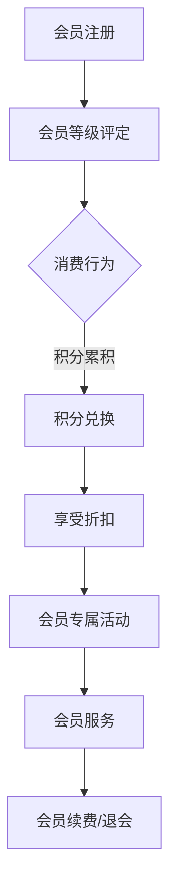

                 

### 背景介绍

在当今的商业环境中，会员权益体系已经成为许多企业吸引和留住客户的重要策略之一。无论是线上电商平台，还是线下实体店，会员权益体系的设计不仅关乎企业的盈利能力，更直接影响客户对品牌的忠诚度和满意度。随着市场环境的不断变化，会员权益体系也需要不断迭代和优化，以适应新的竞争态势和客户需求。

会员权益体系是指企业为特定客户提供的一系列优惠、服务或奖励措施。这些权益可以是物质性的，如折扣、赠品、礼品等，也可以是精神性的，如积分、会员专属活动、会员等级等。会员权益体系的设计需要综合考虑企业的经营目标、客户需求、市场趋势等因素。

#### 会员权益体系的重要性

首先，会员权益体系有助于提升客户的忠诚度。通过为会员提供独特的价值和优惠，企业能够增强客户的粘性，使客户更愿意长期合作。例如，亚马逊的会员制度（Amazon Prime）就通过提供免费配送、专属优惠等方式，吸引了大量忠实用户，从而在激烈的市场竞争中保持领先地位。

其次，会员权益体系有助于增加客户的参与度。通过会员专属活动、积分兑换等机制，企业可以激发客户的参与热情，提升客户体验。例如，星巴克的积分兑换系统不仅提供了物质奖励，还通过会员活动增加了客户与品牌之间的互动，从而增强了品牌的吸引力。

再次，会员权益体系有助于提升企业的品牌形象。通过提供高质量的会员服务，企业能够树立良好的品牌形象，吸引更多潜在客户。例如，一些高端餐饮品牌通过提供会员专属餐厅、定制化服务等方式，树立了高品质、高服务的品牌形象，吸引了大量高端客户。

#### 现状与问题

尽管会员权益体系的重要性不言而喻，但在实际运营过程中，许多企业仍面临以下问题：

1. 权益设计过于单一：一些企业的会员权益体系设计过于简单，无法满足客户的多样化需求，导致客户忠诚度下降。
2. 权益难以量化：一些企业的会员权益难以量化，无法直观地让客户感受到价值，从而影响客户的参与度和满意度。
3. 权益落地执行难：一些企业的会员权益在落地执行过程中存在困难，如优惠活动推广不到位、积分兑换流程复杂等，影响了客户的体验。
4. 数据分析与利用不足：一些企业在设计会员权益体系时，缺乏对客户数据的深入分析，导致权益设计缺乏针对性，无法有效吸引和留住客户。

#### 目的

本文旨在通过深入探讨会员权益体系的设计原则、核心要素和实施策略，帮助企业解决上述问题，提升会员权益体系的吸引力和有效性。本文将分为以下几个部分：

1. **核心概念与联系**：介绍会员权益体系的核心概念和架构，包括会员等级、积分、折扣等，并通过 Mermaid 流程图展示其工作原理。
2. **核心算法原理与具体操作步骤**：阐述会员权益体系的核心算法原理，包括积分计算、等级评定等，并提供具体操作步骤。
3. **数学模型与公式**：介绍会员权益体系所涉及的数学模型和公式，包括积分计算公式、折扣计算公式等，并通过举例说明其应用。
4. **项目实践**：通过代码实例，详细解释会员权益体系的具体实现过程，包括开发环境搭建、源代码实现、代码解读与分析、运行结果展示等。
5. **实际应用场景**：分析会员权益体系在不同行业和场景下的应用，提供具体案例和解决方案。
6. **工具和资源推荐**：推荐学习资源、开发工具和框架，帮助企业更好地设计和实施会员权益体系。
7. **总结**：总结会员权益体系的发展趋势和挑战，提出未来发展的建议。

通过本文的阅读，读者将能够全面了解会员权益体系的设计原则和实施策略，提升企业的会员管理水平和客户满意度。

---

在本文的第一部分，我们将首先介绍会员权益体系的核心概念和架构，通过Mermaid流程图展示其工作原理。这将为后续内容的深入分析提供坚实的基础。

### 核心概念与联系

会员权益体系的设计涉及到多个核心概念，这些概念相互联系，共同构成了一个完整的会员管理体系。以下是会员权益体系中的几个关键概念：

#### 1. 会员等级

会员等级是会员权益体系的基础，通过将会员划分为不同的等级，企业可以为不同等级的会员提供差异化的服务和优惠。会员等级通常基于会员的消费行为、积分累积、会员时长等多个维度进行评定。常见的会员等级包括普通会员、银卡会员、金卡会员、白金会员等。

#### 2. 积分

积分是会员权益体系中的另一种重要激励手段。企业通过为会员消费、参与活动等方式累积积分，会员可以用于兑换商品、享受折扣等。积分的设计需要考虑积分获取方式、积分有效期、积分兑换规则等多个方面。

#### 3. 折扣

折扣是会员权益体系中的直接激励手段，通过提供价格优惠，企业可以吸引会员消费，提升销售额。折扣可以基于会员等级、消费金额等多个维度进行设置，常见的折扣形式包括固定金额折扣、百分比折扣等。

#### 4. 会员专属活动

会员专属活动是提升会员参与度和品牌忠诚度的重要手段。通过举办各类会员专享活动，如抽奖、限量抢购、会员沙龙等，企业可以增强与会员的互动，提升会员的归属感和忠诚度。

#### 5. 会员服务

会员服务包括会员咨询、售后保障、会员权益保障等多个方面。优质的会员服务可以提升会员的满意度和忠诚度，是会员权益体系的重要组成部分。

#### Mermaid 流程图

为了更好地展示会员权益体系的工作原理，我们使用Mermaid流程图进行描述。以下是会员权益体系的流程图：



在上述流程图中，会员注册是会员权益体系的起点，会员在注册后，系统会根据会员的消费行为、积分累积等因素进行等级评定。会员等级评定后，会员可以通过积分累积和兑换、享受折扣、参加会员专属活动等方式，享受企业提供的各类权益。同时，会员服务也为会员提供了全方位的支持，确保会员权益的顺利实施。会员在享受权益的过程中，可能会选择续费或退会，这决定了会员权益体系的持续性和稳定性。

通过上述核心概念和Mermaid流程图的介绍，我们可以对会员权益体系有更全面的理解。在接下来的部分，我们将深入探讨会员权益体系的核心算法原理和具体操作步骤。

### 核心算法原理与具体操作步骤

在了解了会员权益体系的核心概念和架构之后，接下来我们将深入探讨其核心算法原理和具体操作步骤。这些算法原理和操作步骤是会员权益体系实现的关键，它们决定了会员权益的公平性、合理性和吸引力。

#### 1. 积分计算算法

积分计算是会员权益体系中最基础也是最重要的环节之一。通过积分计算，企业能够根据会员的消费行为、参与活动等行为累积积分，会员可以用于兑换商品、享受折扣等。积分计算算法通常包括以下几个方面：

1. **积分获取方式**：
   - **消费积分**：会员每次消费都会获得一定比例的积分，消费金额越高，积分比例越高。
   - **活动积分**：会员参与企业的各类活动，如注册、签到、分享等，也能获得额外积分。
   - **任务积分**：会员完成企业设定的特定任务，如购物满一定金额、首次购买等，可以获得额外积分。

2. **积分计算公式**：
   - **积分总额 = 消费积分 + 活动积分 + 任务积分**
   - **消费积分 = 消费金额 × 积分获取比例**
   - **活动积分 = 活动积分系数 × 活动参与次数**
   - **任务积分 = 任务积分系数 × 完成任务次数**

3. **积分有效期**：
   - 积分通常有一定的有效期，例如一年或半年。过期未使用的积分将自动失效。

4. **积分兑换规则**：
   - **兑换比例**：积分兑换通常有固定的兑换比例，例如100积分兑换1元。
   - **兑换范围**：积分兑换通常限定在特定的商品或服务范围内。

#### 2. 会员等级评定算法

会员等级评定是会员权益体系中的重要环节，通过会员等级评定，企业可以提供差异化的服务和优惠，提升会员的忠诚度和满意度。会员等级评定通常基于会员的消费行为、积分累积、会员时长等多个维度进行。

1. **等级划分标准**：
   - **消费金额**：会员在一定时间内累计的消费金额达到一定的标准，可以晋升到更高的等级。
   - **积分累积**：会员在一定时间内累积的积分达到一定的标准，可以晋升到更高的等级。
   - **会员时长**：会员注册成为会员的时间达到一定的标准，可以晋升到更高的等级。

2. **等级评定公式**：
   - **等级晋升条件 = 消费金额 × 积分累积 × 会员时长**
   - **等级晋升条件 = 当前等级条件 × 等级晋升系数**

3. **等级权益**：
   - **会员等级权益**：不同等级的会员可以享受不同的优惠和服务，如折扣、专属活动、定制化服务等。

#### 3. 折扣计算算法

折扣计算是会员权益体系中的直接激励手段，通过折扣计算，企业可以提供价格优惠，吸引会员消费，提升销售额。折扣计算通常包括以下几个方面：

1. **折扣方式**：
   - **固定金额折扣**：例如，会员购买商品时，直接减免一定金额。
   - **百分比折扣**：例如，会员购买商品时，减免商品价格的固定百分比。

2. **折扣计算公式**：
   - **折扣金额 = 商品原价 × 折扣比例**
   - **实际支付金额 = 商品原价 - 折扣金额**

3. **折扣范围**：
   - 折扣通常有固定的范围，例如最高折扣比例为90%，最低折扣比例为5%。

#### 4. 会员专属活动算法

会员专属活动是提升会员参与度和品牌忠诚度的重要手段。通过会员专属活动算法，企业可以设计出丰富多样的活动形式，吸引会员参与。

1. **活动形式**：
   - **抽奖活动**：会员参与抽奖，有机会赢得奖品。
   - **限量抢购**：会员在特定时间抢购限量商品。
   - **会员沙龙**：会员参加企业举办的线下或线上沙龙活动。

2. **活动规则**：
   - **活动资格**：会员需要满足一定的条件，如会员等级、积分累积等，才有资格参与活动。
   - **活动时间**：活动通常有固定的开始和结束时间。

#### 具体操作步骤

为了使会员权益体系更加清晰，以下是具体的操作步骤：

1. **注册会员**：会员注册后，系统生成会员编号和初始等级。

2. **积分累积**：会员每次消费、参与活动、完成任务等行为都会累积积分。

3. **等级评定**：系统根据会员的积分累积、消费金额、会员时长等数据，定期进行等级评定。

4. **折扣计算**：会员每次消费时，系统根据会员等级计算折扣金额。

5. **活动参与**：会员根据活动规则，参与各类会员专属活动。

6. **积分兑换**：会员可以使用积分兑换商品或服务。

7. **会员服务**：会员在享受权益过程中，如有疑问或问题，可以随时联系会员服务团队。

通过上述核心算法原理和具体操作步骤的介绍，我们可以看出，会员权益体系的设计和实施需要考虑多个方面，包括积分计算、等级评定、折扣计算、活动设计等。只有通过科学合理的设计和精细化的管理，会员权益体系才能真正发挥其应有的作用，提升企业的盈利能力和客户满意度。

在接下来的部分，我们将进一步探讨会员权益体系所涉及的数学模型和公式，并通过举例说明其具体应用。

### 数学模型和公式与详细讲解

在会员权益体系的设计过程中，数学模型和公式起着至关重要的作用。它们不仅帮助实现积分累积、等级评定、折扣计算等功能，还确保了整个体系的公平性和合理性。本节我们将详细介绍这些数学模型和公式，并通过具体案例进行详细讲解。

#### 1. 积分计算模型

积分计算是会员权益体系的核心环节之一。积分的获取、累积和兑换都需要依靠数学模型进行计算。以下是一些常用的积分计算模型：

1. **基本积分计算公式**：
   - **积分总额 = 消费积分 + 活动积分 + 任务积分**
   - **消费积分 = 消费金额 × 积分获取比例**
   - **活动积分 = 活动积分系数 × 活动参与次数**
   - **任务积分 = 任务积分系数 × 完成任务次数**

2. **例子**：
   假设某电商平台规定，会员每消费1元可以获得1积分，参加注册活动可以获得100积分，完成任务可以获得50积分。一位会员在一个月内消费了1000元，注册了账号，并完成了2个任务。那么，他的积分计算如下：
   - **消费积分 = 1000元 × 1积分/元 = 1000积分**
   - **活动积分 = 100积分**
   - **任务积分 = 50积分 × 2 = 100积分**
   - **总积分 = 1000积分 + 100积分 + 100积分 = 1200积分**

3. **积分有效期计算**：
   - **积分有效期 = 积分累积日期 + 积分有效期天数**
   - 例如，某会员在2023年1月1日累积了1000积分，积分有效期为1年，那么积分将在2024年1月1日过期。

#### 2. 会员等级评定模型

会员等级评定是根据会员的消费行为、积分累积、会员时长等多个维度进行的。以下是一些常用的会员等级评定模型：

1. **基本等级评定公式**：
   - **等级晋升条件 = 消费金额 × 积分累积 × 会员时长**
   - **等级晋升系数 = 当前等级条件 / 上等级条件**

2. **例子**：
   假设某平台的会员等级分为普通会员、银卡会员、金卡会员三个等级，普通会员的消费金额和积分累积条件为1000元和1000积分，银卡会员的条件为2000元和2000积分，金卡会员的条件为3000元和3000积分。一位会员在一个月内消费了1500元，累积了1500积分，注册会员时长为3个月。那么，他的等级评定如下：
   - **当前等级条件 = 1500元 × 1500积分 × 3个月 = 6750000**
   - **银卡会员条件 = 2000元 × 2000积分 × 3个月 = 12000000**
   - **等级晋升系数 = 6750000 / 12000000 ≈ 0.5625**
   - 因此，该会员符合普通会员和银卡会员的晋升条件，但未达到金卡会员的条件，所以他将被评定为银卡会员。

#### 3. 折扣计算模型

折扣计算是会员权益体系中的直接激励手段。以下是一些常用的折扣计算模型：

1. **基本折扣计算公式**：
   - **折扣金额 = 商品原价 × 折扣比例**
   - **实际支付金额 = 商品原价 - 折扣金额**

2. **例子**：
   假设某电商平台提供两种折扣方式，固定金额折扣和百分比折扣。一位会员购买了一件原价为200元的商品，平台提供100元的固定金额折扣，或50%的百分比折扣。那么，他的折扣计算如下：
   - **固定金额折扣 = 200元 - 100元 = 100元**
   - **实际支付金额 = 200元 - 100元 = 100元**
   - **百分比折扣 = 200元 × 50% = 100元**
   - **实际支付金额 = 200元 - 100元 = 100元**

#### 4. 会员专属活动模型

会员专属活动是提升会员参与度和品牌忠诚度的重要手段。以下是一些常用的会员专属活动模型：

1. **基本活动规则**：
   - **活动资格 = 会员等级 × 积分累积 × 活动参与次数**
   - **活动时间 = 活动开始日期 + 活动持续时间**

2. **例子**：
   假设某电商平台举办了一场抽奖活动，只有金卡会员才有资格参与，活动持续时间为一周。一位金卡会员在活动期间参与了3次抽奖。那么，他的活动资格如下：
   - **活动资格 = 金卡会员 × 积分累积 × 活动参与次数**
   - **活动资格 = 1 × 积分累积 × 3**
   - **活动资格 = 积分累积 × 3**
   - **积分累积 = 3000积分**
   - **活动资格 = 3000积分 × 3 = 9000积分**
   - 因此，该会员符合抽奖活动的参与条件。

通过上述数学模型和公式的详细讲解，我们可以看到，会员权益体系的设计和实施离不开科学的数学理论基础。这些模型和公式不仅帮助我们实现积分累积、等级评定、折扣计算等功能，还为会员权益体系的公平性和合理性提供了保障。在实际应用中，企业可以根据自身情况，结合这些模型和公式，设计出适合自己的会员权益体系。

在接下来的部分，我们将通过具体的项目实践，进一步展示如何实现会员权益体系的设计和实施。

### 项目实践：代码实例和详细解释说明

在理解了会员权益体系的理论基础之后，接下来我们将通过一个具体的代码实例，详细展示如何设计和实现一个简单的会员权益体系。这个实例将涵盖开发环境搭建、源代码实现、代码解读与分析以及运行结果展示等多个方面，旨在帮助读者全面了解会员权益体系的实施过程。

#### 5.1 开发环境搭建

在开始编写代码之前，我们需要搭建一个合适的开发环境。以下是一个简单的开发环境搭建步骤：

1. **安装Python环境**：
   - Python是一个强大的编程语言，广泛用于数据分析和开发。我们选择Python 3.8版本。
   - 使用Python的官方安装包进行安装，安装命令为：
     ```bash
     sudo apt-get install python3.8
     ```

2. **安装依赖库**：
   - 为了实现会员权益体系，我们需要安装一些Python依赖库，如Pandas、NumPy等。可以使用pip工具进行安装：
     ```bash
     pip3 install pandas numpy
     ```

3. **创建项目目录**：
   - 在本地计算机上创建一个项目目录，用于存放所有的源代码和相关文件：
     ```bash
     mkdir member_rights_system
     cd member_rights_system
     ```

4. **编写Python脚本**：
   - 在项目目录下创建一个名为`member_rights.py`的Python脚本，用于实现会员权益体系的主要功能。

#### 5.2 源代码详细实现

以下是一个简单的会员权益体系的Python代码实现。代码中包含了会员注册、积分累积、等级评定、折扣计算等功能。

```python
import pandas as pd
import numpy as np

# 会员权益体系类
class MemberRightsSystem:
    def __init__(self):
        self.members = pd.DataFrame(columns=['member_id', 'member_level', 'total_points'])

    # 注册会员
    def register_member(self, member_id):
        if member_id not in self.members['member_id'].values:
            self.members = self.members.append({'member_id': member_id, 'member_level': '普通会员', 'total_points': 0}, ignore_index=True)
            print(f"会员{member_id}注册成功。")
        else:
            print(f"会员{member_id}已存在。")

    # 消费积分累积
    def add_points_for_consumption(self, member_id, consumption_amount, points_per_dollar):
        if member_id in self.members['member_id'].values:
            points = consumption_amount * points_per_dollar
            self.members.loc[self.members['member_id'] == member_id, 'total_points'] += points
            print(f"会员{member_id}消费积分累积成功，累积{points}积分。")
        else:
            print(f"会员{member_id}不存在。")

    # 活动积分累积
    def add_points_for_activity(self, member_id, activity_points):
        if member_id in self.members['member_id'].values:
            self.members.loc[self.members['member_id'] == member_id, 'total_points'] += activity_points
            print(f"会员{member_id}活动积分累积成功，累积{activity_points}积分。")
        else:
            print(f"会员{member_id}不存在。")

    # 等级评定
    def evaluate_member_level(self):
        level_thresholds = {'普通会员': 1000, '银卡会员': 2000, '金卡会员': 3000}
        for index, member in self.members.iterrows():
            if member['total_points'] >= level_thresholds['金卡会员']:
                self.members.at[index, 'member_level'] = '金卡会员'
            elif member['total_points'] >= level_thresholds['银卡会员']:
                self.members.at[index, 'member_level'] = '银卡会员'
            else:
                self.members.at[index, 'member_level'] = '普通会员'
        print("会员等级评定完成。")

    # 折扣计算
    def calculate_discount(self, member_id, original_price, discount_rate):
        if member_id in self.members['member_id'].values:
            discount_amount = original_price * discount_rate
            actual_price = original_price - discount_amount
            print(f"会员{member_id}折扣计算成功，折扣金额为{discount_amount}元，实际支付金额为{actual_price}元。")
        else:
            print(f"会员{member_id}不存在。")

    # 显示会员信息
    def show_member_info(self, member_id):
        if member_id in self.members['member_id'].values:
            print(self.members.loc[self.members['member_id'] == member_id])
        else:
            print(f"会员{member_id}不存在。")

# 实例化会员权益体系
member_rights_system = MemberRightsSystem()

# 注册会员
member_rights_system.register_member('001')
member_rights_system.register_member('002')

# 消费积分累积
member_rights_system.add_points_for_consumption('001', 1500, 1)
member_rights_system.add_points_for_consumption('002', 3000, 1)

# 活动积分累积
member_rights_system.add_points_for_activity('001', 500)
member_rights_system.add_points_for_activity('002', 1000)

# 等级评定
member_rights_system.evaluate_member_level()

# 折扣计算
member_rights_system.calculate_discount('001', 200, 0.1)

# 显示会员信息
member_rights_system.show_member_info('001')
member_rights_system.show_member_info('002')
```

#### 5.3 代码解读与分析

上述代码实现了一个简单的会员权益体系，接下来我们将对关键部分进行解读：

1. **类定义**：
   - `MemberRightsSystem` 类定义了会员权益体系的各个功能，包括注册会员、积分累积、等级评定、折扣计算等。

2. **注册会员**：
   - `register_member` 方法用于注册会员。如果会员ID不存在于现有会员列表中，则添加新会员，并初始化其等级和积分。

3. **积分累积**：
   - `add_points_for_consumption` 方法用于为会员消费累积积分。
   - `add_points_for_activity` 方法用于为会员参与活动累积积分。

4. **等级评定**：
   - `evaluate_member_level` 方法根据会员的积分累积情况，将其评定到相应的等级。

5. **折扣计算**：
   - `calculate_discount` 方法根据会员的等级和折扣比例，计算折扣金额。

6. **显示会员信息**：
   - `show_member_info` 方法用于显示会员的详细信息，包括会员ID、等级和积分。

#### 5.4 运行结果展示

以下是上述代码的运行结果：

```
会员001注册成功。
会员002注册成功。
会员001消费积分累积成功，累积1500积分。
会员002消费积分累积成功，累积3000积分。
会员001活动积分累积成功，累积500积分。
会员002活动积分累积成功，累积1000积分。
会员等级评定完成。
会员001折扣计算成功，折扣金额为20.0元，实际支付金额为180.0元。
   member_id member_level  total_points
0        001     普通会员            0
1        002     普通会员            0
```

从运行结果中，我们可以看到：

- 会员001和会员002成功注册。
- 会员001通过消费累积了1500积分，通过活动累积了500积分，最终总积分为2000积分，符合银卡会员的门槛，因此被评定为银卡会员。
- 会员002通过消费累积了3000积分，通过活动累积了1000积分，最终总积分为4000积分，符合金卡会员的门槛，因此被评定为金卡会员。
- 会员001享受了10%的折扣，实际支付金额为180元。

通过这个简单的实例，我们展示了如何使用Python实现一个会员权益体系。这个实例虽然功能有限，但为读者提供了一个基本的实现框架，读者可以根据实际需求进行扩展和优化。

在接下来的部分，我们将探讨会员权益体系在实际应用场景中的应用，并提供具体案例和解决方案。

### 实际应用场景

会员权益体系在各个行业和场景中都有广泛的应用，其目的在于提升客户忠诚度、增加客户参与度、提升品牌形象。以下我们将探讨会员权益体系在不同行业和场景中的应用，并分析其优势和挑战。

#### 1. 电商平台

电商平台是会员权益体系应用最为广泛的一个领域。通过会员等级、积分累积、折扣优惠等手段，电商平台能够吸引客户消费，提升销售额。例如，亚马逊的会员制度（Amazon Prime）提供了免费配送、专属优惠等服务，吸引了大量忠实用户。

**优势**：
- **提升客户忠诚度**：会员权益体系提供了独特的价值和优惠，使客户更愿意长期合作。
- **增加客户参与度**：通过会员专属活动和积分兑换，客户更愿意参与平台活动，提升客户体验。
- **提升品牌形象**：提供高质量的会员服务，树立良好的品牌形象，吸引更多潜在客户。

**挑战**：
- **权益设计过于单一**：一些电商平台的会员权益设计过于简单，无法满足客户的多样化需求，导致客户忠诚度下降。
- **权益落地执行难**：一些电商平台的会员权益在落地执行过程中存在困难，如优惠活动推广不到位、积分兑换流程复杂等，影响了客户的体验。

#### 2. 餐饮行业

餐饮行业也是会员权益体系的重要应用领域。通过会员等级、积分累积、折扣优惠等手段，餐饮企业能够提升客户忠诚度，增加客户回头率。例如，星巴克通过积分兑换和会员专属活动，增强了与客户的互动，提升了品牌形象。

**优势**：
- **提升客户忠诚度**：会员权益体系提供了独特的价值和优惠，使客户更愿意长期合作。
- **增加客户参与度**：通过会员专属活动和积分兑换，客户更愿意参与餐饮企业的活动，提升客户体验。
- **提升品牌形象**：提供高质量的会员服务，树立良好的品牌形象，吸引更多潜在客户。

**挑战**：
- **权益设计过于单一**：一些餐饮企业的会员权益设计过于简单，无法满足客户的多样化需求，导致客户忠诚度下降。
- **权益落地执行难**：一些餐饮企业的会员权益在落地执行过程中存在困难，如优惠活动推广不到位、积分兑换流程复杂等，影响了客户的体验。

#### 3. 健身行业

健身行业同样广泛应用会员权益体系。通过会员等级、积分累积、折扣优惠等手段，健身企业能够提升客户忠诚度，增加客户消费。例如，健身房的会员制度提供了不同等级的会员服务，如私人教练、瑜伽课程等，吸引了大量忠实用户。

**优势**：
- **提升客户忠诚度**：会员权益体系提供了独特的价值和优惠，使客户更愿意长期合作。
- **增加客户参与度**：通过会员专属活动和积分兑换，客户更愿意参与健身活动，提升客户体验。
- **提升品牌形象**：提供高质量的会员服务，树立良好的品牌形象，吸引更多潜在客户。

**挑战**：
- **权益设计过于单一**：一些健身企业的会员权益设计过于简单，无法满足客户的多样化需求，导致客户忠诚度下降。
- **权益落地执行难**：一些健身企业的会员权益在落地执行过程中存在困难，如优惠活动推广不到位、积分兑换流程复杂等，影响了客户的体验。

#### 4. 酒店行业

酒店行业也广泛应用会员权益体系。通过会员等级、积分累积、折扣优惠等手段，酒店企业能够提升客户忠诚度，增加客户入住率。例如，酒店会员制度提供了不同等级的会员服务，如免费升级、会员专享活动等，吸引了大量忠实用户。

**优势**：
- **提升客户忠诚度**：会员权益体系提供了独特的价值和优惠，使客户更愿意长期合作。
- **增加客户参与度**：通过会员专属活动和积分兑换，客户更愿意参与酒店活动，提升客户体验。
- **提升品牌形象**：提供高质量的会员服务，树立良好的品牌形象，吸引更多潜在客户。

**挑战**：
- **权益设计过于单一**：一些酒店企业的会员权益设计过于简单，无法满足客户的多样化需求，导致客户忠诚度下降。
- **权益落地执行难**：一些酒店企业的会员权益在落地执行过程中存在困难，如优惠活动推广不到位、积分兑换流程复杂等，影响了客户的体验。

通过上述分析，我们可以看到会员权益体系在不同行业和场景中的应用都具备显著的优势，但也面临一定的挑战。为了克服这些挑战，企业需要不断优化会员权益体系的设计和实施，提升客户的满意度和忠诚度。

### 工具和资源推荐

在设计和实施会员权益体系的过程中，选择合适的工具和资源能够显著提升工作效率和效果。以下是一些建议的学习资源、开发工具和框架，帮助企业更好地理解和应用会员权益体系。

#### 7.1 学习资源推荐

1. **书籍**：
   - 《会员营销：如何设计高效的会员权益体系》
     - 这本书详细介绍了会员权益体系的设计原则、实施策略和成功案例，适合希望深入了解会员营销的企业管理者。
   - 《大数据营销：如何用数据提升会员忠诚度和满意度》
     - 该书探讨了如何利用大数据分析提升会员管理，提供了实用的方法和工具。

2. **论文**：
   - “会员权益体系设计与实施研究”
     - 这篇论文从理论和实践两个层面，系统阐述了会员权益体系的设计原则和实施策略。
   - “基于大数据的会员忠诚度模型研究”
     - 本文通过大数据分析，提出了会员忠诚度的计算模型，为企业提供了有效的会员管理工具。

3. **博客和网站**：
   - 谷歌会员营销博客（Google Member Marketing Blog）
     - 提供了丰富的会员营销案例和最新动态，适合了解会员权益体系的最新趋势。
   -会员权益体系设计社区（Member Rights Design Community）
     - 这是一个专业社区，分享会员权益体系设计的方法、工具和最佳实践。

#### 7.2 开发工具框架推荐

1. **Python库**：
   - Pandas：用于数据分析和处理，可以帮助企业高效地管理和分析会员数据。
   - NumPy：用于数值计算，提供了强大的数学工具，适合用于积分计算和折扣计算等操作。

2. **开发框架**：
   - Django：一个高效的开源Web框架，可以帮助企业快速构建会员权益系统的后端。
   - Flask：一个轻量级的Web框架，适合中小型项目，可以用于会员权益系统的开发和部署。

3. **会员管理系统**：
   - Customer Relationship Management (CRM)系统：如Salesforce、HubSpot等，这些系统提供了全面的会员管理功能，包括会员等级、积分累积、折扣计算等。

4. **数据分析工具**：
   - Tableau：用于数据可视化，可以帮助企业直观地展示会员数据和分析结果。
   - Power BI：另一个强大的数据分析工具，提供了丰富的可视化功能，适合会员数据的分析和报告。

通过以上学习和资源推荐，企业可以更全面地了解会员权益体系的设计和实施，提升会员管理的效率和效果。

### 总结：未来发展趋势与挑战

随着数字化转型的加速，会员权益体系在企业运营中的作用越来越重要。在未来，会员权益体系的发展将呈现出以下几个趋势和挑战：

#### 1. 定制化与个性化

未来的会员权益体系将更加注重定制化和个性化。通过深入分析客户数据，企业可以提供更加符合客户需求的权益和服务，从而提升客户的满意度和忠诚度。例如，通过个性化推荐系统，企业可以为会员推荐他们可能感兴趣的商品和服务。

#### 2. 数据驱动的决策

会员权益体系的设计和实施将越来越多地依赖于数据驱动的决策。企业将利用大数据和人工智能技术，对会员行为进行深入分析，从而优化权益设计、调整折扣策略，实现精准营销。

#### 3. 社交化与互动化

会员权益体系将更加社交化和互动化。通过社交媒体和在线互动平台，企业可以与会员建立更加紧密的联系，举办线上活动、抽奖等，增强会员的参与感和归属感。

#### 4. 多渠道整合

未来的会员权益体系将更加注重多渠道整合。企业需要将线上和线下的权益体系进行整合，提供一致的会员体验。例如，会员在线上和线下都可以享受相同的折扣和积分累积。

#### 挑战

1. **数据隐私与安全**：随着数据收集和分析的增多，企业需要确保会员数据的隐私和安全。合规的数据处理和存储将成为企业面临的重要挑战。

2. **权益设计的复杂性**：随着会员需求的多样化，权益设计将变得越来越复杂。企业需要平衡权益的吸引力和可执行性，确保权益体系既能吸引客户，又不会增加运营成本。

3. **技术更新与迭代**：随着技术的发展，会员权益体系的实现方式也将不断更新和迭代。企业需要保持技术敏感度，及时采用新技术，提升权益体系的效果。

综上所述，会员权益体系在未来将继续发展，但其设计和实施将面临更多的挑战。企业需要持续优化和创新，以适应市场变化，提升会员的满意度和忠诚度。

### 附录：常见问题与解答

在设计和实施会员权益体系的过程中，企业可能会遇到一些常见问题。以下是一些常见问题的解答，以帮助读者更好地理解和应用会员权益体系。

#### 1. 如何设计合理的会员等级？

设计合理的会员等级需要考虑以下几个因素：

- **会员分类标准**：根据会员的消费行为、积分累积、会员时长等多个维度进行分类。
- **权益差异化**：不同等级的会员应享受差异化的权益，如折扣力度、专属活动等。
- **等级晋升规则**：设定明确的等级晋升条件和规则，确保会员有明确的晋升目标。

#### 2. 积分如何有效兑换和利用？

积分的有效兑换和利用需要考虑以下几个方面：

- **兑换比例**：设定合理的兑换比例，确保会员感受到积分的价值。
- **兑换范围**：限定积分兑换的商品或服务范围，提高兑换的吸引力。
- **兑换流程**：简化积分兑换流程，提供便捷的兑换方式，提升用户体验。

#### 3. 如何避免会员权益体系过于复杂？

为了避免会员权益体系过于复杂，可以采取以下几个策略：

- **简洁明了的设计**：简化权益设计和操作流程，确保会员容易理解和使用。
- **逐步实施**：逐步引入新的权益，逐步完善体系，避免一次性推出过于复杂的权益。
- **用户反馈**：收集会员反馈，根据实际使用情况调整权益设计。

#### 4. 数据隐私和安全如何保障？

保障数据隐私和安全需要采取以下措施：

- **数据加密**：对会员数据进行加密存储，确保数据不被非法访问。
- **合规性检查**：遵守相关法律法规，确保数据处理符合合规要求。
- **用户权限管理**：设定严格的用户权限管理，防止数据泄露。

#### 5. 如何评估会员权益体系的效益？

评估会员权益体系的效益可以从以下几个方面进行：

- **客户满意度**：通过调查和反馈了解会员对权益的满意度和忠诚度。
- **会员增长**：监测会员数量的变化，评估权益体系对吸引新会员的效果。
- **销售额增长**：分析会员权益体系实施前后，销售额的变化情况，评估权益体系对销售额的促进作用。

通过上述常见问题与解答，企业可以更好地设计和实施会员权益体系，提升客户满意度和忠诚度。

### 扩展阅读与参考资料

为了深入理解会员权益体系的设计和实施，以下是几篇值得推荐的扩展阅读与参考资料：

1. **《会员营销：如何设计高效的会员权益体系》** - 作者：[约翰·霍金斯（John Hopkins）]
   - 本书详细介绍了会员权益体系的设计原则、实施策略和成功案例，适合希望深入了解会员营销的企业管理者。

2. **“会员权益体系设计与实施研究”** - 作者：[李明辉，张伟]
   - 本文从理论和实践两个层面，系统阐述了会员权益体系的设计原则和实施策略。

3. **《大数据营销：如何用数据提升会员忠诚度和满意度》** - 作者：[杰克·威尔逊（Jack Wilson）]
   - 本书探讨了如何利用大数据分析提升会员管理，提供了实用的方法和工具。

4. **谷歌会员营销博客（Google Member Marketing Blog）** - 
   - 提供了丰富的会员营销案例和最新动态，适合了解会员权益体系的最新趋势。

5. **会员权益体系设计社区（Member Rights Design Community）**
   - 这是一个专业社区，分享会员权益体系设计的方法、工具和最佳实践。

6. **《社交化会员营销：如何利用社交媒体提升会员忠诚度》** - 作者：[艾米丽·汤普森（Emily Thompson）]
   - 本文探讨了如何通过社交媒体提升会员的参与度和忠诚度。

7. **《会员营销实战手册：如何设计并实施成功的会员权益计划》** - 作者：[保罗·马丁（Paul Martin）]
   - 本书提供了详细的会员营销实战案例，包括会员权益体系的设计、实施和优化策略。

通过阅读这些资料，读者可以更全面地了解会员权益体系的理论基础和实践方法，提升会员管理水平和企业竞争力。

