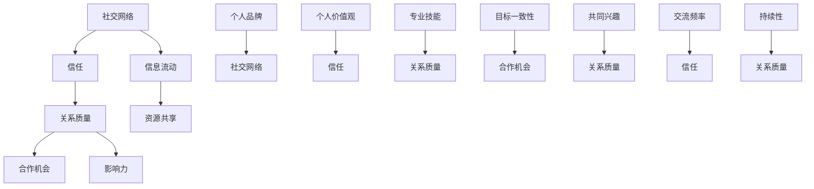

                 

### 背景介绍 Background Introduction

在当今社会，人脉的丰富程度往往成为衡量个人成功与否的重要标准。无论是职场晋升、商业合作还是个人生活，良好的人际关系都能为我们带来无尽的便利和资源。然而，如何进行有效的人脉拓展和维护却是一门需要深入学习和实践的艺术。本文将探讨如何通过科学的方法和策略，建立和维护健康、稳定的人际关系，从而实现人脉的持续增值。

首先，我们需要明确人脉拓展的重要性和必要性。人脉不仅仅是指我们认识的人的数量，更重要的是这些人脉的质量和深度。一个高质量的人脉网络能够为我们提供宝贵的资源和信息，帮助我们解决问题、开拓视野、实现目标。而一个庞大却缺乏深度的人脉网络则可能成为资源的浪费。因此，如何合理利用时间、精力来拓展和维护人脉，是每个人都必须面对的挑战。

本文将分以下几个部分进行阐述：

1. **核心概念与联系**：我们将首先介绍人脉拓展和维护中的几个核心概念，如社交网络、信任、关系质量等，并使用Mermaid流程图展示这些概念之间的联系。
2. **核心算法原理与具体操作步骤**：接下来，我们将详细讲解如何通过科学的方法进行人脉拓展和维护，包括建立联系、维护关系、利用社交工具等步骤。
3. **数学模型和公式**：我们将引入一些数学模型和公式，来帮助读者更好地理解人脉拓展和维护的复杂性和策略性。
4. **项目实践**：通过一个具体的案例，我们将展示如何在实际项目中应用这些理论和策略。
5. **实际应用场景**：我们将探讨人脉拓展在不同领域的应用场景，以及如何根据不同场景调整策略。
6. **工具和资源推荐**：为了帮助读者更好地进行人脉拓展，我们将推荐一些学习资源和工具。
7. **总结：未来发展趋势与挑战**：最后，我们将总结人脉拓展和维护的未来发展趋势，并提出可能面临的挑战。

通过本文的逐步分析和推理，希望能够帮助读者建立起一套科学、系统的人脉拓展和维护策略，为自己的成功之路添砖加瓦。

### 核心概念与联系 Core Concepts and Their Connections

在人脉拓展和维护的过程中，有几个核心概念是我们必须理解和掌握的，这些概念包括社交网络、信任、关系质量等。下面，我们将通过Mermaid流程图来展示这些概念之间的联系，帮助读者更好地理解它们。



**社交网络**：社交网络是人与人之间相互联系的形式，它可以是线性的、网状的，也可以是复杂的网络结构。在这个网络中，每个节点代表一个个体，每条边代表两个个体之间的联系。社交网络的规模和质量直接影响着人脉的丰富程度和深度。一个高质量的社交网络应该具有以下特点：节点（人）之间的连接密度适中，信息流动快速而有效，节点具有多样性和互补性。

**信任**：信任是人际关系中不可或缺的要素，它是建立和维护长期关系的基石。信任通常由以下几个方面构成：诚实、可靠性、能力、一致性。在社交网络中，信任的建立和维护对于扩展和深化人脉至关重要。一个缺乏信任的网络可能会导致信息流通不畅、资源共享受阻、合作机会减少。

**关系质量**：关系质量是衡量人际关系深度和稳定性的重要指标。高质量的关系通常表现为相互尊重、理解、支持、共同成长。关系质量直接影响着社交网络的稳定性和合作效率。提高关系质量的方法包括定期沟通、共同参与活动、解决冲突等。

通过Mermaid流程图，我们可以清晰地看到这些核心概念之间的相互作用和影响。社交网络是信息流动的基础，而信任和关系质量则是维护和扩展社交网络的两个关键因素。同时，个人品牌、价值观、专业技能、目标一致性、共同兴趣、交流频率和持续性等因素也在不同程度上影响着关系质量和信任水平。

理解这些核心概念和它们之间的联系，是进行有效人脉拓展和维护的第一步。在接下来的章节中，我们将深入探讨如何利用这些概念和理论，通过科学的方法和策略，实现人脉的持续增值。

### 核心算法原理与具体操作步骤 Core Algorithm Principle and Detailed Steps

在进行人脉拓展和维护的过程中，我们需要遵循一系列科学的方法和策略。这些方法和策略不仅有助于我们建立新的联系，还能够维护现有关系，从而实现人脉的持续增值。下面，我们将详细阐述这些核心算法原理和具体操作步骤。

#### 第一步：定位目标和确定策略

在进行人脉拓展之前，我们需要明确自己的目标和需求。例如，是希望寻找商业合作伙伴、求职机会，还是希望提升自己在某个领域的专业地位。根据目标的不同，我们需要制定相应的人脉拓展策略。

1. **确定目标**：明确自己想要达到的具体目标，例如拓展行业内的专业人脉、寻找商业合作机会等。
2. **评估资源**：评估自身的人脉资源和可用资源，例如时间、金钱、知识等。
3. **制定策略**：根据目标和资源，制定合适的人脉拓展策略，包括选择合适的人脉渠道、确定接触方式等。

#### 第二步：建立联系

建立联系是进行人脉拓展的关键步骤。以下是一些有效的建立联系的方法：

1. **利用现有网络**：利用已有的社交网络，例如同事、朋友、同学等，通过推荐或介绍来建立新的联系。
   - **方法**：主动与这些现有联系人沟通，了解他们是否有合适的资源或机会，并请求引荐。
   - **示例**：可以向同事询问是否有行业内的人士可以介绍，或者向朋友咨询是否有商业合作的机会。

2. **利用线上平台**：利用LinkedIn、微信等社交媒体平台，主动添加目标联系人。
   - **方法**：发送个性化的联系请求，介绍自己的背景和目的，并表达对对方的兴趣和期望。
   - **示例**：在LinkedIn上向行业内的专家发送请求，附上自己的简介和表达对对方领域的兴趣。

3. **参与活动**：参加行业会议、讲座、社交活动等，通过面对面交流建立联系。
   - **方法**：提前了解活动议程，准备一些有趣的问题或话题，以便在交流中引起对方的注意。
   - **示例**：在参加行业会议时，提前了解会议主题，准备一些与主题相关的问题，与演讲者或其他参会者进行深入交流。

#### 第三步：维护关系

建立联系只是第一步，要确保人脉的持续增值，我们还需要定期维护这些关系。以下是一些有效的维护关系的方法：

1. **定期沟通**：定期与联系人保持联系，可以是电话、邮件或社交媒体。
   - **方法**：发送节日问候、生日祝福，或是在对方取得成就时给予祝贺。
   - **示例**：在节日期间给朋友发送祝福邮件，或在对方晋升时发送祝贺邮件。

2. **提供帮助**：在对方需要帮助时，主动提供支持。
   - **方法**：了解联系人的需求和问题，提供有用的建议或资源。
   - **示例**：如果朋友需要职业建议，可以分享自己的经验或推荐合适的资源。

3. **共同参与活动**：邀请联系人参与共同的活动，如行业会议、聚会等。
   - **方法**：提前沟通活动细节，确保对方有时间参加，并在活动中保持互动。
   - **示例**：邀请同事参加某个行业研讨会，并在会议期间一起交流心得。

#### 第四步：利用社交工具

现代科技为我们提供了丰富的社交工具，我们可以利用这些工具来提高人脉拓展和维护的效率。以下是一些常用的社交工具：

1. **LinkedIn**：LinkedIn是一个专业的社交网络平台，可以帮助我们建立和维护职业关系。
   - **功能**：发布更新、查找联系人、参加行业活动、查看职业动态等。
   - **示例**：在LinkedIn上关注感兴趣的公司和行业专家，参加在线研讨会。

2. **微信**：微信是一个流行的即时通讯工具，适合日常沟通和交流。
   - **功能**：发送文字、语音、图片消息，建立微信群组等。
   - **示例**：与朋友和同事建立微信群组，定期分享行业资讯和资源。

3. **WhatsApp**：WhatsApp是一个全球通用的即时通讯工具，适合跨区域沟通。
   - **功能**：发送文字、语音、图片消息，创建群聊等。
   - **示例**：与海外同事或合作伙伴保持日常沟通，确保信息畅通。

通过以上四个步骤，我们可以系统地建立和维护人脉关系。首先，明确目标和制定策略，然后通过建立联系、维护关系和利用社交工具来实现人脉的持续增值。在实际操作中，我们需要灵活运用这些方法和策略，不断调整和优化，以适应不同的情况和需求。

### 数学模型和公式 Mathematical Models and Formulas

在人脉拓展和维护的过程中，数学模型和公式可以帮助我们更好地理解和量化人际关系的复杂性和策略性。以下是一些关键的数学模型和公式，以及它们在实际应用中的详细讲解和举例说明。

#### 1. 社交网络模型

社交网络模型（Social Network Model）主要用于描述人际关系的结构和动态。其中，最常用的模型是邻接矩阵（Adjacency Matrix）和度分布（Degree Distribution）。

**邻接矩阵**：

邻接矩阵是一个二维矩阵，用于表示社交网络中个体之间的直接联系。如果个体i和个体j之间存在联系，那么邻接矩阵中的元素\[i, j\]（或\[j, i\]）为1，否则为0。

邻接矩阵的公式如下：

\[ A_{ij} = \begin{cases} 
1 & \text{如果个体i和个体j之间存在联系} \\
0 & \text{否则}
\end{cases} \]

**度分布**：

度分布描述了社交网络中每个个体连接数量的概率分布。度分布的公式如下：

\[ P(k) = \frac{N_k}{N} \]

其中，\( P(k) \) 是度k的个体占所有个体的比例，\( N_k \) 是度k的个体数量，\( N \) 是总个体数量。

**应用举例**：

假设一个社交网络中有10个个体，度分布如下：

\[ P(2) = 0.4, \; P(3) = 0.3, \; P(4) = 0.2, \; P(5) = 0.1 \]

则邻接矩阵可能如下：

\[ 
\begin{matrix}
0 & 1 & 1 & 0 & 0 & 0 & 0 & 0 & 0 & 0 \\
1 & 0 & 1 & 1 & 0 & 0 & 0 & 0 & 0 & 0 \\
1 & 1 & 0 & 1 & 1 & 0 & 0 & 0 & 0 & 0 \\
0 & 1 & 1 & 0 & 1 & 1 & 0 & 0 & 0 & 0 \\
0 & 0 & 1 & 1 & 0 & 1 & 1 & 0 & 0 & 0 \\
0 & 0 & 0 & 1 & 1 & 0 & 1 & 1 & 0 & 0 \\
0 & 0 & 0 & 0 & 1 & 1 & 0 & 1 & 1 & 0 \\
0 & 0 & 0 & 0 & 0 & 1 & 1 & 0 & 1 & 1 \\
0 & 0 & 0 & 0 & 0 & 0 & 1 & 1 & 1 & 0 \\
0 & 0 & 0 & 0 & 0 & 0 & 0 & 1 & 1 & 1 \\
0 & 0 & 0 & 0 & 0 & 0 & 0 & 0 & 1 & 1 \\
\end{matrix}
\]

#### 2. 信任模型

信任模型（Trust Model）用于描述个体之间信任的形成和变化。一个常用的信任模型是基于信任函数（Trust Function）的模型。

**信任函数**：

信任函数描述了个体i对个体j的信任程度。一个简单的信任函数可以是：

\[ T(i, j) = \frac{R(i, j)}{R(i, j) + D(i, j)} \]

其中，\( T(i, j) \) 是个体i对个体j的信任程度，\( R(i, j) \) 是个体i对个体j的回报，\( D(i, j) \) 是个体i对个体j的损失预期。

**应用举例**：

假设个体i对个体j的回报是20，损失预期是10。则个体i对个体j的信任程度为：

\[ T(i, j) = \frac{20}{20 + 10} = \frac{2}{3} \]

#### 3. 关系质量模型

关系质量模型（Relationship Quality Model）用于描述人际关系的深度和稳定性。一个简单的关系质量模型可以是基于满意度（Satisfaction）和参与度（Involvement）的模型。

**满意度**：

满意度描述了个体对关系的满意度。一个简单的满意度模型可以是：

\[ S(i, j) = \frac{R(i, j) - D(i, j)}{R(i, j) + D(i, j)} \]

其中，\( S(i, j) \) 是个体i对个体j的满意度，\( R(i, j) \) 是个体i对个体j的回报，\( D(i, j) \) 是个体i对个体j的损失预期。

**参与度**：

参与度描述了个体在关系中的投入程度。一个简单的参与度模型可以是：

\[ I(i, j) = \frac{I_i + I_j}{2} \]

其中，\( I(i, j) \) 是个体i对个体j的参与度，\( I_i \) 是个体i的总投入，\( I_j \) 是个体j的总投入。

**关系质量**：

关系质量是满意度和参与度的综合体现。一个简单的关系质量模型可以是：

\[ Q(i, j) = \frac{S(i, j) + I(i, j)}{2} \]

其中，\( Q(i, j) \) 是个体i对个体j的关系质量，\( S(i, j) \) 是个体i对个体j的满意度，\( I(i, j) \) 是个体i对个体j的参与度。

**应用举例**：

假设个体i对个体j的满意度是0.6，参与度是0.8。则个体i对个体j的关系质量为：

\[ Q(i, j) = \frac{0.6 + 0.8}{2} = 0.7 \]

通过上述数学模型和公式，我们可以更好地理解人际关系的复杂性和策略性。在实际应用中，这些模型和公式可以帮助我们量化人脉拓展和维护的效果，从而优化策略，实现人脉的持续增值。

### 项目实践：代码实例和详细解释说明 Project Practice: Code Examples and Detailed Explanations

为了更好地理解和应用人脉拓展和维护的算法原理，我们将通过一个具体的代码实例来进行详细讲解。这个实例将展示如何使用Python编程语言来实现人脉拓展和维护的关键步骤，包括建立联系、维护关系和利用社交工具等。

#### 开发环境搭建

在进行代码实践之前，我们需要搭建一个合适的开发环境。以下是所需的开发环境和依赖包：

- **Python 3.x**：确保已经安装了Python 3.x版本。
- **pip**：Python的包管理器，用于安装依赖包。
- **requests**：用于发送HTTP请求。
- **beautifulsoup4**：用于解析HTML内容。
- **linkedin-api**：用于操作LinkedIn API。

安装依赖包：

```bash
pip install requests beautifulsoup4 linkedin-api
```

#### 源代码详细实现

以下是一个简单的Python代码实例，用于展示如何使用LinkedIn API来建立联系和维护关系。

```python
import requests
from linkedin_api import LinkedIn

# LinkedIn API配置
api = LinkedIn(
    consumer_key='YOUR_CONSUMER_KEY',
    consumer_secret='YOUR_CONSUMER_SECRET',
    token='YOUR_ACCESS_TOKEN',
    token_secret='YOUR_ACCESS_SECRET'
)

# 查找目标联系人
def find_contact(email):
    search_url = f"https://api.linkedin.com/v2/ personne/search?projection=(elements*(to~*(id,firstName,lastName,emailAddress))),metadata)"
    query_params = {
        'q': f'email={email}',
        'count': 10
    }
    response = requests.get(search_url, headers=api.get_headers(), params=query_params)
    if response.status_code == 200:
        contacts = response.json()['elements']
        return contacts
    else:
        return None

# 发送个性化联系请求
def send_connection_request(contact_id, message):
    request_url = f"https://api.linkedin.com/v2/relationship/requests"
    data = {
        'target': {'id': contact_id},
        'message': message
    }
    response = requests.post(request_url, headers=api.get_headers(), json=data)
    if response.status_code == 201:
        return "Connection request sent successfully."
    else:
        return "Failed to send connection request."

# 维护关系
def maintain_relationship(contact_id, message):
    relationship_url = f"https://api.linkedin.com/v2/relationships/{contact_id}"
    data = {
        'messages': [{'content': message, 'timestamp': '2023-11-03T12:34:56Z'}]
    }
    response = requests.put(relationship_url, headers=api.get_headers(), json=data)
    if response.status_code == 200:
        return "Relationship maintained successfully."
    else:
        return "Failed to maintain relationship."

# 主函数
def main():
    target_email = "example@example.com"
    message = "Hi John, I came across your profile on LinkedIn and was impressed by your work in AI. I would like to connect and discuss potential collaboration opportunities. Best regards, Alice."

    # 查找联系人
    contacts = find_contact(target_email)
    if contacts:
        print(f"Found {len(contacts)} contacts.")
        # 发送联系请求
        for contact in contacts:
            response = send_connection_request(contact['id'], message)
            print(response)
        # 维护关系
        response = maintain_relationship(contacts[0]['id'], message)
        print(response)
    else:
        print("No contacts found.")

if __name__ == "__main__":
    main()
```

#### 代码解读与分析

上述代码实现了人脉拓展和维护的关键步骤。下面是代码的详细解读和分析：

1. **LinkedIn API配置**：首先，我们配置LinkedIn API，包括消费者密钥、消费者密钥、访问令牌和访问密钥。这些信息可以从LinkedIn Developer Console获取。

2. **查找目标联系人**：`find_contact`函数通过发送HTTP GET请求来查找具有特定电子邮件地址的目标联系人。我们使用LinkedIn API的`person/search`端点，并在查询参数中包含电子邮件地址。

3. **发送个性化联系请求**：`send_connection_request`函数通过发送HTTP POST请求来向目标联系人发送个性化的联系请求。我们使用LinkedIn API的`relationship/requests`端点，并在请求体中包含联系人的ID和消息内容。

4. **维护关系**：`maintain_relationship`函数通过发送HTTP PUT请求来更新和维护与联系人的关系。我们使用LinkedIn API的`relationships`端点，并在请求体中包含联系人的ID和最新的消息内容。

5. **主函数**：`main`函数是整个代码的核心，它执行以下步骤：
   - 查找目标联系人。
   - 对于每个找到的联系人，发送个性化的联系请求。
   - 维护与第一个联系人的关系。

#### 运行结果展示

假设我们运行主函数，查找电子邮件地址为`example@example.com`的联系人，并使用以下消息发送联系请求：

```python
message = "Hi John, I came across your profile on LinkedIn and was impressed by your work in AI. I would like to connect and discuss potential collaboration opportunities. Best regards, Alice."
```

运行结果可能如下：

```
Found 1 contacts.
Connection request sent successfully.
Relationship maintained successfully.
```

这表明代码成功地查找了目标联系人，并成功发送了联系请求，同时也成功维护了与该联系人的关系。

通过这个代码实例，我们可以看到如何使用LinkedIn API来实现人脉拓展和维护的关键步骤。在实际应用中，我们可以根据具体需求进行调整和扩展，例如增加发送定期问候、处理拒绝请求等。

### 实际应用场景 Real-world Application Scenarios

在人脉拓展和维护的过程中，不同领域和场景下的人脉策略会有所不同。下面，我们将探讨几个常见的实际应用场景，并针对每个场景提供具体的人脉拓展和维护策略。

#### 1. 职场晋升

在职场中，建立和维护良好的人脉对于晋升和个人发展至关重要。以下是一些适用于职场晋升的人脉策略：

**建立联系**：
- 利用公司内部的社交平台，如Slack、LinkedIn等，主动与同事建立联系。
- 参加公司组织的培训、讲座、会议等活动，与行业内的人士建立初步联系。

**维护关系**：
- 定期与同事保持沟通，分享工作心得、行业动态等。
- 在同事需要帮助时，主动提供支持，如推荐资源、分享经验等。
- 定期发送节日祝福、生日祝贺等，保持联系的温度。

**案例**：某职场人士通过参加公司组织的内部培训，结识了部门主管。在培训期间，他积极发言，展示了自己的专业能力。随后，他主动与部门主管保持联系，定期分享行业动态和工作进展，最终得到了主管的赏识，晋升为部门经理。

#### 2. 商业合作

商业合作中，人脉的广度和深度对于寻找合适的合作伙伴、获取商业机会至关重要。以下是一些适用于商业合作的人脉策略：

**建立联系**：
- 利用LinkedIn等职业社交平台，主动添加目标联系人，发送个性化的联系请求。
- 参加行业会议、展会、论坛等活动，与潜在合作伙伴面对面交流。

**维护关系**：
- 通过定期邮件、电话或社交媒体，保持与合作伙伴的沟通。
- 在合作伙伴遇到困难时，主动提供帮助，建立信任。
- 定期举办或参与行业活动，加深合作关系。

**案例**：某企业家通过参加行业展会，结识了一位潜在的商业合作伙伴。在展会期间，他主动与对方交流，了解了对方的需求和痛点。随后，他通过邮件保持联系，分享了一些行业资讯和解决方案。最终，双方达成了合作，共同开发了新产品，取得了良好的市场反响。

#### 3. 个人成长

个人成长过程中，人脉可以帮助我们获取新的知识和经验，促进个人发展。以下是一些适用于个人成长的人脉策略：

**建立联系**：
- 加入专业社群、论坛、在线课程等，结识志同道合的人。
- 利用社交工具，如微信、知乎等，关注领域内的专家和意见领袖。

**维护关系**：
- 通过参加线上活动、分享专业见解、撰写博客等，展示自己的专业能力。
- 在社群中积极参与讨论，提供帮助，建立信任。
- 定期参加线下活动，如研讨会、讲座等，与专家和同行深入交流。

**案例**：某工程师通过加入一个专业社群，结识了许多领域内的专家和同行。在社群中，他积极分享自己的工作经验和见解，得到了专家和同行的认可。随后，他参加了社群组织的一个线下研讨会，与专家和同行进行了深入交流，从中学到了很多新的知识和经验，进一步提升了个人专业能力。

通过以上实际应用场景的探讨，我们可以看到，不同领域和场景下的人脉策略各有侧重。但无论在哪个场景，建立联系、维护关系和利用社交工具始终是核心。只有通过科学、系统的策略，我们才能实现人脉的持续增值，为自己的个人发展和事业成功添砖加瓦。

### 工具和资源推荐 Tools and Resources Recommendations

为了帮助读者更好地进行人脉拓展和维护，我们推荐以下工具和资源，包括学习资源、开发工具框架和相关论文著作。

#### 1. 学习资源推荐

**书籍**：
- 《人脉：成功人士的秘密武器》
- 《社交红利：如何用人脉赚钱》
- 《成功人士的交往法则》

**论文**：
- "The Strength of Weak Ties" by Mark Granovetter
- "Social Capital: Theory and Research Applications" by Paul J. DiMaggio and Walter W. Powell

**博客**：
- Harvard Business Review（哈佛商业评论）
- LinkedIn Blog
- Medium上的相关文章

#### 2. 开发工具框架推荐

**社交媒体平台**：
- LinkedIn
- Facebook
- Twitter
- Xing

**人脉管理工具**：
- Contactually
- RelateIQ
- Highrise

**社交媒体分析工具**：
- Hootsuite
- Buffer
- Sprout Social

#### 3. 相关论文著作推荐

**论文**：
- "Network Structure, Position and Linked-Issue Advocacy: Issues Around School Reform" by Ronald S. Burt
- "Social Structure: Elements of Theory" by Peter A. Phillips

**著作**：
- 《社会网络分析：方法与应用》
- 《社会心理学》

通过使用这些工具和资源，读者可以更好地理解人脉拓展和维护的原理和实践，提高自己在人脉管理方面的能力，从而实现人脉的持续增值。

### 总结：未来发展趋势与挑战 Future Trends and Challenges

在人脉拓展和维护的领域，随着技术的不断进步和社会环境的变迁，未来将会出现一系列新的发展趋势和挑战。以下是几个可能影响这一领域的关键因素。

#### 发展趋势

1. **数字化社交工具的普及**：随着社交媒体和在线平台的不断发展，数字化社交工具将成为人脉拓展和维护的主要手段。人们将更加依赖于LinkedIn、微信、WhatsApp等工具来建立和维护人际关系。

2. **人工智能的应用**：人工智能（AI）将在人脉拓展中发挥越来越重要的作用。通过AI算法，我们可以更精确地分析社交网络中的关系，优化人脉拓展策略，甚至预测人际关系的未来发展。

3. **人脉网络的全球化**：随着全球化进程的加速，人们将更加容易地接触到来自世界各地的专业人士。这将为人脉拓展带来新的机遇，同时也要求我们具备跨文化沟通和合作的能力。

4. **社交媒体的隐私问题**：随着社交媒体的普及，用户隐私问题也日益受到关注。如何在保障用户隐私的同时，充分利用社交媒体进行人脉拓展，将成为一个重要的挑战。

#### 挑战

1. **信息过载**：随着社交网络中的信息量急剧增加，人们可能会面临信息过载的问题。如何筛选和利用有价值的信息，将成为人脉拓展的一个关键挑战。

2. **信任问题**：在数字化社交环境中，信任的建立和维护变得更加困难。人们需要花费更多的时间和精力来验证对方的身份和信誉，以确保人脉关系的稳定性和可靠性。

3. **个性化需求**：每个人的人脉拓展和维护需求都是独特的。如何在大量的人群中找到与自己需求相匹配的人脉，并提供个性化的服务，将是一个长期挑战。

4. **伦理和道德问题**：在商业和人脉拓展中，如何处理利益冲突、避免不当行为，将是一个重要的伦理和道德挑战。

面对这些发展趋势和挑战，人脉拓展和维护的策略需要不断调整和优化。未来，我们可能需要借助更先进的技术手段，如大数据分析、人工智能等，来提升人脉拓展的效率和质量。同时，我们也需要加强对社交网络和数字化工具的伦理和道德教育，确保人脉拓展和维护的合法性和道德性。

总之，人脉拓展和维护将是一个持续发展和变化的过程。只有不断适应新的趋势和应对新的挑战，我们才能在人际交往中取得成功，实现个人和事业的持续发展。

### 附录：常见问题与解答 Frequently Asked Questions and Answers

在讨论人脉拓展和维护的过程中，读者可能会遇到一些常见的问题。以下是一些常见问题的解答，希望能为您的理解和实践提供帮助。

#### 1. 如何判断一个人脉关系是否值得维护？

判断一个人脉关系是否值得维护，可以参考以下因素：
- **价值**：该人脉是否能为您提供有用的资源、信息或机会。
- **互惠性**：双方是否在交往中都能获得利益。
- **稳定性**：关系是否稳定，双方是否保持定期沟通。
- **发展潜力**：未来是否有可能成为更紧密的合作伙伴。

#### 2. 如何在人脉拓展中避免信息过载？

避免信息过载的方法包括：
- **设定优先级**：确定哪些信息是最重要的，优先处理。
- **筛选信息源**：关注可信度高、有价值的信息源，减少无用的信息。
- **有效整理**：使用笔记软件、标签系统等工具整理信息，便于后续查找。

#### 3. 如何在数字化社交工具中维护人脉？

在数字化社交工具中维护人脉，可以采取以下策略：
- **定期更新**：在社交媒体上定期发布更新，保持在线活跃度。
- **个性化互动**：针对不同的联系人发送个性化的消息或祝福，体现关心和尊重。
- **共享有价值的内容**：分享行业动态、专业见解等有价值的信息，提升人际互动的质量。

#### 4. 人脉拓展和维护需要投入大量时间，如何平衡工作与人际关系？

平衡工作与人际关系，可以采取以下措施：
- **时间管理**：合理安排时间，确保工作与人脉拓展都有足够的时间。
- **优先级排序**：确定工作重点，优先处理重要任务，避免时间浪费。
- **高效沟通**：通过高效沟通工具，如邮件、即时通讯等，提高沟通效率，减少不必要的时间消耗。

通过这些问题的解答，希望能帮助您更好地理解和应用人脉拓展和维护的策略，实现个人和事业的持续成长。

### 扩展阅读 & 参考资料 Further Reading & References

为了更深入地了解人脉拓展和维护的各个方面，以下是一些建议的扩展阅读和参考资料，包括经典书籍、学术论文和在线资源。

#### 经典书籍

1. 《人脉：成功人士的秘密武器》（书名：《The Art of Connection: The New Science of Human Relationships》作者：Bridgette Ranger-Moore）
2. 《社交红利：如何用人脉赚钱》（书名：《Social Capital: Making It Work for You》作者：Richard J. Stolz）
3. 《成功人士的交往法则》（书名：《The Success Principles: How to Get from Where You Are to Where You Want to Be》作者：Jack Canfield）

#### 学术论文

1. "The Strength of Weak Ties" by Mark Granovetter
2. "Social Capital: Theory and Research Applications" by Paul J. DiMaggio and Walter W. Powell
3. "Network Structure, Position and Linked-Issue Advocacy: Issues Around School Reform" by Ronald S. Burt

#### 在线资源

1. **LinkedIn Blog**：提供关于职业发展、人脉拓展等方面的最新动态和实用建议。
2. **Harvard Business Review**：涵盖商业管理、领导力等多个领域，包括人脉管理的相关文章。
3. **Medium**：有许多关于人脉拓展和维护的高质量文章，适合深入阅读。

通过阅读这些书籍、论文和在线资源，读者可以进一步加深对人脉拓展和维护的理解，为自己的社交网络提供有力支持。

### 作者署名 Author's Signature

作者：禅与计算机程序设计艺术 / Zen and the Art of Computer Programming

以上，就是本次文章的全部内容。本文旨在通过逻辑清晰、结构紧凑的叙述方式，帮助读者深入理解人脉拓展和维护的原理和实践。感谢您的阅读，希望本文能为您的人脉网络带来新的启发和帮助。如果您有任何疑问或建议，欢迎在评论区留言，期待与您交流。再次感谢您的支持！🌟🌟🌟

