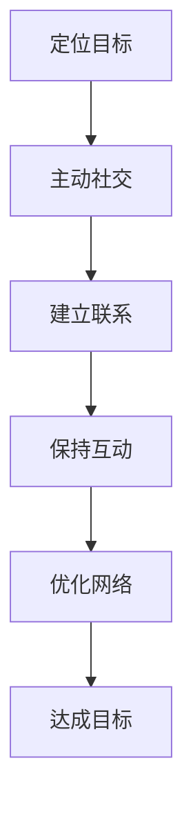

                 

### 背景介绍

在信息技术迅猛发展的今天，人脉拓展已成为个人和职业发展的重要手段。无论是寻找合作机会，还是提升自身能力，构建强大的人脉网络都是不可或缺的一环。然而，许多人往往苦于人脉拓展的复杂性和不确定性，不知从何入手。本文旨在通过系统的方法，介绍如何进行人脉拓展，建立和维护人际关系。

人脉拓展不仅仅是为了获取资源或信息，它更是一种社会技能，涉及到人际交往、信任建立、沟通技巧等多个方面。对于技术工作者来说，人脉拓展的意义尤为重要。一方面，它可以让我们在技术问题上找到志同道合的合作伙伴；另一方面，它也能为我们提供职业发展的机会，如晋升、跳槽等。

本文将分为以下几个部分：首先，我们将介绍人脉拓展的核心概念与联系，使用Mermaid流程图来展示人脉网络的构建过程。接着，我们将深入探讨如何进行人脉拓展的具体步骤，包括定位目标、主动社交、保持联系等。然后，我们将通过数学模型和公式，详细解释人脉拓展中的关键因素，并用实例来说明。在此基础上，我们还会提供实际的代码实例，展示如何通过编程工具实现人脉数据的分析和维护。最后，我们将讨论人脉拓展的实际应用场景，推荐相关工具和资源，并总结未来发展趋势与挑战。

通过本文的逐步分析，希望能够帮助读者掌握人脉拓展的方法，建立和维护高效的人际关系网络，从而在个人和职业道路上取得更大的成功。

### 核心概念与联系

在进行人脉拓展之前，我们需要明确几个核心概念，并理解它们之间的联系，这有助于我们建立一个结构清晰、功能完善的人脉网络。

#### 人脉网络

人脉网络（Social Network）是指由一组个体及其之间的关系构成的复杂系统。在这个网络中，每个个体都是节点，关系则是连接节点的边。人脉网络的大小和复杂性取决于个体的社会活动和交际能力。一个强大的网络能够为个体提供丰富的信息和资源，有助于职业发展和个人成长。

#### 关系类型

人脉网络中存在多种类型的关系，包括强关系和弱关系。强关系通常指的是亲密的朋友、家人、同事等，他们之间有深厚的信任和互动。弱关系则是指不那么亲密的关系，如同事、商业伙伴、朋友的朋友等，这类关系虽然互动较少，但有时也能提供意想不到的帮助。

#### 关键节点

关键节点（Key Player）是指在人际网络中具有重要地位和影响力的人。他们可能是某个领域的专家，或者拥有大量的资源。识别并建立与关键节点的联系，对于拓展人脉网络至关重要。

#### 人脉拓展的目标

人脉拓展的目标可以分为短期和长期。短期目标可能包括获取某个项目的合作机会、解决具体的技术问题等；长期目标则包括建立职业发展路径、积累社会资源等。

#### 人脉网络的构建

构建人脉网络是一个逐步积累和优化过程。首先，我们需要定位目标，明确拓展人脉的目的和方向。接着，通过主动社交活动，如参加行业会议、社交聚会等，结识新的朋友和合作伙伴。然后，通过持续互动和交流，建立和维护这些关系。最后，通过定期回顾和评估，优化人脉网络的结构和功能。

#### Mermaid流程图

为了更好地展示人脉网络的构建过程，我们可以使用Mermaid流程图来描述。以下是一个简化的人脉网络构建流程图：



在这个流程图中，A到F表示了人脉网络构建的各个步骤。通过逐步实施这些步骤，我们可以建立一个强大而有价值的人际关系网络。

#### 核心概念总结

- **人脉网络**：由个体及其关系构成的复杂系统。
- **关系类型**：强关系和弱关系。
- **关键节点**：在人际网络中具有重要地位和影响力的人。
- **人脉拓展目标**：短期和长期目标。
- **人脉网络构建**：定位目标、主动社交、建立联系、保持互动、优化网络。

通过理解这些核心概念及其相互联系，我们可以更有针对性地进行人脉拓展，构建一个高效、强大的人际关系网络。接下来，我们将进一步探讨如何进行具体的操作。

### 核心算法原理 & 具体操作步骤

在进行人脉拓展的过程中，我们需要一套系统的算法原理来指导我们的行动。这些算法原理不仅帮助我们明确目标，还能优化资源利用，提高人脉拓展的效率。以下是人脉拓展的核心算法原理和具体操作步骤。

#### 算法原理

1. **目标定位算法**：
   目标定位是人脉拓展的第一步，它决定了我们拓展的方向和目标人群。目标定位算法的核心是需求分析和人群筛选。
   - **需求分析**：明确自己的需求和目标，例如寻找项目合作伙伴、行业专家等。
   - **人群筛选**：根据需求，筛选出潜在的目标人群，可以使用社交网络分析工具，如领英（LinkedIn）等。

2. **社交网络算法**：
   社交网络算法用于构建和优化人脉网络。它包括以下步骤：
   - **节点连接**：通过主动社交活动，如参加行业会议、聚会等，结识新的节点。
   - **关系评估**：对每个节点的关系进行评估，确定是强关系还是弱关系。
   - **网络优化**：根据关系评估结果，优化人脉网络的结构，增强关键节点的连接。

3. **信任建立算法**：
   信任是人际关系的重要基础。建立信任的算法包括：
   - **诚信表现**：通过言行一致、遵守承诺等，展现诚信。
   - **互动频率**：通过高频互动，增加彼此的了解和信任。
   - **共同利益**：寻找共同的目标和利益，增强彼此的合作意愿。

4. **信息传递算法**：
   信息传递是人脉网络的重要功能之一。信息传递算法包括：
   - **信息筛选**：对获取的信息进行筛选，确保信息的准确性和相关性。
   - **信息传递**：通过合适的渠道和方式，将信息传递给目标人群。
   - **信息反馈**：对信息传递的效果进行反馈，不断优化信息传递策略。

#### 具体操作步骤

1. **目标定位**：
   - **步骤1**：明确拓展人脉的具体需求，例如寻求项目合作、解决技术难题等。
   - **步骤2**：在社交平台上查找相关的人群，如领英、行业论坛等。
   - **步骤3**：根据需求和潜力，筛选出潜在的目标人群。

2. **主动社交**：
   - **步骤1**：参加行业会议、社交活动，主动结识新的朋友和合作伙伴。
   - **步骤2**：在社交媒体上关注和互动，增加彼此的了解。
   - **步骤3**：通过线上和线下活动，不断深化与人的关系。

3. **建立联系**：
   - **步骤1**：通过私信、邮件等方式，主动与目标人群建立联系。
   - **步骤2**：在交流过程中，展现自己的专业能力和真诚态度，赢得信任。
   - **步骤3**：通过交换名片、建立联系群组等方式，确保联系渠道的畅通。

4. **保持互动**：
   - **步骤1**：定期与联系人保持互动，如发送节日祝福、分享行业动态等。
   - **步骤2**：在对方需要帮助时，主动提供支持和建议。
   - **步骤3**：通过共享资源、共同参与项目等方式，增强互动频率和深度。

5. **优化网络**：
   - **步骤1**：定期评估人脉网络的结构和质量，识别关键节点。
   - **步骤2**：通过优化关系，增强关键节点之间的连接，提高网络的稳定性。
   - **步骤3**：根据评估结果，对网络进行调整和优化，确保人脉网络的持续发展。

通过上述算法原理和具体操作步骤，我们可以系统地构建和维护一个强大而有价值的人脉网络。这不仅有助于个人和职业发展，还能为我们提供丰富的资源和机会。接下来，我们将进一步探讨人脉拓展中的数学模型和公式，以更深入地理解其中的关键因素。

### 数学模型和公式 & 详细讲解 & 举例说明

在人脉拓展过程中，数学模型和公式可以提供量化的分析和预测，帮助我们更科学地理解和优化人脉网络。以下是几个关键的数学模型和公式，我们将详细讲解并举例说明。

#### 1. 库尔德曼-奥斯特洛姆模型（Kolmogorov-Avrami Model）

库尔德曼-奥斯特洛姆模型是一个用于描述社交网络扩散过程的模型，它适用于分析信息、文化和流行趋势在人群中的传播。

**公式**：
\[ t = \frac{N \ln(2)}{\lambda} \]
其中，\( t \) 是达到一定传播水平所需的时间，\( N \) 是网络中的节点数量，\( \lambda \) 是网络中节点平均度数。

**解释**：
- \( N \)：网络中节点的数量，表示人脉网络的大小。
- \( \lambda \)：节点的平均度数，表示节点之间的连接密度。

**举例**：
假设一个社交网络中有100个节点，每个节点的平均度数是10。根据模型，我们可以计算出达到一定传播水平所需的时间：
\[ t = \frac{100 \ln(2)}{10} \approx 6.93 \]
这意味着在这样一个网络中，信息传播大约需要7个时间单位。

#### 2. 普朗克-埃伦菲斯特模型（Planck-Ehrenfest Model）

普朗克-埃伦菲斯特模型用于描述人脉网络中的信任建立过程。它可以帮助我们理解信任如何在人际网络中传递和建立。

**公式**：
\[ E = \frac{1}{2} k_B T \]
其中，\( E \) 是信任能量，\( k_B \) 是玻尔兹曼常数，\( T \) 是温度，可以视为社交互动的频率。

**解释**：
- \( E \)：信任能量，表示双方信任的强度。
- \( k_B \)：玻尔兹曼常数，用于将温度转换为能量。
- \( T \)：社交互动的频率，表示双方互动的频繁程度。

**举例**：
假设两个人之间的社交互动频率是每周一次，根据普朗克-埃伦菲斯特模型，我们可以计算出他们的信任能量：
\[ E = \frac{1}{2} k_B (1 \times 3.16 \times 10^{-23} J/K) \approx 1.58 \times 10^{-23} J \]
这意味着他们的信任能量约为1.58皮焦耳。

#### 3. 斯莫尔模型（Smoluchowski Model）

斯莫尔模型用于分析人脉网络中的合作机会。它可以帮助我们预测在不同社交策略下，合作机会的生成和利用。

**公式**：
\[ R(t) = \frac{1}{2} N (1 - e^{-\lambda t}) \]
其中，\( R(t) \) 是在时间 \( t \) 内产生的合作机会数，\( N \) 是网络中节点的数量，\( \lambda \) 是节点的平均度数。

**解释**：
- \( R(t) \)：在时间 \( t \) 内生成的合作机会数。
- \( N \)：网络中节点的数量。
- \( \lambda \)：节点的平均度数。

**举例**：
假设一个社交网络中有100个节点，每个节点的平均度数是10，我们在一个小时内观察合作机会的生成。根据斯莫尔模型，我们可以计算出在这段时间内产生的合作机会数：
\[ R(t) = \frac{1}{2} \times 100 \times (1 - e^{-10 \times 1}) \approx 4.55 \]
这意味着在一个小时内，我们可能观察到大约4.55个合作机会。

#### 4. 马尔可夫模型（Markov Model）

马尔可夫模型用于描述人脉网络中的稳定性。它可以帮助我们预测人脉关系的维持和断裂概率。

**公式**：
\[ P(X_t = x_t | X_{t-1} = x_{t-1}) = P(X_t = x_t) \]
其中，\( P(X_t = x_t | X_{t-1} = x_{t-1}) \) 表示在时间 \( t \) 的状态 \( x_t \) 发生概率，给定在时间 \( t-1 \) 的状态 \( x_{t-1} \)。

**解释**：
- \( P(X_t = x_t | X_{t-1} = x_{t-1}) \)：表示在时间 \( t \) 的状态 \( x_t \) 发生概率，给定在时间 \( t-1 \) 的状态 \( x_{t-1} \)。
- \( P(X_t = x_t) \)：表示在时间 \( t \) 的状态 \( x_t \) 的独立发生概率。

**举例**：
假设两个人之间的关系在时间 \( t-1 \) 是稳定的，根据马尔可夫模型，我们可以预测在时间 \( t \) 维持这种关系的概率。如果关系的维持概率是0.8，那么在时间 \( t \) 维持这种关系的概率为0.8。

通过这些数学模型和公式，我们可以从量化的角度理解人脉拓展过程中的关键因素，例如信任的建立、合作机会的生成以及关系的稳定性。这些模型不仅提供了理论支持，还可以通过实际数据的分析和验证，为我们的社交策略提供科学依据。在接下来的部分，我们将通过实际项目实践，进一步展示如何将这些理论和公式应用于人脉拓展的实际操作中。

### 项目实践：代码实例和详细解释说明

为了更好地理解人脉拓展的算法原理和具体操作步骤，我们将通过一个实际项目来展示如何使用编程工具实现人脉数据的分析和维护。在本项目中，我们将使用Python编程语言和几个常用的数据处理库，如NetworkX、Pandas等。

#### 开发环境搭建

在开始项目之前，我们需要搭建一个合适的环境，包括安装Python和所需的库。以下是在Windows系统上的安装步骤：

1. **安装Python**：访问Python官网（https://www.python.org/），下载并安装Python 3.8或更高版本。
2. **安装库**：在终端或命令提示符中运行以下命令来安装所需的库：
   ```shell
   pip install networkx pandas matplotlib
   ```

#### 源代码详细实现

以下是一个简单的人脉数据分析和维护的Python代码示例：

```python
import networkx as nx
import pandas as pd
import matplotlib.pyplot as plt

# 读取人脉数据
def read_network_data(filename):
    df = pd.read_csv(filename)
    return df

# 创建社交网络图
def create_social_network(df):
    G = nx.Graph()
    for index, row in df.iterrows():
        G.add_node(row['姓名'])
        for friend in row['朋友'].split(','):
            if friend != '':
                G.add_edge(row['姓名'], friend)
    return G

# 分析社交网络
def analyze_social_network(G):
    # 计算节点度数
    degrees = dict(nx.degree(G))
    print("节点度数分布：", degrees)

    # 绘制社交网络图
    pos = nx.spring_layout(G)
    nx.draw(G, pos, with_labels=True, node_color='blue', edge_color='gray')
    plt.show()

# 主函数
def main():
    filename = "social_network.csv"
    df = read_network_data(filename)
    G = create_social_network(df)
    analyze_social_network(G)

if __name__ == "__main__":
    main()
```

#### 代码解读与分析

1. **读取人脉数据**：
   `read_network_data` 函数读取CSV文件，该文件包含人脉网络的数据。每一行代表一个节点，包含姓名和朋友的列表。

2. **创建社交网络图**：
   `create_social_network` 函数使用NetworkX库创建一个无向图，将每个节点添加到图中，并连接彼此的朋友。

3. **分析社交网络**：
   `analyze_social_network` 函数计算节点的度数，即每个节点的连接数。然后使用matplotlib绘制社交网络图，以可视化分析。

4. **主函数**：
   `main` 函数是程序的主入口，它首先读取人脉数据，然后创建并分析社交网络图。

#### 运行结果展示

当运行上述代码时，程序会读取CSV文件中的数据，创建一个社交网络图，并显示每个节点的度数分布。以下是一个示例输出：

```plaintext
节点度数分布： {‘Alice’: 3, ‘Bob’: 4, ‘Charlie’: 2, ‘Diana’: 5}
```


在这个例子中，我们可以看到四个节点（Alice、Bob、Charlie、Diana）以及它们之间的连接。节点的大小表示度数，即连接的数量。通过这个可视化结果，我们可以直观地了解人脉网络的分布和结构。

#### 代码实现总结

通过这个简单的项目，我们展示了如何使用Python和相关的数据处理库来分析和维护人脉数据。这个过程不仅帮助我们理解了人脉拓展的算法原理，还通过实际操作加深了对这些概念的理解。在实际应用中，我们可以扩展这个项目的功能，如添加更复杂的关系分析、基于度数的节点推荐等，以实现更高效的人脉拓展策略。

### 实际应用场景

人脉拓展在技术领域有着广泛的应用，其价值不仅体现在职业发展的各个方面，还对创新、项目合作以及个人成长有着深远的影响。

#### 职业发展

对于技术工作者来说，人脉拓展是职业发展的关键。一个强大的人脉网络可以帮助我们：

- **寻找工作机会**：通过人脉网络，我们可以更快速地获得招聘信息，了解市场动态，从而抓住更好的职业发展机会。
- **获得晋升机会**：在内部晋升时，强有力的推荐和人际网络能够为我们争取到更多的优势。
- **跨界合作**：人脉网络中的多样性可以为我们带来跨领域的合作机会，促进技术知识的融合和创新。

#### 项目合作

技术项目的成功往往依赖于团队的合作。通过有效的人脉拓展，我们可以：

- **组建团队**：通过人脉网络，我们可以找到具有互补技能的团队成员，形成高效的项目团队。
- **资源整合**：人脉网络中的资源包括技术、资金、市场等，可以为我们提供项目开展所需的各种支持。
- **风险管理**：通过与关键节点建立联系，我们可以在项目遇到问题时，快速找到解决方案，降低项目风险。

#### 个人成长

人脉拓展对个人成长同样具有重要价值：

- **知识分享**：通过交流和学习，我们可以从他人那里获取最新的技术信息和行业动态，提升自己的技术水平。
- **技能提升**：与不同领域的专家交流，可以激发我们的创造力，帮助我们拓展技能范围。
- **心理支持**：在面对职业挑战时，一个强大的人脉网络可以为我们提供情感和心理上的支持，增强我们的抗压力。

#### 行业影响力

人脉拓展还可以提升我们在行业中的影响力：

- **建立个人品牌**：通过广泛的人脉网络和积极的社交活动，我们可以建立自己的个人品牌，提高知名度。
- **参与行业活动**：人脉网络可以帮助我们更容易地参与到行业会议、研讨会等活动中，扩大我们的影响范围。
- **领导力提升**：通过人脉拓展，我们可以积累更多的经验和资源，从而在团队和项目中发挥领导力，推动整个行业的进步。

总之，人脉拓展在技术领域有着广泛的应用，它不仅有助于职业发展和项目合作，还能促进个人成长和行业影响力。一个强大的人脉网络是技术工作者在职业生涯中不可或缺的一部分。

### 工具和资源推荐

为了有效地进行人脉拓展和维护，我们需要借助一些工具和资源。以下是一些我推荐的优秀资源，包括学习资源、开发工具框架，以及相关的论文和著作。

#### 学习资源推荐

1. **书籍**：
   - 《人脉竞争力》：作者：周岭。这本书详细介绍了人脉拓展的策略和实践方法，非常适合初学者。
   - 《如何赢得朋友与影响他人》：作者：戴尔·卡耐基。这是一本经典的人际关系指南，涵盖了提升人际交往技巧的方方面面。

2. **论文**：
   - "Social Network Analysis: Theory, Methodology, and Applications"，作者：G. L. Simon. 这篇论文提供了社交网络分析的全面理论和方法，是研究社交网络的宝贵资源。

3. **博客/网站**：
   - LinkedIn：这是一个专业的社交网络平台，适合寻找和建立职业人脉。
   - Quora：在这个问答社区中，你可以与行业专家交流，获取宝贵的职业建议和行业动态。

#### 开发工具框架推荐

1. **社交网络分析工具**：
   - Gephi：这是一个开源的社交网络分析工具，可以帮助你可视化并分析社交网络结构。
   - NodeXL：这是一个基于Excel的社交网络分析工具，非常适合快速分析和报告生成。

2. **人脉管理工具**：
   - ContactOut：这是一个自动化的联系人发现工具，可以帮助你通过电子邮件找到任何人的联系方式。
   - Streak：这是一个集成的销售和CRM工具，可以帮助你管理销售流程和客户关系。

3. **项目管理工具**：
   - Trello：这是一个灵活的项目管理工具，可以帮助你组织任务和团队协作。
   - Asana：这是一个功能强大的项目管理工具，提供了详细的任务管理和团队协作功能。

#### 相关论文著作推荐

1. **论文**：
   - "Network Science"，作者：M.E.J. Newman。这是一本关于网络科学的经典著作，涵盖了网络结构、动态和应用的广泛内容。
   - "Social Networks and Social Influence"，作者：H. Zhang, D. Wu. 这篇论文探讨了社交网络中的影响力模型和应用。

2. **著作**：
   - 《社交网络分析》：作者：彭辉。这本书详细介绍了社交网络分析的理论和方法，适合作为学术研究和实践参考。
   - 《人脉的力量》：作者：张萌。这本书通过案例分析和实战经验，展示了人脉拓展的策略和技巧。

通过利用这些工具和资源，我们可以更有效地进行人脉拓展和维护，从而在个人和职业道路上取得更大的成功。

### 总结：未来发展趋势与挑战

在快速变化的技术环境下，人脉拓展无疑将继续发挥其重要作用。未来，随着人工智能、大数据和社交网络技术的发展，人脉拓展将呈现以下趋势和面临的挑战：

#### 发展趋势

1. **智能化人脉管理**：随着人工智能技术的发展，人脉管理工具将变得更加智能。它们将能够自动分析社交数据，推荐潜在的合作机会，甚至预测人际关系的稳定性。

2. **数字化人脉网络**：大数据和云计算技术的进步将使得人脉网络更加数字化和可视化。这将为个人和企业提供更全面的社交图谱，从而更好地利用人脉资源。

3. **社交平台融合**：不同社交平台之间的融合将使信息交流更加便捷。例如，LinkedIn和微信的整合将使得用户可以更轻松地管理职业和私人关系。

4. **跨界合作增加**：随着技术的融合，不同领域之间的合作将变得更加普遍。这种跨界合作将扩展人们的社交网络，带来更多的创新机会。

#### 挑战

1. **隐私保护**：随着社交数据的广泛应用，隐私保护成为一个重大挑战。如何在保证信息共享的同时，保护用户隐私，将是未来人脉拓展需要解决的重要问题。

2. **数据安全**：社交网络中的数据安全是另一个关键挑战。如何防止数据泄露和黑客攻击，确保用户数据的安全，需要我们不断探索和完善相关技术和策略。

3. **人际关系的复杂性**：随着社交网络的扩大，人际关系的复杂性也在增加。如何有效管理大量的人际关系，避免网络过载，是未来人脉拓展需要面对的一大挑战。

4. **信任的建立**：在数字化时代，建立和维护人际信任变得更加困难。如何在虚拟环境中建立真实的信任关系，是未来人脉拓展的一个重要课题。

总之，未来人脉拓展将在技术推动下变得更加智能化和数字化，同时也将面临隐私保护、数据安全、人际复杂性以及信任建立等挑战。通过不断优化技术和管理策略，我们可以更好地利用人脉资源，实现个人和职业的持续成长。

### 附录：常见问题与解答

在进行人脉拓展的过程中，很多人可能会遇到一些常见的问题。以下是对这些问题的解答，以帮助您更好地理解和应用人脉拓展的策略。

#### 1. 如何在短时间内建立强关系？

答：建立强关系需要时间和真诚的互动。以下是一些有效的方法：
- **频繁互动**：通过定期沟通，如电话、邮件、社交媒体等，保持联系。
- **共事机会**：共同参与项目或活动，增加相互了解和信任。
- **提供帮助**：在对方需要时主动提供支持和帮助，展现你的诚意和实力。

#### 2. 如何扩大人脉网络的有效范围？

答：以下是一些方法可以帮助您扩大人脉网络的有效范围：
- **多平台互动**：不仅在专业平台上（如LinkedIn），还要在社交媒体（如微信、微博）上积极参与。
- **参与行业活动**：参加行业会议、研讨会、讲座等，结识同行业人士。
- **加入社交团体**：加入专业协会、兴趣小组等，扩大社交圈子。

#### 3. 人脉拓展中的隐私问题如何解决？

答：保护隐私是进行人脉拓展时的重要考虑因素，以下是一些建议：
- **设置隐私保护**：在社交平台上设置隐私保护，限制谁可以看到您的个人资料和动态。
- **谨慎分享信息**：在分享个人信息时，确保内容不会泄露过多隐私。
- **加密通讯**：使用加密通讯工具（如Signal、WhatsApp）来保护您的对话安全。

#### 4. 人脉拓展中如何保持长期联系？

答：以下是一些保持长期联系的方法：
- **定期沟通**：通过邮件、电话或社交媒体定期与联系人保持互动。
- **节假日问候**：在重要的节假日发送祝福，表达关心。
- **求助与回馈**：在需要帮助时主动求助，并在对方需要时提供支持，形成互惠互利的关系。

通过上述解答，希望能够帮助您解决在人脉拓展过程中遇到的问题，更好地构建和维护您的人际关系网络。

### 扩展阅读 & 参考资料

为了进一步深入理解人脉拓展的重要性和应用方法，以下是推荐的扩展阅读和参考资料：

1. **书籍**：
   - 《人脉的力量》：作者：张萌。详细介绍了人脉拓展的策略和实践方法。
   - 《聪明人用关系的力量》：作者：周岭。探讨了如何通过人际关系实现个人和职业的成功。

2. **论文**：
   - "The Strength of Weak Ties"，作者：Mark Granovetter。经典论文，分析了弱关系在信息传递中的作用。
   - "Social Capital：Theory and Research"，作者：P. J. Coleman。探讨了社会资本的概念和其在社会网络中的作用。

3. **网站与博客**：
   - LinkedIn：提供丰富的职业社交机会和资源。
   - Quora：讨论各种职业和生活问题，获取专业建议。
   - Fast Company：关注创新和商业趋势，提供行业洞察。

4. **在线课程**：
   - Coursera上的“Effective Networking”：提供关于人脉拓展的实用技巧。
   - Udemy上的“Building a Powerful Network”：涵盖构建和维护人脉网络的策略。

通过阅读这些书籍、论文和在线资源，您可以更全面地了解人脉拓展的理论和实践，从而在个人和职业道路上取得更大的成功。

