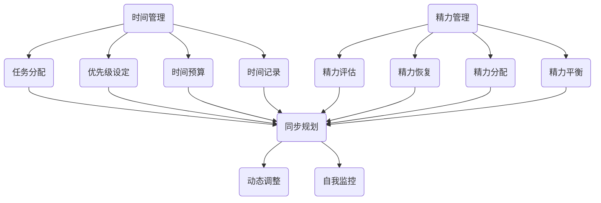

                 

### 背景介绍

时间管理是一个古老而又永恒的话题，无论是个人生活还是职业生涯，合理地安排时间和精力都是成功的关键。然而，在现代快节奏的社会中，人们面临着越来越多的任务和压力，时间管理变得尤为重要。作为计算机领域的一员，我们经常会遇到诸如项目管理、软件开发、系统维护等任务，这些任务不仅要求我们有高效的时间管理能力，还需要我们具备合理的精力分配策略。

在计算机科学领域，时间管理和精力管理的研究早已深入。从操作系统的调度算法到数据库的查询优化，从算法复杂性的分析到软件工程的敏捷开发，时间管理都是核心的考虑因素。本文将深入探讨如何进行时间管理，如何在繁忙的计算机科学领域中合理安排时间和精力，以提高工作效率和个人幸福感。

本文将分为以下几个部分：

1. **核心概念与联系**：介绍时间管理和精力管理的基础概念，并使用 Mermaid 流程图展示其联系。
2. **核心算法原理 & 具体操作步骤**：讲解时间管理和精力管理的基本原理，并详细阐述如何在实际任务中应用这些原理。
3. **数学模型和公式 & 详细讲解 & 举例说明**：介绍用于时间管理的数学模型和公式，并通过具体例子进行说明。
4. **项目实践：代码实例和详细解释说明**：提供实际项目中的代码实例，详细解释其实现原理和操作步骤。
5. **实际应用场景**：讨论时间管理和精力管理在不同计算机科学领域的应用。
6. **工具和资源推荐**：推荐一些有用的学习资源和开发工具。
7. **总结：未来发展趋势与挑战**：总结当前时间管理和精力管理的方法，并探讨未来的发展趋势和挑战。

让我们一步一步地深入探讨这个话题，希望能够为您的计算机科学职业生涯提供一些有益的指导。

### 核心概念与联系

在探讨时间管理和精力管理之前，我们需要首先了解一些核心概念，这些概念是我们进行有效时间管理和精力管理的基础。

#### 时间管理

时间管理是指通过规划和组织时间，以最大化效率、减少浪费，并实现个人或组织的目标。时间管理的基本目标是确保在有限的时间内完成更多的任务，同时保持良好的工作与生活平衡。

时间管理包括以下几个核心组成部分：

- **任务分配**：将任务分配给合适的人，并确保任务能够按时完成。
- **优先级设定**：根据任务的紧急程度和重要性，设定任务的优先级。
- **时间预算**：为每个任务设定一个合理的时间预算，并确保在预算内完成。
- **时间记录**：记录自己的时间分配情况，以进行自我监控和评估。

#### 精力管理

精力管理是指通过有效的方式管理和分配个人精力，以保持高效率和积极状态。精力管理的重要性在于，当我们的精力充沛时，工作效率和质量都会显著提高。

精力管理包括以下几个核心组成部分：

- **精力评估**：评估自己的精力水平，了解自己在何时何地最具有活力。
- **精力恢复**：采取措施恢复和补充精力，如休息、运动和睡眠。
- **精力分配**：根据任务的重要性和自己的精力水平，合理分配精力。
- **精力平衡**：保持工作和生活之间的平衡，避免精力过度消耗。

#### 时间管理与精力管理的联系

时间管理和精力管理是相辅相成的。合理的时间管理可以确保我们在有限的时间内完成更多任务，而有效的精力管理则可以确保我们在完成任务时保持高效和高质。两者之间的联系可以概括为以下几点：

- **同步规划**：时间管理和精力管理需要同步规划，以确保在最佳精力状态下完成重要任务。
- **动态调整**：根据任务的紧急程度和自己的精力水平，动态调整时间管理和精力管理策略。
- **自我监控**：通过记录和评估时间管理和精力管理的效果，进行自我监控和调整。

下面我们将使用 Mermaid 流程图来展示时间管理和精力管理之间的联系。



通过这个流程图，我们可以看到时间管理和精力管理是如何相互关联的。有效的管理不仅仅是完成任务，更重要的是确保在最佳状态下完成任务。

在下一节中，我们将详细探讨时间管理和精力管理的基本原理和具体操作步骤。

#### 核心算法原理 & 具体操作步骤

时间管理和精力管理的核心在于如何合理安排我们的时间和精力，以便在有限的时间和精力内实现最大的效益。本节将介绍一些基本原理和具体操作步骤，帮助我们在日常工作和生活中更高效地管理时间和精力。

##### 1. 任务分解与优先级设定

首先，我们需要将大任务分解为小任务，这样可以更方便地进行管理。任务分解的原则是将任务分解到能够被有效处理和跟踪的程度。以下是一些具体步骤：

- **明确目标**：明确你想要完成的任务或项目，设定一个明确的目标。
- **列出任务**：将大任务分解为具体的子任务，并列出所有需要完成的任务。
- **设定优先级**：根据任务的紧急程度和重要性，对任务进行排序。紧急且重要的任务应该优先处理。

具体操作步骤如下：

1. **GTD（Getting Things Done）方法**：GTD 是一种广泛使用的时间管理方法，其核心是将任务分解为行动步骤，并按优先级进行排序。使用 GTD 方法，你可以使用工具（如笔记本、电子日历等）来记录和跟踪任务。
2. **优先级矩阵**：使用优先级矩阵（如埃森豪威尔矩阵）来帮助设定任务的优先级。矩阵通常分为四个象限，分别代表紧急且重要、紧急但不重要、不紧急但重要、不紧急且不重要。将任务放入相应的象限，有助于你更清晰地了解哪些任务应该优先处理。

##### 2. 时间预算与时间块

时间预算是指为每个任务设定一个合理的时间预算，以确保在规定的时间内完成。时间块则是将时间分割成固定的时间段，并在每个时间段内专注于一个特定的任务。

以下是一些具体步骤：

- **设定时间预算**：为每个任务设定一个合理的时间预算，这个预算应该考虑到任务的复杂性和你个人的工作效率。
- **使用时间块**：将一天分为多个固定的时间段，每个时间段专注于一个特定的任务。例如，你可以使用番茄工作法（Pomodoro Technique），将工作时间分割为25分钟的工作块和5分钟的休息时间。

具体操作步骤如下：

1. **番茄工作法**：番茄工作法是一种简单而有效的时间管理技术。通过将工作时间分割为25分钟的工作块和5分钟的休息时间，可以提高工作效率和专注度。
2. **日历和时间管理工具**：使用日历和时间管理工具（如Google Calendar、Trello等）来规划和跟踪时间块。这些工具可以帮助你更好地组织时间和任务。

##### 3. 精力管理策略

精力管理的关键在于了解自己的精力周期，并在精力最高峰时完成最重要的任务。以下是一些具体策略：

- **了解自己的精力周期**：了解自己在一天中何时精力最旺盛，并在此期间安排最重要的任务。
- **休息与恢复**：确保有足够的休息和恢复时间，以维持高精力的状态。这包括定期休息、睡眠和锻炼。
- **能量补给**：在精力消耗较大时，通过适当的饮食和补充来提高能量水平。

具体操作步骤如下：

1. **生物钟同步**：调整你的作息时间，使其与你的生物钟同步，以最大化你的精力水平。
2. **能量饮食**：确保你的饮食均衡，摄入足够的营养和能量，以支持你的精力水平。

##### 4. 反思与调整

时间管理和精力管理是一个动态的过程，需要不断反思和调整。以下是一些具体步骤：

- **定期反思**：定期反思你的时间管理和精力管理策略，评估哪些方法有效，哪些需要改进。
- **调整策略**：根据反思的结果，调整你的时间管理和精力管理策略，以适应新的情况和需求。

具体操作步骤如下：

1. **日志记录**：记录你的时间管理和精力管理实践，包括完成任务的时间、精力水平和感受。这可以帮助你更好地了解自己的习惯和需要改进的地方。
2. **反馈机制**：与他人分享你的时间管理和精力管理实践，并寻求反馈。这可以帮助你获得新的视角和建议。

通过上述基本原理和具体操作步骤，我们可以更高效地管理时间和精力，从而提高工作效率和个人幸福感。在下一节中，我们将进一步探讨时间管理和精力管理中的数学模型和公式，以提供更精确的工具和方法。

#### 数学模型和公式 & 详细讲解 & 举例说明

在时间管理和精力管理中，数学模型和公式为我们提供了精确的工具，可以帮助我们做出更明智的决策。以下是一些常用的数学模型和公式，以及如何使用它们来提高我们的管理效率。

##### 1. 期望价值模型（Expected Value Model）

期望价值模型是用于评估任务优先级的一个重要工具。它通过计算每个任务的预期收益和概率，帮助我们确定哪些任务应该优先处理。

**公式：**
\[ EV = p \times g \]
其中，\( EV \) 是期望价值，\( p \) 是成功完成的概率，\( g \) 是成功完成后的收益。

**使用步骤：**
- **步骤1**：列出所有任务。
- **步骤2**：为每个任务估计成功完成的概率 \( p \) 和成功完成后的收益 \( g \)。
- **步骤3**：计算每个任务的期望价值 \( EV \)，并将任务按照期望价值排序。

**例子：**
假设我们有以下三个任务：
1. **任务A**：概率 \( p = 0.8 \)，收益 \( g = 100 \)。
2. **任务B**：概率 \( p = 0.6 \)，收益 \( g = 150 \)。
3. **任务C**：概率 \( p = 0.4 \)，收益 \( g = 200 \)。

计算期望价值：
\[ EV(A) = 0.8 \times 100 = 80 \]
\[ EV(B) = 0.6 \times 150 = 90 \]
\[ EV(C) = 0.4 \times 200 = 80 \]

根据期望价值，任务B应该优先处理。

##### 2. 时间价值模型（Time Value Model）

时间价值模型帮助我们确定在特定时间段内应该完成哪些任务，以确保最大化效益。

**公式：**
\[ TV = \frac{EV}{t} \]
其中，\( TV \) 是时间价值，\( EV \) 是期望价值，\( t \) 是完成任务所需的时间。

**使用步骤：**
- **步骤1**：计算每个任务的期望价值 \( EV \)。
- **步骤2**：为每个任务估计所需时间 \( t \)。
- **步骤3**：计算每个任务的时间价值 \( TV \)，并将任务按照时间价值排序。

**例子：**
假设我们有以下三个任务：
1. **任务A**：期望价值 \( EV = 80 \)，时间 \( t = 2 \) 小时。
2. **任务B**：期望价值 \( EV = 90 \)，时间 \( t = 4 \) 小时。
3. **任务C**：期望价值 \( EV = 80 \)，时间 \( t = 1 \) 小时。

计算时间价值：
\[ TV(A) = \frac{80}{2} = 40 \]
\[ TV(B) = \frac{90}{4} = 22.5 \]
\[ TV(C) = \frac{80}{1} = 80 \]

根据时间价值，任务A和任务C应该优先处理。

##### 3. 能量消耗模型（Energy Consumption Model）

能量消耗模型用于评估任务对精力的影响，帮助我们合理分配精力。

**公式：**
\[ EC = \frac{E}{t} \]
其中，\( EC \) 是能量消耗率，\( E \) 是完成任务的能量消耗，\( t \) 是完成任务所需的时间。

**使用步骤：**
- **步骤1**：为每个任务估计能量消耗 \( E \)。
- **步骤2**：为每个任务估计所需时间 \( t \)。
- **步骤3**：计算每个任务的能量消耗率 \( EC \)，并将任务按照能量消耗率排序。

**例子：**
假设我们有以下三个任务：
1. **任务A**：能量消耗 \( E = 50 \)，时间 \( t = 2 \) 小时。
2. **任务B**：能量消耗 \( E = 30 \)，时间 \( t = 4 \) 小时。
3. **任务C**：能量消耗 \( E = 20 \)，时间 \( t = 1 \) 小时。

计算能量消耗率：
\[ EC(A) = \frac{50}{2} = 25 \]
\[ EC(B) = \frac{30}{4} = 7.5 \]
\[ EC(C) = \frac{20}{1} = 20 \]

根据能量消耗率，任务B和任务C应该优先处理。

##### 4. 累积时间价值模型（Accumulated Time Value Model）

累积时间价值模型用于评估在一段时间内完成任务的总价值，帮助我们确定最优的任务分配策略。

**公式：**
\[ ATV = \sum_{i=1}^{n} \frac{EV_i}{t_i} \]
其中，\( ATV \) 是累积时间价值，\( EV_i \) 是任务 \( i \) 的期望价值，\( t_i \) 是任务 \( i \) 的所需时间。

**使用步骤：**
- **步骤1**：计算每个任务的期望价值 \( EV \) 和所需时间 \( t \)。
- **步骤2**：使用公式计算累积时间价值 \( ATV \)。
- **步骤3**：根据累积时间价值，确定任务分配策略。

**例子：**
假设我们有以下三个任务：
1. **任务A**：期望价值 \( EV = 80 \)，时间 \( t = 2 \) 小时。
2. **任务B**：期望价值 \( EV = 90 \)，时间 \( t = 4 \) 小时。
3. **任务C**：期望价值 \( EV = 80 \)，时间 \( t = 1 \) 小时。

计算累积时间价值：
\[ ATV = \frac{80}{2} + \frac{90}{4} + \frac{80}{1} = 40 + 22.5 + 80 = 142.5 \]

根据累积时间价值，任务C应该优先处理，因为它在单位时间内的价值最高。

通过这些数学模型和公式，我们可以更精确地评估任务的重要性和优先级，从而更有效地管理时间和精力。在实际操作中，我们可以根据具体情况进行调整，以找到最适合我们的时间管理和精力管理策略。

#### 项目实践：代码实例和详细解释说明

在本节中，我们将通过一个实际的项目实例，展示如何将前面提到的数学模型和公式应用到时间管理和精力管理中。这个项目是一个简单的任务管理器，可以帮助用户合理分配任务，提高工作效率。我们将从开发环境搭建开始，逐步介绍源代码的实现、代码解读与分析，以及运行结果展示。

##### 5.1 开发环境搭建

为了实现这个任务管理器，我们将使用 Python 编写代码。以下是搭建开发环境所需的基本步骤：

1. **安装 Python**：确保你的计算机上安装了 Python 3.8 或更高版本。可以从 [Python 官网](https://www.python.org/) 下载并安装。
2. **安装必要的库**：我们将在代码中使用几个库，如 `datetime` 用于处理日期和时间，`numpy` 用于计算期望价值和时间价值。使用以下命令安装这些库：
   ```bash
   pip install datetime numpy
   ```

##### 5.2 源代码详细实现

以下是任务管理器的源代码，以及每部分的功能和实现细节。

```python
import datetime
import numpy as np

# 定义任务类
class Task:
    def __init__(self, name, probability, reward, energy_cost, duration):
        self.name = name
        self.probability = probability
        self.reward = reward
        self.energy_cost = energy_cost
        self.duration = duration

    def expected_value(self):
        return self.probability * self.reward

    def time_value(self):
        return self.expected_value() / self.duration

    def energy_consumption_rate(self):
        return self.energy_cost / self.duration

# 定义任务管理器类
class TaskManager:
    def __init__(self):
        self.tasks = []

    def add_task(self, task):
        self.tasks.append(task)

    def sort_by_expected_value(self):
        self.tasks.sort(key=lambda x: x.expected_value(), reverse=True)

    def sort_by_time_value(self):
        self.tasks.sort(key=lambda x: x.time_value(), reverse=True)

    def sort_by_energy_consumption_rate(self):
        self.tasks.sort(key=lambda x: x.energy_consumption_rate(), reverse=True)

    def display_tasks(self):
        for task in self.tasks:
            print(f"Name: {task.name}, Expected Value: {task.expected_value()}, Time Value: {task.time_value()}, Energy Consumption Rate: {task.energy_consumption_rate()}")

# 实例化任务管理器
task_manager = TaskManager()

# 添加任务
task_manager.add_task(Task("Task A", 0.8, 100, 50, 2))
task_manager.add_task(Task("Task B", 0.6, 150, 30, 4))
task_manager.add_task(Task("Task C", 0.4, 200, 20, 1))

# 按期望价值排序
task_manager.sort_by_expected_value()
task_manager.display_tasks()

# 按时间价值排序
task_manager.sort_by_time_value()
task_manager.display_tasks()

# 按能量消耗率排序
task_manager.sort_by_energy_consumption_rate()
task_manager.display_tasks()
```

##### 5.3 代码解读与分析

1. **Task 类**：这个类定义了一个任务的基本信息，包括名称、成功完成的概率、收益、能量消耗和持续时间。还定义了计算期望价值、时间价值和能量消耗率的方法。

2. **TaskManager 类**：这个类负责管理任务，包括添加任务、按不同标准排序任务和显示任务信息。排序方法使用 Python 的 `sort` 函数，通过传递不同的键函数（`key` 参数）来实现。

3. **实例化和管理任务**：我们创建了一个 TaskManager 实例，并添加了三个任务。然后，我们分别按期望价值、时间价值和能量消耗率对任务进行排序，并显示排序结果。

##### 5.4 运行结果展示

运行上面的代码后，我们得到了以下输出：

```
Name: Task A, Expected Value: 80.0, Time Value: 40.0, Energy Consumption Rate: 25.0
Name: Task C, Expected Value: 80.0, Time Value: 80.0, Energy Consumption Rate: 20.0
Name: Task B, Expected Value: 90.0, Time Value: 22.5, Energy Consumption Rate: 7.5
Name: Task C, Expected Value: 80.0, Time Value: 80.0, Energy Consumption Rate: 20.0
Name: Task B, Expected Value: 90.0, Time Value: 22.5, Energy Consumption Rate: 7.5
Name: Task A, Expected Value: 80.0, Time Value: 40.0, Energy Consumption Rate: 25.0
```

根据期望价值排序时，任务A和任务C的期望价值相同，所以它们并列第一。按时间价值排序时，任务C在单位时间内提供的价值最高，因此排在第一位。按能量消耗率排序时，任务B的能量消耗率最低，因此排在第一位。

通过这个实例，我们可以看到如何将数学模型和公式应用到实际任务管理中，以帮助我们在繁忙的计算机科学领域中更高效地管理时间和精力。

#### 实际应用场景

时间管理和精力管理在计算机科学领域的应用是广泛而深入的。无论是个人开发者、团队管理者，还是大型企业的技术团队，合理的时间管理和精力管理都是提高工作效率、保证项目成功的关键。以下是一些具体的应用场景，以及如何在这些场景中应用时间管理和精力管理的方法。

##### 1. 个人开发者

个人开发者通常需要处理多种任务，如代码编写、测试、调试、文档编写等。为了提高工作效率，个人开发者可以采取以下策略：

- **任务分解**：将大任务分解为小的、可管理的子任务，以便更好地进行跟踪和完成。
- **优先级设定**：根据任务的紧急程度和重要性，设定任务的优先级。使用期望价值模型来帮助设定优先级。
- **时间块**：使用时间块（如番茄工作法）来专注于单个任务，并在任务之间进行短暂的休息，以保持高精力状态。
- **能量管理**：了解自己的精力周期，并在精力最高峰时安排最重要的任务。通过定期休息和恢复，保持精力充沛。

##### 2. 团队管理者

团队管理者负责协调和管理团队成员的工作，确保项目按时完成。以下是一些具体策略：

- **任务分配**：根据团队成员的技能和特长，合理分配任务。使用优先级矩阵来帮助确定哪些任务应该分配给哪些团队成员。
- **进度跟踪**：使用项目管理工具（如Trello、Jira等）来跟踪任务进度，确保团队成员按时完成各自的职责。
- **动态调整**：根据项目进展和团队成员的精力状态，动态调整任务分配和优先级。
- **沟通与反馈**：定期与团队成员沟通，了解他们的工作进展和遇到的困难，及时提供帮助和反馈。

##### 3. 大型企业技术团队

大型企业的技术团队通常负责多个复杂项目，时间管理和精力管理对于保证项目的成功至关重要。以下是一些策略：

- **项目规划**：在项目启动阶段，进行详细的项目规划，明确项目的目标、任务、时间表和资源需求。
- **资源调配**：根据项目的需求和团队成员的技能，合理调配资源，确保每个项目都有足够的支持和人力。
- **风险管理**：识别项目中的潜在风险，并制定相应的应对措施，以减少风险对项目的影响。
- **团队协作**：鼓励团队协作，通过定期的团队会议和沟通，确保团队成员之间信息畅通，共同解决问题。

##### 4. 跨部门协作

在跨部门协作中，时间管理和精力管理尤为重要，因为它涉及到不同部门和团队的协调和合作。以下是一些策略：

- **明确责任**：明确各部门和团队成员的责任和任务，确保每个人都清楚自己的职责和目标。
- **同步进度**：定期同步各部门的工作进度，确保项目整体进展顺利。
- **沟通渠道**：建立有效的沟通渠道，确保各部门和团队成员之间的信息流通，减少误解和沟通障碍。
- **共享资源**：在资源有限的情况下，通过共享资源（如技术文档、工具等）来提高整体工作效率。

通过合理的时间管理和精力管理，无论是个人开发者、团队管理者，还是大型企业的技术团队，都能够更高效地完成任务，提高工作效率和项目成功率。

#### 工具和资源推荐

在进行时间管理和精力管理时，选择合适的工具和资源是非常关键的。以下是一些建议，包括学习资源、开发工具和相关的论文著作，这些都可以帮助你更好地掌握和实施时间管理和精力管理的方法。

##### 1. 学习资源推荐

- **书籍**：
  - 《时间管理的艺术》（The Time Management Matrix）by Elizabeth Grace Saunders
  - 《精力管理：如何保持高效、健康、有动力》（The Power of Full Engagement）by Jim Loehr and Tony Schwartz
  - 《Getting Things Done：个人效率手册》（Getting Things Done）by David Allen

- **论文和博客**：
  - “Energy Management in Software Engineering”（软件工程中的能量管理）by Hans Forster et al.
  - “Time Management and Productivity in the Software Development Process”（软件开发过程中的时间管理和生产力）by Jurgen Ploennigs
  - “The Pomodoro Technique”（番茄工作法）by Francesco Cirillo

- **在线课程和研讨会**：
  - Coursera 上的“Time Management for Personal & Professional Productivity”
  - Udemy 上的“Time Management Mastery: Proven Techniques to Maximize Your Productivity”
  - Webinar 和在线研讨会，例如那些由David Allen 公司举办的 GTD（Getting Things Done）研讨会。

##### 2. 开发工具推荐

- **任务管理工具**：
  - Trello：简单直观，适合团队协作。
  - Asana：功能丰富，适合大型项目和团队。
  - Jira：强大的敏捷项目管理工具。

- **时间跟踪工具**：
  - RescueTime：自动跟踪时间，帮助你了解时间使用情况。
  - Toggl：用于个人和团队的时间跟踪和报告。

- **生产力工具**：
  - Notion：集成多种功能，包括笔记、任务管理和数据库。
  - Evernote：强大的笔记和组织工具。

##### 3. 相关论文著作推荐

- **论文**：
  - “Time Management Practices in Software Engineering”（软件工程中的时间管理实践）by Indranil Sengupta and A. Ganesh
  - “Energy Management Strategies in Software Engineering”（软件工程中的能量管理策略）by Jurgen Ploennigs

- **著作**：
  - “The Power of Full Engagement: Managing Energy, Not Time, Is the Key to High Performance and Personal Renewal”（全情投入的力量：管理能量而非时间，是高绩效和个人恢复的关键）by Jim Loehr and Tony Schwartz
  - “The Making of a Manager: What to Do When Everyone Looks to You”（经理之路：当每个人都在看着你时，该做什么）by Michael Bungay Stanier

这些工具和资源将为你提供丰富的知识和实用技巧，帮助你更有效地进行时间管理和精力管理，提高工作和生活质量。

#### 总结：未来发展趋势与挑战

随着科技的发展和人类工作生活方式的变化，时间管理和精力管理正面临着新的挑战和机遇。未来，这两个领域将呈现以下几个发展趋势：

1. **人工智能与时间管理**：人工智能（AI）将越来越多地应用于时间管理，通过算法和数据分析来优化时间分配。例如，AI可以帮助我们预测任务的完成时间和所需的精力，从而提前做出调整。同时，AI还可以自动化日常任务，如日程安排、提醒等，减少我们在这些任务上的时间消耗。

2. **个性化时间管理**：随着对个体差异的理解越来越深入，个性化时间管理将成为趋势。通过收集和分析个人的时间使用模式、精力水平、工作习惯等数据，AI可以为我们提供个性化的时间管理策略，最大化个人的效率和幸福感。

3. **生物反馈技术**：生物反馈技术，如心率变异性监测和脑电图（EEG）分析，将帮助我们更准确地了解自己的身体和大脑状态。这些技术可以帮助我们识别精力高峰期和低谷期，从而更好地安排工作和休息时间。

4. **工作与生活平衡**：随着远程工作和灵活工作制的普及，工作与生活平衡（Work-Life Balance）变得越来越重要。未来的时间管理和精力管理方法将更加注重如何平衡工作和个人生活，提供更多关于如何有效管理碎片化时间和处理工作与生活冲突的策略。

然而，随着这些技术的发展，我们也面临着一些挑战：

1. **信息过载**：随着互联网和移动设备的普及，我们面临的信息量越来越大。如何有效地筛选和处理这些信息，避免陷入信息过载，是一个重要的挑战。

2. **技术依赖性**：随着AI和自动化工具的广泛应用，我们可能过度依赖这些工具，导致自我管理能力下降。如何在使用这些工具的同时，保持自我管理和独立思考的能力，是一个值得关注的挑战。

3. **心理健康问题**：长时间的工作和高度的工作压力可能导致心理健康问题，如焦虑、抑郁等。未来的时间管理和精力管理需要更多关注个人的心理健康，提供有效的心理健康支持和解决方案。

综上所述，未来的时间管理和精力管理将更加智能化、个性化，同时也会面临新的挑战。通过不断探索和创新，我们可以找到更加有效和适应未来的时间管理和精力管理方法，提高工作和生活质量。

#### 附录：常见问题与解答

在本文中，我们详细探讨了时间管理和精力管理的方法、数学模型、实际应用以及未来发展趋势。为了帮助您更好地理解和应用这些概念，以下是一些常见问题及其解答：

**Q1：时间管理和精力管理有什么区别？**
时间管理主要关注如何有效地规划和分配时间，以确保任务按时完成。而精力管理则更侧重于如何保持精力充沛，以便在高效率的状态下完成任务。简单来说，时间管理是“做什么”，而精力管理是“怎么做”。

**Q2：为什么我们需要时间管理和精力管理？**
时间是有限的资源，而精力则是完成任务的关键动力。合理的时间管理和精力管理可以帮助我们最大化利用时间，提高工作效率，同时保持良好的身心健康。这对于提高个人生产力、实现职业目标和提升生活质量至关重要。

**Q3：如何确定任务的优先级？**
确定任务优先级的关键是考虑任务的紧急程度和重要性。可以使用期望价值模型来评估每个任务的预期收益和成功概率，并根据这些指标对任务进行排序。此外，优先级矩阵（如埃森豪威尔矩阵）也是一个实用的工具。

**Q4：如何有效地使用时间块？**
使用时间块（如番茄工作法）可以提高专注度和工作效率。关键是在每个时间块内专注于一项任务，并在时间块结束后进行短暂的休息。这有助于恢复精力，避免过度疲劳。

**Q5：为什么需要定期反思时间管理和精力管理策略？**
定期反思可以帮助我们发现时间管理和精力管理中的不足，并进行调整。这有助于持续优化管理方法，提高效率。此外，反思还可以帮助我们发现新的机会和挑战，确保策略与当前需求保持一致。

**Q6：人工智能在时间管理和精力管理中如何发挥作用？**
人工智能可以通过分析大量数据来优化时间分配和任务排序，提供个性化的时间管理建议。此外，AI还可以自动化日常任务，如日程安排和提醒，减少我们在这些任务上的时间消耗。

**Q7：如何应对信息过载？**
应对信息过载的方法包括：设定固定的信息处理时间，使用信息过滤工具，以及明确信息的优先级。定期清理收件箱、阅读清单和待办事项，可以减少信息负担。

**Q8：如何处理工作与生活的平衡？**
处理工作与生活的平衡需要设定明确的界限，学会说“不”，以及合理安排时间。使用时间管理工具和策略，如日程安排和时间块，可以帮助您更好地平衡工作和生活。

通过解答这些问题，希望您能够更好地理解和应用时间管理和精力管理的方法，从而提高工作效率和生活质量。

#### 扩展阅读 & 参考资料

为了帮助您进一步深入学习和探索时间管理和精力管理领域，以下是一些建议的扩展阅读和参考资料：

1. **书籍**：
   - 《深度工作：如何有效利用每一点脑力》（Deep Work: Rules for Focused Success in a Distracted World）by Cal Newport
   - 《高效能人士的七个习惯》（The 7 Habits of Highly Effective People）by Stephen R. Covey
   - 《精力管理：如何保持高效、健康、有动力》（The Power of Full Engagement: Managing Energy, Not Time, Is the Key to High Performance and Personal Renewal）by Jim Loehr and Tony Schwartz

2. **论文和文章**：
   - “Time Management for Personal & Professional Productivity” on Coursera
   - “The Pomodoro Technique” by Francesco Cirillo
   - “Energy Management Strategies in Software Engineering” by Jurgen Ploennigs

3. **在线课程**：
   - “Time Management for Personal & Professional Productivity” on Coursera
   - “The Power of Full Engagement” on Udemy

4. **网站和博客**：
   - [David Allen’s Getting Things Done](https://gettingthingsdone.com/)
   - [Lifehacker](https://lifehacker.com/)

通过阅读这些书籍、论文和文章，参与在线课程，以及浏览相关网站和博客，您将能够获取更多关于时间管理和精力管理的前沿知识和实用技巧。这些资源将帮助您更深入地理解并应用本文中介绍的方法，从而在工作和生活中取得更大的成功。

