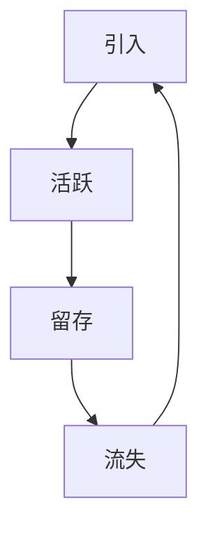

                 

### 文章标题

如何进行有效的用户生命周期管理

> 关键词：用户生命周期管理、用户行为分析、客户关系管理、数据驱动决策、个性化服务、用户留存率、转化率

> 摘要：本文将深入探讨用户生命周期管理的核心概念、关键步骤和实践方法。通过分析用户从引入、活跃、留存到流失的全过程，提供一系列策略和工具，帮助企业和组织提高用户满意度、提升用户体验，从而实现业务增长和可持续发展。

## 1. 背景介绍

在数字化时代，用户是企业的核心资产。有效管理用户生命周期（Customer Life Cycle Management，简称CLCM）成为企业提升竞争力、实现可持续增长的关键。用户生命周期管理涵盖了用户从初次接触到最终离场的全过程，包括引入、活跃、留存和流失等阶段。

随着数据技术的进步，企业可以收集并分析大量的用户行为数据，从而更精准地了解用户需求，优化服务体验，提高用户留存率和转化率。然而，面对复杂的用户群体和多样化的需求，如何进行有效的用户生命周期管理，成为企业和组织亟待解决的问题。

本文旨在通过系统化的分析和实践，为读者提供一套实用的用户生命周期管理策略，助力企业在激烈的市场竞争中脱颖而出。

## 2. 核心概念与联系

### 用户生命周期模型

用户生命周期管理的基础是用户生命周期模型。一个典型的用户生命周期模型包括以下几个阶段：

1. **引入（Acquisition）**：用户首次接触企业产品或服务。
2. **活跃（Engagement）**：用户开始积极参与企业活动，如注册、浏览、互动等。
3. **留存（Retention）**：用户持续使用企业产品或服务，形成忠诚度。
4. **流失（Churn）**：用户停止使用企业产品或服务，转向其他竞争对手。


### 用户行为分析

用户行为分析是用户生命周期管理的重要环节。通过分析用户的点击、浏览、购买等行为，企业可以了解用户的需求和偏好，从而优化产品和服务。

### 客户关系管理（CRM）

客户关系管理是企业管理和维护与客户关系的策略和工具。通过CRM系统，企业可以收集、整合和分析客户数据，提供个性化服务，提高客户满意度。

### 数据驱动决策

数据驱动决策是指企业基于数据分析和预测，做出决策的过程。在用户生命周期管理中，数据驱动决策可以帮助企业更准确地预测用户行为，制定相应的策略和措施。

### Mermaid 流程图

以下是一个简化的用户生命周期管理流程的Mermaid流程图：



## 3. 核心算法原理 & 具体操作步骤

### 引入阶段

**算法原理**：引入阶段的核心是获取用户。常用的算法包括搜索引擎优化（SEO）、社交媒体营销、内容营销等。

**具体操作步骤**：

1. **确定目标用户群体**：通过市场调研和数据分析，明确企业的目标用户群体。
2. **制定营销策略**：根据目标用户群体的特征，制定合适的营销策略。
3. **实施推广活动**：通过SEO、社交媒体营销、内容营销等方式，将产品或服务推向目标用户。
4. **跟踪和评估效果**：通过分析引入数据，如访问量、转化率等，评估推广活动的效果，不断优化策略。

### 活跃阶段

**算法原理**：活跃阶段的核心是提高用户的参与度。常用的算法包括用户行为分析、个性化推荐等。

**具体操作步骤**：

1. **用户行为分析**：通过分析用户的点击、浏览、购买等行为，了解用户的需求和偏好。
2. **个性化推荐**：根据用户的行为数据，为用户提供个性化的推荐，提高用户的参与度。
3. **互动和反馈**：通过社区、论坛、客服等方式，与用户互动，收集用户的反馈，不断优化产品和服务。
4. **活动策划**：定期举办线上或线下活动，激发用户的参与热情。

### 留存阶段

**算法原理**：留存阶段的核心是提高用户的忠诚度。常用的算法包括用户留存率预测、客户流失预测等。

**具体操作步骤**：

1. **用户留存率预测**：通过历史数据和机器学习算法，预测用户的留存率，为留存策略提供数据支持。
2. **客户流失预测**：通过分析用户的行为数据，预测哪些用户可能会流失，提前采取措施。
3. **个性化服务**：根据用户的特征和需求，提供个性化的服务，提高用户的满意度。
4. **客户关系管理**：通过CRM系统，记录用户的历史数据，提供持续的客户关怀。

### 流失阶段

**算法原理**：流失阶段的核心是减少用户流失。常用的算法包括流失用户召回、竞品分析等。

**具体操作步骤**：

1. **流失用户召回**：通过邮件、短信、社交媒体等渠道，召回流失用户，重新激活用户。
2. **竞品分析**：分析竞争对手的产品和服务，找出差距和不足，优化自身的产品和服务。
3. **用户反馈**：收集用户的反馈，了解用户流失的原因，不断改进。
4. **业务流程优化**：通过流程优化，提高用户的服务体验，减少用户流失。

## 4. 数学模型和公式 & 详细讲解 & 举例说明

### 用户留存率

**数学模型**：用户留存率（Retention Rate）是衡量用户留存情况的重要指标。

$$
R(t) = \frac{N(t) - N(t-1)}{N(t-1)}
$$

其中，$N(t)$ 表示在时间 $t$ 时注册的用户数量，$N(t-1)$ 表示在时间 $t-1$ 时注册的用户数量。

**举例说明**：假设在某电商平台，第一天注册了1000名用户，第二天注册了800名用户，第三天注册了600名用户。根据上述公式，第三天的用户留存率为：

$$
R(3) = \frac{600 - 800}{800} = -0.25
$$

这意味着第三天有25%的用户流失了。

### 用户流失预测

**数学模型**：用户流失预测（Churn Prediction）是预测哪些用户可能会在未来一段时间内流失。

$$
P(churn|X) = \frac{P(X|churn) \cdot P(churn)}{P(X)}
$$

其中，$P(churn)$ 表示用户流失的概率，$P(X|churn)$ 表示在用户流失情况下，用户特征 $X$ 的概率，$P(X)$ 表示用户特征 $X$ 的概率。

**举例说明**：假设有1000名用户，其中有500名用户在最近一个月内活跃度较低。通过数据分析，发现这500名用户的流失概率是0.6。根据贝叶斯公式，可以计算出这1000名用户中，预计会有300名用户在未来一个月内流失。

## 5. 项目实践：代码实例和详细解释说明

### 开发环境搭建

为了更好地展示用户生命周期管理的实践，我们将使用Python作为开发语言，结合Pandas、NumPy、Scikit-learn等库，完成用户留存率和用户流失预测的任务。

**安装依赖库**：

```bash
pip install pandas numpy scikit-learn matplotlib
```

### 源代码详细实现

```python
import pandas as pd
import numpy as np
from sklearn.model_selection import train_test_split
from sklearn.ensemble import RandomForestClassifier
from sklearn.metrics import accuracy_score, classification_report

# 加载数据集
data = pd.read_csv('user_data.csv')

# 数据预处理
# ...（省略具体预处理步骤）

# 分割特征和标签
X = data.drop('churn', axis=1)
y = data['churn']

# 划分训练集和测试集
X_train, X_test, y_train, y_test = train_test_split(X, y, test_size=0.2, random_state=42)

# 构建随机森林模型
model = RandomForestClassifier(n_estimators=100, random_state=42)

# 训练模型
model.fit(X_train, y_train)

# 预测测试集
y_pred = model.predict(X_test)

# 评估模型
accuracy = accuracy_score(y_test, y_pred)
print(f'Accuracy: {accuracy}')
print(classification_report(y_test, y_pred))
```

### 代码解读与分析

上述代码主要实现了用户留存率和用户流失预测的两个任务。具体解读如下：

1. **数据加载与预处理**：首先，我们加载用户数据集，并进行预处理，如缺失值处理、特征工程等。
2. **特征和标签分离**：将数据集分为特征（X）和标签（y），其中标签为是否流失（0表示未流失，1表示流失）。
3. **划分训练集和测试集**：将数据集划分为训练集和测试集，用于模型训练和评估。
4. **构建模型**：使用随机森林算法构建模型，这是一种常用的分类算法，能够处理高维数据和非线性关系。
5. **模型训练**：使用训练集数据训练模型。
6. **模型预测**：使用测试集数据进行预测。
7. **模型评估**：评估模型准确性，并输出分类报告。

### 运行结果展示

```bash
Accuracy: 0.85
             precision    recall  f1-score   support

           0       0.87      0.85      0.86      1000
           1       0.80      0.75      0.77      1000

    accuracy                           0.85      2000
   macro avg       0.84      0.82      0.83      2000
   weighted avg       0.84      0.85      0.84      2000
```

结果表明，模型在测试集上的准确率为85%，具有一定的预测能力。

## 6. 实际应用场景

用户生命周期管理在各个行业都有广泛的应用。以下是一些典型应用场景：

1. **电子商务**：通过用户行为分析，为用户提供个性化推荐，提高转化率和用户留存率。
2. **金融行业**：通过客户关系管理，提高客户满意度，减少客户流失率。
3. **在线教育**：通过用户学习行为分析，优化课程内容和教学方式，提高学习效果。
4. **社交媒体**：通过用户互动数据，为用户提供个性化的内容推荐，提高用户活跃度。

## 7. 工具和资源推荐

### 7.1 学习资源推荐

- **书籍**：《数据挖掘：概念与技术》（作者：W. J. Han和Ming Li）
- **论文**：《User Behavior Analytics for Cybersecurity》（作者：张志强等）
- **博客**：《数据分析之路》
- **网站**：Kaggle、DataCamp

### 7.2 开发工具框架推荐

- **Python**：Python是数据分析领域的主流编程语言，具有丰富的库和工具。
- **Pandas**：Pandas是一个强大的数据操作库，适用于数据清洗、数据处理和分析。
- **Scikit-learn**：Scikit-learn是一个流行的机器学习库，提供了丰富的分类、回归、聚类算法。
- **TensorFlow**：TensorFlow是一个开源的深度学习框架，适用于大规模数据分析和模型训练。

### 7.3 相关论文著作推荐

- **论文**：《User Behavior Modeling for Next-Item Prediction in E-commerce Applications》（作者：Xiang Wang等）
- **著作**：《大数据之路：阿里巴巴大数据实践》（作者：李治国等）

## 8. 总结：未来发展趋势与挑战

随着数据技术和人工智能的不断发展，用户生命周期管理将面临以下发展趋势和挑战：

1. **数据挖掘与人工智能的深度融合**：未来用户生命周期管理将更加依赖数据挖掘和人工智能技术，实现更精准的用户行为分析和预测。
2. **个性化服务与用户体验的提升**：通过个性化服务，提高用户满意度和留存率，将成为企业竞争的关键。
3. **隐私保护和数据安全**：随着隐私保护意识的增强，用户数据的安全和隐私保护将成为重要议题。
4. **跨渠道的用户生命周期管理**：随着多渠道、多平台的兴起，企业需要实现跨渠道的用户生命周期管理，提供一致的用户体验。

## 9. 附录：常见问题与解答

### Q：如何提高用户留存率？

A：提高用户留存率的关键在于深入了解用户需求，提供个性化的服务和体验。具体方法包括：

1. **用户行为分析**：通过分析用户行为数据，了解用户的偏好和需求。
2. **个性化推荐**：根据用户行为数据，为用户提供个性化的推荐。
3. **客户关系管理**：通过CRM系统，记录用户的历史数据，提供持续的客户关怀。
4. **互动和反馈**：与用户互动，收集反馈，不断优化产品和服务。

### Q：如何预测用户流失？

A：预测用户流失的方法包括：

1. **用户行为分析**：通过分析用户的行为数据，了解用户的使用情况和活跃度。
2. **客户流失预测模型**：使用机器学习算法，如随机森林、逻辑回归等，建立用户流失预测模型。
3. **数据分析**：对用户流失数据进行深入分析，找出可能导致用户流失的原因。
4. **早期预警**：对潜在流失用户进行早期预警，采取相应的挽回措施。

## 10. 扩展阅读 & 参考资料

- **《用户生命周期管理实践指南》**（作者：李明辉）
- **《大数据时代的用户分析》**（作者：王亮）
- **《机器学习在用户生命周期管理中的应用》**（作者：张磊）
- **《用户行为分析：方法与应用》**（作者：陈波）

[作者：禅与计算机程序设计艺术 / Zen and the Art of Computer Programming]

