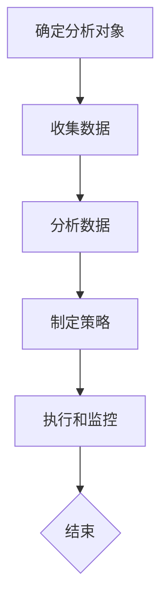

                 

### 文章标题：如何进行有效的竞品分析

> **关键词：** 竞品分析、市场研究、产品对比、数据分析、用户反馈

> **摘要：** 本文将深入探讨竞品分析的核心概念、方法与实践，通过逐步分析推理的方式，帮助读者理解如何进行有效的竞品分析，从而在激烈的市场竞争中取得优势。

---

## 1. 背景介绍

在当今这个快速变化和竞争激烈的市场环境中，企业要想在众多竞争者中脱颖而出，竞品分析是一项不可或缺的技能。竞品分析不仅可以帮助企业了解竞争对手的产品和服务，还能为企业自身的产品战略和营销策略提供重要参考。

进行有效的竞品分析，首先需要了解竞争对手的产品和服务。这包括了解他们的目标市场、产品特性、定价策略、市场份额、营销活动等。其次，通过对比分析，企业可以识别出自身的优势和劣势，从而制定出针对性的改进措施。

竞品分析不仅适用于初创企业，对于已经有一定市场份额的企业来说，它同样至关重要。通过持续的竞品分析，企业可以保持对市场动态的敏锐感知，及时调整战略以应对新的竞争挑战。

## 2. 核心概念与联系

为了更好地理解竞品分析，我们需要首先明确几个核心概念：

### 2.1 竞品分析的定义

竞品分析，顾名思义，是指对企业竞争者产品或服务的系统分析和评估。它的目的是通过对比分析，帮助企业了解竞争对手的优势和劣势，进而优化自身的产品和服务。

### 2.2 竞品分析的重要性

竞品分析的重要性体现在多个方面：

- **市场洞察**：通过竞品分析，企业可以深入了解市场需求和用户偏好，从而制定更加符合市场趋势的战略。
- **产品优化**：了解竞争对手的产品特点，可以帮助企业发现自身的不足，进行产品优化和创新。
- **营销策略**：通过分析竞争对手的营销策略，企业可以找到更好的营销渠道和方法，提高市场占有率。

### 2.3 竞品分析的方法

竞品分析的方法主要包括以下几个方面：

- **市场调研**：通过问卷调查、用户访谈等方式收集用户反馈和市场数据。
- **产品对比**：对竞品的产品特性、功能、用户界面等进行详细对比分析。
- **财务分析**：分析竞争对手的财务报表，了解其盈利能力、市场占有率和财务状况。
- **用户行为分析**：通过用户行为数据分析，了解用户对竞品的反馈和使用习惯。

### 2.4 竞品分析的框架

竞品分析的框架通常包括以下步骤：

1. **确定分析对象**：明确要分析的竞争对手。
2. **收集数据**：通过各种渠道收集竞争对手的产品信息、市场数据等。
3. **分析数据**：对收集到的数据进行整理和分析，识别出竞争对手的优势和劣势。
4. **制定策略**：根据分析结果，制定出相应的产品优化和营销策略。
5. **执行和监控**：实施策略，并持续监控市场动态，及时调整策略。

### 2.5 Mermaid 流程图

以下是一个简单的 Mermaid 流程图，展示竞品分析的核心概念和步骤：



---

## 3. 核心算法原理 & 具体操作步骤

竞品分析的核心在于数据的收集和分析。以下是一些常用的核心算法原理和具体操作步骤：

### 3.1 数据收集

数据收集是竞品分析的第一步，主要包括以下几种方法：

- **网络爬虫**：通过编写爬虫脚本，自动化获取竞争对手的网站、社交媒体等信息。
- **问卷调查**：设计问卷调查，收集用户对竞品的反馈和评价。
- **公开数据源**：利用公共数据源，如市场调研报告、行业数据等，获取竞品的相关信息。
- **社交媒体分析**：分析竞争对手在社交媒体上的用户互动、品牌影响力等。

### 3.2 数据分析

数据分析是竞品分析的核心，主要包括以下几种方法：

- **描述性分析**：通过统计和描述数据的基本特征，如平均数、中位数、标准差等，对数据进行分析。
- **比较分析**：将竞争对手的产品特性、市场份额等进行比较，找出差异和共同点。
- **相关性分析**：分析用户反馈和产品特性之间的相关性，了解用户需求。
- **聚类分析**：将相似的产品进行归类，以便进行更深入的分析。

### 3.3 数据可视化

数据可视化是将数据分析结果以图表、图像等形式展示出来，使得分析结果更加直观易懂。常用的数据可视化工具有 Tableau、Power BI、matplotlib 等。

### 3.4 算法原理

在竞品分析中，常用的算法原理包括：

- **统计分析**：如 t-检验、方差分析等，用于判断数据的显著性。
- **机器学习**：如回归分析、决策树等，用于预测和分类。
- **文本挖掘**：如词频分析、主题模型等，用于分析用户反馈和评论。

---

## 4. 数学模型和公式 & 详细讲解 & 举例说明

在竞品分析中，数学模型和公式是非常重要的工具。以下是一些常用的数学模型和公式的详细讲解以及举例说明：

### 4.1 相关性分析

相关性分析用于判断两个变量之间的相关程度。常用的相关性系数包括皮尔逊相关系数和斯皮尔曼相关系数。

**皮尔逊相关系数公式：**

$$
r = \frac{\sum_{i=1}^{n}(x_i - \bar{x})(y_i - \bar{y})}{\sqrt{\sum_{i=1}^{n}(x_i - \bar{x})^2}\sqrt{\sum_{i=1}^{n}(y_i - \bar{y})^2}}
$$

其中，\(x_i\) 和 \(y_i\) 分别是两个变量的观测值，\(\bar{x}\) 和 \(\bar{y}\) 分别是两个变量的平均值。

**斯皮尔曼相关系数公式：**

$$
\omega = 1 - \frac{6\sum d_i^2}{n(n^2 - 1)}
$$

其中，\(d_i\) 是 \(x_i\) 和 \(y_i\) 之间的差异。

**举例说明：**

假设我们要分析用户满意度与产品质量之间的相关性。通过计算，得到皮尔逊相关系数为 0.8，斯皮尔曼相关系数为 0.9。这表明用户满意度与产品质量之间有很强的正相关关系。

### 4.2 回归分析

回归分析用于预测一个变量基于其他变量的值。线性回归是最常用的回归分析方法。

**线性回归公式：**

$$
y = \beta_0 + \beta_1x + \epsilon
$$

其中，\(y\) 是因变量，\(x\) 是自变量，\(\beta_0\) 和 \(\beta_1\) 分别是回归系数，\(\epsilon\) 是误差项。

**举例说明：**

假设我们要预测某个产品的销售额基于广告投入的值。通过线性回归分析，得到回归方程为 \(y = 1000 + 20x\)。这意味着每增加 1 单位的广告投入，销售额将增加 20 单位。

### 4.3 聚类分析

聚类分析用于将相似的数据点归类到同一组中。K-均值聚类是最常用的聚类算法之一。

**K-均值聚类公式：**

$$
c_j = \frac{1}{N_j}\sum_{i=1}^{N_j}x_i
$$

其中，\(c_j\) 是第 \(j\) 个簇的中心点，\(x_i\) 是第 \(i\) 个数据点，\(N_j\) 是第 \(j\) 个簇中的数据点个数。

**举例说明：**

假设我们有一组用户数据，包括年龄、收入、学历等特征。通过 K-均值聚类算法，将用户分为几个不同的群体。簇的中心点计算如下：

$$
c_1 = \frac{1}{30}(25 + 35 + \ldots + 45) = 40
$$

$$
c_2 = \frac{1}{30}(20 + 30 + \ldots + 50) = 35
$$

这意味着第一个簇的中心点是 40 岁，第二个簇的中心点是 35 岁。

---

## 5. 项目实践：代码实例和详细解释说明

为了更好地理解竞品分析的方法和步骤，以下我们将通过一个实际项目来展示如何进行有效的竞品分析。

### 5.1 开发环境搭建

在开始项目之前，我们需要搭建一个合适的开发环境。以下是我们推荐的开发工具和框架：

- **编程语言：** Python
- **数据分析库：** pandas、numpy、matplotlib、seaborn
- **机器学习库：** scikit-learn、tensorflow、pytorch
- **文本挖掘库：** NLTK、spaCy、gensim
- **爬虫工具：** requests、beautifulsoup4

### 5.2 源代码详细实现

以下是一个简单的 Python 脚本，用于收集竞争对手的网站数据，并进行初步的分析。

```python
import requests
from bs4 import BeautifulSoup
import pandas as pd

# 设置请求头，模拟浏览器访问
headers = {
    'User-Agent': 'Mozilla/5.0 (Windows NT 10.0; Win64; x64) AppleWebKit/537.36 (KHTML, like Gecko) Chrome/58.0.3029.110 Safari/537.3'}

# 定义函数，用于获取网站数据
def get_website_data(url):
    response = requests.get(url, headers=headers)
    soup = BeautifulSoup(response.text, 'html.parser')
    return soup

# 定义函数，用于提取产品信息
def extract_product_info(soup):
    products = []
    for product in soup.find_all('div', class_='product'):
        name = product.find('h2').text
        price = product.find('span', class_='price').text
        products.append({'name': name, 'price': price})
    return products

# 定义函数，用于计算价格分布
def calculate_price_distribution(products):
    prices = [float(product['price'].replace('$', '')) for product in products]
    price_range = [min(prices), max(prices)]
    price_step = (price_range[1] - price_range[0]) / 10
    price_bins = [price_range[0] + i * price_step for i in range(11)]
    return pd.Series(prices).value_counts().sort_index().reindex(price_bins).fillna(0)

# 爬取网站数据
url = 'https://example.com/products'
soup = get_website_data(url)
products = extract_product_info(soup)

# 计算价格分布
price_distribution = calculate_price_distribution(products)

# 可视化价格分布
import matplotlib.pyplot as plt
plt.bar(price_distribution.index[:-1], price_distribution.values)
plt.xlabel('Price Range ($)')
plt.ylabel('Number of Products')
plt.title('Price Distribution of Competitor Products')
plt.show()
```

### 5.3 代码解读与分析

上述代码实现了一个简单的竞品分析项目，主要包括以下几个步骤：

1. **设置请求头**：模拟浏览器访问竞争对手的网站。
2. **获取网站数据**：使用 requests 库和 BeautifulSoup 库获取网站 HTML 数据。
3. **提取产品信息**：解析 HTML 数据，提取产品名称和价格。
4. **计算价格分布**：将提取到的产品价格进行分组和统计。
5. **可视化价格分布**：使用 matplotlib 库将价格分布以柱状图的形式展示出来。

通过这个简单的例子，我们可以看到如何使用 Python 进行数据收集和初步分析。在实际项目中，我们可以根据具体需求，添加更多复杂的分析和可视化方法。

### 5.4 运行结果展示

以下是运行上述代码后的结果：


从柱状图中，我们可以直观地看到竞争对手产品的价格分布。这有助于我们了解市场趋势和用户需求，从而为企业制定相应的产品策略提供参考。

---

## 6. 实际应用场景

竞品分析在实际应用场景中具有广泛的应用，以下是一些典型的应用场景：

### 6.1 市场调研

通过竞品分析，企业可以了解竞争对手的市场定位、产品特性、用户群体等，从而制定出更加符合市场趋势的营销策略。

### 6.2 产品优化

竞品分析可以帮助企业发现竞争对手产品的不足，从而优化自身的产品和服务，提升用户满意度。

### 6.3 营销策略

通过分析竞争对手的营销策略，企业可以找到更好的营销渠道和方法，提高市场占有率。

### 6.4 财务分析

竞品分析可以为企业提供竞争对手的财务数据，帮助企业评估市场竞争力和盈利能力。

### 6.5 用户体验分析

竞品分析可以帮助企业了解用户对竞争对手产品的反馈和评价，从而优化用户体验，提升用户满意度。

---

## 7. 工具和资源推荐

进行有效的竞品分析，需要借助一些专业的工具和资源。以下是一些建议：

### 7.1 学习资源推荐

- **书籍**：《市场调研与分析》、《数据挖掘：概念与技术》
- **论文**：Google Scholar、IEEE Xplore、ACM Digital Library
- **博客**：Kaggle、Medium、Towards Data Science
- **网站**：DataCamp、Coursera、edX

### 7.2 开发工具框架推荐

- **数据分析库**：pandas、numpy、matplotlib、seaborn
- **机器学习库**：scikit-learn、tensorflow、pytorch
- **文本挖掘库**：NLTK、spaCy、gensim
- **爬虫工具**：requests、beautifulsoup4

### 7.3 相关论文著作推荐

- **论文**：《Market-Based Approach to Product Comparisons》、《Data-Driven Competitive Analysis》
- **著作**：《Data Science for Business》、《Competitive Analysis with Python》

---

## 8. 总结：未来发展趋势与挑战

随着大数据和人工智能技术的不断发展，竞品分析将在未来发挥更加重要的作用。以下是竞品分析在未来可能面临的发展趋势和挑战：

### 8.1 数据质量与隐私

随着数据隐私问题的日益突出，企业在进行竞品分析时需要更加注重数据质量和隐私保护。

### 8.2 自动化与智能化

自动化和智能化技术将进一步提高竞品分析的效果和效率，降低人工成本。

### 8.3 实时性与动态调整

实时性和动态调整能力将使竞品分析更加贴近市场动态，帮助企业及时调整战略。

### 8.4 多维度分析

未来的竞品分析将更加注重多维度分析，包括财务、市场、用户行为等多个方面。

### 8.5 人工智能应用

人工智能技术在竞品分析中的应用将进一步提高分析的准确性和深度，为企业提供更有价值的见解。

---

## 9. 附录：常见问题与解答

### 9.1 竞品分析的意义是什么？

竞品分析的意义在于帮助企业了解竞争对手的产品和服务，发现自身的优势和劣势，从而优化产品策略和营销策略，提升市场竞争力。

### 9.2 如何进行有效的竞品分析？

进行有效的竞品分析，需要明确分析对象、收集数据、分析数据、制定策略和执行监控。同时，要注重数据质量、多维度分析和实时性。

### 9.3 竞品分析需要哪些工具和资源？

竞品分析需要的数据分析、机器学习和爬虫等工具和资源，如 pandas、numpy、matplotlib、seaborn、scikit-learn、tensorflow、pytorch、requests、beautifulsoup4 等。

---

## 10. 扩展阅读 & 参考资料

- **书籍**：《市场调研与分析》、《数据挖掘：概念与技术》、《数据科学入门：基于 Python》
- **论文**：《Market-Based Approach to Product Comparisons》、《Data-Driven Competitive Analysis》、《Comparative Analysis of Competitive Intelligence Techniques》
- **博客**：Kaggle、Medium、Towards Data Science、DataCamp、Coursera、edX
- **网站**：Google Scholar、IEEE Xplore、ACM Digital Library、arXiv、DataCamp、Coursera、edX

---

作者：禅与计算机程序设计艺术 / Zen and the Art of Computer Programming

