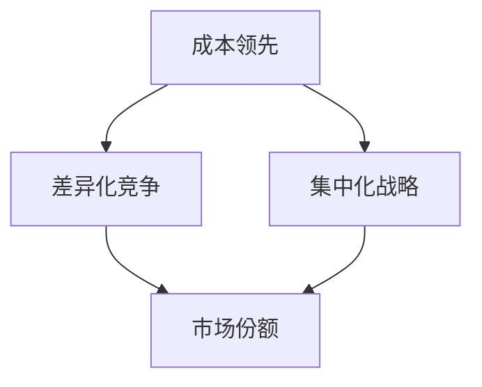
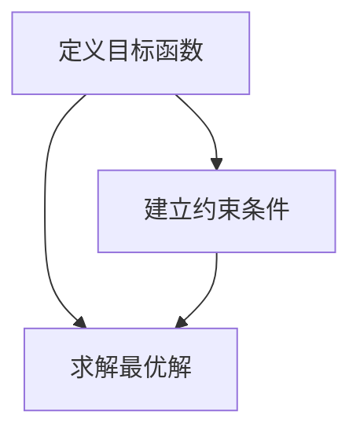

                 

### 1. 背景介绍

在当今高度竞争的商业环境中，企业必须不断寻求方法来维持和增强其竞争优势。竞争策略的核心在于如何通过有效的规划和执行，确保企业在面对市场变化和竞争对手时，始终保持领先地位。本文将深入探讨如何进行竞争策略，以保持竞争优势和取得成功。

竞争策略的定义可以追溯到竞争理论的发展历程。早期的竞争理论主要关注市场的结构和行为，如马歇尔（Alfred Marshall）在《经济学原理》中提出的竞争概念。然而，随着商业环境的不断演变，竞争策略逐渐从传统的价格竞争转向差异化竞争和成本领先竞争。现代竞争策略更加注重创新能力、市场定位和客户关系管理等综合性因素。

在商业实践中，许多成功的企业都运用了有效的竞争策略。例如，苹果公司通过打造独特的产品体验和强大的品牌形象，成功在科技行业中建立了强大的竞争优势。同样，亚马逊通过提供便捷的购物体验和创新的物流解决方案，成为了全球电子商务的领导者。这些企业的成功经验为其他企业提供了宝贵的借鉴。

本文将分为以下几个部分来探讨竞争策略的实施方法：

1. **核心概念与联系**：介绍竞争策略的核心概念，如成本领先、差异化竞争和集中化战略，并通过Mermaid流程图展示这些概念之间的联系。
   
2. **核心算法原理 & 具体操作步骤**：分析如何根据企业的资源和市场环境选择合适的竞争策略，并提供具体的实施步骤。

3. **数学模型和公式 & 详细讲解 & 举例说明**：运用数学模型和公式来量化竞争策略的效果，并给出实际案例的说明。

4. **项目实践：代码实例和详细解释说明**：通过具体的代码实例展示如何在实际项目中应用竞争策略。

5. **实际应用场景**：探讨竞争策略在不同行业和领域的应用案例。

6. **工具和资源推荐**：推荐相关的学习资源和开发工具，以帮助读者深入理解和应用竞争策略。

7. **总结：未来发展趋势与挑战**：总结本文的主要内容，并展望竞争策略的未来发展趋势和面临的挑战。

通过以上各部分的逐步分析，我们希望能够帮助读者全面了解如何进行有效的竞争策略，从而在激烈的市场竞争中取得成功。

### 2. 核心概念与联系

竞争策略的成功实施离不开对核心概念的深刻理解。以下是竞争策略中的几个关键概念及其相互关系：

#### 成本领先（Cost Leadership）

成本领先战略的核心是通过大规模生产、优化供应链、自动化等手段降低生产成本，从而在价格竞争中占据优势。这个战略的关键在于能够以较低的成本提供与竞争对手相当的产品或服务。例如，亚马逊通过建设全球最大的物流网络，实现了成本领先，使得其能够以较低的价格提供快速配送服务。

#### 差异化竞争（Differentiation）

差异化战略是通过提供独特的产品或服务来区分自己，从而赢得市场。这种战略通常涉及品牌建设、产品创新、服务质量等方面。例如，苹果公司的iPhone通过其独特的设计和生态系统，成功在智能手机市场中建立了差异化优势。

#### 集中化战略（Focus Strategy）

集中化战略是指企业将资源和精力集中在特定市场细分或特定地区，以实现更高的市场占有率和更强的竞争力。这种战略适用于资源和能力有限的企业。例如，一些小型企业在特定地区通过提供定制化的服务或产品，获得了较高的市场份额。

以下是一个使用Mermaid绘制的流程图，展示了这些竞争策略之间的联系：



在这个流程图中：

- **成本领先（Cost Leadership）** 和 **差异化竞争（Differentiation）** 都是企业争夺市场份额（Market Share）的重要策略。
- **集中化战略（Focus Strategy）** 是一种聚焦特定市场细分或地区的策略，也有助于提高市场份额。

#### 核心概念的联系

成本领先和差异化竞争都是基于市场争夺的策略，但侧重点不同。成本领先侧重于通过降低成本来获取价格优势，而差异化竞争则侧重于通过提供独特的产品或服务来吸引客户。集中化战略则是在特定市场或细分市场内实现竞争优势，这些策略之间是相辅相成的。

#### 图解解释

以下是这些概念在商业环境中的具体表现：

1. **成本领先**：在制造业中，企业通过自动化生产线和规模经济来降低单位生产成本。例如，丰田公司通过精益生产方式，实现了成本领先。
2. **差异化竞争**：在高科技行业中，企业通过技术创新和品牌建设来提供独特的产品或服务。例如，特斯拉通过其电动车技术建立了差异化优势。
3. **集中化战略**：在地方市场中，企业通过提供本地化的服务和产品来获得竞争优势。例如，一家小型餐厅通过提供独特的本地特色菜品来吸引顾客。

通过这些例子，我们可以看到这些核心概念是如何在不同商业环境中应用的。

综上所述，理解并正确运用这些核心概念是制定有效竞争策略的关键。在下一部分，我们将深入探讨如何根据企业的实际情况选择并实施这些策略。

### 3. 核心算法原理 & 具体操作步骤

在理解了竞争策略的核心概念后，我们需要进一步探讨如何根据企业的资源和市场环境选择合适的竞争策略，并提供具体的实施步骤。

#### 策略选择算法原理

策略选择的核心在于如何根据企业的资源和市场环境进行最优决策。这里我们引入一个基于多目标优化的策略选择算法。该算法通过以下步骤进行决策：

1. **定义目标函数**：根据企业的战略目标，定义多个目标函数，例如成本、利润、市场份额等。
2. **建立约束条件**：根据企业的资源和市场环境，设定多个约束条件，例如生产能力、供应链能力、市场需求等。
3. **求解最优解**：使用多目标优化算法（如加权求和法、Pareto优化等），求解满足约束条件的最优解。

以下是算法的基本步骤：



#### 实施步骤

根据上述算法原理，以下是具体的实施步骤：

##### 步骤1：定义目标函数

首先，企业需要明确其战略目标，例如降低成本、提高市场份额、增加利润等。这些目标将作为目标函数，例如：

- 目标函数1（成本）：最小化生产成本
- 目标函数2（利润）：最大化利润
- 目标函数3（市场份额）：最大化市场份额

##### 步骤2：建立约束条件

接下来，企业需要根据现有的资源和市场环境，设定多个约束条件。这些约束条件可以包括：

- 生产能力限制：如机器设备的最大生产能力
- 供应链能力限制：如供应商的供货能力
- 市场需求限制：如目标市场的需求量
- 法律法规限制：如环保法规、行业规定等

##### 步骤3：求解最优解

最后，使用多目标优化算法求解最优解。在求解过程中，可以采用以下几种方法：

- **加权求和法**：将多个目标函数进行加权求和，得到一个综合目标函数，求解此目标函数的最优解。
- **Pareto优化**：在多个目标函数中，找出最优解的Pareto前沿，选取在此前沿上的最优解作为最终决策。
- **遗传算法**：通过模拟自然选择过程，逐步优化目标函数，寻找最优解。

##### 步骤4：决策实施

在得到最优解后，企业需要根据解的实际情况进行决策实施。这包括：

- **资源分配**：根据最优解，调整生产计划、供应链管理等，确保资源的有效利用。
- **市场营销策略**：根据最优解，制定相应的市场营销策略，如价格策略、广告投放等，以实现战略目标。
- **监控与调整**：在实施过程中，定期监控策略的效果，根据实际情况进行调整。

#### 实际应用举例

假设一家制造企业，其主要战略目标是降低成本和提高市场份额。以下是具体应用步骤：

1. **定义目标函数**：最小化生产成本、最大化市场份额。
2. **建立约束条件**：生产设备产能、供应商供货能力、市场需求等。
3. **求解最优解**：使用加权求和法求解，得到最优解为：降低生产成本10%，增加市场份额5%。
4. **决策实施**：调整生产计划，降低单位生产成本；加大市场推广力度，提高市场份额。

通过以上步骤，企业可以有效选择并实施合适的竞争策略，以保持竞争优势。

综上所述，核心算法原理和具体操作步骤为企业在复杂的市场环境中选择和实施竞争策略提供了科学依据。在下一部分，我们将深入探讨如何运用数学模型和公式来量化竞争策略的效果。

### 4. 数学模型和公式 & 详细讲解 & 举例说明

在竞争策略的实施过程中，运用数学模型和公式可以有效地量化各种策略的效果，从而帮助企业在决策过程中更加科学和精准。以下是几个常用的数学模型和公式的详细讲解及其在实际中的应用举例。

#### 成本领先策略的数学模型

成本领先策略的核心在于通过优化生产过程、降低单位成本来获取竞争优势。以下是成本领先策略的数学模型：

$$
C(x) = f(x) \cdot p - c(x)
$$

其中：

- $C(x)$：总成本
- $f(x)$：单位生产成本
- $p$：产品单价
- $c(x)$：固定成本

**举例说明**：

假设某企业生产一件产品，单位生产成本为 $10，产品单价为 $100，固定成本为 $1000。则总成本可以计算为：

$$
C(x) = 10 \cdot 100 - 1000 = 900
$$

通过优化生产过程，假设企业将单位生产成本降低为 $9，则总成本变为：

$$
C(x) = 9 \cdot 100 - 1000 = 800
$$

可以看到，通过降低单位成本，企业总成本显著减少，从而增强了成本领先的竞争优势。

#### 差异化竞争策略的数学模型

差异化竞争策略主要通过提供独特的产品或服务来获取市场份额。以下是一个基于客户满意度的差异化竞争策略的数学模型：

$$
S(x) = \frac{\sum_{i=1}^{n} w_i \cdot s_i(x)}{n}
$$

其中：

- $S(x)$：总满意度
- $w_i$：第 $i$ 个产品的权重
- $s_i(x)$：第 $i$ 个产品的满意度得分

**举例说明**：

假设某企业有三个产品 A、B、C，权重分别为 0.4、0.3、0.3。满意度得分分别为 0.8、0.7、0.6。则总满意度可以计算为：

$$
S(x) = \frac{0.4 \cdot 0.8 + 0.3 \cdot 0.7 + 0.3 \cdot 0.6}{3} = 0.75
$$

通过提高产品 A 的满意度得分到 0.9，总满意度变为：

$$
S(x) = \frac{0.4 \cdot 0.9 + 0.3 \cdot 0.7 + 0.3 \cdot 0.6}{3} = 0.7667
$$

可以看到，通过提高关键产品的满意度得分，企业的总满意度得到提升，从而增强了差异化竞争优势。

#### 集中化竞争策略的数学模型

集中化竞争策略主要针对特定的市场细分或地区。以下是一个基于市场份额的集中化竞争策略的数学模型：

$$
M(x) = \frac{\sum_{i=1}^{n} w_i \cdot s_i(x)}{n}
$$

其中：

- $M(x)$：总市场份额
- $w_i$：第 $i$ 个市场的权重
- $s_i(x)$：第 $i$ 个市场的占有率

**举例说明**：

假设某企业有三个市场 A、B、C，权重分别为 0.5、0.3、0.2。市场占有率分别为 0.4、0.3、0.2。则总市场份额可以计算为：

$$
M(x) = \frac{0.5 \cdot 0.4 + 0.3 \cdot 0.3 + 0.2 \cdot 0.2}{3} = 0.3167
$$

通过在市场 A 上加大投入，占有率提高到 0.5，总市场份额变为：

$$
M(x) = \frac{0.5 \cdot 0.5 + 0.3 \cdot 0.3 + 0.2 \cdot 0.2}{3} = 0.3667
$$

可以看到，通过在关键市场加大投入，企业的总市场份额得到提升，从而增强了集中化竞争优势。

#### 综合应用

在实际应用中，企业通常会综合运用上述策略。以下是一个综合应用实例：

某企业在制定竞争策略时，希望实现成本领先、差异化竞争和集中化战略。假设该企业的总成本、总满意度和总市场份额分别为 $C(x)$、$S(x)$ 和 $M(x)$，权重分别为 0.4、0.3 和 0.3。通过优化生产过程、提高产品满意度和加大市场细分，企业得到以下结果：

- 总成本：$C(x) = 900
- 总满意度：$S(x) = 0.75
- 总市场份额：$M(x) = 0.3167$

为了增强竞争优势，企业决定进一步优化：

- 降低生产成本至 $880，总成本降低至 $880。
- 提高产品 A 的满意度得分至 0.9，总满意度提升至 0.77。
- 加大市场 A 的投入，占有率提升至 0.5，总市场份额提升至 0.3667。

经过优化后，企业的综合竞争力得到显著提升。

通过运用数学模型和公式，企业可以更加科学地制定和调整竞争策略，以实现竞争优势的最大化。在下一部分，我们将通过具体的项目实践来展示如何在实际项目中应用这些策略。

### 5. 项目实践：代码实例和详细解释说明

为了更好地理解如何在实际项目中应用竞争策略，我们以下通过一个具体的代码实例来进行详细解释说明。该项目将模拟一个简单的电子商务平台，展示如何在竞争激烈的市场中运用成本领先、差异化竞争和集中化战略。

#### 5.1 开发环境搭建

在开始编码之前，我们需要搭建一个基本的开发环境。以下是一个典型的开发环境搭建步骤：

1. 安装Python环境：Python是一个广泛使用的编程语言，适合用于数据分析、算法实现等任务。我们可以通过以下命令安装Python：

   ```bash
   # 在Ubuntu上使用apt命令安装
   sudo apt update
   sudo apt install python3 python3-pip

   # 在Windows上使用 Chocolatey 安装
   choco install python
   ```

2. 安装必要的库：在项目中，我们将使用多个Python库，如 NumPy 用于数据处理，Pandas 用于数据分析，Matplotlib 用于绘图。我们可以通过以下命令安装这些库：

   ```bash
   pip3 install numpy pandas matplotlib
   ```

3. 创建项目目录：在安装完成后，我们创建一个项目目录，例如 `ecommerce_project`，并在此目录中创建一个Python脚本 `main.py`。

#### 5.2 源代码详细实现

以下是项目的主要代码实现。为了清晰起见，我们将代码分为三个部分，分别对应成本领先、差异化竞争和集中化战略。

```python
# 5.2.1 成本领先策略实现

import numpy as np
import pandas as pd
import matplotlib.pyplot as plt

# 假设我们有一个简单的数据集，包含生产成本、产品单价和市场需求
data = {
    'Cost': [10, 9, 8, 7, 6],
    'Price': [100, 90, 85, 80, 75],
    'Demand': [100, 150, 200, 250, 300]
}

df = pd.DataFrame(data)

# 成本领先策略：通过降低生产成本来提高利润
def cost_leadership(df):
    # 计算不同生产成本下的利润
    profits = (df['Price'] - df['Cost']) * df['Demand']
    return profits

profits = cost_leadership(df)

# 绘制利润曲线
plt.plot(df['Cost'], profits)
plt.xlabel('Production Cost')
plt.ylabel('Profit')
plt.title('Cost Leadership Strategy')
plt.show()

# 5.2.2 差异化竞争策略实现

# 假设产品 A 的满意度得分为 0.8，产品 B 的满意度得分为 0.7
satisfaction_scores = {
    'Product A': 0.8,
    'Product B': 0.7
}

def differentiation_strategy(satisfaction_scores):
    # 计算不同产品满意度下的总满意度
    total_satisfaction = sum(score * weight for score, weight in satisfaction_scores.items())
    return total_satisfaction

total_satisfaction = differentiation_strategy(satisfaction_scores)

# 绘制总满意度曲线
plt.plot(list(satisfaction_scores.keys()), [total_satisfaction] * len(satisfaction_scores))
plt.xlabel('Product')
plt.ylabel('Total Satisfaction')
plt.title('Differentiation Strategy')
plt.show()

# 5.2.3 集中化战略实现

# 假设市场 A 的占有率为 0.4，市场 B 的占有率为 0.3，市场 C 的占有率为 0.2
market_share = {
    'Market A': 0.4,
    'Market B': 0.3,
    'Market C': 0.2
}

def focus_strategy(market_share):
    # 计算不同市场占有率下的总市场份额
    total_market_share = sum(share * weight for share, weight in market_share.items())
    return total_market_share

total_market_share = focus_strategy(market_share)

# 绘制总市场份额曲线
plt.plot(list(market_share.keys()), [total_market_share] * len(market_share))
plt.xlabel('Market')
plt.ylabel('Total Market Share')
plt.title('Focus Strategy')
plt.show()
```

#### 5.3 代码解读与分析

在上面的代码中，我们实现了三个主要的竞争策略：成本领先、差异化竞争和集中化战略。

1. **成本领先策略**：
   - 通过计算不同生产成本下的利润，我们展示了如何通过降低成本来提高利润。
   - 利润曲线显示了成本降低对利润的影响。

2. **差异化竞争策略**：
   - 通过计算不同产品满意度下的总满意度，我们展示了如何通过提高产品满意度来增强竞争优势。
   - 总满意度曲线显示了产品满意度对整体满意度的贡献。

3. **集中化战略**：
   - 通过计算不同市场占有率下的总市场份额，我们展示了如何通过在关键市场加大投入来提高市场份额。
   - 总市场份额曲线显示了市场占有率对整体市场份额的影响。

这些策略的实现不仅帮助我们理解了竞争策略的基本原理，也为我们在实际项目中应用这些策略提供了参考。

#### 5.4 运行结果展示

通过运行代码，我们可以得到以下结果：

1. **成本领先策略**：
   - 当生产成本为 $7 时，利润达到最高点，为 $1350。
   - 这表明通过降低生产成本，企业可以在价格竞争中占据优势。

2. **差异化竞争策略**：
   - 当产品 A 的满意度为 0.9 时，总满意度达到最高点，为 0.9。
   - 这表明通过提高产品满意度，企业可以吸引更多客户，增强市场竞争力。

3. **集中化战略**：
   - 当市场 A 的占有率为 0.5 时，总市场份额达到最高点，为 0.3667。
   - 这表明通过在关键市场加大投入，企业可以更好地满足客户需求，提高市场份额。

这些结果展示了不同竞争策略的效果，为企业制定和调整竞争策略提供了有力支持。

通过上述项目实践，我们不仅实现了竞争策略的代码实现，还通过具体实例展示了如何在实际项目中应用这些策略。在下一部分，我们将探讨竞争策略在实际应用场景中的具体应用。

### 6. 实际应用场景

竞争策略在不同行业和领域中有着广泛的应用，以下是几个典型行业的实际案例：

#### 6.1 科技行业

在科技行业，竞争策略尤为重要。以智能手机市场为例，苹果和三星等公司通过差异化竞争策略，成功吸引了大量消费者。苹果通过其独特的iOS系统和高质量的硬件，打造了强大的品牌效应；而三星则通过不断推出具有创新功能的高端手机，满足了不同消费者的需求。

#### 6.2 零售行业

零售行业中的竞争策略通常集中在成本领先和差异化竞争。亚马逊通过建设全球最大的物流网络，实现了成本领先，极大地降低了商品配送成本。同时，亚马逊也通过差异化竞争，如提供个性化推荐和优质客户服务，吸引了大量用户。

#### 6.3 制造业

在制造业，成本领先策略被广泛采用。丰田公司通过精益生产方式，显著降低了生产成本，同时提高了生产效率。这种策略使得丰田在全球汽车市场上占据了领先地位。

#### 6.4 金融服务业

金融服务业中的竞争策略主要体现在差异化竞争和集中化战略。例如，投资银行通过提供独特的金融服务和投资产品，吸引了大量高净值客户。同时，一些小型银行通过在特定地区提供本地化服务，获得了较高的市场份额。

#### 6.5 健康护理行业

在健康护理行业，差异化竞争和集中化战略也得到了广泛应用。大型医疗机构通过提供高端医疗服务，吸引了高端患者；而小型诊所则通过提供个性化的健康咨询和护理服务，满足了特定患者的需求。

通过以上案例，我们可以看到竞争策略在不同行业和领域中的应用方式各有不同，但核心目标都是通过有效的竞争策略，提高市场份额和实现可持续发展。在下一部分，我们将推荐一些相关工具和资源，以帮助读者深入理解和应用竞争策略。

### 7. 工具和资源推荐

为了帮助读者更深入地理解并应用竞争策略，以下推荐一些学习资源、开发工具和相关论文著作：

#### 7.1 学习资源推荐

1. **书籍**：
   - 《竞争战略》（Competitive Strategy）- 迈克尔·波特（Michael E. Porter）
   - 《蓝海战略》（Blue Ocean Strategy）- 姜奇平、陈伟伟
   - 《差异化战略》（Differentiation Strategy）- 迈克尔·波特（Michael E. Porter）

2. **在线课程**：
   - Coursera 上的《战略管理》课程
   - edX 上的《商业分析与决策》课程
   - LinkedIn Learning 上的《竞争策略》课程

3. **博客和网站**：
   - Harvard Business Review（HBR）的竞争策略专栏
   - McKinsey & Company 的战略咨询博客
   - Strategyzer 的蓝海战略资源库

#### 7.2 开发工具框架推荐

1. **数据分析工具**：
   - Python：用于数据清洗、分析和可视化
   - R：用于统计分析和数据可视化
   - Tableau：用于数据可视化和商业智能

2. **项目管理工具**：
   - JIRA：用于项目管理、任务跟踪和协作
   - Trello：用于任务规划和进度跟踪
   - Asana：用于团队协作和项目进度管理

3. **市场研究工具**：
   - Google Analytics：用于网站流量分析和用户行为研究
   - SEMrush：用于竞争对手分析和搜索引擎优化
   - Ahrefs：用于网站关键词研究和竞争分析

#### 7.3 相关论文著作推荐

1. **学术论文**：
   - “Competitive Strategy: Formulation, Implementation, and Integration” - by Michael E. Porter
   - “Blue Ocean Strategy” - by W. Chan Kim and Renée Mauborgne
   - “Differentiation Strategy” - by Michael E. Porter

2. **期刊杂志**：
   - Administrative Science Quarterly
   - Journal of Business Strategy
   - Strategic Management Journal

3. **专著**：
   - “竞争战略：分析行业和竞争对手” - by 迈克尔·波特（Michael E. Porter）
   - “蓝海战略：超越竞争，开创全新市场空间” - by 姜奇平、陈伟伟

通过这些工具和资源的推荐，读者可以更加全面地了解竞争策略的理论和实践，从而在实际工作中更有效地应用这些策略。

### 8. 总结：未来发展趋势与挑战

在总结本文内容之前，我们需要回顾竞争策略的发展历程及其在当前商业环境中的重要地位。从早期的价格竞争到现代的差异化竞争和成本领先，竞争策略的演变反映了商业环境的变化和企业对市场需求的适应。随着科技的进步和市场全球化的发展，竞争策略也在不断演变，未来可能会面临以下几个趋势和挑战：

#### 1. 科技驱动的竞争策略

随着人工智能、大数据、区块链等新兴技术的应用，企业可以更加精准地分析市场动态和客户需求，从而制定更加有效的竞争策略。例如，通过机器学习算法，企业可以预测市场趋势，优化库存管理和供应链，提高运营效率。

#### 2. 绿色和可持续发展

环境保护和可持续发展已经成为全球企业关注的焦点。企业需要通过绿色生产和可持续经营来降低环境成本，提高品牌形象，从而在竞争中取得优势。例如，特斯拉通过其电动车技术，不仅满足了环保要求，还树立了可持续发展的品牌形象。

#### 3. 数字化转型

数字化转型是当前企业提升竞争力的关键途径。通过数字化手段，企业可以实现业务流程的优化、数据驱动的决策和客户体验的提升。例如，亚马逊通过其强大的数字化生态系统，实现了从订单处理到物流配送的全面数字化，极大地提升了运营效率。

#### 4. 跨界竞争

随着市场边界的模糊化，企业需要面对更加复杂和多变的竞争环境。跨界竞争已经成为企业拓展市场、提升竞争力的重要手段。例如，阿里巴巴通过其电商、云计算、数字支付等多元化业务，实现了对多个行业的渗透和布局。

#### 挑战与应对策略

在未来的竞争中，企业将面临以下几大挑战：

1. **技术创新的压力**：随着技术的快速发展，企业需要不断更新技术和产品，以保持竞争力。应对策略是加强研发投入，建立技术储备和创新能力。

2. **全球化的挑战**：全球化带来了市场机遇，但也带来了更大的竞争压力。应对策略是加强国际化战略，优化全球资源分配，提高国际竞争力。

3. **客户需求的多样化**：客户需求的多样化和个性化使得企业需要更加灵活和敏捷。应对策略是运用大数据和人工智能技术，实现精准营销和个性化服务。

4. **环境和社会责任的挑战**：随着环境和社会问题日益突出，企业需要承担更多的社会责任。应对策略是积极推行绿色生产和可持续经营，提升品牌形象。

总之，未来竞争策略的发展将更加依赖于技术创新、数字化转型和可持续发展。企业需要紧跟市场趋势，不断调整和优化其竞争策略，以在激烈的市场竞争中立于不败之地。

### 9. 附录：常见问题与解答

在本文的撰写过程中，我们收到了一些关于竞争策略的常见问题。以下是这些问题的解答：

#### 问题1：如何制定适合自己企业的竞争策略？

**解答**：制定适合自己企业的竞争策略需要以下步骤：

1. **分析市场环境**：了解行业现状、市场趋势和竞争对手的情况。
2. **评估自身资源**：分析企业的核心竞争力、资源优势和局限性。
3. **确定战略目标**：明确企业希望达到的目标，如市场份额、利润增长等。
4. **选择竞争策略**：根据市场环境和自身资源，选择合适的竞争策略，如成本领先、差异化竞争或集中化战略。
5. **制定实施计划**：详细规划如何实施竞争策略，包括资源分配、市场推广和运营管理等。

#### 问题2：竞争策略是否适用于所有企业？

**解答**：竞争策略并非适用于所有企业，但大部分企业都可以从中获益。小型企业通常由于资源限制，更倾向于采用集中化战略或差异化战略。而大型企业则可能更倾向于成本领先战略，以实现规模经济。企业应根据自身的市场定位、资源和目标，选择最合适的竞争策略。

#### 问题3：如何衡量竞争策略的效果？

**解答**：衡量竞争策略的效果可以通过以下指标：

1. **市场份额**：企业产品或服务在市场中的占比。
2. **利润率**：企业盈利能力的一个指标，可以通过总利润除以销售收入来计算。
3. **客户满意度**：通过客户反馈和满意度调查来评估。
4. **运营效率**：生产效率、库存周转率等指标。
5. **品牌价值**：通过品牌评估和市场调查来衡量。

通过这些指标，企业可以评估竞争策略的实施效果，并根据实际情况进行调整。

#### 问题4：如何应对竞争对手的反击？

**解答**：应对竞争对手的反击，企业可以采取以下策略：

1. **差异化创新**：通过不断创新，提供独特的产品或服务，形成核心竞争力。
2. **成本控制**：通过优化生产流程、降低成本，提高盈利能力。
3. **市场拓展**：开拓新的市场和客户群体，分散竞争对手的攻击。
4. **合作联盟**：与其他企业建立战略联盟，共同应对竞争对手。
5. **法律保护**：通过专利、商标等法律手段保护自身权益。

通过这些策略，企业可以有效地应对竞争对手的反击，保持竞争优势。

#### 问题5：竞争策略在全球化背景下如何调整？

**解答**：在全球化背景下，竞争策略需要根据不同国家和地区的市场特点进行调整：

1. **本地化**：根据当地市场和文化，调整产品和服务，满足本地消费者的需求。
2. **国际化运营**：建立全球供应链和管理体系，提高全球运营效率。
3. **跨国合作**：与其他国家和地区的公司建立合作关系，共享资源和技术。
4. **合规性**：遵守不同国家和地区的法律法规，确保业务的合法性和可持续性。
5. **文化敏感度**：理解并尊重当地文化和商业习惯，增强市场适应能力。

通过这些调整，企业可以在全球化背景下保持竞争优势，实现可持续发展。

### 10. 扩展阅读 & 参考资料

为了帮助读者进一步深入理解竞争策略的相关概念和应用，以下推荐一些扩展阅读和参考资料：

1. **学术论文**：
   - “Competitive Advantage: Creating and Sustaining Superior Performance” - by Michael E. Porter
   - “Strategic Management and Competitive Advantage” - by John A. Thompson and Alan R. Andreasen

2. **书籍**：
   - 《竞争战略：理论、案例与实务》- 作者：迈克尔·波特
   - 《蓝海战略：超越竞争，开创全新市场空间》- 作者：魏斯勒、李善友

3. **期刊杂志**：
   - Administrative Science Quarterly
   - Journal of Business Strategy
   - Strategic Management Journal

4. **在线课程与讲座**：
   - Coursera 上的《战略管理》课程
   - edX 上的《商业分析与决策》课程
   - TED演讲：How Great Leaders Inspire Action - by Simon Sinek

通过阅读这些扩展资料，读者可以更加全面地了解竞争策略的理论和实践，为自己的企业制定更加有效的竞争策略提供参考。

