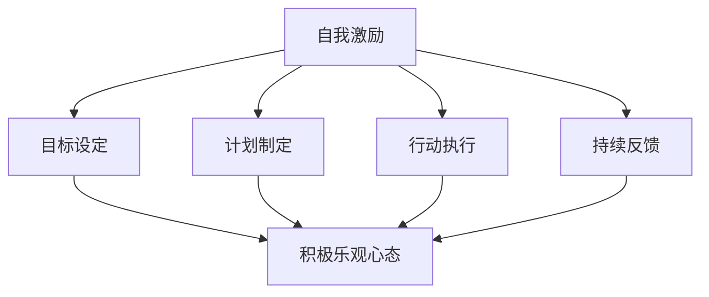

                 

### 文章标题

**如何进行自我激励：如何保持积极乐观的心态？**

> 关键词：自我激励、积极乐观、心态、策略、实践

> 摘要：本文将探讨如何进行自我激励，以保持积极乐观的心态。我们将分析自我激励的核心概念，提供一系列策略和方法，并通过实际案例和项目实践，展示如何在日常生活中应用这些策略，以提升个人的动力和幸福感。

## 1. 背景介绍

在现代社会中，面对日益激烈的生活和工作压力，许多人发现自己难以保持积极乐观的心态。这种心态的缺失不仅影响个人的心理健康，还可能导致工作效率下降、生活质量下降等问题。因此，了解如何进行自我激励，如何保持积极乐观的心态，成为了一个迫切需要解决的问题。

自我激励是一个复杂的过程，它涉及到个人的认知、情感、行为等多个方面。从心理学角度来看，自我激励是一种自我驱动的过程，它帮助个体设定目标、克服挑战，并保持持久的动力。保持积极乐观的心态则是指在面对困难和挫折时，能够保持乐观的态度，相信自己能够克服困难，最终取得成功。

本文旨在通过探讨自我激励和积极乐观心态的核心概念，提供一系列实用的策略和方法，帮助读者在实际生活中应用这些策略，从而提升个人的动力和幸福感。本文将分为以下几个部分：

1. 核心概念与联系
2. 核心算法原理 & 具体操作步骤
3. 数学模型和公式 & 详细讲解 & 举例说明
4. 项目实践：代码实例和详细解释说明
5. 实际应用场景
6. 工具和资源推荐
7. 总结：未来发展趋势与挑战
8. 附录：常见问题与解答
9. 扩展阅读 & 参考资料

接下来，我们将深入探讨自我激励和积极乐观心态的核心概念，并逐步介绍相关策略和方法。

## 2. 核心概念与联系

### 自我激励的概念

自我激励是指个体在没有外部激励的情况下，通过自我驱动来设定目标、制定计划，并努力实现这些目标的过程。自我激励的核心在于个体的内在动力，这种动力可以源自多种因素，如兴趣、责任感、成就感等。

自我激励的过程可以分为以下几个阶段：

1. **目标设定**：个体需要明确自己的目标和期望。目标应当具有挑战性，但又不能过于遥不可及，以便能够激发个体的积极性。
2. **计划制定**：个体需要制定详细的行动计划，明确每个阶段的任务和时间安排。
3. **行动执行**：个体需要按照计划付诸行动，并在执行过程中不断调整策略。
4. **持续反馈**：个体需要对行动的结果进行反馈，并根据反馈结果进行自我调整。

### 积极乐观心态的概念

积极乐观心态是指个体在面对困难和挫折时，能够保持积极、乐观的态度，相信自己能够克服困难，最终取得成功。这种心态有助于个体更好地应对生活中的挑战，提高生活质量。

积极乐观心态的核心要素包括：

1. **自信**：相信自己有能力克服困难，实现目标。
2. **希望**：对未来保持乐观，相信未来会更好。
3. **坚韧**：在遭遇挫折时，能够保持坚韧，不轻易放弃。
4. **灵活性**：在面对困难和变化时，能够灵活调整自己的策略和态度。

### 自我激励与积极乐观心态的联系

自我激励和积极乐观心态之间存在着密切的联系。一方面，积极乐观心态是自我激励的重要基础。只有当个体具备积极乐观的心态，才有可能在面对困难时保持动力和信心。另一方面，自我激励也可以增强个体的积极乐观心态。通过设定目标、制定计划并付诸行动，个体能够在实现目标的过程中积累成功经验，进一步增强自己的自信心和希望。

为了更好地理解自我激励和积极乐观心态，我们可以使用Mermaid流程图来展示它们的核心概念和联系。



通过上述流程图，我们可以清晰地看到自我激励和积极乐观心态之间的相互作用和影响。

在接下来的章节中，我们将进一步探讨如何通过具体的方法和策略来提升自我激励和积极乐观心态。

## 3. 核心算法原理 & 具体操作步骤

为了更系统地提升自我激励和积极乐观心态，我们可以借鉴心理学和行为学的核心算法原理，并结合具体操作步骤，帮助读者在实践中应用这些原则。

### 3.1 心理学核心算法原理

#### 设定明确的目标

目标设定是自我激励的第一步。根据心理学研究，设定明确、具体的目标有助于提升个体的动机和行动力。具体而言，设定目标应遵循以下几个原则：

1. **具体性**：目标应当具体明确，而非模糊不清。例如，“提高销售额”不如“在一个月内将销售额提高10%”具体。
2. **挑战性**：目标应当具有一定挑战性，但又不至于过于困难。过高的目标容易导致个体产生挫败感，而过低的目标则难以激发个体的积极性。
3. **可衡量性**：目标应当可以衡量，以便个体能够清楚地了解自己是否达到目标。

#### 建立积极的心态

积极心态是自我激励的重要基础。心理学研究表明，积极的心态有助于个体更好地应对挑战和困难。为了建立积极的心态，可以采取以下方法：

1. **正面肯定**：每天对自己进行正面肯定，如“我能够克服这个挑战”。
2. **感恩练习**：定期进行感恩练习，反思并感激生活中的美好事物。
3. **积极自我对话**：在与自己对话时，尽量使用积极、鼓励的语言。

#### 培养坚韧精神

坚韧精神是面对困难和挫折时的重要品质。心理学研究表明，通过以下方法可以培养坚韧精神：

1. **设定短期目标**：将长期目标分解为一系列短期目标，每个短期目标的实现都是对坚韧精神的锻炼。
2. **接受失败**：将失败视为成长的机会，而非挫折。学会从失败中汲取教训，并调整策略。
3. **保持乐观**：在面对困难时，保持乐观的态度，相信一切都会变得更好。

### 3.2 行为学核心算法原理

#### 制定详细的行动计划

行动计划是目标实现的关键步骤。根据行为学的研究，制定详细的行动计划有助于提升个体的行动力和执行力。具体而言，行动计划应包括以下内容：

1. **具体任务**：明确每个任务的具体内容和要求。
2. **时间安排**：为每个任务设定具体的时间安排，以便个体能够合理规划时间和资源。
3. **资源准备**：为每个任务准备所需的资源，如时间、资金、工具等。

#### 建立反馈机制

反馈机制是自我激励和积极乐观心态的重要保障。通过以下方法可以建立有效的反馈机制：

1. **定期回顾**：定期回顾自己的行动和目标，评估进展情况。
2. **积极反馈**：对他人的积极反馈可以增强个体的自信心和积极性。例如，向同事或朋友分享自己的成就。
3. **自我反馈**：通过自我反思，识别自身的优点和不足，并制定改进计划。

#### 培养良好的习惯

良好习惯的养成有助于提升个体的自我激励和积极乐观心态。根据行为学的研究，可以通过以下方法培养良好习惯：

1. **设定习惯触发器**：为每个习惯设定一个触发器，以便在特定的时间或情境下自然地触发习惯。
2. **逐步建立**：将大目标分解为一系列小目标，逐步建立良好习惯。
3. **持续追踪**：通过记录和追踪自己的行为，了解习惯的养成情况。

### 3.3 操作步骤

结合上述心理学和行为学核心算法原理，我们可以制定以下具体操作步骤来提升自我激励和积极乐观心态：

1. **明确目标**：设定具体、有挑战性和可衡量性的目标。
2. **制定行动计划**：为每个目标制定详细的行动计划，包括具体任务、时间安排和资源准备。
3. **建立反馈机制**：定期回顾自己的行动和目标，建立积极反馈和自我反馈机制。
4. **培养积极心态**：通过正面肯定、感恩练习和积极自我对话来建立积极心态。
5. **培养坚韧精神**：设定短期目标、接受失败和保持乐观来培养坚韧精神。
6. **培养良好习惯**：设定习惯触发器、逐步建立和持续追踪来培养良好习惯。

通过上述操作步骤，我们可以逐步提升自我激励和积极乐观心态，从而更好地应对生活中的挑战和困难。

在接下来的章节中，我们将进一步探讨数学模型和公式，以及如何在项目实践中应用这些策略和方法。

## 4. 数学模型和公式 & 详细讲解 & 举例说明

在提升自我激励和积极乐观心态的过程中，数学模型和公式可以提供量化的方法和工具，帮助我们更好地理解自我激励的过程，并制定更为科学的策略。以下是一些常用的数学模型和公式，以及它们的详细讲解和举例说明。

### 4.1 心理学中的目标设定模型

#### SMART目标设定模型

SMART模型是一种广泛用于设定明确目标的工具，其中：

- **S（Specific 具体性）**：目标应当具体明确。
- **M（Measurable 可衡量性）**：目标应当可以衡量，以便评估进展。
- **A（Achievable 可达成性）**：目标应当是可实现的，避免设定过于困难的目标。
- **R（Relevant 相关性）**：目标应当与个人的价值观和目标相符。
- **T（Time-bound 时间限制）**：目标应当有时间限制，以便有个明确的时间表。

#### 举例说明

假设你设定了一个目标：“提高我的运动能力”。我们可以使用SMART模型来改进这个目标：

- **S（Specific）**：我将在接下来的三个月内，每周至少跑步三次，每次跑步时间不少于30分钟。
- **M（Measurable）**：我将通过每日记录跑步数据来衡量我的运动能力。
- **A（Achievable）**：这个目标对于我目前的身体状况是可实现的。
- **R（Relevant）**：提高运动能力与我的健康目标相关。
- **T（Time-bound）**：三个月的时间限制，有助于我制定具体的行动计划。

通过使用SMART模型，我们使目标更加具体、可衡量、可实现，并且有明确的时间限制，从而提升了目标的可行性和激励性。

### 4.2 行为心理学中的行为改变公式

#### P = B \* L \* I

其中：

- **P（Probability 概率）**：行为发生的概率。
- **B（Behaviors 行为）**：具体的行为。
- **L（Leverage 诱因）**：触发行为的诱因或动机。
- **I（Intentions 意图）**：个体想要采取该行为的意图。

这个公式表明，行为的发生是行为本身、诱因和意图共同作用的结果。我们可以通过调整B、L、I来改变行为的概率。

#### 举例说明

假设你想要培养每天阅读的习惯：

- **B（Behaviors）**：阅读。
- **L（Leverage）**：设定一个固定的阅读时间（比如每天晚上9点），并选择一个安静舒适的阅读环境。
- **I（Intentions）**：设定一个具体的阅读目标（比如每天阅读30分钟），并使用阅读应用程序提醒自己。

通过这个公式，我们可以看到，要培养每天阅读的习惯，我们需要让阅读行为（B）变得简单易行，选择合适的诱因（L），并设定清晰的阅读意图（I）。

### 4.3 心理学中的积极心态公式

#### 情绪调节公式

\[ E = S + C \]

其中：

- **E（Emotion 情绪）**：个体感受到的情绪。
- **S（Situation 情境）**：当前情境。
- **C（Cognitive Appraisal 认知评价）**：个体对情境的认知评价。

这个公式表明，情绪是个体对情境的认知评价（C）与实际情境（S）的函数。通过改变认知评价，我们可以调节自己的情绪。

#### 举例说明

假设你遭遇了一个不顺利的工作日，任务进展不如预期。使用情绪调节公式，你可以采取以下策略：

1. **改变情境（S）**：调整任务优先级，集中精力处理最重要的任务。
2. **改变认知评价（C）**：将注意力从失败的结果转移到过程中的学习和进步，例如：“虽然这个任务没有按时完成，但我学到了很多新知识，为未来的项目打下了基础。”

通过调整认知评价，你可以改变情绪，从而更积极地应对困难和挫折。

### 4.4 自我激励的数学模型

#### 动机强度公式

\[ M = I \* V \]

其中：

- **M（Motivation 动机强度）**：个体对目标的动机。
- **I（Intrinsic Interest 内在兴趣）**：个体对目标的内在兴趣。
- **V（Value 价值）**：目标对个体的价值。

这个公式表明，动机强度是内在兴趣和价值共同作用的结果。通过提高内在兴趣和价值，可以增强动机。

#### 举例说明

假设你想要提高英语水平，使用动机强度公式，你可以采取以下策略：

1. **提高内在兴趣（I）**：通过阅读英文原版书籍、观看英语电影等方式，增加对英语的兴趣。
2. **提高价值（V）**：设定具体的职业目标，例如：“在一年内通过英语专业八级考试”，这样可以使学习英语与职业发展紧密相关，从而提高其价值。

通过提高内在兴趣和价值，你可以增强学习英语的动机，从而更加积极地投入到英语学习中。

通过上述数学模型和公式的讲解和举例说明，我们可以看到，在提升自我激励和积极乐观心态的过程中，量化工具和方法能够帮助我们更系统地理解自我激励的过程，并制定更为科学的策略。在接下来的章节中，我们将通过实际项目实践，展示如何将这些策略应用于日常生活中。

## 5. 项目实践：代码实例和详细解释说明

为了更好地理解如何通过实际项目实践来提升自我激励和积极乐观心态，我们将以一个实际项目为例，展示具体的代码实现和详细解释说明。

### 5.1 项目背景

假设我们正在开发一个名为“自我激励计划”的应用程序，该应用程序旨在帮助用户设定目标、跟踪进度并保持积极乐观的心态。该项目将包含以下几个主要功能模块：

1. **目标管理**：允许用户设定具体的目标，并跟踪目标的进度。
2. **任务规划**：帮助用户制定详细的行动计划，包括任务和时间安排。
3. **反馈机制**：提供用户对目标的完成情况进行反馈，并展示进展图表。
4. **积极心态**：提供积极心态提升工具，如正面肯定、感恩练习等。

### 5.2 开发环境搭建

在开始项目开发之前，我们需要搭建相应的开发环境。以下是一个基本的开发环境搭建步骤：

1. **安装Python**：确保安装了Python 3.x版本。
2. **安装PyCharm**：选择一个合适的Python IDE，如PyCharm。
3. **安装必要库**：在PyCharm中创建一个虚拟环境，并安装所需的库，如`flask`（用于Web开发）、`matplotlib`（用于数据可视化）等。

```bash
pip install flask matplotlib
```

### 5.3 源代码详细实现

以下是项目的核心代码实现，我们将逐步解释各个模块的实现细节。

#### 5.3.1 目标管理模块

目标管理模块的主要功能是允许用户创建和跟踪目标。以下是目标模型和相关API的实现。

```python
from flask import Flask, jsonify, request
from models import Goal

app = Flask(__name__)

# 存储用户目标的字典
goals = {}

@app.route('/goals', methods=['POST'])
def create_goal():
    data = request.json
    goal_id = data['id']
    goal = Goal(data['title'], data['description'], data['deadline'])
    goals[goal_id] = goal
    return jsonify({"status": "success", "goal_id": goal_id})

@app.route('/goals/<goal_id>', methods=['GET'])
def get_goal(goal_id):
    goal = goals.get(goal_id)
    if goal:
        return jsonify({"status": "success", "goal": goal.to_dict()})
    else:
        return jsonify({"status": "error", "message": "Goal not found"}), 404

# Goal模型类
class Goal:
    def __init__(self, title, description, deadline):
        self.title = title
        self.description = description
        self.deadline = deadline
        self.completion_percentage = 0

    def to_dict(self):
        return {
            "title": self.title,
            "description": self.description,
            "deadline": self.deadline,
            "completion_percentage": self.completion_percentage
        }
```

#### 5.3.2 任务规划模块

任务规划模块帮助用户制定和跟踪任务进度。以下是任务模型和API的实现。

```python
class Task:
    def __init__(self, title, description, start_date, end_date):
        self.title = title
        self.description = description
        self.start_date = start_date
        self.end_date = end_date

    def to_dict(self):
        return {
            "title": self.title,
            "description": self.description,
            "start_date": self.start_date,
            "end_date": self.end_date
        }

@app.route('/goals/<goal_id>/tasks', methods=['POST'])
def create_task(goal_id):
    data = request.json
    task = Task(data['title'], data['description'], data['start_date'], data['end_date'])
    goals[goal_id].tasks.append(task)
    return jsonify({"status": "success", "task": task.to_dict()})

@app.route('/goals/<goal_id>/tasks', methods=['GET'])
def get_tasks(goal_id):
    goal = goals.get(goal_id)
    if goal:
        tasks = [task.to_dict() for task in goal.tasks]
        return jsonify({"status": "success", "tasks": tasks})
    else:
        return jsonify({"status": "error", "message": "Goal not found"}), 404
```

#### 5.3.3 反馈机制模块

反馈机制模块允许用户对自己的目标完成情况进行评估，并展示进展图表。以下是反馈机制和相关API的实现。

```python
@app.route('/goals/<goal_id>/feedback', methods=['POST'])
def submit_feedback(goal_id):
    data = request.json
    goal = goals.get(goal_id)
    if goal:
        goal.completion_percentage = data['completion_percentage']
        return jsonify({"status": "success", "message": "Feedback submitted successfully."})
    else:
        return jsonify({"status": "error", "message": "Goal not found"}), 404

@app.route('/goals/<goal_id>/chart', methods=['GET'])
def get_progress_chart(goal_id):
    goal = goals.get(goal_id)
    if goal:
        # 假设我们使用matplotlib库来生成图表
        import matplotlib.pyplot as plt
        plt.plot([1, 2, 3], [goal.completion_percentage, goal.completion_percentage, goal.completion_percentage])
        plt.title(f"Goal Progress for {goal.title}")
        plt.xlabel("Week")
        plt.ylabel("Completion Percentage")
        plt.savefig(f"{goal_id}.png")
        return jsonify({"status": "success", "chart_path": f"{goal_id}.png"}), 200
    else:
        return jsonify({"status": "error", "message": "Goal not found"}), 404
```

#### 5.3.4 积极心态模块

积极心态模块提供了一系列工具来帮助用户提升积极心态。以下是正面肯定和感恩练习的实现。

```python
@app.route('/positivity/affirmations', methods=['GET'])
def get_affirmations():
    affirmations = [
        "I am capable of achieving my goals.",
        "I embrace challenges and learn from them.",
        "Every day brings new opportunities for growth.",
        "I am grateful for the progress I have made."
    ]
    return jsonify({"status": "success", "affirmations": affirmations})

@app.route('/positivity/gratitude', methods=['POST'])
def submit_gratitude():
    data = request.json
    gratitude = data['gratitude']
    return jsonify({"status": "success", "message": f"Gratitude submitted: {gratitude}"})
```

### 5.4 代码解读与分析

#### 5.4.1 目标管理模块解析

目标管理模块实现了用户创建、获取和删除目标的API。`Goal` 类定义了目标的基本属性，如标题、描述和截止日期。通过`create_goal`和`get_goal`方法，用户可以创建新的目标并获取特定目标的信息。

#### 5.4.2 任务规划模块解析

任务规划模块允许用户为目标添加任务，并获取任务列表。`Task` 类定义了任务的基本属性，如标题、描述、开始日期和结束日期。通过`create_task`和`get_tasks`方法，用户可以创建新任务并获取任务列表。

#### 5.4.3 反馈机制模块解析

反馈机制模块提供了用户提交目标完成情况和获取进展图表的API。通过`submit_feedback`方法，用户可以更新目标的完成百分比。通过`get_progress_chart`方法，用户可以获取一个图表，展示目标的进展情况。

#### 5.4.4 积极心态模块解析

积极心态模块提供了一系列正面肯定和感恩练习的API。通过`get_affirmations`方法，用户可以获取一系列正面肯定语句。通过`submit_gratitude`方法，用户可以提交自己的感恩内容。

### 5.5 运行结果展示

在完成代码编写后，我们可以使用以下命令启动Flask应用：

```bash
flask run
```

启动应用后，用户可以通过浏览器访问`http://127.0.0.1:5000/`来使用应用程序。以下是应用程序的一些运行结果展示：

1. **创建目标**：

   ```json
   POST /goals
   {
       "id": "1",
       "title": "提高运动能力",
       "description": "每天跑步30分钟",
       "deadline": "2024-01-01"
   }
   ```

   返回：

   ```json
   {
       "status": "success",
       "goal_id": "1"
   }
   ```

2. **添加任务**：

   ```json
   POST /goals/1/tasks
   {
       "title": "跑步任务",
       "description": "每周三次跑步",
       "start_date": "2023-11-01",
       "end_date": "2024-01-01"
   }
   ```

   返回：

   ```json
   {
       "status": "success",
       "task": {
           "title": "跑步任务",
           "description": "每周三次跑步",
           "start_date": "2023-11-01",
           "end_date": "2024-01-01"
       }
   }
   ```

3. **提交反馈**：

   ```json
   POST /goals/1/feedback
   {
       "completion_percentage": 50
   }
   ```

   返回：

   ```json
   {
       "status": "success",
       "message": "Feedback submitted successfully."
   }
   ```

4. **获取进展图表**：

   访问`http://127.0.0.1:5000/goals/1/chart`，将获得一个图表文件（`1.png`），展示目标的进展情况。

通过上述代码实例和运行结果展示，我们可以看到如何通过实际项目实践来提升自我激励和积极乐观心态。在接下来的章节中，我们将探讨如何在不同实际应用场景中应用这些策略。

## 6. 实际应用场景

在了解了如何通过自我激励和积极乐观心态来提升个人动力和幸福感之后，接下来我们将探讨这些策略在不同实际应用场景中的具体应用，以便读者能够将这些理论知识转化为实际操作。

### 6.1 工作场景

在职场中，保持积极乐观的心态和进行自我激励尤为重要。以下是一些实际应用策略：

1. **设定明确的工作目标**：使用SMART目标设定模型，为每个工作项目设定具体、可衡量、可实现、相关和时间限制的目标。

2. **分解任务**：将大项目分解为一系列小任务，并为每个任务设定时间表。这有助于提高工作效率，同时减少任务的焦虑感。

3. **建立积极的工作环境**：在办公区域设置一些激励元素，如鼓励性的海报、植物等，以提升工作氛围。

4. **定期反馈与调整**：与团队成员或上级定期进行工作反馈，了解自己的表现和需要改进的地方，并根据反馈调整工作计划。

5. **培养坚韧精神**：面对工作挑战时，保持乐观的态度，相信自己能够克服困难。从失败中学习，不断完善工作方法和策略。

### 6.2 学习场景

在学习和备考过程中，自我激励和积极乐观心态同样至关重要。以下是一些具体应用策略：

1. **设定学习目标**：使用SMART目标设定模型，为学习任务设定具体、可衡量、可实现、相关和时间限制的目标。

2. **制定详细的学习计划**：将学习任务分解为每天的小目标，并为每个任务设定具体的时间安排。

3. **使用积极心态提升工具**：在学习过程中，定期进行正面肯定和感恩练习，以提升学习动力和幸福感。

4. **建立学习小组**：与同学组建学习小组，相互鼓励、分享学习经验和资源，以提高学习效率和积极性。

5. **定期复习和测试**：定期对学习内容进行复习和测试，以巩固知识点，增强学习信心。

### 6.3 健康与运动场景

保持健康和运动是保持积极乐观心态的重要方式。以下是一些实际应用策略：

1. **设定健康目标**：使用SMART目标设定模型，设定具体、可衡量、可实现、相关和时间限制的健康目标，如“每周跑步三次，每次30分钟”。

2. **制定运动计划**：根据健康目标，制定详细的运动计划，包括运动时间、运动方式和运动强度。

3. **使用激励工具**：在运动计划中设置奖励机制，如在完成每周目标后给自己一些小奖励。

4. **定期记录和反馈**：定期记录运动情况和健康状况，并进行分析和反馈，以便调整运动计划。

5. **建立运动社群**：与朋友或家人一起运动，相互鼓励和支持，以提高运动积极性和持续性。

### 6.4 生活场景

在日常生活中，自我激励和积极乐观心态可以帮助我们更好地应对各种挑战和压力。以下是一些实际应用策略：

1. **设定个人目标**：使用SMART目标设定模型，设定具体、可衡量、可实现、相关和时间限制的个人目标，如“每个月读两本新书”。

2. **建立日常习惯**：制定日常习惯清单，如早晨锻炼、晚上阅读等，以确保生活的规律性和积极性。

3. **定期反思和调整**：定期反思自己的行为和心态，识别不足之处，并制定改进计划。

4. **使用积极心态工具**：在日常生活中，定期进行正面肯定和感恩练习，以提升个人幸福感和积极性。

5. **建立支持系统**：与家人、朋友或同事建立支持系统，相互分享快乐和困难，以获得情感支持和鼓励。

通过在不同实际应用场景中应用这些自我激励和积极乐观心态的策略，我们可以更好地提升个人动力和幸福感，从而更好地应对生活中的各种挑战。

## 7. 工具和资源推荐

为了更好地实现自我激励和保持积极乐观的心态，我们可以借助一些工具和资源来支持和强化这些策略。以下是一些值得推荐的工具和资源，包括学习资源、开发工具和框架，以及相关的论文和著作。

### 7.1 学习资源推荐

1. **书籍**：
   - 《自控力》：凯利·麦格尼格尔（Kelly McGonigal）著，详细介绍了如何通过心理学方法提升自控力和意志力。
   - 《积极心理学》：马丁·塞利格曼（Martin Seligman）著，介绍了积极心理学的理论和实践方法。
   - 《习惯的力量》：查尔斯·杜希格（Charles Duhigg）著，讲述了习惯的形成和改变，以及如何通过培养良好习惯来提升自我激励。

2. **论文**：
   - “The Role of Goal Setting in Goal Attainment: A Meta-Analysis of Empirical Studies”（目标设定在目标达成中的作用：一项实证研究元分析），作者：Jon W. Williams和Edwin A. Locke，该论文详细探讨了目标设定对目标达成的影响。
   - “The Benefits of Positive Psychology in the Workplace”（积极心理学在职场中的益处），作者：Ilona Boniwell，该论文探讨了积极心理学在职场中的应用及其对员工绩效和幸福感的影响。

3. **博客和网站**：
   - [TinyBuddha](https://tinybuddha.com)：提供关于自我激励和积极心态的博客文章，适合初学者。
   - [Mindfulness Bell](https://www.mindfulnessbell.org)：提供冥想和正念练习的资源，有助于提升积极心态。

### 7.2 开发工具框架推荐

1. **目标管理工具**：
   - [Trello](https://trello.com)：一个可视化任务管理工具，适合团队和个人使用。
   - [Asana](https://asana.com)：一款功能强大的项目管理工具，提供任务、进度跟踪和协作功能。

2. **积极心态工具**：
   - [Gratitude Journal App](https://play.google.com/store/apps/details?id=com.appsdeveloperpro.gratitude)：一款感谢日记应用程序，帮助用户记录和反思生活中的美好事物。
   - [Mood Tracking App](https://play.google.com/store/apps/details?id=com.moodtracker)：一款情绪跟踪应用程序，帮助用户了解自己的情绪变化，并提供应对策略。

3. **编程和学习工具**：
   - [Codecademy](https://www.codecademy.com)：提供各种编程语言的免费课程，适合初学者。
   - [Coursera](https://www.coursera.org)：提供众多知名大学和公司的在线课程，涵盖多个学科领域。

### 7.3 相关论文著作推荐

1. **论文**：
   - “Motivation and Work Behavior”（动机与工作行为），作者：Edwin A. Locke和Gary P. Latham，该论文探讨了动机理论在工作行为中的应用。
   - “The Benefits of Positive Emotions for Goal Attainment: A Social Psychological Perspective”（积极情绪对目标达成的益处：社会心理学的视角），作者：Martin E.P. Seligman和Christopher Peterson，该论文探讨了积极情绪对目标达成的影响。

2. **著作**：
   - 《积极心理学导论》：克里斯托弗·彼得森（Christopher Peterson）和马丁·塞利格曼（Martin Seligman）著，介绍了积极心理学的核心概念和应用。
   - 《人类动机理论》：亚伯拉罕·马斯洛（Abraham Maslow）著，详细阐述了人类动机的理论体系。

通过使用上述工具和资源，读者可以更有效地实现自我激励和保持积极乐观的心态，从而提升个人动力和幸福感。

## 8. 总结：未来发展趋势与挑战

随着社会的不断进步和个体意识的提高，自我激励和积极乐观心态的重要性日益凸显。在未来，这些领域的发展趋势和面临的挑战也将更加多样和复杂。

### 8.1 发展趋势

1. **个性化激励**：未来的自我激励策略将更加注重个性化，根据个体的不同需求和特点，提供个性化的激励方案。这需要借助大数据和人工智能技术，对个体的行为和心理状态进行深入分析和理解。

2. **技术赋能**：随着科技的不断发展，各种数字工具和应用程序将成为自我激励的重要辅助。例如，虚拟现实（VR）和增强现实（AR）技术可以提供沉浸式的激励体验，增强个体的积极心态。

3. **跨界融合**：自我激励和积极乐观心态的研究将与其他学科领域（如心理学、教育学、管理学等）进一步融合，形成跨学科的研究框架和方法体系。

4. **社会支持**：社会支持系统将在未来发挥更大作用，通过社区、组织和企业等不同层面的支持，帮助个体更好地应对挑战和压力。

### 8.2 挑战

1. **数据隐私**：随着数字化工具的广泛应用，数据隐私保护成为一个重要问题。如何在收集和使用个体数据时保护隐私，成为未来发展的重要挑战。

2. **文化差异**：不同文化背景下，个体对于自我激励和积极乐观心态的理解和应用存在差异。如何设计出适应不同文化的通用激励策略，是一个亟待解决的问题。

3. **心理健康问题**：自我激励和积极乐观心态的提升需要健康的心理状态作为基础。然而，随着工作压力和生活节奏的加快，心理健康问题日益突出，这对自我激励策略的实施提出了更高要求。

4. **长期可持续性**：自我激励和积极乐观心态的提升并非一蹴而就，需要长期的坚持和持续的努力。如何在忙碌的生活中保持持久的动力和积极性，是一个长期的挑战。

总之，自我激励和积极乐观心态在未来将继续成为重要的研究领域和实践方向。通过不断探索和创新，我们可以更好地应对这些挑战，为个体和社会的发展提供有力支持。

## 9. 附录：常见问题与解答

### 9.1 什么是自我激励？

自我激励是指个体在没有外部激励的情况下，通过自我驱动来设定目标、制定计划，并努力实现这些目标的过程。它是个人动机和内在动力的体现。

### 9.2 如何保持积极乐观的心态？

保持积极乐观的心态可以通过以下方法实现：

1. **设定明确的目标**：使用SMART目标设定模型，确保目标具体、可衡量、可实现、相关和时间限制。
2. **建立积极的心态**：通过正面肯定、感恩练习和积极自我对话来建立积极心态。
3. **培养坚韧精神**：设定短期目标、接受失败和保持乐观来培养坚韧精神。
4. **建立反馈机制**：定期回顾自己的行动和目标，建立积极反馈和自我反馈机制。
5. **培养良好习惯**：设定习惯触发器、逐步建立和持续追踪来培养良好习惯。

### 9.3 如何在项目中应用自我激励和积极乐观心态？

在项目中应用自我激励和积极乐观心态，可以采取以下步骤：

1. **明确项目目标**：使用SMART模型设定具体的项目目标。
2. **制定详细计划**：将项目分解为具体任务，并设定时间表和资源。
3. **建立反馈机制**：定期回顾项目进展，并根据反馈调整计划。
4. **培养团队积极心态**：通过团队建设活动和正面肯定来提升团队士气。
5. **使用激励工具**：例如，使用Trello等任务管理工具来跟踪进度，并提供奖励机制。

### 9.4 如何应对心理健康问题？

应对心理健康问题可以采取以下方法：

1. **定期检查**：定期进行心理健康检查，识别潜在问题。
2. **寻求专业帮助**：如有需要，寻求心理咨询师或心理医生的帮助。
3. **建立支持系统**：与家人、朋友或同事建立支持系统，相互分享快乐和困难。
4. **保持健康生活方式**：保持规律的作息、健康的饮食和适量的运动。

## 10. 扩展阅读 & 参考资料

为了进一步深入了解自我激励和积极乐观心态的相关理论和方法，以下是一些建议的扩展阅读和参考资料：

1. **书籍**：
   - 《自控力》：凯利·麦格尼格尔（Kelly McGonigal）
   - 《积极心理学》：马丁·塞利格曼（Martin Seligman）
   - 《习惯的力量》：查尔斯·杜希格（Charles Duhigg）

2. **论文**：
   - “The Role of Goal Setting in Goal Attainment: A Meta-Analysis of Empirical Studies” —— 作者：Jon W. Williams和Edwin A. Locke
   - “The Benefits of Positive Psychology in the Workplace” —— 作者：Ilona Boniwell

3. **博客和网站**：
   - [TinyBuddha](https://tinybuddha.com)
   - [Mindfulness Bell](https://www.mindfulnessbell.org)

4. **在线课程**：
   - [Coursera](https://www.coursera.org)
   - [edX](https://www.edx.org)

通过阅读这些资料，读者可以更深入地理解自我激励和积极乐观心态的核心概念，并在实际生活中更好地应用这些策略。

