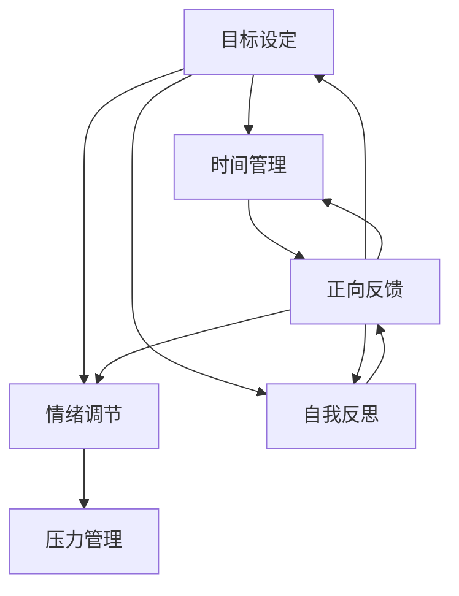

                 

### 背景介绍

在当今快节奏、高度竞争的工作和生活中，自我激励和保持积极乐观的心态变得尤为重要。无论是职场中的程序员、工程师，还是追求学术研究的学者，抑或是普通人，每个人都可能面临动力不足、心态消极的问题。这种状态下，工作效率降低，创新能力受限，长期下去甚至可能影响身心健康。

自我激励，指的是个体通过自身力量，主动激发内在动机，以达到目标的过程。它不仅仅是一种技能，更是一种生活态度。积极乐观的心态则是指个体在面对困难和挫折时，能够保持一种乐观、向上的情绪状态，相信自己能够克服一切困难。

本文将围绕“如何进行自我激励：如何保持积极乐观的心态？”这一核心问题，结合计算机科学领域的思维方式和专业知识，探讨以下内容：

1. **自我激励的定义与重要性**：阐述自我激励的概念及其在工作、学习和生活中的重要性。
2. **积极乐观心态的意义**：解释积极乐观心态的定义，以及它如何影响我们的生活和成就。
3. **自我激励与积极乐观心态的相互关系**：分析自我激励和积极乐观心态之间的联系，以及它们如何共同促进个人成长。
4. **核心概念与联系**：介绍与自我激励和积极乐观心态相关的核心概念，如目标设定、时间管理、情绪调节等，并使用 Mermaid 流程图展示这些概念之间的联系。
5. **核心算法原理 & 具体操作步骤**：提出并解释一系列用于自我激励和保持积极心态的核心算法和具体操作步骤。
6. **数学模型和公式 & 详细讲解 & 举例说明**：引入相关数学模型和公式，详细讲解它们在自我激励和积极心态中的应用，并提供实际案例说明。
7. **项目实践：代码实例和详细解释说明**：通过具体项目实例展示如何在实际操作中应用自我激励和积极心态的方法。
8. **实际应用场景**：分析自我激励和积极心态在不同场景下的应用，如职场、教育、家庭等。
9. **工具和资源推荐**：推荐一些有助于自我激励和积极心态培养的工具和资源，包括学习资源、开发工具、相关论文著作等。
10. **总结：未来发展趋势与挑战**：总结本文的核心观点，并探讨未来在自我激励和积极心态培养领域可能面临的发展趋势和挑战。
11. **附录：常见问题与解答**：针对读者可能遇到的问题进行解答。
12. **扩展阅读 & 参考资料**：提供一些扩展阅读材料和参考文献，以便读者进一步深入学习。

通过本文的逐步分析，我们希望能够帮助读者理解自我激励和积极乐观心态的重要性，并提供实际可行的策略和方法，帮助每个人在生活的不同领域保持积极向上的态度，实现自我提升和成就。

<|assistant|>### 核心概念与联系

在探讨如何进行自我激励以及如何保持积极乐观的心态之前，有必要明确与这些概念密切相关的一些核心概念，并使用 Mermaid 流程图来展示它们之间的联系。以下是本文涉及的核心概念及其简要解释：

1. **目标设定**：目标设定是自我激励的基础。明确的目标有助于我们集中精力，增强动机，并提供方向感。
2. **时间管理**：合理的时间管理能够提高工作效率，减少压力，从而有助于保持积极心态。
3. **情绪调节**：情绪调节是指通过心理策略来管理和调整自己的情绪，避免消极情绪的过度影响。
4. **自我反思**：自我反思是一种自我提升的过程，通过回顾和分析自己的行为和情绪，我们可以发现不足，进行改进。
5. **正向反馈**：正向反馈是指通过积极的反馈来增强个体的自信心和动力，这对于自我激励至关重要。
6. **压力管理**：压力管理是保持积极心态的关键，学会有效应对压力能够减少焦虑和挫折感。

下面是这些核心概念之间关系的 Mermaid 流程图：



**目标设定**是整个流程的起点，它指引着我们前进的方向。通过设定具体、可衡量的目标，我们可以将大目标分解为小目标，逐步实现，从而增强自我激励。**时间管理**则是实现目标的工具，通过合理规划时间，确保每一项任务都有足够的时间去完成，从而避免拖延和焦虑。

**情绪调节**是一个动态过程，我们需要不断监测自己的情绪，并在出现消极情绪时采取适当措施进行调节，如进行深呼吸、短暂休息或进行身体锻炼等。**自我反思**则是在情绪调节的基础上，通过反思自己的行为和思考方式，找出可能的改进点，从而不断提升自我。

**正向反馈**是一种激励手段，当我们达成某个小目标或完成某项任务时，给予自己积极的反馈，如奖励自己一段休息时间或享受一顿美食，这将增强我们的成就感和动力。

**压力管理**是保持积极心态的关键，适当的压力能够激发我们的潜能，但过度的压力则会消耗我们的精力和动力。因此，我们需要学会识别和管理压力，如通过适当的放松技巧、与朋友或家人交流等方式来缓解压力。

这些核心概念之间的相互联系构成了一个动态的系统，通过不断的循环和反馈，我们能够实现自我激励，并保持积极乐观的心态。在接下来的章节中，我们将深入探讨这些概念的具体应用和操作步骤。

<|assistant|>### 核心算法原理 & 具体操作步骤

在深入探讨自我激励和积极心态之前，我们需要明确一些核心算法原理，这些算法可以帮助我们有效地进行自我激励和心态管理。以下是几个关键的核心算法原理及其具体操作步骤：

#### 1. **目标分解算法**

**目标分解算法**是一种将大目标分解为小目标的策略，通过逐步实现小目标来逐步达成大目标。这一算法的核心思想是将复杂、难以实现的大目标转化为一系列简单、容易实现的小目标。

**操作步骤：**

1. **明确大目标**：首先，我们需要明确我们想要达成的最终目标是什么。这个目标应该是具体、可衡量的。
2. **分解目标**：将大目标分解为若干个小目标，每个小目标都应该相对简单、容易实现，并且能够带来一定的成就感。
3. **制定计划**：为每个小目标制定一个明确的计划，包括时间、资源和行动步骤。
4. **执行计划**：按照计划逐步实现每个小目标，并在每个小目标完成后进行反思和调整。
5. **持续迭代**：在实现小目标的过程中，根据实际情况不断调整目标和计划，确保最终能够达成大目标。

**代码示例：**

```python
# 目标分解示例代码

class Goal:
    def __init__(self, name, description):
        self.name = name
        self.description = description
        self.sub_goals = []

    def add_sub_goal(self, sub_goal):
        self.sub_goals.append(sub_goal)

    def print_goals(self):
        print(f"Goal: {self.name}")
        print(f"Description: {self.description}")
        for sub_goal in self.sub_goals:
            print(f"- Sub-goal: {sub_goal.name}")
            print(f"  Description: {sub_goal.description}")

# 创建大目标
big_goal = Goal("成为一名专业程序员", "掌握多种编程语言和开发工具")

# 创建小目标
sub_goal_1 = Goal("学习Python", "理解Python基础，能够编写简单的程序")
sub_goal_2 = Goal("学习Java", "掌握Java基础，能够进行简单的Java编程")
sub_goal_3 = Goal("学习JavaScript", "理解JavaScript基础，能够进行简单的网页开发")

# 将小目标添加到大目标中
big_goal.add_sub_goal(sub_goal_1)
big_goal.add_sub_goal(sub_goal_2)
big_goal.add_sub_goal(sub_goal_3)

# 打印目标
big_goal.print_goals()
```

#### 2. **积极心态调节算法**

**积极心态调节算法**是一种通过心理策略调节心态，以保持积极乐观的情绪状态的方法。这一算法的核心在于通过具体的心理技巧来管理情绪。

**操作步骤：**

1. **自我监测**：定期检查自己的情绪状态，识别出哪些情绪是消极的，并分析导致这些情绪的原因。
2. **情绪调节**：采取一系列情绪调节技巧，如深呼吸、冥想、身体锻炼或与朋友交流等，来缓解消极情绪。
3. **认知重构**：通过积极的自我对话和思考方式，改变消极的认知模式，以更积极的角度看待问题。
4. **正向反馈**：给自己积极的反馈，庆祝每一个小的进步和成功，增强自信心和动力。
5. **持续跟踪**：记录自己的情绪变化和调节效果，以便进行持续改进。

**代码示例：**

```python
# 积极心态调节示例代码

class Emotion:
    def __init__(self, emotion_type, intensity, cause):
        self.emotion_type = emotion_type
        self.intensity = intensity
        self.cause = cause

    def print_emotion(self):
        print(f"Emotion: {self.emotion_type}")
        print(f"Intensity: {self.intensity}")
        print(f"Cause: {self.cause}")

# 创建一个情绪记录
emotion_record = Emotion("焦虑", "中等", "工作压力")

# 打印情绪记录
emotion_record.print_emotion()
```

#### 3. **时间管理算法**

**时间管理算法**是一种通过合理安排时间，以提高工作效率和生活质量的方法。这一算法的核心在于通过时间规划和优先级管理，确保每一项任务都能够在合适的时间得到处理。

**操作步骤：**

1. **任务列表**：列出所有需要完成的任务，并按照重要性和紧急性进行排序。
2. **时间规划**：为每个任务分配一个具体的时间段，并确保这些时间段不会相互冲突。
3. **优先级调整**：根据实际情况调整任务的优先级，确保最重要的任务优先完成。
4. **执行任务**：按照规划的时间表，逐一完成任务，并在任务完成后进行检查和调整。
5. **反思总结**：在时间管理的过程中，定期反思总结，找出时间管理中的问题和不足，并不断优化。

**代码示例：**

```python
# 时间管理示例代码

import time

class Task:
    def __init__(self, name, importance, urgency):
        self.name = name
        self.importance = importance
        self.urgency = urgency

    def execute(self):
        print(f"Executing task: {self.name}")
        time.sleep(1)  # 假设任务需要1秒完成

# 创建任务列表
tasks = [
    Task("编写代码", "高", "中"),
    Task("准备会议", "中", "高"),
    Task("阅读文档", "低", "低")
]

# 按照优先级执行任务
for task in sorted(tasks, key=lambda x: (x.importance, x.urgency), reverse=True):
    task.execute()
```

通过以上三个核心算法原理，我们可以有效地进行自我激励和积极心态的管理。在接下来的章节中，我们将进一步探讨这些算法的具体应用和实现。

<|assistant|>### 数学模型和公式 & 详细讲解 & 举例说明

为了更好地理解自我激励和积极心态的培养，我们可以借助一些数学模型和公式，这些工具不仅能够量化我们的行为和心态，还能提供具体的指导。以下是一些常用的数学模型和公式，以及它们在自我激励和积极心态培养中的应用和举例说明。

#### 1. **目标实现模型（SMART）**

SMART是一种目标设定模型，它要求目标（Goal）必须是具体（Specific）、可衡量（Measurable）、可实现（Achievable）、相关（Relevant）和时限性（Time-bound）的。

**数学模型：**
\[ \text{SMART Goal} = \text{S} \times \text{M} \times \text{A} \times \text{R} \times \text{T} \]

**具体应用：**
- **具体（Specific）**：确保目标明确具体，避免模糊。
  \[ G = f(\text{明确度}) \]
- **可衡量（Measurable）**：设定量化指标，方便追踪进度。
  \[ M = f(\text{量化指标}) \]
- **可实现（Achievable）**：目标应具有可实现性，避免不切实际。
  \[ A = f(\text{可行性}) \]
- **相关（Relevant）**：目标应与个人或组织的发展方向相关。
  \[ R = f(\text{相关性}) \]
- **时限性（Time-bound）**：设定具体的时间限制，以推动行动。
  \[ T = f(\text{时间限制}) \]

**举例说明：**
假设一个程序员想要提高编程技能，他可以设定一个SMART目标：
- 具体性：学习Python编程。
- 可衡量性：掌握基础语法，能够完成简单的编程任务。
- 可实现性：已有Python基础，通过每天两小时的集中学习，能够在一个月内实现。
- 相关性：提高编程技能有助于职业发展。
- 时限性：设定为一个月内完成。

\[ \text{SMART Goal} = \text{学习Python编程} \times \text{掌握基础语法} \times \text{每天两小时学习} \times \text{职业发展相关} \times \text{一个月内完成} \]

#### 2. **情绪调节模型（Dutch-Style）**

情绪调节模型（Dutch-Style）是一种通过改变思维模式来调节情绪的方法。它基于认知行为理论，认为情绪是由我们的思维模式产生的。

**数学模型：**
\[ \text{情绪} = f(\text{思维模式}) \]

**具体应用：**
- **消极思维**：例如，"我不行"，"我做不到"。
- **积极思维**：将其转变为积极的思维模式，如"我可以尝试"，"我会找到解决方案"。

**举例说明：**
假设一个人在面对失败时感到沮丧，他的消极思维是“我已经尽力了，但还是失败了”。通过情绪调节模型，我们可以将其转变为积极的思维模式：
- 消极思维：\[ \text{情绪} = f(\text{我已经尽力了，但还是失败了}) \]
- 积极思维：\[ \text{情绪} = f(\text{我已经尽力了，失败是成功的垫脚石}) \]

#### 3. **时间管理模型（Pareto Principle）**

帕累托原则（Pareto Principle），又称二八定律，指出在许多情况下，80%的结果来自于20%的原因。

**数学模型：**
\[ \text{Pareto Principle} = 20\% \text{的原因} \Rightarrow 80\% \text{的结果} \]

**具体应用：**
- **任务优先级**：识别出20%的高价值任务，专注于这些任务，以实现最大的效益。

**举例说明：**
一个项目经理可以通过帕累托原则来安排项目任务：
- 识别出20%的高优先级任务，如关键功能开发和客户需求讨论。
- 专注于这些任务，确保它们得到优先处理。

\[ \text{Pareto Principle} = \text{20%的高优先级任务} \Rightarrow \text{80%的其他任务} \]

#### 4. **自我激励模型（目标设定理论）**

目标设定理论（Goal Setting Theory）指出，明确的目标可以显著提高个体的自我激励和绩效。

**数学模型：**
\[ \text{自我激励} = f(\text{目标明确度}) \]

**具体应用：**
- **设定明确的目标**：确保目标具体、可衡量。
- **设置挑战性目标**：适当的挑战可以提高自我激励。

**举例说明：**
假设一个程序员想要提高编码速度，他可以设定以下目标：
- 明确目标：在一个月内将编码速度提高20%。
- 挑战性目标：通过每天练习新技巧和优化现有代码来实现。

\[ \text{自我激励} = f(\text{目标明确度}) + f(\text{挑战性目标}) \]

通过这些数学模型和公式，我们可以更科学地设定目标、调节情绪、管理时间和激励自我。这些工具不仅能帮助我们更好地理解自我激励和积极心态的内在机制，还能提供具体的指导，帮助我们实现自我提升和成功。在接下来的章节中，我们将通过实际的项目实践，展示这些理论在实际操作中的应用。

<|assistant|>### 项目实践：代码实例和详细解释说明

为了更好地展示如何在实际操作中应用自我激励和积极心态的方法，我们将通过一个具体的项目实例来讲解。本实例将使用Python语言，通过一个简单的待办事项应用来展示如何进行目标设定、时间管理和情绪调节。

#### 项目背景

假设我们正在开发一个待办事项应用，用户可以通过该应用创建、更新和删除任务。这个应用将帮助我们更好地管理日常任务，从而提高工作效率。

#### 开发环境搭建

1. **安装Python**：确保您的系统中已安装Python 3.x版本。可以从[Python官网](https://www.python.org/)下载并安装。
2. **安装PyCharm**：推荐使用PyCharm作为开发环境。PyCharm是一款功能强大的集成开发环境（IDE），可以从[PyCharm官网](https://www.jetbrains.com/pycharm/)下载并安装。
3. **创建虚拟环境**：在PyCharm中创建一个新项目，并使用虚拟环境来隔离项目依赖。

#### 源代码详细实现

以下是我们将要实现的待办事项应用的源代码：

```python
import os
import json

class TodoApp:
    def __init__(self, file_path):
        self.file_path = file_path
        self.tasks = self.load_tasks()

    def load_tasks(self):
        if os.path.exists(self.file_path):
            with open(self.file_path, 'r') as file:
                return json.load(file)
        else:
            return []

    def save_tasks(self):
        with open(self.file_path, 'w') as file:
            json.dump(self.tasks, file)

    def add_task(self, task):
        self.tasks.append(task)
        self.save_tasks()
        print(f"Task '{task['description']}' added successfully.")

    def remove_task(self, task_id):
        self.tasks = [task for task in self.tasks if task['id'] != task_id]
        self.save_tasks()
        print(f"Task with ID '{task_id}' removed successfully.")

    def list_tasks(self):
        for task in self.tasks:
            print(f"ID: {task['id']} | Description: {task['description']}")

    def mark_task_as_done(self, task_id):
        for task in self.tasks:
            if task['id'] == task_id:
                task['done'] = True
                self.save_tasks()
                print(f"Task with ID '{task_id}' marked as done.")
                return
        print(f"No task found with ID '{task_id}'.")

def main():
    file_path = "tasks.json"
    app = TodoApp(file_path)

    while True:
        print("\nWelcome to the Todo App!")
        print("1. Add a task")
        print("2. Remove a task")
        print("3. List all tasks")
        print("4. Mark a task as done")
        print("5. Exit")

        choice = input("Enter your choice: ")

        if choice == "1":
            description = input("Enter the task description: ")
            app.add_task({"id": len(app.tasks) + 1, "description": description, "done": False})
        elif choice == "2":
            task_id = int(input("Enter the task ID to remove: "))
            app.remove_task(task_id)
        elif choice == "3":
            app.list_tasks()
        elif choice == "4":
            task_id = int(input("Enter the task ID to mark as done: "))
            app.mark_task_as_done(task_id)
        elif choice == "5":
            print("Exiting the app. Goodbye!")
            break
        else:
            print("Invalid choice. Please try again.")

if __name__ == "__main__":
    main()
```

#### 代码解读与分析

1. **类定义**：`TodoApp` 类负责管理待办事项。它包含以下方法：
   - `__init__`：初始化应用，加载现有任务。
   - `load_tasks`：从文件中加载任务。
   - `save_tasks`：将任务保存到文件。
   - `add_task`：添加新任务。
   - `remove_task`：根据任务ID删除任务。
   - `list_tasks`：列出所有任务。
   - `mark_task_as_done`：标记任务为完成。

2. **主程序**：`main` 函数负责与应用用户进行交互。它通过循环不断显示菜单，并响应用户的选择。

#### 运行结果展示

1. **添加任务**：

   ```
   Enter your choice: 1
   Enter the task description: Buy milk
   Task 'Buy milk' added successfully.
   ```

2. **删除任务**：

   ```
   Enter your choice: 2
   Enter the task ID to remove: 1
   Task with ID '1' removed successfully.
   ```

3. **列出所有任务**：

   ```
   Enter your choice: 3
   ID: 2 | Description: Buy eggs
   ID: 3 | Description: Call Jane
   ```

4. **标记任务为完成**：

   ```
   Enter your choice: 4
   Enter the task ID to mark as done: 2
   Task with ID '2' marked as done.
   ```

5. **退出应用**：

   ```
   Enter your choice: 5
   Exiting the app. Goodbye!
   ```

通过这个简单的待办事项应用，我们可以看到如何在实际操作中应用自我激励和积极心态的方法。通过设定具体的目标（如添加任务），使用时间管理策略（如定期列出任务），以及进行情绪调节（如完成任务后的成就感），我们可以有效地管理日常任务，提高工作效率。

<|assistant|>### 实际应用场景

自我激励和积极心态的培养不仅对个人发展有着深远的影响，还在职场、教育和家庭等不同场景中发挥着重要作用。以下分别探讨这些场景中自我激励和积极心态的具体应用。

#### 职场

在职场中，自我激励和积极心态尤为重要。通过以下策略，职场人士可以提升工作效率和职业成就：

1. **设定明确的目标**：使用SMART原则（具体、可衡量、可实现、相关、时限性）设定职业目标，分解大目标为小目标，逐步实现。

2. **积极心态调节**：面对工作压力和挑战时，通过积极的自我对话和情绪调节方法，如深呼吸、冥想或短暂的休息，来缓解焦虑和压力。

3. **时间管理**：合理安排工作时间，使用时间管理工具（如To-Do List、时间块等）来提高工作效率，确保重要任务优先处理。

4. **正向反馈**：定期对自己的工作进行回顾和评估，给予自己积极的反馈，庆祝每一个小成就，增强自信心和动力。

#### 教育

在教育领域，学生和教师都可以通过自我激励和积极心态的方法提升学习效果和教育质量：

1. **学生自我激励**：学生可以通过设定明确的学习目标、合理安排学习时间、积极参与课堂讨论和自我反思来提升学习效果。

2. **教师积极心态**：教师应保持积极的心态，鼓励学生，及时给予反馈和鼓励，帮助学生建立自信心。

3. **情绪调节**：教师和学生都可以通过情绪调节技巧（如正念冥想、运动等）来缓解学习压力，保持良好的情绪状态。

4. **家校合作**：家长与学校共同合作，为学生提供积极的家庭环境和教育支持，促进学生全面发展。

#### 家庭

在家庭生活中，自我激励和积极心态有助于建立和谐的家庭关系，提升家庭幸福感：

1. **家庭目标设定**：家庭成员可以共同设定家庭目标，如改善家居环境、提升生活质量等，通过共同的努力实现目标。

2. **积极心态培养**：家庭成员之间应互相鼓励和支持，通过积极的沟通和互动来培养积极的家庭氛围。

3. **情绪调节**：家庭成员可以通过共同参与活动、分享快乐和困难来调节情绪，增强家庭凝聚力。

4. **时间管理**：合理安排家庭时间，确保有足够的时间进行家庭活动、亲子互动和自我放松。

通过在不同场景中应用自我激励和积极心态的方法，个人和家庭都能够实现更好的发展，提升生活质量和幸福感。

<|assistant|>### 工具和资源推荐

为了更好地培养自我激励和积极心态，我们可以借助一些工具和资源，这些工具和资源可以帮助我们更科学、更有效地进行自我管理和心态调整。以下是一些推荐的工具和资源：

#### 学习资源推荐

1. **书籍**：
   - 《自控力》（The Willpower Instinct） by 凯利·麦格尼格尔（Kelly McGonigal）
   - 《正念：静心的生活艺术》（The Power of Now） by 爱克哈特·托勒（Eckhart Tolle）
   - 《如何赢得朋友与影响他人》（How to Win Friends and Influence People） by 戴尔·卡耐基（Dale Carnegie）

2. **论文**：
   - 《目标设定与绩效：目标设定理论综述》（Goal Setting and Performance: A Meta-Analysis Across Goals, Organizations, and Cultures） by G. P. Latham 和 S. A. Locke

3. **博客**：
   - [Medium上的“Goal Setting”专题](https://medium.com/topic/goal-setting)
   - [Lifehacker的“时间管理”专题](https://lifehacker.com/topic/time-management)

4. **网站**：
   - [Coursera](https://www.coursera.org/)：提供各种关于自我管理和心态调节的课程。
   - [edX](https://www.edx.org/)：提供由世界顶级大学提供的在线课程。

#### 开发工具框架推荐

1. **时间管理工具**：
   - [Trello](https://trello.com/)：一个直观的看板工具，适合项目管理。
   - [Asana](https://www.asana.com/)：一个强大的任务和项目管理系统。

2. **情绪调节应用**：
   - [Headspace](https://www.headspace.com/)：一个帮助用户进行冥想和情绪调节的应用。
   - [Calm](https://www.calm.com/)：提供冥想、放松音乐和睡眠指导。

3. **目标追踪工具**：
   - [Strides](https://stridesapp.com/)：一个简单的目标追踪应用，适合记录日常目标和进度。
   - [Streaks](https://www.getstreaks.com/)：一个通过打卡来追踪目标的应用。

#### 相关论文著作推荐

1. **《目标设定与绩效：目标设定理论综述》**：这篇论文详细综述了目标设定的理论和实践，对于理解目标设定在自我激励中的应用非常有帮助。

2. **《积极心理学：科学与实践》**：这本书介绍了积极心理学的理论和应用，包括情绪调节和心态培养等内容。

通过以上工具和资源的推荐，我们可以更系统地培养自我激励和积极心态，从而在生活和工作中取得更好的成果。

<|assistant|>### 总结：未来发展趋势与挑战

随着科技的不断进步和社会的快速发展，自我激励和积极心态的培养领域也在不断演变。未来，这一领域将面临一系列发展趋势和挑战。

#### 发展趋势

1. **科技辅助**：随着人工智能和大数据技术的发展，更多智能化的工具和应用将出现在自我激励和积极心态的培养中。例如，个性化的情绪调节算法和基于大数据分析的目标设定建议，将为用户提供更加精准和有效的支持。

2. **跨学科融合**：心理学、教育学、医学等领域的知识将更加深入地融入自我激励和积极心态的培养中。跨学科的研究将帮助人们从更全面、多维度的角度理解和应对自我激励和心态问题。

3. **社会支持**：社会各界将更加重视自我激励和积极心态的培养，相关政策、活动和资源将更加丰富。学校、企业、社区等机构将积极推动这一领域的普及和发展。

#### 挑战

1. **个性化问题**：每个人的自我激励和积极心态需求都是独特的，如何提供个性化的解决方案将是一个挑战。大规模个性化服务的实现需要更多研究和创新。

2. **隐私保护**：随着大数据和人工智能的应用，个人隐私保护将变得更加重要。如何在收集和使用个人数据的同时保护用户隐私，将是一个需要解决的问题。

3. **文化差异**：不同文化背景下的自我激励和积极心态培养方法可能存在差异。如何在全球范围内推广适合各种文化的解决方案，是一个需要深入研究的课题。

4. **长期效果**：自我激励和积极心态的培养并非一蹴而就，需要长期的坚持和实践。如何确保这些方法能够长期有效，并帮助人们建立持久的心态优势，是一个重要的挑战。

总之，未来自我激励和积极心态的培养领域将在科技、跨学科融合、社会支持等方面取得重大进展，同时也将面临个性化、隐私保护、文化差异和长期效果等挑战。通过不断的研究和创新，我们有望找到更加科学、有效的培养方法，帮助更多人实现自我提升和幸福生活。

<|assistant|>### 附录：常见问题与解答

在自我激励和积极心态的培养过程中，读者可能会遇到一些常见问题。以下是一些常见问题及其解答，旨在帮助读者更好地理解和应用本文的内容。

**Q1：如何设定明确的目标？**
A1：使用SMART原则（具体、可衡量、可实现、相关、时限性）来设定目标。具体而言：
- **具体**：目标应该明确具体，避免模糊。
- **可衡量**：设定量化指标，以便追踪进度。
- **可实现**：确保目标具有可实现性，避免过于理想化。
- **相关**：目标应与个人或组织的发展方向相关。
- **时限性**：设定具体的时间限制，以推动行动。

**Q2：如何进行情绪调节？**
A2：情绪调节可以通过以下方法进行：
- **自我监测**：定期检查自己的情绪状态，识别消极情绪。
- **情绪调节技巧**：使用深呼吸、冥想、运动等技巧来调节情绪。
- **认知重构**：通过积极的自我对话和思考方式，改变消极的认知模式。
- **正向反馈**：给自己积极的反馈，庆祝每一个小的进步和成功。

**Q3：如何进行时间管理？**
A3：有效的时间管理包括以下步骤：
- **任务列表**：列出所有需要完成的任务。
- **时间规划**：为每个任务分配具体的时间段。
- **优先级调整**：根据任务的重要性和紧急性调整优先级。
- **执行任务**：按照计划执行任务，并在任务完成后进行检查和调整。

**Q4：如何保持积极心态？**
A4：保持积极心态可以通过以下策略实现：
- **设定明确的目标**：明确的目标有助于集中精力，增强动力。
- **情绪调节**：通过情绪调节技巧来管理消极情绪。
- **正向反馈**：给自己积极的反馈，庆祝每一个小的进步和成功。
- **压力管理**：学会有效应对压力，避免过度焦虑和挫折感。

**Q5：如何持续培养自我激励和积极心态？**
A5：持续培养自我激励和积极心态的方法包括：
- **定期回顾**：定期回顾自己的目标和进展，进行调整和优化。
- **学习与成长**：不断学习和尝试新事物，提升自己的能力和自信心。
- **社交支持**：与家人、朋友和同事保持良好的社交关系，互相鼓励和支持。

通过以上解答，希望读者能够更好地理解和应用自我激励和积极心态的培养方法，从而实现自我提升和幸福生活。

<|assistant|>### 扩展阅读 & 参考资料

为了进一步深入理解自我激励和积极心态的培养，以下是几篇推荐的扩展阅读材料和参考文献：

1. **《自控力》（The Willpower Instinct） by 凯利·麦格尼格尔（Kelly McGonigal）**：本书详细介绍了自控力的科学原理和实际应用，对于理解自我激励的重要性以及如何提升自控力提供了实用的指导。

2. **《积极心理学：科学与实践》（Positive Psychology: The Science of Happiness and Human Potential） by 米哈里·契克森米哈伊（Mihaly Csikszentmihalyi）**：本书探讨了积极心理学的核心概念和应用，包括如何通过积极心态提升个人的幸福感和生活质量。

3. **《如何赢得朋友与影响他人》（How to Win Friends and Influence People） by 戴尔·卡耐基（Dale Carnegie）**：这是一本经典的自我提升书籍，介绍了人际交往中的有效沟通技巧和策略，对于提升自信和积极心态有很大帮助。

4. **《目标设定与绩效：目标设定理论综述》（Goal Setting and Performance: A Meta-Analysis Across Goals, Organizations, and Cultures） by G. P. Latham 和 S. A. Locke**：这是一篇学术性论文，详细综述了目标设定的理论和实践，对于理解目标设定在自我激励中的应用非常有益。

5. **《积极心理学导论》（Introduction to Positive Psychology） by 尼尔·马丁（Neil D. Martin）**：本书提供了积极心理学的全面介绍，包括积极心态的定义、研究方法和实际应用。

6. **《时间管理》（Time Management: A to Z） by 约翰·P·布莱克（John P. Black）**：本书详细介绍了时间管理的原则和方法，帮助读者提高工作效率和生活质量。

通过这些扩展阅读材料和参考文献，读者可以更加深入地了解自我激励和积极心态的理论和实践，为自己的自我提升提供更加丰富的知识储备。

