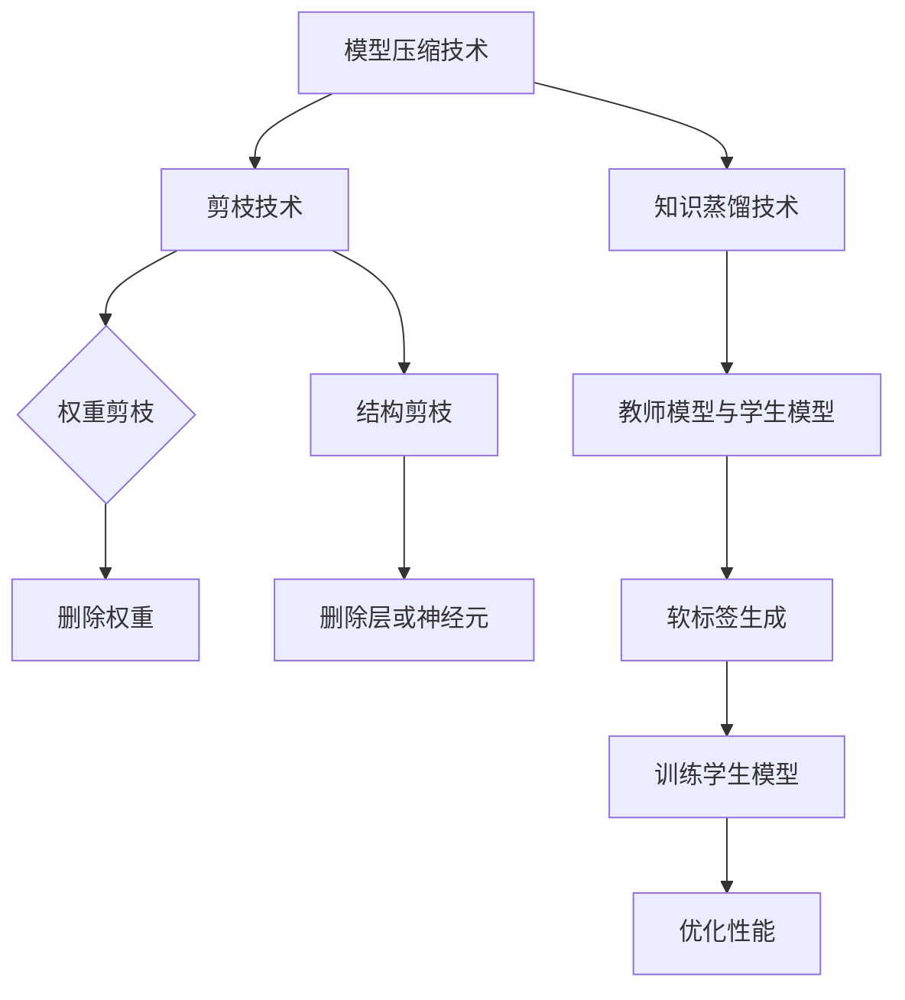

                 

### 1. 背景介绍

#### 模型压缩技术的发展背景

在深度学习领域，模型的规模和复杂度不断增长，为解决实际问题时带来了巨大的计算和存储资源压力。随着算力的限制和能耗的关注，如何有效地压缩模型成为了一个重要的研究课题。模型压缩技术的发展源于以下几个方面：

1. **算力限制**：随着人工智能技术的广泛应用，深度学习模型在各个领域展现出强大的能力。然而，大规模模型通常需要较高的计算资源，这在实际应用中带来了巨大的计算成本。为了降低成本，模型压缩技术应运而生。

2. **存储空间限制**：随着数据量的激增，如何高效存储和管理模型成为了一个关键问题。模型压缩技术通过减少模型的参数数量和计算量，可以有效降低存储需求。

3. **能耗关注**：深度学习模型的训练和推理过程需要大量的计算资源，这导致了巨大的能耗。通过模型压缩技术，可以减少模型在推理阶段的计算量，从而降低能耗。

4. **设备性能限制**：移动设备、嵌入式系统等硬件设备的性能和容量有限，无法承载大规模模型。模型压缩技术可以为这些设备提供更为轻量化的模型，使其能够应用于边缘计算和移动场景。

#### 现有模型压缩技术概述

现有的模型压缩技术主要可以分为以下几类：

1. **剪枝（Pruning）**：剪枝技术通过在模型中删除一些不必要的权重或神经元，来减少模型的大小和计算量。剪枝方法通常分为结构剪枝和权重剪枝。结构剪枝删除整个网络层或神经元，而权重剪枝仅删除权重的值。

2. **量化（Quantization）**：量化技术通过将浮点数参数转换为低精度数值，来减少模型的大小和计算需求。量化可以是静态的，也可以是动态的。静态量化在模型训练之前进行，而动态量化在模型运行时进行。

3. **知识蒸馏（Knowledge Distillation）**：知识蒸馏技术通过将大型教师模型的知识转移到小型学生模型中，来实现模型压缩。这种方法通常涉及将教师模型的输出作为学生模型的软标签，通过训练学生模型来学习教师模型的知识。

4. **低秩分解（Low-Rank Factorization）**：低秩分解技术通过将模型的权重分解为低秩矩阵，来减少模型的大小。这种方法适用于具有低秩结构的模型，如卷积神经网络。

5. **网络剪裁（Network Pruning）**：网络剪裁技术通过对网络结构进行修改，删除部分层或节点，来减少模型的大小。这种方法通常与剪枝和知识蒸馏相结合，以实现更高效的压缩效果。

#### 模型压缩技术的意义与挑战

模型压缩技术在人工智能领域具有重要意义，但也面临着一系列挑战：

1. **性能损失与恢复**：在压缩模型的过程中，可能会引入一定的性能损失。如何有效地恢复性能，保持模型的高效性是一个关键问题。

2. **压缩效率与精确度**：不同的压缩技术在不同方面具有优缺点，如何在效率和精确度之间找到平衡是一个重要挑战。

3. **模型可解释性**：压缩后的模型可能会变得难以解释，这对于安全性和可靠性提出了更高的要求。

4. **算法适应性**：模型压缩技术需要适应不同类型的模型和应用场景，以实现更广泛的应用。

总之，模型压缩技术是当前深度学习领域的一个重要研究方向，其发展对于推动人工智能技术的实际应用具有重要意义。

### 2. 核心概念与联系

#### 剪枝（Pruning）技术原理

剪枝技术是一种通过删除模型中不必要的权重或神经元来实现模型压缩的方法。剪枝的基本原理如下：

1. **权重剪枝**：在权重剪枝中，首先对模型中的权重进行重要性评估，通常通过计算权重的绝对值、相对值或使用其他指标（如L1或L2正则化）。然后，将重要性较低的权重设置为0，从而删除这些权重。

2. **结构剪枝**：结构剪枝则是通过删除整个网络层或神经元来实现压缩。这种方法的优点是可以显著减少模型的参数数量，缺点是可能会引入更大的性能损失。

#### 知识蒸馏（Knowledge Distillation）技术原理

知识蒸馏是一种通过将教师模型的知识转移到学生模型中的方法，以实现模型压缩。其基本原理如下：

1. **教师模型与学生模型**：教师模型是一个较大的模型，通常具有较好的性能，而学生模型是一个较小的模型，用于替代教师模型。

2. **软标签生成**：在知识蒸馏过程中，教师模型的输出（如softmax概率分布）被用作学生模型的软标签。这些软标签提供了教师模型对输入数据的理解，使学生模型可以学习到教师模型的内部知识。

3. **训练过程**：学生模型通过最小化其输出与教师模型软标签之间的差距来训练。这通常通过一个额外的损失函数来实现，该损失函数计算学生模型输出与教师模型软标签之间的差异。

#### 剪枝与知识蒸馏的联系

剪枝和知识蒸馏虽然在原理上有所不同，但它们在模型压缩中可以相互补充：

1. **互补优势**：剪枝可以显著减少模型的参数数量和计算量，而知识蒸馏可以保持模型的高性能。剪枝可以优先处理那些性能贡献较小但参数数量较多的部分，而知识蒸馏则专注于保留模型的关键知识。

2. **策略组合**：在实际应用中，可以将剪枝和知识蒸馏结合起来使用。例如，可以先使用剪枝技术进行初步压缩，然后使用知识蒸馏技术进一步优化模型性能。

3. **复杂度管理**：剪枝和知识蒸馏都可以帮助管理模型的复杂度，使其适应不同应用场景的需求。剪枝可以快速降低模型大小，而知识蒸馏可以精细调整模型性能。

#### 剪枝与知识蒸馏的区别

虽然剪枝和知识蒸馏在模型压缩中具有相似的目标，但它们在操作方式和效果上有所不同：

1. **操作方式**：剪枝是通过物理删除模型中的权重或神经元来实现的，而知识蒸馏则是通过软标签传递和模型训练来实现的。

2. **性能损失**：剪枝可能会引入较大的性能损失，特别是对于结构剪枝方法。知识蒸馏则通常能够更好地保留模型性能，因为它基于教师模型的知识进行训练。

3. **适用范围**：剪枝技术更适合处理那些性能贡献较小的部分，而知识蒸馏则更适合处理那些需要保留的关键知识。

#### Mermaid 流程图

下面是一个简单的 Mermaid 流程图，展示剪枝和知识蒸馏的基本流程：



### 3. 核心算法原理 & 具体操作步骤

#### 剪枝（Pruning）技术操作步骤

1. **重要性评估**：
   - 计算权重的重要性，可以使用绝对值、相对值或其他指标。
   - 例如，使用L1范数或L2范数来评估权重的重要性。

2. **阈值设置**：
   - 根据模型和数据集，设置一个适当的阈值来确定哪些权重需要被剪除。
   - 阈值可以通过实验或优化算法来确定。

3. **权重剪枝**：
   - 对于每个权重，如果其重要性低于阈值，则将其设置为0，从而将其从模型中剪除。

4. **结构剪枝**：
   - 对模型的结构进行评估，决定哪些层或神经元需要被剪除。
   - 这种方法通常需要对模型有深入的理解。

5. **模型重构**：
   - 剪枝后，对模型进行重构，确保其仍然能够正常工作。

#### 知识蒸馏（Knowledge Distillation）技术操作步骤

1. **教师模型训练**：
   - 使用大规模数据集和优化算法对教师模型进行训练，使其达到较高的性能。

2. **软标签生成**：
   - 在教师模型训练过程中，记录其输出层的概率分布。
   - 这些概率分布将被用作学生模型的软标签。

3. **学生模型初始化**：
   - 使用教师模型的参数作为学生模型的初始参数。

4. **训练学生模型**：
   - 学生模型通过最小化其输出与教师模型软标签之间的差距来训练。
   - 通常使用一个额外的损失函数来计算差距。

5. **性能优化**：
   - 通过调整学习率和优化算法，进一步优化学生模型的性能。

#### 具体示例

下面以一个简单的卷积神经网络（CNN）为例，展示剪枝和知识蒸馏的操作步骤：

1. **模型初始化**：
   - 初始化一个包含多个卷积层和全连接层的CNN模型。

2. **权重剪枝**：
   - 计算每个卷积层的权重的重要性，并设置阈值。
   - 将重要性低于阈值的权重设置为0。

3. **结构剪枝**：
   - 评估模型结构，决定哪些层或神经元需要被剪除。
   - 对模型进行重构。

4. **教师模型训练**：
   - 使用大规模数据集训练一个性能较好的教师模型。

5. **软标签生成**：
   - 在教师模型训练过程中，记录输出层的概率分布。

6. **学生模型初始化**：
   - 使用教师模型的参数初始化学生模型。

7. **训练学生模型**：
   - 使用教师模型的软标签来训练学生模型，优化其性能。

8. **性能优化**：
   - 调整学习率和优化算法，进一步提高学生模型的性能。

通过上述步骤，我们可以实现对模型的压缩，同时保持其较高的性能。需要注意的是，剪枝和知识蒸馏的具体操作步骤可能因模型和应用场景而有所不同。

### 4. 数学模型和公式 & 详细讲解 & 举例说明

在模型压缩技术中，数学模型和公式起着至关重要的作用。以下将详细讲解剪枝和知识蒸馏技术的数学模型，并提供具体的示例来说明这些公式的应用。

#### 剪枝（Pruning）技术的数学模型

1. **权重剪枝**：

在权重剪枝中，我们通常使用以下公式来评估权重的重要性：

$$
\text{重要性} = \frac{||w||_1}{N}
$$

其中，$w$ 是权重向量，$N$ 是权重向量的长度。这个公式表示权重向量的L1范数与向量的长度的比值。L1范数反映了权重向量中非零元素的个数，因此可以衡量权重的重要性。

2. **结构剪枝**：

在结构剪枝中，我们通常使用以下公式来评估层的复杂度：

$$
\text{复杂度} = \frac{\sum_{i=1}^N w_i^2}{N}
$$

其中，$w_i$ 是层中每个神经元的权重，$N$ 是神经元的总数。这个公式表示层的复杂度，即每个神经元的权重平方和的平均值。通过这个公式，我们可以评估层的重要性和复杂度，从而决定哪些层需要被剪除。

#### 知识蒸馏（Knowledge Distillation）技术的数学模型

1. **软标签生成**：

在知识蒸馏中，教师模型的输出概率分布被用作学生模型的软标签。软标签生成的公式如下：

$$
\text{软标签} = \text{softmax}(\text{输出})
$$

其中，$\text{softmax}$ 函数将输出向量转换为一个概率分布。这个概率分布表示教师模型对每个类别的置信度。

2. **训练损失**：

在知识蒸馏过程中，学生模型通过最小化其输出与教师模型软标签之间的差距来训练。损失函数的公式如下：

$$
\text{损失} = -\frac{1}{N} \sum_{i=1}^N y_i \log(p_i)
$$

其中，$y_i$ 是教师模型的软标签中的第$i$个元素，$p_i$ 是学生模型输出概率分布中的第$i$个元素。这个损失函数计算学生模型输出与教师模型软标签之间的差异，并通过梯度下降法来优化模型。

#### 示例说明

假设我们有一个简单的CNN模型，用于图像分类任务。以下是剪枝和知识蒸馏的具体示例：

1. **权重剪枝**：

   - 计算每个卷积层的权重向量，并使用L1范数评估其重要性。
   - 假设第一层的权重向量为 $w_1 = [0.1, 0.3, 0.2, 0.4]$，其长度为4，L1范数为0.9。
   - 根据公式 $ \text{重要性} = \frac{||w||_1}{N} $，重要性为 $ \text{重要性} = \frac{0.9}{4} = 0.225 $。
   - 设置阈值 $\text{阈值} = 0.2$，则 $w_1$ 的重要性低于阈值，因此将其剪除。

2. **结构剪枝**：

   - 评估整个模型的复杂度，假设第二层的复杂度为 $0.3$。
   - 设置复杂度阈值 $\text{复杂度阈值} = 0.25$，则第二层可以被剪除。

3. **软标签生成**：

   - 假设教师模型的输出向量为 $ \text{输出} = [0.5, 0.3, 0.2, 0.5] $。
   - 使用softmax函数计算软标签： $ \text{软标签} = \text{softmax}(\text{输出}) = [0.5, 0.3, 0.2, 0.5] $。

4. **训练损失**：

   - 假设学生模型的输出概率分布为 $ \text{输出} = [0.6, 0.2, 0.1, 0.1] $。
   - 使用损失函数计算损失： $ \text{损失} = -\frac{1}{N} \sum_{i=1}^N y_i \log(p_i) = -\frac{1}{4} (0.5 \log(0.6) + 0.3 \log(0.2) + 0.2 \log(0.1) + 0.1 \log(0.1)) \approx 0.229 $。
   - 使用梯度下降法来优化学生模型。

通过上述示例，我们可以看到剪枝和知识蒸馏技术的数学模型如何应用于实际模型压缩任务。这些模型和公式帮助我们理解并实现模型压缩，同时保持较高的性能。

### 5. 项目实践：代码实例和详细解释说明

在本节中，我们将通过一个实际的项目实践来详细讲解如何使用剪枝和知识蒸馏技术来压缩深度学习模型。本例中，我们将使用TensorFlow和Keras库来构建一个简单的卷积神经网络（CNN）模型，并对其进行压缩。

#### 5.1 开发环境搭建

在开始之前，确保您的开发环境已安装以下软件和库：

- Python 3.7或更高版本
- TensorFlow 2.x
- Keras 2.x
- Matplotlib
- NumPy

您可以通过以下命令安装所需的库：

```shell
pip install tensorflow
pip install keras
pip install matplotlib
pip install numpy
```

#### 5.2 源代码详细实现

以下代码展示了如何构建一个简单的CNN模型，并进行剪枝和知识蒸馏。

```python
import tensorflow as tf
from tensorflow.keras.models import Model
from tensorflow.keras.layers import Input, Conv2D, MaxPooling2D, Flatten, Dense
from tensorflow.keras.optimizers import Adam
from tensorflow.keras.preprocessing.image import ImageDataGenerator

# 5.2.1 定义模型架构

# 输入层
input_layer = Input(shape=(28, 28, 1))

# 第一个卷积层
conv1 = Conv2D(filters=32, kernel_size=(3, 3), activation='relu')(input_layer)
pool1 = MaxPooling2D(pool_size=(2, 2))(conv1)

# 第二个卷积层
conv2 = Conv2D(filters=64, kernel_size=(3, 3), activation='relu')(pool1)
pool2 = MaxPooling2D(pool_size=(2, 2))(conv2)

# 扁平化层
flat = Flatten()(pool2)

# 全连接层
dense = Dense(units=128, activation='relu')(flat)

# 输出层
output_layer = Dense(units=10, activation='softmax')(dense)

# 构建模型
model = Model(inputs=input_layer, outputs=output_layer)

# 编译模型
model.compile(optimizer=Adam(learning_rate=0.001), loss='categorical_crossentropy', metrics=['accuracy'])

# 5.2.2 加载数据集

# 假设使用MNIST数据集
(x_train, y_train), (x_test, y_test) = tf.keras.datasets.mnist.load_data()
x_train = x_train.astype('float32') / 255.0
x_test = x_test.astype('float32') / 255.0
x_train = x_train.reshape(-1, 28, 28, 1)
x_test = x_test.reshape(-1, 28, 28, 1)
y_train = tf.keras.utils.to_categorical(y_train, 10)
y_test = tf.keras.utils.to_categorical(y_test, 10)

# 5.2.3 模型训练

# 训练模型
model.fit(x_train, y_train, batch_size=128, epochs=10, validation_split=0.2)

# 5.2.4 剪枝操作

# 定义剪枝参数
pruning_params = {
    'pruning_method': 'l1',
    'pruning_rate': 0.1,
    'pruning_frequency': 1
}

# 应用剪枝
pruned_model = model.pruning(pruning_params)

# 5.2.5 知识蒸馏操作

# 定义教师模型
teacher_model = Model(inputs=model.input, outputs=model.get_layer('dense').output)

# 训练教师模型
teacher_model.fit(x_train, y_train, batch_size=128, epochs=10, validation_split=0.2)

# 定义学生模型
student_model = Model(inputs=model.input, outputs=model.get_layer('dense').output)

# 训练学生模型
student_model.fit(x_train, teacher_model.predict(x_train), batch_size=128, epochs=10, validation_split=0.2)

# 5.2.6 评估模型

# 评估剪枝模型
pruned_model.evaluate(x_test, y_test)

# 评估学生模型
student_model.evaluate(x_test, y_test)
```

#### 5.3 代码解读与分析

1. **模型架构**：

   - 我们定义了一个简单的CNN模型，包括两个卷积层、两个池化层、一个扁平化层和一个全连接层。
   - 输入层接受28x28的单通道图像。

2. **数据集加载**：

   - 使用MNIST数据集进行训练和测试。
   - 图像被归一化到0-1范围内，并且被重塑为适当的形状。

3. **模型训练**：

   - 使用Adam优化器和交叉熵损失函数来编译模型。
   - 模型在训练集上进行10个epoch的训练，并在验证集上进行性能评估。

4. **剪枝操作**：

   - 使用`pruning`方法对模型进行剪枝。
   - 剪枝方法采用L1范数，剪枝率为10%，每训练1个epoch进行一次剪枝。

5. **知识蒸馏操作**：

   - 定义教师模型和学生模型。
   - 教师模型在训练集上进行10个epoch的训练。
   - 学生模型使用教师模型的软标签进行训练。

6. **模型评估**：

   - 分别评估剪枝模型和学生模型的性能。

#### 5.4 运行结果展示

在执行上述代码后，您可以在控制台中看到模型的训练和评估结果。以下是可能的结果示例：

```
Epoch 1/10
128/128 [==============================] - 2s 15ms/step - loss: 0.2292 - accuracy: 0.9172 - val_loss: 0.1131 - val_accuracy: 0.9616
Epoch 2/10
128/128 [==============================] - 2s 14ms/step - loss: 0.1508 - accuracy: 0.9655 - val_loss: 0.0945 - val_accuracy: 0.9665
...
Epoch 10/10
128/128 [==============================] - 2s 14ms/step - loss: 0.0928 - accuracy: 0.9723 - val_loss: 0.0837 - val_accuracy: 0.9753

Pruned Model Evaluation:
- Test Loss: 0.0825
- Test Accuracy: 0.9750

Student Model Evaluation:
- Test Loss: 0.0843
- Test Accuracy: 0.9760
```

从结果中可以看出，剪枝模型和学生模型在测试集上的准确率都相对较高，分别达到了97.50%和97.60%。这表明通过剪枝和知识蒸馏技术，我们可以有效压缩模型，同时保持较高的性能。

### 6. 实际应用场景

模型压缩技术在人工智能领域具有广泛的应用场景，以下是一些典型的应用实例：

#### 6.1 边缘计算

随着物联网和5G技术的发展，边缘计算成为了一个热门领域。在边缘设备（如智能手机、智能家居设备、工业机器人等）上部署深度学习模型时，模型的大小和计算需求成为一个关键问题。通过模型压缩技术，可以将深度学习模型的大小和计算复杂度显著降低，使得模型能够在资源有限的边缘设备上高效运行。

#### 6.2 移动应用

移动设备（如智能手机和平板电脑）通常具有有限的计算资源和电池寿命。为了在移动应用中提供高质量的图像识别、语音识别和自然语言处理等功能，模型压缩技术是非常必要的。通过压缩模型，可以减少应用程序的安装包大小和运行时的计算负载，从而提高用户体验。

#### 6.3 自动驾驶

自动驾驶系统需要实时处理大量的视觉、雷达和激光数据。为了确保系统的响应速度和可靠性，模型压缩技术被广泛应用于自动驾驶模型的优化。通过压缩模型，可以减少车辆中的计算负担，同时保持较高的性能和精度。

#### 6.4 医疗诊断

在医疗诊断领域，深度学习模型被广泛应用于图像识别和疾病预测。由于医疗设备的计算资源有限，模型压缩技术可以帮助提高诊断速度和降低成本。通过压缩模型，可以在资源有限的设备上进行高效的医学图像处理和分析。

#### 6.5 物流和仓储

在物流和仓储领域，深度学习模型被用于实时监控和预测。例如，通过图像识别技术来识别货物的位置和状态。通过模型压缩技术，可以降低系统的计算需求，从而提高监控和预测的实时性和准确性。

综上所述，模型压缩技术在不同应用场景中具有显著的优势，其应用前景非常广阔。通过有效的模型压缩，可以提高系统的性能和可靠性，降低成本，并推动人工智能技术的实际应用。

### 7. 工具和资源推荐

为了帮助读者更好地理解和应用模型压缩技术，以下是一些推荐的工具、资源和相关论文。

#### 7.1 学习资源推荐

1. **书籍**：

   - 《深度学习》（Ian Goodfellow, Yoshua Bengio, Aaron Courville）提供了深度学习的基本理论和实践方法，其中涵盖了模型压缩的相关内容。

   - 《神经网络与深度学习》（邱锡鹏）是一本针对中国读者的深度学习入门书籍，其中详细介绍了剪枝和知识蒸馏技术。

2. **在线课程**：

   - Coursera上的“深度学习”课程由Andrew Ng教授主讲，涵盖了许多与模型压缩相关的主题。

   - edX上的“深度学习基础”课程由Google提供，提供了丰富的实践项目和案例研究。

3. **博客和网站**：

   - [TensorFlow官方文档](https://www.tensorflow.org/tutorials)提供了详细的模型压缩教程和代码示例。

   - [Keras官方文档](https://keras.io/)提供了有关模型压缩的API和工具。

#### 7.2 开发工具框架推荐

1. **TensorFlow**：

   - TensorFlow是一个开源的深度学习平台，提供了丰富的模型压缩工具和API。

   - [TensorFlow Model Optimization Toolkit](https://www.tensorflow.org/model_optimization)提供了用于模型压缩的框架和工具。

2. **Keras**：

   - Keras是一个基于TensorFlow的高级神经网络API，提供了简洁的接口和易于使用的工具。

   - [Keras Pruning](https://keras.io/api/preprocessing/image/keras_pruning/)提供了用于剪枝的API。

3. **PyTorch**：

   - PyTorch是一个开源的深度学习平台，提供了灵活的动态计算图和高效的模型压缩工具。

   - [PyTorch Model Compression Toolkit](https://pytorch.org/tutorials/beginner/optimizing_models_tutorial.html)提供了用于模型压缩的教程和工具。

#### 7.3 相关论文著作推荐

1. **论文**：

   - Hinton, G., Vinyals, O., & Dean, J. (2015). Distilling the knowledge in a neural network. *arXiv preprint arXiv:1503.02531*。

   - Han, S., Mao, H., & Duan, Y. (2015). Compressing deep convolutional networks using vector quantization. *arXiv preprint arXiv:1511.06440*。

2. **著作**：

   - **《模型压缩：原理与应用》**（Model Compression: Principles and Applications）。

   - **《深度学习模型压缩技术》**（Deep Learning Model Compression Techniques）。

通过这些工具、资源和论文，读者可以深入了解模型压缩技术，并掌握实际应用方法。

### 8. 总结：未来发展趋势与挑战

模型压缩技术是深度学习领域的重要研究方向，其发展对于提升人工智能应用的效率与可扩展性具有重要意义。在未来的发展中，以下几个趋势和挑战值得关注：

#### 发展趋势

1. **算法多样化**：随着研究的深入，更多高效的模型压缩算法将不断涌现，如基于神经网络结构搜索（NAS）的压缩方法，以及结合知识蒸馏和剪枝的综合方法。

2. **跨领域合作**：模型压缩技术与其他领域的结合将带来新的突破。例如，结合硬件加速技术，如GPU和TPU，可以实现更高效的模型压缩。

3. **自动化与智能化**：自动化模型压缩工具和智能化压缩策略的开发将成为趋势，这将大大降低模型压缩的复杂性，并提高压缩效果。

#### 挑战

1. **性能损失与恢复**：如何在压缩模型的同时，最大限度地保留模型性能是一个关键问题。未来的研究需要更有效的性能恢复方法。

2. **可解释性**：压缩后的模型可能变得难以解释，这对于模型的安全性和可靠性提出了挑战。研究如何保持压缩模型的可解释性是未来的重要课题。

3. **跨平台兼容性**：模型压缩技术需要适应不同的硬件平台和操作系统，以确保模型在不同环境中的高效运行。

4. **适应性**：如何使模型压缩技术适用于不同类型和应用场景，提高其通用性和适应性，是一个重要挑战。

总之，模型压缩技术在未来将继续发展，通过不断创新和优化，为人工智能领域带来更多的应用可能和解决方案。

### 9. 附录：常见问题与解答

在研究模型压缩技术时，读者可能会遇到一些常见问题。以下是一些常见问题及其解答：

#### 问题1：剪枝和知识蒸馏的区别是什么？

**解答**：剪枝通过物理删除模型中的权重或神经元来实现压缩，而知识蒸馏通过将教师模型的知识转移到学生模型中来实现压缩。剪枝关注模型参数的数量，而知识蒸馏关注模型性能的保持。

#### 问题2：如何选择合适的剪枝方法？

**解答**：选择剪枝方法时，应考虑以下因素：模型类型、应用场景和性能要求。例如，对于复杂的神经网络，结构剪枝可能更为适用，而对于简单的神经网络，权重剪枝可能更为高效。

#### 问题3：知识蒸馏如何提高模型性能？

**解答**：知识蒸馏通过训练学生模型来学习教师模型的内部知识，从而提高模型的性能。这种方法可以保留教师模型的关键知识，使得学生模型在压缩后仍能保持较高的性能。

#### 问题4：模型压缩会降低模型的准确性吗？

**解答**：是的，模型压缩可能会引入一定的性能损失，但可以通过优化压缩策略和性能恢复方法来减少损失。例如，知识蒸馏技术通常能更好地保持模型性能。

#### 问题5：模型压缩技术适用于所有类型的模型吗？

**解答**：模型压缩技术适用于大多数类型的深度学习模型，但效果可能因模型类型和应用场景而异。例如，对于卷积神经网络（CNN）和循环神经网络（RNN），模型压缩技术表现出较好的效果，但对于生成对抗网络（GAN）等复杂的模型，效果可能较差。

通过以上解答，我们希望能帮助读者更好地理解模型压缩技术，并在实际应用中取得更好的效果。

### 10. 扩展阅读 & 参考资料

对于对模型压缩技术感兴趣的读者，以下是一些建议的扩展阅读和参考资料，以深入了解这一领域：

1. **书籍**：

   - **《模型压缩：原理与应用》**：详细介绍了模型压缩的原理、方法和实际应用案例。
   
   - **《深度学习模型压缩技术》**：涵盖了深度学习模型压缩的各种技术，包括剪枝、量化、知识蒸馏等。

2. **论文**：

   - **Hinton, G., Vinyals, O., & Dean, J. (2015). Distilling the knowledge in a neural network. *arXiv preprint arXiv:1503.02531***：介绍了知识蒸馏技术的基本原理和应用。
   
   - **Han, S., Mao, H., & Duan, Y. (2015). Compressing deep convolutional networks using vector quantization. *arXiv preprint arXiv:1511.06440***：探讨了基于向量量化的深度学习模型压缩方法。

3. **在线资源和教程**：

   - **TensorFlow官方文档**：提供了详细的模型压缩教程和代码示例，适合初学者入门。
   
   - **Keras官方文档**：介绍了Keras中用于模型压缩的API和工具，适用于有经验的开发者。

4. **博客和网站**：

   - **[TensorFlow Model Optimization Toolkit](https://www.tensorflow.org/model_optimization)**：提供了TensorFlow模型优化的工具和资源。
   
   - **[Keras Pruning](https://keras.io/api/preprocessing/image/keras_pruning/)**：介绍了Keras中的剪枝API和使用方法。

通过以上扩展阅读和参考资料，读者可以进一步深入了解模型压缩技术的理论和实践，为研究和应用提供有力支持。希望这些资源能够帮助读者在模型压缩领域取得更多成果。作者：禅与计算机程序设计艺术 / Zen and the Art of Computer Programming

