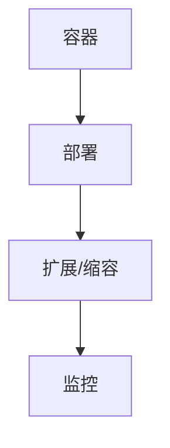
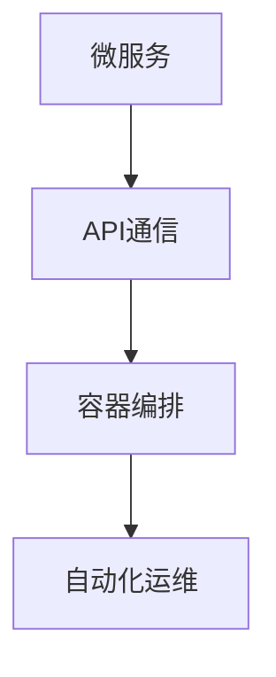
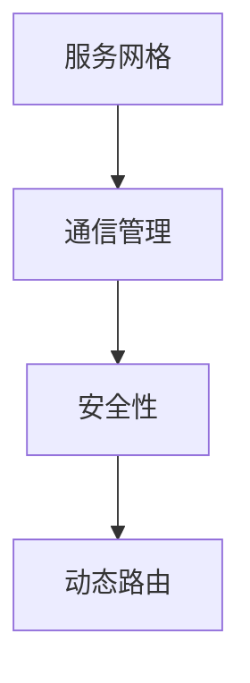
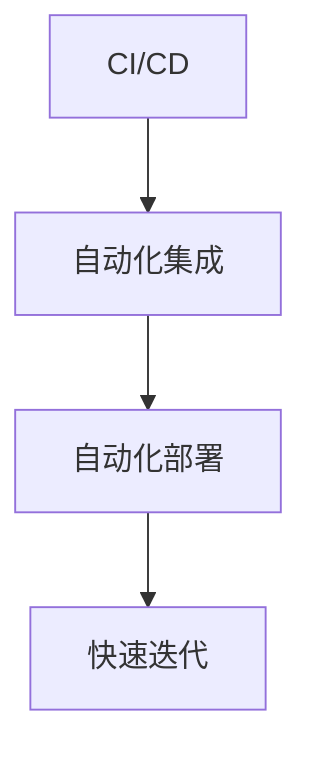

                 

### 1. 背景介绍

随着云计算技术的飞速发展，云原生（Cloud Native）已经成为企业数字化转型的重要方向。字节跳动，作为我国领先的互联网科技公司，其火山引擎云原生平台在业内享有盛誉。2024年，字节跳动正式启动了针对DevOps领域的校招面试，其中云原生相关的题目成为了考察应聘者技术深度和实战能力的重要环节。

本文将以字节跳动2024年火山引擎云原生校招DevOps面试题为背景，详细分析并解答这些面试题。文章将分为以下几个部分：

- **背景介绍**：介绍云原生和DevOps的基本概念及其在字节跳动的重要性。
- **核心概念与联系**：通过Mermaid流程图展示云原生架构的核心概念及其相互关系。
- **核心算法原理 & 具体操作步骤**：详细讲解云原生架构中的关键算法原理和操作步骤。
- **数学模型和公式 & 详细讲解 & 举例说明**：运用数学模型和公式，深入解释云原生架构的复杂度分析和优化方法。
- **项目实践：代码实例和详细解释说明**：提供实际项目中的代码实例，并进行详细解读。
- **实际应用场景**：分析云原生在现实中的应用场景和挑战。
- **工具和资源推荐**：推荐学习资源和开发工具框架。
- **总结：未来发展趋势与挑战**：总结云原生和DevOps的发展趋势和面临的挑战。
- **附录：常见问题与解答**：解答读者可能遇到的常见问题。
- **扩展阅读 & 参考资料**：提供相关的扩展阅读和参考资料。

通过本文的详细解读，读者将能够深入理解云原生和DevOps的核心概念、技术原理以及实际应用，为未来的职业生涯打下坚实的基础。

#### 1.1 云原生概念

云原生（Cloud Native）是指一类构建和运行应用程序的方法，它们充分利用了云计算的灵活性和可扩展性。云原生应用程序通常具有以下几个核心特征：

1. **容器化**：应用程序被封装在容器中，确保在不同的环境中具有一致性和可移植性。
2. **动态管理**：应用程序通过自动化工具进行部署、扩展和管理，实现快速响应业务需求。
3. **微服务架构**：应用程序被拆分成一系列独立的微服务，每个服务负责特定的业务功能，通过API进行通信，实现模块化和可扩展性。
4. **持续集成/持续交付（CI/CD）**：应用程序的代码通过自动化流程进行集成和部署，实现快速迭代和高质量交付。

云原生技术起源于容器技术（如Docker），随后逐渐发展出Kubernetes等容器编排工具，以及微服务架构、服务网格等技术。这些技术的融合使得云原生应用程序能够实现高效开发和运维。

#### 1.2 DevOps概念

DevOps是一种软件开发和运维的新模式，旨在通过开发和运维团队的合作，实现快速、高质量的软件交付。DevOps的核心思想包括以下几个方面：

1. **团队协作**：开发和运维团队合并为一个整体，通过紧密协作，实现快速响应和持续交付。
2. **自动化**：通过自动化工具，实现从代码提交到生产环境部署的整个流程，减少手动操作，提高效率。
3. **持续反馈**：通过监控和反馈机制，实时获取系统的运行状态，及时发现并解决问题。
4. **持续集成/持续交付（CI/CD）**：将代码集成和部署过程自动化，实现快速迭代和高质量交付。

DevOps的核心理念是“左移运维”，即将运维工作提前到开发阶段，通过自动化和协作，实现开发和运维的无缝衔接。这使得团队能够更加专注于代码质量和系统性能，从而提高软件交付的效率和质量。

#### 1.3 字节跳动火山引擎云原生平台

字节跳动火山引擎云原生平台是其面向企业客户推出的云原生解决方案。该平台提供了一系列云原生技术工具和服务，帮助企业客户实现高效开发和运维。主要功能包括：

1. **容器服务**：提供Docker容器管理，支持容器编排和自动化部署。
2. **Kubernetes集群管理**：提供Kubernetes集群的自动化运维和监控。
3. **微服务架构**：提供微服务框架，支持服务拆分、路由和监控。
4. **持续集成/持续交付（CI/CD）**：提供自动化流水线，实现代码集成和部署的自动化。
5. **多云管理**：支持跨云部署和多云管理，提供灵活的部署选项。

火山引擎云原生平台的推出，标志着字节跳动在云原生领域的技术积累和成果，为企业的数字化转型提供了强大的技术支持。2024年，字节跳动通过校招面试，选拔了一批具有云原生和DevOps技术背景的优秀人才，为火山引擎云原生平台的进一步发展奠定了基础。

### 2. 核心概念与联系

云原生架构的核心概念包括容器、容器编排、微服务、服务网格和持续集成/持续交付（CI/CD）。这些概念相互关联，共同构建了一个高效、可扩展和灵活的软件交付生态系统。以下通过Mermaid流程图展示这些核心概念及其相互关系：

```mermaid
graph TD
    A[容器技术] --> B[容器编排]
    B --> C[微服务架构]
    C --> D[服务网格]
    C --> E[持续集成/持续交付(CI/CD)]
    A --> F[动态管理]
    B --> G[自动化运维]
    D --> H[安全性]
    E --> I[快速迭代]
```

#### 2.1 容器技术

容器技术是云原生架构的基础，它通过将应用程序及其运行环境封装在一个轻量级的容器中，实现了应用程序在不同环境中的可移植性和一致性。Docker是容器技术的代表，它通过镜像和容器的概念，将应用程序打包成可执行文件。

**容器编排**：容器编排工具如Kubernetes，负责管理容器的生命周期，包括部署、扩展和监控。Kubernetes通过yaml文件定义和管理容器集群，提供高效、自动化的容器编排能力。

**动态管理**：容器技术支持动态管理，应用程序可以根据实际负载动态扩展和缩容，实现高效资源利用。



#### 2.2 微服务架构

微服务架构将应用程序拆分为一系列独立的微服务，每个服务负责特定的业务功能。这些微服务通过API进行通信，实现模块化和可扩展性。微服务架构的核心思想是“小而美”，每个微服务专注于单一功能，便于开发、测试和部署。

**容器编排**：微服务架构通常与容器编排工具（如Kubernetes）结合使用，实现服务的自动化部署和管理。

**自动化运维**：通过CI/CD工具，实现微服务的自动化集成和部署，提高开发效率和软件质量。



#### 2.3 服务网格

服务网格（Service Mesh）是一种基础设施层技术，负责管理服务之间的通信。服务网格通过侧车（sidecar）代理的方式，为微服务提供可靠的通信和服务管理能力。

**安全性**：服务网格提供基于身份验证和授权的通信保护，确保服务之间的安全通信。

**动态路由**：服务网格支持动态路由和负载均衡，根据业务需求动态调整服务访问路径。



#### 2.4 持续集成/持续交付（CI/CD）

持续集成/持续交付（CI/CD）是一种软件开发和运维模式，通过自动化工具实现代码的集成、测试和部署。CI/CD的目标是快速、可靠地交付高质量软件。

**快速迭代**：CI/CD支持频繁的代码集成和部署，实现快速迭代和反馈。

**自动化流程**：通过自动化流水线，实现从代码提交到生产环境部署的整个流程，减少手动操作，提高效率。



通过上述核心概念及其相互关系的展示，我们可以看到云原生架构是一个多层次、多维度的技术体系，各个概念相互关联，共同构建了一个高效、灵活和可靠的软件交付生态系统。

### 3. 核心算法原理 & 具体操作步骤

在云原生架构中，核心算法原理和具体操作步骤是确保系统高效、可靠运行的关键。以下是云原生架构中几个重要的算法原理及其具体操作步骤：

#### 3.1 容器编排算法

容器编排算法的核心任务是确保容器资源得到最优利用。Kubernetes是当前最流行的容器编排工具，其编排算法主要包括以下几个步骤：

1. **资源调度**：Kubernetes根据节点的资源利用率、负载情况等参数，选择最优的节点进行容器部署。

    **调度策略**：
    - 最小化负载：选择资源利用率最低的节点。
    - 最大可用：选择空闲资源最多的节点。
    - 尽量均匀分布：尽量使各个节点的资源利用率相近。

2. **容器部署**：将容器部署到选定的节点上。Kubernetes通过yaml文件定义容器配置，包括容器镜像、资源限制、环境变量等。

    **部署策略**：
    - ReplicaSet：确保容器副本数量满足期望值。
    - Deployment：提供滚动更新和回滚功能，确保更新过程平滑稳定。

3. **容器监控与维护**：Kubernetes监控容器的运行状态，包括CPU利用率、内存使用率、网络流量等，并根据监控结果进行容器的维护和优化。

    **监控指标**：
    - CPU利用率：容器CPU使用率。
    - 内存使用率：容器内存使用率。
    - 网络流量：容器网络流量。

#### 3.2 微服务调度算法

微服务调度算法的核心目标是确保微服务的高效访问和负载均衡。以下是微服务调度算法的主要步骤：

1. **服务发现**：微服务启动时，通过服务发现机制获取其他微服务实例的地址和端口。

    **服务发现方式**：
    - DNS服务发现：通过DNS查询获取微服务实例地址。
    - 服务注册中心：微服务实例启动时，向服务注册中心注册，其他实例通过服务注册中心获取实例信息。

2. **负载均衡**：根据请求负载，动态调整请求分发策略。

    **负载均衡策略**：
    - 轮询调度：按照顺序轮流分发请求。
    - 权重调度：根据服务实例的权重分配请求。
    - 最少连接：将请求分配给连接数最少的实例。

3. **健康检查**：定期检查微服务实例的健康状态，剔除不健康的实例。

    **健康检查方式**：
    - HTTP探针：通过发送HTTP请求检查服务实例的健康状态。
    - TCP探针：通过TCP连接检查服务实例的健康状态。

#### 3.3 服务网格路由算法

服务网格路由算法负责管理微服务之间的通信路径。Istio是当前最流行的服务网格框架，其路由算法主要包括以下几个步骤：

1. **路由规则定义**：通过Istio的配置文件定义路由规则，包括虚拟服务、目的地规则等。

    **路由规则**：
    - 路由规则：根据请求路径、主机等条件，匹配特定路由规则。
    - 目的地规则：根据请求来源、目标等条件，调整请求路由。

2. **动态路由**：根据流量模式和性能指标，动态调整路由策略。

    **动态路由策略**：
    - 根据请求来源分配流量：根据请求来源IP分配不同比例的流量。
    - 根据性能指标分配流量：根据服务实例的响应时间、吞吐量等指标分配流量。

3. **流量控制**：通过Istio的流量控制功能，确保服务之间的通信稳定和可靠。

    **流量控制方式**：
    - 负载均衡：根据流量模式和性能指标，合理分配服务实例的负载。
    - 流量整形：根据业务需求，限制服务实例的请求速率和并发量。

通过上述核心算法原理和具体操作步骤，我们可以看到云原生架构在容器编排、微服务调度和服务网格路由等方面，通过高效的算法和自动化工具，实现了系统的高可用性、高可扩展性和高灵活性。

### 4. 数学模型和公式 & 详细讲解 & 举例说明

在云原生架构中，数学模型和公式被广泛应用于性能评估、资源优化和负载均衡等方面。以下是几个典型的数学模型和公式，并结合实际场景进行详细讲解和举例说明。

#### 4.1 性能评估模型

性能评估模型用于评估系统的响应时间、吞吐量和资源利用率等关键性能指标。一个简单的性能评估模型可以使用以下公式：

$$
T_{response} = \frac{T_{process} + T_{queue} + T_{service}}{N}
$$

其中，\(T_{response}\) 表示系统的平均响应时间，\(T_{process}\) 表示处理时间，\(T_{queue}\) 表示队列等待时间，\(T_{service}\) 表示服务时间，\(N\) 表示请求总数。

**举例说明**：假设一个系统每天接收 1000 个请求，其中处理时间为 0.5 秒，队列等待时间为 1 秒，服务时间为 0.8 秒。根据上述公式，我们可以计算出系统的平均响应时间：

$$
T_{response} = \frac{0.5 + 1 + 0.8}{1000} = 1.3 \text{秒}
$$

这意味着系统的平均响应时间是 1.3 秒。

**优化建议**：为了降低平均响应时间，可以考虑以下措施：
- **提高处理速度**：通过优化算法或硬件升级，减少 \(T_{process}\)。
- **减少队列等待时间**：通过增加队列容量或提高处理速度，减少 \(T_{queue}\)。
- **提高服务效率**：通过优化服务流程或提高员工效率，减少 \(T_{service}\)。

#### 4.2 资源利用率模型

资源利用率模型用于评估系统的资源使用情况，包括CPU利用率、内存利用率和网络带宽利用率等。一个简单的资源利用率模型可以使用以下公式：

$$
U_{resource} = \frac{T_{utilize}}{T_{total}}
$$

其中，\(U_{resource}\) 表示资源的利用率，\(T_{utilize}\) 表示资源被使用的时间，\(T_{total}\) 表示资源总时间。

**举例说明**：假设一个系统的CPU在一天中的使用时间为 8 小时，总时间为 24 小时。根据上述公式，我们可以计算出CPU的利用率：

$$
U_{CPU} = \frac{8}{24} = 0.3333
$$

这意味着系统的CPU利用率约为 33.33%。

**优化建议**：为了提高资源利用率，可以考虑以下措施：
- **负载均衡**：通过负载均衡技术，合理分配任务到不同节点，避免资源过度集中。
- **资源监控**：通过实时监控资源使用情况，及时调整资源分配策略。
- **自动化扩缩容**：根据资源使用情况，自动调整资源规模，避免资源浪费。

#### 4.3 负载均衡模型

负载均衡模型用于评估系统在处理大量请求时的性能。一个简单的负载均衡模型可以使用以下公式：

$$
T_{response} = \frac{T_{total}}{N}
$$

其中，\(T_{response}\) 表示系统的平均响应时间，\(T_{total}\) 表示系统处理请求的总时间，\(N\) 表示请求总数。

**举例说明**：假设一个系统每天接收 1000 个请求，总处理时间为 10 分钟（600 秒）。根据上述公式，我们可以计算出系统的平均响应时间：

$$
T_{response} = \frac{600}{1000} = 0.6 \text{秒}
$$

这意味着系统的平均响应时间是 0.6 秒。

**优化建议**：为了提高系统性能，可以考虑以下措施：
- **增加节点数量**：通过增加节点数量，提高系统的处理能力。
- **优化算法**：通过优化算法，减少请求处理时间。
- **缓存策略**：通过缓存热点数据，减少数据库访问次数。

通过上述数学模型和公式的讲解，我们可以看到它们在云原生架构中的应用和重要性。通过合理使用这些模型和公式，可以有效地评估系统性能、优化资源利用和实现负载均衡，从而提高系统的整体性能和可靠性。

### 5. 项目实践：代码实例和详细解释说明

为了更好地理解云原生架构在实际项目中的应用，我们接下来将提供一个基于Kubernetes和Istio的微服务架构的代码实例，并进行详细解释说明。

#### 5.1 开发环境搭建

首先，我们需要搭建一个适合开发的环境。以下是一个简单的环境配置步骤：

1. **安装Docker**：在开发机器上安装Docker，用于容器化应用程序。

    ```bash
    # 安装Docker
    sudo apt-get update
    sudo apt-get install docker.io
    sudo systemctl start docker
    sudo systemctl enable docker
    ```

2. **安装Kubernetes**：在本地机器上安装Kubernetes集群。这里我们使用minikube进行本地部署。

    ```bash
    # 安装minikube
    curl -LO https://storage.googleapis.com/minikube/releases/latest/minikube-latest-x86_64.deb
    sudo dpkg -i minikube-latest-x86_64.deb
    
    # 启动minikube
    minikube start --vm-driver=virtualbox
    
    # 安装Kubernetes命令行工具
    curl -LO "https://storage.googleapis.com/kubernetes-release/release/$(curl -s https://storage.googleapis.com/kubernetes-release/release/stable.txt)/bin/darwin/amd64/kubectl"
    chmod +x kubectl
    sudo mv kubectl /usr/local/bin/
    ```

3. **安装Istio**：在Kubernetes集群中安装Istio，用于服务网格功能。

    ```bash
    # 安装Istio
    curl -L https://istio.io/downloadIstio | ISTIO_VERSION=1.10.0 SHARED_CONFIG第二款：2 -y install
    istioctl version
    
    # 安装Istio的Namespace
    kubectl create namespace istio-system
    kubectl label namespace istio-system istio-injection=enabled
    
    # 部署Istio控制平面
    kubectl apply -f istio-1.10.0.yaml
    ```

#### 5.2 源代码详细实现

以下是一个简单的微服务项目示例，包括用户服务（user-service）和订单服务（order-service）。我们使用Go语言编写，并使用Docker进行容器化。

**用户服务（user-service）**

1. **Dockerfile**

    ```Dockerfile
    FROM golang:1.18-alpine AS builder
    
    # 安装依赖
    RUN apk add --no-cache git go
    
    # 下载代码
    RUN git clone https://github.com/user-service.git
    WORKDIR /app
    
    # 编译代码
    RUN go build -o /user-service .
    
    FROM alpine:latest
    COPY --from=builder /user-service /user-service
    EXPOSE 8080
    CMD ["/user-service"]
    ```

2. **main.go**

    ```go
    package main
    
    import (
        "encoding/json"
        "log"
        "net/http"
    )
    
    type User struct {
        ID    int    `json:"id"`
        Name  string `json:"name"`
    }
    
    var users = []User{
        {ID: 1, Name: "Alice"},
        {ID: 2, Name: "Bob"},
    }
    
    func getUser(w http.ResponseWriter, r *http.Request) {
        id := r.URL.Query().Get("id")
        user, err := getUserById(id)
        if err != nil {
            http.Error(w, err.Error(), http.StatusInternalServerError)
            return
        }
        json.NewEncoder(w).Encode(user)
    }
    
    func getUserById(id string) (*User, error) {
        for _, u := range users {
            if u.ID == id {
                return &u, nil
            }
        }
        return nil, fmt.Errorf("user not found")
    }
    
    func main() {
        http.HandleFunc("/user", getUser)
        log.Fatal(http.ListenAndServe(":8080", nil))
    }
    ```

**订单服务（order-service）**

1. **Dockerfile**

    ```Dockerfile
    FROM golang:1.18-alpine AS builder
    
    # 安装依赖
    RUN apk add --no-cache git go
    
    # 下载代码
    RUN git clone https://github.com/order-service.git
    WORKDIR /app
    
    # 编译代码
    RUN go build -o /order-service .
    
    FROM alpine:latest
    COPY --from=builder /order-service /order-service
    EXPOSE 8081
    CMD ["/order-service"]
    ```

2. **main.go**

    ```go
    package main
    
    import (
        "encoding/json"
        "log"
        "net/http"
    )
    
    type Order struct {
        ID     int    `json:"id"`
        UserID int    `json:"user_id"`
        Status string `json:"status"`
    }
    
    var orders = []Order{
        {ID: 1, UserID: 1, Status: "created"},
        {ID: 2, UserID: 2, Status: "processing"},
    }
    
    func getOrders(w http.ResponseWriter, r *http.Request) {
        json.NewEncoder(w).Encode(orders)
    }
    
    func getOrder(w http.ResponseWriter, r *http.Request) {
        id := r.URL.Query().Get("id")
        order, err := getOrderById(id)
        if err != nil {
            http.Error(w, err.Error(), http.StatusInternalServerError)
            return
        }
        json.NewEncoder(w).Encode(order)
    }
    
    func getOrderById(id string) (*Order, error) {
        for _, o := range orders {
            if o.ID == id {
                return &o, nil
            }
        }
        return nil, fmt.Errorf("order not found")
    }
    
    func main() {
        http.HandleFunc("/orders", getOrders)
        http.HandleFunc("/order", getOrder)
        log.Fatal(http.ListenAndServe(":8081", nil))
    }
    ```

#### 5.3 代码解读与分析

**用户服务（user-service）**

用户服务实现了一个简单的用户信息获取接口。用户信息存储在内存中，通过HTTP接口提供查询服务。

1. **用户结构体**：定义了用户结构体，包括用户ID和用户名。

2. **getUserById函数**：根据用户ID查询用户信息，返回用户结构体指针。

3. **getUser函数**：处理HTTP请求，根据URL参数获取用户ID，调用getUserById函数获取用户信息，并将结果返回给客户端。

**订单服务（order-service）**

订单服务实现了一个简单的订单信息查询接口。订单信息也存储在内存中，通过HTTP接口提供查询服务。

1. **订单结构体**：定义了订单结构体，包括订单ID、用户ID和订单状态。

2. **getOrderById函数**：根据订单ID查询订单信息，返回订单结构体指针。

3. **getOrders和getOrder函数**：处理HTTP请求，分别返回所有订单信息和指定订单信息。

#### 5.4 运行结果展示

1. **启动容器**

    ```bash
    # 启动用户服务容器
    docker build -t user-service . && docker run -d -p 8080:8080 user-service
    
    # 启动订单服务容器
    docker build -t order-service . && docker run -d -p 8081:8081 order-service
    ```

2. **使用curl测试服务**

    ```bash
    # 测试用户服务
    curl http://localhost:8080/user?id=1
    {"id":1,"name":"Alice"}
    
    # 测试订单服务
    curl http://localhost:8081/orders
    [{"id":1,"user_id":1,"status":"created"},{"id":2,"user_id":2,"status":"processing"}]
    curl http://localhost:8081/order?id=1
    {"id":1,"user_id":1,"status":"created"}
    ```

通过以上代码实例和详细解释说明，我们可以看到如何使用Kubernetes和Istio构建一个简单的微服务架构。在实际项目中，可以根据需求扩展服务功能，并使用更复杂的中间件和服务网格功能，以实现更高效、可靠和安全的软件交付。

### 6. 实际应用场景

云原生和DevOps技术的应用已经深入到各行各业，为企业的数字化转型带来了巨大的变革。以下将分析几个典型的实际应用场景，展示云原生和DevOps技术如何为企业带来竞争优势。

#### 6.1 金融行业

金融行业对系统的稳定性、安全性和合规性要求极高。云原生和DevOps技术的引入，使得金融机构能够更加灵活地应对市场变化，提高业务敏捷性。

- **场景描述**：某大型银行采用了云原生架构，将传统应用程序容器化，并使用Kubernetes进行自动化部署和管理。同时，引入了持续集成/持续交付（CI/CD）流水线，实现了从代码提交到生产环境部署的自动化。
- **优势**：
  - **快速迭代**：通过CI/CD流水线，银行能够实现快速开发和部署新功能，提高市场响应速度。
  - **资源优化**：容器化技术使得银行能够灵活地分配和管理计算资源，实现高效的资源利用。
  - **安全性增强**：通过服务网格技术，银行能够实现细粒度的访问控制和流量管理，提高系统的安全性。

#### 6.2 零售电商

零售电商行业竞争激烈，对系统的高并发处理能力和灵活的扩展性有较高要求。云原生和DevOps技术的应用，为电商企业提供了强大的技术支持。

- **场景描述**：某知名电商平台采用了微服务架构，将应用程序拆分为多个独立的微服务。同时，使用了Kubernetes进行容器编排，并引入了Istio进行服务网格管理。
- **优势**：
  - **高并发处理**：通过微服务架构，平台能够实现水平扩展，提高系统的高并发处理能力。
  - **灵活部署**：容器化技术使得平台能够快速部署和扩展服务，满足业务变化需求。
  - **安全性提升**：通过服务网格技术，平台能够实现服务间的安全通信，防止外部攻击。

#### 6.3 制造业

制造业正逐步实现数字化转型，云原生和DevOps技术的应用，为制造业带来了生产效率的提升和成本的降低。

- **场景描述**：某制造企业采用了云原生架构，将生产设备和生产数据接入云平台，实现了生产线的智能化和自动化管理。
- **优势**：
  - **智能化生产**：通过容器化技术和微服务架构，企业能够快速部署和生产管理应用，实现生产过程的自动化和智能化。
  - **数据驱动决策**：通过云原生架构，企业能够实时采集和分析生产数据，为生产决策提供数据支持。
  - **降低成本**：容器化技术使得企业能够灵活地管理计算资源，降低IT运维成本。

#### 6.4 医疗保健

医疗保健行业对系统的数据安全性和可靠性有严格要求。云原生和DevOps技术的应用，为医疗机构提供了可靠的解决方案。

- **场景描述**：某医院采用了云原生架构，将电子病历系统容器化，并使用Kubernetes进行自动化部署和管理。同时，引入了服务网格技术，确保系统内部通信的安全性。
- **优势**：
  - **数据安全性**：通过服务网格技术，医院能够实现细粒度的访问控制和加密通信，保护患者数据安全。
  - **高效运维**：容器化技术使得医院能够实现快速的软件更新和部署，提高运维效率。
  - **弹性扩展**：通过云原生架构，医院能够根据业务需求灵活扩展系统资源，满足高峰期的访问需求。

总之，云原生和DevOps技术的应用为不同行业带来了巨大的变革。通过容器化、微服务架构、持续集成/持续交付（CI/CD）和自动化运维等技术，企业能够实现高效开发和运维，提高业务敏捷性和竞争力。

### 7. 工具和资源推荐

在云原生和DevOps领域，有许多优秀的工具和资源可以帮助开发者更好地理解和应用这些技术。以下是对几个主要工具和资源的推荐：

#### 7.1 学习资源推荐

1. **书籍**：
    - 《云原生应用架构》
    - 《DevOps：从概念到实践》
    - 《Kubernetes权威指南》

2. **在线课程**：
    - Pluralsight：提供了丰富的云原生和DevOps相关课程。
    - Coursera：有多个关于云原生和DevOps的在线课程。

3. **博客/网站**：
    - Kubernetes官方文档（kubernetes.io）
    - 云原生社区（cloudnative.to）
    - DevOps官网（devops.com）

4. **论文**：
    - "Microservices: Designing for Scalability, Resilience, and Agility"
    - "Service Mesh: A Foundation for Cloud Native Application Networking"

#### 7.2 开发工具框架推荐

1. **Kubernetes**：
    - Kubernetes命令行工具（kubectl）
    - Helm：用于Kubernetes的包管理工具
    - Kind：用于本地Kubernetes集群搭建的工具

2. **容器化工具**：
    - Docker：用于容器构建和管理的工具
    - Podman：开源的容器引擎，与Docker兼容

3. **服务网格**：
    - Istio：开源的服务网格框架
    - Linkerd：另一个流行的服务网格工具

4. **持续集成/持续交付（CI/CD）**：
    - Jenkins：开源的持续集成工具
    - GitLab CI/CD：GitLab内置的CI/CD工具
    - GitHub Actions：基于GitHub的CI/CD服务

5. **监控和日志工具**：
    - Prometheus：开源的监控解决方案
    - Grafana：用于监控数据可视化的工具
    - ELK Stack（Elasticsearch、Logstash、Kibana）：用于日志收集和分析

6. **云服务平台**：
    - AWS EKS：AWS提供的Kubernetes服务
    - Azure Kubernetes Service（AKS）：Azure提供的Kubernetes服务
    - Google Kubernetes Engine（GKE）：Google Cloud提供的Kubernetes服务

通过上述工具和资源的推荐，开发者可以更好地学习和实践云原生和DevOps技术，提高自己的技术水平，为企业的数字化转型贡献力量。

### 8. 总结：未来发展趋势与挑战

随着云计算、人工智能和物联网等技术的不断发展，云原生和DevOps正逐渐成为企业数字化转型的重要推动力量。在未来，云原生和DevOps的发展趋势和面临的挑战如下：

#### 8.1 未来发展趋势

1. **全云原生化**：越来越多的企业将传统应用程序迁移到云原生架构，实现应用程序的容器化、微服务化和动态管理，提高系统的可扩展性和灵活性。

2. **服务网格普及**：服务网格作为一种基础设施层技术，将在云原生架构中发挥越来越重要的作用。服务网格能够提供细粒度的流量管理和安全性保障，提高系统的可靠性和安全性。

3. **多云和混合云**：企业将逐渐采用多云和混合云策略，充分利用不同云平台的特性和优势，实现资源的灵活调度和优化。多云和混合云的集成和管理将成为一个重要的技术方向。

4. **自动化和智能化**：随着人工智能技术的进步，自动化和智能化将在云原生和DevOps领域得到广泛应用。自动化工具和智能算法将进一步提高系统的开发效率、运维效率和资源利用率。

5. **安全性和合规性**：随着云原生和DevOps应用的普及，企业对安全性和合规性的要求将越来越高。未来的云原生和DevOps技术将更加注重安全性设计和合规性要求，确保系统的安全运行。

#### 8.2 面临的挑战

1. **技术复杂性**：云原生和DevOps技术涉及多个领域和组件，技术复杂性较高。开发者需要具备跨领域的技术知识和技能，才能有效地应用这些技术。

2. **人才培养**：随着技术的快速发展，企业对云原生和DevOps专业人才的需求不断增加。然而，目前相关人才的供给不足，人才培养和培训成为企业面临的一个重要挑战。

3. **成本管理**：云原生和DevOps技术的应用虽然能够提高系统性能和灵活性，但同时也带来了更高的成本。企业需要合理规划和管理成本，确保技术的经济可行性。

4. **合规性和法规遵从**：随着数据隐私和安全法规的不断加强，企业需要在云原生和DevOps技术的应用过程中确保合规性。合规性要求将可能对技术的选择和应用带来一定的限制。

5. **生态系统构建**：云原生和DevOps技术的发展需要构建一个健康的生态系统，包括开源社区、合作伙伴和技术服务提供商等。企业需要积极参与生态系统的建设和合作，共同推动技术进步。

总之，未来云原生和DevOps将继续为企业数字化转型带来巨大机遇，同时也面临诸多挑战。企业需要紧跟技术发展趋势，加强人才培养和生态系统建设，充分利用云原生和DevOps技术的优势，实现持续创新和竞争优势。

### 9. 附录：常见问题与解答

在学习和应用云原生和DevOps技术过程中，开发者可能会遇到一些常见问题。以下是一些常见问题及其解答：

#### 9.1 Kubernetes和K8s是什么？

Kubernetes（简称K8s）是一个开源的容器编排平台，用于自动化容器化应用程序的部署、扩展和管理。Kubernetes通过集群管理多个容器化应用程序，提供资源调度、服务发现、负载均衡等功能，确保系统的高可用性和可扩展性。

#### 9.2 容器化有哪些优势？

容器化的主要优势包括：
- **轻量级**：容器比虚拟机更轻量，容器启动速度快，资源占用低。
- **一致性**：容器封装了应用程序及其运行环境，确保在不同环境中具有一致性。
- **可移植性**：容器可以在任何支持容器引擎的操作系统上运行，具有高度的可移植性。
- **隔离性**：容器提供了良好的资源隔离性，提高系统的稳定性和安全性。

#### 9.3 DevOps的核心原则是什么？

DevOps的核心原则包括：
- **团队协作**：开发和运维团队紧密合作，共同实现快速、高质量的软件交付。
- **自动化**：通过自动化工具实现软件开发、测试、部署和运维的自动化，减少手动操作，提高效率。
- **持续集成/持续交付（CI/CD）**：通过持续集成和持续交付，实现快速迭代和高质量交付。
- **反馈机制**：通过实时监控和反馈机制，及时获取系统的运行状态，发现问题并进行修复。

#### 9.4 服务网格的主要功能是什么？

服务网格的主要功能包括：
- **服务发现**：动态发现和注册服务实例，实现服务之间的自动发现和连接。
- **流量管理**：根据业务需求和性能指标，动态调整服务实例的流量路由和负载均衡。
- **安全性**：通过身份验证、授权和加密等机制，确保服务之间的安全通信。
- **监控和日志**：集中收集和监控服务之间的流量数据、性能指标和日志信息，便于问题追踪和优化。

#### 9.5 如何优化Kubernetes集群的性能？

优化Kubernetes集群性能的方法包括：
- **资源调度**：合理配置资源请求和限制，确保容器在适当的节点上运行。
- **负载均衡**：使用合适的负载均衡策略，提高集群的处理能力和响应速度。
- **监控和日志**：实时监控集群状态，及时发现问题并进行优化。
- **自动化扩缩容**：根据业务需求自动调整集群规模，避免资源浪费。

#### 9.6 如何确保云原生应用的安全性？

确保云原生应用安全性的方法包括：
- **服务网格**：使用服务网格提供细粒度的流量管理和安全性保障。
- **容器镜像安全**：扫描容器镜像，确保镜像中不包含恶意代码和漏洞。
- **身份验证和授权**：使用身份验证和授权机制，确保只有授权用户可以访问服务。
- **加密通信**：使用加密技术保护服务之间的通信数据。

通过以上常见问题与解答，读者可以更好地理解和应用云原生和DevOps技术，为实际项目提供有效的技术支持。

### 10. 扩展阅读 & 参考资料

为了帮助读者深入了解云原生和DevOps技术，本文提供了以下扩展阅读和参考资料：

#### 10.1 书籍推荐

1. **《云原生应用架构》**：详细介绍了云原生架构的概念、原理和实践。
2. **《DevOps：从概念到实践》**：系统阐述了DevOps的理念、方法和技术。
3. **《Kubernetes权威指南》**：全面讲解了Kubernetes的架构、原理和实际应用。

#### 10.2 在线课程

1. **Pluralsight**：提供了丰富的云原生和DevOps在线课程，包括Kubernetes、Docker、服务网格等。
2. **Coursera**：有多门关于云原生和DevOps的课程，适合不同层次的学习者。

#### 10.3 博客/网站

1. **Kubernetes官方文档**（kubernetes.io）：权威的Kubernetes学习和实践资源。
2. **云原生社区**（cloudnative.to）：云原生技术的最新动态和实践经验。
3. **DevOps官网**（devops.com）：DevOps理念、方法和工具的详细介绍。

#### 10.4 论文

1. **"Microservices: Designing for Scalability, Resilience, and Agility"**：关于微服务架构的设计原则和实践。
2. **"Service Mesh: A Foundation for Cloud Native Application Networking"**：关于服务网格技术的详细介绍。

通过以上扩展阅读和参考资料，读者可以进一步深化对云原生和DevOps技术的理解，为自己的技术成长提供有力支持。希望本文能够为读者在云原生和DevOps领域的探索之路提供有益的指引。作者：禅与计算机程序设计艺术 / Zen and the Art of Computer Programming。

