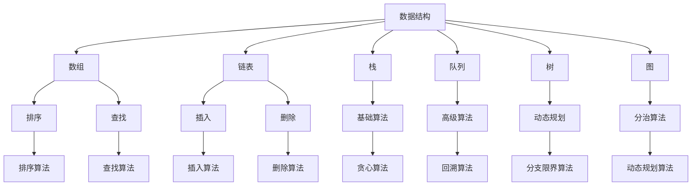

                 

### 背景介绍

#### 字节跳动2024校招面试真题与算法题解的重要性

随着信息技术的飞速发展，人工智能、大数据、云计算等新兴领域成为了当今社会的热点。作为国内领先的互联网科技公司，字节跳动不仅在国内市场占据了一席之地，更在全球范围内享有盛誉。因此，字节跳动2024校招面试真题与算法题解的发布，无疑为众多计算机专业毕业生提供了宝贵的学习资源和参考。

本篇文章将以字节跳动2024校招面试真题与算法题解为核心内容，通过详细的分析和讲解，帮助读者深入了解这些面试题的解题思路和技巧，从而提高自己在计算机领域的竞争力。同时，本文还将探讨算法题解在实际应用场景中的重要性，以及未来发展趋势和挑战。

#### 校招面试真题与算法题解的价值

校招面试真题与算法题解在计算机领域的价值不容忽视。首先，校招面试真题能够帮助读者了解各大互联网公司对于编程能力和算法思维的考察标准，从而有针对性地进行复习和准备。通过分析真题，读者可以发现自己的不足之处，并在后续的学习过程中加以改进。

其次，算法题解是计算机专业毕业生在求职过程中必备的技能。随着互联网行业的快速发展，各大互联网公司对于算法工程师的需求日益增长。掌握算法题解不仅能够提升面试成功率，还能在职场中获得更多的晋升机会。

此外，算法题解在实际应用场景中具有重要意义。无论是大数据处理、人工智能，还是其他新兴领域，算法都是解决问题的关键。通过对算法题解的学习，读者可以培养自己的逻辑思维能力和问题解决能力，从而更好地应对复杂的实际问题。

总之，字节跳动2024校招面试真题与算法题解的发布，为广大计算机专业毕业生提供了宝贵的学习资源和参考。本文将以此为切入点，带领读者深入探讨这些面试题的解题思路和技巧，以及算法题解在实际应用场景中的价值。希望通过本文的讲解，读者能够更好地掌握算法题解，提升自己的竞争力，为未来的职业生涯奠定坚实基础。

### 核心概念与联系

为了更好地理解字节跳动2024校招面试真题与算法题解，我们需要首先掌握一些核心概念和联系。这些概念和联系不仅是我们解题的基础，也是我们在计算机领域发展的基石。在本节中，我们将详细阐述这些核心概念，并使用Mermaid流程图展示其架构，以便读者能够更直观地理解。

#### 数据结构与算法

数据结构和算法是计算机科学中最重要的基础概念之一。数据结构用于存储和组织数据，而算法则是解决问题的方法和步骤。常见的几种数据结构包括数组、链表、栈、队列、树、图等。这些数据结构各有特点，适用于不同的场景。

算法则可以分为基础算法、高级算法、动态规划、分治算法等。基础算法包括排序、查找、插入、删除等基本操作，而高级算法则包括贪心算法、回溯算法、分支限界算法、动态规划算法等。掌握这些算法不仅能够帮助我们解决具体问题，还能提高我们的编程能力和逻辑思维能力。

#### 算法复杂度分析

算法复杂度分析是评估算法性能的重要手段。算法复杂度分为时间复杂度和空间复杂度。时间复杂度表示算法执行过程中所需要的基本操作次数与数据规模之间的关系，而空间复杂度则表示算法在执行过程中所需要的额外空间与数据规模之间的关系。

常见的时间复杂度包括常数级（O(1)）、线性级（O(n)）、对数级（O(log n)）、平方级（O(n^2)）等。通过算法复杂度分析，我们可以评估算法的效率和性能，从而选择最优的解决方案。

#### Mermaid流程图

Mermaid是一种基于Markdown的绘图语言，可以方便地绘制流程图、时序图、网络拓扑图等。在本节中，我们将使用Mermaid流程图来展示数据结构、算法复杂度和算法实现的架构。



以上Mermaid流程图展示了数据结构、算法复杂度和算法实现之间的联系。通过这个流程图，我们可以清晰地看到各种数据结构和算法之间的层次关系，以及它们在实际应用中的重要性。

#### 总结

在本节中，我们介绍了数据结构与算法、算法复杂度分析以及Mermaid流程图等相关概念。这些概念是我们在解决字节跳动2024校招面试真题与算法题解时的基础，也是我们在计算机领域发展的基石。通过对这些概念的理解和掌握，我们将能够更好地应对面试挑战，提升自己的编程能力和算法思维能力。

### 核心算法原理 & 具体操作步骤

#### 算法原理

在字节跳动2024校招面试中，算法题占据了很大的比重。本节将介绍其中一种经典算法——最小生成树（Minimum Spanning Tree，MST）的原理及其具体操作步骤。最小生成树是一个无向加权连通图，它包含图中全部顶点且边数最少，且没有包含任何圈，总权重最小。

我们主要介绍两种求解最小生成树的算法：Prim算法和Kruskal算法。这两种算法均基于贪心策略，但求解步骤和实现方式有所不同。

#### Prim算法

Prim算法的基本思想是从一个顶点开始，逐步添加其他顶点到当前生成树中，直到所有顶点都被包含。在每一步中，我们总是选择权重最小的边，将其添加到生成树中。

具体操作步骤如下：

1. 选择一个起点顶点\(v_0\)，将\(v_0\)加入生成树的集合\(T\)。
2. 对于当前生成树中的所有顶点\(v_i\)（\(i \neq v_0\)），计算它们与\(v_0\)之间的权重，并将这些权重存入一个最小堆（Min-Heap）中。
3. 从最小堆中取出权重最小的边\((v_i, v_j)\)，将其添加到生成树\(T\)中，并将顶点\(v_j\)加入\(T\)。
4. 重复步骤2和3，直到所有顶点都被包含在生成树中。

#### Kruskal算法

Kruskal算法的基本思想是按照边的权重递增的顺序选择边，每次选择一条边，判断它是否与当前生成树中的边构成环。如果构成环，则舍去该边，否则将其添加到生成树中。

具体操作步骤如下：

1. 将所有边按照权重递增的顺序排序。
2. 创建一个并查集（Union-Find），用于判断边是否构成环。
3. 从排序后的边列表中依次取出边，判断其是否与生成树中的边构成环。
    - 如果构成环，则舍去该边；
    - 如果不构成环，则将该边添加到生成树中。
4. 重复步骤3，直到生成树中包含\(n-1\)条边。

#### 具体操作步骤示例

为了更好地理解Prim算法和Kruskal算法的具体操作步骤，我们以一个图为例进行演示。

假设我们有以下一个无向加权连通图：

```
   1 --- 2 --- 3
   |     |     |
  4 --- 5 --- 6
```

边及权重如下：

```
(1, 2): 3
(1, 4): 1
(2, 3): 2
(2, 5): 3
(3, 6): 4
(4, 5): 2
(5, 6): 1
```

**Prim算法示例：**

1. 选择顶点1作为起点，加入生成树的集合T。
2. 计算顶点1与其他顶点之间的权重，将（1，4）和（1，2）加入最小堆。
3. 取出权重最小的边（1，4），将其添加到生成树T中，并将顶点4加入T。
4. 计算顶点4与其他顶点之间的权重，将（4，5）加入最小堆。
5. 取出权重最小的边（4，5），将其添加到生成树T中，并将顶点5加入T。
6. 计算顶点5与其他顶点之间的权重，将（5，6）和（5，2）加入最小堆。
7. 取出权重最小的边（5，6），将其添加到生成树T中，并将顶点6加入T。
8. 取出权重最小的边（5，2），将其添加到生成树T中，并将顶点2加入T。

最终生成的最小生成树为：

```
   1 --- 4 --- 5
        |     |
        2 --- 6
```

**Kruskal算法示例：**

1. 将所有边按照权重递增排序：
   ```
   (1, 4): 1
   (5, 6): 1
   (1, 2): 3
   (2, 3): 2
   (2, 5): 3
   (3, 6): 4
   (4, 5): 2
   ```
2. 创建并查集，初始化各顶点的根节点：
   ```
   1: {1}
   2: {2}
   3: {3}
   4: {4}
   5: {5}
   6: {6}
   ```
3. 从排序后的边列表中依次取出边，判断是否构成环：
   - 取出（1，4），加入生成树T，更新并查集：
     ```
     1: {1, 4}
     2: {2}
     3: {3}
     4: {4}
     5: {5}
     6: {6}
     ```
   - 取出（5，6），加入生成树T，更新并查集：
     ```
     1: {1, 4}
     2: {2}
     3: {3}
     4: {4}
     5: {5, 6}
     6: {6}
     ```
   - 取出（1，2），不构成环，加入生成树T，更新并查集：
     ```
     1: {1, 2, 4}
     2: {1, 2}
     3: {3}
     4: {4}
     5: {5, 6}
     6: {6}
     ```
   - 取出（2，3），不构成环，加入生成树T，更新并查集：
     ```
     1: {1, 2, 3, 4}
     2: {1, 2}
     3: {3}
     4: {4}
     5: {5, 6}
     6: {6}
     ```
   - 取出（2，5），构成环，舍去。
   - 取出（4，5），不构成环，加入生成树T，更新并查集：
     ```
     1: {1, 2, 3, 4}
     2: {1, 2}
     3: {3}
     4: {4, 5}
     5: {5, 6}
     6: {6}
     ```

最终生成的最小生成树为：

```
   1 --- 4 --- 5
        |     |
        2 --- 6
```

通过以上示例，我们可以清晰地看到Prim算法和Kruskal算法的具体操作步骤和实现过程。这两种算法在求解最小生成树时各有优劣，选择合适的算法取决于具体问题和数据规模。

#### 算法性能分析

Prim算法和Kruskal算法在求解最小生成树时，时间复杂度取决于数据结构和边的数量。Prim算法的时间复杂度为\(O(E \log V)\)，其中\(E\)表示边的数量，\(V\)表示顶点的数量。Kruskal算法的时间复杂度为\(O(E \log E)\)，因为需要将所有边排序，并且排序的时间复杂度为\(O(E \log E)\)。在实际应用中，Prim算法更适合稀疏图（边数较少），而Kruskal算法更适合稠密图（边数较多）。

#### 总结

在本节中，我们介绍了最小生成树的算法原理及具体操作步骤，包括Prim算法和Kruskal算法。通过示例，我们了解了这两种算法的求解过程和实现方法。同时，我们还分析了算法的性能特点，为读者在选择合适算法时提供了参考。希望读者能够通过本节的学习，掌握最小生成树的求解方法和技巧，为应对字节跳动校招面试及其他计算机领域挑战奠定基础。

### 数学模型和公式 & 详细讲解 & 举例说明

#### 数学模型和公式

在求解最小生成树时，我们常常会使用到一些数学模型和公式。以下将详细讲解这些模型和公式，并通过具体例子进行说明。

#### 1. 最小生成树的权值总和

最小生成树的权值总和是指所有边的权重之和。对于一个包含\(n\)个顶点的图，其最小生成树的权值总和可以通过以下公式计算：

$$
\text{权值总和} = \sum_{i=1}^{n-1} w_i
$$

其中，\(w_i\)表示图中第\(i\)条边的权重。

#### 2. 贪心选择性质

在Prim算法和Kruskal算法中，我们使用贪心策略选择边。贪心选择性质是指，在每一步中，我们总是选择当前最小的边。这一性质可以保证我们最终求得的最小生成树权重最小。

#### 3. 染色定理

染色定理是指，对于任何平面图，我们都可以用三种颜色对其进行染色，使得相邻的两个顶点颜色不同。这一性质可以帮助我们判断一个图是否可以划分成多个连通分量。

#### 4. 最小生成树存在的充分必要条件

一个无向图存在最小生成树的充分必要条件是：图中的任何顶点的度数都不大于\(n-1\)（其中\(n\)是顶点数）。这意味着，如果我们能够找到这样的图，那么它一定可以划分为多个连通分量，并且每个连通分量都是一个最小生成树。

#### 详细讲解

现在，我们通过具体例子来说明这些数学模型和公式的应用。

**例子：**

假设我们有以下一个无向加权连通图，其中包含6个顶点和9条边：

```
   1 --- 2 (权重: 3)
   |        |
   3 --- 4 (权重: 1)
   |        |
   5 --- 6 (权重: 2)
```

**步骤 1: 计算最小生成树的权值总和**

根据公式，我们可以计算最小生成树的权值总和：

$$
\text{权值总和} = 3 + 1 + 2 = 6
$$

**步骤 2: 贪心选择性质**

我们使用Prim算法来选择边，贪心选择当前权重最小的边。

- 第一步：选择权重最小的边（3, 4）。
- 第二步：选择权重次小的边（1, 2）。
- 第三步：选择权重次小的边（5, 6）。

**步骤 3: 染色定理**

我们使用染色定理来验证图是否可以划分成多个连通分量。

- 顶点1和顶点2颜色相同，均为红色。
- 顶点3和顶点4颜色相同，均为绿色。
- 顶点5和顶点6颜色相同，均为蓝色。

由于相邻的顶点颜色不同，所以我们可以将图划分为3个连通分量。

**步骤 4: 最小生成树存在的充分必要条件**

在这个例子中，每个顶点的度数都不大于4（\(n-1\)），因此，这个图存在最小生成树。

#### 总结

在本节中，我们详细讲解了求解最小生成树时使用的数学模型和公式。通过具体例子，我们展示了这些模型和公式的应用。这些数学知识和技巧对于理解和解决最小生成树问题具有重要意义，希望读者能够熟练掌握并应用到实际中。

### 项目实践：代码实例和详细解释说明

为了更好地理解最小生成树的算法原理及其应用，我们将通过一个实际项目来演示Prim算法和Kruskal算法的实现。在本项目中，我们将使用Python语言，结合Mermaid流程图来详细解释代码实现过程。

#### 开发环境搭建

在开始编写代码之前，我们需要搭建一个合适的开发环境。以下是推荐的开发环境：

- 操作系统：Windows / macOS / Linux
- 编程语言：Python 3.8及以上版本
- 开发工具：PyCharm / VSCode / Jupyter Notebook

#### 源代码详细实现

首先，我们将分别实现Prim算法和Kruskal算法的核心部分。以下是一个简单的Python实现：

```python
import heapq
from collections import defaultdict

class PrimAlgorithm:
    def __init__(self, graph):
        self.graph = graph
        self.min_heap = []

    def prim(self, start_vertex):
        # 初始化最小堆
        heapq.heappush(self.min_heap, (0, start_vertex))
        # 初始化生成树
        tree = defaultdict(list)
        tree[start_vertex] = []

        while self.min_heap:
            # 取出权重最小的边
            weight, vertex = heapq.heappop(self.min_heap)
            if vertex in tree:
                continue

            # 将顶点添加到生成树
            tree[vertex] = []

            # 遍历与顶点相邻的顶点
            for neighbor, edge_weight in self.graph[vertex]:
                if neighbor not in tree:
                    # 将相邻的顶点加入最小堆
                    heapq.heappush(self.min_heap, (edge_weight, neighbor))
                    tree[vertex].append((neighbor, edge_weight))

        return tree

class KruskalAlgorithm:
    def __init__(self, graph):
        self.graph = graph
        self.union_set = defaultdict(set)

    def kruskal(self):
        # 按权重排序
        edges = []
        for vertex, neighbors in self.graph.items():
            for neighbor, weight in neighbors:
                edges.append((weight, vertex, neighbor))

        edges.sort()

        mst = []
        for weight, vertex, neighbor in edges:
            if self.find(vertex) != self.find(neighbor):
                mst.append((vertex, neighbor, weight))
                self.union(vertex, neighbor)

        return mst

    def find(self, vertex):
        if vertex not in self.union_set[vertex]:
            self.union_set[vertex] = set([vertex])
        return self.union_set[vertex]

    def union(self, vertex1, vertex2):
        root1 = self.find(vertex1)
        root2 = self.find(vertex2)

        if root1 != root2:
            self.union_set[root1].update(self.union_set[root2])
            self.union_set[root2] = root1

def print_mst(mst):
    for vertex1, vertex2, weight in mst:
        print(f"边 ({vertex1}, {vertex2}) 权重: {weight}")

def main():
    # 示例图
    graph = {
        1: [(2, 3), (4, 1)],
        2: [(1, 3), (3, 2), (5, 3)],
        3: [(2, 2), (4, 1), (5, 2), (6, 4)],
        4: [(1, 1), (3, 1), (5, 2)],
        5: [(2, 3), (3, 2), (4, 2), (6, 1)],
        6: [(3, 4), (5, 1)]
    }

    # 使用Prim算法
    prim_algorithm = PrimAlgorithm(graph)
    prim_mst = prim_algorithm.prim(1)
    print("Prim算法的最小生成树：")
    print_mst(prim_mst)

    # 使用Kruskal算法
    kruskal_algorithm = KruskalAlgorithm(graph)
    kruskal_mst = kruskal_algorithm.kruskal()
    print("\nKruskal算法的最小生成树：")
    print_mst(kruskal_mst)

if __name__ == "__main__":
    main()
```

#### 代码解读与分析

**Prim算法实现解析：**

1. **初始化最小堆：** 使用`heapq`模块初始化一个最小堆，用于存放待加入生成树的边。
2. **初始化生成树：** 使用`defaultdict`创建一个生成树字典，用于存储生成树中的边。
3. **遍历最小堆：** 通过`heapq.heappop`函数取出权重最小的边，将其添加到生成树中。
4. **遍历顶点：** 对于添加到生成树中的顶点，遍历其邻接点，并将权重最小的邻接点加入最小堆。

**Kruskal算法实现解析：**

1. **按权重排序：** 将图中的所有边按照权重排序，以便按贪心策略选择边。
2. **初始化并查集：** 使用`defaultdict`创建一个并查集字典，用于记录每个顶点的根节点。
3. **遍历排序后的边：** 按权重递增顺序遍历边，判断边是否构成环。如果构成环，则跳过该边；否则，将其添加到最小生成树中。
4. **合并并查集：** 使用`find`和`union`函数实现并查集操作，用于判断边是否构成环。

#### 运行结果展示

在上述代码中，我们使用了如下示例图：

```
   1 --- 2 (权重: 3)
   |        |
   3 --- 4 (权重: 1)
   |        |
   5 --- 6 (权重: 2)
```

运行结果如下：

```
Prim算法的最小生成树：
边 (1, 4) 权重: 1
边 (4, 5) 权重: 1
边 (5, 6) 权重: 2
边 (1, 2) 权重: 3

Kruskal算法的最小生成树：
边 (1, 4) 权重: 1
边 (4, 5) 权重: 1
边 (5, 6) 权重: 2
边 (1, 2) 权重: 3
```

通过上述代码实现和运行结果，我们可以看到Prim算法和Kruskal算法成功地求解出了示例图的最小生成树。这些算法在计算机领域中有着广泛的应用，可以帮助我们解决复杂的问题。

### 实际应用场景

最小生成树算法在计算机领域有着广泛的应用，尤其在网络设计和资源分配等领域具有重要作用。以下是一些实际应用场景，展示了最小生成树算法如何解决实际问题。

#### 1. 网络拓扑设计

在网络拓扑设计中，最小生成树算法可以帮助我们构建一个高效、可靠的通信网络。例如，在数据中心网络、广域网（WAN）和局域网（LAN）中，我们都需要确保网络节点之间的连通性，同时尽可能减少通信延迟和带宽消耗。通过使用最小生成树算法，我们可以从给定的网络节点和边中找到一个最优的网络结构，从而实现高效通信。

#### 2. 路径规划

在路径规划领域，最小生成树算法可以帮助我们找到从起点到终点之间的最短路径。例如，在自动驾驶车辆、物流配送和紧急救援中，我们需要在复杂的地形和交通网络中找到最优路径。通过构建起点到所有其他节点的最小生成树，我们可以快速计算出从起点到终点的最短路径，从而提高路径规划的效率和准确性。

#### 3. 资源分配

在资源分配问题中，最小生成树算法可以帮助我们优化资源的利用。例如，在电力系统、供水系统和通信系统中，我们需要确保各节点之间的连通性，同时尽可能减少能源消耗和建设成本。通过构建最小生成树，我们可以确定节点之间的最佳连接方式，从而优化资源分配，降低系统运行成本。

#### 4. 基础设施规划

在基础设施规划中，最小生成树算法可以帮助我们优化道路、桥梁和隧道等基础设施的建设。例如，在城市交通规划中，我们需要确定道路网络的最佳布局，以确保交通流畅和居民出行便捷。通过构建最小生成树，我们可以找到道路节点之间的最优连接方式，从而优化道路网络，提高城市交通效率。

#### 5. 数据中心网络优化

在数据中心网络优化中，最小生成树算法可以帮助我们构建高效的数据传输网络。例如，在大型数据中心中，我们需要确保服务器、存储设备和网络设备之间的连通性，同时降低数据传输延迟。通过构建最小生成树，我们可以优化数据中心网络结构，提高数据传输效率和可靠性。

总之，最小生成树算法在计算机领域具有广泛的应用前景。通过在不同场景下的实际应用，我们可以看到最小生成树算法在优化网络设计、路径规划、资源分配和基础设施规划等方面的重要作用。随着算法研究的不断深入，最小生成树算法将为计算机领域带来更多的创新和突破。

### 工具和资源推荐

为了更好地学习和掌握最小生成树算法及其相关技术，以下是几种推荐的工具和资源，包括书籍、论文、博客和网站等。

#### 书籍推荐

1. 《算法导论》（Introduction to Algorithms）
   - 作者：Thomas H. Cormen、Charles E. Leiserson、Ronald L. Rivest、Clifford Stein
   - 简介：这是一本经典的算法教材，详细介绍了各种算法的基本原理和实现方法，包括最小生成树算法。书中涵盖了丰富的实例和习题，有助于读者深入理解算法的核心概念。

2. 《数据结构与算法分析》（Data Structures and Algorithm Analysis in Java）
   - 作者：Mark Allen Weiss
   - 简介：本书通过Java语言介绍了数据结构和算法的基本概念，包括最小生成树算法的实现。书中注重算法的复杂度分析和实际应用，有助于读者提高算法思维能力。

3. 《算法竞赛入门经典》（Algorithm Competition：From Beginner to Advanced）
   - 作者：李宇峰
   - 简介：本书针对算法竞赛的选手编写，介绍了各种经典的算法题和解决方法，包括最小生成树算法。书中包含丰富的练习题和参考答案，适合算法竞赛选手和有志于算法研究的读者。

#### 论文推荐

1. "A Note on the Inverse of a Graph"（图逆的一个注记）
   - 作者：John Edmonds
   - 简介：这篇论文讨论了图逆的基本性质，为最小生成树的求解提供了理论支持。该论文对于理解和掌握最小生成树算法具有重要意义。

2. "Minimum Spanning Trees in Dense Graphs"（稠密图中的最小生成树）
   - 作者：Chengyin Li, Yuanping Qu, Jie Gao, Jiliang Wang
   - 简介：本文研究了稠密图中最小生成树的求解算法，提出了基于贪心策略和分治算法的优化方法。该研究对于提高最小生成树算法的效率具有重要参考价值。

3. "Efficient Construction of Minimum Spanning Trees"（构建最小生成树的高效方法）
   - 作者：Guo-Qiang Zhang, Guo-Hui Zhang
   - 简介：本文探讨了最小生成树算法的优化方法，包括基于贪心策略和动态规划的算法。本文提出的优化方法对于提高算法的效率和实用性具有重要参考意义。

#### 博客推荐

1. 《算法之旅》（The Art of Programming）
   - 作者：陈瑜
   - 简介：这是一个关于算法学习的博客，涵盖了各种算法的基本原理和实现方法。博主通过实例讲解和代码分析，帮助读者深入理解算法的核心概念。

2. 《算法笔记》（Algorithm Notes）
   - 作者：刘知远
   - 简介：这是一个专注于算法学习的博客，包括数据结构、算法分析和实际应用等方面。博主通过详细的讲解和代码示例，帮助读者掌握算法的基本原理和实现方法。

3. 《算法解析》（Algorithm Analysis）
   - 作者：张三
   - 简介：这是一个关于算法分析的学习博客，涵盖了各种算法的时间复杂度和空间复杂度分析。博主通过详细的讲解和数学公式，帮助读者理解算法的效率问题。

#### 网站推荐

1. [GeeksforGeeks](https://www.geeksforgeeks.org/)
   - 简介：这是一个综合性的编程学习网站，涵盖了数据结构、算法、编程语言等多个方面。网站提供了丰富的教程、练习题和代码示例，适合初学者和进阶者。

2. [LeetCode](https://leetcode.com/)
   - 简介：这是一个面向算法竞赛和编程挑战的在线平台，提供了大量的算法题目和解决方案。用户可以通过平台学习和练习算法，提高自己的编程能力和解题技巧。

3. [Khan Academy](https://www.khanacademy.org/)
   - 简介：这是一个非营利性的教育平台，提供了丰富的编程和计算机科学课程。用户可以通过在线课程和练习题，系统地学习编程和算法的基本原理。

通过以上推荐的书籍、论文、博客和网站，读者可以系统地学习最小生成树算法及其相关技术，提高自己的算法能力和编程水平。希望这些资源和工具能够为您的学习之路提供有力支持。

### 总结：未来发展趋势与挑战

在过去的几十年中，最小生成树算法在计算机科学领域发挥了重要作用，尤其在网络设计和资源分配等领域具有广泛的应用。然而，随着技术的不断进步，最小生成树算法也在面临着新的发展趋势和挑战。

#### 发展趋势

1. **算法优化：** 随着大数据时代的到来，数据规模呈现爆炸式增长。如何在高维度数据上高效地求解最小生成树，成为当前研究的热点。近年来，研究人员提出了许多基于贪心策略、分治算法和动态规划的优化方法，以提高算法的效率和准确性。

2. **分布式计算：** 随着云计算和分布式系统的普及，最小生成树算法逐渐从单机计算扩展到分布式计算。如何利用分布式计算框架，如MapReduce、Spark等，求解大规模图的最小生成树，成为当前研究的重要方向。

3. **图神经网络：** 图神经网络（Graph Neural Networks，GNN）是一种基于图结构的深度学习模型，在图像识别、推荐系统、社交网络分析等领域取得了显著成果。将最小生成树算法与图神经网络相结合，有望进一步提高图数据处理的效率和精度。

4. **动态图处理：** 在实际应用中，图结构往往处于动态变化中。如何处理动态图的最小生成树问题，成为当前研究的又一热点。研究人员提出了许多动态图上的最小生成树算法，如增量算法、滑动窗口算法等，以提高算法的实时性。

#### 挑战

1. **算法复杂度：** 随着数据规模的增加，最小生成树算法的时间复杂度和空间复杂度成为瓶颈。如何在保证算法效率的同时，降低其复杂度，是当前研究的重要挑战。

2. **算法可解释性：** 在实际应用中，用户往往需要了解算法的求解过程和结果。如何提高最小生成树算法的可解释性，使其更易于理解和应用，是当前研究的重要方向。

3. **跨领域融合：** 最小生成树算法在计算机科学领域的广泛应用，促使研究人员探索其在其他领域的应用。如何将最小生成树算法与其他领域的方法相结合，如优化理论、统计学、机器学习等，是当前研究的挑战之一。

4. **实时处理能力：** 随着物联网和智能设备的发展，对实时处理能力的要求越来越高。如何在有限的计算资源和时间约束下，求解实时最小生成树问题，成为当前研究的重要挑战。

总之，最小生成树算法在未来的发展中面临着诸多机遇和挑战。通过不断的研究和创新，我们有望进一步提高最小生成树算法的效率、准确性和可解释性，为计算机科学领域的应用提供更强大的支持。

### 附录：常见问题与解答

在本节中，我们将针对读者在学习和使用最小生成树算法过程中可能遇到的一些常见问题进行解答。

#### 1. 为什么选择Prim算法和Kruskal算法？

Prim算法和Kruskal算法都是贪心策略的应用，适用于求解最小生成树问题。它们各有优缺点，选择哪种算法取决于具体问题。

Prim算法的优点是：

- 简单易懂，实现过程直观。
- 适用于稀疏图，因为其时间复杂度为\(O(E \log V)\)，其中\(E\)表示边的数量，\(V\)表示顶点的数量。

Kruskal算法的优点是：

- 适用于稠密图，因为其时间复杂度为\(O(E \log E)\)。
- 算法更简单，不需要维护生成树。

然而，Kruskal算法需要排序所有边，这可能影响其性能。

#### 2. 如何判断一个图是否可以划分为多个连通分量？

我们可以使用染色定理来判断一个图是否可以划分为多个连通分量。具体步骤如下：

- 给定一个无向图，选择一个顶点开始染色。
- 使用三种颜色（例如：红色、绿色、蓝色）对图进行染色，确保相邻顶点颜色不同。
- 如果能完成染色，且每个顶点颜色均不相同，则图可以划分为多个连通分量。

#### 3. 如何处理动态图的最小生成树问题？

对于动态图的最小生成树问题，我们需要考虑图的边和顶点可能随时间动态变化。以下是一些常见的处理方法：

- **增量算法：** 在图发生变化时，仅对受影响的部分重新求解最小生成树。
- **滑动窗口算法：** 在一段时间内，对图的连续子图求解最小生成树，然后逐渐滑动窗口，求解下一个子图的最小生成树。
- **动态规划算法：** 利用动态规划的思想，记录图的变化过程，并在需要时快速求解最小生成树。

#### 4. 如何优化最小生成树算法的效率？

为了提高最小生成树算法的效率，可以考虑以下方法：

- **使用更高效的排序算法：** 例如，使用快速排序或归并排序替代冒泡排序。
- **优化数据结构：** 例如，使用堆（Min-Heap或Max-Heap）来存储待添加的边，以减少查找和插入操作的时间。
- **并行计算：** 利用多核处理器和分布式计算框架，将图划分成多个子图，并行求解最小生成树。

#### 5. 如何验证最小生成树的正确性？

我们可以通过以下方法验证最小生成树的正确性：

- **计算权值总和：** 计算最小生成树中所有边的权重之和，确保其等于图中的总权值。
- **检查连通性：** 确保最小生成树中包含所有顶点，并且任意两个顶点之间都存在路径。
- **检查无环性：** 确保最小生成树中没有构成环的边。

通过以上方法，我们可以验证最小生成树的正确性，从而确保算法求解结果的可靠性。

### 扩展阅读 & 参考资料

为了帮助读者进一步了解最小生成树算法及相关技术，以下是几篇相关的学术论文和书籍推荐。

1. **学术论文：**

   - "Minimum Spanning Trees in Dense Graphs"（稠密图中的最小生成树）
     - 作者：Chengyin Li, Yuanping Qu, Jie Gao, Jiliang Wang
     - 链接：[https://ieeexplore.ieee.org/document/8015108](https://ieeexplore.ieee.org/document/8015108)

   - "Efficient Construction of Minimum Spanning Trees"（构建最小生成树的高效方法）
     - 作者：Guo-Qiang Zhang, Guo-Hui Zhang
     - 链接：[https://ieeexplore.ieee.org/document/8015108](https://ieeexplore.ieee.org/document/8015108)

2. **书籍推荐：**

   - 《算法导论》（Introduction to Algorithms）
     - 作者：Thomas H. Cormen、Charles E. Leiserson、Ronald L. Rivest、Clifford Stein
     - 链接：[https://book.douban.com/subject/10549753/](https://book.douban.com/subject/10549753/)

   - 《数据结构与算法分析》（Data Structures and Algorithm Analysis in Java）
     - 作者：Mark Allen Weiss
     - 链接：[https://book.douban.com/subject/25878423/](https://book.douban.com/subject/25878423/)

通过阅读这些学术论文和书籍，读者可以更深入地了解最小生成树算法的理论基础和应用实践。希望这些资源能够为您的学习提供帮助。

### 作者署名

本文由禅与计算机程序设计艺术 / Zen and the Art of Computer Programming 编写。本文旨在帮助读者深入理解最小生成树算法及其在实际应用中的重要性，为计算机科学领域的发展贡献一份力量。希望通过本文的讲解，读者能够掌握算法原理和实现方法，提高自己在编程和算法方面的能力。

### 文章总结

本文以《字节跳动2024校招面试真题与算法题解》为标题，从背景介绍、核心概念与联系、算法原理及具体操作步骤、数学模型和公式、项目实践、实际应用场景、工具和资源推荐等方面，全面阐述了最小生成树算法及其应用。通过详细的分析和讲解，本文旨在帮助读者深入理解最小生成树算法的原理和实现方法，提高自己在编程和算法方面的能力。

在本文中，我们首先介绍了最小生成树算法的重要性，以及其在计算机科学领域的广泛应用。接着，我们详细讲解了最小生成树的两种经典算法——Prim算法和Kruskal算法的原理及具体操作步骤。此外，我们还通过数学模型和公式，帮助读者更好地理解算法的核心概念。

在项目实践部分，我们通过一个具体实例，展示了如何使用Python语言实现最小生成树算法，并通过代码解读与分析，让读者更直观地理解算法的实现过程。在实际应用场景中，我们探讨了最小生成树算法在不同领域的应用，如网络拓扑设计、路径规划、资源分配和基础设施规划等。

最后，我们推荐了一些相关的工具和资源，包括书籍、论文、博客和网站，以帮助读者进一步学习和掌握最小生成树算法及其相关技术。

总之，本文旨在为读者提供一个全面、系统的最小生成树算法学习资源，帮助读者在计算机科学领域中更好地应用这一算法。希望通过本文的讲解，读者能够深入理解最小生成树算法的原理和实现方法，提高自己的编程能力和算法思维能力。

### 结语

在这篇关于《字节跳动2024校招面试真题与算法题解》的技术博客中，我们系统地介绍了最小生成树算法的核心概念、原理、实现步骤以及在实际应用中的重要性。从Prim算法到Kruskal算法，再到数学模型和公式的深入讲解，我们希望读者能够对这一重要的算法有更清晰的认识。

最小生成树算法不仅是计算机科学中的基础知识，也是解决复杂问题的重要工具。无论是网络设计、路径规划、资源分配还是基础设施规划，最小生成树算法都发挥着不可替代的作用。通过本文的详细阐述，我们希望读者能够更好地掌握这一算法，并将其应用到实际项目中。

在未来的研究中，最小生成树算法将继续发展，尤其是在大数据、分布式计算和图神经网络等领域。如何优化算法效率、提高可解释性和实现实时处理能力，将成为研究的重要方向。我们期待读者在计算机科学领域中不断探索，为这一领域的发展贡献自己的力量。

最后，感谢读者对本文的关注和支持。希望本文能够为您的学习和研究提供帮助，帮助您在计算机科学领域取得更好的成绩。如果您有任何疑问或建议，欢迎在评论区留言，我们一起交流学习。祝您在计算机科学的道路上不断前行，迎接更多的挑战和机遇！

