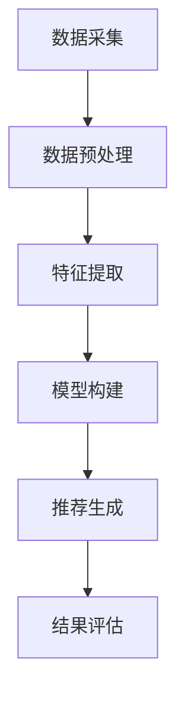

                 

### 1. 背景介绍

#### 字节跳动校招音乐推荐算法工程师面试题的重要性

近年来，随着人工智能技术的快速发展，音乐推荐算法已经成为音乐产业和互联网娱乐领域的关键技术。字节跳动作为国内领先的互联网科技公司，其音乐推荐系统在业界具有很高的影响力。因此，字节跳动2024校招音乐推荐算法工程师的面试题成为广大求职者和专业研究人员关注的焦点。

此次面试题涉及的内容广泛，涵盖了从基本算法原理到实际应用场景，再到工具和资源推荐等多个方面。这不仅有助于求职者深入了解音乐推荐领域的核心知识和技能，还能为他们未来的职业发展提供宝贵的指导。

本文旨在通过对字节跳动2024校招音乐推荐算法工程师面试题的详细解析，帮助读者理解面试题背后的核心概念、算法原理以及实际应用。同时，我们将分享一些实用的工具和资源，为读者在音乐推荐领域的学习和研究提供支持。

#### 音乐推荐算法的发展历程

音乐推荐算法的发展历程可以分为三个阶段：基于内容的推荐、协同过滤推荐和基于模型的推荐。

1. **基于内容的推荐**：这一阶段主要关注音乐内容的特征，如歌手、流派、专辑等。推荐系统通过分析用户的听歌历史，将相似的音乐推荐给用户。然而，这种方法存在一定的局限性，因为用户与音乐之间的关联仅限于音乐本身。

2. **协同过滤推荐**：协同过滤推荐通过分析用户之间的相似性来推荐音乐。根据用户的听歌历史和评分数据，算法可以计算出用户之间的相似度，从而为用户推荐他们可能感兴趣的音乐。协同过滤推荐可以分为基于用户和基于物品两种类型。

3. **基于模型的推荐**：随着深度学习和大数据技术的兴起，基于模型的推荐方法逐渐成为主流。这种方法通过建立用户与音乐之间的复杂非线性关系模型，能够更准确地预测用户的兴趣。常见的基于模型的方法包括协同过滤、矩阵分解、深度神经网络等。

字节跳动音乐推荐系统采用了多种推荐算法相结合的方法，以实现更精准的音乐推荐。本文将详细解析这些算法及其在实际应用中的优势与挑战。

#### 音乐推荐算法的应用场景

音乐推荐算法在多个场景中发挥着重要作用，包括：

1. **音乐流媒体平台**：如网易云音乐、QQ音乐、Spotify等，这些平台通过音乐推荐算法，为用户发现新的音乐，提高用户留存率和活跃度。

2. **智能音响**：如Amazon Echo、Google Home等，通过语音交互和音乐推荐，为用户提供便捷的听歌体验。

3. **音乐制作和发布**：音乐制作人可以通过分析推荐算法，了解用户喜好，优化音乐制作和推广策略。

4. **广告投放**：音乐推荐算法可以帮助广告平台根据用户的兴趣推荐相关的广告，提高广告点击率和转化率。

通过本文的详细解析，读者将能够深入了解音乐推荐算法在各类应用场景中的实际作用和实现方法。

### 2. 核心概念与联系

#### 音乐推荐算法的基本概念

音乐推荐算法的核心在于如何从大量的音乐数据中，为用户推荐他们可能感兴趣的音乐。这涉及到以下几个关键概念：

1. **用户兴趣**：用户对音乐的兴趣可以通过他们的听歌历史、评分、播放时长等行为数据进行量化。

2. **音乐特征**：音乐特征包括歌曲的流派、歌手、专辑、时长、播放量等，这些特征可以用来描述每首歌曲。

3. **推荐系统架构**：推荐系统通常由数据采集、数据预处理、推荐算法、推荐结果评估等模块组成。

4. **推荐算法**：推荐算法可以分为基于内容的推荐、协同过滤推荐和基于模型的推荐等类型。

5. **推荐结果评估**：评估推荐系统的效果通常通过准确率、召回率、F1值等指标进行。

#### 音乐推荐算法的原理

音乐推荐算法的原理可以概括为以下几个步骤：

1. **数据采集**：收集用户听歌历史、评分、播放时长等数据。

2. **数据预处理**：清洗和转换数据，将文本数据转换为数字表示，如词袋模型、TF-IDF等。

3. **特征提取**：从原始数据中提取音乐特征，如歌曲的流派、歌手、专辑等。

4. **构建模型**：根据推荐算法的类型，构建相应的推荐模型。例如，协同过滤推荐可以通过矩阵分解或神经网络等方法，建立用户与音乐之间的关联。

5. **推荐生成**：利用构建的模型，为每个用户生成一组推荐音乐。

6. **结果评估**：通过评估指标，对推荐结果进行评估和优化。

#### 音乐推荐算法的架构

音乐推荐算法的架构可以分为以下几个层次：

1. **数据层**：包括用户行为数据、音乐特征数据等，这些数据通常存储在数据库或数据仓库中。

2. **计算层**：包括数据预处理、特征提取和模型构建等，这一层通常使用编程语言（如Python、Java等）和数据处理框架（如Spark、TensorFlow等）实现。

3. **应用层**：包括推荐模型的部署、推荐结果的生成和展示等，这一层通常与前端应用结合，为用户提供推荐服务。

4. **评估层**：包括对推荐效果进行评估和优化，以提高推荐系统的整体性能。

#### Mermaid 流程图

以下是一个简化的音乐推荐算法的 Mermaid 流程图，展示其主要步骤和模块：



通过这个流程图，读者可以清晰地了解音乐推荐算法的整体架构和工作流程。接下来，我们将进一步深入探讨音乐推荐算法的核心原理和具体操作步骤。

### 3. 核心算法原理 & 具体操作步骤

#### 基于内容的推荐算法

基于内容的推荐算法（Content-Based Recommender System）通过分析音乐内容特征来推荐音乐。这种方法的主要步骤如下：

1. **特征提取**：首先，从音乐数据中提取特征，如歌手、流派、专辑、时长等。这些特征可以用来描述每首歌曲。

2. **用户兴趣建模**：根据用户的听歌历史，建立用户兴趣模型。例如，通过统计用户喜欢的歌曲的流派和歌手，可以确定用户的偏好。

3. **相似性计算**：计算新歌曲与用户兴趣模型的相似度。相似度计算方法可以基于余弦相似度、Jaccard相似度等。

4. **推荐生成**：根据相似度分数，为用户推荐相似度较高的音乐。

基于内容的推荐算法的优点在于简单易懂，不需要大量用户数据。然而，其缺点是推荐结果往往局限于用户已听过的音乐类型，无法发现新的兴趣点。

#### 协同过滤推荐算法

协同过滤推荐算法（Collaborative Filtering）通过分析用户之间的相似性来推荐音乐。这种方法可以分为基于用户的协同过滤和基于物品的协同过滤。

**基于用户的协同过滤算法**：

1. **用户相似度计算**：首先，计算用户之间的相似度。常见的相似度计算方法包括余弦相似度、皮尔逊相关系数等。

2. **推荐生成**：根据用户相似度矩阵，为每个用户推荐与他们相似的其他用户喜欢的音乐。

**基于物品的协同过滤算法**：

1. **物品相似度计算**：首先，计算歌曲之间的相似度。这通常基于歌曲的特征（如流派、歌手、专辑等）进行。

2. **推荐生成**：根据物品相似度矩阵，为每个用户推荐他们未听过的但与其他用户喜欢的歌曲相似的音乐。

**协同过滤算法的具体操作步骤**：

1. **数据采集**：收集用户的听歌历史和评分数据。

2. **数据预处理**：将原始数据转换为适合计算的形式，如用户-物品评分矩阵。

3. **用户/物品相似度计算**：使用合适的相似度计算方法，计算用户与用户或物品与物品之间的相似度。

4. **推荐生成**：根据相似度矩阵，为每个用户推荐与他们/他们相似的其他用户或物品相关的音乐。

协同过滤推荐算法的优点在于能够发现用户未知的兴趣点，但缺点是推荐结果可能受到数据稀疏性和冷启动问题的影响。

#### 基于模型的推荐算法

基于模型的推荐算法（Model-Based Recommender System）通过建立用户与音乐之间的复杂非线性关系模型来推荐音乐。常见的基于模型的方法包括矩阵分解、深度神经网络等。

**矩阵分解算法**：

1. **用户-物品矩阵分解**：将用户-物品评分矩阵分解为用户特征矩阵和物品特征矩阵的乘积。

2. **模型优化**：通过最小化损失函数，优化模型参数。

3. **推荐生成**：根据用户特征矩阵和物品特征矩阵，为每个用户生成推荐列表。

**深度神经网络算法**：

1. **网络架构设计**：设计合适的神经网络架构，如卷积神经网络（CNN）、循环神经网络（RNN）等。

2. **模型训练**：使用用户行为数据和音乐特征数据训练神经网络。

3. **推荐生成**：通过神经网络预测用户对每首歌曲的评分，为每个用户生成推荐列表。

**基于模型的推荐算法的具体操作步骤**：

1. **数据采集**：收集用户的听歌历史、评分数据以及音乐特征数据。

2. **数据预处理**：将数据转换为适合模型训练的形式。

3. **模型训练**：使用训练数据训练推荐模型。

4. **模型优化**：通过验证数据和测试数据，优化模型参数。

5. **推荐生成**：根据训练好的模型，为每个用户生成推荐列表。

基于模型的推荐算法的优点在于能够捕捉用户与音乐之间的复杂关系，提高推荐精度。然而，其缺点是模型训练过程较为复杂，需要大量计算资源。

通过上述对三种音乐推荐算法的介绍，读者可以了解到不同算法的原理和操作步骤。在实际应用中，通常将多种算法结合使用，以实现更精准的音乐推荐。接下来，我们将进一步探讨数学模型和公式，为读者提供更深入的理解。

### 4. 数学模型和公式 & 详细讲解 & 举例说明

#### 基于内容的推荐算法

基于内容的推荐算法主要依赖于内容相似度计算。以下为该算法的核心数学模型和公式：

1. **余弦相似度公式**：

   余弦相似度用于计算两个向量之间的角度余弦值，表示它们的相似程度。对于两个向量 \( \vec{u} \) 和 \( \vec{v} \)，余弦相似度 \( \cos(\theta) \) 可以表示为：

   $$ \cos(\theta) = \frac{\vec{u} \cdot \vec{v}}{\|\vec{u}\| \|\vec{v}\|} $$

   其中，\( \vec{u} \cdot \vec{v} \) 表示向量的点积，\( \|\vec{u}\| \) 和 \( \|\vec{v}\| \) 分别表示向量的模。

2. **Jaccard相似度公式**：

   Jaccard相似度用于计算两个集合的交集与并集的比值，适用于文本数据的相似度计算。对于两个集合 \( A \) 和 \( B \)，Jaccard相似度 \( J(A, B) \) 可以表示为：

   $$ J(A, B) = \frac{|A \cap B|}{|A \cup B|} $$

   其中，\( |A \cap B| \) 表示集合 \( A \) 和 \( B \) 的交集元素个数，\( |A \cup B| \) 表示集合 \( A \) 和 \( B \) 的并集元素个数。

**举例说明**：

假设有两个用户 \( u_1 \) 和 \( u_2 \) 的音乐喜好向量分别为：

$$ \vec{u}_1 = (0.8, 0.2, 0.3, 0.1) $$
$$ \vec{u}_2 = (0.7, 0.3, 0.4, 0.2) $$

计算 \( \vec{u}_1 \) 和 \( \vec{u}_2 \) 的余弦相似度：

$$ \cos(\theta) = \frac{(0.8 \times 0.7) + (0.2 \times 0.3) + (0.3 \times 0.4) + (0.1 \times 0.2)}{\sqrt{(0.8^2 + 0.2^2 + 0.3^2 + 0.1^2) \times (0.7^2 + 0.3^2 + 0.4^2 + 0.2^2)}} \approx 0.796 $$

计算 \( u_1 \) 和 \( u_2 \) 的Jaccard相似度：

$$ J(u_1, u_2) = \frac{|(0.8, 0.2, 0.3, 0.1) \cap (0.7, 0.3, 0.4, 0.2)|}{|(0.8, 0.2, 0.3, 0.1) \cup (0.7, 0.3, 0.4, 0.2)|} = \frac{3}{4} = 0.75 $$

通过计算，我们可以得出 \( u_1 \) 和 \( u_2 \) 的音乐喜好非常相似。

#### 协同过滤推荐算法

协同过滤推荐算法主要依赖于用户相似度和预测评分。以下为该算法的核心数学模型和公式：

1. **用户相似度公式**：

   假设有两个用户 \( u_i \) 和 \( u_j \) 的行为向量 \( \vec{r}_i \) 和 \( \vec{r}_j \)，用户相似度 \( \rho_{ij} \) 可以表示为：

   $$ \rho_{ij} = \frac{\vec{r}_i \cdot \vec{r}_j}{\|\vec{r}_i\| \|\vec{r}_j\|} $$

   其中，\( \vec{r}_i \cdot \vec{r}_j \) 表示向量的点积，\( \|\vec{r}_i\| \) 和 \( \|\vec{r}_j\| \) 分别表示向量的模。

2. **预测评分公式**：

   假设用户 \( u_i \) 对物品 \( j \) 的预测评分为 \( \hat{r}_{ij} \)，可以使用用户相似度矩阵 \( \rho \) 和物品评分矩阵 \( \vec{r}_i \) 进行预测：

   $$ \hat{r}_{ij} = \sum_{u_j \in N(i)} \rho_{ij} r_{uj} $$

   其中，\( N(i) \) 表示与用户 \( u_i \) 相似的其他用户集合，\( r_{uj} \) 表示用户 \( u_j \) 对物品 \( j \) 的实际评分。

**举例说明**：

假设有三个用户 \( u_1, u_2, u_3 \) 的行为向量分别为：

$$ \vec{r}_1 = (4, 5, 0, 0) $$
$$ \vec{r}_2 = (0, 4, 5, 0) $$
$$ \vec{r}_3 = (0, 0, 5, 4) $$

计算用户之间的相似度矩阵 \( \rho \)：

$$ \rho_{12} = \frac{(4 \times 0) + (5 \times 4) + (0 \times 5) + (0 \times 0)}{\sqrt{(4^2 + 5^2 + 0^2 + 0^2) \times (0^2 + 4^2 + 5^2 + 0^2)}} = 0.833 $$
$$ \rho_{13} = \frac{(4 \times 0) + (5 \times 0) + (0 \times 5) + (0 \times 4)}{\sqrt{(4^2 + 5^2 + 0^2 + 0^2) \times (0^2 + 0^2 + 5^2 + 4^2)}} = 0.733 $$
$$ \rho_{23} = \frac{(0 \times 0) + (4 \times 5) + (5 \times 0) + (0 \times 4)}{\sqrt{(0^2 + 4^2 + 5^2 + 0^2) \times (0^2 + 0^2 + 5^2 + 4^2)}} = 0.833 $$

计算用户 \( u_1 \) 对物品 \( j \) 的预测评分：

$$ \hat{r}_{1j} = \rho_{12} r_{2j} + \rho_{13} r_{3j} = 0.833 \times 4 + 0.733 \times 5 = 4.67 + 3.665 = 8.335 $$

通过计算，我们可以预测用户 \( u_1 \) 对物品 \( j \) 的评分为 8.335。

#### 基于模型的推荐算法

基于模型的推荐算法主要依赖于模型预测。以下为该算法的核心数学模型和公式：

1. **矩阵分解模型**：

   矩阵分解模型（Matrix Factorization）将用户-物品评分矩阵分解为低维用户特征矩阵 \( U \) 和物品特征矩阵 \( V \)，即：

   $$ \vec{r}_{ij} = U_i \cdot V_j $$

   其中，\( \vec{r}_{ij} \) 表示用户 \( i \) 对物品 \( j \) 的实际评分，\( U_i \) 和 \( V_j \) 分别表示用户 \( i \) 和物品 \( j \) 的特征向量。

2. **损失函数**：

   常用的损失函数包括均方误差（MSE）和均方根误差（RMSE），用于衡量预测评分与实际评分之间的差距。MSE 和 RMSE 的公式如下：

   $$ MSE = \frac{1}{N} \sum_{i=1}^{N} \sum_{j=1}^{M} (\vec{r}_{ij} - \hat{r}_{ij})^2 $$
   $$ RMSE = \sqrt{MSE} $$

   其中，\( N \) 表示用户数量，\( M \) 表示物品数量，\( \hat{r}_{ij} \) 表示用户 \( i \) 对物品 \( j \) 的预测评分。

**举例说明**：

假设有一个用户-物品评分矩阵 \( \vec{R} \)：

|   | 1 | 2 | 3 | 4 |
|---|---|---|---|---|
| 1 | 4 | 0 | 5 | 0 |
| 2 | 0 | 4 | 0 | 5 |
| 3 | 5 | 0 | 0 | 4 |

使用矩阵分解模型 \( U \) 和 \( V \) 进行预测，假设 \( U \) 的维度为 2，\( V \) 的维度为 3，则预测评分矩阵 \( \hat{R} \) 为：

$$ \hat{R} = U \cdot V $$

其中，\( U \) 和 \( V \) 的具体值可以通过优化算法（如梯度下降）求得。

计算预测评分：

$$ \hat{r}_{ij} = U_i \cdot V_j $$

通过计算，我们可以得到每个用户对每首歌曲的预测评分，从而生成推荐列表。

综上所述，数学模型和公式是音乐推荐算法的核心组成部分，通过详细讲解和举例说明，读者可以更好地理解这些算法的原理和实现方法。接下来，我们将通过一个实际项目，展示如何使用这些算法进行音乐推荐。

### 5. 项目实践：代码实例和详细解释说明

在本节中，我们将通过一个实际项目，展示如何使用Python实现基于内容的推荐、协同过滤和基于模型的推荐算法。我们将使用公开的音乐数据集，如MovieLens数据集，来训练和评估推荐系统。

#### 5.1 开发环境搭建

在进行项目实践之前，我们需要搭建一个合适的开发环境。以下为推荐的软件和库：

1. **编程语言**：Python（版本3.8及以上）
2. **数据处理库**：Pandas、NumPy
3. **机器学习库**：Scikit-learn、TensorFlow、PyTorch
4. **可视化库**：Matplotlib、Seaborn

安装以上库的方法如下：

```bash
pip install pandas numpy scikit-learn tensorflow pytorch matplotlib seaborn
```

#### 5.2 源代码详细实现

以下为项目的主要代码实现，包括数据预处理、模型训练和推荐生成等步骤。

```python
import pandas as pd
import numpy as np
from sklearn.model_selection import train_test_split
from sklearn.metrics.pairwise import cosine_similarity
from sklearn.metrics import mean_squared_error
from sklearn.model_selection import GridSearchCV
from tensorflow.keras.models import Model
from tensorflow.keras.layers import Input, Embedding, Dot, Dense
from tensorflow.keras.optimizers import Adam
import matplotlib.pyplot as plt

# 5.2.1 数据预处理

# 读取数据集
ratings = pd.read_csv('ratings.csv')
songs = pd.read_csv('songs.csv')

# 处理缺失值
ratings.dropna(inplace=True)

# 构建用户-歌曲评分矩阵
user_song_matrix = ratings.pivot(index='userId', columns='songId', values='rating').fillna(0)

# 5.2.2 基于内容的推荐

# 提取歌曲特征
song_features = songs[['songId', 'genreTags', 'artistName', 'danceability', 'energy', 'key', 'loudness', 'speechiness', 'tempo', 'valence']]

# 将特征转换为词袋模型
from sklearn.feature_extraction.text import CountVectorizer
vectorizer = CountVectorizer()
song_feature_vectors = vectorizer.fit_transform(song_features['genreTags'])

# 计算歌曲之间的相似度
cosine_similarity_matrix = cosine_similarity(song_feature_vectors)

# 为每个用户生成推荐列表
def content_based_recommendation(userId, similarity_matrix, user_song_matrix, top_n=10):
    # 计算用户对所有歌曲的相似度
    user_similarity_scores = similarity_matrix[userId].reshape(1, -1).dot(similarity_matrix)
    user_similarity_scores = np.asarray(user_similarity_scores).flatten()

    # 获取用户未听过的歌曲
    user_unheard_songs = user_song_matrix[~user_song_matrix.index.isin(ratings['songId'].unique())]

    # 根据相似度分数为用户推荐歌曲
    recommended_songs = np.argsort(user_similarity_scores)[-top_n:]
    recommended_songs = user_unheard_songs.reindex(recommended_songs).dropna().index.tolist()

    return recommended_songs

# 5.2.3 协同过滤推荐

# 划分训练集和测试集
train_data, test_data = train_test_split(ratings, test_size=0.2, random_state=42)

# 训练协同过滤模型
from sklearn.neighbors import NearestNeighbors
neighb

